cola Report for GDS2947
==================

**Date**: 2019-12-25 20:34:43 CET, **cola version**: 1.3.2

----------------------------------------------------------------

<style type='text/css'>

body, td, th {
   font-family: Arial,Helvetica,sans-serif;
   background-color: white;
   font-size: 13px;
  max-width: 800px;
  margin: auto;
  margin-left:210px;
  padding: 0px 10px 0px 10px;
  border-left: 1px solid #EEEEEE;
  line-height: 150%;
}

tt, code, pre {
   font-family: 'DejaVu Sans Mono', 'Droid Sans Mono', 'Lucida Console', Consolas, Monaco, 

monospace;
}

h1 {
   font-size:2.2em;
}

h2 {
   font-size:1.8em;
}

h3 {
   font-size:1.4em;
}

h4 {
   font-size:1.0em;
}

h5 {
   font-size:0.9em;
}

h6 {
   font-size:0.8em;
}

a {
  text-decoration: none;
  color: #0366d6;
}

a:hover {
  text-decoration: underline;
}

a:visited {
   color: #0366d6;
}

pre, img {
  max-width: 100%;
}
pre {
  overflow-x: auto;
}
pre code {
   display: block; padding: 0.5em;
}

code {
  font-size: 92%;
  border: 1px solid #ccc;
}

code[class] {
  background-color: #F8F8F8;
}

table, td, th {
  border: 1px solid #ccc;
}

blockquote {
   color:#666666;
   margin:0;
   padding-left: 1em;
   border-left: 0.5em #EEE solid;
}

hr {
   height: 0px;
   border-bottom: none;
   border-top-width: thin;
   border-top-style: dotted;
   border-top-color: #999999;
}

@media print {
   * {
      background: transparent !important;
      color: black !important;
      filter:none !important;
      -ms-filter: none !important;
   }

   body {
      font-size:12pt;
      max-width:100%;
   }

   a, a:visited {
      text-decoration: underline;
   }

   hr {
      visibility: hidden;
      page-break-before: always;
   }

   pre, blockquote {
      padding-right: 1em;
      page-break-inside: avoid;
   }

   tr, img {
      page-break-inside: avoid;
   }

   img {
      max-width: 100% !important;
   }

   @page :left {
      margin: 15mm 20mm 15mm 10mm;
   }

   @page :right {
      margin: 15mm 10mm 15mm 20mm;
   }

   p, h2, h3 {
      orphans: 3; widows: 3;
   }

   h2, h3 {
      page-break-after: avoid;
   }
}
</style>


## Summary


All available functions which can be applied to this `res_list` object:


```r
res_list
```

```
#> A 'ConsensusPartitionList' object with 24 methods.
#>   On a matrix with 51941 rows and 64 columns.
#>   Top rows are extracted by 'SD, CV, MAD, ATC' methods.
#>   Subgroups are detected by 'hclust, kmeans, skmeans, pam, mclust, NMF' method.
#>   Number of partitions are tried for k = 2, 3, 4, 5, 6.
#>   Performed in total 30000 partitions by row resampling.
#> 
#> Following methods can be applied to this 'ConsensusPartitionList' object:
#>  [1] "cola_report"           "collect_classes"       "collect_plots"         "collect_stats"        
#>  [5] "colnames"              "functional_enrichment" "get_anno_col"          "get_anno"             
#>  [9] "get_classes"           "get_matrix"            "get_membership"        "get_stats"            
#> [13] "is_best_k"             "is_stable_k"           "ncol"                  "nrow"                 
#> [17] "rownames"              "show"                  "suggest_best_k"        "test_to_known_factors"
#> [21] "top_rows_heatmap"      "top_rows_overlap"     
#> 
#> You can get result for a single method by, e.g. object["SD", "hclust"] or object["SD:hclust"]
#> or a subset of methods by object[c("SD", "CV")], c("hclust", "kmeans")]
```

The call of `run_all_consensus_partition_methods()` was:


```
#> run_all_consensus_partition_methods(data = mat, mc.cores = 4, anno = anno)
```

Dimension of the input matrix:


```r
mat = get_matrix(res_list)
dim(mat)
```

```
#> [1] 51941    64
```

### Density distribution

The density distribution for each sample is visualized as in one column in the
following heatmap. The clustering is based on the distance which is the
Kolmogorov-Smirnov statistic between two distributions.


```r
library(ComplexHeatmap)
densityHeatmap(mat, top_annotation = HeatmapAnnotation(df = get_anno(res_list), 
    col = get_anno_col(res_list)), ylab = "value", cluster_columns = TRUE, show_column_names = FALSE,
    mc.cores = 4)
```


### Suggest the best k


Folowing table shows the best `k` (number of partitions) for each combination
of top-value methods and partition methods. Clicking on the method name in
the table goes to the section for a single combination of methods.

[The cola vignette](http://bioconductor.org/packages/devel/bioc/vignettes/cola/inst/doc/cola.html#toc_13)
explains the definition of the metrics used for determining the best
number of partitions.


```r
suggest_best_k(res_list)
```


|                            | The best k| 1-PAC| Mean silhouette| Concordance|   |Optional k |
|:---------------------------|----------:|-----:|---------------:|-----------:|:--|:----------|
|[SD:kmeans](#SD-kmeans)     |          2| 1.000|           1.000|       1.000|** |           |
|[SD:skmeans](#SD-skmeans)   |          2| 1.000|           1.000|       1.000|** |           |
|[SD:pam](#SD-pam)           |          2| 1.000|           1.000|       1.000|** |           |
|[SD:mclust](#SD-mclust)     |          2| 1.000|           1.000|       1.000|** |           |
|[SD:NMF](#SD-NMF)           |          2| 1.000|           1.000|       1.000|** |           |
|[CV:kmeans](#CV-kmeans)     |          2| 1.000|           1.000|       1.000|** |           |
|[CV:skmeans](#CV-skmeans)   |          2| 1.000|           1.000|       1.000|** |           |
|[CV:pam](#CV-pam)           |          2| 1.000|           0.998|       0.999|** |           |
|[CV:mclust](#CV-mclust)     |          2| 1.000|           1.000|       1.000|** |           |
|[CV:NMF](#CV-NMF)           |          2| 1.000|           1.000|       1.000|** |           |
|[MAD:hclust](#MAD-hclust)   |          2| 1.000|           0.998|       0.999|** |           |
|[MAD:kmeans](#MAD-kmeans)   |          2| 1.000|           1.000|       1.000|** |           |
|[MAD:skmeans](#MAD-skmeans) |          2| 1.000|           1.000|       1.000|** |           |
|[MAD:pam](#MAD-pam)         |          2| 1.000|           1.000|       1.000|** |           |
|[MAD:NMF](#MAD-NMF)         |          2| 1.000|           1.000|       1.000|** |           |
|[ATC:hclust](#ATC-hclust)   |          3| 1.000|           0.973|       0.987|** |2          |
|[ATC:kmeans](#ATC-kmeans)   |          2| 1.000|           1.000|       1.000|** |           |
|[ATC:skmeans](#ATC-skmeans) |          3| 1.000|           0.989|       0.995|** |2          |
|[ATC:pam](#ATC-pam)         |          2| 1.000|           1.000|       1.000|** |           |
|[ATC:mclust](#ATC-mclust)   |          2| 1.000|           1.000|       1.000|** |           |
|[ATC:NMF](#ATC-NMF)         |          2| 1.000|           1.000|       1.000|** |           |
|[CV:hclust](#CV-hclust)     |          3| 0.918|           0.903|       0.943|*  |2          |
|[MAD:mclust](#MAD-mclust)   |          3| 0.912|           0.862|       0.936|*  |2          |
|[SD:hclust](#SD-hclust)     |          3| 0.903|           0.941|       0.959|*  |2          |

\*\*: 1-PAC > 0.95, \*: 1-PAC > 0.9


### CDF of consensus matrices

Cumulative distribution function curves of consensus matrix for all methods.


```r
collect_plots(res_list, fun = plot_ecdf)
```


### Consensus heatmap

Consensus heatmaps for all methods. ([What is a consensus heatmap?](http://bioconductor.org/packages/devel/bioc/vignettes/cola/inst/doc/cola.html#toc_9))


<style type='text/css'>


.ui-helper-hidden {
	display: none;
}
.ui-helper-hidden-accessible {
	border: 0;
	clip: rect(0 0 0 0);
	height: 1px;
	margin: -1px;
	overflow: hidden;
	padding: 0;
	position: absolute;
	width: 1px;
}
.ui-helper-reset {
	margin: 0;
	padding: 0;
	border: 0;
	outline: 0;
	line-height: 1.3;
	text-decoration: none;
	font-size: 100%;
	list-style: none;
}
.ui-helper-clearfix:before,
.ui-helper-clearfix:after {
	content: "";
	display: table;
	border-collapse: collapse;
}
.ui-helper-clearfix:after {
	clear: both;
}
.ui-helper-zfix {
	width: 100%;
	height: 100%;
	top: 0;
	left: 0;
	position: absolute;
	opacity: 0;
	filter:Alpha(Opacity=0); 
}

.ui-front {
	z-index: 100;
}


.ui-state-disabled {
	cursor: default !important;
	pointer-events: none;
}


.ui-icon {
	display: inline-block;
	vertical-align: middle;
	margin-top: -.25em;
	position: relative;
	text-indent: -99999px;
	overflow: hidden;
	background-repeat: no-repeat;
}

.ui-widget-icon-block {
	left: 50%;
	margin-left: -8px;
	display: block;
}


.ui-widget-overlay {
	position: fixed;
	top: 0;
	left: 0;
	width: 100%;
	height: 100%;
}
.ui-accordion .ui-accordion-header {
	display: block;
	cursor: pointer;
	position: relative;
	margin: 2px 0 0 0;
	padding: .5em .5em .5em .7em;
	font-size: 100%;
}
.ui-accordion .ui-accordion-content {
	padding: 1em 2.2em;
	border-top: 0;
	overflow: auto;
}
.ui-autocomplete {
	position: absolute;
	top: 0;
	left: 0;
	cursor: default;
}
.ui-menu {
	list-style: none;
	padding: 0;
	margin: 0;
	display: block;
	outline: 0;
}
.ui-menu .ui-menu {
	position: absolute;
}
.ui-menu .ui-menu-item {
	margin: 0;
	cursor: pointer;
	
	list-style-image: url("data:image/gif;base64,R0lGODlhAQABAIAAAAAAAP///yH5BAEAAAAALAAAAAABAAEAAAIBRAA7");
}
.ui-menu .ui-menu-item-wrapper {
	position: relative;
	padding: 3px 1em 3px .4em;
}
.ui-menu .ui-menu-divider {
	margin: 5px 0;
	height: 0;
	font-size: 0;
	line-height: 0;
	border-width: 1px 0 0 0;
}
.ui-menu .ui-state-focus,
.ui-menu .ui-state-active {
	margin: -1px;
}


.ui-menu-icons {
	position: relative;
}
.ui-menu-icons .ui-menu-item-wrapper {
	padding-left: 2em;
}


.ui-menu .ui-icon {
	position: absolute;
	top: 0;
	bottom: 0;
	left: .2em;
	margin: auto 0;
}


.ui-menu .ui-menu-icon {
	left: auto;
	right: 0;
}
.ui-button {
	padding: .4em 1em;
	display: inline-block;
	position: relative;
	line-height: normal;
	margin-right: .1em;
	cursor: pointer;
	vertical-align: middle;
	text-align: center;
	-webkit-user-select: none;
	-moz-user-select: none;
	-ms-user-select: none;
	user-select: none;

	
	overflow: visible;
}

.ui-button,
.ui-button:link,
.ui-button:visited,
.ui-button:hover,
.ui-button:active {
	text-decoration: none;
}


.ui-button-icon-only {
	width: 2em;
	box-sizing: border-box;
	text-indent: -9999px;
	white-space: nowrap;
}


input.ui-button.ui-button-icon-only {
	text-indent: 0;
}


.ui-button-icon-only .ui-icon {
	position: absolute;
	top: 50%;
	left: 50%;
	margin-top: -8px;
	margin-left: -8px;
}

.ui-button.ui-icon-notext .ui-icon {
	padding: 0;
	width: 2.1em;
	height: 2.1em;
	text-indent: -9999px;
	white-space: nowrap;

}

input.ui-button.ui-icon-notext .ui-icon {
	width: auto;
	height: auto;
	text-indent: 0;
	white-space: normal;
	padding: .4em 1em;
}


input.ui-button::-moz-focus-inner,
button.ui-button::-moz-focus-inner {
	border: 0;
	padding: 0;
}
.ui-controlgroup {
	vertical-align: middle;
	display: inline-block;
}
.ui-controlgroup > .ui-controlgroup-item {
	float: left;
	margin-left: 0;
	margin-right: 0;
}
.ui-controlgroup > .ui-controlgroup-item:focus,
.ui-controlgroup > .ui-controlgroup-item.ui-visual-focus {
	z-index: 9999;
}
.ui-controlgroup-vertical > .ui-controlgroup-item {
	display: block;
	float: none;
	width: 100%;
	margin-top: 0;
	margin-bottom: 0;
	text-align: left;
}
.ui-controlgroup-vertical .ui-controlgroup-item {
	box-sizing: border-box;
}
.ui-controlgroup .ui-controlgroup-label {
	padding: .4em 1em;
}
.ui-controlgroup .ui-controlgroup-label span {
	font-size: 80%;
}
.ui-controlgroup-horizontal .ui-controlgroup-label + .ui-controlgroup-item {
	border-left: none;
}
.ui-controlgroup-vertical .ui-controlgroup-label + .ui-controlgroup-item {
	border-top: none;
}
.ui-controlgroup-horizontal .ui-controlgroup-label.ui-widget-content {
	border-right: none;
}
.ui-controlgroup-vertical .ui-controlgroup-label.ui-widget-content {
	border-bottom: none;
}


.ui-controlgroup-vertical .ui-spinner-input {

	
	width: 75%;
	width: calc( 100% - 2.4em );
}
.ui-controlgroup-vertical .ui-spinner .ui-spinner-up {
	border-top-style: solid;
}

.ui-checkboxradio-label .ui-icon-background {
	box-shadow: inset 1px 1px 1px #ccc;
	border-radius: .12em;
	border: none;
}
.ui-checkboxradio-radio-label .ui-icon-background {
	width: 16px;
	height: 16px;
	border-radius: 1em;
	overflow: visible;
	border: none;
}
.ui-checkboxradio-radio-label.ui-checkboxradio-checked .ui-icon,
.ui-checkboxradio-radio-label.ui-checkboxradio-checked:hover .ui-icon {
	background-image: none;
	width: 8px;
	height: 8px;
	border-width: 4px;
	border-style: solid;
}
.ui-checkboxradio-disabled {
	pointer-events: none;
}
.ui-datepicker {
	width: 17em;
	padding: .2em .2em 0;
	display: none;
}
.ui-datepicker .ui-datepicker-header {
	position: relative;
	padding: .2em 0;
}
.ui-datepicker .ui-datepicker-prev,
.ui-datepicker .ui-datepicker-next {
	position: absolute;
	top: 2px;
	width: 1.8em;
	height: 1.8em;
}
.ui-datepicker .ui-datepicker-prev-hover,
.ui-datepicker .ui-datepicker-next-hover {
	top: 1px;
}
.ui-datepicker .ui-datepicker-prev {
	left: 2px;
}
.ui-datepicker .ui-datepicker-next {
	right: 2px;
}
.ui-datepicker .ui-datepicker-prev-hover {
	left: 1px;
}
.ui-datepicker .ui-datepicker-next-hover {
	right: 1px;
}
.ui-datepicker .ui-datepicker-prev span,
.ui-datepicker .ui-datepicker-next span {
	display: block;
	position: absolute;
	left: 50%;
	margin-left: -8px;
	top: 50%;
	margin-top: -8px;
}
.ui-datepicker .ui-datepicker-title {
	margin: 0 2.3em;
	line-height: 1.8em;
	text-align: center;
}
.ui-datepicker .ui-datepicker-title select {
	font-size: 1em;
	margin: 1px 0;
}
.ui-datepicker select.ui-datepicker-month,
.ui-datepicker select.ui-datepicker-year {
	width: 45%;
}
.ui-datepicker table {
	width: 100%;
	font-size: .9em;
	border-collapse: collapse;
	margin: 0 0 .4em;
}
.ui-datepicker th {
	padding: .7em .3em;
	text-align: center;
	font-weight: bold;
	border: 0;
}
.ui-datepicker td {
	border: 0;
	padding: 1px;
}
.ui-datepicker td span,
.ui-datepicker td a {
	display: block;
	padding: .2em;
	text-align: right;
	text-decoration: none;
}
.ui-datepicker .ui-datepicker-buttonpane {
	background-image: none;
	margin: .7em 0 0 0;
	padding: 0 .2em;
	border-left: 0;
	border-right: 0;
	border-bottom: 0;
}
.ui-datepicker .ui-datepicker-buttonpane button {
	float: right;
	margin: .5em .2em .4em;
	cursor: pointer;
	padding: .2em .6em .3em .6em;
	width: auto;
	overflow: visible;
}
.ui-datepicker .ui-datepicker-buttonpane button.ui-datepicker-current {
	float: left;
}


.ui-datepicker.ui-datepicker-multi {
	width: auto;
}
.ui-datepicker-multi .ui-datepicker-group {
	float: left;
}
.ui-datepicker-multi .ui-datepicker-group table {
	width: 95%;
	margin: 0 auto .4em;
}
.ui-datepicker-multi-2 .ui-datepicker-group {
	width: 50%;
}
.ui-datepicker-multi-3 .ui-datepicker-group {
	width: 33.3%;
}
.ui-datepicker-multi-4 .ui-datepicker-group {
	width: 25%;
}
.ui-datepicker-multi .ui-datepicker-group-last .ui-datepicker-header,
.ui-datepicker-multi .ui-datepicker-group-middle .ui-datepicker-header {
	border-left-width: 0;
}
.ui-datepicker-multi .ui-datepicker-buttonpane {
	clear: left;
}
.ui-datepicker-row-break {
	clear: both;
	width: 100%;
	font-size: 0;
}


.ui-datepicker-rtl {
	direction: rtl;
}
.ui-datepicker-rtl .ui-datepicker-prev {
	right: 2px;
	left: auto;
}
.ui-datepicker-rtl .ui-datepicker-next {
	left: 2px;
	right: auto;
}
.ui-datepicker-rtl .ui-datepicker-prev:hover {
	right: 1px;
	left: auto;
}
.ui-datepicker-rtl .ui-datepicker-next:hover {
	left: 1px;
	right: auto;
}
.ui-datepicker-rtl .ui-datepicker-buttonpane {
	clear: right;
}
.ui-datepicker-rtl .ui-datepicker-buttonpane button {
	float: left;
}
.ui-datepicker-rtl .ui-datepicker-buttonpane button.ui-datepicker-current,
.ui-datepicker-rtl .ui-datepicker-group {
	float: right;
}
.ui-datepicker-rtl .ui-datepicker-group-last .ui-datepicker-header,
.ui-datepicker-rtl .ui-datepicker-group-middle .ui-datepicker-header {
	border-right-width: 0;
	border-left-width: 1px;
}


.ui-datepicker .ui-icon {
	display: block;
	text-indent: -99999px;
	overflow: hidden;
	background-repeat: no-repeat;
	left: .5em;
	top: .3em;
}
.ui-dialog {
	position: absolute;
	top: 0;
	left: 0;
	padding: .2em;
	outline: 0;
}
.ui-dialog .ui-dialog-titlebar {
	padding: .4em 1em;
	position: relative;
}
.ui-dialog .ui-dialog-title {
	float: left;
	margin: .1em 0;
	white-space: nowrap;
	width: 90%;
	overflow: hidden;
	text-overflow: ellipsis;
}
.ui-dialog .ui-dialog-titlebar-close {
	position: absolute;
	right: .3em;
	top: 50%;
	width: 20px;
	margin: -10px 0 0 0;
	padding: 1px;
	height: 20px;
}
.ui-dialog .ui-dialog-content {
	position: relative;
	border: 0;
	padding: .5em 1em;
	background: none;
	overflow: auto;
}
.ui-dialog .ui-dialog-buttonpane {
	text-align: left;
	border-width: 1px 0 0 0;
	background-image: none;
	margin-top: .5em;
	padding: .3em 1em .5em .4em;
}
.ui-dialog .ui-dialog-buttonpane .ui-dialog-buttonset {
	float: right;
}
.ui-dialog .ui-dialog-buttonpane button {
	margin: .5em .4em .5em 0;
	cursor: pointer;
}
.ui-dialog .ui-resizable-n {
	height: 2px;
	top: 0;
}
.ui-dialog .ui-resizable-e {
	width: 2px;
	right: 0;
}
.ui-dialog .ui-resizable-s {
	height: 2px;
	bottom: 0;
}
.ui-dialog .ui-resizable-w {
	width: 2px;
	left: 0;
}
.ui-dialog .ui-resizable-se,
.ui-dialog .ui-resizable-sw,
.ui-dialog .ui-resizable-ne,
.ui-dialog .ui-resizable-nw {
	width: 7px;
	height: 7px;
}
.ui-dialog .ui-resizable-se {
	right: 0;
	bottom: 0;
}
.ui-dialog .ui-resizable-sw {
	left: 0;
	bottom: 0;
}
.ui-dialog .ui-resizable-ne {
	right: 0;
	top: 0;
}
.ui-dialog .ui-resizable-nw {
	left: 0;
	top: 0;
}
.ui-draggable .ui-dialog-titlebar {
	cursor: move;
}
.ui-draggable-handle {
	-ms-touch-action: none;
	touch-action: none;
}
.ui-resizable {
	position: relative;
}
.ui-resizable-handle {
	position: absolute;
	font-size: 0.1px;
	display: block;
	-ms-touch-action: none;
	touch-action: none;
}
.ui-resizable-disabled .ui-resizable-handle,
.ui-resizable-autohide .ui-resizable-handle {
	display: none;
}
.ui-resizable-n {
	cursor: n-resize;
	height: 7px;
	width: 100%;
	top: -5px;
	left: 0;
}
.ui-resizable-s {
	cursor: s-resize;
	height: 7px;
	width: 100%;
	bottom: -5px;
	left: 0;
}
.ui-resizable-e {
	cursor: e-resize;
	width: 7px;
	right: -5px;
	top: 0;
	height: 100%;
}
.ui-resizable-w {
	cursor: w-resize;
	width: 7px;
	left: -5px;
	top: 0;
	height: 100%;
}
.ui-resizable-se {
	cursor: se-resize;
	width: 12px;
	height: 12px;
	right: 1px;
	bottom: 1px;
}
.ui-resizable-sw {
	cursor: sw-resize;
	width: 9px;
	height: 9px;
	left: -5px;
	bottom: -5px;
}
.ui-resizable-nw {
	cursor: nw-resize;
	width: 9px;
	height: 9px;
	left: -5px;
	top: -5px;
}
.ui-resizable-ne {
	cursor: ne-resize;
	width: 9px;
	height: 9px;
	right: -5px;
	top: -5px;
}
.ui-progressbar {
	height: 2em;
	text-align: left;
	overflow: hidden;
}
.ui-progressbar .ui-progressbar-value {
	margin: -1px;
	height: 100%;
}
.ui-progressbar .ui-progressbar-overlay {
	background: url("data:image/gif;base64,R0lGODlhKAAoAIABAAAAAP///yH/C05FVFNDQVBFMi4wAwEAAAAh+QQJAQABACwAAAAAKAAoAAACkYwNqXrdC52DS06a7MFZI+4FHBCKoDeWKXqymPqGqxvJrXZbMx7Ttc+w9XgU2FB3lOyQRWET2IFGiU9m1frDVpxZZc6bfHwv4c1YXP6k1Vdy292Fb6UkuvFtXpvWSzA+HycXJHUXiGYIiMg2R6W459gnWGfHNdjIqDWVqemH2ekpObkpOlppWUqZiqr6edqqWQAAIfkECQEAAQAsAAAAACgAKAAAApSMgZnGfaqcg1E2uuzDmmHUBR8Qil95hiPKqWn3aqtLsS18y7G1SzNeowWBENtQd+T1JktP05nzPTdJZlR6vUxNWWjV+vUWhWNkWFwxl9VpZRedYcflIOLafaa28XdsH/ynlcc1uPVDZxQIR0K25+cICCmoqCe5mGhZOfeYSUh5yJcJyrkZWWpaR8doJ2o4NYq62lAAACH5BAkBAAEALAAAAAAoACgAAAKVDI4Yy22ZnINRNqosw0Bv7i1gyHUkFj7oSaWlu3ovC8GxNso5fluz3qLVhBVeT/Lz7ZTHyxL5dDalQWPVOsQWtRnuwXaFTj9jVVh8pma9JjZ4zYSj5ZOyma7uuolffh+IR5aW97cHuBUXKGKXlKjn+DiHWMcYJah4N0lYCMlJOXipGRr5qdgoSTrqWSq6WFl2ypoaUAAAIfkECQEAAQAsAAAAACgAKAAAApaEb6HLgd/iO7FNWtcFWe+ufODGjRfoiJ2akShbueb0wtI50zm02pbvwfWEMWBQ1zKGlLIhskiEPm9R6vRXxV4ZzWT2yHOGpWMyorblKlNp8HmHEb/lCXjcW7bmtXP8Xt229OVWR1fod2eWqNfHuMjXCPkIGNileOiImVmCOEmoSfn3yXlJWmoHGhqp6ilYuWYpmTqKUgAAIfkECQEAAQAsAAAAACgAKAAAApiEH6kb58biQ3FNWtMFWW3eNVcojuFGfqnZqSebuS06w5V80/X02pKe8zFwP6EFWOT1lDFk8rGERh1TTNOocQ61Hm4Xm2VexUHpzjymViHrFbiELsefVrn6XKfnt2Q9G/+Xdie499XHd2g4h7ioOGhXGJboGAnXSBnoBwKYyfioubZJ2Hn0RuRZaflZOil56Zp6iioKSXpUAAAh+QQJAQABACwAAAAAKAAoAAACkoQRqRvnxuI7kU1a1UU5bd5tnSeOZXhmn5lWK3qNTWvRdQxP8qvaC+/yaYQzXO7BMvaUEmJRd3TsiMAgswmNYrSgZdYrTX6tSHGZO73ezuAw2uxuQ+BbeZfMxsexY35+/Qe4J1inV0g4x3WHuMhIl2jXOKT2Q+VU5fgoSUI52VfZyfkJGkha6jmY+aaYdirq+lQAACH5BAkBAAEALAAAAAAoACgAAAKWBIKpYe0L3YNKToqswUlvznigd4wiR4KhZrKt9Upqip61i9E3vMvxRdHlbEFiEXfk9YARYxOZZD6VQ2pUunBmtRXo1Lf8hMVVcNl8JafV38aM2/Fu5V16Bn63r6xt97j09+MXSFi4BniGFae3hzbH9+hYBzkpuUh5aZmHuanZOZgIuvbGiNeomCnaxxap2upaCZsq+1kAACH5BAkBAAEALAAAAAAoACgAAAKXjI8By5zf4kOxTVrXNVlv1X0d8IGZGKLnNpYtm8Lr9cqVeuOSvfOW79D9aDHizNhDJidFZhNydEahOaDH6nomtJjp1tutKoNWkvA6JqfRVLHU/QUfau9l2x7G54d1fl995xcIGAdXqMfBNadoYrhH+Mg2KBlpVpbluCiXmMnZ2Sh4GBqJ+ckIOqqJ6LmKSllZmsoq6wpQAAAh+QQJAQABACwAAAAAKAAoAAAClYx/oLvoxuJDkU1a1YUZbJ59nSd2ZXhWqbRa2/gF8Gu2DY3iqs7yrq+xBYEkYvFSM8aSSObE+ZgRl1BHFZNr7pRCavZ5BW2142hY3AN/zWtsmf12p9XxxFl2lpLn1rseztfXZjdIWIf2s5dItwjYKBgo9yg5pHgzJXTEeGlZuenpyPmpGQoKOWkYmSpaSnqKileI2FAAACH5BAkBAAEALAAAAAAoACgAAAKVjB+gu+jG4kORTVrVhRlsnn2dJ3ZleFaptFrb+CXmO9OozeL5VfP99HvAWhpiUdcwkpBH3825AwYdU8xTqlLGhtCosArKMpvfa1mMRae9VvWZfeB2XfPkeLmm18lUcBj+p5dnN8jXZ3YIGEhYuOUn45aoCDkp16hl5IjYJvjWKcnoGQpqyPlpOhr3aElaqrq56Bq7VAAAOw==");
	height: 100%;
	filter: alpha(opacity=25); 
	opacity: 0.25;
}
.ui-progressbar-indeterminate .ui-progressbar-value {
	background-image: none;
}
.ui-selectable {
	-ms-touch-action: none;
	touch-action: none;
}
.ui-selectable-helper {
	position: absolute;
	z-index: 100;
	border: 1px dotted black;
}
.ui-selectmenu-menu {
	padding: 0;
	margin: 0;
	position: absolute;
	top: 0;
	left: 0;
	display: none;
}
.ui-selectmenu-menu .ui-menu {
	overflow: auto;
	overflow-x: hidden;
	padding-bottom: 1px;
}
.ui-selectmenu-menu .ui-menu .ui-selectmenu-optgroup {
	font-size: 1em;
	font-weight: bold;
	line-height: 1.5;
	padding: 2px 0.4em;
	margin: 0.5em 0 0 0;
	height: auto;
	border: 0;
}
.ui-selectmenu-open {
	display: block;
}
.ui-selectmenu-text {
	display: block;
	margin-right: 20px;
	overflow: hidden;
	text-overflow: ellipsis;
}
.ui-selectmenu-button.ui-button {
	text-align: left;
	white-space: nowrap;
	width: 14em;
}
.ui-selectmenu-icon.ui-icon {
	float: right;
	margin-top: 0;
}
.ui-slider {
	position: relative;
	text-align: left;
}
.ui-slider .ui-slider-handle {
	position: absolute;
	z-index: 2;
	width: 1.2em;
	height: 1.2em;
	cursor: default;
	-ms-touch-action: none;
	touch-action: none;
}
.ui-slider .ui-slider-range {
	position: absolute;
	z-index: 1;
	font-size: .7em;
	display: block;
	border: 0;
	background-position: 0 0;
}


.ui-slider.ui-state-disabled .ui-slider-handle,
.ui-slider.ui-state-disabled .ui-slider-range {
	filter: inherit;
}

.ui-slider-horizontal {
	height: .8em;
}
.ui-slider-horizontal .ui-slider-handle {
	top: -.3em;
	margin-left: -.6em;
}
.ui-slider-horizontal .ui-slider-range {
	top: 0;
	height: 100%;
}
.ui-slider-horizontal .ui-slider-range-min {
	left: 0;
}
.ui-slider-horizontal .ui-slider-range-max {
	right: 0;
}

.ui-slider-vertical {
	width: .8em;
	height: 100px;
}
.ui-slider-vertical .ui-slider-handle {
	left: -.3em;
	margin-left: 0;
	margin-bottom: -.6em;
}
.ui-slider-vertical .ui-slider-range {
	left: 0;
	width: 100%;
}
.ui-slider-vertical .ui-slider-range-min {
	bottom: 0;
}
.ui-slider-vertical .ui-slider-range-max {
	top: 0;
}
.ui-sortable-handle {
	-ms-touch-action: none;
	touch-action: none;
}
.ui-spinner {
	position: relative;
	display: inline-block;
	overflow: hidden;
	padding: 0;
	vertical-align: middle;
}
.ui-spinner-input {
	border: none;
	background: none;
	color: inherit;
	padding: .222em 0;
	margin: .2em 0;
	vertical-align: middle;
	margin-left: .4em;
	margin-right: 2em;
}
.ui-spinner-button {
	width: 1.6em;
	height: 50%;
	font-size: .5em;
	padding: 0;
	margin: 0;
	text-align: center;
	position: absolute;
	cursor: default;
	display: block;
	overflow: hidden;
	right: 0;
}

.ui-spinner a.ui-spinner-button {
	border-top-style: none;
	border-bottom-style: none;
	border-right-style: none;
}
.ui-spinner-up {
	top: 0;
}
.ui-spinner-down {
	bottom: 0;
}
.ui-tabs {
	position: relative;
	padding: .2em;
}
.ui-tabs .ui-tabs-nav {
	margin: 0;
	padding: .2em .2em 0;
}
.ui-tabs .ui-tabs-nav li {
	list-style: none;
	float: left;
	position: relative;
	top: 0;
	margin: 1px .2em 0 0;
	border-bottom-width: 0;
	padding: 0;
	white-space: nowrap;
}
.ui-tabs .ui-tabs-nav .ui-tabs-anchor {
	float: left;
	padding: .5em 1em;
	text-decoration: none;
}
.ui-tabs .ui-tabs-nav li.ui-tabs-active {
	margin-bottom: -1px;
	padding-bottom: 1px;
}
.ui-tabs .ui-tabs-nav li.ui-tabs-active .ui-tabs-anchor,
.ui-tabs .ui-tabs-nav li.ui-state-disabled .ui-tabs-anchor,
.ui-tabs .ui-tabs-nav li.ui-tabs-loading .ui-tabs-anchor {
	cursor: text;
}
.ui-tabs-collapsible .ui-tabs-nav li.ui-tabs-active .ui-tabs-anchor {
	cursor: pointer;
}
.ui-tabs .ui-tabs-panel {
	display: block;
	border-width: 0;
	padding: 1em 1.4em;
	background: none;
}
.ui-tooltip {
	padding: 8px;
	position: absolute;
	z-index: 9999;
	max-width: 300px;
}
body .ui-tooltip {
	border-width: 2px;
}

.ui-widget {
	font-family: Arial,Helvetica,sans-serif;
	font-size: 1em;
}
.ui-widget .ui-widget {
	font-size: 1em;
}
.ui-widget input,
.ui-widget select,
.ui-widget textarea,
.ui-widget button {
	font-family: Arial,Helvetica,sans-serif;
	font-size: 1em;
}
.ui-widget.ui-widget-content {
	border: 1px solid #c5c5c5;
}
.ui-widget-content {
	border: 1px solid #dddddd;
	background: #ffffff;
	color: #333333;
}
.ui-widget-content a {
	color: #333333;
}
.ui-widget-header {
	border: 1px solid #dddddd;
	background: #e9e9e9;
	color: #333333;
	font-weight: bold;
}
.ui-widget-header a {
	color: #333333;
}


.ui-state-default,
.ui-widget-content .ui-state-default,
.ui-widget-header .ui-state-default,
.ui-button,


html .ui-button.ui-state-disabled:hover,
html .ui-button.ui-state-disabled:active {
	border: 1px solid #c5c5c5;
	background: #f6f6f6;
	font-weight: normal;
	color: #454545;
}
.ui-state-default a,
.ui-state-default a:link,
.ui-state-default a:visited,
a.ui-button,
a:link.ui-button,
a:visited.ui-button,
.ui-button {
	color: #454545;
	text-decoration: none;
}
.ui-state-hover,
.ui-widget-content .ui-state-hover,
.ui-widget-header .ui-state-hover,
.ui-state-focus,
.ui-widget-content .ui-state-focus,
.ui-widget-header .ui-state-focus,
.ui-button:hover,
.ui-button:focus {
	border: 1px solid #cccccc;
	background: #ededed;
	font-weight: normal;
	color: #2b2b2b;
}
.ui-state-hover a,
.ui-state-hover a:hover,
.ui-state-hover a:link,
.ui-state-hover a:visited,
.ui-state-focus a,
.ui-state-focus a:hover,
.ui-state-focus a:link,
.ui-state-focus a:visited,
a.ui-button:hover,
a.ui-button:focus {
	color: #2b2b2b;
	text-decoration: none;
}

.ui-visual-focus {
	box-shadow: 0 0 3px 1px rgb(94, 158, 214);
}
.ui-state-active,
.ui-widget-content .ui-state-active,
.ui-widget-header .ui-state-active,
a.ui-button:active,
.ui-button:active,
.ui-button.ui-state-active:hover {
	border: 1px solid #003eff;
	background: #007fff;
	font-weight: normal;
	color: #ffffff;
}
.ui-icon-background,
.ui-state-active .ui-icon-background {
	border: #003eff;
	background-color: #ffffff;
}
.ui-state-active a,
.ui-state-active a:link,
.ui-state-active a:visited {
	color: #ffffff;
	text-decoration: none;
}


.ui-state-highlight,
.ui-widget-content .ui-state-highlight,
.ui-widget-header .ui-state-highlight {
	border: 1px solid #dad55e;
	background: #fffa90;
	color: #777620;
}
.ui-state-checked {
	border: 1px solid #dad55e;
	background: #fffa90;
}
.ui-state-highlight a,
.ui-widget-content .ui-state-highlight a,
.ui-widget-header .ui-state-highlight a {
	color: #777620;
}
.ui-state-error,
.ui-widget-content .ui-state-error,
.ui-widget-header .ui-state-error {
	border: 1px solid #f1a899;
	background: #fddfdf;
	color: #5f3f3f;
}
.ui-state-error a,
.ui-widget-content .ui-state-error a,
.ui-widget-header .ui-state-error a {
	color: #5f3f3f;
}
.ui-state-error-text,
.ui-widget-content .ui-state-error-text,
.ui-widget-header .ui-state-error-text {
	color: #5f3f3f;
}
.ui-priority-primary,
.ui-widget-content .ui-priority-primary,
.ui-widget-header .ui-priority-primary {
	font-weight: bold;
}
.ui-priority-secondary,
.ui-widget-content .ui-priority-secondary,
.ui-widget-header .ui-priority-secondary {
	opacity: .7;
	filter:Alpha(Opacity=70); 
	font-weight: normal;
}
.ui-state-disabled,
.ui-widget-content .ui-state-disabled,
.ui-widget-header .ui-state-disabled {
	opacity: .35;
	filter:Alpha(Opacity=35); 
	background-image: none;
}
.ui-state-disabled .ui-icon {
	filter:Alpha(Opacity=35); 
}


.ui-icon {
	width: 16px;
	height: 16px;
}
.ui-icon,
.ui-widget-content .ui-icon {
	background-image: url("images/ui-icons_444444_256x240.png");
}
.ui-widget-header .ui-icon {
	background-image: url("images/ui-icons_444444_256x240.png");
}
.ui-state-hover .ui-icon,
.ui-state-focus .ui-icon,
.ui-button:hover .ui-icon,
.ui-button:focus .ui-icon {
	background-image: url("images/ui-icons_555555_256x240.png");
}
.ui-state-active .ui-icon,
.ui-button:active .ui-icon {
	background-image: url("images/ui-icons_ffffff_256x240.png");
}
.ui-state-highlight .ui-icon,
.ui-button .ui-state-highlight.ui-icon {
	background-image: url("images/ui-icons_777620_256x240.png");
}
.ui-state-error .ui-icon,
.ui-state-error-text .ui-icon {
	background-image: url("images/ui-icons_cc0000_256x240.png");
}
.ui-button .ui-icon {
	background-image: url("images/ui-icons_777777_256x240.png");
}


.ui-icon-blank { background-position: 16px 16px; }
.ui-icon-caret-1-n { background-position: 0 0; }
.ui-icon-caret-1-ne { background-position: -16px 0; }
.ui-icon-caret-1-e { background-position: -32px 0; }
.ui-icon-caret-1-se { background-position: -48px 0; }
.ui-icon-caret-1-s { background-position: -65px 0; }
.ui-icon-caret-1-sw { background-position: -80px 0; }
.ui-icon-caret-1-w { background-position: -96px 0; }
.ui-icon-caret-1-nw { background-position: -112px 0; }
.ui-icon-caret-2-n-s { background-position: -128px 0; }
.ui-icon-caret-2-e-w { background-position: -144px 0; }
.ui-icon-triangle-1-n { background-position: 0 -16px; }
.ui-icon-triangle-1-ne { background-position: -16px -16px; }
.ui-icon-triangle-1-e { background-position: -32px -16px; }
.ui-icon-triangle-1-se { background-position: -48px -16px; }
.ui-icon-triangle-1-s { background-position: -65px -16px; }
.ui-icon-triangle-1-sw { background-position: -80px -16px; }
.ui-icon-triangle-1-w { background-position: -96px -16px; }
.ui-icon-triangle-1-nw { background-position: -112px -16px; }
.ui-icon-triangle-2-n-s { background-position: -128px -16px; }
.ui-icon-triangle-2-e-w { background-position: -144px -16px; }
.ui-icon-arrow-1-n { background-position: 0 -32px; }
.ui-icon-arrow-1-ne { background-position: -16px -32px; }
.ui-icon-arrow-1-e { background-position: -32px -32px; }
.ui-icon-arrow-1-se { background-position: -48px -32px; }
.ui-icon-arrow-1-s { background-position: -65px -32px; }
.ui-icon-arrow-1-sw { background-position: -80px -32px; }
.ui-icon-arrow-1-w { background-position: -96px -32px; }
.ui-icon-arrow-1-nw { background-position: -112px -32px; }
.ui-icon-arrow-2-n-s { background-position: -128px -32px; }
.ui-icon-arrow-2-ne-sw { background-position: -144px -32px; }
.ui-icon-arrow-2-e-w { background-position: -160px -32px; }
.ui-icon-arrow-2-se-nw { background-position: -176px -32px; }
.ui-icon-arrowstop-1-n { background-position: -192px -32px; }
.ui-icon-arrowstop-1-e { background-position: -208px -32px; }
.ui-icon-arrowstop-1-s { background-position: -224px -32px; }
.ui-icon-arrowstop-1-w { background-position: -240px -32px; }
.ui-icon-arrowthick-1-n { background-position: 1px -48px; }
.ui-icon-arrowthick-1-ne { background-position: -16px -48px; }
.ui-icon-arrowthick-1-e { background-position: -32px -48px; }
.ui-icon-arrowthick-1-se { background-position: -48px -48px; }
.ui-icon-arrowthick-1-s { background-position: -64px -48px; }
.ui-icon-arrowthick-1-sw { background-position: -80px -48px; }
.ui-icon-arrowthick-1-w { background-position: -96px -48px; }
.ui-icon-arrowthick-1-nw { background-position: -112px -48px; }
.ui-icon-arrowthick-2-n-s { background-position: -128px -48px; }
.ui-icon-arrowthick-2-ne-sw { background-position: -144px -48px; }
.ui-icon-arrowthick-2-e-w { background-position: -160px -48px; }
.ui-icon-arrowthick-2-se-nw { background-position: -176px -48px; }
.ui-icon-arrowthickstop-1-n { background-position: -192px -48px; }
.ui-icon-arrowthickstop-1-e { background-position: -208px -48px; }
.ui-icon-arrowthickstop-1-s { background-position: -224px -48px; }
.ui-icon-arrowthickstop-1-w { background-position: -240px -48px; }
.ui-icon-arrowreturnthick-1-w { background-position: 0 -64px; }
.ui-icon-arrowreturnthick-1-n { background-position: -16px -64px; }
.ui-icon-arrowreturnthick-1-e { background-position: -32px -64px; }
.ui-icon-arrowreturnthick-1-s { background-position: -48px -64px; }
.ui-icon-arrowreturn-1-w { background-position: -64px -64px; }
.ui-icon-arrowreturn-1-n { background-position: -80px -64px; }
.ui-icon-arrowreturn-1-e { background-position: -96px -64px; }
.ui-icon-arrowreturn-1-s { background-position: -112px -64px; }
.ui-icon-arrowrefresh-1-w { background-position: -128px -64px; }
.ui-icon-arrowrefresh-1-n { background-position: -144px -64px; }
.ui-icon-arrowrefresh-1-e { background-position: -160px -64px; }
.ui-icon-arrowrefresh-1-s { background-position: -176px -64px; }
.ui-icon-arrow-4 { background-position: 0 -80px; }
.ui-icon-arrow-4-diag { background-position: -16px -80px; }
.ui-icon-extlink { background-position: -32px -80px; }
.ui-icon-newwin { background-position: -48px -80px; }
.ui-icon-refresh { background-position: -64px -80px; }
.ui-icon-shuffle { background-position: -80px -80px; }
.ui-icon-transfer-e-w { background-position: -96px -80px; }
.ui-icon-transferthick-e-w { background-position: -112px -80px; }
.ui-icon-folder-collapsed { background-position: 0 -96px; }
.ui-icon-folder-open { background-position: -16px -96px; }
.ui-icon-document { background-position: -32px -96px; }
.ui-icon-document-b { background-position: -48px -96px; }
.ui-icon-note { background-position: -64px -96px; }
.ui-icon-mail-closed { background-position: -80px -96px; }
.ui-icon-mail-open { background-position: -96px -96px; }
.ui-icon-suitcase { background-position: -112px -96px; }
.ui-icon-comment { background-position: -128px -96px; }
.ui-icon-person { background-position: -144px -96px; }
.ui-icon-print { background-position: -160px -96px; }
.ui-icon-trash { background-position: -176px -96px; }
.ui-icon-locked { background-position: -192px -96px; }
.ui-icon-unlocked { background-position: -208px -96px; }
.ui-icon-bookmark { background-position: -224px -96px; }
.ui-icon-tag { background-position: -240px -96px; }
.ui-icon-home { background-position: 0 -112px; }
.ui-icon-flag { background-position: -16px -112px; }
.ui-icon-calendar { background-position: -32px -112px; }
.ui-icon-cart { background-position: -48px -112px; }
.ui-icon-pencil { background-position: -64px -112px; }
.ui-icon-clock { background-position: -80px -112px; }
.ui-icon-disk { background-position: -96px -112px; }
.ui-icon-calculator { background-position: -112px -112px; }
.ui-icon-zoomin { background-position: -128px -112px; }
.ui-icon-zoomout { background-position: -144px -112px; }
.ui-icon-search { background-position: -160px -112px; }
.ui-icon-wrench { background-position: -176px -112px; }
.ui-icon-gear { background-position: -192px -112px; }
.ui-icon-heart { background-position: -208px -112px; }
.ui-icon-star { background-position: -224px -112px; }
.ui-icon-link { background-position: -240px -112px; }
.ui-icon-cancel { background-position: 0 -128px; }
.ui-icon-plus { background-position: -16px -128px; }
.ui-icon-plusthick { background-position: -32px -128px; }
.ui-icon-minus { background-position: -48px -128px; }
.ui-icon-minusthick { background-position: -64px -128px; }
.ui-icon-close { background-position: -80px -128px; }
.ui-icon-closethick { background-position: -96px -128px; }
.ui-icon-key { background-position: -112px -128px; }
.ui-icon-lightbulb { background-position: -128px -128px; }
.ui-icon-scissors { background-position: -144px -128px; }
.ui-icon-clipboard { background-position: -160px -128px; }
.ui-icon-copy { background-position: -176px -128px; }
.ui-icon-contact { background-position: -192px -128px; }
.ui-icon-image { background-position: -208px -128px; }
.ui-icon-video { background-position: -224px -128px; }
.ui-icon-script { background-position: -240px -128px; }
.ui-icon-alert { background-position: 0 -144px; }
.ui-icon-info { background-position: -16px -144px; }
.ui-icon-notice { background-position: -32px -144px; }
.ui-icon-help { background-position: -48px -144px; }
.ui-icon-check { background-position: -64px -144px; }
.ui-icon-bullet { background-position: -80px -144px; }
.ui-icon-radio-on { background-position: -96px -144px; }
.ui-icon-radio-off { background-position: -112px -144px; }
.ui-icon-pin-w { background-position: -128px -144px; }
.ui-icon-pin-s { background-position: -144px -144px; }
.ui-icon-play { background-position: 0 -160px; }
.ui-icon-pause { background-position: -16px -160px; }
.ui-icon-seek-next { background-position: -32px -160px; }
.ui-icon-seek-prev { background-position: -48px -160px; }
.ui-icon-seek-end { background-position: -64px -160px; }
.ui-icon-seek-start { background-position: -80px -160px; }

.ui-icon-seek-first { background-position: -80px -160px; }
.ui-icon-stop { background-position: -96px -160px; }
.ui-icon-eject { background-position: -112px -160px; }
.ui-icon-volume-off { background-position: -128px -160px; }
.ui-icon-volume-on { background-position: -144px -160px; }
.ui-icon-power { background-position: 0 -176px; }
.ui-icon-signal-diag { background-position: -16px -176px; }
.ui-icon-signal { background-position: -32px -176px; }
.ui-icon-battery-0 { background-position: -48px -176px; }
.ui-icon-battery-1 { background-position: -64px -176px; }
.ui-icon-battery-2 { background-position: -80px -176px; }
.ui-icon-battery-3 { background-position: -96px -176px; }
.ui-icon-circle-plus { background-position: 0 -192px; }
.ui-icon-circle-minus { background-position: -16px -192px; }
.ui-icon-circle-close { background-position: -32px -192px; }
.ui-icon-circle-triangle-e { background-position: -48px -192px; }
.ui-icon-circle-triangle-s { background-position: -64px -192px; }
.ui-icon-circle-triangle-w { background-position: -80px -192px; }
.ui-icon-circle-triangle-n { background-position: -96px -192px; }
.ui-icon-circle-arrow-e { background-position: -112px -192px; }
.ui-icon-circle-arrow-s { background-position: -128px -192px; }
.ui-icon-circle-arrow-w { background-position: -144px -192px; }
.ui-icon-circle-arrow-n { background-position: -160px -192px; }
.ui-icon-circle-zoomin { background-position: -176px -192px; }
.ui-icon-circle-zoomout { background-position: -192px -192px; }
.ui-icon-circle-check { background-position: -208px -192px; }
.ui-icon-circlesmall-plus { background-position: 0 -208px; }
.ui-icon-circlesmall-minus { background-position: -16px -208px; }
.ui-icon-circlesmall-close { background-position: -32px -208px; }
.ui-icon-squaresmall-plus { background-position: -48px -208px; }
.ui-icon-squaresmall-minus { background-position: -64px -208px; }
.ui-icon-squaresmall-close { background-position: -80px -208px; }
.ui-icon-grip-dotted-vertical { background-position: 0 -224px; }
.ui-icon-grip-dotted-horizontal { background-position: -16px -224px; }
.ui-icon-grip-solid-vertical { background-position: -32px -224px; }
.ui-icon-grip-solid-horizontal { background-position: -48px -224px; }
.ui-icon-gripsmall-diagonal-se { background-position: -64px -224px; }
.ui-icon-grip-diagonal-se { background-position: -80px -224px; }


.ui-corner-all,
.ui-corner-top,
.ui-corner-left,
.ui-corner-tl {
	border-top-left-radius: 3px;
}
.ui-corner-all,
.ui-corner-top,
.ui-corner-right,
.ui-corner-tr {
	border-top-right-radius: 3px;
}
.ui-corner-all,
.ui-corner-bottom,
.ui-corner-left,
.ui-corner-bl {
	border-bottom-left-radius: 3px;
}
.ui-corner-all,
.ui-corner-bottom,
.ui-corner-right,
.ui-corner-br {
	border-bottom-right-radius: 3px;
}


.ui-widget-overlay {
	background: #aaaaaa;
	opacity: .3;
	filter: Alpha(Opacity=30); 
}
.ui-widget-shadow {
	-webkit-box-shadow: 0px 0px 5px #666666;
	box-shadow: 0px 0px 5px #666666;
} 
</style>
<script src='js/jquery-1.12.4.js'></script>
<script src='js/jquery-ui.js'></script>

<script>
$( function() {
	$( '#tabs-collect-consensus-heatmap' ).tabs();
} );
</script>
<div id='tabs-collect-consensus-heatmap'>
<ul>
<li><a href='#tab-collect-consensus-heatmap-1'>k = 2</a></li>
<li><a href='#tab-collect-consensus-heatmap-2'>k = 3</a></li>
<li><a href='#tab-collect-consensus-heatmap-3'>k = 4</a></li>
<li><a href='#tab-collect-consensus-heatmap-4'>k = 5</a></li>
<li><a href='#tab-collect-consensus-heatmap-5'>k = 6</a></li>
</ul>
<div id='tab-collect-consensus-heatmap-1'>
<pre><code class="r">collect_plots(res_list, k = 2, fun = consensus_heatmap, mc.cores = 4)
</code></pre>

<p></p>

</div>
<div id='tab-collect-consensus-heatmap-2'>
<pre><code class="r">collect_plots(res_list, k = 3, fun = consensus_heatmap, mc.cores = 4)
</code></pre>

<p></p>

</div>
<div id='tab-collect-consensus-heatmap-3'>
<pre><code class="r">collect_plots(res_list, k = 4, fun = consensus_heatmap, mc.cores = 4)
</code></pre>

<p></p>

</div>
<div id='tab-collect-consensus-heatmap-4'>
<pre><code class="r">collect_plots(res_list, k = 5, fun = consensus_heatmap, mc.cores = 4)
</code></pre>

<p></p>

</div>
<div id='tab-collect-consensus-heatmap-5'>
<pre><code class="r">collect_plots(res_list, k = 6, fun = consensus_heatmap, mc.cores = 4)
</code></pre>

<p></p>

</div>
</div>


### Membership heatmap

Membership heatmaps for all methods. ([What is a membership heatmap?](http://bioconductor.org/packages/devel/bioc/vignettes/cola/inst/doc/cola.html#toc_12))


<script>
$( function() {
	$( '#tabs-collect-membership-heatmap' ).tabs();
} );
</script>
<div id='tabs-collect-membership-heatmap'>
<ul>
<li><a href='#tab-collect-membership-heatmap-1'>k = 2</a></li>
<li><a href='#tab-collect-membership-heatmap-2'>k = 3</a></li>
<li><a href='#tab-collect-membership-heatmap-3'>k = 4</a></li>
<li><a href='#tab-collect-membership-heatmap-4'>k = 5</a></li>
<li><a href='#tab-collect-membership-heatmap-5'>k = 6</a></li>
</ul>
<div id='tab-collect-membership-heatmap-1'>
<pre><code class="r">collect_plots(res_list, k = 2, fun = membership_heatmap, mc.cores = 4)
</code></pre>

<p></p>

</div>
<div id='tab-collect-membership-heatmap-2'>
<pre><code class="r">collect_plots(res_list, k = 3, fun = membership_heatmap, mc.cores = 4)
</code></pre>

<p></p>

</div>
<div id='tab-collect-membership-heatmap-3'>
<pre><code class="r">collect_plots(res_list, k = 4, fun = membership_heatmap, mc.cores = 4)
</code></pre>

<p></p>

</div>
<div id='tab-collect-membership-heatmap-4'>
<pre><code class="r">collect_plots(res_list, k = 5, fun = membership_heatmap, mc.cores = 4)
</code></pre>

<p></p>

</div>
<div id='tab-collect-membership-heatmap-5'>
<pre><code class="r">collect_plots(res_list, k = 6, fun = membership_heatmap, mc.cores = 4)
</code></pre>

<p></p>

</div>
</div>


### Signature heatmap

Signature heatmaps for all methods. ([What is a signature heatmap?](http://bioconductor.org/packages/devel/bioc/vignettes/cola/inst/doc/cola.html#toc_22))


Note in following heatmaps, rows are scaled.


<script>
$( function() {
	$( '#tabs-collect-get-signatures' ).tabs();
} );
</script>
<div id='tabs-collect-get-signatures'>
<ul>
<li><a href='#tab-collect-get-signatures-1'>k = 2</a></li>
<li><a href='#tab-collect-get-signatures-2'>k = 3</a></li>
<li><a href='#tab-collect-get-signatures-3'>k = 4</a></li>
<li><a href='#tab-collect-get-signatures-4'>k = 5</a></li>
<li><a href='#tab-collect-get-signatures-5'>k = 6</a></li>
</ul>
<div id='tab-collect-get-signatures-1'>
<pre><code class="r">collect_plots(res_list, k = 2, fun = get_signatures, mc.cores = 4)
</code></pre>

<p></p>

</div>
<div id='tab-collect-get-signatures-2'>
<pre><code class="r">collect_plots(res_list, k = 3, fun = get_signatures, mc.cores = 4)
</code></pre>

<p></p>

</div>
<div id='tab-collect-get-signatures-3'>
<pre><code class="r">collect_plots(res_list, k = 4, fun = get_signatures, mc.cores = 4)
</code></pre>

<p></p>

</div>
<div id='tab-collect-get-signatures-4'>
<pre><code class="r">collect_plots(res_list, k = 5, fun = get_signatures, mc.cores = 4)
</code></pre>

<p></p>

</div>
<div id='tab-collect-get-signatures-5'>
<pre><code class="r">collect_plots(res_list, k = 6, fun = get_signatures, mc.cores = 4)
</code></pre>

<p></p>

</div>
</div>


### Statistics table

The statistics used for measuring the stability of consensus partitioning.
([How are they
defined?](http://bioconductor.org/packages/devel/bioc/vignettes/cola/inst/doc/cola.html#toc_13))


<script>
$( function() {
	$( '#tabs-get-stats-from-consensus-partition-list' ).tabs();
} );
</script>
<div id='tabs-get-stats-from-consensus-partition-list'>
<ul>
<li><a href='#tab-get-stats-from-consensus-partition-list-1'>k = 2</a></li>
<li><a href='#tab-get-stats-from-consensus-partition-list-2'>k = 3</a></li>
<li><a href='#tab-get-stats-from-consensus-partition-list-3'>k = 4</a></li>
<li><a href='#tab-get-stats-from-consensus-partition-list-4'>k = 5</a></li>
<li><a href='#tab-get-stats-from-consensus-partition-list-5'>k = 6</a></li>
</ul>
<div id='tab-get-stats-from-consensus-partition-list-1'>
<pre><code class="r">get_stats(res_list, k = 2)
</code></pre>

<pre><code>#&gt;             k 1-PAC mean_silhouette concordance area_increased  Rand Jaccard
#&gt; SD:NMF      2     1           1.000       1.000          0.508 0.492   0.492
#&gt; CV:NMF      2     1           1.000       1.000          0.508 0.492   0.492
#&gt; MAD:NMF     2     1           1.000       1.000          0.508 0.492   0.492
#&gt; ATC:NMF     2     1           1.000       1.000          0.508 0.492   0.492
#&gt; SD:skmeans  2     1           1.000       1.000          0.508 0.492   0.492
#&gt; CV:skmeans  2     1           1.000       1.000          0.508 0.492   0.492
#&gt; MAD:skmeans 2     1           1.000       1.000          0.508 0.492   0.492
#&gt; ATC:skmeans 2     1           1.000       1.000          0.508 0.492   0.492
#&gt; SD:mclust   2     1           1.000       1.000          0.508 0.492   0.492
#&gt; CV:mclust   2     1           1.000       1.000          0.508 0.492   0.492
#&gt; MAD:mclust  2     1           1.000       1.000          0.508 0.492   0.492
#&gt; ATC:mclust  2     1           1.000       1.000          0.508 0.492   0.492
#&gt; SD:kmeans   2     1           1.000       1.000          0.508 0.492   0.492
#&gt; CV:kmeans   2     1           1.000       1.000          0.508 0.492   0.492
#&gt; MAD:kmeans  2     1           1.000       1.000          0.508 0.492   0.492
#&gt; ATC:kmeans  2     1           1.000       1.000          0.508 0.492   0.492
#&gt; SD:pam      2     1           1.000       1.000          0.508 0.492   0.492
#&gt; CV:pam      2     1           0.998       0.999          0.508 0.492   0.492
#&gt; MAD:pam     2     1           1.000       1.000          0.508 0.492   0.492
#&gt; ATC:pam     2     1           1.000       1.000          0.508 0.492   0.492
#&gt; SD:hclust   2     1           1.000       1.000          0.508 0.492   0.492
#&gt; CV:hclust   2     1           0.993       0.997          0.508 0.492   0.492
#&gt; MAD:hclust  2     1           0.998       0.999          0.508 0.492   0.492
#&gt; ATC:hclust  2     1           1.000       1.000          0.508 0.492   0.492
</code></pre>

</div>
<div id='tab-get-stats-from-consensus-partition-list-2'>
<pre><code class="r">get_stats(res_list, k = 3)
</code></pre>

<pre><code>#&gt;             k 1-PAC mean_silhouette concordance area_increased  Rand Jaccard
#&gt; SD:NMF      3 0.726           0.838       0.896         0.1856 0.944   0.887
#&gt; CV:NMF      3 0.725           0.791       0.886         0.2041 0.927   0.852
#&gt; MAD:NMF     3 0.764           0.809       0.897         0.1883 0.944   0.887
#&gt; ATC:NMF     3 0.900           0.938       0.946         0.0899 1.000   1.000
#&gt; SD:skmeans  3 0.664           0.707       0.839         0.2108 0.944   0.887
#&gt; CV:skmeans  3 0.563           0.775       0.809         0.2381 0.897   0.791
#&gt; MAD:skmeans 3 0.603           0.735       0.843         0.2167 0.933   0.864
#&gt; ATC:skmeans 3 1.000           0.989       0.995         0.0614 0.970   0.940
#&gt; SD:mclust   3 0.755           0.807       0.899         0.1709 0.933   0.864
#&gt; CV:mclust   3 0.892           0.871       0.929         0.1747 0.905   0.806
#&gt; MAD:mclust  3 0.912           0.862       0.936         0.1098 0.957   0.912
#&gt; ATC:mclust  3 0.652           0.652       0.846         0.1860 0.985   0.969
#&gt; SD:kmeans   3 0.702           0.777       0.867         0.1931 0.933   0.864
#&gt; CV:kmeans   3 0.780           0.890       0.894         0.1978 0.905   0.806
#&gt; MAD:kmeans  3 0.714           0.713       0.792         0.1991 0.875   0.746
#&gt; ATC:kmeans  3 0.754           0.921       0.865         0.2090 0.891   0.778
#&gt; SD:pam      3 0.799           0.762       0.875         0.2142 0.881   0.758
#&gt; CV:pam      3 0.815           0.756       0.831         0.1859 0.885   0.767
#&gt; MAD:pam     3 0.779           0.694       0.802         0.2193 0.885   0.767
#&gt; ATC:pam     3 0.886           0.933       0.945         0.2021 0.881   0.758
#&gt; SD:hclust   3 0.903           0.941       0.959         0.1321 0.933   0.864
#&gt; CV:hclust   3 0.918           0.903       0.943         0.1213 0.933   0.864
#&gt; MAD:hclust  3 0.899           0.928       0.949         0.1401 0.933   0.864
#&gt; ATC:hclust  3 1.000           0.973       0.987         0.0779 0.970   0.940
</code></pre>

</div>
<div id='tab-get-stats-from-consensus-partition-list-3'>
<pre><code class="r">get_stats(res_list, k = 4)
</code></pre>

<pre><code>#&gt;             k 1-PAC mean_silhouette concordance area_increased  Rand Jaccard
#&gt; SD:NMF      4 0.604           0.711       0.822         0.1029 0.960   0.908
#&gt; CV:NMF      4 0.562           0.633       0.791         0.1189 0.932   0.840
#&gt; MAD:NMF     4 0.559           0.765       0.815         0.1152 0.957   0.902
#&gt; ATC:NMF     4 0.714           0.784       0.896         0.0665 0.985   0.969
#&gt; SD:skmeans  4 0.511           0.578       0.725         0.1630 0.854   0.670
#&gt; CV:skmeans  4 0.506           0.453       0.697         0.1774 0.875   0.684
#&gt; MAD:skmeans 4 0.509           0.484       0.704         0.1707 0.849   0.653
#&gt; ATC:skmeans 4 0.791           0.883       0.924         0.0809 1.000   0.999
#&gt; SD:mclust   4 0.657           0.706       0.816         0.1491 0.889   0.748
#&gt; CV:mclust   4 0.688           0.719       0.828         0.1436 0.907   0.769
#&gt; MAD:mclust  4 0.770           0.807       0.892         0.1516 0.915   0.812
#&gt; ATC:mclust  4 0.611           0.553       0.757         0.1242 0.889   0.768
#&gt; SD:kmeans   4 0.592           0.681       0.773         0.1124 1.000   1.000
#&gt; CV:kmeans   4 0.645           0.625       0.750         0.1051 0.873   0.680
#&gt; MAD:kmeans  4 0.594           0.604       0.803         0.1016 0.879   0.713
#&gt; ATC:kmeans  4 0.620           0.660       0.786         0.1064 0.918   0.788
#&gt; SD:pam      4 0.795           0.724       0.839         0.0356 0.970   0.924
#&gt; CV:pam      4 0.555           0.769       0.770         0.0905 0.921   0.805
#&gt; MAD:pam     4 0.571           0.497       0.705         0.1231 0.898   0.733
#&gt; ATC:pam     4 0.861           0.796       0.870         0.0571 0.963   0.900
#&gt; SD:hclust   4 0.877           0.903       0.940         0.0422 0.998   0.995
#&gt; CV:hclust   4 0.879           0.880       0.938         0.0410 0.983   0.961
#&gt; MAD:hclust  4 0.918           0.917       0.927         0.0314 1.000   1.000
#&gt; ATC:hclust  4 0.841           0.826       0.896         0.1188 0.960   0.913
</code></pre>

</div>
<div id='tab-get-stats-from-consensus-partition-list-4'>
<pre><code class="r">get_stats(res_list, k = 5)
</code></pre>

<pre><code>#&gt;             k 1-PAC mean_silhouette concordance area_increased  Rand Jaccard
#&gt; SD:NMF      5 0.553           0.497       0.739         0.0911 0.959   0.898
#&gt; CV:NMF      5 0.520           0.575       0.723         0.0853 0.954   0.876
#&gt; MAD:NMF     5 0.538           0.551       0.720         0.0888 0.941   0.856
#&gt; ATC:NMF     5 0.624           0.730       0.841         0.0686 0.985   0.968
#&gt; SD:skmeans  5 0.512           0.516       0.666         0.0713 0.970   0.904
#&gt; CV:skmeans  5 0.507           0.417       0.624         0.0633 0.923   0.752
#&gt; MAD:skmeans 5 0.509           0.413       0.616         0.0684 0.955   0.856
#&gt; ATC:skmeans 5 0.703           0.717       0.865         0.0776 0.941   0.874
#&gt; SD:mclust   5 0.632           0.622       0.742         0.0791 0.944   0.844
#&gt; CV:mclust   5 0.638           0.560       0.757         0.0979 0.871   0.624
#&gt; MAD:mclust  5 0.682           0.679       0.841         0.0824 0.972   0.926
#&gt; ATC:mclust  5 0.586           0.464       0.660         0.0824 0.835   0.611
#&gt; SD:kmeans   5 0.546           0.408       0.694         0.0746 0.890   0.745
#&gt; CV:kmeans   5 0.664           0.679       0.811         0.0741 0.901   0.704
#&gt; MAD:kmeans  5 0.542           0.701       0.748         0.0708 0.923   0.787
#&gt; ATC:kmeans  5 0.572           0.652       0.764         0.0785 0.955   0.861
#&gt; SD:pam      5 0.705           0.639       0.775         0.0325 0.906   0.771
#&gt; CV:pam      5 0.545           0.732       0.752         0.0299 1.000   1.000
#&gt; MAD:pam     5 0.559           0.400       0.713         0.0327 0.862   0.607
#&gt; ATC:pam     5 0.886           0.791       0.876         0.0211 0.969   0.910
#&gt; SD:hclust   5 0.851           0.829       0.907         0.0295 0.985   0.965
#&gt; CV:hclust   5 0.815           0.834       0.916         0.0334 0.997   0.993
#&gt; MAD:hclust  5 0.867           0.836       0.918         0.0331 0.984   0.963
#&gt; ATC:hclust  5 0.810           0.732       0.844         0.0521 0.972   0.935
</code></pre>

</div>
<div id='tab-get-stats-from-consensus-partition-list-5'>
<pre><code class="r">get_stats(res_list, k = 6)
</code></pre>

<pre><code>#&gt;             k 1-PAC mean_silhouette concordance area_increased  Rand Jaccard
#&gt; SD:NMF      6 0.563           0.386       0.660         0.0575 0.878   0.678
#&gt; CV:NMF      6 0.552           0.426       0.670         0.0482 0.970   0.909
#&gt; MAD:NMF     6 0.536           0.395       0.652         0.0603 0.969   0.912
#&gt; ATC:NMF     6 0.564           0.586       0.799         0.0587 0.970   0.935
#&gt; SD:skmeans  6 0.525           0.342       0.607         0.0478 0.959   0.869
#&gt; CV:skmeans  6 0.513           0.241       0.548         0.0454 0.880   0.597
#&gt; MAD:skmeans 6 0.516           0.298       0.594         0.0456 0.928   0.759
#&gt; ATC:skmeans 6 0.632           0.597       0.821         0.0844 0.985   0.962
#&gt; SD:mclust   6 0.642           0.702       0.768         0.0591 0.838   0.510
#&gt; CV:mclust   6 0.714           0.758       0.848         0.0482 0.950   0.802
#&gt; MAD:mclust  6 0.616           0.668       0.773         0.0630 0.960   0.885
#&gt; ATC:mclust  6 0.593           0.352       0.629         0.0558 0.779   0.440
#&gt; SD:kmeans   6 0.575           0.420       0.642         0.0550 0.878   0.641
#&gt; CV:kmeans   6 0.635           0.625       0.757         0.0398 1.000   1.000
#&gt; MAD:kmeans  6 0.577           0.493       0.707         0.0513 0.934   0.793
#&gt; ATC:kmeans  6 0.621           0.618       0.717         0.0527 0.948   0.824
#&gt; SD:pam      6 0.713           0.631       0.783         0.0219 0.935   0.831
#&gt; CV:pam      6 0.547           0.644       0.735         0.0223 0.953   0.875
#&gt; MAD:pam     6 0.550           0.540       0.682         0.0242 0.893   0.660
#&gt; ATC:pam     6 0.854           0.698       0.847         0.0439 0.921   0.768
#&gt; SD:hclust   6 0.842           0.811       0.891         0.0321 0.986   0.965
#&gt; CV:hclust   6 0.824           0.794       0.900         0.0309 0.986   0.965
#&gt; MAD:hclust  6 0.809           0.820       0.897         0.0298 1.000   0.999
#&gt; ATC:hclust  6 0.686           0.630       0.743         0.0777 0.914   0.794
</code></pre>

</div>
</div>

Following heatmap plots the partition for each combination of methods and the
lightness correspond to the silhouette scores for samples in each method. On
top the consensus subgroup is inferred from all methods by taking the mean
silhouette scores as weight.


<script>
$( function() {
	$( '#tabs-collect-stats-from-consensus-partition-list' ).tabs();
} );
</script>
<div id='tabs-collect-stats-from-consensus-partition-list'>
<ul>
<li><a href='#tab-collect-stats-from-consensus-partition-list-1'>k = 2</a></li>
<li><a href='#tab-collect-stats-from-consensus-partition-list-2'>k = 3</a></li>
<li><a href='#tab-collect-stats-from-consensus-partition-list-3'>k = 4</a></li>
<li><a href='#tab-collect-stats-from-consensus-partition-list-4'>k = 5</a></li>
<li><a href='#tab-collect-stats-from-consensus-partition-list-5'>k = 6</a></li>
</ul>
<div id='tab-collect-stats-from-consensus-partition-list-1'>
<pre><code class="r">collect_stats(res_list, k = 2)
</code></pre>

<p>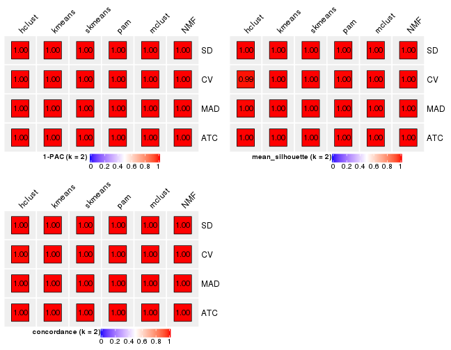</p>

</div>
<div id='tab-collect-stats-from-consensus-partition-list-2'>
<pre><code class="r">collect_stats(res_list, k = 3)
</code></pre>

<p>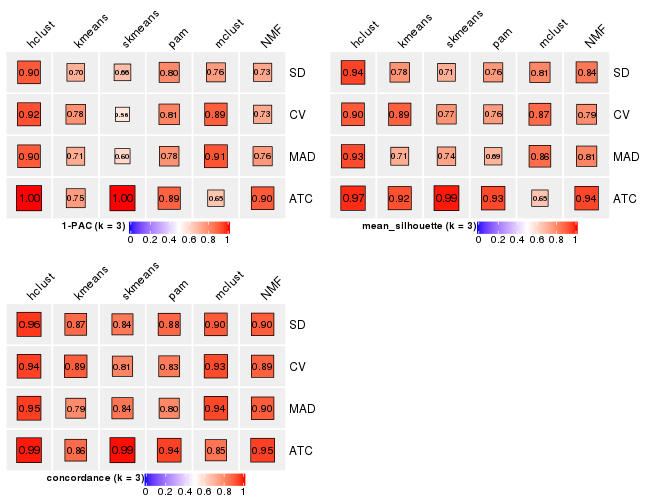</p>

</div>
<div id='tab-collect-stats-from-consensus-partition-list-3'>
<pre><code class="r">collect_stats(res_list, k = 4)
</code></pre>

<p></p>

</div>
<div id='tab-collect-stats-from-consensus-partition-list-4'>
<pre><code class="r">collect_stats(res_list, k = 5)
</code></pre>

<p></p>

</div>
<div id='tab-collect-stats-from-consensus-partition-list-5'>
<pre><code class="r">collect_stats(res_list, k = 6)
</code></pre>

<p></p>

</div>
</div>

### Partition from all methods


Collect partitions from all methods:


<script>
$( function() {
	$( '#tabs-collect-classes-from-consensus-partition-list' ).tabs();
} );
</script>
<div id='tabs-collect-classes-from-consensus-partition-list'>
<ul>
<li><a href='#tab-collect-classes-from-consensus-partition-list-1'>k = 2</a></li>
<li><a href='#tab-collect-classes-from-consensus-partition-list-2'>k = 3</a></li>
<li><a href='#tab-collect-classes-from-consensus-partition-list-3'>k = 4</a></li>
<li><a href='#tab-collect-classes-from-consensus-partition-list-4'>k = 5</a></li>
<li><a href='#tab-collect-classes-from-consensus-partition-list-5'>k = 6</a></li>
</ul>
<div id='tab-collect-classes-from-consensus-partition-list-1'>
<pre><code class="r">collect_classes(res_list, k = 2)
</code></pre>

<p></p>

</div>
<div id='tab-collect-classes-from-consensus-partition-list-2'>
<pre><code class="r">collect_classes(res_list, k = 3)
</code></pre>

<p></p>

</div>
<div id='tab-collect-classes-from-consensus-partition-list-3'>
<pre><code class="r">collect_classes(res_list, k = 4)
</code></pre>

<p></p>

</div>
<div id='tab-collect-classes-from-consensus-partition-list-4'>
<pre><code class="r">collect_classes(res_list, k = 5)
</code></pre>

<p></p>

</div>
<div id='tab-collect-classes-from-consensus-partition-list-5'>
<pre><code class="r">collect_classes(res_list, k = 6)
</code></pre>

<p></p>

</div>
</div>


### Top rows overlap


Overlap of top rows from different top-row methods:


<script>
$( function() {
	$( '#tabs-top-rows-overlap-by-euler' ).tabs();
} );
</script>
<div id='tabs-top-rows-overlap-by-euler'>
<ul>
<li><a href='#tab-top-rows-overlap-by-euler-1'>top_n = 1000</a></li>
<li><a href='#tab-top-rows-overlap-by-euler-2'>top_n = 2000</a></li>
<li><a href='#tab-top-rows-overlap-by-euler-3'>top_n = 3000</a></li>
<li><a href='#tab-top-rows-overlap-by-euler-4'>top_n = 4000</a></li>
<li><a href='#tab-top-rows-overlap-by-euler-5'>top_n = 5000</a></li>
</ul>
<div id='tab-top-rows-overlap-by-euler-1'>
<pre><code class="r">top_rows_overlap(res_list, top_n = 1000, method = &quot;euler&quot;)
</code></pre>

<p></p>

</div>
<div id='tab-top-rows-overlap-by-euler-2'>
<pre><code class="r">top_rows_overlap(res_list, top_n = 2000, method = &quot;euler&quot;)
</code></pre>

<p></p>

</div>
<div id='tab-top-rows-overlap-by-euler-3'>
<pre><code class="r">top_rows_overlap(res_list, top_n = 3000, method = &quot;euler&quot;)
</code></pre>

<p></p>

</div>
<div id='tab-top-rows-overlap-by-euler-4'>
<pre><code class="r">top_rows_overlap(res_list, top_n = 4000, method = &quot;euler&quot;)
</code></pre>

<p>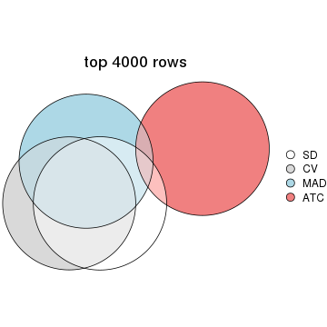</p>

</div>
<div id='tab-top-rows-overlap-by-euler-5'>
<pre><code class="r">top_rows_overlap(res_list, top_n = 5000, method = &quot;euler&quot;)
</code></pre>

<p></p>

</div>
</div>

Also visualize the correspondance of rankings between different top-row methods:


<script>
$( function() {
	$( '#tabs-top-rows-overlap-by-correspondance' ).tabs();
} );
</script>
<div id='tabs-top-rows-overlap-by-correspondance'>
<ul>
<li><a href='#tab-top-rows-overlap-by-correspondance-1'>top_n = 1000</a></li>
<li><a href='#tab-top-rows-overlap-by-correspondance-2'>top_n = 2000</a></li>
<li><a href='#tab-top-rows-overlap-by-correspondance-3'>top_n = 3000</a></li>
<li><a href='#tab-top-rows-overlap-by-correspondance-4'>top_n = 4000</a></li>
<li><a href='#tab-top-rows-overlap-by-correspondance-5'>top_n = 5000</a></li>
</ul>
<div id='tab-top-rows-overlap-by-correspondance-1'>
<pre><code class="r">top_rows_overlap(res_list, top_n = 1000, method = &quot;correspondance&quot;)
</code></pre>

<p></p>

</div>
<div id='tab-top-rows-overlap-by-correspondance-2'>
<pre><code class="r">top_rows_overlap(res_list, top_n = 2000, method = &quot;correspondance&quot;)
</code></pre>

<p></p>

</div>
<div id='tab-top-rows-overlap-by-correspondance-3'>
<pre><code class="r">top_rows_overlap(res_list, top_n = 3000, method = &quot;correspondance&quot;)
</code></pre>

<p></p>

</div>
<div id='tab-top-rows-overlap-by-correspondance-4'>
<pre><code class="r">top_rows_overlap(res_list, top_n = 4000, method = &quot;correspondance&quot;)
</code></pre>

<p></p>

</div>
<div id='tab-top-rows-overlap-by-correspondance-5'>
<pre><code class="r">top_rows_overlap(res_list, top_n = 5000, method = &quot;correspondance&quot;)
</code></pre>

<p></p>

</div>
</div>


Heatmaps of the top rows:


<script>
$( function() {
	$( '#tabs-top-rows-heatmap' ).tabs();
} );
</script>
<div id='tabs-top-rows-heatmap'>
<ul>
<li><a href='#tab-top-rows-heatmap-1'>top_n = 1000</a></li>
<li><a href='#tab-top-rows-heatmap-2'>top_n = 2000</a></li>
<li><a href='#tab-top-rows-heatmap-3'>top_n = 3000</a></li>
<li><a href='#tab-top-rows-heatmap-4'>top_n = 4000</a></li>
<li><a href='#tab-top-rows-heatmap-5'>top_n = 5000</a></li>
</ul>
<div id='tab-top-rows-heatmap-1'>
<pre><code class="r">top_rows_heatmap(res_list, top_n = 1000)
</code></pre>

<p></p>

</div>
<div id='tab-top-rows-heatmap-2'>
<pre><code class="r">top_rows_heatmap(res_list, top_n = 2000)
</code></pre>

<p></p>

</div>
<div id='tab-top-rows-heatmap-3'>
<pre><code class="r">top_rows_heatmap(res_list, top_n = 3000)
</code></pre>

<p></p>

</div>
<div id='tab-top-rows-heatmap-4'>
<pre><code class="r">top_rows_heatmap(res_list, top_n = 4000)
</code></pre>

<p></p>

</div>
<div id='tab-top-rows-heatmap-5'>
<pre><code class="r">top_rows_heatmap(res_list, top_n = 5000)
</code></pre>

<p></p>

</div>
</div>


### Test to known annotations


Test correlation between subgroups and known annotations. If the known
annotation is numeric, one-way ANOVA test is applied, and if the known
annotation is discrete, chi-squared contingency table test is applied.


<script>
$( function() {
	$( '#tabs-test-to-known-factors-from-consensus-partition-list' ).tabs();
} );
</script>
<div id='tabs-test-to-known-factors-from-consensus-partition-list'>
<ul>
<li><a href='#tab-test-to-known-factors-from-consensus-partition-list-1'>k = 2</a></li>
<li><a href='#tab-test-to-known-factors-from-consensus-partition-list-2'>k = 3</a></li>
<li><a href='#tab-test-to-known-factors-from-consensus-partition-list-3'>k = 4</a></li>
<li><a href='#tab-test-to-known-factors-from-consensus-partition-list-4'>k = 5</a></li>
<li><a href='#tab-test-to-known-factors-from-consensus-partition-list-5'>k = 6</a></li>
</ul>
<div id='tab-test-to-known-factors-from-consensus-partition-list-1'>
<pre><code class="r">test_to_known_factors(res_list, k = 2)
</code></pre>

<pre><code>#&gt;              n disease.state(p) individual(p) k
#&gt; SD:NMF      64         9.19e-15             1 2
#&gt; CV:NMF      64         9.19e-15             1 2
#&gt; MAD:NMF     64         9.19e-15             1 2
#&gt; ATC:NMF     64         9.19e-15             1 2
#&gt; SD:skmeans  64         9.19e-15             1 2
#&gt; CV:skmeans  64         9.19e-15             1 2
#&gt; MAD:skmeans 64         9.19e-15             1 2
#&gt; ATC:skmeans 64         9.19e-15             1 2
#&gt; SD:mclust   64         9.19e-15             1 2
#&gt; CV:mclust   64         9.19e-15             1 2
#&gt; MAD:mclust  64         9.19e-15             1 2
#&gt; ATC:mclust  64         9.19e-15             1 2
#&gt; SD:kmeans   64         9.19e-15             1 2
#&gt; CV:kmeans   64         9.19e-15             1 2
#&gt; MAD:kmeans  64         9.19e-15             1 2
#&gt; ATC:kmeans  64         9.19e-15             1 2
#&gt; SD:pam      64         9.19e-15             1 2
#&gt; CV:pam      64         9.19e-15             1 2
#&gt; MAD:pam     64         9.19e-15             1 2
#&gt; ATC:pam     64         9.19e-15             1 2
#&gt; SD:hclust   64         9.19e-15             1 2
#&gt; CV:hclust   64         9.19e-15             1 2
#&gt; MAD:hclust  64         9.19e-15             1 2
#&gt; ATC:hclust  64         9.19e-15             1 2
</code></pre>

</div>
<div id='tab-test-to-known-factors-from-consensus-partition-list-2'>
<pre><code class="r">test_to_known_factors(res_list, k = 3)
</code></pre>

<pre><code>#&gt;              n disease.state(p) individual(p) k
#&gt; SD:NMF      62         3.44e-14         0.999 3
#&gt; CV:NMF      58         2.54e-13         0.979 3
#&gt; MAD:NMF     61         5.68e-14         0.999 3
#&gt; ATC:NMF     64         9.19e-15         1.000 3
#&gt; SD:skmeans  57         4.19e-13         0.998 3
#&gt; CV:skmeans  60         9.36e-14         0.999 3
#&gt; MAD:skmeans 58         2.54e-13         0.998 3
#&gt; ATC:skmeans 64         1.27e-14         0.999 3
#&gt; SD:mclust   60         9.36e-14         0.999 3
#&gt; CV:mclust   61         5.68e-14         0.999 3
#&gt; MAD:mclust  60         9.36e-14         0.999 3
#&gt; ATC:mclust  52         4.58e-12         1.000 3
#&gt; SD:kmeans   60         9.36e-14         0.999 3
#&gt; CV:kmeans   62         3.44e-14         0.999 3
#&gt; MAD:kmeans  57         4.19e-13         0.998 3
#&gt; ATC:kmeans  64         1.27e-14         0.999 3
#&gt; SD:pam      55         1.14e-12         0.998 3
#&gt; CV:pam      57         4.19e-13         0.998 3
#&gt; MAD:pam     50         1.39e-11         0.997 3
#&gt; ATC:pam     62         3.44e-14         0.999 3
#&gt; SD:hclust   63         2.09e-14         0.999 3
#&gt; CV:hclust   63         2.09e-14         0.999 3
#&gt; MAD:hclust  63         2.09e-14         0.999 3
#&gt; ATC:hclust  64         1.27e-14         0.999 3
</code></pre>

</div>
<div id='tab-test-to-known-factors-from-consensus-partition-list-3'>
<pre><code class="r">test_to_known_factors(res_list, k = 4)
</code></pre>

<pre><code>#&gt;              n disease.state(p) individual(p) k
#&gt; SD:NMF      54         1.88e-12         0.997 4
#&gt; CV:NMF      49         2.29e-11         0.994 4
#&gt; MAD:NMF     59         1.54e-13         0.998 4
#&gt; ATC:NMF     57         3.27e-13         1.000 4
#&gt; SD:skmeans  51         4.89e-11         0.879 4
#&gt; CV:skmeans  29         5.04e-07         0.538 4
#&gt; MAD:skmeans 34         1.98e-07         0.738 4
#&gt; ATC:skmeans 62         2.54e-14         1.000 4
#&gt; SD:mclust   57         2.57e-12         0.895 4
#&gt; CV:mclust   58         1.57e-12         0.977 4
#&gt; MAD:mclust  60         5.88e-13         0.926 4
#&gt; ATC:mclust  51         4.89e-11         0.962 4
#&gt; SD:kmeans   60         9.36e-14         0.999 4
#&gt; CV:kmeans   50         7.99e-11         0.878 4
#&gt; MAD:kmeans  55         6.87e-12         0.941 4
#&gt; ATC:kmeans  55         6.87e-12         0.941 4
#&gt; SD:pam      51         8.42e-12         0.997 4
#&gt; CV:pam      58         2.54e-13         0.998 4
#&gt; MAD:pam     42         4.01e-09         0.780 4
#&gt; ATC:pam     59         9.61e-13         0.991 4
#&gt; SD:hclust   62         3.44e-14         0.999 4
#&gt; CV:hclust   58         1.98e-13         1.000 4
#&gt; MAD:hclust  63         2.09e-14         0.999 4
#&gt; ATC:hclust  60         5.88e-13         0.991 4
</code></pre>

</div>
<div id='tab-test-to-known-factors-from-consensus-partition-list-4'>
<pre><code class="r">test_to_known_factors(res_list, k = 5)
</code></pre>

<pre><code>#&gt;              n disease.state(p) individual(p) k
#&gt; SD:NMF      37         8.73e-09         0.966 5
#&gt; CV:NMF      44         2.79e-10         0.435 5
#&gt; MAD:NMF     47         3.48e-10         0.982 5
#&gt; ATC:NMF     54         1.88e-12         0.997 5
#&gt; SD:skmeans  47         3.48e-10         0.853 5
#&gt; CV:skmeans  26         2.26e-06         0.835 5
#&gt; MAD:skmeans 21         2.75e-05         0.788 5
#&gt; ATC:skmeans 57         4.19e-13         0.997 5
#&gt; SD:mclust   50         7.99e-11         0.844 5
#&gt; CV:mclust   46         5.67e-10         0.564 5
#&gt; MAD:mclust  55         3.25e-11         0.937 5
#&gt; ATC:mclust  29         5.04e-07         0.585 5
#&gt; SD:kmeans   43         2.46e-09         0.972 5
#&gt; CV:kmeans   52         3.00e-11         0.934 5
#&gt; MAD:kmeans  60         5.88e-13         0.963 5
#&gt; ATC:kmeans  54         1.12e-11         0.952 5
#&gt; SD:pam      41         2.73e-09         0.994 5
#&gt; CV:pam      55         1.14e-12         0.998 5
#&gt; MAD:pam     30         3.06e-07         0.793 5
#&gt; ATC:pam     50         1.39e-11         0.997 5
#&gt; SD:hclust   59         1.54e-13         0.998 5
#&gt; CV:hclust   57         3.32e-13         1.000 5
#&gt; MAD:hclust  59         1.54e-13         0.998 5
#&gt; ATC:hclust  55         1.14e-12         0.998 5
</code></pre>

</div>
<div id='tab-test-to-known-factors-from-consensus-partition-list-5'>
<pre><code class="r">test_to_known_factors(res_list, k = 6)
</code></pre>

<pre><code>#&gt;              n disease.state(p) individual(p) k
#&gt; SD:NMF      24         2.50e-05         0.959 6
#&gt; CV:NMF      34         4.09e-08         0.959 6
#&gt; MAD:NMF     28         8.32e-07         0.428 6
#&gt; ATC:NMF     50         1.39e-11         0.993 6
#&gt; SD:skmeans  20         4.54e-05         0.467 6
#&gt; CV:skmeans   3               NA            NA 6
#&gt; MAD:skmeans  4               NA            NA 6
#&gt; ATC:skmeans 46         5.67e-10         0.992 6
#&gt; SD:mclust   58         3.15e-11         0.900 6
#&gt; CV:mclust   58         3.15e-11         0.868 6
#&gt; MAD:mclust  56         2.01e-11         0.893 6
#&gt; ATC:mclust  18         4.40e-04         0.360 6
#&gt; SD:kmeans   33         1.19e-06         0.735 6
#&gt; CV:kmeans   52         3.00e-11         0.955 6
#&gt; MAD:kmeans  44         1.51e-09         0.873 6
#&gt; ATC:kmeans  49         5.84e-10         0.782 6
#&gt; SD:pam      45         1.69e-10         0.997 6
#&gt; CV:pam      54         1.88e-12         0.997 6
#&gt; MAD:pam     45         9.25e-10         0.866 6
#&gt; ATC:pam     48         3.78e-11         0.993 6
#&gt; SD:hclust   58         2.54e-13         0.998 6
#&gt; CV:hclust   58         2.54e-13         0.998 6
#&gt; MAD:hclust  58         2.54e-13         0.998 6
#&gt; ATC:hclust  42         4.01e-09         0.999 6
</code></pre>

</div>
</div>


 
## Results for each method


---------------------------------------------------


### SD:hclust*


The object with results only for a single top-value method and a single partition method 
can be extracted as:

```r
res = res_list["SD", "hclust"]
# you can also extract it by
# res = res_list["SD:hclust"]
```

A summary of `res` and all the functions that can be applied to it:

```r
res
```

```
#> A 'ConsensusPartition' object with k = 2, 3, 4, 5, 6.
#>   On a matrix with 51941 rows and 64 columns.
#>   Top rows (1000, 2000, 3000, 4000, 5000) are extracted by 'SD' method.
#>   Subgroups are detected by 'hclust' method.
#>   Performed in total 1250 partitions by row resampling.
#>   Best k for subgroups seems to be 3.
#> 
#> Following methods can be applied to this 'ConsensusPartition' object:
#>  [1] "cola_report"             "collect_classes"         "collect_plots"          
#>  [4] "collect_stats"           "colnames"                "compare_signatures"     
#>  [7] "consensus_heatmap"       "dimension_reduction"     "functional_enrichment"  
#> [10] "get_anno_col"            "get_anno"                "get_classes"            
#> [13] "get_consensus"           "get_matrix"              "get_membership"         
#> [16] "get_param"               "get_signatures"          "get_stats"              
#> [19] "is_best_k"               "is_stable_k"             "membership_heatmap"     
#> [22] "ncol"                    "nrow"                    "plot_ecdf"              
#> [25] "rownames"                "select_partition_number" "show"                   
#> [28] "suggest_best_k"          "test_to_known_factors"
```

`collect_plots()` function collects all the plots made from `res` for all `k` (number of partitions)
into one single page to provide an easy and fast comparison between different `k`.

```r
collect_plots(res)
```


The plots are:

- The first row: a plot of the ECDF (empirical cumulative distribution
  function) curves of the consensus matrix for each `k` and the heatmap of
  predicted classes for each `k`.
- The second row: heatmaps of the consensus matrix for each `k`.
- The third row: heatmaps of the membership matrix for each `k`.
- The fouth row: heatmaps of the signatures for each `k`.

All the plots in panels can be made by individual functions and they are
plotted later in this section.

`select_partition_number()` produces several plots showing different
statistics for choosing "optimized" `k`. There are following statistics:

- ECDF curves of the consensus matrix for each `k`;
- 1-PAC. [The PAC
  score](https://en.wikipedia.org/wiki/Consensus_clustering#Over-interpretation_potential_of_consensus_clustering)
  measures the proportion of the ambiguous subgrouping.
- Mean silhouette score.
- Concordance. The mean probability of fiting the consensus class ids in all
  partitions.
- Area increased. Denote $A_k$ as the area under the ECDF curve for current
  `k`, the area increased is defined as $A_k - A_{k-1}$.
- Rand index. The percent of pairs of samples that are both in a same cluster
  or both are not in a same cluster in the partition of k and k-1.
- Jaccard index. The ratio of pairs of samples are both in a same cluster in
  the partition of k and k-1 and the pairs of samples are both in a same
  cluster in the partition k or k-1.

The detailed explanations of these statistics can be found in [the _cola_
vignette](http://bioconductor.org/packages/devel/bioc/vignettes/cola/inst/doc/cola.html#toc_13).

Generally speaking, lower PAC score, higher mean silhouette score or higher
concordance corresponds to better partition. Rand index and Jaccard index
measure how similar the current partition is compared to partition with `k-1`.
If they are too similar, we won't accept `k` is better than `k-1`.

```r
select_partition_number(res)
```


The numeric values for all these statistics can be obtained by `get_stats()`.

```r
get_stats(res)
```

```
#>   k 1-PAC mean_silhouette concordance area_increased  Rand Jaccard
#> 2 2 1.000           1.000       1.000         0.5084 0.492   0.492
#> 3 3 0.903           0.941       0.959         0.1321 0.933   0.864
#> 4 4 0.877           0.903       0.940         0.0422 0.998   0.995
#> 5 5 0.851           0.829       0.907         0.0295 0.985   0.965
#> 6 6 0.842           0.811       0.891         0.0321 0.986   0.965
```

`suggest_best_k()` suggests the best $k$ based on these statistics. The rules are as follows:

- All $k$ with Jaccard index larger than 0.95 are removed because increasing
  $k$ does not provide enough extra information. If all $k$ are removed, it is
  marked as no subgroup is detected.
- For all $k$ with 1-PAC score larger than 0.9, the maximal $k$ is taken as
  the best $k$, and other $k$ are marked as optional $k$.
- If it does not fit the second rule. The $k$ with the maximal vote of the
  highest 1-PAC score, highest mean silhouette, and highest concordance is
  taken as the best $k$.

```r
suggest_best_k(res)
```

```
#> [1] 3
#> attr(,"optional")
#> [1] 2
```

There is also optional best $k$ = 2 that is worth to check.

Following shows the table of the partitions (You need to click the **show/hide
code output** link to see it). The membership matrix (columns with name `p*`)
is inferred by
[`clue::cl_consensus()`](https://www.rdocumentation.org/link/cl_consensus?package=clue)
function with the `SE` method. Basically the value in the membership matrix
represents the probability to belong to a certain group. The finall class
label for an item is determined with the group with highest probability it
belongs to.

In `get_classes()` function, the entropy is calculated from the membership
matrix and the silhouette score is calculated from the consensus matrix.


<script>
$( function() {
	$( '#tabs-SD-hclust-get-classes' ).tabs();
} );
</script>
<div id='tabs-SD-hclust-get-classes'>
<ul>
<li><a href='#tab-SD-hclust-get-classes-1'>k = 2</a></li>
<li><a href='#tab-SD-hclust-get-classes-2'>k = 3</a></li>
<li><a href='#tab-SD-hclust-get-classes-3'>k = 4</a></li>
<li><a href='#tab-SD-hclust-get-classes-4'>k = 5</a></li>
<li><a href='#tab-SD-hclust-get-classes-5'>k = 6</a></li>
</ul>

<div id='tab-SD-hclust-get-classes-1'>
<p><a id='tab-SD-hclust-get-classes-1-a' style='color:#0366d6' href='#'>show/hide code output</a></p>
<pre><code class="r">cbind(get_classes(res, k = 2), get_membership(res, k = 2))
</code></pre>

<pre><code>#&gt;           class entropy silhouette p1 p2
#&gt; GSM215051     2       0          1  0  1
#&gt; GSM215052     2       0          1  0  1
#&gt; GSM215053     2       0          1  0  1
#&gt; GSM215054     2       0          1  0  1
#&gt; GSM215055     2       0          1  0  1
#&gt; GSM215056     2       0          1  0  1
#&gt; GSM215057     2       0          1  0  1
#&gt; GSM215058     2       0          1  0  1
#&gt; GSM215059     2       0          1  0  1
#&gt; GSM215060     2       0          1  0  1
#&gt; GSM215061     2       0          1  0  1
#&gt; GSM215062     2       0          1  0  1
#&gt; GSM215063     2       0          1  0  1
#&gt; GSM215064     2       0          1  0  1
#&gt; GSM215065     2       0          1  0  1
#&gt; GSM215066     2       0          1  0  1
#&gt; GSM215067     2       0          1  0  1
#&gt; GSM215068     2       0          1  0  1
#&gt; GSM215069     2       0          1  0  1
#&gt; GSM215070     2       0          1  0  1
#&gt; GSM215071     2       0          1  0  1
#&gt; GSM215072     2       0          1  0  1
#&gt; GSM215073     2       0          1  0  1
#&gt; GSM215074     2       0          1  0  1
#&gt; GSM215075     2       0          1  0  1
#&gt; GSM215076     2       0          1  0  1
#&gt; GSM215077     2       0          1  0  1
#&gt; GSM215078     2       0          1  0  1
#&gt; GSM215079     2       0          1  0  1
#&gt; GSM215080     2       0          1  0  1
#&gt; GSM215081     2       0          1  0  1
#&gt; GSM215082     2       0          1  0  1
#&gt; GSM215083     1       0          1  1  0
#&gt; GSM215084     1       0          1  1  0
#&gt; GSM215085     1       0          1  1  0
#&gt; GSM215086     1       0          1  1  0
#&gt; GSM215087     1       0          1  1  0
#&gt; GSM215088     1       0          1  1  0
#&gt; GSM215089     1       0          1  1  0
#&gt; GSM215090     1       0          1  1  0
#&gt; GSM215091     1       0          1  1  0
#&gt; GSM215092     1       0          1  1  0
#&gt; GSM215093     1       0          1  1  0
#&gt; GSM215094     1       0          1  1  0
#&gt; GSM215095     1       0          1  1  0
#&gt; GSM215096     1       0          1  1  0
#&gt; GSM215097     1       0          1  1  0
#&gt; GSM215098     1       0          1  1  0
#&gt; GSM215099     1       0          1  1  0
#&gt; GSM215100     1       0          1  1  0
#&gt; GSM215101     1       0          1  1  0
#&gt; GSM215102     1       0          1  1  0
#&gt; GSM215103     1       0          1  1  0
#&gt; GSM215104     1       0          1  1  0
#&gt; GSM215105     1       0          1  1  0
#&gt; GSM215106     1       0          1  1  0
#&gt; GSM215107     1       0          1  1  0
#&gt; GSM215108     1       0          1  1  0
#&gt; GSM215109     1       0          1  1  0
#&gt; GSM215110     1       0          1  1  0
#&gt; GSM215111     1       0          1  1  0
#&gt; GSM215112     1       0          1  1  0
#&gt; GSM215113     1       0          1  1  0
#&gt; GSM215114     1       0          1  1  0
</code></pre>

<script>
$('#tab-SD-hclust-get-classes-1-a').parent().next().next().hide();
$('#tab-SD-hclust-get-classes-1-a').click(function(){
  $('#tab-SD-hclust-get-classes-1-a').parent().next().next().toggle();
  return(false);
});
</script>
</div>

<div id='tab-SD-hclust-get-classes-2'>
<p><a id='tab-SD-hclust-get-classes-2-a' style='color:#0366d6' href='#'>show/hide code output</a></p>
<pre><code class="r">cbind(get_classes(res, k = 3), get_membership(res, k = 3))
</code></pre>

<pre><code>#&gt;           class entropy silhouette    p1 p2    p3
#&gt; GSM215051     2  0.0000      1.000 0.000  1 0.000
#&gt; GSM215052     2  0.0000      1.000 0.000  1 0.000
#&gt; GSM215053     2  0.0000      1.000 0.000  1 0.000
#&gt; GSM215054     2  0.0000      1.000 0.000  1 0.000
#&gt; GSM215055     2  0.0000      1.000 0.000  1 0.000
#&gt; GSM215056     2  0.0000      1.000 0.000  1 0.000
#&gt; GSM215057     2  0.0000      1.000 0.000  1 0.000
#&gt; GSM215058     2  0.0000      1.000 0.000  1 0.000
#&gt; GSM215059     2  0.0000      1.000 0.000  1 0.000
#&gt; GSM215060     2  0.0000      1.000 0.000  1 0.000
#&gt; GSM215061     2  0.0000      1.000 0.000  1 0.000
#&gt; GSM215062     2  0.0000      1.000 0.000  1 0.000
#&gt; GSM215063     2  0.0000      1.000 0.000  1 0.000
#&gt; GSM215064     2  0.0000      1.000 0.000  1 0.000
#&gt; GSM215065     2  0.0000      1.000 0.000  1 0.000
#&gt; GSM215066     2  0.0000      1.000 0.000  1 0.000
#&gt; GSM215067     2  0.0000      1.000 0.000  1 0.000
#&gt; GSM215068     2  0.0000      1.000 0.000  1 0.000
#&gt; GSM215069     2  0.0000      1.000 0.000  1 0.000
#&gt; GSM215070     2  0.0000      1.000 0.000  1 0.000
#&gt; GSM215071     2  0.0000      1.000 0.000  1 0.000
#&gt; GSM215072     2  0.0000      1.000 0.000  1 0.000
#&gt; GSM215073     2  0.0000      1.000 0.000  1 0.000
#&gt; GSM215074     2  0.0000      1.000 0.000  1 0.000
#&gt; GSM215075     2  0.0000      1.000 0.000  1 0.000
#&gt; GSM215076     2  0.0000      1.000 0.000  1 0.000
#&gt; GSM215077     2  0.0000      1.000 0.000  1 0.000
#&gt; GSM215078     2  0.0000      1.000 0.000  1 0.000
#&gt; GSM215079     2  0.0000      1.000 0.000  1 0.000
#&gt; GSM215080     2  0.0000      1.000 0.000  1 0.000
#&gt; GSM215081     2  0.0000      1.000 0.000  1 0.000
#&gt; GSM215082     2  0.0000      1.000 0.000  1 0.000
#&gt; GSM215083     1  0.3267      0.882 0.884  0 0.116
#&gt; GSM215084     1  0.0592      0.924 0.988  0 0.012
#&gt; GSM215085     3  0.5216      0.750 0.260  0 0.740
#&gt; GSM215086     3  0.3340      0.851 0.120  0 0.880
#&gt; GSM215087     1  0.0747      0.928 0.984  0 0.016
#&gt; GSM215088     3  0.4887      0.879 0.228  0 0.772
#&gt; GSM215089     1  0.0237      0.926 0.996  0 0.004
#&gt; GSM215090     1  0.0892      0.923 0.980  0 0.020
#&gt; GSM215091     1  0.2878      0.896 0.904  0 0.096
#&gt; GSM215092     1  0.1031      0.926 0.976  0 0.024
#&gt; GSM215093     3  0.4887      0.881 0.228  0 0.772
#&gt; GSM215094     1  0.0424      0.928 0.992  0 0.008
#&gt; GSM215095     1  0.0237      0.926 0.996  0 0.004
#&gt; GSM215096     1  0.2878      0.896 0.904  0 0.096
#&gt; GSM215097     1  0.2261      0.913 0.932  0 0.068
#&gt; GSM215098     1  0.0747      0.928 0.984  0 0.016
#&gt; GSM215099     1  0.2066      0.916 0.940  0 0.060
#&gt; GSM215100     1  0.0424      0.929 0.992  0 0.008
#&gt; GSM215101     1  0.0892      0.929 0.980  0 0.020
#&gt; GSM215102     1  0.3816      0.833 0.852  0 0.148
#&gt; GSM215103     1  0.3816      0.843 0.852  0 0.148
#&gt; GSM215104     1  0.3038      0.885 0.896  0 0.104
#&gt; GSM215105     1  0.1643      0.922 0.956  0 0.044
#&gt; GSM215106     1  0.2878      0.896 0.904  0 0.096
#&gt; GSM215107     1  0.0592      0.926 0.988  0 0.012
#&gt; GSM215108     1  0.5926      0.336 0.644  0 0.356
#&gt; GSM215109     3  0.4291      0.884 0.180  0 0.820
#&gt; GSM215110     1  0.2261      0.896 0.932  0 0.068
#&gt; GSM215111     1  0.1753      0.921 0.952  0 0.048
#&gt; GSM215112     1  0.0424      0.928 0.992  0 0.008
#&gt; GSM215113     1  0.0000      0.927 1.000  0 0.000
#&gt; GSM215114     1  0.1163      0.928 0.972  0 0.028
</code></pre>

<script>
$('#tab-SD-hclust-get-classes-2-a').parent().next().next().hide();
$('#tab-SD-hclust-get-classes-2-a').click(function(){
  $('#tab-SD-hclust-get-classes-2-a').parent().next().next().toggle();
  return(false);
});
</script>
</div>

<div id='tab-SD-hclust-get-classes-3'>
<p><a id='tab-SD-hclust-get-classes-3-a' style='color:#0366d6' href='#'>show/hide code output</a></p>
<pre><code class="r">cbind(get_classes(res, k = 4), get_membership(res, k = 4))
</code></pre>

<pre><code>#&gt;           class entropy silhouette    p1 p2    p3    p4
#&gt; GSM215051     2   0.000      1.000 0.000  1 0.000 0.000
#&gt; GSM215052     2   0.000      1.000 0.000  1 0.000 0.000
#&gt; GSM215053     2   0.000      1.000 0.000  1 0.000 0.000
#&gt; GSM215054     2   0.000      1.000 0.000  1 0.000 0.000
#&gt; GSM215055     2   0.000      1.000 0.000  1 0.000 0.000
#&gt; GSM215056     2   0.000      1.000 0.000  1 0.000 0.000
#&gt; GSM215057     2   0.000      1.000 0.000  1 0.000 0.000
#&gt; GSM215058     2   0.000      1.000 0.000  1 0.000 0.000
#&gt; GSM215059     2   0.000      1.000 0.000  1 0.000 0.000
#&gt; GSM215060     2   0.000      1.000 0.000  1 0.000 0.000
#&gt; GSM215061     2   0.000      1.000 0.000  1 0.000 0.000
#&gt; GSM215062     2   0.000      1.000 0.000  1 0.000 0.000
#&gt; GSM215063     2   0.000      1.000 0.000  1 0.000 0.000
#&gt; GSM215064     2   0.000      1.000 0.000  1 0.000 0.000
#&gt; GSM215065     2   0.000      1.000 0.000  1 0.000 0.000
#&gt; GSM215066     2   0.000      1.000 0.000  1 0.000 0.000
#&gt; GSM215067     2   0.000      1.000 0.000  1 0.000 0.000
#&gt; GSM215068     2   0.000      1.000 0.000  1 0.000 0.000
#&gt; GSM215069     2   0.000      1.000 0.000  1 0.000 0.000
#&gt; GSM215070     2   0.000      1.000 0.000  1 0.000 0.000
#&gt; GSM215071     2   0.000      1.000 0.000  1 0.000 0.000
#&gt; GSM215072     2   0.000      1.000 0.000  1 0.000 0.000
#&gt; GSM215073     2   0.000      1.000 0.000  1 0.000 0.000
#&gt; GSM215074     2   0.000      1.000 0.000  1 0.000 0.000
#&gt; GSM215075     2   0.000      1.000 0.000  1 0.000 0.000
#&gt; GSM215076     2   0.000      1.000 0.000  1 0.000 0.000
#&gt; GSM215077     2   0.000      1.000 0.000  1 0.000 0.000
#&gt; GSM215078     2   0.000      1.000 0.000  1 0.000 0.000
#&gt; GSM215079     2   0.000      1.000 0.000  1 0.000 0.000
#&gt; GSM215080     2   0.000      1.000 0.000  1 0.000 0.000
#&gt; GSM215081     2   0.000      1.000 0.000  1 0.000 0.000
#&gt; GSM215082     2   0.000      1.000 0.000  1 0.000 0.000
#&gt; GSM215083     1   0.383      0.861 0.848  0 0.076 0.076
#&gt; GSM215084     1   0.187      0.897 0.928  0 0.000 0.072
#&gt; GSM215085     4   0.473      0.000 0.108  0 0.100 0.792
#&gt; GSM215086     3   0.470      0.535 0.004  0 0.676 0.320
#&gt; GSM215087     1   0.147      0.900 0.948  0 0.000 0.052
#&gt; GSM215088     3   0.267      0.731 0.040  0 0.908 0.052
#&gt; GSM215089     1   0.166      0.898 0.944  0 0.004 0.052
#&gt; GSM215090     1   0.225      0.890 0.920  0 0.012 0.068
#&gt; GSM215091     1   0.300      0.879 0.892  0 0.060 0.048
#&gt; GSM215092     1   0.208      0.895 0.916  0 0.000 0.084
#&gt; GSM215093     3   0.149      0.738 0.044  0 0.952 0.004
#&gt; GSM215094     1   0.147      0.902 0.948  0 0.000 0.052
#&gt; GSM215095     1   0.156      0.901 0.944  0 0.000 0.056
#&gt; GSM215096     1   0.300      0.879 0.892  0 0.060 0.048
#&gt; GSM215097     1   0.231      0.894 0.924  0 0.044 0.032
#&gt; GSM215098     1   0.147      0.900 0.948  0 0.000 0.052
#&gt; GSM215099     1   0.232      0.897 0.924  0 0.036 0.040
#&gt; GSM215100     1   0.139      0.902 0.952  0 0.000 0.048
#&gt; GSM215101     1   0.147      0.904 0.948  0 0.000 0.052
#&gt; GSM215102     1   0.483      0.775 0.776  0 0.068 0.156
#&gt; GSM215103     1   0.456      0.814 0.796  0 0.064 0.140
#&gt; GSM215104     1   0.380      0.853 0.836  0 0.032 0.132
#&gt; GSM215105     1   0.184      0.900 0.944  0 0.028 0.028
#&gt; GSM215106     1   0.300      0.879 0.892  0 0.060 0.048
#&gt; GSM215107     1   0.147      0.904 0.948  0 0.000 0.052
#&gt; GSM215108     1   0.746      0.189 0.508  0 0.256 0.236
#&gt; GSM215109     3   0.460      0.623 0.028  0 0.760 0.212
#&gt; GSM215110     1   0.405      0.825 0.828  0 0.048 0.124
#&gt; GSM215111     1   0.173      0.899 0.948  0 0.028 0.024
#&gt; GSM215112     1   0.121      0.901 0.960  0 0.000 0.040
#&gt; GSM215113     1   0.102      0.902 0.968  0 0.000 0.032
#&gt; GSM215114     1   0.214      0.900 0.928  0 0.016 0.056
</code></pre>

<script>
$('#tab-SD-hclust-get-classes-3-a').parent().next().next().hide();
$('#tab-SD-hclust-get-classes-3-a').click(function(){
  $('#tab-SD-hclust-get-classes-3-a').parent().next().next().toggle();
  return(false);
});
</script>
</div>

<div id='tab-SD-hclust-get-classes-4'>
<p><a id='tab-SD-hclust-get-classes-4-a' style='color:#0366d6' href='#'>show/hide code output</a></p>
<pre><code class="r">cbind(get_classes(res, k = 5), get_membership(res, k = 5))
</code></pre>

<pre><code>#&gt;           class entropy silhouette    p1 p2    p3    p4    p5
#&gt; GSM215051     2  0.0000     1.0000 0.000  1 0.000 0.000 0.000
#&gt; GSM215052     2  0.0000     1.0000 0.000  1 0.000 0.000 0.000
#&gt; GSM215053     2  0.0000     1.0000 0.000  1 0.000 0.000 0.000
#&gt; GSM215054     2  0.0000     1.0000 0.000  1 0.000 0.000 0.000
#&gt; GSM215055     2  0.0000     1.0000 0.000  1 0.000 0.000 0.000
#&gt; GSM215056     2  0.0000     1.0000 0.000  1 0.000 0.000 0.000
#&gt; GSM215057     2  0.0000     1.0000 0.000  1 0.000 0.000 0.000
#&gt; GSM215058     2  0.0000     1.0000 0.000  1 0.000 0.000 0.000
#&gt; GSM215059     2  0.0000     1.0000 0.000  1 0.000 0.000 0.000
#&gt; GSM215060     2  0.0000     1.0000 0.000  1 0.000 0.000 0.000
#&gt; GSM215061     2  0.0000     1.0000 0.000  1 0.000 0.000 0.000
#&gt; GSM215062     2  0.0000     1.0000 0.000  1 0.000 0.000 0.000
#&gt; GSM215063     2  0.0000     1.0000 0.000  1 0.000 0.000 0.000
#&gt; GSM215064     2  0.0000     1.0000 0.000  1 0.000 0.000 0.000
#&gt; GSM215065     2  0.0000     1.0000 0.000  1 0.000 0.000 0.000
#&gt; GSM215066     2  0.0000     1.0000 0.000  1 0.000 0.000 0.000
#&gt; GSM215067     2  0.0000     1.0000 0.000  1 0.000 0.000 0.000
#&gt; GSM215068     2  0.0000     1.0000 0.000  1 0.000 0.000 0.000
#&gt; GSM215069     2  0.0000     1.0000 0.000  1 0.000 0.000 0.000
#&gt; GSM215070     2  0.0000     1.0000 0.000  1 0.000 0.000 0.000
#&gt; GSM215071     2  0.0000     1.0000 0.000  1 0.000 0.000 0.000
#&gt; GSM215072     2  0.0000     1.0000 0.000  1 0.000 0.000 0.000
#&gt; GSM215073     2  0.0000     1.0000 0.000  1 0.000 0.000 0.000
#&gt; GSM215074     2  0.0000     1.0000 0.000  1 0.000 0.000 0.000
#&gt; GSM215075     2  0.0000     1.0000 0.000  1 0.000 0.000 0.000
#&gt; GSM215076     2  0.0000     1.0000 0.000  1 0.000 0.000 0.000
#&gt; GSM215077     2  0.0000     1.0000 0.000  1 0.000 0.000 0.000
#&gt; GSM215078     2  0.0000     1.0000 0.000  1 0.000 0.000 0.000
#&gt; GSM215079     2  0.0000     1.0000 0.000  1 0.000 0.000 0.000
#&gt; GSM215080     2  0.0000     1.0000 0.000  1 0.000 0.000 0.000
#&gt; GSM215081     2  0.0000     1.0000 0.000  1 0.000 0.000 0.000
#&gt; GSM215082     2  0.0000     1.0000 0.000  1 0.000 0.000 0.000
#&gt; GSM215083     1  0.4135     0.7837 0.820  0 0.064 0.044 0.072
#&gt; GSM215084     1  0.3184     0.8139 0.852  0 0.000 0.048 0.100
#&gt; GSM215085     4  0.3051     0.0000 0.076  0 0.060 0.864 0.000
#&gt; GSM215086     3  0.6740     0.2856 0.004  0 0.460 0.276 0.260
#&gt; GSM215087     1  0.2597     0.8309 0.896  0 0.004 0.060 0.040
#&gt; GSM215088     3  0.1357     0.6771 0.004  0 0.948 0.048 0.000
#&gt; GSM215089     1  0.3595     0.7733 0.816  0 0.000 0.044 0.140
#&gt; GSM215090     1  0.4369     0.6769 0.740  0 0.000 0.052 0.208
#&gt; GSM215091     1  0.3146     0.8177 0.876  0 0.056 0.040 0.028
#&gt; GSM215092     1  0.3269     0.8117 0.848  0 0.000 0.056 0.096
#&gt; GSM215093     3  0.0854     0.6724 0.008  0 0.976 0.004 0.012
#&gt; GSM215094     1  0.2304     0.8359 0.908  0 0.000 0.048 0.044
#&gt; GSM215095     1  0.2632     0.8285 0.888  0 0.000 0.040 0.072
#&gt; GSM215096     1  0.3146     0.8177 0.876  0 0.056 0.040 0.028
#&gt; GSM215097     1  0.2617     0.8303 0.904  0 0.036 0.032 0.028
#&gt; GSM215098     1  0.2419     0.8343 0.904  0 0.004 0.064 0.028
#&gt; GSM215099     1  0.2696     0.8318 0.900  0 0.028 0.032 0.040
#&gt; GSM215100     1  0.2569     0.8292 0.892  0 0.000 0.040 0.068
#&gt; GSM215101     1  0.3090     0.8278 0.860  0 0.000 0.052 0.088
#&gt; GSM215102     1  0.3968     0.6009 0.716  0 0.004 0.004 0.276
#&gt; GSM215103     1  0.4462     0.7050 0.768  0 0.044 0.020 0.168
#&gt; GSM215104     1  0.3902     0.7583 0.804  0 0.016 0.028 0.152
#&gt; GSM215105     1  0.2523     0.8363 0.908  0 0.028 0.024 0.040
#&gt; GSM215106     1  0.3146     0.8180 0.876  0 0.056 0.040 0.028
#&gt; GSM215107     1  0.2304     0.8378 0.908  0 0.000 0.044 0.048
#&gt; GSM215108     5  0.4648    -0.1121 0.464  0 0.012 0.000 0.524
#&gt; GSM215109     5  0.5310    -0.5581 0.024  0 0.428 0.016 0.532
#&gt; GSM215110     1  0.6211     0.0932 0.464  0 0.008 0.108 0.420
#&gt; GSM215111     1  0.2366     0.8367 0.916  0 0.028 0.028 0.028
#&gt; GSM215112     1  0.2390     0.8315 0.908  0 0.004 0.044 0.044
#&gt; GSM215113     1  0.2260     0.8339 0.908  0 0.000 0.028 0.064
#&gt; GSM215114     1  0.3040     0.8280 0.876  0 0.012 0.044 0.068
</code></pre>

<script>
$('#tab-SD-hclust-get-classes-4-a').parent().next().next().hide();
$('#tab-SD-hclust-get-classes-4-a').click(function(){
  $('#tab-SD-hclust-get-classes-4-a').parent().next().next().toggle();
  return(false);
});
</script>
</div>

<div id='tab-SD-hclust-get-classes-5'>
<p><a id='tab-SD-hclust-get-classes-5-a' style='color:#0366d6' href='#'>show/hide code output</a></p>
<pre><code class="r">cbind(get_classes(res, k = 6), get_membership(res, k = 6))
</code></pre>

<pre><code>#&gt;           class entropy silhouette    p1    p2    p3    p4    p5    p6
#&gt; GSM215051     2  0.0146     0.9849 0.000 0.996 0.000 0.000 0.004 0.000
#&gt; GSM215052     2  0.0291     0.9826 0.000 0.992 0.004 0.004 0.000 0.000
#&gt; GSM215053     2  0.0146     0.9849 0.000 0.996 0.000 0.000 0.004 0.000
#&gt; GSM215054     2  0.0146     0.9849 0.000 0.996 0.000 0.000 0.004 0.000
#&gt; GSM215055     2  0.0146     0.9849 0.000 0.996 0.000 0.000 0.004 0.000
#&gt; GSM215056     2  0.0146     0.9849 0.000 0.996 0.000 0.000 0.004 0.000
#&gt; GSM215057     2  0.0146     0.9849 0.000 0.996 0.000 0.000 0.004 0.000
#&gt; GSM215058     2  0.1577     0.9505 0.000 0.940 0.036 0.016 0.008 0.000
#&gt; GSM215059     2  0.0146     0.9849 0.000 0.996 0.000 0.000 0.004 0.000
#&gt; GSM215060     2  0.0146     0.9849 0.000 0.996 0.000 0.000 0.004 0.000
#&gt; GSM215061     2  0.0146     0.9838 0.000 0.996 0.004 0.000 0.000 0.000
#&gt; GSM215062     2  0.1750     0.9445 0.000 0.932 0.040 0.016 0.012 0.000
#&gt; GSM215063     2  0.0146     0.9849 0.000 0.996 0.000 0.000 0.004 0.000
#&gt; GSM215064     2  0.1750     0.9445 0.000 0.932 0.040 0.016 0.012 0.000
#&gt; GSM215065     2  0.0146     0.9849 0.000 0.996 0.000 0.000 0.004 0.000
#&gt; GSM215066     2  0.0000     0.9846 0.000 1.000 0.000 0.000 0.000 0.000
#&gt; GSM215067     2  0.0146     0.9849 0.000 0.996 0.000 0.000 0.004 0.000
#&gt; GSM215068     2  0.0146     0.9838 0.000 0.996 0.004 0.000 0.000 0.000
#&gt; GSM215069     2  0.0146     0.9849 0.000 0.996 0.000 0.000 0.004 0.000
#&gt; GSM215070     2  0.0405     0.9810 0.000 0.988 0.008 0.004 0.000 0.000
#&gt; GSM215071     2  0.0291     0.9826 0.000 0.992 0.004 0.004 0.000 0.000
#&gt; GSM215072     2  0.1511     0.9534 0.000 0.944 0.032 0.012 0.012 0.000
#&gt; GSM215073     2  0.0146     0.9849 0.000 0.996 0.000 0.000 0.004 0.000
#&gt; GSM215074     2  0.0146     0.9849 0.000 0.996 0.000 0.000 0.004 0.000
#&gt; GSM215075     2  0.0146     0.9838 0.000 0.996 0.004 0.000 0.000 0.000
#&gt; GSM215076     2  0.1750     0.9445 0.000 0.932 0.040 0.016 0.012 0.000
#&gt; GSM215077     2  0.0291     0.9826 0.000 0.992 0.004 0.004 0.000 0.000
#&gt; GSM215078     2  0.0146     0.9849 0.000 0.996 0.000 0.000 0.004 0.000
#&gt; GSM215079     2  0.0000     0.9846 0.000 1.000 0.000 0.000 0.000 0.000
#&gt; GSM215080     2  0.0000     0.9846 0.000 1.000 0.000 0.000 0.000 0.000
#&gt; GSM215081     2  0.1750     0.9445 0.000 0.932 0.040 0.016 0.012 0.000
#&gt; GSM215082     2  0.0405     0.9810 0.000 0.988 0.008 0.004 0.000 0.000
#&gt; GSM215083     1  0.4175     0.7873 0.804 0.000 0.080 0.036 0.024 0.056
#&gt; GSM215084     1  0.2859     0.8140 0.828 0.000 0.016 0.000 0.156 0.000
#&gt; GSM215085     4  0.1265     0.0000 0.044 0.000 0.000 0.948 0.000 0.008
#&gt; GSM215086     3  0.6708    -0.2661 0.004 0.000 0.512 0.180 0.072 0.232
#&gt; GSM215087     1  0.3268     0.8209 0.852 0.000 0.028 0.072 0.044 0.004
#&gt; GSM215088     6  0.2144     0.8156 0.004 0.000 0.040 0.048 0.000 0.908
#&gt; GSM215089     1  0.3721     0.6993 0.752 0.000 0.016 0.012 0.220 0.000
#&gt; GSM215090     1  0.4609     0.4028 0.608 0.000 0.016 0.024 0.352 0.000
#&gt; GSM215091     1  0.2886     0.8219 0.880 0.000 0.032 0.032 0.008 0.048
#&gt; GSM215092     1  0.3593     0.8011 0.784 0.000 0.020 0.016 0.180 0.000
#&gt; GSM215093     6  0.1575     0.8189 0.000 0.000 0.032 0.032 0.000 0.936
#&gt; GSM215094     1  0.2843     0.8344 0.876 0.000 0.044 0.048 0.032 0.000
#&gt; GSM215095     1  0.2445     0.8278 0.868 0.000 0.008 0.004 0.120 0.000
#&gt; GSM215096     1  0.2886     0.8219 0.880 0.000 0.032 0.032 0.008 0.048
#&gt; GSM215097     1  0.2662     0.8293 0.896 0.000 0.028 0.028 0.020 0.028
#&gt; GSM215098     1  0.3039     0.8283 0.864 0.000 0.028 0.076 0.028 0.004
#&gt; GSM215099     1  0.2814     0.8303 0.888 0.000 0.032 0.028 0.032 0.020
#&gt; GSM215100     1  0.2701     0.8087 0.864 0.000 0.004 0.028 0.104 0.000
#&gt; GSM215101     1  0.3813     0.8021 0.788 0.000 0.024 0.036 0.152 0.000
#&gt; GSM215102     1  0.5185     0.5646 0.624 0.000 0.260 0.004 0.108 0.004
#&gt; GSM215103     1  0.4844     0.7150 0.720 0.000 0.188 0.020 0.032 0.040
#&gt; GSM215104     1  0.4241     0.7582 0.764 0.000 0.168 0.020 0.032 0.016
#&gt; GSM215105     1  0.2674     0.8273 0.892 0.000 0.012 0.028 0.048 0.020
#&gt; GSM215106     1  0.2886     0.8221 0.880 0.000 0.032 0.032 0.008 0.048
#&gt; GSM215107     1  0.2831     0.8319 0.868 0.000 0.016 0.032 0.084 0.000
#&gt; GSM215108     3  0.4855    -0.0981 0.408 0.000 0.544 0.004 0.040 0.004
#&gt; GSM215109     3  0.4275    -0.1879 0.008 0.000 0.644 0.000 0.020 0.328
#&gt; GSM215110     5  0.2402     0.0000 0.120 0.000 0.012 0.000 0.868 0.000
#&gt; GSM215111     1  0.2701     0.8299 0.892 0.000 0.016 0.028 0.044 0.020
#&gt; GSM215112     1  0.3236     0.8214 0.856 0.000 0.032 0.060 0.048 0.004
#&gt; GSM215113     1  0.2203     0.8222 0.896 0.000 0.004 0.016 0.084 0.000
#&gt; GSM215114     1  0.3893     0.8147 0.820 0.000 0.068 0.056 0.044 0.012
</code></pre>

<script>
$('#tab-SD-hclust-get-classes-5-a').parent().next().next().hide();
$('#tab-SD-hclust-get-classes-5-a').click(function(){
  $('#tab-SD-hclust-get-classes-5-a').parent().next().next().toggle();
  return(false);
});
</script>
</div>
</div>

Heatmaps for the consensus matrix. It visualizes the probability of two
samples to be in a same group.


<script>
$( function() {
	$( '#tabs-SD-hclust-consensus-heatmap' ).tabs();
} );
</script>
<div id='tabs-SD-hclust-consensus-heatmap'>
<ul>
<li><a href='#tab-SD-hclust-consensus-heatmap-1'>k = 2</a></li>
<li><a href='#tab-SD-hclust-consensus-heatmap-2'>k = 3</a></li>
<li><a href='#tab-SD-hclust-consensus-heatmap-3'>k = 4</a></li>
<li><a href='#tab-SD-hclust-consensus-heatmap-4'>k = 5</a></li>
<li><a href='#tab-SD-hclust-consensus-heatmap-5'>k = 6</a></li>
</ul>
<div id='tab-SD-hclust-consensus-heatmap-1'>
<pre><code class="r">consensus_heatmap(res, k = 2)
</code></pre>

<p></p>

</div>
<div id='tab-SD-hclust-consensus-heatmap-2'>
<pre><code class="r">consensus_heatmap(res, k = 3)
</code></pre>

<p></p>

</div>
<div id='tab-SD-hclust-consensus-heatmap-3'>
<pre><code class="r">consensus_heatmap(res, k = 4)
</code></pre>

<p></p>

</div>
<div id='tab-SD-hclust-consensus-heatmap-4'>
<pre><code class="r">consensus_heatmap(res, k = 5)
</code></pre>

<p></p>

</div>
<div id='tab-SD-hclust-consensus-heatmap-5'>
<pre><code class="r">consensus_heatmap(res, k = 6)
</code></pre>

<p></p>

</div>
</div>

Heatmaps for the membership of samples in all partitions to see how consistent they are:


<script>
$( function() {
	$( '#tabs-SD-hclust-membership-heatmap' ).tabs();
} );
</script>
<div id='tabs-SD-hclust-membership-heatmap'>
<ul>
<li><a href='#tab-SD-hclust-membership-heatmap-1'>k = 2</a></li>
<li><a href='#tab-SD-hclust-membership-heatmap-2'>k = 3</a></li>
<li><a href='#tab-SD-hclust-membership-heatmap-3'>k = 4</a></li>
<li><a href='#tab-SD-hclust-membership-heatmap-4'>k = 5</a></li>
<li><a href='#tab-SD-hclust-membership-heatmap-5'>k = 6</a></li>
</ul>
<div id='tab-SD-hclust-membership-heatmap-1'>
<pre><code class="r">membership_heatmap(res, k = 2)
</code></pre>

<p></p>

</div>
<div id='tab-SD-hclust-membership-heatmap-2'>
<pre><code class="r">membership_heatmap(res, k = 3)
</code></pre>

<p></p>

</div>
<div id='tab-SD-hclust-membership-heatmap-3'>
<pre><code class="r">membership_heatmap(res, k = 4)
</code></pre>

<p></p>

</div>
<div id='tab-SD-hclust-membership-heatmap-4'>
<pre><code class="r">membership_heatmap(res, k = 5)
</code></pre>

<p></p>

</div>
<div id='tab-SD-hclust-membership-heatmap-5'>
<pre><code class="r">membership_heatmap(res, k = 6)
</code></pre>

<p></p>

</div>
</div>

As soon as we have had the classes for columns, we can look for signatures
which are significantly different between classes which can be candidate marks
for certain classes. Following are the heatmaps for signatures.


Signature heatmaps where rows are scaled:


<script>
$( function() {
	$( '#tabs-SD-hclust-get-signatures' ).tabs();
} );
</script>
<div id='tabs-SD-hclust-get-signatures'>
<ul>
<li><a href='#tab-SD-hclust-get-signatures-1'>k = 2</a></li>
<li><a href='#tab-SD-hclust-get-signatures-2'>k = 3</a></li>
<li><a href='#tab-SD-hclust-get-signatures-3'>k = 4</a></li>
<li><a href='#tab-SD-hclust-get-signatures-4'>k = 5</a></li>
<li><a href='#tab-SD-hclust-get-signatures-5'>k = 6</a></li>
</ul>
<div id='tab-SD-hclust-get-signatures-1'>
<pre><code class="r">get_signatures(res, k = 2)
</code></pre>

<p></p>

</div>
<div id='tab-SD-hclust-get-signatures-2'>
<pre><code class="r">get_signatures(res, k = 3)
</code></pre>

<p></p>

</div>
<div id='tab-SD-hclust-get-signatures-3'>
<pre><code class="r">get_signatures(res, k = 4)
</code></pre>

<p></p>

</div>
<div id='tab-SD-hclust-get-signatures-4'>
<pre><code class="r">get_signatures(res, k = 5)
</code></pre>

<p></p>

</div>
<div id='tab-SD-hclust-get-signatures-5'>
<pre><code class="r">get_signatures(res, k = 6)
</code></pre>

<p></p>

</div>
</div>


Signature heatmaps where rows are not scaled:


<script>
$( function() {
	$( '#tabs-SD-hclust-get-signatures-no-scale' ).tabs();
} );
</script>
<div id='tabs-SD-hclust-get-signatures-no-scale'>
<ul>
<li><a href='#tab-SD-hclust-get-signatures-no-scale-1'>k = 2</a></li>
<li><a href='#tab-SD-hclust-get-signatures-no-scale-2'>k = 3</a></li>
<li><a href='#tab-SD-hclust-get-signatures-no-scale-3'>k = 4</a></li>
<li><a href='#tab-SD-hclust-get-signatures-no-scale-4'>k = 5</a></li>
<li><a href='#tab-SD-hclust-get-signatures-no-scale-5'>k = 6</a></li>
</ul>
<div id='tab-SD-hclust-get-signatures-no-scale-1'>
<pre><code class="r">get_signatures(res, k = 2, scale_rows = FALSE)
</code></pre>

<p></p>

</div>
<div id='tab-SD-hclust-get-signatures-no-scale-2'>
<pre><code class="r">get_signatures(res, k = 3, scale_rows = FALSE)
</code></pre>

<p></p>

</div>
<div id='tab-SD-hclust-get-signatures-no-scale-3'>
<pre><code class="r">get_signatures(res, k = 4, scale_rows = FALSE)
</code></pre>

<p></p>

</div>
<div id='tab-SD-hclust-get-signatures-no-scale-4'>
<pre><code class="r">get_signatures(res, k = 5, scale_rows = FALSE)
</code></pre>

<p></p>

</div>
<div id='tab-SD-hclust-get-signatures-no-scale-5'>
<pre><code class="r">get_signatures(res, k = 6, scale_rows = FALSE)
</code></pre>

<p></p>

</div>
</div>


Compare the overlap of signatures from different k:

```r
compare_signatures(res)
```


`get_signature()` returns a data frame invisibly. TO get the list of signatures, the function
call should be assigned to a variable explicitly. In following code, if `plot` argument is set
to `FALSE`, no heatmap is plotted while only the differential analysis is performed.

```r
# code only for demonstration
tb = get_signature(res, k = ..., plot = FALSE)
```

An example of the output of `tb` is:

```
#>   which_row         fdr    mean_1    mean_2 scaled_mean_1 scaled_mean_2 km
#> 1        38 0.042760348  8.373488  9.131774    -0.5533452     0.5164555  1
#> 2        40 0.018707592  7.106213  8.469186    -0.6173731     0.5762149  1
#> 3        55 0.019134737 10.221463 11.207825    -0.6159697     0.5749050  1
#> 4        59 0.006059896  5.921854  7.869574    -0.6899429     0.6439467  1
#> 5        60 0.018055526  8.928898 10.211722    -0.6204761     0.5791110  1
#> 6        98 0.009384629 15.714769 14.887706     0.6635654    -0.6193277  2
...
```

The columns in `tb` are:

1. `which_row`: row indices corresponding to the input matrix.
2. `fdr`: FDR for the differential test. 
3. `mean_x`: The mean value in group x.
4. `scaled_mean_x`: The mean value in group x after rows are scaled.
5. `km`: Row groups if k-means clustering is applied to rows.


UMAP plot which shows how samples are separated.


<script>
$( function() {
	$( '#tabs-SD-hclust-dimension-reduction' ).tabs();
} );
</script>
<div id='tabs-SD-hclust-dimension-reduction'>
<ul>
<li><a href='#tab-SD-hclust-dimension-reduction-1'>k = 2</a></li>
<li><a href='#tab-SD-hclust-dimension-reduction-2'>k = 3</a></li>
<li><a href='#tab-SD-hclust-dimension-reduction-3'>k = 4</a></li>
<li><a href='#tab-SD-hclust-dimension-reduction-4'>k = 5</a></li>
<li><a href='#tab-SD-hclust-dimension-reduction-5'>k = 6</a></li>
</ul>
<div id='tab-SD-hclust-dimension-reduction-1'>
<pre><code class="r">dimension_reduction(res, k = 2, method = &quot;UMAP&quot;)
</code></pre>

<p></p>

</div>
<div id='tab-SD-hclust-dimension-reduction-2'>
<pre><code class="r">dimension_reduction(res, k = 3, method = &quot;UMAP&quot;)
</code></pre>

<p></p>

</div>
<div id='tab-SD-hclust-dimension-reduction-3'>
<pre><code class="r">dimension_reduction(res, k = 4, method = &quot;UMAP&quot;)
</code></pre>

<p></p>

</div>
<div id='tab-SD-hclust-dimension-reduction-4'>
<pre><code class="r">dimension_reduction(res, k = 5, method = &quot;UMAP&quot;)
</code></pre>

<p></p>

</div>
<div id='tab-SD-hclust-dimension-reduction-5'>
<pre><code class="r">dimension_reduction(res, k = 6, method = &quot;UMAP&quot;)
</code></pre>

<p></p>

</div>
</div>


Following heatmap shows how subgroups are split when increasing `k`:

```r
collect_classes(res)
```


Test correlation between subgroups and known annotations. If the known
annotation is numeric, one-way ANOVA test is applied, and if the known
annotation is discrete, chi-squared contingency table test is applied.

```r
test_to_known_factors(res)
```

```
#>            n disease.state(p) individual(p) k
#> SD:hclust 64         9.19e-15         1.000 2
#> SD:hclust 63         2.09e-14         0.999 3
#> SD:hclust 62         3.44e-14         0.999 4
#> SD:hclust 59         1.54e-13         0.998 5
#> SD:hclust 58         2.54e-13         0.998 6
```


If matrix rows can be associated to genes, consider to use `functional_enrichment(res,
...)` to perform function enrichment for the signature genes. See [this vignette](http://bioconductor.org/packages/devel/bioc/vignettes/cola/inst/doc/functional_enrichment.html) for more detailed explanations.


 

---------------------------------------------------


### SD:kmeans**


The object with results only for a single top-value method and a single partition method 
can be extracted as:

```r
res = res_list["SD", "kmeans"]
# you can also extract it by
# res = res_list["SD:kmeans"]
```

A summary of `res` and all the functions that can be applied to it:

```r
res
```

```
#> A 'ConsensusPartition' object with k = 2, 3, 4, 5, 6.
#>   On a matrix with 51941 rows and 64 columns.
#>   Top rows (1000, 2000, 3000, 4000, 5000) are extracted by 'SD' method.
#>   Subgroups are detected by 'kmeans' method.
#>   Performed in total 1250 partitions by row resampling.
#>   Best k for subgroups seems to be 2.
#> 
#> Following methods can be applied to this 'ConsensusPartition' object:
#>  [1] "cola_report"             "collect_classes"         "collect_plots"          
#>  [4] "collect_stats"           "colnames"                "compare_signatures"     
#>  [7] "consensus_heatmap"       "dimension_reduction"     "functional_enrichment"  
#> [10] "get_anno_col"            "get_anno"                "get_classes"            
#> [13] "get_consensus"           "get_matrix"              "get_membership"         
#> [16] "get_param"               "get_signatures"          "get_stats"              
#> [19] "is_best_k"               "is_stable_k"             "membership_heatmap"     
#> [22] "ncol"                    "nrow"                    "plot_ecdf"              
#> [25] "rownames"                "select_partition_number" "show"                   
#> [28] "suggest_best_k"          "test_to_known_factors"
```

`collect_plots()` function collects all the plots made from `res` for all `k` (number of partitions)
into one single page to provide an easy and fast comparison between different `k`.

```r
collect_plots(res)
```


The plots are:

- The first row: a plot of the ECDF (empirical cumulative distribution
  function) curves of the consensus matrix for each `k` and the heatmap of
  predicted classes for each `k`.
- The second row: heatmaps of the consensus matrix for each `k`.
- The third row: heatmaps of the membership matrix for each `k`.
- The fouth row: heatmaps of the signatures for each `k`.

All the plots in panels can be made by individual functions and they are
plotted later in this section.

`select_partition_number()` produces several plots showing different
statistics for choosing "optimized" `k`. There are following statistics:

- ECDF curves of the consensus matrix for each `k`;
- 1-PAC. [The PAC
  score](https://en.wikipedia.org/wiki/Consensus_clustering#Over-interpretation_potential_of_consensus_clustering)
  measures the proportion of the ambiguous subgrouping.
- Mean silhouette score.
- Concordance. The mean probability of fiting the consensus class ids in all
  partitions.
- Area increased. Denote $A_k$ as the area under the ECDF curve for current
  `k`, the area increased is defined as $A_k - A_{k-1}$.
- Rand index. The percent of pairs of samples that are both in a same cluster
  or both are not in a same cluster in the partition of k and k-1.
- Jaccard index. The ratio of pairs of samples are both in a same cluster in
  the partition of k and k-1 and the pairs of samples are both in a same
  cluster in the partition k or k-1.

The detailed explanations of these statistics can be found in [the _cola_
vignette](http://bioconductor.org/packages/devel/bioc/vignettes/cola/inst/doc/cola.html#toc_13).

Generally speaking, lower PAC score, higher mean silhouette score or higher
concordance corresponds to better partition. Rand index and Jaccard index
measure how similar the current partition is compared to partition with `k-1`.
If they are too similar, we won't accept `k` is better than `k-1`.

```r
select_partition_number(res)
```


The numeric values for all these statistics can be obtained by `get_stats()`.

```r
get_stats(res)
```

```
#>   k 1-PAC mean_silhouette concordance area_increased  Rand Jaccard
#> 2 2 1.000           1.000       1.000         0.5084 0.492   0.492
#> 3 3 0.702           0.777       0.867         0.1931 0.933   0.864
#> 4 4 0.592           0.681       0.773         0.1124 1.000   1.000
#> 5 5 0.546           0.408       0.694         0.0746 0.890   0.745
#> 6 6 0.575           0.420       0.642         0.0550 0.878   0.641
```

`suggest_best_k()` suggests the best $k$ based on these statistics. The rules are as follows:

- All $k$ with Jaccard index larger than 0.95 are removed because increasing
  $k$ does not provide enough extra information. If all $k$ are removed, it is
  marked as no subgroup is detected.
- For all $k$ with 1-PAC score larger than 0.9, the maximal $k$ is taken as
  the best $k$, and other $k$ are marked as optional $k$.
- If it does not fit the second rule. The $k$ with the maximal vote of the
  highest 1-PAC score, highest mean silhouette, and highest concordance is
  taken as the best $k$.

```r
suggest_best_k(res)
```

```
#> [1] 2
```


Following shows the table of the partitions (You need to click the **show/hide
code output** link to see it). The membership matrix (columns with name `p*`)
is inferred by
[`clue::cl_consensus()`](https://www.rdocumentation.org/link/cl_consensus?package=clue)
function with the `SE` method. Basically the value in the membership matrix
represents the probability to belong to a certain group. The finall class
label for an item is determined with the group with highest probability it
belongs to.

In `get_classes()` function, the entropy is calculated from the membership
matrix and the silhouette score is calculated from the consensus matrix.


<script>
$( function() {
	$( '#tabs-SD-kmeans-get-classes' ).tabs();
} );
</script>
<div id='tabs-SD-kmeans-get-classes'>
<ul>
<li><a href='#tab-SD-kmeans-get-classes-1'>k = 2</a></li>
<li><a href='#tab-SD-kmeans-get-classes-2'>k = 3</a></li>
<li><a href='#tab-SD-kmeans-get-classes-3'>k = 4</a></li>
<li><a href='#tab-SD-kmeans-get-classes-4'>k = 5</a></li>
<li><a href='#tab-SD-kmeans-get-classes-5'>k = 6</a></li>
</ul>

<div id='tab-SD-kmeans-get-classes-1'>
<p><a id='tab-SD-kmeans-get-classes-1-a' style='color:#0366d6' href='#'>show/hide code output</a></p>
<pre><code class="r">cbind(get_classes(res, k = 2), get_membership(res, k = 2))
</code></pre>

<pre><code>#&gt;           class entropy silhouette p1 p2
#&gt; GSM215051     2       0          1  0  1
#&gt; GSM215052     2       0          1  0  1
#&gt; GSM215053     2       0          1  0  1
#&gt; GSM215054     2       0          1  0  1
#&gt; GSM215055     2       0          1  0  1
#&gt; GSM215056     2       0          1  0  1
#&gt; GSM215057     2       0          1  0  1
#&gt; GSM215058     2       0          1  0  1
#&gt; GSM215059     2       0          1  0  1
#&gt; GSM215060     2       0          1  0  1
#&gt; GSM215061     2       0          1  0  1
#&gt; GSM215062     2       0          1  0  1
#&gt; GSM215063     2       0          1  0  1
#&gt; GSM215064     2       0          1  0  1
#&gt; GSM215065     2       0          1  0  1
#&gt; GSM215066     2       0          1  0  1
#&gt; GSM215067     2       0          1  0  1
#&gt; GSM215068     2       0          1  0  1
#&gt; GSM215069     2       0          1  0  1
#&gt; GSM215070     2       0          1  0  1
#&gt; GSM215071     2       0          1  0  1
#&gt; GSM215072     2       0          1  0  1
#&gt; GSM215073     2       0          1  0  1
#&gt; GSM215074     2       0          1  0  1
#&gt; GSM215075     2       0          1  0  1
#&gt; GSM215076     2       0          1  0  1
#&gt; GSM215077     2       0          1  0  1
#&gt; GSM215078     2       0          1  0  1
#&gt; GSM215079     2       0          1  0  1
#&gt; GSM215080     2       0          1  0  1
#&gt; GSM215081     2       0          1  0  1
#&gt; GSM215082     2       0          1  0  1
#&gt; GSM215083     1       0          1  1  0
#&gt; GSM215084     1       0          1  1  0
#&gt; GSM215085     1       0          1  1  0
#&gt; GSM215086     1       0          1  1  0
#&gt; GSM215087     1       0          1  1  0
#&gt; GSM215088     1       0          1  1  0
#&gt; GSM215089     1       0          1  1  0
#&gt; GSM215090     1       0          1  1  0
#&gt; GSM215091     1       0          1  1  0
#&gt; GSM215092     1       0          1  1  0
#&gt; GSM215093     1       0          1  1  0
#&gt; GSM215094     1       0          1  1  0
#&gt; GSM215095     1       0          1  1  0
#&gt; GSM215096     1       0          1  1  0
#&gt; GSM215097     1       0          1  1  0
#&gt; GSM215098     1       0          1  1  0
#&gt; GSM215099     1       0          1  1  0
#&gt; GSM215100     1       0          1  1  0
#&gt; GSM215101     1       0          1  1  0
#&gt; GSM215102     1       0          1  1  0
#&gt; GSM215103     1       0          1  1  0
#&gt; GSM215104     1       0          1  1  0
#&gt; GSM215105     1       0          1  1  0
#&gt; GSM215106     1       0          1  1  0
#&gt; GSM215107     1       0          1  1  0
#&gt; GSM215108     1       0          1  1  0
#&gt; GSM215109     1       0          1  1  0
#&gt; GSM215110     1       0          1  1  0
#&gt; GSM215111     1       0          1  1  0
#&gt; GSM215112     1       0          1  1  0
#&gt; GSM215113     1       0          1  1  0
#&gt; GSM215114     1       0          1  1  0
</code></pre>

<script>
$('#tab-SD-kmeans-get-classes-1-a').parent().next().next().hide();
$('#tab-SD-kmeans-get-classes-1-a').click(function(){
  $('#tab-SD-kmeans-get-classes-1-a').parent().next().next().toggle();
  return(false);
});
</script>
</div>

<div id='tab-SD-kmeans-get-classes-2'>
<p><a id='tab-SD-kmeans-get-classes-2-a' style='color:#0366d6' href='#'>show/hide code output</a></p>
<pre><code class="r">cbind(get_classes(res, k = 3), get_membership(res, k = 3))
</code></pre>

<pre><code>#&gt;           class entropy silhouette    p1    p2    p3
#&gt; GSM215051     2  0.4121     0.8570 0.000 0.832 0.168
#&gt; GSM215052     2  0.3116     0.8813 0.000 0.892 0.108
#&gt; GSM215053     2  0.4452     0.8556 0.000 0.808 0.192
#&gt; GSM215054     2  0.5098     0.8390 0.000 0.752 0.248
#&gt; GSM215055     2  0.4796     0.8534 0.000 0.780 0.220
#&gt; GSM215056     2  0.4842     0.8510 0.000 0.776 0.224
#&gt; GSM215057     2  0.3340     0.8977 0.000 0.880 0.120
#&gt; GSM215058     2  0.4291     0.8601 0.000 0.820 0.180
#&gt; GSM215059     2  0.2537     0.9060 0.000 0.920 0.080
#&gt; GSM215060     2  0.2537     0.9060 0.000 0.920 0.080
#&gt; GSM215061     2  0.1643     0.9101 0.000 0.956 0.044
#&gt; GSM215062     2  0.3686     0.8647 0.000 0.860 0.140
#&gt; GSM215063     2  0.5098     0.8390 0.000 0.752 0.248
#&gt; GSM215064     2  0.3686     0.8647 0.000 0.860 0.140
#&gt; GSM215065     2  0.2537     0.9060 0.000 0.920 0.080
#&gt; GSM215066     2  0.0237     0.9090 0.000 0.996 0.004
#&gt; GSM215067     2  0.4974     0.8459 0.000 0.764 0.236
#&gt; GSM215068     2  0.0000     0.9083 0.000 1.000 0.000
#&gt; GSM215069     2  0.2448     0.9068 0.000 0.924 0.076
#&gt; GSM215070     2  0.3038     0.8810 0.000 0.896 0.104
#&gt; GSM215071     2  0.1860     0.9109 0.000 0.948 0.052
#&gt; GSM215072     2  0.3686     0.8647 0.000 0.860 0.140
#&gt; GSM215073     2  0.2537     0.9060 0.000 0.920 0.080
#&gt; GSM215074     2  0.2537     0.9060 0.000 0.920 0.080
#&gt; GSM215075     2  0.0237     0.9084 0.000 0.996 0.004
#&gt; GSM215076     2  0.4062     0.8604 0.000 0.836 0.164
#&gt; GSM215077     2  0.0747     0.9092 0.000 0.984 0.016
#&gt; GSM215078     2  0.2537     0.9074 0.000 0.920 0.080
#&gt; GSM215079     2  0.0000     0.9083 0.000 1.000 0.000
#&gt; GSM215080     2  0.0424     0.9094 0.000 0.992 0.008
#&gt; GSM215081     2  0.3619     0.8656 0.000 0.864 0.136
#&gt; GSM215082     2  0.2959     0.8816 0.000 0.900 0.100
#&gt; GSM215083     1  0.5882    -0.0625 0.652 0.000 0.348
#&gt; GSM215084     1  0.0892     0.8088 0.980 0.000 0.020
#&gt; GSM215085     3  0.6291     0.8382 0.468 0.000 0.532
#&gt; GSM215086     3  0.6140     0.9529 0.404 0.000 0.596
#&gt; GSM215087     1  0.2448     0.7856 0.924 0.000 0.076
#&gt; GSM215088     3  0.6140     0.9529 0.404 0.000 0.596
#&gt; GSM215089     1  0.0424     0.8140 0.992 0.000 0.008
#&gt; GSM215090     1  0.0424     0.8140 0.992 0.000 0.008
#&gt; GSM215091     1  0.3116     0.7591 0.892 0.000 0.108
#&gt; GSM215092     1  0.0747     0.8112 0.984 0.000 0.016
#&gt; GSM215093     3  0.6095     0.9493 0.392 0.000 0.608
#&gt; GSM215094     1  0.0424     0.8156 0.992 0.000 0.008
#&gt; GSM215095     1  0.0000     0.8165 1.000 0.000 0.000
#&gt; GSM215096     1  0.3116     0.7591 0.892 0.000 0.108
#&gt; GSM215097     1  0.3551     0.7319 0.868 0.000 0.132
#&gt; GSM215098     1  0.2448     0.7856 0.924 0.000 0.076
#&gt; GSM215099     1  0.0592     0.8168 0.988 0.000 0.012
#&gt; GSM215100     1  0.0592     0.8146 0.988 0.000 0.012
#&gt; GSM215101     1  0.0424     0.8140 0.992 0.000 0.008
#&gt; GSM215102     1  0.6079    -0.3850 0.612 0.000 0.388
#&gt; GSM215103     1  0.4235     0.6709 0.824 0.000 0.176
#&gt; GSM215104     1  0.3941     0.7061 0.844 0.000 0.156
#&gt; GSM215105     1  0.0747     0.8165 0.984 0.000 0.016
#&gt; GSM215106     1  0.3192     0.7563 0.888 0.000 0.112
#&gt; GSM215107     1  0.0000     0.8165 1.000 0.000 0.000
#&gt; GSM215108     1  0.6168    -0.4631 0.588 0.000 0.412
#&gt; GSM215109     3  0.6095     0.9493 0.392 0.000 0.608
#&gt; GSM215110     1  0.6045    -0.4271 0.620 0.000 0.380
#&gt; GSM215111     1  0.0237     0.8170 0.996 0.000 0.004
#&gt; GSM215112     1  0.0592     0.8167 0.988 0.000 0.012
#&gt; GSM215113     1  0.0424     0.8140 0.992 0.000 0.008
#&gt; GSM215114     1  0.2711     0.7837 0.912 0.000 0.088
</code></pre>

<script>
$('#tab-SD-kmeans-get-classes-2-a').parent().next().next().hide();
$('#tab-SD-kmeans-get-classes-2-a').click(function(){
  $('#tab-SD-kmeans-get-classes-2-a').parent().next().next().toggle();
  return(false);
});
</script>
</div>

<div id='tab-SD-kmeans-get-classes-3'>
<p><a id='tab-SD-kmeans-get-classes-3-a' style='color:#0366d6' href='#'>show/hide code output</a></p>
<pre><code class="r">cbind(get_classes(res, k = 4), get_membership(res, k = 4))
</code></pre>

<pre><code>#&gt;           class entropy silhouette    p1    p2    p3    p4
#&gt; GSM215051     2  0.6656      0.680 0.000 0.620 0.160 0.220
#&gt; GSM215052     2  0.5130      0.717 0.000 0.668 0.020 0.312
#&gt; GSM215053     2  0.6449      0.683 0.000 0.644 0.152 0.204
#&gt; GSM215054     2  0.6672      0.666 0.000 0.620 0.168 0.212
#&gt; GSM215055     2  0.6209      0.699 0.000 0.656 0.112 0.232
#&gt; GSM215056     2  0.6289      0.693 0.000 0.648 0.116 0.236
#&gt; GSM215057     2  0.4234      0.778 0.000 0.816 0.052 0.132
#&gt; GSM215058     2  0.4992      0.658 0.000 0.524 0.000 0.476
#&gt; GSM215059     2  0.2675      0.797 0.000 0.908 0.044 0.048
#&gt; GSM215060     2  0.2830      0.795 0.000 0.900 0.040 0.060
#&gt; GSM215061     2  0.0524      0.804 0.000 0.988 0.008 0.004
#&gt; GSM215062     2  0.4855      0.683 0.000 0.600 0.000 0.400
#&gt; GSM215063     2  0.6796      0.663 0.000 0.596 0.152 0.252
#&gt; GSM215064     2  0.4830      0.685 0.000 0.608 0.000 0.392
#&gt; GSM215065     2  0.2124      0.800 0.000 0.932 0.028 0.040
#&gt; GSM215066     2  0.1356      0.804 0.000 0.960 0.008 0.032
#&gt; GSM215067     2  0.6648      0.673 0.000 0.612 0.140 0.248
#&gt; GSM215068     2  0.1584      0.804 0.000 0.952 0.012 0.036
#&gt; GSM215069     2  0.1042      0.804 0.000 0.972 0.008 0.020
#&gt; GSM215070     2  0.5108      0.718 0.000 0.672 0.020 0.308
#&gt; GSM215071     2  0.2644      0.804 0.000 0.908 0.032 0.060
#&gt; GSM215072     2  0.5150      0.681 0.000 0.596 0.008 0.396
#&gt; GSM215073     2  0.2500      0.797 0.000 0.916 0.040 0.044
#&gt; GSM215074     2  0.2759      0.796 0.000 0.904 0.044 0.052
#&gt; GSM215075     2  0.1677      0.804 0.000 0.948 0.012 0.040
#&gt; GSM215076     2  0.5982      0.652 0.000 0.524 0.040 0.436
#&gt; GSM215077     2  0.2376      0.800 0.000 0.916 0.016 0.068
#&gt; GSM215078     2  0.2300      0.799 0.000 0.924 0.028 0.048
#&gt; GSM215079     2  0.1452      0.804 0.000 0.956 0.008 0.036
#&gt; GSM215080     2  0.1356      0.804 0.000 0.960 0.008 0.032
#&gt; GSM215081     2  0.4830      0.685 0.000 0.608 0.000 0.392
#&gt; GSM215082     2  0.5173      0.714 0.000 0.660 0.020 0.320
#&gt; GSM215083     1  0.6383      0.210 0.568 0.000 0.356 0.076
#&gt; GSM215084     1  0.2737      0.690 0.888 0.000 0.008 0.104
#&gt; GSM215085     3  0.6466      0.805 0.288 0.000 0.608 0.104
#&gt; GSM215086     3  0.5267      0.905 0.240 0.000 0.712 0.048
#&gt; GSM215087     1  0.3301      0.722 0.876 0.000 0.076 0.048
#&gt; GSM215088     3  0.4808      0.918 0.236 0.000 0.736 0.028
#&gt; GSM215089     1  0.2342      0.706 0.912 0.000 0.008 0.080
#&gt; GSM215090     1  0.2976      0.676 0.872 0.000 0.008 0.120
#&gt; GSM215091     1  0.5007      0.653 0.760 0.000 0.172 0.068
#&gt; GSM215092     1  0.2859      0.691 0.880 0.000 0.008 0.112
#&gt; GSM215093     3  0.4900      0.918 0.236 0.000 0.732 0.032
#&gt; GSM215094     1  0.1661      0.741 0.944 0.000 0.004 0.052
#&gt; GSM215095     1  0.0524      0.740 0.988 0.000 0.004 0.008
#&gt; GSM215096     1  0.5077      0.658 0.760 0.000 0.160 0.080
#&gt; GSM215097     1  0.4874      0.655 0.764 0.000 0.180 0.056
#&gt; GSM215098     1  0.3761      0.718 0.852 0.000 0.080 0.068
#&gt; GSM215099     1  0.3617      0.724 0.860 0.000 0.076 0.064
#&gt; GSM215100     1  0.2654      0.732 0.888 0.000 0.004 0.108
#&gt; GSM215101     1  0.2198      0.718 0.920 0.000 0.008 0.072
#&gt; GSM215102     1  0.7740     -0.336 0.416 0.000 0.348 0.236
#&gt; GSM215103     1  0.5710      0.589 0.708 0.000 0.192 0.100
#&gt; GSM215104     1  0.5751      0.610 0.712 0.000 0.164 0.124
#&gt; GSM215105     1  0.3009      0.735 0.892 0.000 0.056 0.052
#&gt; GSM215106     1  0.5272      0.646 0.744 0.000 0.172 0.084
#&gt; GSM215107     1  0.0895      0.739 0.976 0.000 0.004 0.020
#&gt; GSM215108     1  0.7497     -0.411 0.424 0.000 0.396 0.180
#&gt; GSM215109     3  0.5489      0.884 0.240 0.000 0.700 0.060
#&gt; GSM215110     1  0.7235     -0.147 0.532 0.000 0.288 0.180
#&gt; GSM215111     1  0.2282      0.741 0.924 0.000 0.024 0.052
#&gt; GSM215112     1  0.1722      0.738 0.944 0.000 0.008 0.048
#&gt; GSM215113     1  0.2125      0.731 0.920 0.000 0.004 0.076
#&gt; GSM215114     1  0.3301      0.724 0.876 0.000 0.048 0.076
</code></pre>

<script>
$('#tab-SD-kmeans-get-classes-3-a').parent().next().next().hide();
$('#tab-SD-kmeans-get-classes-3-a').click(function(){
  $('#tab-SD-kmeans-get-classes-3-a').parent().next().next().toggle();
  return(false);
});
</script>
</div>

<div id='tab-SD-kmeans-get-classes-4'>
<p><a id='tab-SD-kmeans-get-classes-4-a' style='color:#0366d6' href='#'>show/hide code output</a></p>
<pre><code class="r">cbind(get_classes(res, k = 5), get_membership(res, k = 5))
</code></pre>

<pre><code>#&gt;           class entropy silhouette    p1    p2    p3    p4    p5
#&gt; GSM215051     2  0.7315   -0.52449 0.000 0.480 0.096 0.104 0.320
#&gt; GSM215052     2  0.4684    0.07988 0.000 0.728 0.024 0.220 0.028
#&gt; GSM215053     2  0.6908   -0.55283 0.000 0.496 0.068 0.088 0.348
#&gt; GSM215054     5  0.7228    0.65269 0.000 0.388 0.088 0.092 0.432
#&gt; GSM215055     5  0.4201    0.83809 0.000 0.408 0.000 0.000 0.592
#&gt; GSM215056     5  0.4126    0.86601 0.000 0.380 0.000 0.000 0.620
#&gt; GSM215057     2  0.4876   -0.25368 0.000 0.576 0.000 0.028 0.396
#&gt; GSM215058     2  0.5884   -0.77123 0.000 0.480 0.000 0.420 0.100
#&gt; GSM215059     2  0.3109    0.44266 0.000 0.800 0.000 0.000 0.200
#&gt; GSM215060     2  0.3143    0.42613 0.000 0.796 0.000 0.000 0.204
#&gt; GSM215061     2  0.1121    0.54806 0.000 0.956 0.000 0.000 0.044
#&gt; GSM215062     2  0.4256   -0.60731 0.000 0.564 0.000 0.436 0.000
#&gt; GSM215063     5  0.4283    0.86415 0.000 0.348 0.008 0.000 0.644
#&gt; GSM215064     2  0.4242   -0.60059 0.000 0.572 0.000 0.428 0.000
#&gt; GSM215065     2  0.2561    0.50601 0.000 0.856 0.000 0.000 0.144
#&gt; GSM215066     2  0.0451    0.53823 0.000 0.988 0.000 0.004 0.008
#&gt; GSM215067     5  0.4211    0.87318 0.000 0.360 0.004 0.000 0.636
#&gt; GSM215068     2  0.0324    0.53723 0.000 0.992 0.000 0.004 0.004
#&gt; GSM215069     2  0.1544    0.55043 0.000 0.932 0.000 0.000 0.068
#&gt; GSM215070     2  0.4733    0.09813 0.000 0.728 0.024 0.216 0.032
#&gt; GSM215071     2  0.3090    0.51430 0.000 0.876 0.016 0.052 0.056
#&gt; GSM215072     2  0.4675   -0.61833 0.000 0.544 0.004 0.444 0.008
#&gt; GSM215073     2  0.2929    0.46721 0.000 0.820 0.000 0.000 0.180
#&gt; GSM215074     2  0.3074    0.44638 0.000 0.804 0.000 0.000 0.196
#&gt; GSM215075     2  0.0960    0.53402 0.000 0.972 0.008 0.004 0.016
#&gt; GSM215076     4  0.4950    0.00000 0.000 0.424 0.008 0.552 0.016
#&gt; GSM215077     2  0.2897    0.50125 0.000 0.888 0.020 0.052 0.040
#&gt; GSM215078     2  0.2690    0.49141 0.000 0.844 0.000 0.000 0.156
#&gt; GSM215079     2  0.0451    0.53531 0.000 0.988 0.000 0.004 0.008
#&gt; GSM215080     2  0.0451    0.53531 0.000 0.988 0.000 0.004 0.008
#&gt; GSM215081     2  0.4383   -0.59643 0.000 0.572 0.000 0.424 0.004
#&gt; GSM215082     2  0.4979    0.00392 0.000 0.700 0.024 0.240 0.036
#&gt; GSM215083     1  0.6009    0.25582 0.580 0.000 0.324 0.032 0.064
#&gt; GSM215084     1  0.4587    0.61420 0.724 0.000 0.008 0.228 0.040
#&gt; GSM215085     3  0.6758    0.55898 0.280 0.000 0.544 0.040 0.136
#&gt; GSM215086     3  0.4531    0.72524 0.136 0.000 0.776 0.020 0.068
#&gt; GSM215087     1  0.4182    0.65489 0.812 0.000 0.076 0.028 0.084
#&gt; GSM215088     3  0.3190    0.73431 0.140 0.000 0.840 0.012 0.008
#&gt; GSM215089     1  0.4677    0.62254 0.716 0.000 0.012 0.236 0.036
#&gt; GSM215090     1  0.4914    0.57201 0.672 0.000 0.008 0.280 0.040
#&gt; GSM215091     1  0.4504    0.60199 0.768 0.000 0.152 0.012 0.068
#&gt; GSM215092     1  0.5161    0.58715 0.672 0.000 0.016 0.264 0.048
#&gt; GSM215093     3  0.3216    0.73575 0.116 0.000 0.852 0.020 0.012
#&gt; GSM215094     1  0.2899    0.68481 0.880 0.000 0.008 0.036 0.076
#&gt; GSM215095     1  0.2519    0.68966 0.884 0.000 0.000 0.100 0.016
#&gt; GSM215096     1  0.4340    0.61030 0.780 0.000 0.148 0.012 0.060
#&gt; GSM215097     1  0.5666    0.59673 0.692 0.000 0.176 0.088 0.044
#&gt; GSM215098     1  0.3870    0.65083 0.820 0.000 0.080 0.008 0.092
#&gt; GSM215099     1  0.4334    0.67256 0.796 0.000 0.044 0.124 0.036
#&gt; GSM215100     1  0.4715    0.63895 0.728 0.000 0.012 0.212 0.048
#&gt; GSM215101     1  0.4513    0.63687 0.748 0.000 0.008 0.192 0.052
#&gt; GSM215102     3  0.8310    0.37834 0.292 0.000 0.320 0.260 0.128
#&gt; GSM215103     1  0.5960    0.53407 0.672 0.000 0.164 0.048 0.116
#&gt; GSM215104     1  0.5979    0.55476 0.676 0.000 0.152 0.056 0.116
#&gt; GSM215105     1  0.3825    0.68048 0.832 0.000 0.044 0.096 0.028
#&gt; GSM215106     1  0.5084    0.59354 0.740 0.000 0.152 0.036 0.072
#&gt; GSM215107     1  0.2623    0.68989 0.884 0.000 0.004 0.096 0.016
#&gt; GSM215108     3  0.8227    0.41194 0.312 0.000 0.352 0.200 0.136
#&gt; GSM215109     3  0.5258    0.71949 0.124 0.000 0.740 0.060 0.076
#&gt; GSM215110     1  0.7903   -0.26564 0.344 0.000 0.260 0.324 0.072
#&gt; GSM215111     1  0.3594    0.68300 0.844 0.000 0.032 0.096 0.028
#&gt; GSM215112     1  0.2846    0.67895 0.884 0.000 0.012 0.028 0.076
#&gt; GSM215113     1  0.4153    0.65375 0.756 0.000 0.008 0.212 0.024
#&gt; GSM215114     1  0.4425    0.65162 0.796 0.000 0.056 0.040 0.108
</code></pre>

<script>
$('#tab-SD-kmeans-get-classes-4-a').parent().next().next().hide();
$('#tab-SD-kmeans-get-classes-4-a').click(function(){
  $('#tab-SD-kmeans-get-classes-4-a').parent().next().next().toggle();
  return(false);
});
</script>
</div>

<div id='tab-SD-kmeans-get-classes-5'>
<p><a id='tab-SD-kmeans-get-classes-5-a' style='color:#0366d6' href='#'>show/hide code output</a></p>
<pre><code class="r">cbind(get_classes(res, k = 6), get_membership(res, k = 6))
</code></pre>

<pre><code>#&gt;           class entropy silhouette    p1    p2    p3    p4    p5    p6
#&gt; GSM215051     2  0.7719    -0.4672 0.000 0.384 0.024 0.288 0.180 0.124
#&gt; GSM215052     2  0.5706    -0.3249 0.000 0.552 0.068 0.016 0.020 0.344
#&gt; GSM215053     2  0.7582    -0.4068 0.000 0.448 0.032 0.236 0.172 0.112
#&gt; GSM215054     4  0.7720     0.4708 0.000 0.308 0.024 0.368 0.180 0.120
#&gt; GSM215055     4  0.3905     0.7027 0.000 0.356 0.000 0.636 0.004 0.004
#&gt; GSM215056     4  0.3606     0.7910 0.000 0.284 0.000 0.708 0.004 0.004
#&gt; GSM215057     2  0.4598    -0.2583 0.000 0.504 0.004 0.464 0.000 0.028
#&gt; GSM215058     6  0.5057     0.8018 0.000 0.288 0.004 0.096 0.000 0.612
#&gt; GSM215059     2  0.2912     0.5442 0.000 0.784 0.000 0.216 0.000 0.000
#&gt; GSM215060     2  0.2772     0.5806 0.000 0.816 0.000 0.180 0.004 0.000
#&gt; GSM215061     2  0.1007     0.6570 0.000 0.968 0.004 0.016 0.008 0.004
#&gt; GSM215062     6  0.3706     0.8823 0.000 0.380 0.000 0.000 0.000 0.620
#&gt; GSM215063     4  0.3109     0.7905 0.000 0.224 0.000 0.772 0.004 0.000
#&gt; GSM215064     6  0.3717     0.8824 0.000 0.384 0.000 0.000 0.000 0.616
#&gt; GSM215065     2  0.1714     0.6386 0.000 0.908 0.000 0.092 0.000 0.000
#&gt; GSM215066     2  0.0653     0.6522 0.000 0.980 0.004 0.000 0.004 0.012
#&gt; GSM215067     4  0.3429     0.8024 0.000 0.252 0.000 0.740 0.004 0.004
#&gt; GSM215068     2  0.0798     0.6503 0.000 0.976 0.004 0.004 0.004 0.012
#&gt; GSM215069     2  0.0937     0.6572 0.000 0.960 0.000 0.040 0.000 0.000
#&gt; GSM215070     2  0.5726    -0.3457 0.000 0.544 0.068 0.016 0.020 0.352
#&gt; GSM215071     2  0.4016     0.5887 0.000 0.816 0.064 0.052 0.020 0.048
#&gt; GSM215072     6  0.4436     0.8587 0.000 0.368 0.020 0.004 0.004 0.604
#&gt; GSM215073     2  0.2668     0.5913 0.000 0.828 0.000 0.168 0.004 0.000
#&gt; GSM215074     2  0.2979     0.5720 0.000 0.804 0.000 0.188 0.004 0.004
#&gt; GSM215075     2  0.1317     0.6499 0.000 0.956 0.004 0.016 0.008 0.016
#&gt; GSM215076     6  0.3817     0.7400 0.000 0.228 0.008 0.016 0.004 0.744
#&gt; GSM215077     2  0.3594     0.5745 0.000 0.840 0.064 0.024 0.020 0.052
#&gt; GSM215078     2  0.2734     0.6051 0.000 0.840 0.000 0.148 0.004 0.008
#&gt; GSM215079     2  0.0260     0.6567 0.000 0.992 0.000 0.000 0.000 0.008
#&gt; GSM215080     2  0.0260     0.6567 0.000 0.992 0.000 0.000 0.000 0.008
#&gt; GSM215081     6  0.3717     0.8824 0.000 0.384 0.000 0.000 0.000 0.616
#&gt; GSM215082     2  0.5922    -0.4308 0.000 0.512 0.068 0.024 0.020 0.376
#&gt; GSM215083     1  0.4581     0.4296 0.744 0.000 0.172 0.036 0.028 0.020
#&gt; GSM215084     5  0.4622     0.4236 0.404 0.000 0.004 0.020 0.564 0.008
#&gt; GSM215085     1  0.7396    -0.4933 0.384 0.000 0.380 0.108 0.052 0.076
#&gt; GSM215086     3  0.5461     0.7210 0.160 0.000 0.696 0.064 0.044 0.036
#&gt; GSM215087     1  0.3078     0.4923 0.848 0.000 0.000 0.032 0.104 0.016
#&gt; GSM215088     3  0.3625     0.7566 0.156 0.000 0.800 0.012 0.024 0.008
#&gt; GSM215089     5  0.3986     0.3324 0.464 0.000 0.000 0.004 0.532 0.000
#&gt; GSM215090     5  0.4161     0.4668 0.348 0.000 0.000 0.004 0.632 0.016
#&gt; GSM215091     1  0.1781     0.5404 0.924 0.000 0.060 0.008 0.008 0.000
#&gt; GSM215092     5  0.4433     0.4277 0.416 0.000 0.000 0.016 0.560 0.008
#&gt; GSM215093     3  0.3690     0.7585 0.136 0.000 0.808 0.024 0.024 0.008
#&gt; GSM215094     1  0.3963     0.4410 0.756 0.000 0.000 0.040 0.192 0.012
#&gt; GSM215095     1  0.4382     0.2101 0.612 0.000 0.000 0.020 0.360 0.008
#&gt; GSM215096     1  0.1655     0.5439 0.936 0.000 0.044 0.004 0.012 0.004
#&gt; GSM215097     1  0.5168     0.4325 0.716 0.000 0.076 0.048 0.144 0.016
#&gt; GSM215098     1  0.2851     0.5187 0.868 0.000 0.000 0.036 0.080 0.016
#&gt; GSM215099     1  0.4750     0.3094 0.656 0.000 0.004 0.040 0.284 0.016
#&gt; GSM215100     1  0.5006    -0.0628 0.528 0.000 0.000 0.040 0.416 0.016
#&gt; GSM215101     1  0.4389    -0.2728 0.512 0.000 0.000 0.016 0.468 0.004
#&gt; GSM215102     5  0.7615    -0.1496 0.180 0.000 0.276 0.024 0.408 0.112
#&gt; GSM215103     1  0.4243     0.4724 0.780 0.000 0.136 0.028 0.016 0.040
#&gt; GSM215104     1  0.4833     0.4812 0.760 0.000 0.100 0.036 0.052 0.052
#&gt; GSM215105     1  0.4098     0.4112 0.732 0.000 0.000 0.036 0.220 0.012
#&gt; GSM215106     1  0.3277     0.5267 0.860 0.000 0.056 0.036 0.032 0.016
#&gt; GSM215107     1  0.4639     0.3072 0.644 0.000 0.000 0.036 0.304 0.016
#&gt; GSM215108     3  0.8039     0.0443 0.288 0.000 0.300 0.032 0.252 0.128
#&gt; GSM215109     3  0.4978     0.7092 0.104 0.000 0.740 0.016 0.052 0.088
#&gt; GSM215110     5  0.5912     0.2407 0.108 0.000 0.196 0.008 0.628 0.060
#&gt; GSM215111     1  0.4176     0.4001 0.720 0.000 0.000 0.036 0.232 0.012
#&gt; GSM215112     1  0.3825     0.4450 0.776 0.000 0.000 0.036 0.172 0.016
#&gt; GSM215113     1  0.4820    -0.0884 0.528 0.000 0.000 0.032 0.428 0.012
#&gt; GSM215114     1  0.4258     0.4698 0.792 0.000 0.036 0.040 0.108 0.024
</code></pre>

<script>
$('#tab-SD-kmeans-get-classes-5-a').parent().next().next().hide();
$('#tab-SD-kmeans-get-classes-5-a').click(function(){
  $('#tab-SD-kmeans-get-classes-5-a').parent().next().next().toggle();
  return(false);
});
</script>
</div>
</div>

Heatmaps for the consensus matrix. It visualizes the probability of two
samples to be in a same group.


<script>
$( function() {
	$( '#tabs-SD-kmeans-consensus-heatmap' ).tabs();
} );
</script>
<div id='tabs-SD-kmeans-consensus-heatmap'>
<ul>
<li><a href='#tab-SD-kmeans-consensus-heatmap-1'>k = 2</a></li>
<li><a href='#tab-SD-kmeans-consensus-heatmap-2'>k = 3</a></li>
<li><a href='#tab-SD-kmeans-consensus-heatmap-3'>k = 4</a></li>
<li><a href='#tab-SD-kmeans-consensus-heatmap-4'>k = 5</a></li>
<li><a href='#tab-SD-kmeans-consensus-heatmap-5'>k = 6</a></li>
</ul>
<div id='tab-SD-kmeans-consensus-heatmap-1'>
<pre><code class="r">consensus_heatmap(res, k = 2)
</code></pre>

<p></p>

</div>
<div id='tab-SD-kmeans-consensus-heatmap-2'>
<pre><code class="r">consensus_heatmap(res, k = 3)
</code></pre>

<p></p>

</div>
<div id='tab-SD-kmeans-consensus-heatmap-3'>
<pre><code class="r">consensus_heatmap(res, k = 4)
</code></pre>

<p></p>

</div>
<div id='tab-SD-kmeans-consensus-heatmap-4'>
<pre><code class="r">consensus_heatmap(res, k = 5)
</code></pre>

<p></p>

</div>
<div id='tab-SD-kmeans-consensus-heatmap-5'>
<pre><code class="r">consensus_heatmap(res, k = 6)
</code></pre>

<p></p>

</div>
</div>

Heatmaps for the membership of samples in all partitions to see how consistent they are:


<script>
$( function() {
	$( '#tabs-SD-kmeans-membership-heatmap' ).tabs();
} );
</script>
<div id='tabs-SD-kmeans-membership-heatmap'>
<ul>
<li><a href='#tab-SD-kmeans-membership-heatmap-1'>k = 2</a></li>
<li><a href='#tab-SD-kmeans-membership-heatmap-2'>k = 3</a></li>
<li><a href='#tab-SD-kmeans-membership-heatmap-3'>k = 4</a></li>
<li><a href='#tab-SD-kmeans-membership-heatmap-4'>k = 5</a></li>
<li><a href='#tab-SD-kmeans-membership-heatmap-5'>k = 6</a></li>
</ul>
<div id='tab-SD-kmeans-membership-heatmap-1'>
<pre><code class="r">membership_heatmap(res, k = 2)
</code></pre>

<p></p>

</div>
<div id='tab-SD-kmeans-membership-heatmap-2'>
<pre><code class="r">membership_heatmap(res, k = 3)
</code></pre>

<p></p>

</div>
<div id='tab-SD-kmeans-membership-heatmap-3'>
<pre><code class="r">membership_heatmap(res, k = 4)
</code></pre>

<p></p>

</div>
<div id='tab-SD-kmeans-membership-heatmap-4'>
<pre><code class="r">membership_heatmap(res, k = 5)
</code></pre>

<p></p>

</div>
<div id='tab-SD-kmeans-membership-heatmap-5'>
<pre><code class="r">membership_heatmap(res, k = 6)
</code></pre>

<p></p>

</div>
</div>

As soon as we have had the classes for columns, we can look for signatures
which are significantly different between classes which can be candidate marks
for certain classes. Following are the heatmaps for signatures.


Signature heatmaps where rows are scaled:


<script>
$( function() {
	$( '#tabs-SD-kmeans-get-signatures' ).tabs();
} );
</script>
<div id='tabs-SD-kmeans-get-signatures'>
<ul>
<li><a href='#tab-SD-kmeans-get-signatures-1'>k = 2</a></li>
<li><a href='#tab-SD-kmeans-get-signatures-2'>k = 3</a></li>
<li><a href='#tab-SD-kmeans-get-signatures-3'>k = 4</a></li>
<li><a href='#tab-SD-kmeans-get-signatures-4'>k = 5</a></li>
<li><a href='#tab-SD-kmeans-get-signatures-5'>k = 6</a></li>
</ul>
<div id='tab-SD-kmeans-get-signatures-1'>
<pre><code class="r">get_signatures(res, k = 2)
</code></pre>

<p></p>

</div>
<div id='tab-SD-kmeans-get-signatures-2'>
<pre><code class="r">get_signatures(res, k = 3)
</code></pre>

<p></p>

</div>
<div id='tab-SD-kmeans-get-signatures-3'>
<pre><code class="r">get_signatures(res, k = 4)
</code></pre>

<p></p>

</div>
<div id='tab-SD-kmeans-get-signatures-4'>
<pre><code class="r">get_signatures(res, k = 5)
</code></pre>

<p></p>

</div>
<div id='tab-SD-kmeans-get-signatures-5'>
<pre><code class="r">get_signatures(res, k = 6)
</code></pre>

<p></p>

</div>
</div>


Signature heatmaps where rows are not scaled:


<script>
$( function() {
	$( '#tabs-SD-kmeans-get-signatures-no-scale' ).tabs();
} );
</script>
<div id='tabs-SD-kmeans-get-signatures-no-scale'>
<ul>
<li><a href='#tab-SD-kmeans-get-signatures-no-scale-1'>k = 2</a></li>
<li><a href='#tab-SD-kmeans-get-signatures-no-scale-2'>k = 3</a></li>
<li><a href='#tab-SD-kmeans-get-signatures-no-scale-3'>k = 4</a></li>
<li><a href='#tab-SD-kmeans-get-signatures-no-scale-4'>k = 5</a></li>
<li><a href='#tab-SD-kmeans-get-signatures-no-scale-5'>k = 6</a></li>
</ul>
<div id='tab-SD-kmeans-get-signatures-no-scale-1'>
<pre><code class="r">get_signatures(res, k = 2, scale_rows = FALSE)
</code></pre>

<p></p>

</div>
<div id='tab-SD-kmeans-get-signatures-no-scale-2'>
<pre><code class="r">get_signatures(res, k = 3, scale_rows = FALSE)
</code></pre>

<p></p>

</div>
<div id='tab-SD-kmeans-get-signatures-no-scale-3'>
<pre><code class="r">get_signatures(res, k = 4, scale_rows = FALSE)
</code></pre>

<p></p>

</div>
<div id='tab-SD-kmeans-get-signatures-no-scale-4'>
<pre><code class="r">get_signatures(res, k = 5, scale_rows = FALSE)
</code></pre>

<p></p>

</div>
<div id='tab-SD-kmeans-get-signatures-no-scale-5'>
<pre><code class="r">get_signatures(res, k = 6, scale_rows = FALSE)
</code></pre>

<p></p>

</div>
</div>


Compare the overlap of signatures from different k:

```r
compare_signatures(res)
```


`get_signature()` returns a data frame invisibly. TO get the list of signatures, the function
call should be assigned to a variable explicitly. In following code, if `plot` argument is set
to `FALSE`, no heatmap is plotted while only the differential analysis is performed.

```r
# code only for demonstration
tb = get_signature(res, k = ..., plot = FALSE)
```

An example of the output of `tb` is:

```
#>   which_row         fdr    mean_1    mean_2 scaled_mean_1 scaled_mean_2 km
#> 1        38 0.042760348  8.373488  9.131774    -0.5533452     0.5164555  1
#> 2        40 0.018707592  7.106213  8.469186    -0.6173731     0.5762149  1
#> 3        55 0.019134737 10.221463 11.207825    -0.6159697     0.5749050  1
#> 4        59 0.006059896  5.921854  7.869574    -0.6899429     0.6439467  1
#> 5        60 0.018055526  8.928898 10.211722    -0.6204761     0.5791110  1
#> 6        98 0.009384629 15.714769 14.887706     0.6635654    -0.6193277  2
...
```

The columns in `tb` are:

1. `which_row`: row indices corresponding to the input matrix.
2. `fdr`: FDR for the differential test. 
3. `mean_x`: The mean value in group x.
4. `scaled_mean_x`: The mean value in group x after rows are scaled.
5. `km`: Row groups if k-means clustering is applied to rows.


UMAP plot which shows how samples are separated.


<script>
$( function() {
	$( '#tabs-SD-kmeans-dimension-reduction' ).tabs();
} );
</script>
<div id='tabs-SD-kmeans-dimension-reduction'>
<ul>
<li><a href='#tab-SD-kmeans-dimension-reduction-1'>k = 2</a></li>
<li><a href='#tab-SD-kmeans-dimension-reduction-2'>k = 3</a></li>
<li><a href='#tab-SD-kmeans-dimension-reduction-3'>k = 4</a></li>
<li><a href='#tab-SD-kmeans-dimension-reduction-4'>k = 5</a></li>
<li><a href='#tab-SD-kmeans-dimension-reduction-5'>k = 6</a></li>
</ul>
<div id='tab-SD-kmeans-dimension-reduction-1'>
<pre><code class="r">dimension_reduction(res, k = 2, method = &quot;UMAP&quot;)
</code></pre>

<p></p>

</div>
<div id='tab-SD-kmeans-dimension-reduction-2'>
<pre><code class="r">dimension_reduction(res, k = 3, method = &quot;UMAP&quot;)
</code></pre>

<p></p>

</div>
<div id='tab-SD-kmeans-dimension-reduction-3'>
<pre><code class="r">dimension_reduction(res, k = 4, method = &quot;UMAP&quot;)
</code></pre>

<p></p>

</div>
<div id='tab-SD-kmeans-dimension-reduction-4'>
<pre><code class="r">dimension_reduction(res, k = 5, method = &quot;UMAP&quot;)
</code></pre>

<p></p>

</div>
<div id='tab-SD-kmeans-dimension-reduction-5'>
<pre><code class="r">dimension_reduction(res, k = 6, method = &quot;UMAP&quot;)
</code></pre>

<p></p>

</div>
</div>


Following heatmap shows how subgroups are split when increasing `k`:

```r
collect_classes(res)
```


Test correlation between subgroups and known annotations. If the known
annotation is numeric, one-way ANOVA test is applied, and if the known
annotation is discrete, chi-squared contingency table test is applied.

```r
test_to_known_factors(res)
```

```
#>            n disease.state(p) individual(p) k
#> SD:kmeans 64         9.19e-15         1.000 2
#> SD:kmeans 60         9.36e-14         0.999 3
#> SD:kmeans 60         9.36e-14         0.999 4
#> SD:kmeans 43         2.46e-09         0.972 5
#> SD:kmeans 33         1.19e-06         0.735 6
```


If matrix rows can be associated to genes, consider to use `functional_enrichment(res,
...)` to perform function enrichment for the signature genes. See [this vignette](http://bioconductor.org/packages/devel/bioc/vignettes/cola/inst/doc/functional_enrichment.html) for more detailed explanations.


 

---------------------------------------------------


### SD:skmeans**


The object with results only for a single top-value method and a single partition method 
can be extracted as:

```r
res = res_list["SD", "skmeans"]
# you can also extract it by
# res = res_list["SD:skmeans"]
```

A summary of `res` and all the functions that can be applied to it:

```r
res
```

```
#> A 'ConsensusPartition' object with k = 2, 3, 4, 5, 6.
#>   On a matrix with 51941 rows and 64 columns.
#>   Top rows (1000, 2000, 3000, 4000, 5000) are extracted by 'SD' method.
#>   Subgroups are detected by 'skmeans' method.
#>   Performed in total 1250 partitions by row resampling.
#>   Best k for subgroups seems to be 2.
#> 
#> Following methods can be applied to this 'ConsensusPartition' object:
#>  [1] "cola_report"             "collect_classes"         "collect_plots"          
#>  [4] "collect_stats"           "colnames"                "compare_signatures"     
#>  [7] "consensus_heatmap"       "dimension_reduction"     "functional_enrichment"  
#> [10] "get_anno_col"            "get_anno"                "get_classes"            
#> [13] "get_consensus"           "get_matrix"              "get_membership"         
#> [16] "get_param"               "get_signatures"          "get_stats"              
#> [19] "is_best_k"               "is_stable_k"             "membership_heatmap"     
#> [22] "ncol"                    "nrow"                    "plot_ecdf"              
#> [25] "rownames"                "select_partition_number" "show"                   
#> [28] "suggest_best_k"          "test_to_known_factors"
```

`collect_plots()` function collects all the plots made from `res` for all `k` (number of partitions)
into one single page to provide an easy and fast comparison between different `k`.

```r
collect_plots(res)
```


The plots are:

- The first row: a plot of the ECDF (empirical cumulative distribution
  function) curves of the consensus matrix for each `k` and the heatmap of
  predicted classes for each `k`.
- The second row: heatmaps of the consensus matrix for each `k`.
- The third row: heatmaps of the membership matrix for each `k`.
- The fouth row: heatmaps of the signatures for each `k`.

All the plots in panels can be made by individual functions and they are
plotted later in this section.

`select_partition_number()` produces several plots showing different
statistics for choosing "optimized" `k`. There are following statistics:

- ECDF curves of the consensus matrix for each `k`;
- 1-PAC. [The PAC
  score](https://en.wikipedia.org/wiki/Consensus_clustering#Over-interpretation_potential_of_consensus_clustering)
  measures the proportion of the ambiguous subgrouping.
- Mean silhouette score.
- Concordance. The mean probability of fiting the consensus class ids in all
  partitions.
- Area increased. Denote $A_k$ as the area under the ECDF curve for current
  `k`, the area increased is defined as $A_k - A_{k-1}$.
- Rand index. The percent of pairs of samples that are both in a same cluster
  or both are not in a same cluster in the partition of k and k-1.
- Jaccard index. The ratio of pairs of samples are both in a same cluster in
  the partition of k and k-1 and the pairs of samples are both in a same
  cluster in the partition k or k-1.

The detailed explanations of these statistics can be found in [the _cola_
vignette](http://bioconductor.org/packages/devel/bioc/vignettes/cola/inst/doc/cola.html#toc_13).

Generally speaking, lower PAC score, higher mean silhouette score or higher
concordance corresponds to better partition. Rand index and Jaccard index
measure how similar the current partition is compared to partition with `k-1`.
If they are too similar, we won't accept `k` is better than `k-1`.

```r
select_partition_number(res)
```


The numeric values for all these statistics can be obtained by `get_stats()`.

```r
get_stats(res)
```

```
#>   k 1-PAC mean_silhouette concordance area_increased  Rand Jaccard
#> 2 2 1.000           1.000       1.000         0.5084 0.492   0.492
#> 3 3 0.664           0.707       0.839         0.2108 0.944   0.887
#> 4 4 0.511           0.578       0.725         0.1630 0.854   0.670
#> 5 5 0.512           0.516       0.666         0.0713 0.970   0.904
#> 6 6 0.525           0.342       0.607         0.0478 0.959   0.869
```

`suggest_best_k()` suggests the best $k$ based on these statistics. The rules are as follows:

- All $k$ with Jaccard index larger than 0.95 are removed because increasing
  $k$ does not provide enough extra information. If all $k$ are removed, it is
  marked as no subgroup is detected.
- For all $k$ with 1-PAC score larger than 0.9, the maximal $k$ is taken as
  the best $k$, and other $k$ are marked as optional $k$.
- If it does not fit the second rule. The $k$ with the maximal vote of the
  highest 1-PAC score, highest mean silhouette, and highest concordance is
  taken as the best $k$.

```r
suggest_best_k(res)
```

```
#> [1] 2
```


Following shows the table of the partitions (You need to click the **show/hide
code output** link to see it). The membership matrix (columns with name `p*`)
is inferred by
[`clue::cl_consensus()`](https://www.rdocumentation.org/link/cl_consensus?package=clue)
function with the `SE` method. Basically the value in the membership matrix
represents the probability to belong to a certain group. The finall class
label for an item is determined with the group with highest probability it
belongs to.

In `get_classes()` function, the entropy is calculated from the membership
matrix and the silhouette score is calculated from the consensus matrix.


<script>
$( function() {
	$( '#tabs-SD-skmeans-get-classes' ).tabs();
} );
</script>
<div id='tabs-SD-skmeans-get-classes'>
<ul>
<li><a href='#tab-SD-skmeans-get-classes-1'>k = 2</a></li>
<li><a href='#tab-SD-skmeans-get-classes-2'>k = 3</a></li>
<li><a href='#tab-SD-skmeans-get-classes-3'>k = 4</a></li>
<li><a href='#tab-SD-skmeans-get-classes-4'>k = 5</a></li>
<li><a href='#tab-SD-skmeans-get-classes-5'>k = 6</a></li>
</ul>

<div id='tab-SD-skmeans-get-classes-1'>
<p><a id='tab-SD-skmeans-get-classes-1-a' style='color:#0366d6' href='#'>show/hide code output</a></p>
<pre><code class="r">cbind(get_classes(res, k = 2), get_membership(res, k = 2))
</code></pre>

<pre><code>#&gt;           class entropy silhouette p1 p2
#&gt; GSM215051     2       0          1  0  1
#&gt; GSM215052     2       0          1  0  1
#&gt; GSM215053     2       0          1  0  1
#&gt; GSM215054     2       0          1  0  1
#&gt; GSM215055     2       0          1  0  1
#&gt; GSM215056     2       0          1  0  1
#&gt; GSM215057     2       0          1  0  1
#&gt; GSM215058     2       0          1  0  1
#&gt; GSM215059     2       0          1  0  1
#&gt; GSM215060     2       0          1  0  1
#&gt; GSM215061     2       0          1  0  1
#&gt; GSM215062     2       0          1  0  1
#&gt; GSM215063     2       0          1  0  1
#&gt; GSM215064     2       0          1  0  1
#&gt; GSM215065     2       0          1  0  1
#&gt; GSM215066     2       0          1  0  1
#&gt; GSM215067     2       0          1  0  1
#&gt; GSM215068     2       0          1  0  1
#&gt; GSM215069     2       0          1  0  1
#&gt; GSM215070     2       0          1  0  1
#&gt; GSM215071     2       0          1  0  1
#&gt; GSM215072     2       0          1  0  1
#&gt; GSM215073     2       0          1  0  1
#&gt; GSM215074     2       0          1  0  1
#&gt; GSM215075     2       0          1  0  1
#&gt; GSM215076     2       0          1  0  1
#&gt; GSM215077     2       0          1  0  1
#&gt; GSM215078     2       0          1  0  1
#&gt; GSM215079     2       0          1  0  1
#&gt; GSM215080     2       0          1  0  1
#&gt; GSM215081     2       0          1  0  1
#&gt; GSM215082     2       0          1  0  1
#&gt; GSM215083     1       0          1  1  0
#&gt; GSM215084     1       0          1  1  0
#&gt; GSM215085     1       0          1  1  0
#&gt; GSM215086     1       0          1  1  0
#&gt; GSM215087     1       0          1  1  0
#&gt; GSM215088     1       0          1  1  0
#&gt; GSM215089     1       0          1  1  0
#&gt; GSM215090     1       0          1  1  0
#&gt; GSM215091     1       0          1  1  0
#&gt; GSM215092     1       0          1  1  0
#&gt; GSM215093     1       0          1  1  0
#&gt; GSM215094     1       0          1  1  0
#&gt; GSM215095     1       0          1  1  0
#&gt; GSM215096     1       0          1  1  0
#&gt; GSM215097     1       0          1  1  0
#&gt; GSM215098     1       0          1  1  0
#&gt; GSM215099     1       0          1  1  0
#&gt; GSM215100     1       0          1  1  0
#&gt; GSM215101     1       0          1  1  0
#&gt; GSM215102     1       0          1  1  0
#&gt; GSM215103     1       0          1  1  0
#&gt; GSM215104     1       0          1  1  0
#&gt; GSM215105     1       0          1  1  0
#&gt; GSM215106     1       0          1  1  0
#&gt; GSM215107     1       0          1  1  0
#&gt; GSM215108     1       0          1  1  0
#&gt; GSM215109     1       0          1  1  0
#&gt; GSM215110     1       0          1  1  0
#&gt; GSM215111     1       0          1  1  0
#&gt; GSM215112     1       0          1  1  0
#&gt; GSM215113     1       0          1  1  0
#&gt; GSM215114     1       0          1  1  0
</code></pre>

<script>
$('#tab-SD-skmeans-get-classes-1-a').parent().next().next().hide();
$('#tab-SD-skmeans-get-classes-1-a').click(function(){
  $('#tab-SD-skmeans-get-classes-1-a').parent().next().next().toggle();
  return(false);
});
</script>
</div>

<div id='tab-SD-skmeans-get-classes-2'>
<p><a id='tab-SD-skmeans-get-classes-2-a' style='color:#0366d6' href='#'>show/hide code output</a></p>
<pre><code class="r">cbind(get_classes(res, k = 3), get_membership(res, k = 3))
</code></pre>

<pre><code>#&gt;           class entropy silhouette    p1    p2    p3
#&gt; GSM215051     2  0.2959     0.9067 0.000 0.900 0.100
#&gt; GSM215052     2  0.4931     0.8486 0.000 0.768 0.232
#&gt; GSM215053     2  0.1753     0.9120 0.000 0.952 0.048
#&gt; GSM215054     2  0.1964     0.9066 0.000 0.944 0.056
#&gt; GSM215055     2  0.1860     0.9085 0.000 0.948 0.052
#&gt; GSM215056     2  0.1753     0.9061 0.000 0.952 0.048
#&gt; GSM215057     2  0.2066     0.9089 0.000 0.940 0.060
#&gt; GSM215058     2  0.5733     0.7974 0.000 0.676 0.324
#&gt; GSM215059     2  0.1411     0.9105 0.000 0.964 0.036
#&gt; GSM215060     2  0.1289     0.9088 0.000 0.968 0.032
#&gt; GSM215061     2  0.0747     0.9126 0.000 0.984 0.016
#&gt; GSM215062     2  0.5785     0.7882 0.000 0.668 0.332
#&gt; GSM215063     2  0.2066     0.9070 0.000 0.940 0.060
#&gt; GSM215064     2  0.5785     0.7876 0.000 0.668 0.332
#&gt; GSM215065     2  0.0892     0.9114 0.000 0.980 0.020
#&gt; GSM215066     2  0.1529     0.9124 0.000 0.960 0.040
#&gt; GSM215067     2  0.1964     0.9063 0.000 0.944 0.056
#&gt; GSM215068     2  0.1643     0.9118 0.000 0.956 0.044
#&gt; GSM215069     2  0.1031     0.9117 0.000 0.976 0.024
#&gt; GSM215070     2  0.4887     0.8456 0.000 0.772 0.228
#&gt; GSM215071     2  0.1860     0.9114 0.000 0.948 0.052
#&gt; GSM215072     2  0.5733     0.7901 0.000 0.676 0.324
#&gt; GSM215073     2  0.1289     0.9106 0.000 0.968 0.032
#&gt; GSM215074     2  0.1163     0.9105 0.000 0.972 0.028
#&gt; GSM215075     2  0.1643     0.9135 0.000 0.956 0.044
#&gt; GSM215076     2  0.5785     0.7887 0.000 0.668 0.332
#&gt; GSM215077     2  0.2537     0.9054 0.000 0.920 0.080
#&gt; GSM215078     2  0.1289     0.9116 0.000 0.968 0.032
#&gt; GSM215079     2  0.2261     0.9097 0.000 0.932 0.068
#&gt; GSM215080     2  0.1753     0.9123 0.000 0.952 0.048
#&gt; GSM215081     2  0.5733     0.7911 0.000 0.676 0.324
#&gt; GSM215082     2  0.5363     0.8248 0.000 0.724 0.276
#&gt; GSM215083     1  0.6180    -0.4744 0.584 0.000 0.416
#&gt; GSM215084     1  0.1964     0.7140 0.944 0.000 0.056
#&gt; GSM215085     1  0.5882    -0.1118 0.652 0.000 0.348
#&gt; GSM215086     3  0.6267     0.9172 0.452 0.000 0.548
#&gt; GSM215087     1  0.2448     0.6955 0.924 0.000 0.076
#&gt; GSM215088     3  0.6260     0.9144 0.448 0.000 0.552
#&gt; GSM215089     1  0.2796     0.7082 0.908 0.000 0.092
#&gt; GSM215090     1  0.3038     0.6865 0.896 0.000 0.104
#&gt; GSM215091     1  0.4346     0.6134 0.816 0.000 0.184
#&gt; GSM215092     1  0.3752     0.6836 0.856 0.000 0.144
#&gt; GSM215093     3  0.6215     0.9299 0.428 0.000 0.572
#&gt; GSM215094     1  0.1860     0.7029 0.948 0.000 0.052
#&gt; GSM215095     1  0.1289     0.7030 0.968 0.000 0.032
#&gt; GSM215096     1  0.3116     0.6870 0.892 0.000 0.108
#&gt; GSM215097     1  0.5591     0.3085 0.696 0.000 0.304
#&gt; GSM215098     1  0.3116     0.6941 0.892 0.000 0.108
#&gt; GSM215099     1  0.4002     0.6498 0.840 0.000 0.160
#&gt; GSM215100     1  0.3619     0.6668 0.864 0.000 0.136
#&gt; GSM215101     1  0.3412     0.6967 0.876 0.000 0.124
#&gt; GSM215102     1  0.5882    -0.1403 0.652 0.000 0.348
#&gt; GSM215103     1  0.5988    -0.1526 0.632 0.000 0.368
#&gt; GSM215104     1  0.4750     0.5307 0.784 0.000 0.216
#&gt; GSM215105     1  0.2711     0.7102 0.912 0.000 0.088
#&gt; GSM215106     1  0.4235     0.6227 0.824 0.000 0.176
#&gt; GSM215107     1  0.2066     0.7172 0.940 0.000 0.060
#&gt; GSM215108     1  0.6045    -0.3522 0.620 0.000 0.380
#&gt; GSM215109     3  0.6267     0.9251 0.452 0.000 0.548
#&gt; GSM215110     1  0.5785    -0.0245 0.668 0.000 0.332
#&gt; GSM215111     1  0.2448     0.7093 0.924 0.000 0.076
#&gt; GSM215112     1  0.1529     0.6986 0.960 0.000 0.040
#&gt; GSM215113     1  0.2165     0.7111 0.936 0.000 0.064
#&gt; GSM215114     1  0.2356     0.6964 0.928 0.000 0.072
</code></pre>

<script>
$('#tab-SD-skmeans-get-classes-2-a').parent().next().next().hide();
$('#tab-SD-skmeans-get-classes-2-a').click(function(){
  $('#tab-SD-skmeans-get-classes-2-a').parent().next().next().toggle();
  return(false);
});
</script>
</div>

<div id='tab-SD-skmeans-get-classes-3'>
<p><a id='tab-SD-skmeans-get-classes-3-a' style='color:#0366d6' href='#'>show/hide code output</a></p>
<pre><code class="r">cbind(get_classes(res, k = 4), get_membership(res, k = 4))
</code></pre>

<pre><code>#&gt;           class entropy silhouette    p1    p2    p3    p4
#&gt; GSM215051     2   0.513     0.5322 0.000 0.668 0.020 0.312
#&gt; GSM215052     4   0.550     0.4330 0.000 0.464 0.016 0.520
#&gt; GSM215053     2   0.429     0.6674 0.000 0.772 0.016 0.212
#&gt; GSM215054     2   0.384     0.6718 0.000 0.816 0.016 0.168
#&gt; GSM215055     2   0.327     0.7054 0.000 0.856 0.012 0.132
#&gt; GSM215056     2   0.385     0.6618 0.000 0.808 0.012 0.180
#&gt; GSM215057     2   0.425     0.6193 0.000 0.768 0.012 0.220
#&gt; GSM215058     4   0.450     0.6883 0.000 0.316 0.000 0.684
#&gt; GSM215059     2   0.247     0.7101 0.000 0.892 0.000 0.108
#&gt; GSM215060     2   0.247     0.7233 0.000 0.900 0.004 0.096
#&gt; GSM215061     2   0.338     0.7030 0.000 0.848 0.012 0.140
#&gt; GSM215062     4   0.413     0.7496 0.000 0.260 0.000 0.740
#&gt; GSM215063     2   0.401     0.6400 0.000 0.800 0.016 0.184
#&gt; GSM215064     4   0.410     0.7481 0.000 0.256 0.000 0.744
#&gt; GSM215065     2   0.348     0.6990 0.000 0.840 0.012 0.148
#&gt; GSM215066     2   0.460     0.5983 0.000 0.736 0.016 0.248
#&gt; GSM215067     2   0.425     0.6293 0.000 0.768 0.012 0.220
#&gt; GSM215068     2   0.458     0.5628 0.000 0.728 0.012 0.260
#&gt; GSM215069     2   0.372     0.6697 0.000 0.820 0.012 0.168
#&gt; GSM215070     4   0.551     0.2904 0.000 0.484 0.016 0.500
#&gt; GSM215071     2   0.432     0.5921 0.000 0.760 0.012 0.228
#&gt; GSM215072     4   0.482     0.7463 0.000 0.296 0.012 0.692
#&gt; GSM215073     2   0.194     0.7191 0.000 0.924 0.000 0.076
#&gt; GSM215074     2   0.265     0.7175 0.000 0.880 0.000 0.120
#&gt; GSM215075     2   0.472     0.6054 0.000 0.720 0.016 0.264
#&gt; GSM215076     4   0.416     0.7247 0.000 0.240 0.004 0.756
#&gt; GSM215077     2   0.509     0.4010 0.000 0.660 0.016 0.324
#&gt; GSM215078     2   0.354     0.7093 0.000 0.828 0.008 0.164
#&gt; GSM215079     2   0.465     0.4465 0.000 0.684 0.004 0.312
#&gt; GSM215080     2   0.459     0.5481 0.000 0.712 0.008 0.280
#&gt; GSM215081     4   0.461     0.7367 0.000 0.304 0.004 0.692
#&gt; GSM215082     4   0.529     0.5505 0.000 0.404 0.012 0.584
#&gt; GSM215083     3   0.573     0.3038 0.428 0.000 0.544 0.028
#&gt; GSM215084     1   0.310     0.6651 0.868 0.000 0.120 0.012
#&gt; GSM215085     3   0.541     0.4305 0.408 0.000 0.576 0.016
#&gt; GSM215086     3   0.398     0.6793 0.192 0.000 0.796 0.012
#&gt; GSM215087     1   0.373     0.6397 0.848 0.000 0.108 0.044
#&gt; GSM215088     3   0.431     0.6796 0.192 0.000 0.784 0.024
#&gt; GSM215089     1   0.432     0.6552 0.776 0.000 0.204 0.020
#&gt; GSM215090     1   0.432     0.6341 0.776 0.000 0.204 0.020
#&gt; GSM215091     1   0.562     0.4956 0.640 0.000 0.320 0.040
#&gt; GSM215092     1   0.429     0.6286 0.772 0.000 0.212 0.016
#&gt; GSM215093     3   0.322     0.6666 0.128 0.000 0.860 0.012
#&gt; GSM215094     1   0.284     0.6649 0.896 0.000 0.076 0.028
#&gt; GSM215095     1   0.151     0.6632 0.956 0.000 0.028 0.016
#&gt; GSM215096     1   0.479     0.5837 0.756 0.000 0.204 0.040
#&gt; GSM215097     1   0.530     0.3492 0.580 0.000 0.408 0.012
#&gt; GSM215098     1   0.416     0.6472 0.792 0.000 0.188 0.020
#&gt; GSM215099     1   0.430     0.5580 0.716 0.000 0.284 0.000
#&gt; GSM215100     1   0.431     0.6040 0.736 0.000 0.260 0.004
#&gt; GSM215101     1   0.452     0.6346 0.768 0.000 0.204 0.028
#&gt; GSM215102     1   0.559    -0.0975 0.520 0.000 0.460 0.020
#&gt; GSM215103     1   0.628    -0.1016 0.476 0.000 0.468 0.056
#&gt; GSM215104     1   0.540     0.4252 0.644 0.000 0.328 0.028
#&gt; GSM215105     1   0.461     0.6154 0.752 0.000 0.224 0.024
#&gt; GSM215106     1   0.506     0.5448 0.692 0.000 0.284 0.024
#&gt; GSM215107     1   0.334     0.6792 0.860 0.000 0.120 0.020
#&gt; GSM215108     3   0.531     0.3684 0.412 0.000 0.576 0.012
#&gt; GSM215109     3   0.389     0.6693 0.196 0.000 0.796 0.008
#&gt; GSM215110     1   0.539    -0.0232 0.532 0.000 0.456 0.012
#&gt; GSM215111     1   0.446     0.6472 0.768 0.000 0.208 0.024
#&gt; GSM215112     1   0.270     0.6442 0.904 0.000 0.068 0.028
#&gt; GSM215113     1   0.292     0.6731 0.860 0.000 0.140 0.000
#&gt; GSM215114     1   0.488     0.5638 0.756 0.000 0.196 0.048
</code></pre>

<script>
$('#tab-SD-skmeans-get-classes-3-a').parent().next().next().hide();
$('#tab-SD-skmeans-get-classes-3-a').click(function(){
  $('#tab-SD-skmeans-get-classes-3-a').parent().next().next().toggle();
  return(false);
});
</script>
</div>

<div id='tab-SD-skmeans-get-classes-4'>
<p><a id='tab-SD-skmeans-get-classes-4-a' style='color:#0366d6' href='#'>show/hide code output</a></p>
<pre><code class="r">cbind(get_classes(res, k = 5), get_membership(res, k = 5))
</code></pre>

<pre><code>#&gt;           class entropy silhouette    p1    p2    p3    p4 p5
#&gt; GSM215051     2   0.690    0.25517 0.000 0.400 0.004 0.304 NA
#&gt; GSM215052     4   0.635    0.32637 0.000 0.348 0.000 0.480 NA
#&gt; GSM215053     2   0.603    0.53655 0.000 0.568 0.000 0.164 NA
#&gt; GSM215054     2   0.612    0.53317 0.000 0.572 0.004 0.156 NA
#&gt; GSM215055     2   0.518    0.60314 0.000 0.696 0.004 0.112 NA
#&gt; GSM215056     2   0.529    0.58565 0.000 0.684 0.004 0.116 NA
#&gt; GSM215057     2   0.525    0.57435 0.000 0.692 0.004 0.176 NA
#&gt; GSM215058     4   0.480    0.65631 0.000 0.196 0.000 0.716 NA
#&gt; GSM215059     2   0.411    0.64871 0.000 0.796 0.004 0.084 NA
#&gt; GSM215060     2   0.279    0.66845 0.000 0.880 0.000 0.056 NA
#&gt; GSM215061     2   0.436    0.63112 0.000 0.768 0.000 0.104 NA
#&gt; GSM215062     4   0.301    0.71057 0.000 0.172 0.000 0.824 NA
#&gt; GSM215063     2   0.592    0.51926 0.000 0.600 0.004 0.140 NA
#&gt; GSM215064     4   0.325    0.70776 0.000 0.184 0.000 0.808 NA
#&gt; GSM215065     2   0.373    0.65040 0.000 0.816 0.000 0.112 NA
#&gt; GSM215066     2   0.522    0.56218 0.000 0.684 0.000 0.176 NA
#&gt; GSM215067     2   0.591    0.54139 0.000 0.616 0.004 0.192 NA
#&gt; GSM215068     2   0.510    0.55649 0.000 0.696 0.000 0.176 NA
#&gt; GSM215069     2   0.409    0.62856 0.000 0.788 0.000 0.128 NA
#&gt; GSM215070     4   0.612    0.30584 0.000 0.412 0.000 0.460 NA
#&gt; GSM215071     2   0.473    0.52747 0.000 0.724 0.000 0.188 NA
#&gt; GSM215072     4   0.436    0.71188 0.000 0.184 0.000 0.752 NA
#&gt; GSM215073     2   0.320    0.66248 0.000 0.860 0.004 0.056 NA
#&gt; GSM215074     2   0.381    0.65807 0.000 0.812 0.000 0.096 NA
#&gt; GSM215075     2   0.564    0.56361 0.000 0.636 0.000 0.176 NA
#&gt; GSM215076     4   0.338    0.67198 0.000 0.104 0.000 0.840 NA
#&gt; GSM215077     2   0.549    0.38795 0.000 0.628 0.000 0.264 NA
#&gt; GSM215078     2   0.519    0.63196 0.000 0.688 0.000 0.144 NA
#&gt; GSM215079     2   0.614    0.49515 0.000 0.576 0.004 0.248 NA
#&gt; GSM215080     2   0.529    0.56307 0.000 0.672 0.000 0.200 NA
#&gt; GSM215081     4   0.415    0.67865 0.000 0.216 0.000 0.748 NA
#&gt; GSM215082     4   0.601    0.46625 0.000 0.332 0.000 0.536 NA
#&gt; GSM215083     3   0.607    0.29069 0.368 0.000 0.516 0.004 NA
#&gt; GSM215084     1   0.407    0.60777 0.800 0.000 0.100 0.004 NA
#&gt; GSM215085     3   0.639    0.21107 0.380 0.000 0.468 0.004 NA
#&gt; GSM215086     3   0.334    0.57923 0.100 0.000 0.848 0.004 NA
#&gt; GSM215087     1   0.498    0.52716 0.676 0.000 0.072 0.000 NA
#&gt; GSM215088     3   0.381    0.58072 0.116 0.000 0.816 0.004 NA
#&gt; GSM215089     1   0.444    0.60484 0.756 0.000 0.156 0.000 NA
#&gt; GSM215090     1   0.522    0.53456 0.692 0.000 0.208 0.008 NA
#&gt; GSM215091     1   0.625    0.39208 0.564 0.000 0.228 0.004 NA
#&gt; GSM215092     1   0.449    0.57103 0.740 0.000 0.192 0.000 NA
#&gt; GSM215093     3   0.293    0.58022 0.068 0.000 0.872 0.000 NA
#&gt; GSM215094     1   0.399    0.60990 0.792 0.000 0.068 0.000 NA
#&gt; GSM215095     1   0.286    0.62396 0.864 0.000 0.024 0.000 NA
#&gt; GSM215096     1   0.555    0.53272 0.656 0.000 0.132 0.004 NA
#&gt; GSM215097     1   0.592    0.12814 0.508 0.000 0.396 0.004 NA
#&gt; GSM215098     1   0.556    0.54319 0.660 0.000 0.164 0.004 NA
#&gt; GSM215099     1   0.501    0.50797 0.684 0.000 0.232 0.000 NA
#&gt; GSM215100     1   0.508    0.51156 0.692 0.000 0.220 0.004 NA
#&gt; GSM215101     1   0.503    0.58481 0.724 0.000 0.148 0.008 NA
#&gt; GSM215102     3   0.547    0.17417 0.428 0.000 0.516 0.004 NA
#&gt; GSM215103     3   0.645    0.17097 0.360 0.000 0.456 0.000 NA
#&gt; GSM215104     1   0.582    0.33259 0.572 0.000 0.324 0.004 NA
#&gt; GSM215105     1   0.466    0.56519 0.740 0.000 0.148 0.000 NA
#&gt; GSM215106     1   0.616    0.36729 0.572 0.000 0.252 0.004 NA
#&gt; GSM215107     1   0.386    0.62701 0.808 0.000 0.100 0.000 NA
#&gt; GSM215108     3   0.576    0.20420 0.416 0.000 0.496 0.000 NA
#&gt; GSM215109     3   0.332    0.58105 0.116 0.000 0.840 0.000 NA
#&gt; GSM215110     1   0.573   -0.00755 0.484 0.000 0.432 0.000 NA
#&gt; GSM215111     1   0.400    0.60142 0.796 0.000 0.120 0.000 NA
#&gt; GSM215112     1   0.420    0.57253 0.752 0.000 0.044 0.000 NA
#&gt; GSM215113     1   0.347    0.62308 0.836 0.000 0.092 0.000 NA
#&gt; GSM215114     1   0.576    0.44886 0.612 0.000 0.152 0.000 NA
</code></pre>

<script>
$('#tab-SD-skmeans-get-classes-4-a').parent().next().next().hide();
$('#tab-SD-skmeans-get-classes-4-a').click(function(){
  $('#tab-SD-skmeans-get-classes-4-a').parent().next().next().toggle();
  return(false);
});
</script>
</div>

<div id='tab-SD-skmeans-get-classes-5'>
<p><a id='tab-SD-skmeans-get-classes-5-a' style='color:#0366d6' href='#'>show/hide code output</a></p>
<pre><code class="r">cbind(get_classes(res, k = 6), get_membership(res, k = 6))
</code></pre>

<pre><code>#&gt;           class entropy silhouette    p1    p2    p3    p4    p5 p6
#&gt; GSM215051     5   0.672   0.000000 0.000 0.300 0.004 0.192 0.456 NA
#&gt; GSM215052     4   0.701   0.127961 0.000 0.296 0.008 0.384 0.268 NA
#&gt; GSM215053     2   0.560  -0.145139 0.000 0.476 0.000 0.076 0.424 NA
#&gt; GSM215054     2   0.590  -0.368504 0.000 0.464 0.008 0.048 0.428 NA
#&gt; GSM215055     2   0.555   0.160510 0.000 0.596 0.000 0.084 0.284 NA
#&gt; GSM215056     2   0.511   0.180654 0.000 0.612 0.004 0.036 0.316 NA
#&gt; GSM215057     2   0.559   0.264811 0.000 0.636 0.004 0.100 0.220 NA
#&gt; GSM215058     4   0.515   0.515063 0.000 0.144 0.000 0.696 0.112 NA
#&gt; GSM215059     2   0.355   0.407416 0.000 0.828 0.004 0.052 0.096 NA
#&gt; GSM215060     2   0.386   0.383743 0.000 0.792 0.000 0.056 0.132 NA
#&gt; GSM215061     2   0.512   0.323870 0.000 0.668 0.000 0.092 0.212 NA
#&gt; GSM215062     4   0.222   0.624930 0.000 0.104 0.000 0.884 0.012 NA
#&gt; GSM215063     2   0.594   0.008635 0.000 0.524 0.008 0.068 0.356 NA
#&gt; GSM215064     4   0.297   0.611536 0.000 0.128 0.000 0.836 0.036 NA
#&gt; GSM215065     2   0.399   0.415689 0.000 0.780 0.004 0.072 0.136 NA
#&gt; GSM215066     2   0.601   0.237001 0.000 0.564 0.000 0.176 0.228 NA
#&gt; GSM215067     2   0.556   0.189548 0.000 0.600 0.004 0.072 0.288 NA
#&gt; GSM215068     2   0.624   0.179100 0.000 0.504 0.000 0.192 0.276 NA
#&gt; GSM215069     2   0.440   0.390875 0.000 0.748 0.000 0.116 0.120 NA
#&gt; GSM215070     4   0.717   0.130489 0.000 0.304 0.008 0.376 0.252 NA
#&gt; GSM215071     2   0.555   0.289505 0.000 0.644 0.004 0.124 0.196 NA
#&gt; GSM215072     4   0.367   0.619853 0.000 0.092 0.000 0.812 0.080 NA
#&gt; GSM215073     2   0.308   0.420054 0.000 0.848 0.000 0.032 0.104 NA
#&gt; GSM215074     2   0.421   0.370530 0.000 0.776 0.000 0.080 0.112 NA
#&gt; GSM215075     2   0.587   0.103743 0.000 0.556 0.004 0.108 0.304 NA
#&gt; GSM215076     4   0.371   0.584973 0.000 0.076 0.000 0.808 0.100 NA
#&gt; GSM215077     2   0.671   0.109382 0.000 0.476 0.008 0.220 0.256 NA
#&gt; GSM215078     2   0.504   0.285450 0.000 0.656 0.000 0.124 0.212 NA
#&gt; GSM215079     2   0.644   0.058194 0.000 0.480 0.000 0.292 0.188 NA
#&gt; GSM215080     2   0.619   0.218366 0.000 0.548 0.000 0.220 0.192 NA
#&gt; GSM215081     4   0.313   0.613414 0.000 0.152 0.000 0.820 0.024 NA
#&gt; GSM215082     4   0.695   0.299955 0.000 0.264 0.008 0.456 0.212 NA
#&gt; GSM215083     1   0.673   0.034222 0.420 0.000 0.344 0.008 0.036 NA
#&gt; GSM215084     1   0.446   0.531475 0.760 0.000 0.092 0.008 0.020 NA
#&gt; GSM215085     1   0.658  -0.025250 0.396 0.000 0.372 0.004 0.028 NA
#&gt; GSM215086     3   0.500   0.532413 0.140 0.000 0.720 0.012 0.028 NA
#&gt; GSM215087     1   0.514   0.439161 0.496 0.000 0.048 0.000 0.016 NA
#&gt; GSM215088     3   0.462   0.543266 0.144 0.000 0.732 0.000 0.024 NA
#&gt; GSM215089     1   0.459   0.514791 0.740 0.000 0.116 0.000 0.028 NA
#&gt; GSM215090     1   0.439   0.505416 0.748 0.000 0.120 0.004 0.008 NA
#&gt; GSM215091     1   0.647   0.317418 0.428 0.000 0.196 0.000 0.032 NA
#&gt; GSM215092     1   0.543   0.448425 0.656 0.000 0.188 0.012 0.016 NA
#&gt; GSM215093     3   0.370   0.574475 0.072 0.000 0.828 0.008 0.032 NA
#&gt; GSM215094     1   0.520   0.532352 0.656 0.000 0.052 0.012 0.028 NA
#&gt; GSM215095     1   0.403   0.561512 0.772 0.000 0.016 0.012 0.028 NA
#&gt; GSM215096     1   0.586   0.484548 0.552 0.000 0.100 0.008 0.024 NA
#&gt; GSM215097     1   0.639   0.249270 0.520 0.000 0.256 0.012 0.024 NA
#&gt; GSM215098     1   0.528   0.481516 0.564 0.000 0.080 0.000 0.012 NA
#&gt; GSM215099     1   0.540   0.479029 0.668 0.000 0.172 0.016 0.016 NA
#&gt; GSM215100     1   0.487   0.495945 0.704 0.000 0.156 0.008 0.008 NA
#&gt; GSM215101     1   0.533   0.488915 0.660 0.000 0.108 0.008 0.020 NA
#&gt; GSM215102     3   0.650   0.198396 0.408 0.000 0.420 0.016 0.032 NA
#&gt; GSM215103     3   0.722   0.215222 0.244 0.000 0.384 0.016 0.052 NA
#&gt; GSM215104     1   0.555   0.403778 0.624 0.000 0.188 0.000 0.024 NA
#&gt; GSM215105     1   0.498   0.536405 0.704 0.000 0.116 0.008 0.016 NA
#&gt; GSM215106     1   0.623   0.433089 0.552 0.000 0.188 0.008 0.028 NA
#&gt; GSM215107     1   0.469   0.561086 0.704 0.000 0.064 0.004 0.016 NA
#&gt; GSM215108     3   0.668   0.226101 0.384 0.000 0.424 0.012 0.048 NA
#&gt; GSM215109     3   0.426   0.578919 0.124 0.000 0.768 0.004 0.016 NA
#&gt; GSM215110     1   0.585   0.000221 0.520 0.000 0.364 0.008 0.028 NA
#&gt; GSM215111     1   0.455   0.540200 0.744 0.000 0.112 0.008 0.012 NA
#&gt; GSM215112     1   0.433   0.500231 0.608 0.000 0.012 0.000 0.012 NA
#&gt; GSM215113     1   0.316   0.548698 0.840 0.000 0.072 0.000 0.004 NA
#&gt; GSM215114     1   0.575   0.367825 0.456 0.000 0.072 0.004 0.028 NA
</code></pre>

<script>
$('#tab-SD-skmeans-get-classes-5-a').parent().next().next().hide();
$('#tab-SD-skmeans-get-classes-5-a').click(function(){
  $('#tab-SD-skmeans-get-classes-5-a').parent().next().next().toggle();
  return(false);
});
</script>
</div>
</div>

Heatmaps for the consensus matrix. It visualizes the probability of two
samples to be in a same group.


<script>
$( function() {
	$( '#tabs-SD-skmeans-consensus-heatmap' ).tabs();
} );
</script>
<div id='tabs-SD-skmeans-consensus-heatmap'>
<ul>
<li><a href='#tab-SD-skmeans-consensus-heatmap-1'>k = 2</a></li>
<li><a href='#tab-SD-skmeans-consensus-heatmap-2'>k = 3</a></li>
<li><a href='#tab-SD-skmeans-consensus-heatmap-3'>k = 4</a></li>
<li><a href='#tab-SD-skmeans-consensus-heatmap-4'>k = 5</a></li>
<li><a href='#tab-SD-skmeans-consensus-heatmap-5'>k = 6</a></li>
</ul>
<div id='tab-SD-skmeans-consensus-heatmap-1'>
<pre><code class="r">consensus_heatmap(res, k = 2)
</code></pre>

<p></p>

</div>
<div id='tab-SD-skmeans-consensus-heatmap-2'>
<pre><code class="r">consensus_heatmap(res, k = 3)
</code></pre>

<p></p>

</div>
<div id='tab-SD-skmeans-consensus-heatmap-3'>
<pre><code class="r">consensus_heatmap(res, k = 4)
</code></pre>

<p></p>

</div>
<div id='tab-SD-skmeans-consensus-heatmap-4'>
<pre><code class="r">consensus_heatmap(res, k = 5)
</code></pre>

<p></p>

</div>
<div id='tab-SD-skmeans-consensus-heatmap-5'>
<pre><code class="r">consensus_heatmap(res, k = 6)
</code></pre>

<p></p>

</div>
</div>

Heatmaps for the membership of samples in all partitions to see how consistent they are:


<script>
$( function() {
	$( '#tabs-SD-skmeans-membership-heatmap' ).tabs();
} );
</script>
<div id='tabs-SD-skmeans-membership-heatmap'>
<ul>
<li><a href='#tab-SD-skmeans-membership-heatmap-1'>k = 2</a></li>
<li><a href='#tab-SD-skmeans-membership-heatmap-2'>k = 3</a></li>
<li><a href='#tab-SD-skmeans-membership-heatmap-3'>k = 4</a></li>
<li><a href='#tab-SD-skmeans-membership-heatmap-4'>k = 5</a></li>
<li><a href='#tab-SD-skmeans-membership-heatmap-5'>k = 6</a></li>
</ul>
<div id='tab-SD-skmeans-membership-heatmap-1'>
<pre><code class="r">membership_heatmap(res, k = 2)
</code></pre>

<p></p>

</div>
<div id='tab-SD-skmeans-membership-heatmap-2'>
<pre><code class="r">membership_heatmap(res, k = 3)
</code></pre>

<p></p>

</div>
<div id='tab-SD-skmeans-membership-heatmap-3'>
<pre><code class="r">membership_heatmap(res, k = 4)
</code></pre>

<p></p>

</div>
<div id='tab-SD-skmeans-membership-heatmap-4'>
<pre><code class="r">membership_heatmap(res, k = 5)
</code></pre>

<p></p>

</div>
<div id='tab-SD-skmeans-membership-heatmap-5'>
<pre><code class="r">membership_heatmap(res, k = 6)
</code></pre>

<p></p>

</div>
</div>

As soon as we have had the classes for columns, we can look for signatures
which are significantly different between classes which can be candidate marks
for certain classes. Following are the heatmaps for signatures.


Signature heatmaps where rows are scaled:


<script>
$( function() {
	$( '#tabs-SD-skmeans-get-signatures' ).tabs();
} );
</script>
<div id='tabs-SD-skmeans-get-signatures'>
<ul>
<li><a href='#tab-SD-skmeans-get-signatures-1'>k = 2</a></li>
<li><a href='#tab-SD-skmeans-get-signatures-2'>k = 3</a></li>
<li><a href='#tab-SD-skmeans-get-signatures-3'>k = 4</a></li>
<li><a href='#tab-SD-skmeans-get-signatures-4'>k = 5</a></li>
<li><a href='#tab-SD-skmeans-get-signatures-5'>k = 6</a></li>
</ul>
<div id='tab-SD-skmeans-get-signatures-1'>
<pre><code class="r">get_signatures(res, k = 2)
</code></pre>

<p></p>

</div>
<div id='tab-SD-skmeans-get-signatures-2'>
<pre><code class="r">get_signatures(res, k = 3)
</code></pre>

<p></p>

</div>
<div id='tab-SD-skmeans-get-signatures-3'>
<pre><code class="r">get_signatures(res, k = 4)
</code></pre>

<p></p>

</div>
<div id='tab-SD-skmeans-get-signatures-4'>
<pre><code class="r">get_signatures(res, k = 5)
</code></pre>

<p></p>

</div>
<div id='tab-SD-skmeans-get-signatures-5'>
<pre><code class="r">get_signatures(res, k = 6)
</code></pre>

<p></p>

</div>
</div>


Signature heatmaps where rows are not scaled:


<script>
$( function() {
	$( '#tabs-SD-skmeans-get-signatures-no-scale' ).tabs();
} );
</script>
<div id='tabs-SD-skmeans-get-signatures-no-scale'>
<ul>
<li><a href='#tab-SD-skmeans-get-signatures-no-scale-1'>k = 2</a></li>
<li><a href='#tab-SD-skmeans-get-signatures-no-scale-2'>k = 3</a></li>
<li><a href='#tab-SD-skmeans-get-signatures-no-scale-3'>k = 4</a></li>
<li><a href='#tab-SD-skmeans-get-signatures-no-scale-4'>k = 5</a></li>
<li><a href='#tab-SD-skmeans-get-signatures-no-scale-5'>k = 6</a></li>
</ul>
<div id='tab-SD-skmeans-get-signatures-no-scale-1'>
<pre><code class="r">get_signatures(res, k = 2, scale_rows = FALSE)
</code></pre>

<p></p>

</div>
<div id='tab-SD-skmeans-get-signatures-no-scale-2'>
<pre><code class="r">get_signatures(res, k = 3, scale_rows = FALSE)
</code></pre>

<p></p>

</div>
<div id='tab-SD-skmeans-get-signatures-no-scale-3'>
<pre><code class="r">get_signatures(res, k = 4, scale_rows = FALSE)
</code></pre>

<p></p>

</div>
<div id='tab-SD-skmeans-get-signatures-no-scale-4'>
<pre><code class="r">get_signatures(res, k = 5, scale_rows = FALSE)
</code></pre>

<p></p>

</div>
<div id='tab-SD-skmeans-get-signatures-no-scale-5'>
<pre><code class="r">get_signatures(res, k = 6, scale_rows = FALSE)
</code></pre>

<p></p>

</div>
</div>


Compare the overlap of signatures from different k:

```r
compare_signatures(res)
```


`get_signature()` returns a data frame invisibly. TO get the list of signatures, the function
call should be assigned to a variable explicitly. In following code, if `plot` argument is set
to `FALSE`, no heatmap is plotted while only the differential analysis is performed.

```r
# code only for demonstration
tb = get_signature(res, k = ..., plot = FALSE)
```

An example of the output of `tb` is:

```
#>   which_row         fdr    mean_1    mean_2 scaled_mean_1 scaled_mean_2 km
#> 1        38 0.042760348  8.373488  9.131774    -0.5533452     0.5164555  1
#> 2        40 0.018707592  7.106213  8.469186    -0.6173731     0.5762149  1
#> 3        55 0.019134737 10.221463 11.207825    -0.6159697     0.5749050  1
#> 4        59 0.006059896  5.921854  7.869574    -0.6899429     0.6439467  1
#> 5        60 0.018055526  8.928898 10.211722    -0.6204761     0.5791110  1
#> 6        98 0.009384629 15.714769 14.887706     0.6635654    -0.6193277  2
...
```

The columns in `tb` are:

1. `which_row`: row indices corresponding to the input matrix.
2. `fdr`: FDR for the differential test. 
3. `mean_x`: The mean value in group x.
4. `scaled_mean_x`: The mean value in group x after rows are scaled.
5. `km`: Row groups if k-means clustering is applied to rows.


UMAP plot which shows how samples are separated.


<script>
$( function() {
	$( '#tabs-SD-skmeans-dimension-reduction' ).tabs();
} );
</script>
<div id='tabs-SD-skmeans-dimension-reduction'>
<ul>
<li><a href='#tab-SD-skmeans-dimension-reduction-1'>k = 2</a></li>
<li><a href='#tab-SD-skmeans-dimension-reduction-2'>k = 3</a></li>
<li><a href='#tab-SD-skmeans-dimension-reduction-3'>k = 4</a></li>
<li><a href='#tab-SD-skmeans-dimension-reduction-4'>k = 5</a></li>
<li><a href='#tab-SD-skmeans-dimension-reduction-5'>k = 6</a></li>
</ul>
<div id='tab-SD-skmeans-dimension-reduction-1'>
<pre><code class="r">dimension_reduction(res, k = 2, method = &quot;UMAP&quot;)
</code></pre>

<p></p>

</div>
<div id='tab-SD-skmeans-dimension-reduction-2'>
<pre><code class="r">dimension_reduction(res, k = 3, method = &quot;UMAP&quot;)
</code></pre>

<p></p>

</div>
<div id='tab-SD-skmeans-dimension-reduction-3'>
<pre><code class="r">dimension_reduction(res, k = 4, method = &quot;UMAP&quot;)
</code></pre>

<p></p>

</div>
<div id='tab-SD-skmeans-dimension-reduction-4'>
<pre><code class="r">dimension_reduction(res, k = 5, method = &quot;UMAP&quot;)
</code></pre>

<p></p>

</div>
<div id='tab-SD-skmeans-dimension-reduction-5'>
<pre><code class="r">dimension_reduction(res, k = 6, method = &quot;UMAP&quot;)
</code></pre>

<p></p>

</div>
</div>


Following heatmap shows how subgroups are split when increasing `k`:

```r
collect_classes(res)
```


Test correlation between subgroups and known annotations. If the known
annotation is numeric, one-way ANOVA test is applied, and if the known
annotation is discrete, chi-squared contingency table test is applied.

```r
test_to_known_factors(res)
```

```
#>             n disease.state(p) individual(p) k
#> SD:skmeans 64         9.19e-15         1.000 2
#> SD:skmeans 57         4.19e-13         0.998 3
#> SD:skmeans 51         4.89e-11         0.879 4
#> SD:skmeans 47         3.48e-10         0.853 5
#> SD:skmeans 20         4.54e-05         0.467 6
```


If matrix rows can be associated to genes, consider to use `functional_enrichment(res,
...)` to perform function enrichment for the signature genes. See [this vignette](http://bioconductor.org/packages/devel/bioc/vignettes/cola/inst/doc/functional_enrichment.html) for more detailed explanations.


 

---------------------------------------------------


### SD:pam**


The object with results only for a single top-value method and a single partition method 
can be extracted as:

```r
res = res_list["SD", "pam"]
# you can also extract it by
# res = res_list["SD:pam"]
```

A summary of `res` and all the functions that can be applied to it:

```r
res
```

```
#> A 'ConsensusPartition' object with k = 2, 3, 4, 5, 6.
#>   On a matrix with 51941 rows and 64 columns.
#>   Top rows (1000, 2000, 3000, 4000, 5000) are extracted by 'SD' method.
#>   Subgroups are detected by 'pam' method.
#>   Performed in total 1250 partitions by row resampling.
#>   Best k for subgroups seems to be 2.
#> 
#> Following methods can be applied to this 'ConsensusPartition' object:
#>  [1] "cola_report"             "collect_classes"         "collect_plots"          
#>  [4] "collect_stats"           "colnames"                "compare_signatures"     
#>  [7] "consensus_heatmap"       "dimension_reduction"     "functional_enrichment"  
#> [10] "get_anno_col"            "get_anno"                "get_classes"            
#> [13] "get_consensus"           "get_matrix"              "get_membership"         
#> [16] "get_param"               "get_signatures"          "get_stats"              
#> [19] "is_best_k"               "is_stable_k"             "membership_heatmap"     
#> [22] "ncol"                    "nrow"                    "plot_ecdf"              
#> [25] "rownames"                "select_partition_number" "show"                   
#> [28] "suggest_best_k"          "test_to_known_factors"
```

`collect_plots()` function collects all the plots made from `res` for all `k` (number of partitions)
into one single page to provide an easy and fast comparison between different `k`.

```r
collect_plots(res)
```


The plots are:

- The first row: a plot of the ECDF (empirical cumulative distribution
  function) curves of the consensus matrix for each `k` and the heatmap of
  predicted classes for each `k`.
- The second row: heatmaps of the consensus matrix for each `k`.
- The third row: heatmaps of the membership matrix for each `k`.
- The fouth row: heatmaps of the signatures for each `k`.

All the plots in panels can be made by individual functions and they are
plotted later in this section.

`select_partition_number()` produces several plots showing different
statistics for choosing "optimized" `k`. There are following statistics:

- ECDF curves of the consensus matrix for each `k`;
- 1-PAC. [The PAC
  score](https://en.wikipedia.org/wiki/Consensus_clustering#Over-interpretation_potential_of_consensus_clustering)
  measures the proportion of the ambiguous subgrouping.
- Mean silhouette score.
- Concordance. The mean probability of fiting the consensus class ids in all
  partitions.
- Area increased. Denote $A_k$ as the area under the ECDF curve for current
  `k`, the area increased is defined as $A_k - A_{k-1}$.
- Rand index. The percent of pairs of samples that are both in a same cluster
  or both are not in a same cluster in the partition of k and k-1.
- Jaccard index. The ratio of pairs of samples are both in a same cluster in
  the partition of k and k-1 and the pairs of samples are both in a same
  cluster in the partition k or k-1.

The detailed explanations of these statistics can be found in [the _cola_
vignette](http://bioconductor.org/packages/devel/bioc/vignettes/cola/inst/doc/cola.html#toc_13).

Generally speaking, lower PAC score, higher mean silhouette score or higher
concordance corresponds to better partition. Rand index and Jaccard index
measure how similar the current partition is compared to partition with `k-1`.
If they are too similar, we won't accept `k` is better than `k-1`.

```r
select_partition_number(res)
```


The numeric values for all these statistics can be obtained by `get_stats()`.

```r
get_stats(res)
```

```
#>   k 1-PAC mean_silhouette concordance area_increased  Rand Jaccard
#> 2 2 1.000           1.000       1.000         0.5084 0.492   0.492
#> 3 3 0.799           0.762       0.875         0.2142 0.881   0.758
#> 4 4 0.795           0.724       0.839         0.0356 0.970   0.924
#> 5 5 0.705           0.639       0.775         0.0325 0.906   0.771
#> 6 6 0.713           0.631       0.783         0.0219 0.935   0.831
```

`suggest_best_k()` suggests the best $k$ based on these statistics. The rules are as follows:

- All $k$ with Jaccard index larger than 0.95 are removed because increasing
  $k$ does not provide enough extra information. If all $k$ are removed, it is
  marked as no subgroup is detected.
- For all $k$ with 1-PAC score larger than 0.9, the maximal $k$ is taken as
  the best $k$, and other $k$ are marked as optional $k$.
- If it does not fit the second rule. The $k$ with the maximal vote of the
  highest 1-PAC score, highest mean silhouette, and highest concordance is
  taken as the best $k$.

```r
suggest_best_k(res)
```

```
#> [1] 2
```


Following shows the table of the partitions (You need to click the **show/hide
code output** link to see it). The membership matrix (columns with name `p*`)
is inferred by
[`clue::cl_consensus()`](https://www.rdocumentation.org/link/cl_consensus?package=clue)
function with the `SE` method. Basically the value in the membership matrix
represents the probability to belong to a certain group. The finall class
label for an item is determined with the group with highest probability it
belongs to.

In `get_classes()` function, the entropy is calculated from the membership
matrix and the silhouette score is calculated from the consensus matrix.


<script>
$( function() {
	$( '#tabs-SD-pam-get-classes' ).tabs();
} );
</script>
<div id='tabs-SD-pam-get-classes'>
<ul>
<li><a href='#tab-SD-pam-get-classes-1'>k = 2</a></li>
<li><a href='#tab-SD-pam-get-classes-2'>k = 3</a></li>
<li><a href='#tab-SD-pam-get-classes-3'>k = 4</a></li>
<li><a href='#tab-SD-pam-get-classes-4'>k = 5</a></li>
<li><a href='#tab-SD-pam-get-classes-5'>k = 6</a></li>
</ul>

<div id='tab-SD-pam-get-classes-1'>
<p><a id='tab-SD-pam-get-classes-1-a' style='color:#0366d6' href='#'>show/hide code output</a></p>
<pre><code class="r">cbind(get_classes(res, k = 2), get_membership(res, k = 2))
</code></pre>

<pre><code>#&gt;           class entropy silhouette p1 p2
#&gt; GSM215051     2       0          1  0  1
#&gt; GSM215052     2       0          1  0  1
#&gt; GSM215053     2       0          1  0  1
#&gt; GSM215054     2       0          1  0  1
#&gt; GSM215055     2       0          1  0  1
#&gt; GSM215056     2       0          1  0  1
#&gt; GSM215057     2       0          1  0  1
#&gt; GSM215058     2       0          1  0  1
#&gt; GSM215059     2       0          1  0  1
#&gt; GSM215060     2       0          1  0  1
#&gt; GSM215061     2       0          1  0  1
#&gt; GSM215062     2       0          1  0  1
#&gt; GSM215063     2       0          1  0  1
#&gt; GSM215064     2       0          1  0  1
#&gt; GSM215065     2       0          1  0  1
#&gt; GSM215066     2       0          1  0  1
#&gt; GSM215067     2       0          1  0  1
#&gt; GSM215068     2       0          1  0  1
#&gt; GSM215069     2       0          1  0  1
#&gt; GSM215070     2       0          1  0  1
#&gt; GSM215071     2       0          1  0  1
#&gt; GSM215072     2       0          1  0  1
#&gt; GSM215073     2       0          1  0  1
#&gt; GSM215074     2       0          1  0  1
#&gt; GSM215075     2       0          1  0  1
#&gt; GSM215076     2       0          1  0  1
#&gt; GSM215077     2       0          1  0  1
#&gt; GSM215078     2       0          1  0  1
#&gt; GSM215079     2       0          1  0  1
#&gt; GSM215080     2       0          1  0  1
#&gt; GSM215081     2       0          1  0  1
#&gt; GSM215082     2       0          1  0  1
#&gt; GSM215083     1       0          1  1  0
#&gt; GSM215084     1       0          1  1  0
#&gt; GSM215085     1       0          1  1  0
#&gt; GSM215086     1       0          1  1  0
#&gt; GSM215087     1       0          1  1  0
#&gt; GSM215088     1       0          1  1  0
#&gt; GSM215089     1       0          1  1  0
#&gt; GSM215090     1       0          1  1  0
#&gt; GSM215091     1       0          1  1  0
#&gt; GSM215092     1       0          1  1  0
#&gt; GSM215093     1       0          1  1  0
#&gt; GSM215094     1       0          1  1  0
#&gt; GSM215095     1       0          1  1  0
#&gt; GSM215096     1       0          1  1  0
#&gt; GSM215097     1       0          1  1  0
#&gt; GSM215098     1       0          1  1  0
#&gt; GSM215099     1       0          1  1  0
#&gt; GSM215100     1       0          1  1  0
#&gt; GSM215101     1       0          1  1  0
#&gt; GSM215102     1       0          1  1  0
#&gt; GSM215103     1       0          1  1  0
#&gt; GSM215104     1       0          1  1  0
#&gt; GSM215105     1       0          1  1  0
#&gt; GSM215106     1       0          1  1  0
#&gt; GSM215107     1       0          1  1  0
#&gt; GSM215108     1       0          1  1  0
#&gt; GSM215109     1       0          1  1  0
#&gt; GSM215110     1       0          1  1  0
#&gt; GSM215111     1       0          1  1  0
#&gt; GSM215112     1       0          1  1  0
#&gt; GSM215113     1       0          1  1  0
#&gt; GSM215114     1       0          1  1  0
</code></pre>

<script>
$('#tab-SD-pam-get-classes-1-a').parent().next().next().hide();
$('#tab-SD-pam-get-classes-1-a').click(function(){
  $('#tab-SD-pam-get-classes-1-a').parent().next().next().toggle();
  return(false);
});
</script>
</div>

<div id='tab-SD-pam-get-classes-2'>
<p><a id='tab-SD-pam-get-classes-2-a' style='color:#0366d6' href='#'>show/hide code output</a></p>
<pre><code class="r">cbind(get_classes(res, k = 3), get_membership(res, k = 3))
</code></pre>

<pre><code>#&gt;           class entropy silhouette    p1 p2    p3
#&gt; GSM215051     2  0.0000     1.0000 0.000  1 0.000
#&gt; GSM215052     2  0.0000     1.0000 0.000  1 0.000
#&gt; GSM215053     2  0.0000     1.0000 0.000  1 0.000
#&gt; GSM215054     2  0.0000     1.0000 0.000  1 0.000
#&gt; GSM215055     2  0.0000     1.0000 0.000  1 0.000
#&gt; GSM215056     2  0.0000     1.0000 0.000  1 0.000
#&gt; GSM215057     2  0.0000     1.0000 0.000  1 0.000
#&gt; GSM215058     2  0.0000     1.0000 0.000  1 0.000
#&gt; GSM215059     2  0.0000     1.0000 0.000  1 0.000
#&gt; GSM215060     2  0.0000     1.0000 0.000  1 0.000
#&gt; GSM215061     2  0.0000     1.0000 0.000  1 0.000
#&gt; GSM215062     2  0.0000     1.0000 0.000  1 0.000
#&gt; GSM215063     2  0.0000     1.0000 0.000  1 0.000
#&gt; GSM215064     2  0.0000     1.0000 0.000  1 0.000
#&gt; GSM215065     2  0.0000     1.0000 0.000  1 0.000
#&gt; GSM215066     2  0.0000     1.0000 0.000  1 0.000
#&gt; GSM215067     2  0.0000     1.0000 0.000  1 0.000
#&gt; GSM215068     2  0.0000     1.0000 0.000  1 0.000
#&gt; GSM215069     2  0.0000     1.0000 0.000  1 0.000
#&gt; GSM215070     2  0.0000     1.0000 0.000  1 0.000
#&gt; GSM215071     2  0.0000     1.0000 0.000  1 0.000
#&gt; GSM215072     2  0.0000     1.0000 0.000  1 0.000
#&gt; GSM215073     2  0.0000     1.0000 0.000  1 0.000
#&gt; GSM215074     2  0.0000     1.0000 0.000  1 0.000
#&gt; GSM215075     2  0.0000     1.0000 0.000  1 0.000
#&gt; GSM215076     2  0.0000     1.0000 0.000  1 0.000
#&gt; GSM215077     2  0.0000     1.0000 0.000  1 0.000
#&gt; GSM215078     2  0.0000     1.0000 0.000  1 0.000
#&gt; GSM215079     2  0.0000     1.0000 0.000  1 0.000
#&gt; GSM215080     2  0.0000     1.0000 0.000  1 0.000
#&gt; GSM215081     2  0.0000     1.0000 0.000  1 0.000
#&gt; GSM215082     2  0.0000     1.0000 0.000  1 0.000
#&gt; GSM215083     1  0.1753     0.6914 0.952  0 0.048
#&gt; GSM215084     3  0.3879     0.6782 0.152  0 0.848
#&gt; GSM215085     1  0.4842     0.6206 0.776  0 0.224
#&gt; GSM215086     1  0.1411     0.6970 0.964  0 0.036
#&gt; GSM215087     3  0.6302     0.1156 0.480  0 0.520
#&gt; GSM215088     1  0.4235     0.6660 0.824  0 0.176
#&gt; GSM215089     1  0.6062     0.3892 0.616  0 0.384
#&gt; GSM215090     3  0.5835     0.4480 0.340  0 0.660
#&gt; GSM215091     1  0.0892     0.7003 0.980  0 0.020
#&gt; GSM215092     3  0.4887     0.6775 0.228  0 0.772
#&gt; GSM215093     1  0.4062     0.6652 0.836  0 0.164
#&gt; GSM215094     3  0.5810     0.5919 0.336  0 0.664
#&gt; GSM215095     3  0.4121     0.6638 0.168  0 0.832
#&gt; GSM215096     1  0.2959     0.6971 0.900  0 0.100
#&gt; GSM215097     1  0.1529     0.6893 0.960  0 0.040
#&gt; GSM215098     1  0.4504     0.6404 0.804  0 0.196
#&gt; GSM215099     1  0.6008    -0.0178 0.628  0 0.372
#&gt; GSM215100     1  0.4654     0.6089 0.792  0 0.208
#&gt; GSM215101     1  0.6260     0.2196 0.552  0 0.448
#&gt; GSM215102     1  0.6095     0.0557 0.608  0 0.392
#&gt; GSM215103     1  0.3816     0.6815 0.852  0 0.148
#&gt; GSM215104     1  0.4452     0.5921 0.808  0 0.192
#&gt; GSM215105     3  0.6008     0.6018 0.372  0 0.628
#&gt; GSM215106     1  0.1643     0.7064 0.956  0 0.044
#&gt; GSM215107     3  0.6302     0.1455 0.480  0 0.520
#&gt; GSM215108     1  0.5926     0.0313 0.644  0 0.356
#&gt; GSM215109     1  0.1964     0.6822 0.944  0 0.056
#&gt; GSM215110     3  0.4504     0.5774 0.196  0 0.804
#&gt; GSM215111     3  0.6295     0.4270 0.472  0 0.528
#&gt; GSM215112     3  0.4887     0.6539 0.228  0 0.772
#&gt; GSM215113     3  0.5327     0.6454 0.272  0 0.728
#&gt; GSM215114     1  0.5591     0.5260 0.696  0 0.304
</code></pre>

<script>
$('#tab-SD-pam-get-classes-2-a').parent().next().next().hide();
$('#tab-SD-pam-get-classes-2-a').click(function(){
  $('#tab-SD-pam-get-classes-2-a').parent().next().next().toggle();
  return(false);
});
</script>
</div>

<div id='tab-SD-pam-get-classes-3'>
<p><a id='tab-SD-pam-get-classes-3-a' style='color:#0366d6' href='#'>show/hide code output</a></p>
<pre><code class="r">cbind(get_classes(res, k = 4), get_membership(res, k = 4))
</code></pre>

<pre><code>#&gt;           class entropy silhouette    p1    p2    p3    p4
#&gt; GSM215051     2  0.0000    0.98849 0.000 1.000 0.000 0.000
#&gt; GSM215052     2  0.0000    0.98849 0.000 1.000 0.000 0.000
#&gt; GSM215053     2  0.0000    0.98849 0.000 1.000 0.000 0.000
#&gt; GSM215054     2  0.0188    0.98799 0.000 0.996 0.000 0.004
#&gt; GSM215055     2  0.0188    0.98863 0.000 0.996 0.000 0.004
#&gt; GSM215056     2  0.0188    0.98799 0.000 0.996 0.000 0.004
#&gt; GSM215057     2  0.0336    0.98786 0.000 0.992 0.000 0.008
#&gt; GSM215058     2  0.1474    0.95983 0.000 0.948 0.000 0.052
#&gt; GSM215059     2  0.0336    0.98786 0.000 0.992 0.000 0.008
#&gt; GSM215060     2  0.0188    0.98863 0.000 0.996 0.000 0.004
#&gt; GSM215061     2  0.0188    0.98863 0.000 0.996 0.000 0.004
#&gt; GSM215062     2  0.1474    0.95983 0.000 0.948 0.000 0.052
#&gt; GSM215063     2  0.0336    0.98786 0.000 0.992 0.000 0.008
#&gt; GSM215064     2  0.1557    0.95997 0.000 0.944 0.000 0.056
#&gt; GSM215065     2  0.0188    0.98863 0.000 0.996 0.000 0.004
#&gt; GSM215066     2  0.0188    0.98863 0.000 0.996 0.000 0.004
#&gt; GSM215067     2  0.0336    0.98786 0.000 0.992 0.000 0.008
#&gt; GSM215068     2  0.0188    0.98863 0.000 0.996 0.000 0.004
#&gt; GSM215069     2  0.0188    0.98863 0.000 0.996 0.000 0.004
#&gt; GSM215070     2  0.0188    0.98745 0.000 0.996 0.000 0.004
#&gt; GSM215071     2  0.0336    0.98786 0.000 0.992 0.000 0.008
#&gt; GSM215072     2  0.1474    0.95983 0.000 0.948 0.000 0.052
#&gt; GSM215073     2  0.0188    0.98863 0.000 0.996 0.000 0.004
#&gt; GSM215074     2  0.0188    0.98799 0.000 0.996 0.000 0.004
#&gt; GSM215075     2  0.0000    0.98849 0.000 1.000 0.000 0.000
#&gt; GSM215076     2  0.1474    0.95983 0.000 0.948 0.000 0.052
#&gt; GSM215077     2  0.0188    0.98863 0.000 0.996 0.000 0.004
#&gt; GSM215078     2  0.0000    0.98849 0.000 1.000 0.000 0.000
#&gt; GSM215079     2  0.0000    0.98849 0.000 1.000 0.000 0.000
#&gt; GSM215080     2  0.0000    0.98849 0.000 1.000 0.000 0.000
#&gt; GSM215081     2  0.1474    0.95983 0.000 0.948 0.000 0.052
#&gt; GSM215082     2  0.0336    0.98709 0.000 0.992 0.000 0.008
#&gt; GSM215083     1  0.2973    0.61644 0.884 0.000 0.096 0.020
#&gt; GSM215084     3  0.3962    0.69436 0.124 0.000 0.832 0.044
#&gt; GSM215085     1  0.6532    0.36595 0.572 0.000 0.092 0.336
#&gt; GSM215086     1  0.2662    0.61811 0.900 0.000 0.084 0.016
#&gt; GSM215087     1  0.6458    0.00550 0.520 0.000 0.408 0.072
#&gt; GSM215088     1  0.4292    0.59909 0.820 0.000 0.080 0.100
#&gt; GSM215089     1  0.5331    0.39462 0.644 0.000 0.332 0.024
#&gt; GSM215090     3  0.5403    0.40039 0.348 0.000 0.628 0.024
#&gt; GSM215091     1  0.1610    0.62392 0.952 0.000 0.032 0.016
#&gt; GSM215092     3  0.4669    0.68932 0.200 0.000 0.764 0.036
#&gt; GSM215093     1  0.5810    0.46806 0.672 0.000 0.072 0.256
#&gt; GSM215094     3  0.7023    0.50736 0.312 0.000 0.544 0.144
#&gt; GSM215095     3  0.5180    0.65560 0.196 0.000 0.740 0.064
#&gt; GSM215096     1  0.4424    0.59077 0.812 0.000 0.100 0.088
#&gt; GSM215097     1  0.2401    0.61351 0.904 0.000 0.092 0.004
#&gt; GSM215098     1  0.4274    0.57117 0.820 0.000 0.108 0.072
#&gt; GSM215099     1  0.6347    0.01918 0.524 0.000 0.412 0.064
#&gt; GSM215100     1  0.4983    0.50320 0.704 0.000 0.272 0.024
#&gt; GSM215101     1  0.5269    0.32988 0.620 0.000 0.364 0.016
#&gt; GSM215102     1  0.6961    0.13665 0.548 0.000 0.316 0.136
#&gt; GSM215103     1  0.3617    0.62223 0.860 0.000 0.064 0.076
#&gt; GSM215104     1  0.5630    0.51280 0.724 0.000 0.140 0.136
#&gt; GSM215105     3  0.5966    0.59789 0.280 0.000 0.648 0.072
#&gt; GSM215106     1  0.1209    0.62858 0.964 0.000 0.032 0.004
#&gt; GSM215107     1  0.6268   -0.01391 0.496 0.000 0.448 0.056
#&gt; GSM215108     1  0.7108    0.00189 0.512 0.000 0.348 0.140
#&gt; GSM215109     1  0.6156    0.37989 0.592 0.000 0.064 0.344
#&gt; GSM215110     3  0.4010    0.55375 0.100 0.000 0.836 0.064
#&gt; GSM215111     3  0.5971    0.41303 0.368 0.000 0.584 0.048
#&gt; GSM215112     3  0.6420    0.60537 0.228 0.000 0.640 0.132
#&gt; GSM215113     3  0.4701    0.68516 0.164 0.000 0.780 0.056
#&gt; GSM215114     1  0.5564    0.48564 0.708 0.000 0.216 0.076
</code></pre>

<script>
$('#tab-SD-pam-get-classes-3-a').parent().next().next().hide();
$('#tab-SD-pam-get-classes-3-a').click(function(){
  $('#tab-SD-pam-get-classes-3-a').parent().next().next().toggle();
  return(false);
});
</script>
</div>

<div id='tab-SD-pam-get-classes-4'>
<p><a id='tab-SD-pam-get-classes-4-a' style='color:#0366d6' href='#'>show/hide code output</a></p>
<pre><code class="r">cbind(get_classes(res, k = 5), get_membership(res, k = 5))
</code></pre>

<pre><code>#&gt;           class entropy silhouette    p1    p2    p3    p4    p5
#&gt; GSM215051     2  0.0162      0.963 0.000 0.996 0.000 0.000 0.004
#&gt; GSM215052     2  0.0000      0.964 0.000 1.000 0.000 0.000 0.000
#&gt; GSM215053     2  0.0162      0.963 0.000 0.996 0.000 0.000 0.004
#&gt; GSM215054     2  0.0290      0.963 0.000 0.992 0.000 0.000 0.008
#&gt; GSM215055     2  0.0162      0.964 0.000 0.996 0.000 0.000 0.004
#&gt; GSM215056     2  0.0290      0.963 0.000 0.992 0.000 0.000 0.008
#&gt; GSM215057     2  0.0290      0.963 0.000 0.992 0.000 0.000 0.008
#&gt; GSM215058     2  0.2773      0.856 0.000 0.836 0.000 0.000 0.164
#&gt; GSM215059     2  0.0290      0.963 0.000 0.992 0.000 0.000 0.008
#&gt; GSM215060     2  0.0162      0.964 0.000 0.996 0.000 0.000 0.004
#&gt; GSM215061     2  0.0162      0.964 0.000 0.996 0.000 0.000 0.004
#&gt; GSM215062     2  0.2852      0.846 0.000 0.828 0.000 0.000 0.172
#&gt; GSM215063     2  0.0290      0.963 0.000 0.992 0.000 0.000 0.008
#&gt; GSM215064     2  0.2891      0.847 0.000 0.824 0.000 0.000 0.176
#&gt; GSM215065     2  0.0162      0.964 0.000 0.996 0.000 0.000 0.004
#&gt; GSM215066     2  0.0162      0.964 0.000 0.996 0.000 0.000 0.004
#&gt; GSM215067     2  0.0290      0.963 0.000 0.992 0.000 0.000 0.008
#&gt; GSM215068     2  0.0162      0.964 0.000 0.996 0.000 0.000 0.004
#&gt; GSM215069     2  0.0162      0.964 0.000 0.996 0.000 0.000 0.004
#&gt; GSM215070     2  0.0404      0.961 0.000 0.988 0.000 0.000 0.012
#&gt; GSM215071     2  0.0290      0.963 0.000 0.992 0.000 0.000 0.008
#&gt; GSM215072     2  0.2813      0.852 0.000 0.832 0.000 0.000 0.168
#&gt; GSM215073     2  0.0162      0.964 0.000 0.996 0.000 0.000 0.004
#&gt; GSM215074     2  0.0290      0.963 0.000 0.992 0.000 0.000 0.008
#&gt; GSM215075     2  0.0162      0.963 0.000 0.996 0.000 0.000 0.004
#&gt; GSM215076     2  0.2891      0.845 0.000 0.824 0.000 0.000 0.176
#&gt; GSM215077     2  0.0162      0.964 0.000 0.996 0.000 0.000 0.004
#&gt; GSM215078     2  0.0162      0.963 0.000 0.996 0.000 0.000 0.004
#&gt; GSM215079     2  0.0290      0.962 0.000 0.992 0.000 0.000 0.008
#&gt; GSM215080     2  0.0000      0.964 0.000 1.000 0.000 0.000 0.000
#&gt; GSM215081     2  0.2813      0.852 0.000 0.832 0.000 0.000 0.168
#&gt; GSM215082     2  0.1043      0.947 0.000 0.960 0.000 0.000 0.040
#&gt; GSM215083     3  0.2909      0.670 0.140 0.000 0.848 0.012 0.000
#&gt; GSM215084     1  0.4335      0.341 0.740 0.000 0.036 0.220 0.004
#&gt; GSM215085     5  0.7136      0.000 0.232 0.000 0.296 0.024 0.448
#&gt; GSM215086     3  0.3730      0.665 0.112 0.000 0.828 0.048 0.012
#&gt; GSM215087     1  0.4151      0.145 0.652 0.000 0.344 0.004 0.000
#&gt; GSM215088     3  0.4327      0.613 0.360 0.000 0.632 0.008 0.000
#&gt; GSM215089     3  0.6271      0.239 0.412 0.000 0.440 0.148 0.000
#&gt; GSM215090     1  0.5791      0.329 0.616 0.000 0.196 0.188 0.000
#&gt; GSM215091     3  0.2424      0.670 0.132 0.000 0.868 0.000 0.000
#&gt; GSM215092     1  0.4771      0.315 0.712 0.000 0.060 0.224 0.004
#&gt; GSM215093     3  0.6541      0.203 0.196 0.000 0.612 0.056 0.136
#&gt; GSM215094     1  0.4979      0.347 0.700 0.000 0.228 0.064 0.008
#&gt; GSM215095     1  0.2408      0.398 0.892 0.000 0.016 0.092 0.000
#&gt; GSM215096     3  0.3741      0.516 0.264 0.000 0.732 0.004 0.000
#&gt; GSM215097     3  0.3546      0.663 0.116 0.000 0.832 0.048 0.004
#&gt; GSM215098     3  0.4196      0.584 0.356 0.000 0.640 0.004 0.000
#&gt; GSM215099     1  0.5915      0.187 0.476 0.000 0.432 0.088 0.004
#&gt; GSM215100     3  0.5912      0.467 0.184 0.000 0.616 0.196 0.004
#&gt; GSM215101     1  0.5498     -0.235 0.496 0.000 0.440 0.064 0.000
#&gt; GSM215102     1  0.6464      0.130 0.468 0.000 0.412 0.092 0.028
#&gt; GSM215103     3  0.5176      0.666 0.172 0.000 0.716 0.096 0.016
#&gt; GSM215104     3  0.5640      0.355 0.308 0.000 0.608 0.072 0.012
#&gt; GSM215105     1  0.4254      0.399 0.740 0.000 0.220 0.040 0.000
#&gt; GSM215106     3  0.2732      0.681 0.160 0.000 0.840 0.000 0.000
#&gt; GSM215107     1  0.4655      0.158 0.644 0.000 0.328 0.028 0.000
#&gt; GSM215108     1  0.6250      0.182 0.496 0.000 0.400 0.080 0.024
#&gt; GSM215109     4  0.7837     -0.320 0.092 0.000 0.256 0.436 0.216
#&gt; GSM215110     4  0.5665     -0.113 0.384 0.000 0.072 0.540 0.004
#&gt; GSM215111     1  0.5644      0.403 0.584 0.000 0.316 0.100 0.000
#&gt; GSM215112     1  0.1041      0.430 0.964 0.000 0.032 0.004 0.000
#&gt; GSM215113     1  0.5147      0.290 0.664 0.000 0.068 0.264 0.004
#&gt; GSM215114     3  0.4440      0.417 0.468 0.000 0.528 0.004 0.000
</code></pre>

<script>
$('#tab-SD-pam-get-classes-4-a').parent().next().next().hide();
$('#tab-SD-pam-get-classes-4-a').click(function(){
  $('#tab-SD-pam-get-classes-4-a').parent().next().next().toggle();
  return(false);
});
</script>
</div>

<div id='tab-SD-pam-get-classes-5'>
<p><a id='tab-SD-pam-get-classes-5-a' style='color:#0366d6' href='#'>show/hide code output</a></p>
<pre><code class="r">cbind(get_classes(res, k = 6), get_membership(res, k = 6))
</code></pre>

<pre><code>#&gt;           class entropy silhouette    p1    p2    p3    p4    p5    p6
#&gt; GSM215051     2  0.0748    0.94876 0.000 0.976 0.016 0.004 0.000 0.004
#&gt; GSM215052     2  0.0603    0.94987 0.000 0.980 0.016 0.004 0.000 0.000
#&gt; GSM215053     2  0.0748    0.94876 0.000 0.976 0.016 0.004 0.000 0.004
#&gt; GSM215054     2  0.0862    0.94856 0.000 0.972 0.016 0.008 0.000 0.004
#&gt; GSM215055     2  0.0000    0.95136 0.000 1.000 0.000 0.000 0.000 0.000
#&gt; GSM215056     2  0.0665    0.95055 0.000 0.980 0.008 0.008 0.000 0.004
#&gt; GSM215057     2  0.0260    0.95033 0.000 0.992 0.000 0.008 0.000 0.000
#&gt; GSM215058     2  0.3144    0.83350 0.000 0.808 0.016 0.004 0.000 0.172
#&gt; GSM215059     2  0.0260    0.95033 0.000 0.992 0.000 0.008 0.000 0.000
#&gt; GSM215060     2  0.0000    0.95136 0.000 1.000 0.000 0.000 0.000 0.000
#&gt; GSM215061     2  0.0000    0.95136 0.000 1.000 0.000 0.000 0.000 0.000
#&gt; GSM215062     2  0.3023    0.78393 0.000 0.768 0.000 0.000 0.000 0.232
#&gt; GSM215063     2  0.0260    0.95033 0.000 0.992 0.000 0.008 0.000 0.000
#&gt; GSM215064     2  0.3023    0.78393 0.000 0.768 0.000 0.000 0.000 0.232
#&gt; GSM215065     2  0.0000    0.95136 0.000 1.000 0.000 0.000 0.000 0.000
#&gt; GSM215066     2  0.0000    0.95136 0.000 1.000 0.000 0.000 0.000 0.000
#&gt; GSM215067     2  0.0260    0.95033 0.000 0.992 0.000 0.008 0.000 0.000
#&gt; GSM215068     2  0.0000    0.95136 0.000 1.000 0.000 0.000 0.000 0.000
#&gt; GSM215069     2  0.0000    0.95136 0.000 1.000 0.000 0.000 0.000 0.000
#&gt; GSM215070     2  0.1003    0.94515 0.000 0.964 0.016 0.000 0.000 0.020
#&gt; GSM215071     2  0.0146    0.95081 0.000 0.996 0.000 0.004 0.000 0.000
#&gt; GSM215072     2  0.2946    0.83512 0.000 0.812 0.012 0.000 0.000 0.176
#&gt; GSM215073     2  0.0146    0.95115 0.000 0.996 0.000 0.004 0.000 0.000
#&gt; GSM215074     2  0.0964    0.94812 0.000 0.968 0.016 0.012 0.000 0.004
#&gt; GSM215075     2  0.0748    0.94876 0.000 0.976 0.016 0.004 0.000 0.004
#&gt; GSM215076     2  0.3136    0.78893 0.000 0.768 0.004 0.000 0.000 0.228
#&gt; GSM215077     2  0.0000    0.95136 0.000 1.000 0.000 0.000 0.000 0.000
#&gt; GSM215078     2  0.0653    0.94984 0.000 0.980 0.012 0.004 0.000 0.004
#&gt; GSM215079     2  0.0862    0.94806 0.000 0.972 0.016 0.004 0.000 0.008
#&gt; GSM215080     2  0.0146    0.95149 0.000 0.996 0.004 0.000 0.000 0.000
#&gt; GSM215081     2  0.3311    0.80629 0.000 0.780 0.012 0.004 0.000 0.204
#&gt; GSM215082     2  0.1679    0.93351 0.000 0.936 0.016 0.012 0.000 0.036
#&gt; GSM215083     1  0.2036    0.58511 0.916 0.000 0.008 0.028 0.048 0.000
#&gt; GSM215084     5  0.4511    0.56592 0.116 0.000 0.036 0.084 0.760 0.004
#&gt; GSM215085     4  0.4094    0.00000 0.224 0.000 0.008 0.728 0.040 0.000
#&gt; GSM215086     1  0.3214    0.55152 0.860 0.000 0.068 0.012 0.028 0.032
#&gt; GSM215087     1  0.5478   -0.05670 0.452 0.000 0.000 0.124 0.424 0.000
#&gt; GSM215088     1  0.4294    0.55410 0.728 0.000 0.004 0.188 0.080 0.000
#&gt; GSM215089     1  0.4788    0.30943 0.560 0.000 0.000 0.028 0.396 0.016
#&gt; GSM215090     5  0.4641    0.32079 0.304 0.000 0.004 0.028 0.648 0.016
#&gt; GSM215091     1  0.0858    0.57484 0.968 0.000 0.000 0.028 0.004 0.000
#&gt; GSM215092     5  0.4602    0.57235 0.172 0.000 0.048 0.028 0.740 0.012
#&gt; GSM215093     1  0.6724   -0.01952 0.420 0.000 0.016 0.096 0.068 0.400
#&gt; GSM215094     5  0.6650    0.35048 0.308 0.000 0.060 0.172 0.460 0.000
#&gt; GSM215095     5  0.4494    0.56269 0.140 0.000 0.004 0.136 0.720 0.000
#&gt; GSM215096     1  0.3243    0.49764 0.812 0.000 0.004 0.156 0.028 0.000
#&gt; GSM215097     1  0.2152    0.57883 0.912 0.000 0.040 0.012 0.036 0.000
#&gt; GSM215098     1  0.3961    0.53779 0.764 0.000 0.000 0.124 0.112 0.000
#&gt; GSM215099     1  0.6036    0.00253 0.516 0.000 0.040 0.112 0.332 0.000
#&gt; GSM215100     1  0.4957    0.44369 0.668 0.000 0.044 0.016 0.256 0.016
#&gt; GSM215101     1  0.4524    0.24989 0.560 0.000 0.000 0.036 0.404 0.000
#&gt; GSM215102     1  0.7314    0.05936 0.480 0.000 0.092 0.148 0.248 0.032
#&gt; GSM215103     1  0.3730    0.58012 0.812 0.000 0.100 0.028 0.060 0.000
#&gt; GSM215104     1  0.5442    0.41479 0.672 0.000 0.068 0.156 0.104 0.000
#&gt; GSM215105     5  0.5466    0.47851 0.300 0.000 0.000 0.136 0.560 0.004
#&gt; GSM215106     1  0.1232    0.58997 0.956 0.000 0.004 0.016 0.024 0.000
#&gt; GSM215107     5  0.5318   -0.01064 0.448 0.000 0.004 0.088 0.460 0.000
#&gt; GSM215108     1  0.7055   -0.07056 0.464 0.000 0.076 0.152 0.292 0.016
#&gt; GSM215109     3  0.2865    0.00000 0.140 0.000 0.840 0.012 0.008 0.000
#&gt; GSM215110     5  0.7180   -0.26416 0.012 0.000 0.108 0.136 0.444 0.300
#&gt; GSM215111     5  0.5507    0.35280 0.372 0.000 0.008 0.092 0.524 0.004
#&gt; GSM215112     5  0.5146    0.51510 0.148 0.000 0.000 0.236 0.616 0.000
#&gt; GSM215113     5  0.4229    0.56267 0.132 0.000 0.056 0.032 0.776 0.004
#&gt; GSM215114     1  0.4834    0.44949 0.660 0.000 0.000 0.128 0.212 0.000
</code></pre>

<script>
$('#tab-SD-pam-get-classes-5-a').parent().next().next().hide();
$('#tab-SD-pam-get-classes-5-a').click(function(){
  $('#tab-SD-pam-get-classes-5-a').parent().next().next().toggle();
  return(false);
});
</script>
</div>
</div>

Heatmaps for the consensus matrix. It visualizes the probability of two
samples to be in a same group.


<script>
$( function() {
	$( '#tabs-SD-pam-consensus-heatmap' ).tabs();
} );
</script>
<div id='tabs-SD-pam-consensus-heatmap'>
<ul>
<li><a href='#tab-SD-pam-consensus-heatmap-1'>k = 2</a></li>
<li><a href='#tab-SD-pam-consensus-heatmap-2'>k = 3</a></li>
<li><a href='#tab-SD-pam-consensus-heatmap-3'>k = 4</a></li>
<li><a href='#tab-SD-pam-consensus-heatmap-4'>k = 5</a></li>
<li><a href='#tab-SD-pam-consensus-heatmap-5'>k = 6</a></li>
</ul>
<div id='tab-SD-pam-consensus-heatmap-1'>
<pre><code class="r">consensus_heatmap(res, k = 2)
</code></pre>

<p></p>

</div>
<div id='tab-SD-pam-consensus-heatmap-2'>
<pre><code class="r">consensus_heatmap(res, k = 3)
</code></pre>

<p></p>

</div>
<div id='tab-SD-pam-consensus-heatmap-3'>
<pre><code class="r">consensus_heatmap(res, k = 4)
</code></pre>

<p></p>

</div>
<div id='tab-SD-pam-consensus-heatmap-4'>
<pre><code class="r">consensus_heatmap(res, k = 5)
</code></pre>

<p></p>

</div>
<div id='tab-SD-pam-consensus-heatmap-5'>
<pre><code class="r">consensus_heatmap(res, k = 6)
</code></pre>

<p></p>

</div>
</div>

Heatmaps for the membership of samples in all partitions to see how consistent they are:


<script>
$( function() {
	$( '#tabs-SD-pam-membership-heatmap' ).tabs();
} );
</script>
<div id='tabs-SD-pam-membership-heatmap'>
<ul>
<li><a href='#tab-SD-pam-membership-heatmap-1'>k = 2</a></li>
<li><a href='#tab-SD-pam-membership-heatmap-2'>k = 3</a></li>
<li><a href='#tab-SD-pam-membership-heatmap-3'>k = 4</a></li>
<li><a href='#tab-SD-pam-membership-heatmap-4'>k = 5</a></li>
<li><a href='#tab-SD-pam-membership-heatmap-5'>k = 6</a></li>
</ul>
<div id='tab-SD-pam-membership-heatmap-1'>
<pre><code class="r">membership_heatmap(res, k = 2)
</code></pre>

<p></p>

</div>
<div id='tab-SD-pam-membership-heatmap-2'>
<pre><code class="r">membership_heatmap(res, k = 3)
</code></pre>

<p></p>

</div>
<div id='tab-SD-pam-membership-heatmap-3'>
<pre><code class="r">membership_heatmap(res, k = 4)
</code></pre>

<p></p>

</div>
<div id='tab-SD-pam-membership-heatmap-4'>
<pre><code class="r">membership_heatmap(res, k = 5)
</code></pre>

<p></p>

</div>
<div id='tab-SD-pam-membership-heatmap-5'>
<pre><code class="r">membership_heatmap(res, k = 6)
</code></pre>

<p></p>

</div>
</div>

As soon as we have had the classes for columns, we can look for signatures
which are significantly different between classes which can be candidate marks
for certain classes. Following are the heatmaps for signatures.


Signature heatmaps where rows are scaled:


<script>
$( function() {
	$( '#tabs-SD-pam-get-signatures' ).tabs();
} );
</script>
<div id='tabs-SD-pam-get-signatures'>
<ul>
<li><a href='#tab-SD-pam-get-signatures-1'>k = 2</a></li>
<li><a href='#tab-SD-pam-get-signatures-2'>k = 3</a></li>
<li><a href='#tab-SD-pam-get-signatures-3'>k = 4</a></li>
<li><a href='#tab-SD-pam-get-signatures-4'>k = 5</a></li>
<li><a href='#tab-SD-pam-get-signatures-5'>k = 6</a></li>
</ul>
<div id='tab-SD-pam-get-signatures-1'>
<pre><code class="r">get_signatures(res, k = 2)
</code></pre>

<p></p>

</div>
<div id='tab-SD-pam-get-signatures-2'>
<pre><code class="r">get_signatures(res, k = 3)
</code></pre>

<p></p>

</div>
<div id='tab-SD-pam-get-signatures-3'>
<pre><code class="r">get_signatures(res, k = 4)
</code></pre>

<p></p>

</div>
<div id='tab-SD-pam-get-signatures-4'>
<pre><code class="r">get_signatures(res, k = 5)
</code></pre>

<p></p>

</div>
<div id='tab-SD-pam-get-signatures-5'>
<pre><code class="r">get_signatures(res, k = 6)
</code></pre>

<p></p>

</div>
</div>


Signature heatmaps where rows are not scaled:


<script>
$( function() {
	$( '#tabs-SD-pam-get-signatures-no-scale' ).tabs();
} );
</script>
<div id='tabs-SD-pam-get-signatures-no-scale'>
<ul>
<li><a href='#tab-SD-pam-get-signatures-no-scale-1'>k = 2</a></li>
<li><a href='#tab-SD-pam-get-signatures-no-scale-2'>k = 3</a></li>
<li><a href='#tab-SD-pam-get-signatures-no-scale-3'>k = 4</a></li>
<li><a href='#tab-SD-pam-get-signatures-no-scale-4'>k = 5</a></li>
<li><a href='#tab-SD-pam-get-signatures-no-scale-5'>k = 6</a></li>
</ul>
<div id='tab-SD-pam-get-signatures-no-scale-1'>
<pre><code class="r">get_signatures(res, k = 2, scale_rows = FALSE)
</code></pre>

<p></p>

</div>
<div id='tab-SD-pam-get-signatures-no-scale-2'>
<pre><code class="r">get_signatures(res, k = 3, scale_rows = FALSE)
</code></pre>

<p></p>

</div>
<div id='tab-SD-pam-get-signatures-no-scale-3'>
<pre><code class="r">get_signatures(res, k = 4, scale_rows = FALSE)
</code></pre>

<p></p>

</div>
<div id='tab-SD-pam-get-signatures-no-scale-4'>
<pre><code class="r">get_signatures(res, k = 5, scale_rows = FALSE)
</code></pre>

<p></p>

</div>
<div id='tab-SD-pam-get-signatures-no-scale-5'>
<pre><code class="r">get_signatures(res, k = 6, scale_rows = FALSE)
</code></pre>

<p></p>

</div>
</div>


Compare the overlap of signatures from different k:

```r
compare_signatures(res)
```


`get_signature()` returns a data frame invisibly. TO get the list of signatures, the function
call should be assigned to a variable explicitly. In following code, if `plot` argument is set
to `FALSE`, no heatmap is plotted while only the differential analysis is performed.

```r
# code only for demonstration
tb = get_signature(res, k = ..., plot = FALSE)
```

An example of the output of `tb` is:

```
#>   which_row         fdr    mean_1    mean_2 scaled_mean_1 scaled_mean_2 km
#> 1        38 0.042760348  8.373488  9.131774    -0.5533452     0.5164555  1
#> 2        40 0.018707592  7.106213  8.469186    -0.6173731     0.5762149  1
#> 3        55 0.019134737 10.221463 11.207825    -0.6159697     0.5749050  1
#> 4        59 0.006059896  5.921854  7.869574    -0.6899429     0.6439467  1
#> 5        60 0.018055526  8.928898 10.211722    -0.6204761     0.5791110  1
#> 6        98 0.009384629 15.714769 14.887706     0.6635654    -0.6193277  2
...
```

The columns in `tb` are:

1. `which_row`: row indices corresponding to the input matrix.
2. `fdr`: FDR for the differential test. 
3. `mean_x`: The mean value in group x.
4. `scaled_mean_x`: The mean value in group x after rows are scaled.
5. `km`: Row groups if k-means clustering is applied to rows.


UMAP plot which shows how samples are separated.


<script>
$( function() {
	$( '#tabs-SD-pam-dimension-reduction' ).tabs();
} );
</script>
<div id='tabs-SD-pam-dimension-reduction'>
<ul>
<li><a href='#tab-SD-pam-dimension-reduction-1'>k = 2</a></li>
<li><a href='#tab-SD-pam-dimension-reduction-2'>k = 3</a></li>
<li><a href='#tab-SD-pam-dimension-reduction-3'>k = 4</a></li>
<li><a href='#tab-SD-pam-dimension-reduction-4'>k = 5</a></li>
<li><a href='#tab-SD-pam-dimension-reduction-5'>k = 6</a></li>
</ul>
<div id='tab-SD-pam-dimension-reduction-1'>
<pre><code class="r">dimension_reduction(res, k = 2, method = &quot;UMAP&quot;)
</code></pre>

<p></p>

</div>
<div id='tab-SD-pam-dimension-reduction-2'>
<pre><code class="r">dimension_reduction(res, k = 3, method = &quot;UMAP&quot;)
</code></pre>

<p></p>

</div>
<div id='tab-SD-pam-dimension-reduction-3'>
<pre><code class="r">dimension_reduction(res, k = 4, method = &quot;UMAP&quot;)
</code></pre>

<p></p>

</div>
<div id='tab-SD-pam-dimension-reduction-4'>
<pre><code class="r">dimension_reduction(res, k = 5, method = &quot;UMAP&quot;)
</code></pre>

<p></p>

</div>
<div id='tab-SD-pam-dimension-reduction-5'>
<pre><code class="r">dimension_reduction(res, k = 6, method = &quot;UMAP&quot;)
</code></pre>

<p></p>

</div>
</div>


Following heatmap shows how subgroups are split when increasing `k`:

```r
collect_classes(res)
```


Test correlation between subgroups and known annotations. If the known
annotation is numeric, one-way ANOVA test is applied, and if the known
annotation is discrete, chi-squared contingency table test is applied.

```r
test_to_known_factors(res)
```

```
#>         n disease.state(p) individual(p) k
#> SD:pam 64         9.19e-15         1.000 2
#> SD:pam 55         1.14e-12         0.998 3
#> SD:pam 51         8.42e-12         0.997 4
#> SD:pam 41         2.73e-09         0.994 5
#> SD:pam 45         1.69e-10         0.997 6
```


If matrix rows can be associated to genes, consider to use `functional_enrichment(res,
...)` to perform function enrichment for the signature genes. See [this vignette](http://bioconductor.org/packages/devel/bioc/vignettes/cola/inst/doc/functional_enrichment.html) for more detailed explanations.


 

---------------------------------------------------


### SD:mclust**


The object with results only for a single top-value method and a single partition method 
can be extracted as:

```r
res = res_list["SD", "mclust"]
# you can also extract it by
# res = res_list["SD:mclust"]
```

A summary of `res` and all the functions that can be applied to it:

```r
res
```

```
#> A 'ConsensusPartition' object with k = 2, 3, 4, 5, 6.
#>   On a matrix with 51941 rows and 64 columns.
#>   Top rows (1000, 2000, 3000, 4000, 5000) are extracted by 'SD' method.
#>   Subgroups are detected by 'mclust' method.
#>   Performed in total 1250 partitions by row resampling.
#>   Best k for subgroups seems to be 2.
#> 
#> Following methods can be applied to this 'ConsensusPartition' object:
#>  [1] "cola_report"             "collect_classes"         "collect_plots"          
#>  [4] "collect_stats"           "colnames"                "compare_signatures"     
#>  [7] "consensus_heatmap"       "dimension_reduction"     "functional_enrichment"  
#> [10] "get_anno_col"            "get_anno"                "get_classes"            
#> [13] "get_consensus"           "get_matrix"              "get_membership"         
#> [16] "get_param"               "get_signatures"          "get_stats"              
#> [19] "is_best_k"               "is_stable_k"             "membership_heatmap"     
#> [22] "ncol"                    "nrow"                    "plot_ecdf"              
#> [25] "rownames"                "select_partition_number" "show"                   
#> [28] "suggest_best_k"          "test_to_known_factors"
```

`collect_plots()` function collects all the plots made from `res` for all `k` (number of partitions)
into one single page to provide an easy and fast comparison between different `k`.

```r
collect_plots(res)
```


The plots are:

- The first row: a plot of the ECDF (empirical cumulative distribution
  function) curves of the consensus matrix for each `k` and the heatmap of
  predicted classes for each `k`.
- The second row: heatmaps of the consensus matrix for each `k`.
- The third row: heatmaps of the membership matrix for each `k`.
- The fouth row: heatmaps of the signatures for each `k`.

All the plots in panels can be made by individual functions and they are
plotted later in this section.

`select_partition_number()` produces several plots showing different
statistics for choosing "optimized" `k`. There are following statistics:

- ECDF curves of the consensus matrix for each `k`;
- 1-PAC. [The PAC
  score](https://en.wikipedia.org/wiki/Consensus_clustering#Over-interpretation_potential_of_consensus_clustering)
  measures the proportion of the ambiguous subgrouping.
- Mean silhouette score.
- Concordance. The mean probability of fiting the consensus class ids in all
  partitions.
- Area increased. Denote $A_k$ as the area under the ECDF curve for current
  `k`, the area increased is defined as $A_k - A_{k-1}$.
- Rand index. The percent of pairs of samples that are both in a same cluster
  or both are not in a same cluster in the partition of k and k-1.
- Jaccard index. The ratio of pairs of samples are both in a same cluster in
  the partition of k and k-1 and the pairs of samples are both in a same
  cluster in the partition k or k-1.

The detailed explanations of these statistics can be found in [the _cola_
vignette](http://bioconductor.org/packages/devel/bioc/vignettes/cola/inst/doc/cola.html#toc_13).

Generally speaking, lower PAC score, higher mean silhouette score or higher
concordance corresponds to better partition. Rand index and Jaccard index
measure how similar the current partition is compared to partition with `k-1`.
If they are too similar, we won't accept `k` is better than `k-1`.

```r
select_partition_number(res)
```


The numeric values for all these statistics can be obtained by `get_stats()`.

```r
get_stats(res)
```

```
#>   k 1-PAC mean_silhouette concordance area_increased  Rand Jaccard
#> 2 2 1.000           1.000       1.000         0.5084 0.492   0.492
#> 3 3 0.755           0.807       0.899         0.1709 0.933   0.864
#> 4 4 0.657           0.706       0.816         0.1491 0.889   0.748
#> 5 5 0.632           0.622       0.742         0.0791 0.944   0.844
#> 6 6 0.642           0.702       0.768         0.0591 0.838   0.510
```

`suggest_best_k()` suggests the best $k$ based on these statistics. The rules are as follows:

- All $k$ with Jaccard index larger than 0.95 are removed because increasing
  $k$ does not provide enough extra information. If all $k$ are removed, it is
  marked as no subgroup is detected.
- For all $k$ with 1-PAC score larger than 0.9, the maximal $k$ is taken as
  the best $k$, and other $k$ are marked as optional $k$.
- If it does not fit the second rule. The $k$ with the maximal vote of the
  highest 1-PAC score, highest mean silhouette, and highest concordance is
  taken as the best $k$.

```r
suggest_best_k(res)
```

```
#> [1] 2
```


Following shows the table of the partitions (You need to click the **show/hide
code output** link to see it). The membership matrix (columns with name `p*`)
is inferred by
[`clue::cl_consensus()`](https://www.rdocumentation.org/link/cl_consensus?package=clue)
function with the `SE` method. Basically the value in the membership matrix
represents the probability to belong to a certain group. The finall class
label for an item is determined with the group with highest probability it
belongs to.

In `get_classes()` function, the entropy is calculated from the membership
matrix and the silhouette score is calculated from the consensus matrix.


<script>
$( function() {
	$( '#tabs-SD-mclust-get-classes' ).tabs();
} );
</script>
<div id='tabs-SD-mclust-get-classes'>
<ul>
<li><a href='#tab-SD-mclust-get-classes-1'>k = 2</a></li>
<li><a href='#tab-SD-mclust-get-classes-2'>k = 3</a></li>
<li><a href='#tab-SD-mclust-get-classes-3'>k = 4</a></li>
<li><a href='#tab-SD-mclust-get-classes-4'>k = 5</a></li>
<li><a href='#tab-SD-mclust-get-classes-5'>k = 6</a></li>
</ul>

<div id='tab-SD-mclust-get-classes-1'>
<p><a id='tab-SD-mclust-get-classes-1-a' style='color:#0366d6' href='#'>show/hide code output</a></p>
<pre><code class="r">cbind(get_classes(res, k = 2), get_membership(res, k = 2))
</code></pre>

<pre><code>#&gt;           class entropy silhouette p1 p2
#&gt; GSM215051     2       0          1  0  1
#&gt; GSM215052     2       0          1  0  1
#&gt; GSM215053     2       0          1  0  1
#&gt; GSM215054     2       0          1  0  1
#&gt; GSM215055     2       0          1  0  1
#&gt; GSM215056     2       0          1  0  1
#&gt; GSM215057     2       0          1  0  1
#&gt; GSM215058     2       0          1  0  1
#&gt; GSM215059     2       0          1  0  1
#&gt; GSM215060     2       0          1  0  1
#&gt; GSM215061     2       0          1  0  1
#&gt; GSM215062     2       0          1  0  1
#&gt; GSM215063     2       0          1  0  1
#&gt; GSM215064     2       0          1  0  1
#&gt; GSM215065     2       0          1  0  1
#&gt; GSM215066     2       0          1  0  1
#&gt; GSM215067     2       0          1  0  1
#&gt; GSM215068     2       0          1  0  1
#&gt; GSM215069     2       0          1  0  1
#&gt; GSM215070     2       0          1  0  1
#&gt; GSM215071     2       0          1  0  1
#&gt; GSM215072     2       0          1  0  1
#&gt; GSM215073     2       0          1  0  1
#&gt; GSM215074     2       0          1  0  1
#&gt; GSM215075     2       0          1  0  1
#&gt; GSM215076     2       0          1  0  1
#&gt; GSM215077     2       0          1  0  1
#&gt; GSM215078     2       0          1  0  1
#&gt; GSM215079     2       0          1  0  1
#&gt; GSM215080     2       0          1  0  1
#&gt; GSM215081     2       0          1  0  1
#&gt; GSM215082     2       0          1  0  1
#&gt; GSM215083     1       0          1  1  0
#&gt; GSM215084     1       0          1  1  0
#&gt; GSM215085     1       0          1  1  0
#&gt; GSM215086     1       0          1  1  0
#&gt; GSM215087     1       0          1  1  0
#&gt; GSM215088     1       0          1  1  0
#&gt; GSM215089     1       0          1  1  0
#&gt; GSM215090     1       0          1  1  0
#&gt; GSM215091     1       0          1  1  0
#&gt; GSM215092     1       0          1  1  0
#&gt; GSM215093     1       0          1  1  0
#&gt; GSM215094     1       0          1  1  0
#&gt; GSM215095     1       0          1  1  0
#&gt; GSM215096     1       0          1  1  0
#&gt; GSM215097     1       0          1  1  0
#&gt; GSM215098     1       0          1  1  0
#&gt; GSM215099     1       0          1  1  0
#&gt; GSM215100     1       0          1  1  0
#&gt; GSM215101     1       0          1  1  0
#&gt; GSM215102     1       0          1  1  0
#&gt; GSM215103     1       0          1  1  0
#&gt; GSM215104     1       0          1  1  0
#&gt; GSM215105     1       0          1  1  0
#&gt; GSM215106     1       0          1  1  0
#&gt; GSM215107     1       0          1  1  0
#&gt; GSM215108     1       0          1  1  0
#&gt; GSM215109     1       0          1  1  0
#&gt; GSM215110     1       0          1  1  0
#&gt; GSM215111     1       0          1  1  0
#&gt; GSM215112     1       0          1  1  0
#&gt; GSM215113     1       0          1  1  0
#&gt; GSM215114     1       0          1  1  0
</code></pre>

<script>
$('#tab-SD-mclust-get-classes-1-a').parent().next().next().hide();
$('#tab-SD-mclust-get-classes-1-a').click(function(){
  $('#tab-SD-mclust-get-classes-1-a').parent().next().next().toggle();
  return(false);
});
</script>
</div>

<div id='tab-SD-mclust-get-classes-2'>
<p><a id='tab-SD-mclust-get-classes-2-a' style='color:#0366d6' href='#'>show/hide code output</a></p>
<pre><code class="r">cbind(get_classes(res, k = 3), get_membership(res, k = 3))
</code></pre>

<pre><code>#&gt;           class entropy silhouette    p1    p2    p3
#&gt; GSM215051     2  0.0892     0.9314 0.000 0.980 0.020
#&gt; GSM215052     2  0.4654     0.8616 0.000 0.792 0.208
#&gt; GSM215053     2  0.0592     0.9330 0.000 0.988 0.012
#&gt; GSM215054     2  0.0592     0.9330 0.000 0.988 0.012
#&gt; GSM215055     2  0.0424     0.9340 0.000 0.992 0.008
#&gt; GSM215056     2  0.0237     0.9335 0.000 0.996 0.004
#&gt; GSM215057     2  0.0424     0.9340 0.000 0.992 0.008
#&gt; GSM215058     2  0.4121     0.8807 0.000 0.832 0.168
#&gt; GSM215059     2  0.0424     0.9340 0.000 0.992 0.008
#&gt; GSM215060     2  0.0424     0.9340 0.000 0.992 0.008
#&gt; GSM215061     2  0.0424     0.9340 0.000 0.992 0.008
#&gt; GSM215062     2  0.4654     0.8616 0.000 0.792 0.208
#&gt; GSM215063     2  0.1289     0.9262 0.000 0.968 0.032
#&gt; GSM215064     2  0.4654     0.8616 0.000 0.792 0.208
#&gt; GSM215065     2  0.0237     0.9342 0.000 0.996 0.004
#&gt; GSM215066     2  0.0424     0.9340 0.000 0.992 0.008
#&gt; GSM215067     2  0.1031     0.9258 0.000 0.976 0.024
#&gt; GSM215068     2  0.0424     0.9340 0.000 0.992 0.008
#&gt; GSM215069     2  0.0424     0.9340 0.000 0.992 0.008
#&gt; GSM215070     2  0.4654     0.8616 0.000 0.792 0.208
#&gt; GSM215071     2  0.3038     0.9047 0.000 0.896 0.104
#&gt; GSM215072     2  0.4654     0.8616 0.000 0.792 0.208
#&gt; GSM215073     2  0.0424     0.9340 0.000 0.992 0.008
#&gt; GSM215074     2  0.0424     0.9340 0.000 0.992 0.008
#&gt; GSM215075     2  0.0424     0.9340 0.000 0.992 0.008
#&gt; GSM215076     2  0.4654     0.8616 0.000 0.792 0.208
#&gt; GSM215077     2  0.4178     0.8789 0.000 0.828 0.172
#&gt; GSM215078     2  0.0237     0.9342 0.000 0.996 0.004
#&gt; GSM215079     2  0.0000     0.9339 0.000 1.000 0.000
#&gt; GSM215080     2  0.0000     0.9339 0.000 1.000 0.000
#&gt; GSM215081     2  0.4654     0.8616 0.000 0.792 0.208
#&gt; GSM215082     2  0.4654     0.8616 0.000 0.792 0.208
#&gt; GSM215083     1  0.1643     0.8057 0.956 0.000 0.044
#&gt; GSM215084     1  0.4605     0.6164 0.796 0.000 0.204
#&gt; GSM215085     1  0.5733    -0.1194 0.676 0.000 0.324
#&gt; GSM215086     3  0.6235     0.7653 0.436 0.000 0.564
#&gt; GSM215087     1  0.0237     0.8531 0.996 0.000 0.004
#&gt; GSM215088     3  0.6252     0.7595 0.444 0.000 0.556
#&gt; GSM215089     1  0.0000     0.8561 1.000 0.000 0.000
#&gt; GSM215090     1  0.0000     0.8561 1.000 0.000 0.000
#&gt; GSM215091     1  0.0237     0.8525 0.996 0.000 0.004
#&gt; GSM215092     1  0.0000     0.8561 1.000 0.000 0.000
#&gt; GSM215093     3  0.6192     0.7715 0.420 0.000 0.580
#&gt; GSM215094     1  0.4605     0.6164 0.796 0.000 0.204
#&gt; GSM215095     1  0.0000     0.8561 1.000 0.000 0.000
#&gt; GSM215096     1  0.1163     0.8346 0.972 0.000 0.028
#&gt; GSM215097     1  0.0000     0.8561 1.000 0.000 0.000
#&gt; GSM215098     1  0.0000     0.8561 1.000 0.000 0.000
#&gt; GSM215099     1  0.0000     0.8561 1.000 0.000 0.000
#&gt; GSM215100     1  0.0000     0.8561 1.000 0.000 0.000
#&gt; GSM215101     1  0.0000     0.8561 1.000 0.000 0.000
#&gt; GSM215102     1  0.6154    -0.0568 0.592 0.000 0.408
#&gt; GSM215103     1  0.4654     0.6109 0.792 0.000 0.208
#&gt; GSM215104     1  0.4605     0.6164 0.796 0.000 0.204
#&gt; GSM215105     1  0.0000     0.8561 1.000 0.000 0.000
#&gt; GSM215106     1  0.0000     0.8561 1.000 0.000 0.000
#&gt; GSM215107     1  0.0000     0.8561 1.000 0.000 0.000
#&gt; GSM215108     3  0.6299     0.3758 0.476 0.000 0.524
#&gt; GSM215109     3  0.5016     0.6539 0.240 0.000 0.760
#&gt; GSM215110     1  0.5560     0.0743 0.700 0.000 0.300
#&gt; GSM215111     1  0.0000     0.8561 1.000 0.000 0.000
#&gt; GSM215112     1  0.0000     0.8561 1.000 0.000 0.000
#&gt; GSM215113     1  0.0000     0.8561 1.000 0.000 0.000
#&gt; GSM215114     1  0.4346     0.6477 0.816 0.000 0.184
</code></pre>

<script>
$('#tab-SD-mclust-get-classes-2-a').parent().next().next().hide();
$('#tab-SD-mclust-get-classes-2-a').click(function(){
  $('#tab-SD-mclust-get-classes-2-a').parent().next().next().toggle();
  return(false);
});
</script>
</div>

<div id='tab-SD-mclust-get-classes-3'>
<p><a id='tab-SD-mclust-get-classes-3-a' style='color:#0366d6' href='#'>show/hide code output</a></p>
<pre><code class="r">cbind(get_classes(res, k = 4), get_membership(res, k = 4))
</code></pre>

<pre><code>#&gt;           class entropy silhouette    p1    p2    p3    p4
#&gt; GSM215051     2  0.5093      0.553 0.000 0.640 0.012 0.348
#&gt; GSM215052     4  0.4564      0.886 0.000 0.328 0.000 0.672
#&gt; GSM215053     2  0.5668      0.572 0.000 0.652 0.048 0.300
#&gt; GSM215054     2  0.5668      0.572 0.000 0.652 0.048 0.300
#&gt; GSM215055     2  0.2032      0.760 0.000 0.936 0.028 0.036
#&gt; GSM215056     2  0.5198      0.615 0.000 0.708 0.040 0.252
#&gt; GSM215057     2  0.0000      0.779 0.000 1.000 0.000 0.000
#&gt; GSM215058     2  0.4907     -0.103 0.000 0.580 0.000 0.420
#&gt; GSM215059     2  0.0000      0.779 0.000 1.000 0.000 0.000
#&gt; GSM215060     2  0.0000      0.779 0.000 1.000 0.000 0.000
#&gt; GSM215061     2  0.0000      0.779 0.000 1.000 0.000 0.000
#&gt; GSM215062     4  0.4624      0.908 0.000 0.340 0.000 0.660
#&gt; GSM215063     2  0.5836      0.558 0.000 0.640 0.056 0.304
#&gt; GSM215064     4  0.4697      0.908 0.000 0.356 0.000 0.644
#&gt; GSM215065     2  0.0592      0.774 0.000 0.984 0.000 0.016
#&gt; GSM215066     2  0.1022      0.767 0.000 0.968 0.000 0.032
#&gt; GSM215067     2  0.5472      0.587 0.000 0.676 0.044 0.280
#&gt; GSM215068     2  0.0188      0.777 0.000 0.996 0.000 0.004
#&gt; GSM215069     2  0.0000      0.779 0.000 1.000 0.000 0.000
#&gt; GSM215070     4  0.4866      0.873 0.000 0.404 0.000 0.596
#&gt; GSM215071     2  0.3907      0.365 0.000 0.768 0.000 0.232
#&gt; GSM215072     4  0.4843      0.881 0.000 0.396 0.000 0.604
#&gt; GSM215073     2  0.0000      0.779 0.000 1.000 0.000 0.000
#&gt; GSM215074     2  0.0000      0.779 0.000 1.000 0.000 0.000
#&gt; GSM215075     2  0.0592      0.774 0.000 0.984 0.000 0.016
#&gt; GSM215076     4  0.3494      0.660 0.000 0.172 0.004 0.824
#&gt; GSM215077     2  0.4916     -0.448 0.000 0.576 0.000 0.424
#&gt; GSM215078     2  0.1211      0.761 0.000 0.960 0.000 0.040
#&gt; GSM215079     2  0.2469      0.719 0.000 0.892 0.000 0.108
#&gt; GSM215080     2  0.2149      0.734 0.000 0.912 0.000 0.088
#&gt; GSM215081     4  0.4730      0.905 0.000 0.364 0.000 0.636
#&gt; GSM215082     4  0.4643      0.909 0.000 0.344 0.000 0.656
#&gt; GSM215083     1  0.3105      0.760 0.868 0.000 0.120 0.012
#&gt; GSM215084     1  0.4764      0.691 0.748 0.000 0.220 0.032
#&gt; GSM215085     1  0.5069      0.300 0.664 0.000 0.320 0.016
#&gt; GSM215086     3  0.4188      0.903 0.244 0.000 0.752 0.004
#&gt; GSM215087     1  0.1584      0.819 0.952 0.000 0.036 0.012
#&gt; GSM215088     3  0.4594      0.868 0.280 0.000 0.712 0.008
#&gt; GSM215089     1  0.0336      0.827 0.992 0.000 0.008 0.000
#&gt; GSM215090     1  0.2222      0.816 0.924 0.000 0.060 0.016
#&gt; GSM215091     1  0.1975      0.814 0.936 0.000 0.048 0.016
#&gt; GSM215092     1  0.1488      0.824 0.956 0.000 0.032 0.012
#&gt; GSM215093     3  0.4262      0.904 0.236 0.000 0.756 0.008
#&gt; GSM215094     1  0.4387      0.695 0.776 0.000 0.200 0.024
#&gt; GSM215095     1  0.0657      0.828 0.984 0.000 0.004 0.012
#&gt; GSM215096     1  0.2473      0.805 0.908 0.000 0.080 0.012
#&gt; GSM215097     1  0.1151      0.827 0.968 0.000 0.024 0.008
#&gt; GSM215098     1  0.1042      0.825 0.972 0.000 0.020 0.008
#&gt; GSM215099     1  0.2142      0.816 0.928 0.000 0.056 0.016
#&gt; GSM215100     1  0.2300      0.816 0.920 0.000 0.064 0.016
#&gt; GSM215101     1  0.1488      0.819 0.956 0.000 0.032 0.012
#&gt; GSM215102     1  0.5984      0.354 0.580 0.000 0.372 0.048
#&gt; GSM215103     1  0.4826      0.634 0.716 0.000 0.264 0.020
#&gt; GSM215104     1  0.4446      0.694 0.776 0.000 0.196 0.028
#&gt; GSM215105     1  0.1635      0.820 0.948 0.000 0.044 0.008
#&gt; GSM215106     1  0.0804      0.826 0.980 0.000 0.012 0.008
#&gt; GSM215107     1  0.1975      0.815 0.936 0.000 0.048 0.016
#&gt; GSM215108     1  0.6134      0.102 0.508 0.000 0.444 0.048
#&gt; GSM215109     3  0.3105      0.786 0.120 0.000 0.868 0.012
#&gt; GSM215110     1  0.5698      0.356 0.636 0.000 0.320 0.044
#&gt; GSM215111     1  0.1545      0.821 0.952 0.000 0.040 0.008
#&gt; GSM215112     1  0.0804      0.827 0.980 0.000 0.012 0.008
#&gt; GSM215113     1  0.2222      0.816 0.924 0.000 0.060 0.016
#&gt; GSM215114     1  0.4635      0.687 0.756 0.000 0.216 0.028
</code></pre>

<script>
$('#tab-SD-mclust-get-classes-3-a').parent().next().next().hide();
$('#tab-SD-mclust-get-classes-3-a').click(function(){
  $('#tab-SD-mclust-get-classes-3-a').parent().next().next().toggle();
  return(false);
});
</script>
</div>

<div id='tab-SD-mclust-get-classes-4'>
<p><a id='tab-SD-mclust-get-classes-4-a' style='color:#0366d6' href='#'>show/hide code output</a></p>
<pre><code class="r">cbind(get_classes(res, k = 5), get_membership(res, k = 5))
</code></pre>

<pre><code>#&gt;           class entropy silhouette    p1    p2    p3    p4 p5
#&gt; GSM215051     2  0.6268      0.190 0.000 0.552 0.004 0.268 NA
#&gt; GSM215052     4  0.0955      0.797 0.000 0.028 0.000 0.968 NA
#&gt; GSM215053     2  0.5261      0.373 0.000 0.572 0.004 0.044 NA
#&gt; GSM215054     2  0.5206      0.371 0.000 0.572 0.004 0.040 NA
#&gt; GSM215055     2  0.5585      0.614 0.000 0.652 0.004 0.208 NA
#&gt; GSM215056     2  0.4987      0.443 0.000 0.648 0.004 0.044 NA
#&gt; GSM215057     2  0.3305      0.679 0.000 0.776 0.000 0.224 NA
#&gt; GSM215058     4  0.4128      0.664 0.000 0.220 0.020 0.752 NA
#&gt; GSM215059     2  0.3305      0.679 0.000 0.776 0.000 0.224 NA
#&gt; GSM215060     2  0.3305      0.679 0.000 0.776 0.000 0.224 NA
#&gt; GSM215061     2  0.3491      0.678 0.000 0.768 0.000 0.228 NA
#&gt; GSM215062     4  0.1393      0.801 0.000 0.024 0.008 0.956 NA
#&gt; GSM215063     2  0.4798      0.364 0.000 0.576 0.004 0.016 NA
#&gt; GSM215064     4  0.1978      0.800 0.000 0.032 0.024 0.932 NA
#&gt; GSM215065     2  0.3305      0.679 0.000 0.776 0.000 0.224 NA
#&gt; GSM215066     2  0.3783      0.657 0.000 0.740 0.008 0.252 NA
#&gt; GSM215067     2  0.4457      0.419 0.000 0.656 0.004 0.012 NA
#&gt; GSM215068     2  0.3521      0.673 0.000 0.764 0.004 0.232 NA
#&gt; GSM215069     2  0.3305      0.679 0.000 0.776 0.000 0.224 NA
#&gt; GSM215070     4  0.1197      0.799 0.000 0.048 0.000 0.952 NA
#&gt; GSM215071     4  0.4227      0.116 0.000 0.420 0.000 0.580 NA
#&gt; GSM215072     4  0.1124      0.800 0.000 0.036 0.000 0.960 NA
#&gt; GSM215073     2  0.3461      0.678 0.000 0.772 0.000 0.224 NA
#&gt; GSM215074     2  0.3336      0.676 0.000 0.772 0.000 0.228 NA
#&gt; GSM215075     2  0.3741      0.652 0.000 0.732 0.004 0.264 NA
#&gt; GSM215076     4  0.3060      0.672 0.000 0.128 0.000 0.848 NA
#&gt; GSM215077     4  0.2929      0.658 0.000 0.180 0.000 0.820 NA
#&gt; GSM215078     2  0.4937      0.394 0.000 0.544 0.000 0.428 NA
#&gt; GSM215079     4  0.4653     -0.257 0.000 0.472 0.012 0.516 NA
#&gt; GSM215080     2  0.4648      0.286 0.000 0.524 0.012 0.464 NA
#&gt; GSM215081     4  0.2379      0.796 0.000 0.048 0.028 0.912 NA
#&gt; GSM215082     4  0.0771      0.801 0.000 0.020 0.004 0.976 NA
#&gt; GSM215083     1  0.5538      0.684 0.644 0.000 0.144 0.000 NA
#&gt; GSM215084     1  0.4449      0.610 0.752 0.000 0.080 0.000 NA
#&gt; GSM215085     1  0.6097      0.441 0.556 0.000 0.276 0.000 NA
#&gt; GSM215086     3  0.2540      0.909 0.088 0.000 0.888 0.000 NA
#&gt; GSM215087     1  0.4503      0.718 0.704 0.000 0.040 0.000 NA
#&gt; GSM215088     3  0.3510      0.872 0.128 0.000 0.832 0.008 NA
#&gt; GSM215089     1  0.3319      0.743 0.820 0.000 0.020 0.000 NA
#&gt; GSM215090     1  0.1493      0.711 0.948 0.000 0.028 0.000 NA
#&gt; GSM215091     1  0.5112      0.702 0.664 0.000 0.080 0.000 NA
#&gt; GSM215092     1  0.0451      0.728 0.988 0.000 0.004 0.000 NA
#&gt; GSM215093     3  0.2420      0.908 0.088 0.000 0.896 0.008 NA
#&gt; GSM215094     1  0.5672      0.612 0.544 0.000 0.088 0.000 NA
#&gt; GSM215095     1  0.3690      0.737 0.780 0.000 0.020 0.000 NA
#&gt; GSM215096     1  0.4878      0.713 0.676 0.000 0.060 0.000 NA
#&gt; GSM215097     1  0.3459      0.741 0.832 0.000 0.052 0.000 NA
#&gt; GSM215098     1  0.4404      0.721 0.712 0.000 0.036 0.000 NA
#&gt; GSM215099     1  0.1399      0.713 0.952 0.000 0.028 0.000 NA
#&gt; GSM215100     1  0.1661      0.710 0.940 0.000 0.036 0.000 NA
#&gt; GSM215101     1  0.4430      0.718 0.708 0.000 0.036 0.000 NA
#&gt; GSM215102     1  0.6163      0.322 0.536 0.000 0.164 0.000 NA
#&gt; GSM215103     1  0.6477      0.504 0.456 0.000 0.192 0.000 NA
#&gt; GSM215104     1  0.4986      0.589 0.688 0.000 0.084 0.000 NA
#&gt; GSM215105     1  0.1012      0.720 0.968 0.000 0.020 0.000 NA
#&gt; GSM215106     1  0.4313      0.727 0.732 0.000 0.040 0.000 NA
#&gt; GSM215107     1  0.1399      0.711 0.952 0.000 0.028 0.000 NA
#&gt; GSM215108     1  0.6704      0.168 0.448 0.000 0.216 0.004 NA
#&gt; GSM215109     3  0.4077      0.810 0.044 0.000 0.780 0.004 NA
#&gt; GSM215110     1  0.4783      0.497 0.724 0.000 0.176 0.000 NA
#&gt; GSM215111     1  0.0566      0.724 0.984 0.000 0.012 0.000 NA
#&gt; GSM215112     1  0.4167      0.725 0.724 0.000 0.024 0.000 NA
#&gt; GSM215113     1  0.1399      0.713 0.952 0.000 0.028 0.000 NA
#&gt; GSM215114     1  0.5735      0.620 0.532 0.000 0.092 0.000 NA
</code></pre>

<script>
$('#tab-SD-mclust-get-classes-4-a').parent().next().next().hide();
$('#tab-SD-mclust-get-classes-4-a').click(function(){
  $('#tab-SD-mclust-get-classes-4-a').parent().next().next().toggle();
  return(false);
});
</script>
</div>

<div id='tab-SD-mclust-get-classes-5'>
<p><a id='tab-SD-mclust-get-classes-5-a' style='color:#0366d6' href='#'>show/hide code output</a></p>
<pre><code class="r">cbind(get_classes(res, k = 6), get_membership(res, k = 6))
</code></pre>

<pre><code>#&gt;           class entropy silhouette    p1    p2    p3    p4    p5    p6
#&gt; GSM215051     4  0.6021     0.5113 0.000 0.272 0.000 0.492 0.008 0.228
#&gt; GSM215052     6  0.3539     0.8790 0.000 0.220 0.000 0.024 0.000 0.756
#&gt; GSM215053     4  0.4201     0.7745 0.000 0.300 0.000 0.664 0.000 0.036
#&gt; GSM215054     4  0.4210     0.7750 0.000 0.288 0.000 0.672 0.000 0.040
#&gt; GSM215055     2  0.2234     0.7158 0.000 0.872 0.000 0.124 0.000 0.004
#&gt; GSM215056     4  0.3862     0.5621 0.000 0.476 0.000 0.524 0.000 0.000
#&gt; GSM215057     2  0.0146     0.8533 0.000 0.996 0.000 0.004 0.000 0.000
#&gt; GSM215058     6  0.5207     0.6887 0.000 0.356 0.012 0.060 0.004 0.568
#&gt; GSM215059     2  0.0000     0.8534 0.000 1.000 0.000 0.000 0.000 0.000
#&gt; GSM215060     2  0.0000     0.8534 0.000 1.000 0.000 0.000 0.000 0.000
#&gt; GSM215061     2  0.0972     0.8434 0.000 0.964 0.000 0.028 0.000 0.008
#&gt; GSM215062     6  0.4586     0.8781 0.000 0.236 0.004 0.036 0.024 0.700
#&gt; GSM215063     4  0.2994     0.6948 0.000 0.208 0.000 0.788 0.004 0.000
#&gt; GSM215064     6  0.4915     0.8741 0.000 0.236 0.012 0.044 0.024 0.684
#&gt; GSM215065     2  0.0146     0.8531 0.000 0.996 0.000 0.000 0.000 0.004
#&gt; GSM215066     2  0.1296     0.8419 0.000 0.948 0.000 0.004 0.004 0.044
#&gt; GSM215067     4  0.3852     0.6814 0.000 0.384 0.000 0.612 0.004 0.000
#&gt; GSM215068     2  0.0820     0.8501 0.000 0.972 0.000 0.012 0.000 0.016
#&gt; GSM215069     2  0.0000     0.8534 0.000 1.000 0.000 0.000 0.000 0.000
#&gt; GSM215070     6  0.3126     0.8809 0.000 0.248 0.000 0.000 0.000 0.752
#&gt; GSM215071     2  0.3956     0.2075 0.000 0.656 0.004 0.004 0.004 0.332
#&gt; GSM215072     6  0.3050     0.8841 0.000 0.236 0.000 0.000 0.000 0.764
#&gt; GSM215073     2  0.0547     0.8470 0.000 0.980 0.000 0.020 0.000 0.000
#&gt; GSM215074     2  0.0806     0.8514 0.000 0.972 0.000 0.020 0.000 0.008
#&gt; GSM215075     2  0.1625     0.8334 0.000 0.928 0.000 0.012 0.000 0.060
#&gt; GSM215076     6  0.3548     0.7930 0.000 0.152 0.000 0.048 0.004 0.796
#&gt; GSM215077     6  0.4147     0.5375 0.000 0.436 0.000 0.012 0.000 0.552
#&gt; GSM215078     2  0.3490     0.6951 0.000 0.784 0.000 0.040 0.000 0.176
#&gt; GSM215079     2  0.3905     0.5371 0.000 0.716 0.000 0.024 0.004 0.256
#&gt; GSM215080     2  0.3361     0.6849 0.000 0.788 0.000 0.020 0.004 0.188
#&gt; GSM215081     6  0.4811     0.8760 0.000 0.240 0.012 0.036 0.024 0.688
#&gt; GSM215082     6  0.3050     0.8855 0.000 0.236 0.000 0.000 0.000 0.764
#&gt; GSM215083     1  0.3765     0.6855 0.780 0.000 0.164 0.000 0.048 0.008
#&gt; GSM215084     5  0.4081     0.6712 0.120 0.000 0.064 0.032 0.784 0.000
#&gt; GSM215085     1  0.6320    -0.0131 0.420 0.000 0.340 0.000 0.224 0.016
#&gt; GSM215086     3  0.1605     0.8765 0.032 0.000 0.940 0.000 0.012 0.016
#&gt; GSM215087     1  0.0767     0.7750 0.976 0.000 0.012 0.004 0.008 0.000
#&gt; GSM215088     3  0.2620     0.8499 0.076 0.000 0.884 0.004 0.024 0.012
#&gt; GSM215089     1  0.3244     0.4051 0.732 0.000 0.000 0.000 0.268 0.000
#&gt; GSM215090     5  0.3136     0.7513 0.228 0.000 0.004 0.000 0.768 0.000
#&gt; GSM215091     1  0.1477     0.7678 0.940 0.000 0.048 0.004 0.008 0.000
#&gt; GSM215092     5  0.3717     0.6336 0.384 0.000 0.000 0.000 0.616 0.000
#&gt; GSM215093     3  0.1476     0.8737 0.028 0.000 0.948 0.004 0.008 0.012
#&gt; GSM215094     1  0.4905     0.6329 0.728 0.000 0.080 0.076 0.116 0.000
#&gt; GSM215095     1  0.1501     0.7343 0.924 0.000 0.000 0.000 0.076 0.000
#&gt; GSM215096     1  0.0777     0.7758 0.972 0.000 0.024 0.004 0.000 0.000
#&gt; GSM215097     1  0.4580     0.1726 0.612 0.000 0.052 0.000 0.336 0.000
#&gt; GSM215098     1  0.0291     0.7742 0.992 0.000 0.000 0.004 0.004 0.000
#&gt; GSM215099     5  0.2996     0.7487 0.228 0.000 0.000 0.000 0.772 0.000
#&gt; GSM215100     5  0.3136     0.7513 0.228 0.000 0.004 0.000 0.768 0.000
#&gt; GSM215101     1  0.0291     0.7743 0.992 0.000 0.004 0.004 0.000 0.000
#&gt; GSM215102     5  0.6389     0.4283 0.088 0.000 0.172 0.092 0.616 0.032
#&gt; GSM215103     1  0.5431     0.5561 0.652 0.000 0.208 0.052 0.088 0.000
#&gt; GSM215104     5  0.6205     0.5207 0.232 0.000 0.112 0.084 0.572 0.000
#&gt; GSM215105     5  0.3531     0.6967 0.328 0.000 0.000 0.000 0.672 0.000
#&gt; GSM215106     1  0.1075     0.7592 0.952 0.000 0.000 0.000 0.048 0.000
#&gt; GSM215107     5  0.3314     0.7461 0.256 0.000 0.004 0.000 0.740 0.000
#&gt; GSM215108     5  0.8068    -0.0309 0.088 0.000 0.228 0.108 0.420 0.156
#&gt; GSM215109     3  0.5529     0.7130 0.004 0.000 0.672 0.060 0.116 0.148
#&gt; GSM215110     5  0.5759     0.6627 0.192 0.000 0.152 0.004 0.620 0.032
#&gt; GSM215111     5  0.3607     0.6805 0.348 0.000 0.000 0.000 0.652 0.000
#&gt; GSM215112     1  0.0458     0.7707 0.984 0.000 0.000 0.000 0.016 0.000
#&gt; GSM215113     5  0.3189     0.7512 0.236 0.000 0.004 0.000 0.760 0.000
#&gt; GSM215114     1  0.3969     0.6833 0.800 0.000 0.084 0.040 0.076 0.000
</code></pre>

<script>
$('#tab-SD-mclust-get-classes-5-a').parent().next().next().hide();
$('#tab-SD-mclust-get-classes-5-a').click(function(){
  $('#tab-SD-mclust-get-classes-5-a').parent().next().next().toggle();
  return(false);
});
</script>
</div>
</div>

Heatmaps for the consensus matrix. It visualizes the probability of two
samples to be in a same group.


<script>
$( function() {
	$( '#tabs-SD-mclust-consensus-heatmap' ).tabs();
} );
</script>
<div id='tabs-SD-mclust-consensus-heatmap'>
<ul>
<li><a href='#tab-SD-mclust-consensus-heatmap-1'>k = 2</a></li>
<li><a href='#tab-SD-mclust-consensus-heatmap-2'>k = 3</a></li>
<li><a href='#tab-SD-mclust-consensus-heatmap-3'>k = 4</a></li>
<li><a href='#tab-SD-mclust-consensus-heatmap-4'>k = 5</a></li>
<li><a href='#tab-SD-mclust-consensus-heatmap-5'>k = 6</a></li>
</ul>
<div id='tab-SD-mclust-consensus-heatmap-1'>
<pre><code class="r">consensus_heatmap(res, k = 2)
</code></pre>

<p></p>

</div>
<div id='tab-SD-mclust-consensus-heatmap-2'>
<pre><code class="r">consensus_heatmap(res, k = 3)
</code></pre>

<p></p>

</div>
<div id='tab-SD-mclust-consensus-heatmap-3'>
<pre><code class="r">consensus_heatmap(res, k = 4)
</code></pre>

<p></p>

</div>
<div id='tab-SD-mclust-consensus-heatmap-4'>
<pre><code class="r">consensus_heatmap(res, k = 5)
</code></pre>

<p></p>

</div>
<div id='tab-SD-mclust-consensus-heatmap-5'>
<pre><code class="r">consensus_heatmap(res, k = 6)
</code></pre>

<p></p>

</div>
</div>

Heatmaps for the membership of samples in all partitions to see how consistent they are:


<script>
$( function() {
	$( '#tabs-SD-mclust-membership-heatmap' ).tabs();
} );
</script>
<div id='tabs-SD-mclust-membership-heatmap'>
<ul>
<li><a href='#tab-SD-mclust-membership-heatmap-1'>k = 2</a></li>
<li><a href='#tab-SD-mclust-membership-heatmap-2'>k = 3</a></li>
<li><a href='#tab-SD-mclust-membership-heatmap-3'>k = 4</a></li>
<li><a href='#tab-SD-mclust-membership-heatmap-4'>k = 5</a></li>
<li><a href='#tab-SD-mclust-membership-heatmap-5'>k = 6</a></li>
</ul>
<div id='tab-SD-mclust-membership-heatmap-1'>
<pre><code class="r">membership_heatmap(res, k = 2)
</code></pre>

<p></p>

</div>
<div id='tab-SD-mclust-membership-heatmap-2'>
<pre><code class="r">membership_heatmap(res, k = 3)
</code></pre>

<p></p>

</div>
<div id='tab-SD-mclust-membership-heatmap-3'>
<pre><code class="r">membership_heatmap(res, k = 4)
</code></pre>

<p></p>

</div>
<div id='tab-SD-mclust-membership-heatmap-4'>
<pre><code class="r">membership_heatmap(res, k = 5)
</code></pre>

<p></p>

</div>
<div id='tab-SD-mclust-membership-heatmap-5'>
<pre><code class="r">membership_heatmap(res, k = 6)
</code></pre>

<p></p>

</div>
</div>

As soon as we have had the classes for columns, we can look for signatures
which are significantly different between classes which can be candidate marks
for certain classes. Following are the heatmaps for signatures.


Signature heatmaps where rows are scaled:


<script>
$( function() {
	$( '#tabs-SD-mclust-get-signatures' ).tabs();
} );
</script>
<div id='tabs-SD-mclust-get-signatures'>
<ul>
<li><a href='#tab-SD-mclust-get-signatures-1'>k = 2</a></li>
<li><a href='#tab-SD-mclust-get-signatures-2'>k = 3</a></li>
<li><a href='#tab-SD-mclust-get-signatures-3'>k = 4</a></li>
<li><a href='#tab-SD-mclust-get-signatures-4'>k = 5</a></li>
<li><a href='#tab-SD-mclust-get-signatures-5'>k = 6</a></li>
</ul>
<div id='tab-SD-mclust-get-signatures-1'>
<pre><code class="r">get_signatures(res, k = 2)
</code></pre>

<p></p>

</div>
<div id='tab-SD-mclust-get-signatures-2'>
<pre><code class="r">get_signatures(res, k = 3)
</code></pre>

<p></p>

</div>
<div id='tab-SD-mclust-get-signatures-3'>
<pre><code class="r">get_signatures(res, k = 4)
</code></pre>

<p></p>

</div>
<div id='tab-SD-mclust-get-signatures-4'>
<pre><code class="r">get_signatures(res, k = 5)
</code></pre>

<p></p>

</div>
<div id='tab-SD-mclust-get-signatures-5'>
<pre><code class="r">get_signatures(res, k = 6)
</code></pre>

<p></p>

</div>
</div>


Signature heatmaps where rows are not scaled:


<script>
$( function() {
	$( '#tabs-SD-mclust-get-signatures-no-scale' ).tabs();
} );
</script>
<div id='tabs-SD-mclust-get-signatures-no-scale'>
<ul>
<li><a href='#tab-SD-mclust-get-signatures-no-scale-1'>k = 2</a></li>
<li><a href='#tab-SD-mclust-get-signatures-no-scale-2'>k = 3</a></li>
<li><a href='#tab-SD-mclust-get-signatures-no-scale-3'>k = 4</a></li>
<li><a href='#tab-SD-mclust-get-signatures-no-scale-4'>k = 5</a></li>
<li><a href='#tab-SD-mclust-get-signatures-no-scale-5'>k = 6</a></li>
</ul>
<div id='tab-SD-mclust-get-signatures-no-scale-1'>
<pre><code class="r">get_signatures(res, k = 2, scale_rows = FALSE)
</code></pre>

<p></p>

</div>
<div id='tab-SD-mclust-get-signatures-no-scale-2'>
<pre><code class="r">get_signatures(res, k = 3, scale_rows = FALSE)
</code></pre>

<p></p>

</div>
<div id='tab-SD-mclust-get-signatures-no-scale-3'>
<pre><code class="r">get_signatures(res, k = 4, scale_rows = FALSE)
</code></pre>

<p></p>

</div>
<div id='tab-SD-mclust-get-signatures-no-scale-4'>
<pre><code class="r">get_signatures(res, k = 5, scale_rows = FALSE)
</code></pre>

<p></p>

</div>
<div id='tab-SD-mclust-get-signatures-no-scale-5'>
<pre><code class="r">get_signatures(res, k = 6, scale_rows = FALSE)
</code></pre>

<p></p>

</div>
</div>


Compare the overlap of signatures from different k:

```r
compare_signatures(res)
```


`get_signature()` returns a data frame invisibly. TO get the list of signatures, the function
call should be assigned to a variable explicitly. In following code, if `plot` argument is set
to `FALSE`, no heatmap is plotted while only the differential analysis is performed.

```r
# code only for demonstration
tb = get_signature(res, k = ..., plot = FALSE)
```

An example of the output of `tb` is:

```
#>   which_row         fdr    mean_1    mean_2 scaled_mean_1 scaled_mean_2 km
#> 1        38 0.042760348  8.373488  9.131774    -0.5533452     0.5164555  1
#> 2        40 0.018707592  7.106213  8.469186    -0.6173731     0.5762149  1
#> 3        55 0.019134737 10.221463 11.207825    -0.6159697     0.5749050  1
#> 4        59 0.006059896  5.921854  7.869574    -0.6899429     0.6439467  1
#> 5        60 0.018055526  8.928898 10.211722    -0.6204761     0.5791110  1
#> 6        98 0.009384629 15.714769 14.887706     0.6635654    -0.6193277  2
...
```

The columns in `tb` are:

1. `which_row`: row indices corresponding to the input matrix.
2. `fdr`: FDR for the differential test. 
3. `mean_x`: The mean value in group x.
4. `scaled_mean_x`: The mean value in group x after rows are scaled.
5. `km`: Row groups if k-means clustering is applied to rows.


UMAP plot which shows how samples are separated.


<script>
$( function() {
	$( '#tabs-SD-mclust-dimension-reduction' ).tabs();
} );
</script>
<div id='tabs-SD-mclust-dimension-reduction'>
<ul>
<li><a href='#tab-SD-mclust-dimension-reduction-1'>k = 2</a></li>
<li><a href='#tab-SD-mclust-dimension-reduction-2'>k = 3</a></li>
<li><a href='#tab-SD-mclust-dimension-reduction-3'>k = 4</a></li>
<li><a href='#tab-SD-mclust-dimension-reduction-4'>k = 5</a></li>
<li><a href='#tab-SD-mclust-dimension-reduction-5'>k = 6</a></li>
</ul>
<div id='tab-SD-mclust-dimension-reduction-1'>
<pre><code class="r">dimension_reduction(res, k = 2, method = &quot;UMAP&quot;)
</code></pre>

<p></p>

</div>
<div id='tab-SD-mclust-dimension-reduction-2'>
<pre><code class="r">dimension_reduction(res, k = 3, method = &quot;UMAP&quot;)
</code></pre>

<p></p>

</div>
<div id='tab-SD-mclust-dimension-reduction-3'>
<pre><code class="r">dimension_reduction(res, k = 4, method = &quot;UMAP&quot;)
</code></pre>

<p></p>

</div>
<div id='tab-SD-mclust-dimension-reduction-4'>
<pre><code class="r">dimension_reduction(res, k = 5, method = &quot;UMAP&quot;)
</code></pre>

<p></p>

</div>
<div id='tab-SD-mclust-dimension-reduction-5'>
<pre><code class="r">dimension_reduction(res, k = 6, method = &quot;UMAP&quot;)
</code></pre>

<p></p>

</div>
</div>


Following heatmap shows how subgroups are split when increasing `k`:

```r
collect_classes(res)
```

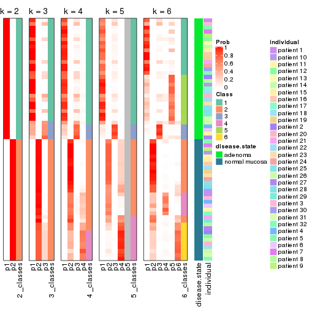


Test correlation between subgroups and known annotations. If the known
annotation is numeric, one-way ANOVA test is applied, and if the known
annotation is discrete, chi-squared contingency table test is applied.

```r
test_to_known_factors(res)
```

```
#>            n disease.state(p) individual(p) k
#> SD:mclust 64         9.19e-15         1.000 2
#> SD:mclust 60         9.36e-14         0.999 3
#> SD:mclust 57         2.57e-12         0.895 4
#> SD:mclust 50         7.99e-11         0.844 5
#> SD:mclust 58         3.15e-11         0.900 6
```


If matrix rows can be associated to genes, consider to use `functional_enrichment(res,
...)` to perform function enrichment for the signature genes. See [this vignette](http://bioconductor.org/packages/devel/bioc/vignettes/cola/inst/doc/functional_enrichment.html) for more detailed explanations.


 

---------------------------------------------------


### SD:NMF**


The object with results only for a single top-value method and a single partition method 
can be extracted as:

```r
res = res_list["SD", "NMF"]
# you can also extract it by
# res = res_list["SD:NMF"]
```

A summary of `res` and all the functions that can be applied to it:

```r
res
```

```
#> A 'ConsensusPartition' object with k = 2, 3, 4, 5, 6.
#>   On a matrix with 51941 rows and 64 columns.
#>   Top rows (1000, 2000, 3000, 4000, 5000) are extracted by 'SD' method.
#>   Subgroups are detected by 'NMF' method.
#>   Performed in total 1250 partitions by row resampling.
#>   Best k for subgroups seems to be 2.
#> 
#> Following methods can be applied to this 'ConsensusPartition' object:
#>  [1] "cola_report"             "collect_classes"         "collect_plots"          
#>  [4] "collect_stats"           "colnames"                "compare_signatures"     
#>  [7] "consensus_heatmap"       "dimension_reduction"     "functional_enrichment"  
#> [10] "get_anno_col"            "get_anno"                "get_classes"            
#> [13] "get_consensus"           "get_matrix"              "get_membership"         
#> [16] "get_param"               "get_signatures"          "get_stats"              
#> [19] "is_best_k"               "is_stable_k"             "membership_heatmap"     
#> [22] "ncol"                    "nrow"                    "plot_ecdf"              
#> [25] "rownames"                "select_partition_number" "show"                   
#> [28] "suggest_best_k"          "test_to_known_factors"
```

`collect_plots()` function collects all the plots made from `res` for all `k` (number of partitions)
into one single page to provide an easy and fast comparison between different `k`.

```r
collect_plots(res)
```


The plots are:

- The first row: a plot of the ECDF (empirical cumulative distribution
  function) curves of the consensus matrix for each `k` and the heatmap of
  predicted classes for each `k`.
- The second row: heatmaps of the consensus matrix for each `k`.
- The third row: heatmaps of the membership matrix for each `k`.
- The fouth row: heatmaps of the signatures for each `k`.

All the plots in panels can be made by individual functions and they are
plotted later in this section.

`select_partition_number()` produces several plots showing different
statistics for choosing "optimized" `k`. There are following statistics:

- ECDF curves of the consensus matrix for each `k`;
- 1-PAC. [The PAC
  score](https://en.wikipedia.org/wiki/Consensus_clustering#Over-interpretation_potential_of_consensus_clustering)
  measures the proportion of the ambiguous subgrouping.
- Mean silhouette score.
- Concordance. The mean probability of fiting the consensus class ids in all
  partitions.
- Area increased. Denote $A_k$ as the area under the ECDF curve for current
  `k`, the area increased is defined as $A_k - A_{k-1}$.
- Rand index. The percent of pairs of samples that are both in a same cluster
  or both are not in a same cluster in the partition of k and k-1.
- Jaccard index. The ratio of pairs of samples are both in a same cluster in
  the partition of k and k-1 and the pairs of samples are both in a same
  cluster in the partition k or k-1.

The detailed explanations of these statistics can be found in [the _cola_
vignette](http://bioconductor.org/packages/devel/bioc/vignettes/cola/inst/doc/cola.html#toc_13).

Generally speaking, lower PAC score, higher mean silhouette score or higher
concordance corresponds to better partition. Rand index and Jaccard index
measure how similar the current partition is compared to partition with `k-1`.
If they are too similar, we won't accept `k` is better than `k-1`.

```r
select_partition_number(res)
```


The numeric values for all these statistics can be obtained by `get_stats()`.

```r
get_stats(res)
```

```
#>   k 1-PAC mean_silhouette concordance area_increased  Rand Jaccard
#> 2 2 1.000           1.000       1.000         0.5084 0.492   0.492
#> 3 3 0.726           0.838       0.896         0.1856 0.944   0.887
#> 4 4 0.604           0.711       0.822         0.1029 0.960   0.908
#> 5 5 0.553           0.497       0.739         0.0911 0.959   0.898
#> 6 6 0.563           0.386       0.660         0.0575 0.878   0.678
```

`suggest_best_k()` suggests the best $k$ based on these statistics. The rules are as follows:

- All $k$ with Jaccard index larger than 0.95 are removed because increasing
  $k$ does not provide enough extra information. If all $k$ are removed, it is
  marked as no subgroup is detected.
- For all $k$ with 1-PAC score larger than 0.9, the maximal $k$ is taken as
  the best $k$, and other $k$ are marked as optional $k$.
- If it does not fit the second rule. The $k$ with the maximal vote of the
  highest 1-PAC score, highest mean silhouette, and highest concordance is
  taken as the best $k$.

```r
suggest_best_k(res)
```

```
#> [1] 2
```


Following shows the table of the partitions (You need to click the **show/hide
code output** link to see it). The membership matrix (columns with name `p*`)
is inferred by
[`clue::cl_consensus()`](https://www.rdocumentation.org/link/cl_consensus?package=clue)
function with the `SE` method. Basically the value in the membership matrix
represents the probability to belong to a certain group. The finall class
label for an item is determined with the group with highest probability it
belongs to.

In `get_classes()` function, the entropy is calculated from the membership
matrix and the silhouette score is calculated from the consensus matrix.


<script>
$( function() {
	$( '#tabs-SD-NMF-get-classes' ).tabs();
} );
</script>
<div id='tabs-SD-NMF-get-classes'>
<ul>
<li><a href='#tab-SD-NMF-get-classes-1'>k = 2</a></li>
<li><a href='#tab-SD-NMF-get-classes-2'>k = 3</a></li>
<li><a href='#tab-SD-NMF-get-classes-3'>k = 4</a></li>
<li><a href='#tab-SD-NMF-get-classes-4'>k = 5</a></li>
<li><a href='#tab-SD-NMF-get-classes-5'>k = 6</a></li>
</ul>

<div id='tab-SD-NMF-get-classes-1'>
<p><a id='tab-SD-NMF-get-classes-1-a' style='color:#0366d6' href='#'>show/hide code output</a></p>
<pre><code class="r">cbind(get_classes(res, k = 2), get_membership(res, k = 2))
</code></pre>

<pre><code>#&gt;           class entropy silhouette p1 p2
#&gt; GSM215051     2       0          1  0  1
#&gt; GSM215052     2       0          1  0  1
#&gt; GSM215053     2       0          1  0  1
#&gt; GSM215054     2       0          1  0  1
#&gt; GSM215055     2       0          1  0  1
#&gt; GSM215056     2       0          1  0  1
#&gt; GSM215057     2       0          1  0  1
#&gt; GSM215058     2       0          1  0  1
#&gt; GSM215059     2       0          1  0  1
#&gt; GSM215060     2       0          1  0  1
#&gt; GSM215061     2       0          1  0  1
#&gt; GSM215062     2       0          1  0  1
#&gt; GSM215063     2       0          1  0  1
#&gt; GSM215064     2       0          1  0  1
#&gt; GSM215065     2       0          1  0  1
#&gt; GSM215066     2       0          1  0  1
#&gt; GSM215067     2       0          1  0  1
#&gt; GSM215068     2       0          1  0  1
#&gt; GSM215069     2       0          1  0  1
#&gt; GSM215070     2       0          1  0  1
#&gt; GSM215071     2       0          1  0  1
#&gt; GSM215072     2       0          1  0  1
#&gt; GSM215073     2       0          1  0  1
#&gt; GSM215074     2       0          1  0  1
#&gt; GSM215075     2       0          1  0  1
#&gt; GSM215076     2       0          1  0  1
#&gt; GSM215077     2       0          1  0  1
#&gt; GSM215078     2       0          1  0  1
#&gt; GSM215079     2       0          1  0  1
#&gt; GSM215080     2       0          1  0  1
#&gt; GSM215081     2       0          1  0  1
#&gt; GSM215082     2       0          1  0  1
#&gt; GSM215083     1       0          1  1  0
#&gt; GSM215084     1       0          1  1  0
#&gt; GSM215085     1       0          1  1  0
#&gt; GSM215086     1       0          1  1  0
#&gt; GSM215087     1       0          1  1  0
#&gt; GSM215088     1       0          1  1  0
#&gt; GSM215089     1       0          1  1  0
#&gt; GSM215090     1       0          1  1  0
#&gt; GSM215091     1       0          1  1  0
#&gt; GSM215092     1       0          1  1  0
#&gt; GSM215093     1       0          1  1  0
#&gt; GSM215094     1       0          1  1  0
#&gt; GSM215095     1       0          1  1  0
#&gt; GSM215096     1       0          1  1  0
#&gt; GSM215097     1       0          1  1  0
#&gt; GSM215098     1       0          1  1  0
#&gt; GSM215099     1       0          1  1  0
#&gt; GSM215100     1       0          1  1  0
#&gt; GSM215101     1       0          1  1  0
#&gt; GSM215102     1       0          1  1  0
#&gt; GSM215103     1       0          1  1  0
#&gt; GSM215104     1       0          1  1  0
#&gt; GSM215105     1       0          1  1  0
#&gt; GSM215106     1       0          1  1  0
#&gt; GSM215107     1       0          1  1  0
#&gt; GSM215108     1       0          1  1  0
#&gt; GSM215109     1       0          1  1  0
#&gt; GSM215110     1       0          1  1  0
#&gt; GSM215111     1       0          1  1  0
#&gt; GSM215112     1       0          1  1  0
#&gt; GSM215113     1       0          1  1  0
#&gt; GSM215114     1       0          1  1  0
</code></pre>

<script>
$('#tab-SD-NMF-get-classes-1-a').parent().next().next().hide();
$('#tab-SD-NMF-get-classes-1-a').click(function(){
  $('#tab-SD-NMF-get-classes-1-a').parent().next().next().toggle();
  return(false);
});
</script>
</div>

<div id='tab-SD-NMF-get-classes-2'>
<p><a id='tab-SD-NMF-get-classes-2-a' style='color:#0366d6' href='#'>show/hide code output</a></p>
<pre><code class="r">cbind(get_classes(res, k = 3), get_membership(res, k = 3))
</code></pre>

<pre><code>#&gt;           class entropy silhouette    p1    p2    p3
#&gt; GSM215051     2  0.5785      0.657 0.000 0.668 0.332
#&gt; GSM215052     2  0.1964      0.925 0.000 0.944 0.056
#&gt; GSM215053     2  0.4842      0.791 0.000 0.776 0.224
#&gt; GSM215054     2  0.5363      0.736 0.000 0.724 0.276
#&gt; GSM215055     2  0.1411      0.923 0.000 0.964 0.036
#&gt; GSM215056     2  0.2711      0.902 0.000 0.912 0.088
#&gt; GSM215057     2  0.0592      0.929 0.000 0.988 0.012
#&gt; GSM215058     2  0.3038      0.905 0.000 0.896 0.104
#&gt; GSM215059     2  0.0892      0.928 0.000 0.980 0.020
#&gt; GSM215060     2  0.0747      0.929 0.000 0.984 0.016
#&gt; GSM215061     2  0.0592      0.929 0.000 0.988 0.012
#&gt; GSM215062     2  0.3192      0.890 0.000 0.888 0.112
#&gt; GSM215063     2  0.5465      0.720 0.000 0.712 0.288
#&gt; GSM215064     2  0.3038      0.895 0.000 0.896 0.104
#&gt; GSM215065     2  0.1860      0.919 0.000 0.948 0.052
#&gt; GSM215066     2  0.0592      0.928 0.000 0.988 0.012
#&gt; GSM215067     2  0.3752      0.863 0.000 0.856 0.144
#&gt; GSM215068     2  0.1289      0.927 0.000 0.968 0.032
#&gt; GSM215069     2  0.1163      0.926 0.000 0.972 0.028
#&gt; GSM215070     2  0.1860      0.925 0.000 0.948 0.052
#&gt; GSM215071     2  0.1411      0.925 0.000 0.964 0.036
#&gt; GSM215072     2  0.1753      0.926 0.000 0.952 0.048
#&gt; GSM215073     2  0.0424      0.928 0.000 0.992 0.008
#&gt; GSM215074     2  0.0424      0.928 0.000 0.992 0.008
#&gt; GSM215075     2  0.0424      0.928 0.000 0.992 0.008
#&gt; GSM215076     2  0.5138      0.785 0.000 0.748 0.252
#&gt; GSM215077     2  0.1529      0.926 0.000 0.960 0.040
#&gt; GSM215078     2  0.1643      0.921 0.000 0.956 0.044
#&gt; GSM215079     2  0.0892      0.928 0.000 0.980 0.020
#&gt; GSM215080     2  0.0892      0.928 0.000 0.980 0.020
#&gt; GSM215081     2  0.2959      0.898 0.000 0.900 0.100
#&gt; GSM215082     2  0.1643      0.923 0.000 0.956 0.044
#&gt; GSM215083     1  0.4702      0.717 0.788 0.000 0.212
#&gt; GSM215084     1  0.0237      0.850 0.996 0.000 0.004
#&gt; GSM215085     1  0.5835      0.423 0.660 0.000 0.340
#&gt; GSM215086     3  0.4974      0.892 0.236 0.000 0.764
#&gt; GSM215087     1  0.2261      0.819 0.932 0.000 0.068
#&gt; GSM215088     3  0.5882      0.752 0.348 0.000 0.652
#&gt; GSM215089     1  0.0747      0.852 0.984 0.000 0.016
#&gt; GSM215090     1  0.2625      0.836 0.916 0.000 0.084
#&gt; GSM215091     1  0.2165      0.843 0.936 0.000 0.064
#&gt; GSM215092     1  0.2878      0.832 0.904 0.000 0.096
#&gt; GSM215093     3  0.4861      0.853 0.192 0.008 0.800
#&gt; GSM215094     1  0.2711      0.796 0.912 0.000 0.088
#&gt; GSM215095     1  0.2448      0.808 0.924 0.000 0.076
#&gt; GSM215096     1  0.2165      0.818 0.936 0.000 0.064
#&gt; GSM215097     1  0.4605      0.739 0.796 0.000 0.204
#&gt; GSM215098     1  0.0592      0.850 0.988 0.000 0.012
#&gt; GSM215099     1  0.3038      0.828 0.896 0.000 0.104
#&gt; GSM215100     1  0.3192      0.821 0.888 0.000 0.112
#&gt; GSM215101     1  0.1964      0.848 0.944 0.000 0.056
#&gt; GSM215102     1  0.5397      0.591 0.720 0.000 0.280
#&gt; GSM215103     1  0.4291      0.761 0.820 0.000 0.180
#&gt; GSM215104     1  0.3192      0.821 0.888 0.000 0.112
#&gt; GSM215105     1  0.0424      0.852 0.992 0.000 0.008
#&gt; GSM215106     1  0.1411      0.851 0.964 0.000 0.036
#&gt; GSM215107     1  0.0237      0.849 0.996 0.000 0.004
#&gt; GSM215108     1  0.5431      0.583 0.716 0.000 0.284
#&gt; GSM215109     3  0.5216      0.888 0.260 0.000 0.740
#&gt; GSM215110     1  0.5835      0.416 0.660 0.000 0.340
#&gt; GSM215111     1  0.0747      0.852 0.984 0.000 0.016
#&gt; GSM215112     1  0.2625      0.800 0.916 0.000 0.084
#&gt; GSM215113     1  0.0000      0.850 1.000 0.000 0.000
#&gt; GSM215114     1  0.2066      0.822 0.940 0.000 0.060
</code></pre>

<script>
$('#tab-SD-NMF-get-classes-2-a').parent().next().next().hide();
$('#tab-SD-NMF-get-classes-2-a').click(function(){
  $('#tab-SD-NMF-get-classes-2-a').parent().next().next().toggle();
  return(false);
});
</script>
</div>

<div id='tab-SD-NMF-get-classes-3'>
<p><a id='tab-SD-NMF-get-classes-3-a' style='color:#0366d6' href='#'>show/hide code output</a></p>
<pre><code class="r">cbind(get_classes(res, k = 4), get_membership(res, k = 4))
</code></pre>

<pre><code>#&gt;           class entropy silhouette    p1    p2    p3    p4
#&gt; GSM215051     2  0.6664      0.493 0.000 0.580 0.308 0.112
#&gt; GSM215052     2  0.3463      0.854 0.000 0.864 0.096 0.040
#&gt; GSM215053     2  0.4914      0.640 0.000 0.676 0.312 0.012
#&gt; GSM215054     2  0.4990      0.591 0.000 0.640 0.352 0.008
#&gt; GSM215055     2  0.2469      0.847 0.000 0.892 0.108 0.000
#&gt; GSM215056     2  0.3123      0.822 0.000 0.844 0.156 0.000
#&gt; GSM215057     2  0.1118      0.879 0.000 0.964 0.036 0.000
#&gt; GSM215058     2  0.2976      0.865 0.000 0.872 0.120 0.008
#&gt; GSM215059     2  0.1118      0.877 0.000 0.964 0.036 0.000
#&gt; GSM215060     2  0.1302      0.870 0.000 0.956 0.044 0.000
#&gt; GSM215061     2  0.0921      0.874 0.000 0.972 0.028 0.000
#&gt; GSM215062     2  0.3806      0.830 0.000 0.824 0.156 0.020
#&gt; GSM215063     2  0.5643      0.423 0.000 0.548 0.428 0.024
#&gt; GSM215064     2  0.4093      0.824 0.004 0.816 0.156 0.024
#&gt; GSM215065     2  0.1004      0.878 0.000 0.972 0.024 0.004
#&gt; GSM215066     2  0.1256      0.879 0.000 0.964 0.028 0.008
#&gt; GSM215067     2  0.4328      0.743 0.000 0.748 0.244 0.008
#&gt; GSM215068     2  0.0707      0.878 0.000 0.980 0.020 0.000
#&gt; GSM215069     2  0.0657      0.878 0.000 0.984 0.012 0.004
#&gt; GSM215070     2  0.3587      0.854 0.000 0.860 0.088 0.052
#&gt; GSM215071     2  0.1302      0.875 0.000 0.956 0.044 0.000
#&gt; GSM215072     2  0.4590      0.811 0.000 0.792 0.148 0.060
#&gt; GSM215073     2  0.0817      0.876 0.000 0.976 0.024 0.000
#&gt; GSM215074     2  0.0817      0.877 0.000 0.976 0.024 0.000
#&gt; GSM215075     2  0.0592      0.879 0.000 0.984 0.016 0.000
#&gt; GSM215076     2  0.7317      0.441 0.000 0.528 0.204 0.268
#&gt; GSM215077     2  0.2882      0.865 0.000 0.892 0.084 0.024
#&gt; GSM215078     2  0.2021      0.876 0.000 0.932 0.056 0.012
#&gt; GSM215079     2  0.0817      0.877 0.000 0.976 0.024 0.000
#&gt; GSM215080     2  0.1022      0.877 0.000 0.968 0.032 0.000
#&gt; GSM215081     2  0.3105      0.845 0.000 0.856 0.140 0.004
#&gt; GSM215082     2  0.2589      0.859 0.000 0.884 0.116 0.000
#&gt; GSM215083     1  0.6386      0.448 0.648 0.000 0.140 0.212
#&gt; GSM215084     1  0.4238      0.707 0.796 0.000 0.028 0.176
#&gt; GSM215085     1  0.7613     -0.190 0.472 0.000 0.288 0.240
#&gt; GSM215086     3  0.6536      0.626 0.088 0.000 0.560 0.352
#&gt; GSM215087     1  0.2131      0.793 0.932 0.000 0.036 0.032
#&gt; GSM215088     3  0.7269      0.534 0.200 0.000 0.536 0.264
#&gt; GSM215089     1  0.2466      0.794 0.916 0.000 0.028 0.056
#&gt; GSM215090     1  0.3647      0.766 0.852 0.000 0.040 0.108
#&gt; GSM215091     1  0.3367      0.767 0.864 0.000 0.108 0.028
#&gt; GSM215092     1  0.3711      0.757 0.836 0.000 0.024 0.140
#&gt; GSM215093     3  0.6604      0.603 0.072 0.004 0.528 0.396
#&gt; GSM215094     1  0.3090      0.769 0.888 0.000 0.056 0.056
#&gt; GSM215095     1  0.1833      0.792 0.944 0.000 0.032 0.024
#&gt; GSM215096     1  0.3088      0.778 0.888 0.000 0.052 0.060
#&gt; GSM215097     1  0.6159      0.530 0.676 0.000 0.172 0.152
#&gt; GSM215098     1  0.2224      0.795 0.928 0.000 0.032 0.040
#&gt; GSM215099     1  0.3581      0.774 0.852 0.000 0.032 0.116
#&gt; GSM215100     1  0.3999      0.740 0.824 0.000 0.036 0.140
#&gt; GSM215101     1  0.2670      0.790 0.904 0.000 0.024 0.072
#&gt; GSM215102     4  0.5793      0.453 0.324 0.000 0.048 0.628
#&gt; GSM215103     1  0.5440      0.173 0.596 0.000 0.020 0.384
#&gt; GSM215104     1  0.4980      0.506 0.680 0.000 0.016 0.304
#&gt; GSM215105     1  0.2385      0.798 0.920 0.000 0.028 0.052
#&gt; GSM215106     1  0.3164      0.783 0.884 0.000 0.052 0.064
#&gt; GSM215107     1  0.0927      0.801 0.976 0.000 0.008 0.016
#&gt; GSM215108     4  0.5052      0.388 0.244 0.000 0.036 0.720
#&gt; GSM215109     4  0.4508     -0.235 0.036 0.000 0.184 0.780
#&gt; GSM215110     4  0.6693      0.350 0.424 0.000 0.088 0.488
#&gt; GSM215111     1  0.1545      0.800 0.952 0.000 0.008 0.040
#&gt; GSM215112     1  0.2224      0.789 0.928 0.000 0.040 0.032
#&gt; GSM215113     1  0.2329      0.796 0.916 0.000 0.012 0.072
#&gt; GSM215114     1  0.3243      0.774 0.876 0.000 0.036 0.088
</code></pre>

<script>
$('#tab-SD-NMF-get-classes-3-a').parent().next().next().hide();
$('#tab-SD-NMF-get-classes-3-a').click(function(){
  $('#tab-SD-NMF-get-classes-3-a').parent().next().next().toggle();
  return(false);
});
</script>
</div>

<div id='tab-SD-NMF-get-classes-4'>
<p><a id='tab-SD-NMF-get-classes-4-a' style='color:#0366d6' href='#'>show/hide code output</a></p>
<pre><code class="r">cbind(get_classes(res, k = 5), get_membership(res, k = 5))
</code></pre>

<pre><code>#&gt;           class entropy silhouette    p1    p2    p3    p4    p5
#&gt; GSM215051     2   0.748    -0.0440 0.000 0.532 0.156 0.144 0.168
#&gt; GSM215052     2   0.445     0.4486 0.000 0.724 0.000 0.048 0.228
#&gt; GSM215053     2   0.595     0.3741 0.000 0.660 0.132 0.032 0.176
#&gt; GSM215054     2   0.635     0.3008 0.000 0.612 0.156 0.032 0.200
#&gt; GSM215055     2   0.270     0.6553 0.000 0.880 0.012 0.008 0.100
#&gt; GSM215056     2   0.379     0.6061 0.000 0.816 0.036 0.012 0.136
#&gt; GSM215057     2   0.219     0.6810 0.000 0.904 0.000 0.012 0.084
#&gt; GSM215058     2   0.397     0.3906 0.000 0.692 0.000 0.004 0.304
#&gt; GSM215059     2   0.183     0.6786 0.000 0.924 0.000 0.008 0.068
#&gt; GSM215060     2   0.189     0.6755 0.000 0.920 0.008 0.000 0.072
#&gt; GSM215061     2   0.127     0.6832 0.000 0.948 0.000 0.000 0.052
#&gt; GSM215062     2   0.455    -0.0275 0.000 0.556 0.004 0.004 0.436
#&gt; GSM215063     2   0.690     0.1103 0.000 0.528 0.248 0.032 0.192
#&gt; GSM215064     2   0.442    -0.0302 0.000 0.552 0.004 0.000 0.444
#&gt; GSM215065     2   0.134     0.6868 0.000 0.944 0.000 0.000 0.056
#&gt; GSM215066     2   0.185     0.6801 0.000 0.912 0.000 0.000 0.088
#&gt; GSM215067     2   0.570     0.4157 0.000 0.668 0.116 0.020 0.196
#&gt; GSM215068     2   0.179     0.6746 0.000 0.916 0.000 0.000 0.084
#&gt; GSM215069     2   0.127     0.6829 0.000 0.948 0.000 0.000 0.052
#&gt; GSM215070     2   0.496     0.3916 0.000 0.700 0.000 0.096 0.204
#&gt; GSM215071     2   0.210     0.6736 0.000 0.916 0.004 0.012 0.068
#&gt; GSM215072     2   0.474     0.0227 0.000 0.572 0.000 0.020 0.408
#&gt; GSM215073     2   0.143     0.6799 0.000 0.944 0.000 0.004 0.052
#&gt; GSM215074     2   0.163     0.6812 0.000 0.936 0.000 0.008 0.056
#&gt; GSM215075     2   0.230     0.6798 0.000 0.900 0.004 0.008 0.088
#&gt; GSM215076     5   0.709     0.0000 0.000 0.312 0.024 0.212 0.452
#&gt; GSM215077     2   0.333     0.6182 0.000 0.824 0.000 0.024 0.152
#&gt; GSM215078     2   0.308     0.6577 0.000 0.864 0.008 0.028 0.100
#&gt; GSM215079     2   0.217     0.6754 0.000 0.904 0.004 0.004 0.088
#&gt; GSM215080     2   0.234     0.6599 0.000 0.884 0.004 0.000 0.112
#&gt; GSM215081     2   0.410     0.2251 0.000 0.628 0.000 0.000 0.372
#&gt; GSM215082     2   0.391     0.4872 0.000 0.740 0.004 0.008 0.248
#&gt; GSM215083     3   0.568    -0.0576 0.420 0.000 0.520 0.036 0.024
#&gt; GSM215084     1   0.476     0.4681 0.644 0.000 0.008 0.328 0.020
#&gt; GSM215085     3   0.563     0.3962 0.212 0.000 0.680 0.056 0.052
#&gt; GSM215086     3   0.498     0.3826 0.016 0.000 0.740 0.112 0.132
#&gt; GSM215087     1   0.442     0.6892 0.780 0.000 0.148 0.048 0.024
#&gt; GSM215088     3   0.484     0.4455 0.072 0.000 0.772 0.104 0.052
#&gt; GSM215089     1   0.431     0.6563 0.780 0.000 0.040 0.160 0.020
#&gt; GSM215090     1   0.554     0.5846 0.680 0.000 0.088 0.208 0.024
#&gt; GSM215091     1   0.457     0.6232 0.720 0.000 0.240 0.020 0.020
#&gt; GSM215092     1   0.491     0.5304 0.684 0.000 0.020 0.268 0.028
#&gt; GSM215093     3   0.579     0.2646 0.012 0.000 0.616 0.276 0.096
#&gt; GSM215094     1   0.474     0.6932 0.780 0.000 0.056 0.068 0.096
#&gt; GSM215095     1   0.246     0.7187 0.908 0.000 0.012 0.048 0.032
#&gt; GSM215096     1   0.512     0.6379 0.732 0.000 0.152 0.024 0.092
#&gt; GSM215097     1   0.604     0.2370 0.524 0.000 0.392 0.044 0.040
#&gt; GSM215098     1   0.403     0.6847 0.792 0.000 0.164 0.020 0.024
#&gt; GSM215099     1   0.394     0.7068 0.808 0.000 0.140 0.036 0.016
#&gt; GSM215100     1   0.430     0.6867 0.788 0.000 0.104 0.100 0.008
#&gt; GSM215101     1   0.461     0.6375 0.756 0.000 0.048 0.176 0.020
#&gt; GSM215102     4   0.535     0.4707 0.212 0.000 0.092 0.684 0.012
#&gt; GSM215103     1   0.680     0.1658 0.496 0.000 0.116 0.348 0.040
#&gt; GSM215104     1   0.644     0.4042 0.572 0.000 0.128 0.272 0.028
#&gt; GSM215105     1   0.429     0.7010 0.800 0.000 0.120 0.036 0.044
#&gt; GSM215106     1   0.505     0.5903 0.700 0.000 0.232 0.020 0.048
#&gt; GSM215107     1   0.279     0.7146 0.884 0.000 0.016 0.084 0.016
#&gt; GSM215108     4   0.679     0.4197 0.140 0.000 0.128 0.612 0.120
#&gt; GSM215109     4   0.594     0.2172 0.020 0.000 0.196 0.644 0.140
#&gt; GSM215110     4   0.668     0.2646 0.340 0.000 0.100 0.516 0.044
#&gt; GSM215111     1   0.274     0.7195 0.892 0.000 0.064 0.012 0.032
#&gt; GSM215112     1   0.330     0.7096 0.868 0.000 0.060 0.032 0.040
#&gt; GSM215113     1   0.364     0.6888 0.828 0.000 0.028 0.128 0.016
#&gt; GSM215114     1   0.480     0.6715 0.752 0.000 0.056 0.164 0.028
</code></pre>

<script>
$('#tab-SD-NMF-get-classes-4-a').parent().next().next().hide();
$('#tab-SD-NMF-get-classes-4-a').click(function(){
  $('#tab-SD-NMF-get-classes-4-a').parent().next().next().toggle();
  return(false);
});
</script>
</div>

<div id='tab-SD-NMF-get-classes-5'>
<p><a id='tab-SD-NMF-get-classes-5-a' style='color:#0366d6' href='#'>show/hide code output</a></p>
<pre><code class="r">cbind(get_classes(res, k = 6), get_membership(res, k = 6))
</code></pre>

<pre><code>#&gt;           class entropy silhouette    p1    p2    p3    p4    p5    p6
#&gt; GSM215051     2   0.742     0.1163 0.000 0.456 0.196 0.096 0.024 0.228
#&gt; GSM215052     2   0.498    -0.3500 0.000 0.584 0.000 0.340 0.004 0.072
#&gt; GSM215053     2   0.634     0.3482 0.000 0.592 0.180 0.164 0.028 0.036
#&gt; GSM215054     2   0.610     0.3988 0.000 0.632 0.176 0.116 0.032 0.044
#&gt; GSM215055     2   0.382     0.5845 0.000 0.812 0.084 0.080 0.016 0.008
#&gt; GSM215056     2   0.381     0.5651 0.000 0.800 0.084 0.100 0.016 0.000
#&gt; GSM215057     2   0.316     0.5705 0.000 0.820 0.020 0.152 0.008 0.000
#&gt; GSM215058     4   0.462     0.6054 0.000 0.480 0.016 0.492 0.004 0.008
#&gt; GSM215059     2   0.243     0.6150 0.000 0.884 0.012 0.092 0.012 0.000
#&gt; GSM215060     2   0.137     0.6328 0.000 0.944 0.012 0.044 0.000 0.000
#&gt; GSM215061     2   0.173     0.6168 0.000 0.920 0.000 0.072 0.004 0.004
#&gt; GSM215062     4   0.461     0.7527 0.008 0.384 0.000 0.584 0.012 0.012
#&gt; GSM215063     2   0.672     0.0996 0.000 0.412 0.388 0.136 0.056 0.008
#&gt; GSM215064     4   0.434     0.7538 0.004 0.388 0.000 0.592 0.008 0.008
#&gt; GSM215065     2   0.184     0.6298 0.000 0.920 0.008 0.064 0.008 0.000
#&gt; GSM215066     2   0.313     0.5623 0.000 0.836 0.008 0.132 0.016 0.008
#&gt; GSM215067     2   0.623     0.2822 0.000 0.560 0.244 0.144 0.048 0.004
#&gt; GSM215068     2   0.299     0.5040 0.000 0.812 0.000 0.176 0.008 0.004
#&gt; GSM215069     2   0.164     0.6111 0.000 0.924 0.000 0.068 0.008 0.000
#&gt; GSM215070     2   0.553    -0.2438 0.000 0.580 0.000 0.276 0.012 0.132
#&gt; GSM215071     2   0.264     0.5507 0.000 0.864 0.004 0.116 0.004 0.012
#&gt; GSM215072     4   0.519     0.7232 0.000 0.392 0.000 0.524 0.004 0.080
#&gt; GSM215073     2   0.166     0.6323 0.000 0.936 0.012 0.044 0.004 0.004
#&gt; GSM215074     2   0.152     0.6317 0.000 0.940 0.008 0.044 0.008 0.000
#&gt; GSM215075     2   0.289     0.5827 0.000 0.852 0.004 0.120 0.008 0.016
#&gt; GSM215076     4   0.635     0.4243 0.000 0.180 0.016 0.492 0.012 0.300
#&gt; GSM215077     2   0.463     0.3740 0.000 0.732 0.012 0.156 0.008 0.092
#&gt; GSM215078     2   0.340     0.6027 0.000 0.848 0.012 0.060 0.020 0.060
#&gt; GSM215079     2   0.270     0.5963 0.000 0.860 0.004 0.120 0.008 0.008
#&gt; GSM215080     2   0.287     0.5686 0.000 0.840 0.000 0.140 0.008 0.012
#&gt; GSM215081     4   0.417     0.6959 0.000 0.456 0.000 0.532 0.012 0.000
#&gt; GSM215082     2   0.421    -0.2810 0.000 0.604 0.004 0.380 0.004 0.008
#&gt; GSM215083     1   0.688    -0.0764 0.444 0.000 0.356 0.024 0.056 0.120
#&gt; GSM215084     5   0.521     0.3810 0.444 0.000 0.000 0.008 0.480 0.068
#&gt; GSM215085     3   0.803     0.3860 0.236 0.000 0.424 0.084 0.132 0.124
#&gt; GSM215086     3   0.624     0.4407 0.068 0.000 0.620 0.056 0.052 0.204
#&gt; GSM215087     1   0.414     0.4740 0.776 0.000 0.036 0.028 0.152 0.008
#&gt; GSM215088     3   0.595     0.5159 0.072 0.000 0.660 0.024 0.128 0.116
#&gt; GSM215089     1   0.443    -0.2256 0.528 0.000 0.012 0.004 0.452 0.004
#&gt; GSM215090     5   0.549     0.2537 0.432 0.000 0.052 0.020 0.488 0.008
#&gt; GSM215091     1   0.491     0.4716 0.716 0.000 0.148 0.008 0.108 0.020
#&gt; GSM215092     5   0.503     0.4649 0.400 0.000 0.004 0.012 0.544 0.040
#&gt; GSM215093     3   0.596     0.4301 0.012 0.000 0.604 0.040 0.108 0.236
#&gt; GSM215094     1   0.477     0.3914 0.708 0.000 0.008 0.096 0.180 0.008
#&gt; GSM215095     1   0.340     0.4380 0.800 0.000 0.012 0.020 0.168 0.000
#&gt; GSM215096     1   0.401     0.5031 0.812 0.000 0.044 0.068 0.064 0.012
#&gt; GSM215097     1   0.666     0.2929 0.508 0.000 0.304 0.020 0.108 0.060
#&gt; GSM215098     1   0.411     0.4974 0.796 0.000 0.056 0.028 0.108 0.012
#&gt; GSM215099     1   0.490     0.4668 0.732 0.000 0.080 0.008 0.136 0.044
#&gt; GSM215100     1   0.522     0.3617 0.680 0.000 0.048 0.012 0.212 0.048
#&gt; GSM215101     1   0.472    -0.3167 0.500 0.000 0.016 0.008 0.468 0.008
#&gt; GSM215102     6   0.613     0.2004 0.084 0.000 0.020 0.024 0.420 0.452
#&gt; GSM215103     6   0.682    -0.0746 0.400 0.000 0.056 0.020 0.116 0.408
#&gt; GSM215104     1   0.635     0.1429 0.560 0.000 0.032 0.020 0.148 0.240
#&gt; GSM215105     1   0.525     0.4634 0.716 0.000 0.092 0.048 0.124 0.020
#&gt; GSM215106     1   0.491     0.4728 0.740 0.000 0.140 0.028 0.056 0.036
#&gt; GSM215107     1   0.338     0.3823 0.776 0.000 0.004 0.008 0.208 0.004
#&gt; GSM215108     6   0.395     0.4043 0.060 0.000 0.012 0.024 0.096 0.808
#&gt; GSM215109     6   0.285     0.2933 0.004 0.000 0.064 0.008 0.052 0.872
#&gt; GSM215110     5   0.590     0.0212 0.088 0.000 0.048 0.032 0.652 0.180
#&gt; GSM215111     1   0.367     0.4864 0.800 0.000 0.028 0.028 0.144 0.000
#&gt; GSM215112     1   0.314     0.4790 0.836 0.000 0.008 0.024 0.128 0.004
#&gt; GSM215113     1   0.484     0.2505 0.644 0.000 0.020 0.016 0.300 0.020
#&gt; GSM215114     1   0.481     0.2940 0.684 0.000 0.020 0.028 0.248 0.020
</code></pre>

<script>
$('#tab-SD-NMF-get-classes-5-a').parent().next().next().hide();
$('#tab-SD-NMF-get-classes-5-a').click(function(){
  $('#tab-SD-NMF-get-classes-5-a').parent().next().next().toggle();
  return(false);
});
</script>
</div>
</div>

Heatmaps for the consensus matrix. It visualizes the probability of two
samples to be in a same group.


<script>
$( function() {
	$( '#tabs-SD-NMF-consensus-heatmap' ).tabs();
} );
</script>
<div id='tabs-SD-NMF-consensus-heatmap'>
<ul>
<li><a href='#tab-SD-NMF-consensus-heatmap-1'>k = 2</a></li>
<li><a href='#tab-SD-NMF-consensus-heatmap-2'>k = 3</a></li>
<li><a href='#tab-SD-NMF-consensus-heatmap-3'>k = 4</a></li>
<li><a href='#tab-SD-NMF-consensus-heatmap-4'>k = 5</a></li>
<li><a href='#tab-SD-NMF-consensus-heatmap-5'>k = 6</a></li>
</ul>
<div id='tab-SD-NMF-consensus-heatmap-1'>
<pre><code class="r">consensus_heatmap(res, k = 2)
</code></pre>

<p></p>

</div>
<div id='tab-SD-NMF-consensus-heatmap-2'>
<pre><code class="r">consensus_heatmap(res, k = 3)
</code></pre>

<p></p>

</div>
<div id='tab-SD-NMF-consensus-heatmap-3'>
<pre><code class="r">consensus_heatmap(res, k = 4)
</code></pre>

<p></p>

</div>
<div id='tab-SD-NMF-consensus-heatmap-4'>
<pre><code class="r">consensus_heatmap(res, k = 5)
</code></pre>

<p></p>

</div>
<div id='tab-SD-NMF-consensus-heatmap-5'>
<pre><code class="r">consensus_heatmap(res, k = 6)
</code></pre>

<p></p>

</div>
</div>

Heatmaps for the membership of samples in all partitions to see how consistent they are:


<script>
$( function() {
	$( '#tabs-SD-NMF-membership-heatmap' ).tabs();
} );
</script>
<div id='tabs-SD-NMF-membership-heatmap'>
<ul>
<li><a href='#tab-SD-NMF-membership-heatmap-1'>k = 2</a></li>
<li><a href='#tab-SD-NMF-membership-heatmap-2'>k = 3</a></li>
<li><a href='#tab-SD-NMF-membership-heatmap-3'>k = 4</a></li>
<li><a href='#tab-SD-NMF-membership-heatmap-4'>k = 5</a></li>
<li><a href='#tab-SD-NMF-membership-heatmap-5'>k = 6</a></li>
</ul>
<div id='tab-SD-NMF-membership-heatmap-1'>
<pre><code class="r">membership_heatmap(res, k = 2)
</code></pre>

<p></p>

</div>
<div id='tab-SD-NMF-membership-heatmap-2'>
<pre><code class="r">membership_heatmap(res, k = 3)
</code></pre>

<p></p>

</div>
<div id='tab-SD-NMF-membership-heatmap-3'>
<pre><code class="r">membership_heatmap(res, k = 4)
</code></pre>

<p></p>

</div>
<div id='tab-SD-NMF-membership-heatmap-4'>
<pre><code class="r">membership_heatmap(res, k = 5)
</code></pre>

<p>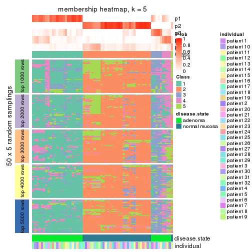</p>

</div>
<div id='tab-SD-NMF-membership-heatmap-5'>
<pre><code class="r">membership_heatmap(res, k = 6)
</code></pre>

<p></p>

</div>
</div>

As soon as we have had the classes for columns, we can look for signatures
which are significantly different between classes which can be candidate marks
for certain classes. Following are the heatmaps for signatures.


Signature heatmaps where rows are scaled:


<script>
$( function() {
	$( '#tabs-SD-NMF-get-signatures' ).tabs();
} );
</script>
<div id='tabs-SD-NMF-get-signatures'>
<ul>
<li><a href='#tab-SD-NMF-get-signatures-1'>k = 2</a></li>
<li><a href='#tab-SD-NMF-get-signatures-2'>k = 3</a></li>
<li><a href='#tab-SD-NMF-get-signatures-3'>k = 4</a></li>
<li><a href='#tab-SD-NMF-get-signatures-4'>k = 5</a></li>
<li><a href='#tab-SD-NMF-get-signatures-5'>k = 6</a></li>
</ul>
<div id='tab-SD-NMF-get-signatures-1'>
<pre><code class="r">get_signatures(res, k = 2)
</code></pre>

<p></p>

</div>
<div id='tab-SD-NMF-get-signatures-2'>
<pre><code class="r">get_signatures(res, k = 3)
</code></pre>

<p></p>

</div>
<div id='tab-SD-NMF-get-signatures-3'>
<pre><code class="r">get_signatures(res, k = 4)
</code></pre>

<p></p>

</div>
<div id='tab-SD-NMF-get-signatures-4'>
<pre><code class="r">get_signatures(res, k = 5)
</code></pre>

<p></p>

</div>
<div id='tab-SD-NMF-get-signatures-5'>
<pre><code class="r">get_signatures(res, k = 6)
</code></pre>

<p></p>

</div>
</div>


Signature heatmaps where rows are not scaled:


<script>
$( function() {
	$( '#tabs-SD-NMF-get-signatures-no-scale' ).tabs();
} );
</script>
<div id='tabs-SD-NMF-get-signatures-no-scale'>
<ul>
<li><a href='#tab-SD-NMF-get-signatures-no-scale-1'>k = 2</a></li>
<li><a href='#tab-SD-NMF-get-signatures-no-scale-2'>k = 3</a></li>
<li><a href='#tab-SD-NMF-get-signatures-no-scale-3'>k = 4</a></li>
<li><a href='#tab-SD-NMF-get-signatures-no-scale-4'>k = 5</a></li>
<li><a href='#tab-SD-NMF-get-signatures-no-scale-5'>k = 6</a></li>
</ul>
<div id='tab-SD-NMF-get-signatures-no-scale-1'>
<pre><code class="r">get_signatures(res, k = 2, scale_rows = FALSE)
</code></pre>

<p></p>

</div>
<div id='tab-SD-NMF-get-signatures-no-scale-2'>
<pre><code class="r">get_signatures(res, k = 3, scale_rows = FALSE)
</code></pre>

<p></p>

</div>
<div id='tab-SD-NMF-get-signatures-no-scale-3'>
<pre><code class="r">get_signatures(res, k = 4, scale_rows = FALSE)
</code></pre>

<p></p>

</div>
<div id='tab-SD-NMF-get-signatures-no-scale-4'>
<pre><code class="r">get_signatures(res, k = 5, scale_rows = FALSE)
</code></pre>

<p></p>

</div>
<div id='tab-SD-NMF-get-signatures-no-scale-5'>
<pre><code class="r">get_signatures(res, k = 6, scale_rows = FALSE)
</code></pre>

<p></p>

</div>
</div>


Compare the overlap of signatures from different k:

```r
compare_signatures(res)
```


`get_signature()` returns a data frame invisibly. TO get the list of signatures, the function
call should be assigned to a variable explicitly. In following code, if `plot` argument is set
to `FALSE`, no heatmap is plotted while only the differential analysis is performed.

```r
# code only for demonstration
tb = get_signature(res, k = ..., plot = FALSE)
```

An example of the output of `tb` is:

```
#>   which_row         fdr    mean_1    mean_2 scaled_mean_1 scaled_mean_2 km
#> 1        38 0.042760348  8.373488  9.131774    -0.5533452     0.5164555  1
#> 2        40 0.018707592  7.106213  8.469186    -0.6173731     0.5762149  1
#> 3        55 0.019134737 10.221463 11.207825    -0.6159697     0.5749050  1
#> 4        59 0.006059896  5.921854  7.869574    -0.6899429     0.6439467  1
#> 5        60 0.018055526  8.928898 10.211722    -0.6204761     0.5791110  1
#> 6        98 0.009384629 15.714769 14.887706     0.6635654    -0.6193277  2
...
```

The columns in `tb` are:

1. `which_row`: row indices corresponding to the input matrix.
2. `fdr`: FDR for the differential test. 
3. `mean_x`: The mean value in group x.
4. `scaled_mean_x`: The mean value in group x after rows are scaled.
5. `km`: Row groups if k-means clustering is applied to rows.


UMAP plot which shows how samples are separated.


<script>
$( function() {
	$( '#tabs-SD-NMF-dimension-reduction' ).tabs();
} );
</script>
<div id='tabs-SD-NMF-dimension-reduction'>
<ul>
<li><a href='#tab-SD-NMF-dimension-reduction-1'>k = 2</a></li>
<li><a href='#tab-SD-NMF-dimension-reduction-2'>k = 3</a></li>
<li><a href='#tab-SD-NMF-dimension-reduction-3'>k = 4</a></li>
<li><a href='#tab-SD-NMF-dimension-reduction-4'>k = 5</a></li>
<li><a href='#tab-SD-NMF-dimension-reduction-5'>k = 6</a></li>
</ul>
<div id='tab-SD-NMF-dimension-reduction-1'>
<pre><code class="r">dimension_reduction(res, k = 2, method = &quot;UMAP&quot;)
</code></pre>

<p></p>

</div>
<div id='tab-SD-NMF-dimension-reduction-2'>
<pre><code class="r">dimension_reduction(res, k = 3, method = &quot;UMAP&quot;)
</code></pre>

<p></p>

</div>
<div id='tab-SD-NMF-dimension-reduction-3'>
<pre><code class="r">dimension_reduction(res, k = 4, method = &quot;UMAP&quot;)
</code></pre>

<p></p>

</div>
<div id='tab-SD-NMF-dimension-reduction-4'>
<pre><code class="r">dimension_reduction(res, k = 5, method = &quot;UMAP&quot;)
</code></pre>

<p></p>

</div>
<div id='tab-SD-NMF-dimension-reduction-5'>
<pre><code class="r">dimension_reduction(res, k = 6, method = &quot;UMAP&quot;)
</code></pre>

<p></p>

</div>
</div>


Following heatmap shows how subgroups are split when increasing `k`:

```r
collect_classes(res)
```


Test correlation between subgroups and known annotations. If the known
annotation is numeric, one-way ANOVA test is applied, and if the known
annotation is discrete, chi-squared contingency table test is applied.

```r
test_to_known_factors(res)
```

```
#>         n disease.state(p) individual(p) k
#> SD:NMF 64         9.19e-15         1.000 2
#> SD:NMF 62         3.44e-14         0.999 3
#> SD:NMF 54         1.88e-12         0.997 4
#> SD:NMF 37         8.73e-09         0.966 5
#> SD:NMF 24         2.50e-05         0.959 6
```


If matrix rows can be associated to genes, consider to use `functional_enrichment(res,
...)` to perform function enrichment for the signature genes. See [this vignette](http://bioconductor.org/packages/devel/bioc/vignettes/cola/inst/doc/functional_enrichment.html) for more detailed explanations.


 

---------------------------------------------------


### CV:hclust*


The object with results only for a single top-value method and a single partition method 
can be extracted as:

```r
res = res_list["CV", "hclust"]
# you can also extract it by
# res = res_list["CV:hclust"]
```

A summary of `res` and all the functions that can be applied to it:

```r
res
```

```
#> A 'ConsensusPartition' object with k = 2, 3, 4, 5, 6.
#>   On a matrix with 51941 rows and 64 columns.
#>   Top rows (1000, 2000, 3000, 4000, 5000) are extracted by 'CV' method.
#>   Subgroups are detected by 'hclust' method.
#>   Performed in total 1250 partitions by row resampling.
#>   Best k for subgroups seems to be 3.
#> 
#> Following methods can be applied to this 'ConsensusPartition' object:
#>  [1] "cola_report"             "collect_classes"         "collect_plots"          
#>  [4] "collect_stats"           "colnames"                "compare_signatures"     
#>  [7] "consensus_heatmap"       "dimension_reduction"     "functional_enrichment"  
#> [10] "get_anno_col"            "get_anno"                "get_classes"            
#> [13] "get_consensus"           "get_matrix"              "get_membership"         
#> [16] "get_param"               "get_signatures"          "get_stats"              
#> [19] "is_best_k"               "is_stable_k"             "membership_heatmap"     
#> [22] "ncol"                    "nrow"                    "plot_ecdf"              
#> [25] "rownames"                "select_partition_number" "show"                   
#> [28] "suggest_best_k"          "test_to_known_factors"
```

`collect_plots()` function collects all the plots made from `res` for all `k` (number of partitions)
into one single page to provide an easy and fast comparison between different `k`.

```r
collect_plots(res)
```


The plots are:

- The first row: a plot of the ECDF (empirical cumulative distribution
  function) curves of the consensus matrix for each `k` and the heatmap of
  predicted classes for each `k`.
- The second row: heatmaps of the consensus matrix for each `k`.
- The third row: heatmaps of the membership matrix for each `k`.
- The fouth row: heatmaps of the signatures for each `k`.

All the plots in panels can be made by individual functions and they are
plotted later in this section.

`select_partition_number()` produces several plots showing different
statistics for choosing "optimized" `k`. There are following statistics:

- ECDF curves of the consensus matrix for each `k`;
- 1-PAC. [The PAC
  score](https://en.wikipedia.org/wiki/Consensus_clustering#Over-interpretation_potential_of_consensus_clustering)
  measures the proportion of the ambiguous subgrouping.
- Mean silhouette score.
- Concordance. The mean probability of fiting the consensus class ids in all
  partitions.
- Area increased. Denote $A_k$ as the area under the ECDF curve for current
  `k`, the area increased is defined as $A_k - A_{k-1}$.
- Rand index. The percent of pairs of samples that are both in a same cluster
  or both are not in a same cluster in the partition of k and k-1.
- Jaccard index. The ratio of pairs of samples are both in a same cluster in
  the partition of k and k-1 and the pairs of samples are both in a same
  cluster in the partition k or k-1.

The detailed explanations of these statistics can be found in [the _cola_
vignette](http://bioconductor.org/packages/devel/bioc/vignettes/cola/inst/doc/cola.html#toc_13).

Generally speaking, lower PAC score, higher mean silhouette score or higher
concordance corresponds to better partition. Rand index and Jaccard index
measure how similar the current partition is compared to partition with `k-1`.
If they are too similar, we won't accept `k` is better than `k-1`.

```r
select_partition_number(res)
```


The numeric values for all these statistics can be obtained by `get_stats()`.

```r
get_stats(res)
```

```
#>   k 1-PAC mean_silhouette concordance area_increased  Rand Jaccard
#> 2 2 1.000           0.993       0.997         0.5083 0.492   0.492
#> 3 3 0.918           0.903       0.943         0.1213 0.933   0.864
#> 4 4 0.879           0.880       0.938         0.0410 0.983   0.961
#> 5 5 0.815           0.834       0.916         0.0334 0.997   0.993
#> 6 6 0.824           0.794       0.900         0.0309 0.986   0.965
```

`suggest_best_k()` suggests the best $k$ based on these statistics. The rules are as follows:

- All $k$ with Jaccard index larger than 0.95 are removed because increasing
  $k$ does not provide enough extra information. If all $k$ are removed, it is
  marked as no subgroup is detected.
- For all $k$ with 1-PAC score larger than 0.9, the maximal $k$ is taken as
  the best $k$, and other $k$ are marked as optional $k$.
- If it does not fit the second rule. The $k$ with the maximal vote of the
  highest 1-PAC score, highest mean silhouette, and highest concordance is
  taken as the best $k$.

```r
suggest_best_k(res)
```

```
#> [1] 3
#> attr(,"optional")
#> [1] 2
```

There is also optional best $k$ = 2 that is worth to check.

Following shows the table of the partitions (You need to click the **show/hide
code output** link to see it). The membership matrix (columns with name `p*`)
is inferred by
[`clue::cl_consensus()`](https://www.rdocumentation.org/link/cl_consensus?package=clue)
function with the `SE` method. Basically the value in the membership matrix
represents the probability to belong to a certain group. The finall class
label for an item is determined with the group with highest probability it
belongs to.

In `get_classes()` function, the entropy is calculated from the membership
matrix and the silhouette score is calculated from the consensus matrix.


<script>
$( function() {
	$( '#tabs-CV-hclust-get-classes' ).tabs();
} );
</script>
<div id='tabs-CV-hclust-get-classes'>
<ul>
<li><a href='#tab-CV-hclust-get-classes-1'>k = 2</a></li>
<li><a href='#tab-CV-hclust-get-classes-2'>k = 3</a></li>
<li><a href='#tab-CV-hclust-get-classes-3'>k = 4</a></li>
<li><a href='#tab-CV-hclust-get-classes-4'>k = 5</a></li>
<li><a href='#tab-CV-hclust-get-classes-5'>k = 6</a></li>
</ul>

<div id='tab-CV-hclust-get-classes-1'>
<p><a id='tab-CV-hclust-get-classes-1-a' style='color:#0366d6' href='#'>show/hide code output</a></p>
<pre><code class="r">cbind(get_classes(res, k = 2), get_membership(res, k = 2))
</code></pre>

<pre><code>#&gt;           class entropy silhouette    p1    p2
#&gt; GSM215051     2  0.0000      0.999 0.000 1.000
#&gt; GSM215052     2  0.0000      0.999 0.000 1.000
#&gt; GSM215053     2  0.0000      0.999 0.000 1.000
#&gt; GSM215054     2  0.0000      0.999 0.000 1.000
#&gt; GSM215055     2  0.0000      0.999 0.000 1.000
#&gt; GSM215056     2  0.0000      0.999 0.000 1.000
#&gt; GSM215057     2  0.0000      0.999 0.000 1.000
#&gt; GSM215058     2  0.0000      0.999 0.000 1.000
#&gt; GSM215059     2  0.0000      0.999 0.000 1.000
#&gt; GSM215060     2  0.0000      0.999 0.000 1.000
#&gt; GSM215061     2  0.0000      0.999 0.000 1.000
#&gt; GSM215062     2  0.0000      0.999 0.000 1.000
#&gt; GSM215063     2  0.1184      0.984 0.016 0.984
#&gt; GSM215064     2  0.0000      0.999 0.000 1.000
#&gt; GSM215065     2  0.0000      0.999 0.000 1.000
#&gt; GSM215066     2  0.0000      0.999 0.000 1.000
#&gt; GSM215067     2  0.1184      0.984 0.016 0.984
#&gt; GSM215068     2  0.0000      0.999 0.000 1.000
#&gt; GSM215069     2  0.0000      0.999 0.000 1.000
#&gt; GSM215070     2  0.0000      0.999 0.000 1.000
#&gt; GSM215071     2  0.0000      0.999 0.000 1.000
#&gt; GSM215072     2  0.0000      0.999 0.000 1.000
#&gt; GSM215073     2  0.0000      0.999 0.000 1.000
#&gt; GSM215074     2  0.0000      0.999 0.000 1.000
#&gt; GSM215075     2  0.0000      0.999 0.000 1.000
#&gt; GSM215076     2  0.0000      0.999 0.000 1.000
#&gt; GSM215077     2  0.0000      0.999 0.000 1.000
#&gt; GSM215078     2  0.0000      0.999 0.000 1.000
#&gt; GSM215079     2  0.0000      0.999 0.000 1.000
#&gt; GSM215080     2  0.0000      0.999 0.000 1.000
#&gt; GSM215081     2  0.0000      0.999 0.000 1.000
#&gt; GSM215082     2  0.0000      0.999 0.000 1.000
#&gt; GSM215083     1  0.0000      0.994 1.000 0.000
#&gt; GSM215084     1  0.0000      0.994 1.000 0.000
#&gt; GSM215085     1  0.0000      0.994 1.000 0.000
#&gt; GSM215086     1  0.0938      0.984 0.988 0.012
#&gt; GSM215087     1  0.0000      0.994 1.000 0.000
#&gt; GSM215088     1  0.0376      0.991 0.996 0.004
#&gt; GSM215089     1  0.0000      0.994 1.000 0.000
#&gt; GSM215090     1  0.0000      0.994 1.000 0.000
#&gt; GSM215091     1  0.0000      0.994 1.000 0.000
#&gt; GSM215092     1  0.0000      0.994 1.000 0.000
#&gt; GSM215093     1  0.6247      0.816 0.844 0.156
#&gt; GSM215094     1  0.0000      0.994 1.000 0.000
#&gt; GSM215095     1  0.0000      0.994 1.000 0.000
#&gt; GSM215096     1  0.0000      0.994 1.000 0.000
#&gt; GSM215097     1  0.0000      0.994 1.000 0.000
#&gt; GSM215098     1  0.0000      0.994 1.000 0.000
#&gt; GSM215099     1  0.0000      0.994 1.000 0.000
#&gt; GSM215100     1  0.0000      0.994 1.000 0.000
#&gt; GSM215101     1  0.0000      0.994 1.000 0.000
#&gt; GSM215102     1  0.0000      0.994 1.000 0.000
#&gt; GSM215103     1  0.0000      0.994 1.000 0.000
#&gt; GSM215104     1  0.0000      0.994 1.000 0.000
#&gt; GSM215105     1  0.0000      0.994 1.000 0.000
#&gt; GSM215106     1  0.0000      0.994 1.000 0.000
#&gt; GSM215107     1  0.0000      0.994 1.000 0.000
#&gt; GSM215108     1  0.0000      0.994 1.000 0.000
#&gt; GSM215109     1  0.0000      0.994 1.000 0.000
#&gt; GSM215110     1  0.0000      0.994 1.000 0.000
#&gt; GSM215111     1  0.0000      0.994 1.000 0.000
#&gt; GSM215112     1  0.0000      0.994 1.000 0.000
#&gt; GSM215113     1  0.0000      0.994 1.000 0.000
#&gt; GSM215114     1  0.0000      0.994 1.000 0.000
</code></pre>

<script>
$('#tab-CV-hclust-get-classes-1-a').parent().next().next().hide();
$('#tab-CV-hclust-get-classes-1-a').click(function(){
  $('#tab-CV-hclust-get-classes-1-a').parent().next().next().toggle();
  return(false);
});
</script>
</div>

<div id='tab-CV-hclust-get-classes-2'>
<p><a id='tab-CV-hclust-get-classes-2-a' style='color:#0366d6' href='#'>show/hide code output</a></p>
<pre><code class="r">cbind(get_classes(res, k = 3), get_membership(res, k = 3))
</code></pre>

<pre><code>#&gt;           class entropy silhouette    p1    p2    p3
#&gt; GSM215051     2  0.0000      0.998 0.000 1.000 0.000
#&gt; GSM215052     2  0.0000      0.998 0.000 1.000 0.000
#&gt; GSM215053     2  0.0000      0.998 0.000 1.000 0.000
#&gt; GSM215054     2  0.0000      0.998 0.000 1.000 0.000
#&gt; GSM215055     2  0.0000      0.998 0.000 1.000 0.000
#&gt; GSM215056     2  0.0000      0.998 0.000 1.000 0.000
#&gt; GSM215057     2  0.0000      0.998 0.000 1.000 0.000
#&gt; GSM215058     2  0.0000      0.998 0.000 1.000 0.000
#&gt; GSM215059     2  0.0000      0.998 0.000 1.000 0.000
#&gt; GSM215060     2  0.0000      0.998 0.000 1.000 0.000
#&gt; GSM215061     2  0.0000      0.998 0.000 1.000 0.000
#&gt; GSM215062     2  0.0000      0.998 0.000 1.000 0.000
#&gt; GSM215063     2  0.1163      0.973 0.000 0.972 0.028
#&gt; GSM215064     2  0.0000      0.998 0.000 1.000 0.000
#&gt; GSM215065     2  0.0000      0.998 0.000 1.000 0.000
#&gt; GSM215066     2  0.0000      0.998 0.000 1.000 0.000
#&gt; GSM215067     2  0.1163      0.973 0.000 0.972 0.028
#&gt; GSM215068     2  0.0000      0.998 0.000 1.000 0.000
#&gt; GSM215069     2  0.0000      0.998 0.000 1.000 0.000
#&gt; GSM215070     2  0.0000      0.998 0.000 1.000 0.000
#&gt; GSM215071     2  0.0000      0.998 0.000 1.000 0.000
#&gt; GSM215072     2  0.0000      0.998 0.000 1.000 0.000
#&gt; GSM215073     2  0.0000      0.998 0.000 1.000 0.000
#&gt; GSM215074     2  0.0000      0.998 0.000 1.000 0.000
#&gt; GSM215075     2  0.0000      0.998 0.000 1.000 0.000
#&gt; GSM215076     2  0.0000      0.998 0.000 1.000 0.000
#&gt; GSM215077     2  0.0000      0.998 0.000 1.000 0.000
#&gt; GSM215078     2  0.0000      0.998 0.000 1.000 0.000
#&gt; GSM215079     2  0.0000      0.998 0.000 1.000 0.000
#&gt; GSM215080     2  0.0000      0.998 0.000 1.000 0.000
#&gt; GSM215081     2  0.0000      0.998 0.000 1.000 0.000
#&gt; GSM215082     2  0.0000      0.998 0.000 1.000 0.000
#&gt; GSM215083     1  0.3686      0.794 0.860 0.000 0.140
#&gt; GSM215084     1  0.1411      0.910 0.964 0.000 0.036
#&gt; GSM215085     3  0.5291      0.625 0.268 0.000 0.732
#&gt; GSM215086     3  0.3686      0.638 0.140 0.000 0.860
#&gt; GSM215087     1  0.0747      0.914 0.984 0.000 0.016
#&gt; GSM215088     3  0.6235      0.579 0.436 0.000 0.564
#&gt; GSM215089     1  0.1289      0.917 0.968 0.000 0.032
#&gt; GSM215090     1  0.1964      0.904 0.944 0.000 0.056
#&gt; GSM215091     1  0.0747      0.916 0.984 0.000 0.016
#&gt; GSM215092     1  0.1753      0.912 0.952 0.000 0.048
#&gt; GSM215093     3  0.9136      0.547 0.400 0.144 0.456
#&gt; GSM215094     1  0.1163      0.916 0.972 0.000 0.028
#&gt; GSM215095     1  0.0592      0.916 0.988 0.000 0.012
#&gt; GSM215096     1  0.0747      0.916 0.984 0.000 0.016
#&gt; GSM215097     1  0.1411      0.915 0.964 0.000 0.036
#&gt; GSM215098     1  0.0592      0.913 0.988 0.000 0.012
#&gt; GSM215099     1  0.1529      0.914 0.960 0.000 0.040
#&gt; GSM215100     1  0.1643      0.908 0.956 0.000 0.044
#&gt; GSM215101     1  0.1860      0.903 0.948 0.000 0.052
#&gt; GSM215102     1  0.2537      0.885 0.920 0.000 0.080
#&gt; GSM215103     1  0.3551      0.821 0.868 0.000 0.132
#&gt; GSM215104     1  0.2711      0.876 0.912 0.000 0.088
#&gt; GSM215105     1  0.1860      0.911 0.948 0.000 0.052
#&gt; GSM215106     1  0.1411      0.915 0.964 0.000 0.036
#&gt; GSM215107     1  0.2711      0.872 0.912 0.000 0.088
#&gt; GSM215108     1  0.6180     -0.257 0.584 0.000 0.416
#&gt; GSM215109     3  0.6244      0.578 0.440 0.000 0.560
#&gt; GSM215110     1  0.4702      0.651 0.788 0.000 0.212
#&gt; GSM215111     1  0.1289      0.915 0.968 0.000 0.032
#&gt; GSM215112     1  0.0592      0.913 0.988 0.000 0.012
#&gt; GSM215113     1  0.1289      0.917 0.968 0.000 0.032
#&gt; GSM215114     1  0.0892      0.915 0.980 0.000 0.020
</code></pre>

<script>
$('#tab-CV-hclust-get-classes-2-a').parent().next().next().hide();
$('#tab-CV-hclust-get-classes-2-a').click(function(){
  $('#tab-CV-hclust-get-classes-2-a').parent().next().next().toggle();
  return(false);
});
</script>
</div>

<div id='tab-CV-hclust-get-classes-3'>
<p><a id='tab-CV-hclust-get-classes-3-a' style='color:#0366d6' href='#'>show/hide code output</a></p>
<pre><code class="r">cbind(get_classes(res, k = 4), get_membership(res, k = 4))
</code></pre>

<pre><code>#&gt;           class entropy silhouette    p1    p2    p3    p4
#&gt; GSM215051     2  0.0000      0.997 0.000 1.000 0.000 0.000
#&gt; GSM215052     2  0.0000      0.997 0.000 1.000 0.000 0.000
#&gt; GSM215053     2  0.0000      0.997 0.000 1.000 0.000 0.000
#&gt; GSM215054     2  0.0000      0.997 0.000 1.000 0.000 0.000
#&gt; GSM215055     2  0.0000      0.997 0.000 1.000 0.000 0.000
#&gt; GSM215056     2  0.0000      0.997 0.000 1.000 0.000 0.000
#&gt; GSM215057     2  0.0000      0.997 0.000 1.000 0.000 0.000
#&gt; GSM215058     2  0.0000      0.997 0.000 1.000 0.000 0.000
#&gt; GSM215059     2  0.0000      0.997 0.000 1.000 0.000 0.000
#&gt; GSM215060     2  0.0000      0.997 0.000 1.000 0.000 0.000
#&gt; GSM215061     2  0.0000      0.997 0.000 1.000 0.000 0.000
#&gt; GSM215062     2  0.0000      0.997 0.000 1.000 0.000 0.000
#&gt; GSM215063     2  0.1388      0.960 0.000 0.960 0.028 0.012
#&gt; GSM215064     2  0.0000      0.997 0.000 1.000 0.000 0.000
#&gt; GSM215065     2  0.0000      0.997 0.000 1.000 0.000 0.000
#&gt; GSM215066     2  0.0000      0.997 0.000 1.000 0.000 0.000
#&gt; GSM215067     2  0.1388      0.960 0.000 0.960 0.028 0.012
#&gt; GSM215068     2  0.0000      0.997 0.000 1.000 0.000 0.000
#&gt; GSM215069     2  0.0000      0.997 0.000 1.000 0.000 0.000
#&gt; GSM215070     2  0.0000      0.997 0.000 1.000 0.000 0.000
#&gt; GSM215071     2  0.0000      0.997 0.000 1.000 0.000 0.000
#&gt; GSM215072     2  0.0000      0.997 0.000 1.000 0.000 0.000
#&gt; GSM215073     2  0.0000      0.997 0.000 1.000 0.000 0.000
#&gt; GSM215074     2  0.0000      0.997 0.000 1.000 0.000 0.000
#&gt; GSM215075     2  0.0000      0.997 0.000 1.000 0.000 0.000
#&gt; GSM215076     2  0.0000      0.997 0.000 1.000 0.000 0.000
#&gt; GSM215077     2  0.0000      0.997 0.000 1.000 0.000 0.000
#&gt; GSM215078     2  0.0000      0.997 0.000 1.000 0.000 0.000
#&gt; GSM215079     2  0.0000      0.997 0.000 1.000 0.000 0.000
#&gt; GSM215080     2  0.0000      0.997 0.000 1.000 0.000 0.000
#&gt; GSM215081     2  0.0000      0.997 0.000 1.000 0.000 0.000
#&gt; GSM215082     2  0.0000      0.997 0.000 1.000 0.000 0.000
#&gt; GSM215083     1  0.4008      0.792 0.820 0.000 0.148 0.032
#&gt; GSM215084     1  0.1661      0.918 0.944 0.000 0.052 0.004
#&gt; GSM215085     4  0.2111      0.000 0.044 0.000 0.024 0.932
#&gt; GSM215086     3  0.5284     -0.160 0.016 0.000 0.616 0.368
#&gt; GSM215087     1  0.0895      0.923 0.976 0.000 0.020 0.004
#&gt; GSM215088     3  0.5179      0.475 0.220 0.000 0.728 0.052
#&gt; GSM215089     1  0.1510      0.923 0.956 0.000 0.028 0.016
#&gt; GSM215090     1  0.3354      0.861 0.872 0.000 0.084 0.044
#&gt; GSM215091     1  0.0657      0.923 0.984 0.000 0.004 0.012
#&gt; GSM215092     1  0.1975      0.917 0.936 0.000 0.048 0.016
#&gt; GSM215093     3  0.7362      0.373 0.220 0.132 0.612 0.036
#&gt; GSM215094     1  0.1488      0.922 0.956 0.000 0.032 0.012
#&gt; GSM215095     1  0.0524      0.924 0.988 0.000 0.008 0.004
#&gt; GSM215096     1  0.0657      0.923 0.984 0.000 0.004 0.012
#&gt; GSM215097     1  0.1297      0.923 0.964 0.000 0.016 0.020
#&gt; GSM215098     1  0.0657      0.921 0.984 0.000 0.012 0.004
#&gt; GSM215099     1  0.1520      0.923 0.956 0.000 0.024 0.020
#&gt; GSM215100     1  0.2111      0.908 0.932 0.000 0.044 0.024
#&gt; GSM215101     1  0.2483      0.900 0.916 0.000 0.052 0.032
#&gt; GSM215102     1  0.3907      0.814 0.828 0.000 0.140 0.032
#&gt; GSM215103     1  0.4017      0.819 0.828 0.000 0.128 0.044
#&gt; GSM215104     1  0.3486      0.863 0.864 0.000 0.092 0.044
#&gt; GSM215105     1  0.1724      0.921 0.948 0.000 0.020 0.032
#&gt; GSM215106     1  0.1510      0.923 0.956 0.000 0.028 0.016
#&gt; GSM215107     1  0.3082      0.873 0.884 0.000 0.084 0.032
#&gt; GSM215108     3  0.7184      0.351 0.416 0.000 0.448 0.136
#&gt; GSM215109     3  0.5109      0.447 0.196 0.000 0.744 0.060
#&gt; GSM215110     1  0.5472      0.510 0.676 0.000 0.280 0.044
#&gt; GSM215111     1  0.1174      0.922 0.968 0.000 0.012 0.020
#&gt; GSM215112     1  0.0657      0.921 0.984 0.000 0.012 0.004
#&gt; GSM215113     1  0.1297      0.925 0.964 0.000 0.020 0.016
#&gt; GSM215114     1  0.0895      0.923 0.976 0.000 0.020 0.004
</code></pre>

<script>
$('#tab-CV-hclust-get-classes-3-a').parent().next().next().hide();
$('#tab-CV-hclust-get-classes-3-a').click(function(){
  $('#tab-CV-hclust-get-classes-3-a').parent().next().next().toggle();
  return(false);
});
</script>
</div>

<div id='tab-CV-hclust-get-classes-4'>
<p><a id='tab-CV-hclust-get-classes-4-a' style='color:#0366d6' href='#'>show/hide code output</a></p>
<pre><code class="r">cbind(get_classes(res, k = 5), get_membership(res, k = 5))
</code></pre>

<pre><code>#&gt;           class entropy silhouette    p1    p2    p3    p4    p5
#&gt; GSM215051     2  0.0000     0.9929 0.000 1.000 0.000 0.000 0.000
#&gt; GSM215052     2  0.0000     0.9929 0.000 1.000 0.000 0.000 0.000
#&gt; GSM215053     2  0.0000     0.9929 0.000 1.000 0.000 0.000 0.000
#&gt; GSM215054     2  0.0000     0.9929 0.000 1.000 0.000 0.000 0.000
#&gt; GSM215055     2  0.0000     0.9929 0.000 1.000 0.000 0.000 0.000
#&gt; GSM215056     2  0.0000     0.9929 0.000 1.000 0.000 0.000 0.000
#&gt; GSM215057     2  0.0000     0.9929 0.000 1.000 0.000 0.000 0.000
#&gt; GSM215058     2  0.0000     0.9929 0.000 1.000 0.000 0.000 0.000
#&gt; GSM215059     2  0.0000     0.9929 0.000 1.000 0.000 0.000 0.000
#&gt; GSM215060     2  0.0000     0.9929 0.000 1.000 0.000 0.000 0.000
#&gt; GSM215061     2  0.0000     0.9929 0.000 1.000 0.000 0.000 0.000
#&gt; GSM215062     2  0.0000     0.9929 0.000 1.000 0.000 0.000 0.000
#&gt; GSM215063     2  0.2127     0.8825 0.000 0.892 0.108 0.000 0.000
#&gt; GSM215064     2  0.0000     0.9929 0.000 1.000 0.000 0.000 0.000
#&gt; GSM215065     2  0.0000     0.9929 0.000 1.000 0.000 0.000 0.000
#&gt; GSM215066     2  0.0000     0.9929 0.000 1.000 0.000 0.000 0.000
#&gt; GSM215067     2  0.2127     0.8825 0.000 0.892 0.108 0.000 0.000
#&gt; GSM215068     2  0.0000     0.9929 0.000 1.000 0.000 0.000 0.000
#&gt; GSM215069     2  0.0000     0.9929 0.000 1.000 0.000 0.000 0.000
#&gt; GSM215070     2  0.0000     0.9929 0.000 1.000 0.000 0.000 0.000
#&gt; GSM215071     2  0.0000     0.9929 0.000 1.000 0.000 0.000 0.000
#&gt; GSM215072     2  0.0000     0.9929 0.000 1.000 0.000 0.000 0.000
#&gt; GSM215073     2  0.0000     0.9929 0.000 1.000 0.000 0.000 0.000
#&gt; GSM215074     2  0.0000     0.9929 0.000 1.000 0.000 0.000 0.000
#&gt; GSM215075     2  0.0000     0.9929 0.000 1.000 0.000 0.000 0.000
#&gt; GSM215076     2  0.0000     0.9929 0.000 1.000 0.000 0.000 0.000
#&gt; GSM215077     2  0.0000     0.9929 0.000 1.000 0.000 0.000 0.000
#&gt; GSM215078     2  0.0000     0.9929 0.000 1.000 0.000 0.000 0.000
#&gt; GSM215079     2  0.0000     0.9929 0.000 1.000 0.000 0.000 0.000
#&gt; GSM215080     2  0.0000     0.9929 0.000 1.000 0.000 0.000 0.000
#&gt; GSM215081     2  0.0000     0.9929 0.000 1.000 0.000 0.000 0.000
#&gt; GSM215082     2  0.0000     0.9929 0.000 1.000 0.000 0.000 0.000
#&gt; GSM215083     1  0.4498     0.7326 0.772 0.000 0.140 0.012 0.076
#&gt; GSM215084     1  0.2241     0.8698 0.908 0.000 0.008 0.008 0.076
#&gt; GSM215085     4  0.0898     0.0000 0.020 0.000 0.008 0.972 0.000
#&gt; GSM215086     3  0.6845     0.0456 0.004 0.000 0.384 0.244 0.368
#&gt; GSM215087     1  0.1082     0.8812 0.964 0.000 0.008 0.000 0.028
#&gt; GSM215088     3  0.4093     0.3482 0.092 0.000 0.808 0.012 0.088
#&gt; GSM215089     1  0.2074     0.8788 0.920 0.000 0.016 0.004 0.060
#&gt; GSM215090     1  0.5005     0.6876 0.744 0.000 0.064 0.036 0.156
#&gt; GSM215091     1  0.0798     0.8824 0.976 0.000 0.008 0.000 0.016
#&gt; GSM215092     1  0.2569     0.8675 0.896 0.000 0.016 0.012 0.076
#&gt; GSM215093     3  0.6090     0.2745 0.136 0.064 0.692 0.012 0.096
#&gt; GSM215094     1  0.1830     0.8801 0.932 0.000 0.012 0.004 0.052
#&gt; GSM215095     1  0.0579     0.8831 0.984 0.000 0.008 0.000 0.008
#&gt; GSM215096     1  0.0798     0.8824 0.976 0.000 0.008 0.000 0.016
#&gt; GSM215097     1  0.1538     0.8820 0.948 0.000 0.008 0.008 0.036
#&gt; GSM215098     1  0.1124     0.8807 0.960 0.000 0.004 0.000 0.036
#&gt; GSM215099     1  0.1756     0.8827 0.940 0.000 0.016 0.008 0.036
#&gt; GSM215100     1  0.2800     0.8620 0.888 0.000 0.016 0.024 0.072
#&gt; GSM215101     1  0.3448     0.8459 0.856 0.000 0.028 0.036 0.080
#&gt; GSM215102     1  0.4392     0.7084 0.748 0.000 0.048 0.004 0.200
#&gt; GSM215103     1  0.4794     0.7179 0.744 0.000 0.080 0.012 0.164
#&gt; GSM215104     1  0.3755     0.8038 0.816 0.000 0.032 0.012 0.140
#&gt; GSM215105     1  0.1949     0.8804 0.932 0.000 0.016 0.012 0.040
#&gt; GSM215106     1  0.1787     0.8823 0.936 0.000 0.016 0.004 0.044
#&gt; GSM215107     1  0.3750     0.8092 0.836 0.000 0.040 0.028 0.096
#&gt; GSM215108     5  0.6299     0.1838 0.328 0.000 0.080 0.036 0.556
#&gt; GSM215109     5  0.5722    -0.2757 0.068 0.000 0.280 0.024 0.628
#&gt; GSM215110     1  0.6504     0.1398 0.504 0.000 0.088 0.036 0.372
#&gt; GSM215111     1  0.1412     0.8827 0.952 0.000 0.008 0.004 0.036
#&gt; GSM215112     1  0.0955     0.8792 0.968 0.000 0.004 0.000 0.028
#&gt; GSM215113     1  0.1605     0.8853 0.944 0.000 0.012 0.004 0.040
#&gt; GSM215114     1  0.1195     0.8813 0.960 0.000 0.012 0.000 0.028
</code></pre>

<script>
$('#tab-CV-hclust-get-classes-4-a').parent().next().next().hide();
$('#tab-CV-hclust-get-classes-4-a').click(function(){
  $('#tab-CV-hclust-get-classes-4-a').parent().next().next().toggle();
  return(false);
});
</script>
</div>

<div id='tab-CV-hclust-get-classes-5'>
<p><a id='tab-CV-hclust-get-classes-5-a' style='color:#0366d6' href='#'>show/hide code output</a></p>
<pre><code class="r">cbind(get_classes(res, k = 6), get_membership(res, k = 6))
</code></pre>

<pre><code>#&gt;           class entropy silhouette    p1    p2    p3    p4    p5    p6
#&gt; GSM215051     2  0.0146    0.98646 0.000 0.996 0.000 0.000 0.004 0.000
#&gt; GSM215052     2  0.0146    0.98578 0.000 0.996 0.000 0.000 0.004 0.000
#&gt; GSM215053     2  0.0146    0.98646 0.000 0.996 0.000 0.000 0.004 0.000
#&gt; GSM215054     2  0.0146    0.98646 0.000 0.996 0.000 0.000 0.004 0.000
#&gt; GSM215055     2  0.0146    0.98646 0.000 0.996 0.000 0.000 0.004 0.000
#&gt; GSM215056     2  0.0146    0.98646 0.000 0.996 0.000 0.000 0.004 0.000
#&gt; GSM215057     2  0.0000    0.98725 0.000 1.000 0.000 0.000 0.000 0.000
#&gt; GSM215058     2  0.0000    0.98725 0.000 1.000 0.000 0.000 0.000 0.000
#&gt; GSM215059     2  0.0000    0.98725 0.000 1.000 0.000 0.000 0.000 0.000
#&gt; GSM215060     2  0.0146    0.98646 0.000 0.996 0.000 0.000 0.004 0.000
#&gt; GSM215061     2  0.0146    0.98646 0.000 0.996 0.000 0.000 0.004 0.000
#&gt; GSM215062     2  0.0146    0.98578 0.000 0.996 0.000 0.000 0.004 0.000
#&gt; GSM215063     2  0.2932    0.81376 0.000 0.836 0.000 0.004 0.140 0.020
#&gt; GSM215064     2  0.0146    0.98578 0.000 0.996 0.000 0.000 0.004 0.000
#&gt; GSM215065     2  0.0000    0.98725 0.000 1.000 0.000 0.000 0.000 0.000
#&gt; GSM215066     2  0.0000    0.98725 0.000 1.000 0.000 0.000 0.000 0.000
#&gt; GSM215067     2  0.2932    0.81376 0.000 0.836 0.000 0.004 0.140 0.020
#&gt; GSM215068     2  0.0000    0.98725 0.000 1.000 0.000 0.000 0.000 0.000
#&gt; GSM215069     2  0.0000    0.98725 0.000 1.000 0.000 0.000 0.000 0.000
#&gt; GSM215070     2  0.0000    0.98725 0.000 1.000 0.000 0.000 0.000 0.000
#&gt; GSM215071     2  0.0000    0.98725 0.000 1.000 0.000 0.000 0.000 0.000
#&gt; GSM215072     2  0.0146    0.98578 0.000 0.996 0.000 0.000 0.004 0.000
#&gt; GSM215073     2  0.0146    0.98646 0.000 0.996 0.000 0.000 0.004 0.000
#&gt; GSM215074     2  0.0000    0.98725 0.000 1.000 0.000 0.000 0.000 0.000
#&gt; GSM215075     2  0.0146    0.98646 0.000 0.996 0.000 0.000 0.004 0.000
#&gt; GSM215076     2  0.0146    0.98578 0.000 0.996 0.000 0.000 0.004 0.000
#&gt; GSM215077     2  0.0000    0.98725 0.000 1.000 0.000 0.000 0.000 0.000
#&gt; GSM215078     2  0.0146    0.98646 0.000 0.996 0.000 0.000 0.004 0.000
#&gt; GSM215079     2  0.0000    0.98725 0.000 1.000 0.000 0.000 0.000 0.000
#&gt; GSM215080     2  0.0000    0.98725 0.000 1.000 0.000 0.000 0.000 0.000
#&gt; GSM215081     2  0.0000    0.98725 0.000 1.000 0.000 0.000 0.000 0.000
#&gt; GSM215082     2  0.0146    0.98578 0.000 0.996 0.000 0.000 0.004 0.000
#&gt; GSM215083     1  0.4883    0.63665 0.732 0.000 0.084 0.012 0.032 0.140
#&gt; GSM215084     1  0.2879    0.80753 0.864 0.000 0.072 0.000 0.056 0.008
#&gt; GSM215085     4  0.0260    0.00000 0.008 0.000 0.000 0.992 0.000 0.000
#&gt; GSM215086     3  0.7267   -0.12661 0.000 0.000 0.412 0.180 0.140 0.268
#&gt; GSM215087     1  0.1693    0.83517 0.936 0.000 0.032 0.000 0.020 0.012
#&gt; GSM215088     6  0.1514    0.50178 0.036 0.000 0.012 0.004 0.004 0.944
#&gt; GSM215089     1  0.3440    0.76890 0.824 0.000 0.040 0.000 0.116 0.020
#&gt; GSM215090     1  0.5754   -0.04602 0.560 0.000 0.028 0.020 0.336 0.056
#&gt; GSM215091     1  0.1148    0.83815 0.960 0.000 0.020 0.000 0.016 0.004
#&gt; GSM215092     1  0.3196    0.79226 0.840 0.000 0.036 0.000 0.108 0.016
#&gt; GSM215093     6  0.6407    0.50001 0.080 0.008 0.072 0.020 0.220 0.600
#&gt; GSM215094     1  0.2339    0.83488 0.904 0.000 0.056 0.004 0.020 0.016
#&gt; GSM215095     1  0.1078    0.83907 0.964 0.000 0.012 0.000 0.016 0.008
#&gt; GSM215096     1  0.1148    0.83815 0.960 0.000 0.020 0.000 0.016 0.004
#&gt; GSM215097     1  0.2002    0.83540 0.920 0.000 0.040 0.000 0.028 0.012
#&gt; GSM215098     1  0.1478    0.83598 0.944 0.000 0.032 0.000 0.020 0.004
#&gt; GSM215099     1  0.2152    0.83587 0.912 0.000 0.036 0.000 0.040 0.012
#&gt; GSM215100     1  0.3430    0.79691 0.840 0.000 0.044 0.008 0.088 0.020
#&gt; GSM215101     1  0.3927    0.75383 0.800 0.000 0.052 0.020 0.120 0.008
#&gt; GSM215102     1  0.5253    0.53095 0.672 0.000 0.204 0.004 0.084 0.036
#&gt; GSM215103     1  0.5004    0.63530 0.712 0.000 0.172 0.008 0.044 0.064
#&gt; GSM215104     1  0.4100    0.73223 0.780 0.000 0.152 0.016 0.032 0.020
#&gt; GSM215105     1  0.2228    0.83481 0.912 0.000 0.044 0.004 0.024 0.016
#&gt; GSM215106     1  0.2252    0.83307 0.908 0.000 0.044 0.000 0.028 0.020
#&gt; GSM215107     1  0.4455    0.64247 0.740 0.000 0.072 0.000 0.164 0.024
#&gt; GSM215108     3  0.4646   -0.00972 0.260 0.000 0.680 0.020 0.004 0.036
#&gt; GSM215109     3  0.5864   -0.05105 0.020 0.000 0.588 0.008 0.144 0.240
#&gt; GSM215110     5  0.4954    0.00000 0.248 0.000 0.072 0.000 0.660 0.020
#&gt; GSM215111     1  0.1806    0.83632 0.928 0.000 0.044 0.000 0.020 0.008
#&gt; GSM215112     1  0.1485    0.83035 0.944 0.000 0.028 0.000 0.024 0.004
#&gt; GSM215113     1  0.1949    0.84031 0.924 0.000 0.036 0.000 0.020 0.020
#&gt; GSM215114     1  0.1666    0.83319 0.936 0.000 0.036 0.000 0.020 0.008
</code></pre>

<script>
$('#tab-CV-hclust-get-classes-5-a').parent().next().next().hide();
$('#tab-CV-hclust-get-classes-5-a').click(function(){
  $('#tab-CV-hclust-get-classes-5-a').parent().next().next().toggle();
  return(false);
});
</script>
</div>
</div>

Heatmaps for the consensus matrix. It visualizes the probability of two
samples to be in a same group.


<script>
$( function() {
	$( '#tabs-CV-hclust-consensus-heatmap' ).tabs();
} );
</script>
<div id='tabs-CV-hclust-consensus-heatmap'>
<ul>
<li><a href='#tab-CV-hclust-consensus-heatmap-1'>k = 2</a></li>
<li><a href='#tab-CV-hclust-consensus-heatmap-2'>k = 3</a></li>
<li><a href='#tab-CV-hclust-consensus-heatmap-3'>k = 4</a></li>
<li><a href='#tab-CV-hclust-consensus-heatmap-4'>k = 5</a></li>
<li><a href='#tab-CV-hclust-consensus-heatmap-5'>k = 6</a></li>
</ul>
<div id='tab-CV-hclust-consensus-heatmap-1'>
<pre><code class="r">consensus_heatmap(res, k = 2)
</code></pre>

<p></p>

</div>
<div id='tab-CV-hclust-consensus-heatmap-2'>
<pre><code class="r">consensus_heatmap(res, k = 3)
</code></pre>

<p></p>

</div>
<div id='tab-CV-hclust-consensus-heatmap-3'>
<pre><code class="r">consensus_heatmap(res, k = 4)
</code></pre>

<p></p>

</div>
<div id='tab-CV-hclust-consensus-heatmap-4'>
<pre><code class="r">consensus_heatmap(res, k = 5)
</code></pre>

<p></p>

</div>
<div id='tab-CV-hclust-consensus-heatmap-5'>
<pre><code class="r">consensus_heatmap(res, k = 6)
</code></pre>

<p></p>

</div>
</div>

Heatmaps for the membership of samples in all partitions to see how consistent they are:


<script>
$( function() {
	$( '#tabs-CV-hclust-membership-heatmap' ).tabs();
} );
</script>
<div id='tabs-CV-hclust-membership-heatmap'>
<ul>
<li><a href='#tab-CV-hclust-membership-heatmap-1'>k = 2</a></li>
<li><a href='#tab-CV-hclust-membership-heatmap-2'>k = 3</a></li>
<li><a href='#tab-CV-hclust-membership-heatmap-3'>k = 4</a></li>
<li><a href='#tab-CV-hclust-membership-heatmap-4'>k = 5</a></li>
<li><a href='#tab-CV-hclust-membership-heatmap-5'>k = 6</a></li>
</ul>
<div id='tab-CV-hclust-membership-heatmap-1'>
<pre><code class="r">membership_heatmap(res, k = 2)
</code></pre>

<p></p>

</div>
<div id='tab-CV-hclust-membership-heatmap-2'>
<pre><code class="r">membership_heatmap(res, k = 3)
</code></pre>

<p></p>

</div>
<div id='tab-CV-hclust-membership-heatmap-3'>
<pre><code class="r">membership_heatmap(res, k = 4)
</code></pre>

<p></p>

</div>
<div id='tab-CV-hclust-membership-heatmap-4'>
<pre><code class="r">membership_heatmap(res, k = 5)
</code></pre>

<p></p>

</div>
<div id='tab-CV-hclust-membership-heatmap-5'>
<pre><code class="r">membership_heatmap(res, k = 6)
</code></pre>

<p></p>

</div>
</div>

As soon as we have had the classes for columns, we can look for signatures
which are significantly different between classes which can be candidate marks
for certain classes. Following are the heatmaps for signatures.


Signature heatmaps where rows are scaled:


<script>
$( function() {
	$( '#tabs-CV-hclust-get-signatures' ).tabs();
} );
</script>
<div id='tabs-CV-hclust-get-signatures'>
<ul>
<li><a href='#tab-CV-hclust-get-signatures-1'>k = 2</a></li>
<li><a href='#tab-CV-hclust-get-signatures-2'>k = 3</a></li>
<li><a href='#tab-CV-hclust-get-signatures-3'>k = 4</a></li>
<li><a href='#tab-CV-hclust-get-signatures-4'>k = 5</a></li>
<li><a href='#tab-CV-hclust-get-signatures-5'>k = 6</a></li>
</ul>
<div id='tab-CV-hclust-get-signatures-1'>
<pre><code class="r">get_signatures(res, k = 2)
</code></pre>

<p></p>

</div>
<div id='tab-CV-hclust-get-signatures-2'>
<pre><code class="r">get_signatures(res, k = 3)
</code></pre>

<p></p>

</div>
<div id='tab-CV-hclust-get-signatures-3'>
<pre><code class="r">get_signatures(res, k = 4)
</code></pre>

<p></p>

</div>
<div id='tab-CV-hclust-get-signatures-4'>
<pre><code class="r">get_signatures(res, k = 5)
</code></pre>

<p></p>

</div>
<div id='tab-CV-hclust-get-signatures-5'>
<pre><code class="r">get_signatures(res, k = 6)
</code></pre>

<p></p>

</div>
</div>


Signature heatmaps where rows are not scaled:


<script>
$( function() {
	$( '#tabs-CV-hclust-get-signatures-no-scale' ).tabs();
} );
</script>
<div id='tabs-CV-hclust-get-signatures-no-scale'>
<ul>
<li><a href='#tab-CV-hclust-get-signatures-no-scale-1'>k = 2</a></li>
<li><a href='#tab-CV-hclust-get-signatures-no-scale-2'>k = 3</a></li>
<li><a href='#tab-CV-hclust-get-signatures-no-scale-3'>k = 4</a></li>
<li><a href='#tab-CV-hclust-get-signatures-no-scale-4'>k = 5</a></li>
<li><a href='#tab-CV-hclust-get-signatures-no-scale-5'>k = 6</a></li>
</ul>
<div id='tab-CV-hclust-get-signatures-no-scale-1'>
<pre><code class="r">get_signatures(res, k = 2, scale_rows = FALSE)
</code></pre>

<p></p>

</div>
<div id='tab-CV-hclust-get-signatures-no-scale-2'>
<pre><code class="r">get_signatures(res, k = 3, scale_rows = FALSE)
</code></pre>

<p>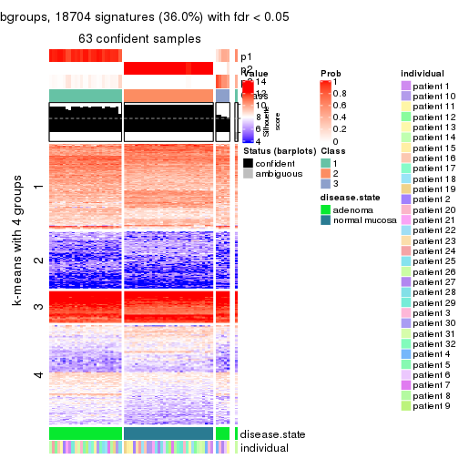</p>

</div>
<div id='tab-CV-hclust-get-signatures-no-scale-3'>
<pre><code class="r">get_signatures(res, k = 4, scale_rows = FALSE)
</code></pre>

<p></p>

</div>
<div id='tab-CV-hclust-get-signatures-no-scale-4'>
<pre><code class="r">get_signatures(res, k = 5, scale_rows = FALSE)
</code></pre>

<p></p>

</div>
<div id='tab-CV-hclust-get-signatures-no-scale-5'>
<pre><code class="r">get_signatures(res, k = 6, scale_rows = FALSE)
</code></pre>

<p></p>

</div>
</div>


Compare the overlap of signatures from different k:

```r
compare_signatures(res)
```


`get_signature()` returns a data frame invisibly. TO get the list of signatures, the function
call should be assigned to a variable explicitly. In following code, if `plot` argument is set
to `FALSE`, no heatmap is plotted while only the differential analysis is performed.

```r
# code only for demonstration
tb = get_signature(res, k = ..., plot = FALSE)
```

An example of the output of `tb` is:

```
#>   which_row         fdr    mean_1    mean_2 scaled_mean_1 scaled_mean_2 km
#> 1        38 0.042760348  8.373488  9.131774    -0.5533452     0.5164555  1
#> 2        40 0.018707592  7.106213  8.469186    -0.6173731     0.5762149  1
#> 3        55 0.019134737 10.221463 11.207825    -0.6159697     0.5749050  1
#> 4        59 0.006059896  5.921854  7.869574    -0.6899429     0.6439467  1
#> 5        60 0.018055526  8.928898 10.211722    -0.6204761     0.5791110  1
#> 6        98 0.009384629 15.714769 14.887706     0.6635654    -0.6193277  2
...
```

The columns in `tb` are:

1. `which_row`: row indices corresponding to the input matrix.
2. `fdr`: FDR for the differential test. 
3. `mean_x`: The mean value in group x.
4. `scaled_mean_x`: The mean value in group x after rows are scaled.
5. `km`: Row groups if k-means clustering is applied to rows.


UMAP plot which shows how samples are separated.


<script>
$( function() {
	$( '#tabs-CV-hclust-dimension-reduction' ).tabs();
} );
</script>
<div id='tabs-CV-hclust-dimension-reduction'>
<ul>
<li><a href='#tab-CV-hclust-dimension-reduction-1'>k = 2</a></li>
<li><a href='#tab-CV-hclust-dimension-reduction-2'>k = 3</a></li>
<li><a href='#tab-CV-hclust-dimension-reduction-3'>k = 4</a></li>
<li><a href='#tab-CV-hclust-dimension-reduction-4'>k = 5</a></li>
<li><a href='#tab-CV-hclust-dimension-reduction-5'>k = 6</a></li>
</ul>
<div id='tab-CV-hclust-dimension-reduction-1'>
<pre><code class="r">dimension_reduction(res, k = 2, method = &quot;UMAP&quot;)
</code></pre>

<p></p>

</div>
<div id='tab-CV-hclust-dimension-reduction-2'>
<pre><code class="r">dimension_reduction(res, k = 3, method = &quot;UMAP&quot;)
</code></pre>

<p></p>

</div>
<div id='tab-CV-hclust-dimension-reduction-3'>
<pre><code class="r">dimension_reduction(res, k = 4, method = &quot;UMAP&quot;)
</code></pre>

<p></p>

</div>
<div id='tab-CV-hclust-dimension-reduction-4'>
<pre><code class="r">dimension_reduction(res, k = 5, method = &quot;UMAP&quot;)
</code></pre>

<p></p>

</div>
<div id='tab-CV-hclust-dimension-reduction-5'>
<pre><code class="r">dimension_reduction(res, k = 6, method = &quot;UMAP&quot;)
</code></pre>

<p></p>

</div>
</div>


Following heatmap shows how subgroups are split when increasing `k`:

```r
collect_classes(res)
```


Test correlation between subgroups and known annotations. If the known
annotation is numeric, one-way ANOVA test is applied, and if the known
annotation is discrete, chi-squared contingency table test is applied.

```r
test_to_known_factors(res)
```

```
#>            n disease.state(p) individual(p) k
#> CV:hclust 64         9.19e-15         1.000 2
#> CV:hclust 63         2.09e-14         0.999 3
#> CV:hclust 58         1.98e-13         1.000 4
#> CV:hclust 57         3.32e-13         1.000 5
#> CV:hclust 58         2.54e-13         0.998 6
```


If matrix rows can be associated to genes, consider to use `functional_enrichment(res,
...)` to perform function enrichment for the signature genes. See [this vignette](http://bioconductor.org/packages/devel/bioc/vignettes/cola/inst/doc/functional_enrichment.html) for more detailed explanations.


 

---------------------------------------------------


### CV:kmeans**


The object with results only for a single top-value method and a single partition method 
can be extracted as:

```r
res = res_list["CV", "kmeans"]
# you can also extract it by
# res = res_list["CV:kmeans"]
```

A summary of `res` and all the functions that can be applied to it:

```r
res
```

```
#> A 'ConsensusPartition' object with k = 2, 3, 4, 5, 6.
#>   On a matrix with 51941 rows and 64 columns.
#>   Top rows (1000, 2000, 3000, 4000, 5000) are extracted by 'CV' method.
#>   Subgroups are detected by 'kmeans' method.
#>   Performed in total 1250 partitions by row resampling.
#>   Best k for subgroups seems to be 2.
#> 
#> Following methods can be applied to this 'ConsensusPartition' object:
#>  [1] "cola_report"             "collect_classes"         "collect_plots"          
#>  [4] "collect_stats"           "colnames"                "compare_signatures"     
#>  [7] "consensus_heatmap"       "dimension_reduction"     "functional_enrichment"  
#> [10] "get_anno_col"            "get_anno"                "get_classes"            
#> [13] "get_consensus"           "get_matrix"              "get_membership"         
#> [16] "get_param"               "get_signatures"          "get_stats"              
#> [19] "is_best_k"               "is_stable_k"             "membership_heatmap"     
#> [22] "ncol"                    "nrow"                    "plot_ecdf"              
#> [25] "rownames"                "select_partition_number" "show"                   
#> [28] "suggest_best_k"          "test_to_known_factors"
```

`collect_plots()` function collects all the plots made from `res` for all `k` (number of partitions)
into one single page to provide an easy and fast comparison between different `k`.

```r
collect_plots(res)
```


The plots are:

- The first row: a plot of the ECDF (empirical cumulative distribution
  function) curves of the consensus matrix for each `k` and the heatmap of
  predicted classes for each `k`.
- The second row: heatmaps of the consensus matrix for each `k`.
- The third row: heatmaps of the membership matrix for each `k`.
- The fouth row: heatmaps of the signatures for each `k`.

All the plots in panels can be made by individual functions and they are
plotted later in this section.

`select_partition_number()` produces several plots showing different
statistics for choosing "optimized" `k`. There are following statistics:

- ECDF curves of the consensus matrix for each `k`;
- 1-PAC. [The PAC
  score](https://en.wikipedia.org/wiki/Consensus_clustering#Over-interpretation_potential_of_consensus_clustering)
  measures the proportion of the ambiguous subgrouping.
- Mean silhouette score.
- Concordance. The mean probability of fiting the consensus class ids in all
  partitions.
- Area increased. Denote $A_k$ as the area under the ECDF curve for current
  `k`, the area increased is defined as $A_k - A_{k-1}$.
- Rand index. The percent of pairs of samples that are both in a same cluster
  or both are not in a same cluster in the partition of k and k-1.
- Jaccard index. The ratio of pairs of samples are both in a same cluster in
  the partition of k and k-1 and the pairs of samples are both in a same
  cluster in the partition k or k-1.

The detailed explanations of these statistics can be found in [the _cola_
vignette](http://bioconductor.org/packages/devel/bioc/vignettes/cola/inst/doc/cola.html#toc_13).

Generally speaking, lower PAC score, higher mean silhouette score or higher
concordance corresponds to better partition. Rand index and Jaccard index
measure how similar the current partition is compared to partition with `k-1`.
If they are too similar, we won't accept `k` is better than `k-1`.

```r
select_partition_number(res)
```


The numeric values for all these statistics can be obtained by `get_stats()`.

```r
get_stats(res)
```

```
#>   k 1-PAC mean_silhouette concordance area_increased  Rand Jaccard
#> 2 2 1.000           1.000       1.000         0.5084 0.492   0.492
#> 3 3 0.780           0.890       0.894         0.1978 0.905   0.806
#> 4 4 0.645           0.625       0.750         0.1051 0.873   0.680
#> 5 5 0.664           0.679       0.811         0.0741 0.901   0.704
#> 6 6 0.635           0.625       0.757         0.0398 1.000   1.000
```

`suggest_best_k()` suggests the best $k$ based on these statistics. The rules are as follows:

- All $k$ with Jaccard index larger than 0.95 are removed because increasing
  $k$ does not provide enough extra information. If all $k$ are removed, it is
  marked as no subgroup is detected.
- For all $k$ with 1-PAC score larger than 0.9, the maximal $k$ is taken as
  the best $k$, and other $k$ are marked as optional $k$.
- If it does not fit the second rule. The $k$ with the maximal vote of the
  highest 1-PAC score, highest mean silhouette, and highest concordance is
  taken as the best $k$.

```r
suggest_best_k(res)
```

```
#> [1] 2
```


Following shows the table of the partitions (You need to click the **show/hide
code output** link to see it). The membership matrix (columns with name `p*`)
is inferred by
[`clue::cl_consensus()`](https://www.rdocumentation.org/link/cl_consensus?package=clue)
function with the `SE` method. Basically the value in the membership matrix
represents the probability to belong to a certain group. The finall class
label for an item is determined with the group with highest probability it
belongs to.

In `get_classes()` function, the entropy is calculated from the membership
matrix and the silhouette score is calculated from the consensus matrix.


<script>
$( function() {
	$( '#tabs-CV-kmeans-get-classes' ).tabs();
} );
</script>
<div id='tabs-CV-kmeans-get-classes'>
<ul>
<li><a href='#tab-CV-kmeans-get-classes-1'>k = 2</a></li>
<li><a href='#tab-CV-kmeans-get-classes-2'>k = 3</a></li>
<li><a href='#tab-CV-kmeans-get-classes-3'>k = 4</a></li>
<li><a href='#tab-CV-kmeans-get-classes-4'>k = 5</a></li>
<li><a href='#tab-CV-kmeans-get-classes-5'>k = 6</a></li>
</ul>

<div id='tab-CV-kmeans-get-classes-1'>
<p><a id='tab-CV-kmeans-get-classes-1-a' style='color:#0366d6' href='#'>show/hide code output</a></p>
<pre><code class="r">cbind(get_classes(res, k = 2), get_membership(res, k = 2))
</code></pre>

<pre><code>#&gt;           class entropy silhouette p1 p2
#&gt; GSM215051     2       0          1  0  1
#&gt; GSM215052     2       0          1  0  1
#&gt; GSM215053     2       0          1  0  1
#&gt; GSM215054     2       0          1  0  1
#&gt; GSM215055     2       0          1  0  1
#&gt; GSM215056     2       0          1  0  1
#&gt; GSM215057     2       0          1  0  1
#&gt; GSM215058     2       0          1  0  1
#&gt; GSM215059     2       0          1  0  1
#&gt; GSM215060     2       0          1  0  1
#&gt; GSM215061     2       0          1  0  1
#&gt; GSM215062     2       0          1  0  1
#&gt; GSM215063     2       0          1  0  1
#&gt; GSM215064     2       0          1  0  1
#&gt; GSM215065     2       0          1  0  1
#&gt; GSM215066     2       0          1  0  1
#&gt; GSM215067     2       0          1  0  1
#&gt; GSM215068     2       0          1  0  1
#&gt; GSM215069     2       0          1  0  1
#&gt; GSM215070     2       0          1  0  1
#&gt; GSM215071     2       0          1  0  1
#&gt; GSM215072     2       0          1  0  1
#&gt; GSM215073     2       0          1  0  1
#&gt; GSM215074     2       0          1  0  1
#&gt; GSM215075     2       0          1  0  1
#&gt; GSM215076     2       0          1  0  1
#&gt; GSM215077     2       0          1  0  1
#&gt; GSM215078     2       0          1  0  1
#&gt; GSM215079     2       0          1  0  1
#&gt; GSM215080     2       0          1  0  1
#&gt; GSM215081     2       0          1  0  1
#&gt; GSM215082     2       0          1  0  1
#&gt; GSM215083     1       0          1  1  0
#&gt; GSM215084     1       0          1  1  0
#&gt; GSM215085     1       0          1  1  0
#&gt; GSM215086     1       0          1  1  0
#&gt; GSM215087     1       0          1  1  0
#&gt; GSM215088     1       0          1  1  0
#&gt; GSM215089     1       0          1  1  0
#&gt; GSM215090     1       0          1  1  0
#&gt; GSM215091     1       0          1  1  0
#&gt; GSM215092     1       0          1  1  0
#&gt; GSM215093     1       0          1  1  0
#&gt; GSM215094     1       0          1  1  0
#&gt; GSM215095     1       0          1  1  0
#&gt; GSM215096     1       0          1  1  0
#&gt; GSM215097     1       0          1  1  0
#&gt; GSM215098     1       0          1  1  0
#&gt; GSM215099     1       0          1  1  0
#&gt; GSM215100     1       0          1  1  0
#&gt; GSM215101     1       0          1  1  0
#&gt; GSM215102     1       0          1  1  0
#&gt; GSM215103     1       0          1  1  0
#&gt; GSM215104     1       0          1  1  0
#&gt; GSM215105     1       0          1  1  0
#&gt; GSM215106     1       0          1  1  0
#&gt; GSM215107     1       0          1  1  0
#&gt; GSM215108     1       0          1  1  0
#&gt; GSM215109     1       0          1  1  0
#&gt; GSM215110     1       0          1  1  0
#&gt; GSM215111     1       0          1  1  0
#&gt; GSM215112     1       0          1  1  0
#&gt; GSM215113     1       0          1  1  0
#&gt; GSM215114     1       0          1  1  0
</code></pre>

<script>
$('#tab-CV-kmeans-get-classes-1-a').parent().next().next().hide();
$('#tab-CV-kmeans-get-classes-1-a').click(function(){
  $('#tab-CV-kmeans-get-classes-1-a').parent().next().next().toggle();
  return(false);
});
</script>
</div>

<div id='tab-CV-kmeans-get-classes-2'>
<p><a id='tab-CV-kmeans-get-classes-2-a' style='color:#0366d6' href='#'>show/hide code output</a></p>
<pre><code class="r">cbind(get_classes(res, k = 3), get_membership(res, k = 3))
</code></pre>

<pre><code>#&gt;           class entropy silhouette    p1    p2    p3
#&gt; GSM215051     2  0.5327      0.826 0.000 0.728 0.272
#&gt; GSM215052     2  0.2066      0.921 0.000 0.940 0.060
#&gt; GSM215053     2  0.5098      0.832 0.000 0.752 0.248
#&gt; GSM215054     2  0.5327      0.826 0.000 0.728 0.272
#&gt; GSM215055     2  0.4654      0.860 0.000 0.792 0.208
#&gt; GSM215056     2  0.5254      0.830 0.000 0.736 0.264
#&gt; GSM215057     2  0.2625      0.918 0.000 0.916 0.084
#&gt; GSM215058     2  0.3038      0.918 0.000 0.896 0.104
#&gt; GSM215059     2  0.1163      0.928 0.000 0.972 0.028
#&gt; GSM215060     2  0.2356      0.922 0.000 0.928 0.072
#&gt; GSM215061     2  0.0892      0.928 0.000 0.980 0.020
#&gt; GSM215062     2  0.1860      0.921 0.000 0.948 0.052
#&gt; GSM215063     2  0.5363      0.826 0.000 0.724 0.276
#&gt; GSM215064     2  0.1860      0.921 0.000 0.948 0.052
#&gt; GSM215065     2  0.0892      0.927 0.000 0.980 0.020
#&gt; GSM215066     2  0.0000      0.927 0.000 1.000 0.000
#&gt; GSM215067     2  0.5327      0.829 0.000 0.728 0.272
#&gt; GSM215068     2  0.0000      0.927 0.000 1.000 0.000
#&gt; GSM215069     2  0.0237      0.927 0.000 0.996 0.004
#&gt; GSM215070     2  0.1860      0.922 0.000 0.948 0.052
#&gt; GSM215071     2  0.1411      0.925 0.000 0.964 0.036
#&gt; GSM215072     2  0.1964      0.921 0.000 0.944 0.056
#&gt; GSM215073     2  0.1643      0.926 0.000 0.956 0.044
#&gt; GSM215074     2  0.2261      0.925 0.000 0.932 0.068
#&gt; GSM215075     2  0.3116      0.911 0.000 0.892 0.108
#&gt; GSM215076     2  0.3941      0.899 0.000 0.844 0.156
#&gt; GSM215077     2  0.1643      0.922 0.000 0.956 0.044
#&gt; GSM215078     2  0.1289      0.928 0.000 0.968 0.032
#&gt; GSM215079     2  0.0237      0.928 0.000 0.996 0.004
#&gt; GSM215080     2  0.0000      0.927 0.000 1.000 0.000
#&gt; GSM215081     2  0.1163      0.923 0.000 0.972 0.028
#&gt; GSM215082     2  0.1643      0.922 0.000 0.956 0.044
#&gt; GSM215083     1  0.5529      0.223 0.704 0.000 0.296
#&gt; GSM215084     1  0.1643      0.912 0.956 0.000 0.044
#&gt; GSM215085     3  0.5905      0.910 0.352 0.000 0.648
#&gt; GSM215086     3  0.5859      0.912 0.344 0.000 0.656
#&gt; GSM215087     1  0.0424      0.940 0.992 0.000 0.008
#&gt; GSM215088     3  0.5760      0.915 0.328 0.000 0.672
#&gt; GSM215089     1  0.0237      0.940 0.996 0.000 0.004
#&gt; GSM215090     1  0.0592      0.936 0.988 0.000 0.012
#&gt; GSM215091     1  0.0424      0.939 0.992 0.000 0.008
#&gt; GSM215092     1  0.1964      0.896 0.944 0.000 0.056
#&gt; GSM215093     3  0.5529      0.890 0.296 0.000 0.704
#&gt; GSM215094     1  0.0237      0.941 0.996 0.000 0.004
#&gt; GSM215095     1  0.0000      0.940 1.000 0.000 0.000
#&gt; GSM215096     1  0.0592      0.939 0.988 0.000 0.012
#&gt; GSM215097     1  0.0592      0.938 0.988 0.000 0.012
#&gt; GSM215098     1  0.0424      0.940 0.992 0.000 0.008
#&gt; GSM215099     1  0.0237      0.940 0.996 0.000 0.004
#&gt; GSM215100     1  0.0747      0.937 0.984 0.000 0.016
#&gt; GSM215101     1  0.0424      0.940 0.992 0.000 0.008
#&gt; GSM215102     3  0.6309      0.633 0.496 0.000 0.504
#&gt; GSM215103     1  0.5363      0.370 0.724 0.000 0.276
#&gt; GSM215104     1  0.2066      0.899 0.940 0.000 0.060
#&gt; GSM215105     1  0.0592      0.939 0.988 0.000 0.012
#&gt; GSM215106     1  0.0747      0.937 0.984 0.000 0.016
#&gt; GSM215107     1  0.0592      0.940 0.988 0.000 0.012
#&gt; GSM215108     3  0.5882      0.903 0.348 0.000 0.652
#&gt; GSM215109     3  0.5650      0.908 0.312 0.000 0.688
#&gt; GSM215110     3  0.6062      0.876 0.384 0.000 0.616
#&gt; GSM215111     1  0.0424      0.939 0.992 0.000 0.008
#&gt; GSM215112     1  0.0424      0.940 0.992 0.000 0.008
#&gt; GSM215113     1  0.0000      0.940 1.000 0.000 0.000
#&gt; GSM215114     1  0.1643      0.914 0.956 0.000 0.044
</code></pre>

<script>
$('#tab-CV-kmeans-get-classes-2-a').parent().next().next().hide();
$('#tab-CV-kmeans-get-classes-2-a').click(function(){
  $('#tab-CV-kmeans-get-classes-2-a').parent().next().next().toggle();
  return(false);
});
</script>
</div>

<div id='tab-CV-kmeans-get-classes-3'>
<p><a id='tab-CV-kmeans-get-classes-3-a' style='color:#0366d6' href='#'>show/hide code output</a></p>
<pre><code class="r">cbind(get_classes(res, k = 4), get_membership(res, k = 4))
</code></pre>

<pre><code>#&gt;           class entropy silhouette    p1    p2    p3    p4
#&gt; GSM215051     2  0.1743      0.505 0.000 0.940 0.056 0.004
#&gt; GSM215052     4  0.6163      0.746 0.000 0.416 0.052 0.532
#&gt; GSM215053     2  0.1297      0.504 0.000 0.964 0.016 0.020
#&gt; GSM215054     2  0.1824      0.505 0.000 0.936 0.060 0.004
#&gt; GSM215055     2  0.2198      0.482 0.000 0.920 0.008 0.072
#&gt; GSM215056     2  0.1284      0.506 0.000 0.964 0.024 0.012
#&gt; GSM215057     2  0.5040     -0.218 0.000 0.628 0.008 0.364
#&gt; GSM215058     2  0.6097     -0.254 0.000 0.580 0.056 0.364
#&gt; GSM215059     4  0.5000      0.681 0.000 0.496 0.000 0.504
#&gt; GSM215060     2  0.4790     -0.275 0.000 0.620 0.000 0.380
#&gt; GSM215061     2  0.5000     -0.711 0.000 0.504 0.000 0.496
#&gt; GSM215062     4  0.6087      0.760 0.000 0.412 0.048 0.540
#&gt; GSM215063     2  0.2021      0.495 0.000 0.936 0.040 0.024
#&gt; GSM215064     4  0.6016      0.783 0.000 0.412 0.044 0.544
#&gt; GSM215065     4  0.4998      0.714 0.000 0.488 0.000 0.512
#&gt; GSM215066     4  0.4967      0.801 0.000 0.452 0.000 0.548
#&gt; GSM215067     2  0.2408      0.500 0.000 0.920 0.044 0.036
#&gt; GSM215068     4  0.4972      0.796 0.000 0.456 0.000 0.544
#&gt; GSM215069     4  0.4972      0.796 0.000 0.456 0.000 0.544
#&gt; GSM215070     4  0.5847      0.786 0.000 0.404 0.036 0.560
#&gt; GSM215071     4  0.5203      0.820 0.000 0.416 0.008 0.576
#&gt; GSM215072     4  0.6163      0.751 0.000 0.416 0.052 0.532
#&gt; GSM215073     2  0.4967     -0.574 0.000 0.548 0.000 0.452
#&gt; GSM215074     2  0.5229     -0.462 0.000 0.564 0.008 0.428
#&gt; GSM215075     2  0.5417      0.139 0.000 0.676 0.040 0.284
#&gt; GSM215076     2  0.6483     -0.023 0.000 0.584 0.092 0.324
#&gt; GSM215077     4  0.5172      0.821 0.000 0.404 0.008 0.588
#&gt; GSM215078     2  0.4996     -0.674 0.000 0.516 0.000 0.484
#&gt; GSM215079     4  0.4972      0.798 0.000 0.456 0.000 0.544
#&gt; GSM215080     4  0.4961      0.805 0.000 0.448 0.000 0.552
#&gt; GSM215081     4  0.5517      0.817 0.000 0.412 0.020 0.568
#&gt; GSM215082     4  0.5756      0.795 0.000 0.400 0.032 0.568
#&gt; GSM215083     1  0.5110      0.373 0.656 0.000 0.328 0.016
#&gt; GSM215084     1  0.2892      0.866 0.896 0.000 0.036 0.068
#&gt; GSM215085     3  0.6112      0.848 0.196 0.000 0.676 0.128
#&gt; GSM215086     3  0.5355      0.860 0.180 0.000 0.736 0.084
#&gt; GSM215087     1  0.0469      0.912 0.988 0.000 0.000 0.012
#&gt; GSM215088     3  0.3498      0.879 0.160 0.000 0.832 0.008
#&gt; GSM215089     1  0.1388      0.910 0.960 0.000 0.012 0.028
#&gt; GSM215090     1  0.3808      0.760 0.812 0.000 0.012 0.176
#&gt; GSM215091     1  0.0657      0.913 0.984 0.000 0.004 0.012
#&gt; GSM215092     1  0.3996      0.817 0.836 0.000 0.060 0.104
#&gt; GSM215093     3  0.3856      0.871 0.136 0.000 0.832 0.032
#&gt; GSM215094     1  0.0779      0.911 0.980 0.000 0.004 0.016
#&gt; GSM215095     1  0.0592      0.911 0.984 0.000 0.000 0.016
#&gt; GSM215096     1  0.0592      0.912 0.984 0.000 0.000 0.016
#&gt; GSM215097     1  0.0927      0.911 0.976 0.000 0.016 0.008
#&gt; GSM215098     1  0.0657      0.912 0.984 0.000 0.004 0.012
#&gt; GSM215099     1  0.0927      0.911 0.976 0.000 0.016 0.008
#&gt; GSM215100     1  0.2224      0.898 0.928 0.000 0.032 0.040
#&gt; GSM215101     1  0.1151      0.910 0.968 0.000 0.008 0.024
#&gt; GSM215102     3  0.7450      0.710 0.264 0.000 0.508 0.228
#&gt; GSM215103     1  0.6201      0.353 0.620 0.000 0.300 0.080
#&gt; GSM215104     1  0.3966      0.821 0.840 0.000 0.072 0.088
#&gt; GSM215105     1  0.1297      0.911 0.964 0.000 0.020 0.016
#&gt; GSM215106     1  0.1510      0.907 0.956 0.000 0.028 0.016
#&gt; GSM215107     1  0.1510      0.913 0.956 0.000 0.016 0.028
#&gt; GSM215108     3  0.5842      0.863 0.168 0.000 0.704 0.128
#&gt; GSM215109     3  0.4415      0.876 0.140 0.000 0.804 0.056
#&gt; GSM215110     3  0.6977      0.801 0.212 0.000 0.584 0.204
#&gt; GSM215111     1  0.1174      0.911 0.968 0.000 0.020 0.012
#&gt; GSM215112     1  0.0895      0.911 0.976 0.000 0.004 0.020
#&gt; GSM215113     1  0.0804      0.914 0.980 0.000 0.008 0.012
#&gt; GSM215114     1  0.2385      0.881 0.920 0.000 0.028 0.052
</code></pre>

<script>
$('#tab-CV-kmeans-get-classes-3-a').parent().next().next().hide();
$('#tab-CV-kmeans-get-classes-3-a').click(function(){
  $('#tab-CV-kmeans-get-classes-3-a').parent().next().next().toggle();
  return(false);
});
</script>
</div>

<div id='tab-CV-kmeans-get-classes-4'>
<p><a id='tab-CV-kmeans-get-classes-4-a' style='color:#0366d6' href='#'>show/hide code output</a></p>
<pre><code class="r">cbind(get_classes(res, k = 5), get_membership(res, k = 5))
</code></pre>

<pre><code>#&gt;           class entropy silhouette    p1    p2    p3    p4    p5
#&gt; GSM215051     5  0.5709      0.744 0.000 0.240 0.008 0.116 0.636
#&gt; GSM215052     2  0.4445      0.309 0.000 0.676 0.000 0.300 0.024
#&gt; GSM215053     5  0.5297      0.766 0.000 0.272 0.012 0.060 0.656
#&gt; GSM215054     5  0.5527      0.761 0.000 0.232 0.008 0.104 0.656
#&gt; GSM215055     5  0.4837      0.642 0.000 0.344 0.012 0.016 0.628
#&gt; GSM215056     5  0.4649      0.785 0.000 0.244 0.004 0.044 0.708
#&gt; GSM215057     2  0.4451      0.251 0.000 0.712 0.000 0.040 0.248
#&gt; GSM215058     2  0.6409     -0.440 0.000 0.536 0.004 0.244 0.216
#&gt; GSM215059     2  0.1768      0.681 0.000 0.924 0.004 0.000 0.072
#&gt; GSM215060     2  0.3247      0.562 0.000 0.840 0.008 0.016 0.136
#&gt; GSM215061     2  0.0963      0.694 0.000 0.964 0.000 0.000 0.036
#&gt; GSM215062     2  0.4040      0.421 0.000 0.724 0.000 0.260 0.016
#&gt; GSM215063     5  0.5771      0.747 0.000 0.208 0.028 0.100 0.664
#&gt; GSM215064     2  0.3759      0.492 0.000 0.764 0.000 0.220 0.016
#&gt; GSM215065     2  0.0703      0.698 0.000 0.976 0.000 0.000 0.024
#&gt; GSM215066     2  0.0324      0.703 0.000 0.992 0.000 0.004 0.004
#&gt; GSM215067     5  0.6074      0.742 0.000 0.228 0.032 0.108 0.632
#&gt; GSM215068     2  0.0324      0.703 0.000 0.992 0.000 0.004 0.004
#&gt; GSM215069     2  0.0324      0.703 0.000 0.992 0.000 0.004 0.004
#&gt; GSM215070     2  0.4194      0.420 0.000 0.720 0.004 0.260 0.016
#&gt; GSM215071     2  0.2522      0.649 0.000 0.880 0.000 0.108 0.012
#&gt; GSM215072     2  0.4269      0.339 0.000 0.684 0.000 0.300 0.016
#&gt; GSM215073     2  0.2464      0.640 0.000 0.892 0.012 0.004 0.092
#&gt; GSM215074     2  0.3044      0.598 0.000 0.840 0.004 0.008 0.148
#&gt; GSM215075     2  0.5770     -0.080 0.000 0.636 0.012 0.112 0.240
#&gt; GSM215076     4  0.6655      0.000 0.000 0.368 0.000 0.404 0.228
#&gt; GSM215077     2  0.2358      0.652 0.000 0.888 0.000 0.104 0.008
#&gt; GSM215078     2  0.1843      0.687 0.000 0.932 0.008 0.008 0.052
#&gt; GSM215079     2  0.0566      0.703 0.000 0.984 0.000 0.012 0.004
#&gt; GSM215080     2  0.0324      0.703 0.000 0.992 0.000 0.004 0.004
#&gt; GSM215081     2  0.2424      0.621 0.000 0.868 0.000 0.132 0.000
#&gt; GSM215082     2  0.3671      0.489 0.000 0.756 0.000 0.236 0.008
#&gt; GSM215083     1  0.4987      0.437 0.616 0.000 0.340 0.044 0.000
#&gt; GSM215084     1  0.3986      0.829 0.828 0.000 0.044 0.080 0.048
#&gt; GSM215085     3  0.6476      0.760 0.084 0.000 0.636 0.164 0.116
#&gt; GSM215086     3  0.5037      0.781 0.076 0.000 0.760 0.100 0.064
#&gt; GSM215087     1  0.1202      0.897 0.960 0.000 0.004 0.032 0.004
#&gt; GSM215088     3  0.2625      0.802 0.056 0.000 0.900 0.028 0.016
#&gt; GSM215089     1  0.1026      0.897 0.968 0.000 0.004 0.024 0.004
#&gt; GSM215090     1  0.4504      0.710 0.748 0.000 0.016 0.200 0.036
#&gt; GSM215091     1  0.1012      0.897 0.968 0.000 0.012 0.020 0.000
#&gt; GSM215092     1  0.4762      0.748 0.760 0.000 0.056 0.152 0.032
#&gt; GSM215093     3  0.3054      0.775 0.032 0.000 0.880 0.060 0.028
#&gt; GSM215094     1  0.1202      0.895 0.960 0.000 0.004 0.032 0.004
#&gt; GSM215095     1  0.0510      0.898 0.984 0.000 0.000 0.016 0.000
#&gt; GSM215096     1  0.0880      0.897 0.968 0.000 0.000 0.032 0.000
#&gt; GSM215097     1  0.1106      0.896 0.964 0.000 0.024 0.012 0.000
#&gt; GSM215098     1  0.1300      0.897 0.956 0.000 0.016 0.028 0.000
#&gt; GSM215099     1  0.0854      0.898 0.976 0.000 0.012 0.008 0.004
#&gt; GSM215100     1  0.2193      0.888 0.920 0.000 0.044 0.028 0.008
#&gt; GSM215101     1  0.2564      0.876 0.904 0.000 0.020 0.052 0.024
#&gt; GSM215102     3  0.7465      0.624 0.196 0.000 0.428 0.324 0.052
#&gt; GSM215103     1  0.6285      0.469 0.608 0.000 0.244 0.112 0.036
#&gt; GSM215104     1  0.4431      0.795 0.796 0.000 0.052 0.108 0.044
#&gt; GSM215105     1  0.1372      0.899 0.956 0.000 0.024 0.016 0.004
#&gt; GSM215106     1  0.1605      0.894 0.944 0.000 0.040 0.012 0.004
#&gt; GSM215107     1  0.2499      0.886 0.908 0.000 0.040 0.036 0.016
#&gt; GSM215108     3  0.6157      0.783 0.068 0.000 0.644 0.212 0.076
#&gt; GSM215109     3  0.4123      0.798 0.056 0.000 0.820 0.080 0.044
#&gt; GSM215110     3  0.6806      0.721 0.144 0.000 0.560 0.248 0.048
#&gt; GSM215111     1  0.1074      0.896 0.968 0.000 0.016 0.012 0.004
#&gt; GSM215112     1  0.1281      0.896 0.956 0.000 0.012 0.032 0.000
#&gt; GSM215113     1  0.0451      0.898 0.988 0.000 0.000 0.008 0.004
#&gt; GSM215114     1  0.3308      0.849 0.864 0.000 0.028 0.076 0.032
</code></pre>

<script>
$('#tab-CV-kmeans-get-classes-4-a').parent().next().next().hide();
$('#tab-CV-kmeans-get-classes-4-a').click(function(){
  $('#tab-CV-kmeans-get-classes-4-a').parent().next().next().toggle();
  return(false);
});
</script>
</div>

<div id='tab-CV-kmeans-get-classes-5'>
<p><a id='tab-CV-kmeans-get-classes-5-a' style='color:#0366d6' href='#'>show/hide code output</a></p>
<pre><code class="r">cbind(get_classes(res, k = 6), get_membership(res, k = 6))
</code></pre>

<pre><code>#&gt;           class entropy silhouette    p1    p2    p3    p4    p5    p6
#&gt; GSM215051     5  0.6119      0.581 0.000 0.144 0.000 0.024 0.444 0.388
#&gt; GSM215052     2  0.4821      0.134 0.000 0.556 0.008 0.400 0.032 0.004
#&gt; GSM215053     5  0.6674      0.598 0.000 0.220 0.004 0.032 0.416 0.328
#&gt; GSM215054     5  0.5934      0.597 0.000 0.148 0.000 0.012 0.444 0.396
#&gt; GSM215055     5  0.6659      0.527 0.000 0.292 0.004 0.048 0.472 0.184
#&gt; GSM215056     5  0.5465      0.665 0.000 0.160 0.008 0.044 0.676 0.112
#&gt; GSM215057     2  0.4840      0.293 0.000 0.640 0.008 0.040 0.300 0.012
#&gt; GSM215058     2  0.6691     -0.446 0.000 0.420 0.004 0.312 0.232 0.032
#&gt; GSM215059     2  0.2113      0.658 0.000 0.896 0.004 0.008 0.092 0.000
#&gt; GSM215060     2  0.3511      0.589 0.000 0.816 0.008 0.012 0.136 0.028
#&gt; GSM215061     2  0.1647      0.669 0.000 0.940 0.008 0.004 0.032 0.016
#&gt; GSM215062     2  0.4402      0.276 0.000 0.632 0.000 0.336 0.016 0.016
#&gt; GSM215063     5  0.2967      0.629 0.000 0.136 0.004 0.008 0.840 0.012
#&gt; GSM215064     2  0.4240      0.346 0.000 0.672 0.000 0.296 0.016 0.016
#&gt; GSM215065     2  0.0972      0.672 0.000 0.964 0.000 0.008 0.028 0.000
#&gt; GSM215066     2  0.0146      0.675 0.000 0.996 0.000 0.000 0.004 0.000
#&gt; GSM215067     5  0.2810      0.624 0.000 0.156 0.004 0.008 0.832 0.000
#&gt; GSM215068     2  0.0291      0.675 0.000 0.992 0.000 0.000 0.004 0.004
#&gt; GSM215069     2  0.0146      0.675 0.000 0.996 0.000 0.004 0.000 0.000
#&gt; GSM215070     2  0.4528      0.335 0.000 0.624 0.008 0.340 0.024 0.004
#&gt; GSM215071     2  0.3176      0.619 0.000 0.824 0.008 0.148 0.016 0.004
#&gt; GSM215072     2  0.4310      0.186 0.000 0.576 0.004 0.404 0.016 0.000
#&gt; GSM215073     2  0.2872      0.636 0.000 0.868 0.004 0.016 0.088 0.024
#&gt; GSM215074     2  0.3470      0.585 0.000 0.792 0.000 0.020 0.176 0.012
#&gt; GSM215075     2  0.5837     -0.144 0.000 0.544 0.000 0.024 0.128 0.304
#&gt; GSM215076     4  0.7387      0.000 0.000 0.268 0.004 0.384 0.108 0.236
#&gt; GSM215077     2  0.2978      0.622 0.000 0.840 0.008 0.136 0.008 0.008
#&gt; GSM215078     2  0.2452      0.664 0.000 0.900 0.008 0.020 0.056 0.016
#&gt; GSM215079     2  0.1059      0.673 0.000 0.964 0.000 0.016 0.016 0.004
#&gt; GSM215080     2  0.0146      0.676 0.000 0.996 0.004 0.000 0.000 0.000
#&gt; GSM215081     2  0.2913      0.547 0.000 0.812 0.000 0.180 0.004 0.004
#&gt; GSM215082     2  0.4302      0.348 0.000 0.632 0.008 0.344 0.012 0.004
#&gt; GSM215083     1  0.5117      0.552 0.644 0.000 0.276 0.016 0.016 0.048
#&gt; GSM215084     1  0.3671      0.806 0.820 0.000 0.032 0.068 0.000 0.080
#&gt; GSM215085     3  0.7018      0.658 0.048 0.000 0.532 0.240 0.092 0.088
#&gt; GSM215086     3  0.5203      0.705 0.052 0.000 0.728 0.112 0.028 0.080
#&gt; GSM215087     1  0.0964      0.868 0.968 0.000 0.000 0.012 0.004 0.016
#&gt; GSM215088     3  0.3107      0.733 0.036 0.000 0.872 0.020 0.036 0.036
#&gt; GSM215089     1  0.3027      0.850 0.832 0.000 0.016 0.004 0.004 0.144
#&gt; GSM215090     1  0.5700      0.478 0.540 0.000 0.008 0.112 0.008 0.332
#&gt; GSM215091     1  0.1296      0.871 0.948 0.000 0.004 0.004 0.000 0.044
#&gt; GSM215092     1  0.5644      0.698 0.668 0.000 0.052 0.112 0.012 0.156
#&gt; GSM215093     3  0.4456      0.690 0.044 0.000 0.764 0.016 0.144 0.032
#&gt; GSM215094     1  0.1262      0.868 0.956 0.000 0.000 0.016 0.008 0.020
#&gt; GSM215095     1  0.0665      0.868 0.980 0.000 0.000 0.008 0.004 0.008
#&gt; GSM215096     1  0.0603      0.871 0.980 0.000 0.000 0.000 0.004 0.016
#&gt; GSM215097     1  0.2290      0.868 0.892 0.000 0.020 0.004 0.000 0.084
#&gt; GSM215098     1  0.1067      0.871 0.964 0.000 0.004 0.004 0.004 0.024
#&gt; GSM215099     1  0.2449      0.867 0.884 0.000 0.016 0.004 0.004 0.092
#&gt; GSM215100     1  0.3156      0.859 0.840 0.000 0.024 0.012 0.004 0.120
#&gt; GSM215101     1  0.3216      0.855 0.848 0.000 0.008 0.036 0.012 0.096
#&gt; GSM215102     3  0.7249      0.599 0.116 0.000 0.408 0.236 0.000 0.240
#&gt; GSM215103     1  0.6018      0.494 0.592 0.000 0.260 0.060 0.012 0.076
#&gt; GSM215104     1  0.4490      0.781 0.768 0.000 0.036 0.084 0.008 0.104
#&gt; GSM215105     1  0.2253      0.870 0.896 0.000 0.012 0.004 0.004 0.084
#&gt; GSM215106     1  0.2126      0.870 0.904 0.000 0.020 0.004 0.000 0.072
#&gt; GSM215107     1  0.2753      0.859 0.872 0.000 0.008 0.048 0.000 0.072
#&gt; GSM215108     3  0.5830      0.711 0.052 0.000 0.632 0.200 0.008 0.108
#&gt; GSM215109     3  0.3141      0.736 0.028 0.000 0.856 0.064 0.000 0.052
#&gt; GSM215110     3  0.7049      0.623 0.072 0.000 0.440 0.188 0.008 0.292
#&gt; GSM215111     1  0.2056      0.868 0.904 0.000 0.012 0.004 0.000 0.080
#&gt; GSM215112     1  0.1059      0.867 0.964 0.000 0.000 0.016 0.004 0.016
#&gt; GSM215113     1  0.1531      0.873 0.928 0.000 0.000 0.000 0.004 0.068
#&gt; GSM215114     1  0.2587      0.846 0.892 0.000 0.016 0.036 0.004 0.052
</code></pre>

<script>
$('#tab-CV-kmeans-get-classes-5-a').parent().next().next().hide();
$('#tab-CV-kmeans-get-classes-5-a').click(function(){
  $('#tab-CV-kmeans-get-classes-5-a').parent().next().next().toggle();
  return(false);
});
</script>
</div>
</div>

Heatmaps for the consensus matrix. It visualizes the probability of two
samples to be in a same group.


<script>
$( function() {
	$( '#tabs-CV-kmeans-consensus-heatmap' ).tabs();
} );
</script>
<div id='tabs-CV-kmeans-consensus-heatmap'>
<ul>
<li><a href='#tab-CV-kmeans-consensus-heatmap-1'>k = 2</a></li>
<li><a href='#tab-CV-kmeans-consensus-heatmap-2'>k = 3</a></li>
<li><a href='#tab-CV-kmeans-consensus-heatmap-3'>k = 4</a></li>
<li><a href='#tab-CV-kmeans-consensus-heatmap-4'>k = 5</a></li>
<li><a href='#tab-CV-kmeans-consensus-heatmap-5'>k = 6</a></li>
</ul>
<div id='tab-CV-kmeans-consensus-heatmap-1'>
<pre><code class="r">consensus_heatmap(res, k = 2)
</code></pre>

<p></p>

</div>
<div id='tab-CV-kmeans-consensus-heatmap-2'>
<pre><code class="r">consensus_heatmap(res, k = 3)
</code></pre>

<p></p>

</div>
<div id='tab-CV-kmeans-consensus-heatmap-3'>
<pre><code class="r">consensus_heatmap(res, k = 4)
</code></pre>

<p></p>

</div>
<div id='tab-CV-kmeans-consensus-heatmap-4'>
<pre><code class="r">consensus_heatmap(res, k = 5)
</code></pre>

<p></p>

</div>
<div id='tab-CV-kmeans-consensus-heatmap-5'>
<pre><code class="r">consensus_heatmap(res, k = 6)
</code></pre>

<p></p>

</div>
</div>

Heatmaps for the membership of samples in all partitions to see how consistent they are:


<script>
$( function() {
	$( '#tabs-CV-kmeans-membership-heatmap' ).tabs();
} );
</script>
<div id='tabs-CV-kmeans-membership-heatmap'>
<ul>
<li><a href='#tab-CV-kmeans-membership-heatmap-1'>k = 2</a></li>
<li><a href='#tab-CV-kmeans-membership-heatmap-2'>k = 3</a></li>
<li><a href='#tab-CV-kmeans-membership-heatmap-3'>k = 4</a></li>
<li><a href='#tab-CV-kmeans-membership-heatmap-4'>k = 5</a></li>
<li><a href='#tab-CV-kmeans-membership-heatmap-5'>k = 6</a></li>
</ul>
<div id='tab-CV-kmeans-membership-heatmap-1'>
<pre><code class="r">membership_heatmap(res, k = 2)
</code></pre>

<p></p>

</div>
<div id='tab-CV-kmeans-membership-heatmap-2'>
<pre><code class="r">membership_heatmap(res, k = 3)
</code></pre>

<p></p>

</div>
<div id='tab-CV-kmeans-membership-heatmap-3'>
<pre><code class="r">membership_heatmap(res, k = 4)
</code></pre>

<p></p>

</div>
<div id='tab-CV-kmeans-membership-heatmap-4'>
<pre><code class="r">membership_heatmap(res, k = 5)
</code></pre>

<p></p>

</div>
<div id='tab-CV-kmeans-membership-heatmap-5'>
<pre><code class="r">membership_heatmap(res, k = 6)
</code></pre>

<p></p>

</div>
</div>

As soon as we have had the classes for columns, we can look for signatures
which are significantly different between classes which can be candidate marks
for certain classes. Following are the heatmaps for signatures.


Signature heatmaps where rows are scaled:


<script>
$( function() {
	$( '#tabs-CV-kmeans-get-signatures' ).tabs();
} );
</script>
<div id='tabs-CV-kmeans-get-signatures'>
<ul>
<li><a href='#tab-CV-kmeans-get-signatures-1'>k = 2</a></li>
<li><a href='#tab-CV-kmeans-get-signatures-2'>k = 3</a></li>
<li><a href='#tab-CV-kmeans-get-signatures-3'>k = 4</a></li>
<li><a href='#tab-CV-kmeans-get-signatures-4'>k = 5</a></li>
<li><a href='#tab-CV-kmeans-get-signatures-5'>k = 6</a></li>
</ul>
<div id='tab-CV-kmeans-get-signatures-1'>
<pre><code class="r">get_signatures(res, k = 2)
</code></pre>

<p></p>

</div>
<div id='tab-CV-kmeans-get-signatures-2'>
<pre><code class="r">get_signatures(res, k = 3)
</code></pre>

<p></p>

</div>
<div id='tab-CV-kmeans-get-signatures-3'>
<pre><code class="r">get_signatures(res, k = 4)
</code></pre>

<p></p>

</div>
<div id='tab-CV-kmeans-get-signatures-4'>
<pre><code class="r">get_signatures(res, k = 5)
</code></pre>

<p></p>

</div>
<div id='tab-CV-kmeans-get-signatures-5'>
<pre><code class="r">get_signatures(res, k = 6)
</code></pre>

<p>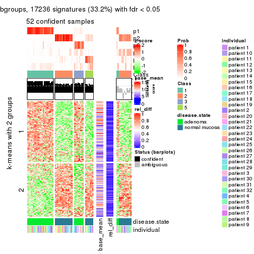</p>

</div>
</div>


Signature heatmaps where rows are not scaled:


<script>
$( function() {
	$( '#tabs-CV-kmeans-get-signatures-no-scale' ).tabs();
} );
</script>
<div id='tabs-CV-kmeans-get-signatures-no-scale'>
<ul>
<li><a href='#tab-CV-kmeans-get-signatures-no-scale-1'>k = 2</a></li>
<li><a href='#tab-CV-kmeans-get-signatures-no-scale-2'>k = 3</a></li>
<li><a href='#tab-CV-kmeans-get-signatures-no-scale-3'>k = 4</a></li>
<li><a href='#tab-CV-kmeans-get-signatures-no-scale-4'>k = 5</a></li>
<li><a href='#tab-CV-kmeans-get-signatures-no-scale-5'>k = 6</a></li>
</ul>
<div id='tab-CV-kmeans-get-signatures-no-scale-1'>
<pre><code class="r">get_signatures(res, k = 2, scale_rows = FALSE)
</code></pre>

<p></p>

</div>
<div id='tab-CV-kmeans-get-signatures-no-scale-2'>
<pre><code class="r">get_signatures(res, k = 3, scale_rows = FALSE)
</code></pre>

<p></p>

</div>
<div id='tab-CV-kmeans-get-signatures-no-scale-3'>
<pre><code class="r">get_signatures(res, k = 4, scale_rows = FALSE)
</code></pre>

<p></p>

</div>
<div id='tab-CV-kmeans-get-signatures-no-scale-4'>
<pre><code class="r">get_signatures(res, k = 5, scale_rows = FALSE)
</code></pre>

<p></p>

</div>
<div id='tab-CV-kmeans-get-signatures-no-scale-5'>
<pre><code class="r">get_signatures(res, k = 6, scale_rows = FALSE)
</code></pre>

<p></p>

</div>
</div>


Compare the overlap of signatures from different k:

```r
compare_signatures(res)
```


`get_signature()` returns a data frame invisibly. TO get the list of signatures, the function
call should be assigned to a variable explicitly. In following code, if `plot` argument is set
to `FALSE`, no heatmap is plotted while only the differential analysis is performed.

```r
# code only for demonstration
tb = get_signature(res, k = ..., plot = FALSE)
```

An example of the output of `tb` is:

```
#>   which_row         fdr    mean_1    mean_2 scaled_mean_1 scaled_mean_2 km
#> 1        38 0.042760348  8.373488  9.131774    -0.5533452     0.5164555  1
#> 2        40 0.018707592  7.106213  8.469186    -0.6173731     0.5762149  1
#> 3        55 0.019134737 10.221463 11.207825    -0.6159697     0.5749050  1
#> 4        59 0.006059896  5.921854  7.869574    -0.6899429     0.6439467  1
#> 5        60 0.018055526  8.928898 10.211722    -0.6204761     0.5791110  1
#> 6        98 0.009384629 15.714769 14.887706     0.6635654    -0.6193277  2
...
```

The columns in `tb` are:

1. `which_row`: row indices corresponding to the input matrix.
2. `fdr`: FDR for the differential test. 
3. `mean_x`: The mean value in group x.
4. `scaled_mean_x`: The mean value in group x after rows are scaled.
5. `km`: Row groups if k-means clustering is applied to rows.


UMAP plot which shows how samples are separated.


<script>
$( function() {
	$( '#tabs-CV-kmeans-dimension-reduction' ).tabs();
} );
</script>
<div id='tabs-CV-kmeans-dimension-reduction'>
<ul>
<li><a href='#tab-CV-kmeans-dimension-reduction-1'>k = 2</a></li>
<li><a href='#tab-CV-kmeans-dimension-reduction-2'>k = 3</a></li>
<li><a href='#tab-CV-kmeans-dimension-reduction-3'>k = 4</a></li>
<li><a href='#tab-CV-kmeans-dimension-reduction-4'>k = 5</a></li>
<li><a href='#tab-CV-kmeans-dimension-reduction-5'>k = 6</a></li>
</ul>
<div id='tab-CV-kmeans-dimension-reduction-1'>
<pre><code class="r">dimension_reduction(res, k = 2, method = &quot;UMAP&quot;)
</code></pre>

<p></p>

</div>
<div id='tab-CV-kmeans-dimension-reduction-2'>
<pre><code class="r">dimension_reduction(res, k = 3, method = &quot;UMAP&quot;)
</code></pre>

<p></p>

</div>
<div id='tab-CV-kmeans-dimension-reduction-3'>
<pre><code class="r">dimension_reduction(res, k = 4, method = &quot;UMAP&quot;)
</code></pre>

<p></p>

</div>
<div id='tab-CV-kmeans-dimension-reduction-4'>
<pre><code class="r">dimension_reduction(res, k = 5, method = &quot;UMAP&quot;)
</code></pre>

<p></p>

</div>
<div id='tab-CV-kmeans-dimension-reduction-5'>
<pre><code class="r">dimension_reduction(res, k = 6, method = &quot;UMAP&quot;)
</code></pre>

<p></p>

</div>
</div>


Following heatmap shows how subgroups are split when increasing `k`:

```r
collect_classes(res)
```


Test correlation between subgroups and known annotations. If the known
annotation is numeric, one-way ANOVA test is applied, and if the known
annotation is discrete, chi-squared contingency table test is applied.

```r
test_to_known_factors(res)
```

```
#>            n disease.state(p) individual(p) k
#> CV:kmeans 64         9.19e-15         1.000 2
#> CV:kmeans 62         3.44e-14         0.999 3
#> CV:kmeans 50         7.99e-11         0.878 4
#> CV:kmeans 52         3.00e-11         0.934 5
#> CV:kmeans 52         3.00e-11         0.955 6
```


If matrix rows can be associated to genes, consider to use `functional_enrichment(res,
...)` to perform function enrichment for the signature genes. See [this vignette](http://bioconductor.org/packages/devel/bioc/vignettes/cola/inst/doc/functional_enrichment.html) for more detailed explanations.


 

---------------------------------------------------


### CV:skmeans**


The object with results only for a single top-value method and a single partition method 
can be extracted as:

```r
res = res_list["CV", "skmeans"]
# you can also extract it by
# res = res_list["CV:skmeans"]
```

A summary of `res` and all the functions that can be applied to it:

```r
res
```

```
#> A 'ConsensusPartition' object with k = 2, 3, 4, 5, 6.
#>   On a matrix with 51941 rows and 64 columns.
#>   Top rows (1000, 2000, 3000, 4000, 5000) are extracted by 'CV' method.
#>   Subgroups are detected by 'skmeans' method.
#>   Performed in total 1250 partitions by row resampling.
#>   Best k for subgroups seems to be 2.
#> 
#> Following methods can be applied to this 'ConsensusPartition' object:
#>  [1] "cola_report"             "collect_classes"         "collect_plots"          
#>  [4] "collect_stats"           "colnames"                "compare_signatures"     
#>  [7] "consensus_heatmap"       "dimension_reduction"     "functional_enrichment"  
#> [10] "get_anno_col"            "get_anno"                "get_classes"            
#> [13] "get_consensus"           "get_matrix"              "get_membership"         
#> [16] "get_param"               "get_signatures"          "get_stats"              
#> [19] "is_best_k"               "is_stable_k"             "membership_heatmap"     
#> [22] "ncol"                    "nrow"                    "plot_ecdf"              
#> [25] "rownames"                "select_partition_number" "show"                   
#> [28] "suggest_best_k"          "test_to_known_factors"
```

`collect_plots()` function collects all the plots made from `res` for all `k` (number of partitions)
into one single page to provide an easy and fast comparison between different `k`.

```r
collect_plots(res)
```


The plots are:

- The first row: a plot of the ECDF (empirical cumulative distribution
  function) curves of the consensus matrix for each `k` and the heatmap of
  predicted classes for each `k`.
- The second row: heatmaps of the consensus matrix for each `k`.
- The third row: heatmaps of the membership matrix for each `k`.
- The fouth row: heatmaps of the signatures for each `k`.

All the plots in panels can be made by individual functions and they are
plotted later in this section.

`select_partition_number()` produces several plots showing different
statistics for choosing "optimized" `k`. There are following statistics:

- ECDF curves of the consensus matrix for each `k`;
- 1-PAC. [The PAC
  score](https://en.wikipedia.org/wiki/Consensus_clustering#Over-interpretation_potential_of_consensus_clustering)
  measures the proportion of the ambiguous subgrouping.
- Mean silhouette score.
- Concordance. The mean probability of fiting the consensus class ids in all
  partitions.
- Area increased. Denote $A_k$ as the area under the ECDF curve for current
  `k`, the area increased is defined as $A_k - A_{k-1}$.
- Rand index. The percent of pairs of samples that are both in a same cluster
  or both are not in a same cluster in the partition of k and k-1.
- Jaccard index. The ratio of pairs of samples are both in a same cluster in
  the partition of k and k-1 and the pairs of samples are both in a same
  cluster in the partition k or k-1.

The detailed explanations of these statistics can be found in [the _cola_
vignette](http://bioconductor.org/packages/devel/bioc/vignettes/cola/inst/doc/cola.html#toc_13).

Generally speaking, lower PAC score, higher mean silhouette score or higher
concordance corresponds to better partition. Rand index and Jaccard index
measure how similar the current partition is compared to partition with `k-1`.
If they are too similar, we won't accept `k` is better than `k-1`.

```r
select_partition_number(res)
```


The numeric values for all these statistics can be obtained by `get_stats()`.

```r
get_stats(res)
```

```
#>   k 1-PAC mean_silhouette concordance area_increased  Rand Jaccard
#> 2 2 1.000           1.000       1.000         0.5084 0.492   0.492
#> 3 3 0.563           0.775       0.809         0.2381 0.897   0.791
#> 4 4 0.506           0.453       0.697         0.1774 0.875   0.684
#> 5 5 0.507           0.417       0.624         0.0633 0.923   0.752
#> 6 6 0.513           0.241       0.548         0.0454 0.880   0.597
```

`suggest_best_k()` suggests the best $k$ based on these statistics. The rules are as follows:

- All $k$ with Jaccard index larger than 0.95 are removed because increasing
  $k$ does not provide enough extra information. If all $k$ are removed, it is
  marked as no subgroup is detected.
- For all $k$ with 1-PAC score larger than 0.9, the maximal $k$ is taken as
  the best $k$, and other $k$ are marked as optional $k$.
- If it does not fit the second rule. The $k$ with the maximal vote of the
  highest 1-PAC score, highest mean silhouette, and highest concordance is
  taken as the best $k$.

```r
suggest_best_k(res)
```

```
#> [1] 2
```


Following shows the table of the partitions (You need to click the **show/hide
code output** link to see it). The membership matrix (columns with name `p*`)
is inferred by
[`clue::cl_consensus()`](https://www.rdocumentation.org/link/cl_consensus?package=clue)
function with the `SE` method. Basically the value in the membership matrix
represents the probability to belong to a certain group. The finall class
label for an item is determined with the group with highest probability it
belongs to.

In `get_classes()` function, the entropy is calculated from the membership
matrix and the silhouette score is calculated from the consensus matrix.


<script>
$( function() {
	$( '#tabs-CV-skmeans-get-classes' ).tabs();
} );
</script>
<div id='tabs-CV-skmeans-get-classes'>
<ul>
<li><a href='#tab-CV-skmeans-get-classes-1'>k = 2</a></li>
<li><a href='#tab-CV-skmeans-get-classes-2'>k = 3</a></li>
<li><a href='#tab-CV-skmeans-get-classes-3'>k = 4</a></li>
<li><a href='#tab-CV-skmeans-get-classes-4'>k = 5</a></li>
<li><a href='#tab-CV-skmeans-get-classes-5'>k = 6</a></li>
</ul>

<div id='tab-CV-skmeans-get-classes-1'>
<p><a id='tab-CV-skmeans-get-classes-1-a' style='color:#0366d6' href='#'>show/hide code output</a></p>
<pre><code class="r">cbind(get_classes(res, k = 2), get_membership(res, k = 2))
</code></pre>

<pre><code>#&gt;           class entropy silhouette p1 p2
#&gt; GSM215051     2       0          1  0  1
#&gt; GSM215052     2       0          1  0  1
#&gt; GSM215053     2       0          1  0  1
#&gt; GSM215054     2       0          1  0  1
#&gt; GSM215055     2       0          1  0  1
#&gt; GSM215056     2       0          1  0  1
#&gt; GSM215057     2       0          1  0  1
#&gt; GSM215058     2       0          1  0  1
#&gt; GSM215059     2       0          1  0  1
#&gt; GSM215060     2       0          1  0  1
#&gt; GSM215061     2       0          1  0  1
#&gt; GSM215062     2       0          1  0  1
#&gt; GSM215063     2       0          1  0  1
#&gt; GSM215064     2       0          1  0  1
#&gt; GSM215065     2       0          1  0  1
#&gt; GSM215066     2       0          1  0  1
#&gt; GSM215067     2       0          1  0  1
#&gt; GSM215068     2       0          1  0  1
#&gt; GSM215069     2       0          1  0  1
#&gt; GSM215070     2       0          1  0  1
#&gt; GSM215071     2       0          1  0  1
#&gt; GSM215072     2       0          1  0  1
#&gt; GSM215073     2       0          1  0  1
#&gt; GSM215074     2       0          1  0  1
#&gt; GSM215075     2       0          1  0  1
#&gt; GSM215076     2       0          1  0  1
#&gt; GSM215077     2       0          1  0  1
#&gt; GSM215078     2       0          1  0  1
#&gt; GSM215079     2       0          1  0  1
#&gt; GSM215080     2       0          1  0  1
#&gt; GSM215081     2       0          1  0  1
#&gt; GSM215082     2       0          1  0  1
#&gt; GSM215083     1       0          1  1  0
#&gt; GSM215084     1       0          1  1  0
#&gt; GSM215085     1       0          1  1  0
#&gt; GSM215086     1       0          1  1  0
#&gt; GSM215087     1       0          1  1  0
#&gt; GSM215088     1       0          1  1  0
#&gt; GSM215089     1       0          1  1  0
#&gt; GSM215090     1       0          1  1  0
#&gt; GSM215091     1       0          1  1  0
#&gt; GSM215092     1       0          1  1  0
#&gt; GSM215093     1       0          1  1  0
#&gt; GSM215094     1       0          1  1  0
#&gt; GSM215095     1       0          1  1  0
#&gt; GSM215096     1       0          1  1  0
#&gt; GSM215097     1       0          1  1  0
#&gt; GSM215098     1       0          1  1  0
#&gt; GSM215099     1       0          1  1  0
#&gt; GSM215100     1       0          1  1  0
#&gt; GSM215101     1       0          1  1  0
#&gt; GSM215102     1       0          1  1  0
#&gt; GSM215103     1       0          1  1  0
#&gt; GSM215104     1       0          1  1  0
#&gt; GSM215105     1       0          1  1  0
#&gt; GSM215106     1       0          1  1  0
#&gt; GSM215107     1       0          1  1  0
#&gt; GSM215108     1       0          1  1  0
#&gt; GSM215109     1       0          1  1  0
#&gt; GSM215110     1       0          1  1  0
#&gt; GSM215111     1       0          1  1  0
#&gt; GSM215112     1       0          1  1  0
#&gt; GSM215113     1       0          1  1  0
#&gt; GSM215114     1       0          1  1  0
</code></pre>

<script>
$('#tab-CV-skmeans-get-classes-1-a').parent().next().next().hide();
$('#tab-CV-skmeans-get-classes-1-a').click(function(){
  $('#tab-CV-skmeans-get-classes-1-a').parent().next().next().toggle();
  return(false);
});
</script>
</div>

<div id='tab-CV-skmeans-get-classes-2'>
<p><a id='tab-CV-skmeans-get-classes-2-a' style='color:#0366d6' href='#'>show/hide code output</a></p>
<pre><code class="r">cbind(get_classes(res, k = 3), get_membership(res, k = 3))
</code></pre>

<pre><code>#&gt;           class entropy silhouette    p1    p2    p3
#&gt; GSM215051     2  0.5178      0.901 0.000 0.744 0.256
#&gt; GSM215052     2  0.4605      0.909 0.000 0.796 0.204
#&gt; GSM215053     2  0.4346      0.903 0.000 0.816 0.184
#&gt; GSM215054     2  0.4887      0.894 0.000 0.772 0.228
#&gt; GSM215055     2  0.4291      0.907 0.000 0.820 0.180
#&gt; GSM215056     2  0.4654      0.898 0.000 0.792 0.208
#&gt; GSM215057     2  0.4002      0.917 0.000 0.840 0.160
#&gt; GSM215058     2  0.5058      0.906 0.000 0.756 0.244
#&gt; GSM215059     2  0.2711      0.925 0.000 0.912 0.088
#&gt; GSM215060     2  0.3192      0.920 0.000 0.888 0.112
#&gt; GSM215061     2  0.2711      0.925 0.000 0.912 0.088
#&gt; GSM215062     2  0.3941      0.901 0.000 0.844 0.156
#&gt; GSM215063     2  0.4887      0.896 0.000 0.772 0.228
#&gt; GSM215064     2  0.4002      0.903 0.000 0.840 0.160
#&gt; GSM215065     2  0.1411      0.919 0.000 0.964 0.036
#&gt; GSM215066     2  0.2448      0.923 0.000 0.924 0.076
#&gt; GSM215067     2  0.4931      0.899 0.000 0.768 0.232
#&gt; GSM215068     2  0.1753      0.921 0.000 0.952 0.048
#&gt; GSM215069     2  0.1643      0.920 0.000 0.956 0.044
#&gt; GSM215070     2  0.4291      0.911 0.000 0.820 0.180
#&gt; GSM215071     2  0.3038      0.923 0.000 0.896 0.104
#&gt; GSM215072     2  0.4555      0.906 0.000 0.800 0.200
#&gt; GSM215073     2  0.1753      0.920 0.000 0.952 0.048
#&gt; GSM215074     2  0.3482      0.921 0.000 0.872 0.128
#&gt; GSM215075     2  0.3752      0.922 0.000 0.856 0.144
#&gt; GSM215076     2  0.5465      0.895 0.000 0.712 0.288
#&gt; GSM215077     2  0.2625      0.919 0.000 0.916 0.084
#&gt; GSM215078     2  0.3192      0.925 0.000 0.888 0.112
#&gt; GSM215079     2  0.2537      0.921 0.000 0.920 0.080
#&gt; GSM215080     2  0.1860      0.922 0.000 0.948 0.052
#&gt; GSM215081     2  0.3482      0.905 0.000 0.872 0.128
#&gt; GSM215082     2  0.4235      0.908 0.000 0.824 0.176
#&gt; GSM215083     1  0.6225     -0.458 0.568 0.000 0.432
#&gt; GSM215084     1  0.3116      0.721 0.892 0.000 0.108
#&gt; GSM215085     3  0.6295      0.757 0.472 0.000 0.528
#&gt; GSM215086     3  0.6192      0.822 0.420 0.000 0.580
#&gt; GSM215087     1  0.1753      0.730 0.952 0.000 0.048
#&gt; GSM215088     3  0.6095      0.836 0.392 0.000 0.608
#&gt; GSM215089     1  0.3816      0.695 0.852 0.000 0.148
#&gt; GSM215090     1  0.5098      0.517 0.752 0.000 0.248
#&gt; GSM215091     1  0.2066      0.734 0.940 0.000 0.060
#&gt; GSM215092     1  0.5706      0.162 0.680 0.000 0.320
#&gt; GSM215093     3  0.5835      0.802 0.340 0.000 0.660
#&gt; GSM215094     1  0.1753      0.736 0.952 0.000 0.048
#&gt; GSM215095     1  0.0237      0.714 0.996 0.000 0.004
#&gt; GSM215096     1  0.1289      0.730 0.968 0.000 0.032
#&gt; GSM215097     1  0.5138      0.514 0.748 0.000 0.252
#&gt; GSM215098     1  0.3686      0.701 0.860 0.000 0.140
#&gt; GSM215099     1  0.4002      0.683 0.840 0.000 0.160
#&gt; GSM215100     1  0.5678      0.279 0.684 0.000 0.316
#&gt; GSM215101     1  0.4931      0.526 0.768 0.000 0.232
#&gt; GSM215102     3  0.6302      0.726 0.480 0.000 0.520
#&gt; GSM215103     3  0.6307      0.692 0.488 0.000 0.512
#&gt; GSM215104     1  0.5254      0.415 0.736 0.000 0.264
#&gt; GSM215105     1  0.3038      0.725 0.896 0.000 0.104
#&gt; GSM215106     1  0.3941      0.690 0.844 0.000 0.156
#&gt; GSM215107     1  0.3879      0.695 0.848 0.000 0.152
#&gt; GSM215108     3  0.6295      0.760 0.472 0.000 0.528
#&gt; GSM215109     3  0.6008      0.830 0.372 0.000 0.628
#&gt; GSM215110     3  0.6126      0.837 0.400 0.000 0.600
#&gt; GSM215111     1  0.3816      0.706 0.852 0.000 0.148
#&gt; GSM215112     1  0.1031      0.722 0.976 0.000 0.024
#&gt; GSM215113     1  0.1753      0.735 0.952 0.000 0.048
#&gt; GSM215114     1  0.4346      0.655 0.816 0.000 0.184
</code></pre>

<script>
$('#tab-CV-skmeans-get-classes-2-a').parent().next().next().hide();
$('#tab-CV-skmeans-get-classes-2-a').click(function(){
  $('#tab-CV-skmeans-get-classes-2-a').parent().next().next().toggle();
  return(false);
});
</script>
</div>

<div id='tab-CV-skmeans-get-classes-3'>
<p><a id='tab-CV-skmeans-get-classes-3-a' style='color:#0366d6' href='#'>show/hide code output</a></p>
<pre><code class="r">cbind(get_classes(res, k = 4), get_membership(res, k = 4))
</code></pre>

<pre><code>#&gt;           class entropy silhouette    p1    p2    p3    p4
#&gt; GSM215051     4   0.500     0.4478 0.000 0.328 0.012 0.660
#&gt; GSM215052     4   0.548     0.1517 0.000 0.396 0.020 0.584
#&gt; GSM215053     4   0.526     0.2533 0.000 0.448 0.008 0.544
#&gt; GSM215054     4   0.472     0.4505 0.000 0.300 0.008 0.692
#&gt; GSM215055     2   0.541    -0.2319 0.000 0.496 0.012 0.492
#&gt; GSM215056     4   0.504     0.3227 0.000 0.404 0.004 0.592
#&gt; GSM215057     2   0.484     0.2078 0.000 0.648 0.004 0.348
#&gt; GSM215058     4   0.492     0.1859 0.000 0.428 0.000 0.572
#&gt; GSM215059     2   0.413     0.4685 0.000 0.740 0.000 0.260
#&gt; GSM215060     2   0.489     0.1957 0.000 0.636 0.004 0.360
#&gt; GSM215061     2   0.432     0.4566 0.000 0.760 0.012 0.228
#&gt; GSM215062     2   0.519     0.2156 0.000 0.580 0.008 0.412
#&gt; GSM215063     4   0.472     0.4537 0.000 0.324 0.004 0.672
#&gt; GSM215064     2   0.467     0.3793 0.000 0.700 0.008 0.292
#&gt; GSM215065     2   0.307     0.5128 0.000 0.848 0.000 0.152
#&gt; GSM215066     2   0.331     0.5122 0.000 0.840 0.004 0.156
#&gt; GSM215067     4   0.443     0.4427 0.000 0.304 0.000 0.696
#&gt; GSM215068     2   0.321     0.5220 0.000 0.848 0.004 0.148
#&gt; GSM215069     2   0.267     0.5272 0.000 0.892 0.008 0.100
#&gt; GSM215070     2   0.547     0.1829 0.000 0.544 0.016 0.440
#&gt; GSM215071     2   0.515     0.3886 0.000 0.664 0.020 0.316
#&gt; GSM215072     4   0.540    -0.0911 0.000 0.476 0.012 0.512
#&gt; GSM215073     2   0.397     0.4696 0.000 0.788 0.008 0.204
#&gt; GSM215074     2   0.461     0.3658 0.000 0.692 0.004 0.304
#&gt; GSM215075     2   0.519     0.0582 0.000 0.580 0.008 0.412
#&gt; GSM215076     4   0.487     0.3524 0.000 0.304 0.012 0.684
#&gt; GSM215077     2   0.458     0.4439 0.000 0.728 0.012 0.260
#&gt; GSM215078     2   0.508     0.2966 0.000 0.644 0.012 0.344
#&gt; GSM215079     2   0.344     0.5022 0.000 0.816 0.000 0.184
#&gt; GSM215080     2   0.419     0.4556 0.000 0.764 0.008 0.228
#&gt; GSM215081     2   0.404     0.4350 0.000 0.752 0.000 0.248
#&gt; GSM215082     2   0.513     0.3222 0.000 0.632 0.012 0.356
#&gt; GSM215083     3   0.544     0.2478 0.420 0.000 0.564 0.016
#&gt; GSM215084     1   0.433     0.6549 0.768 0.000 0.216 0.016
#&gt; GSM215085     3   0.472     0.6214 0.280 0.000 0.708 0.012
#&gt; GSM215086     3   0.440     0.6612 0.224 0.000 0.760 0.016
#&gt; GSM215087     1   0.291     0.6730 0.888 0.000 0.092 0.020
#&gt; GSM215088     3   0.363     0.6949 0.160 0.000 0.828 0.012
#&gt; GSM215089     1   0.487     0.6085 0.720 0.000 0.256 0.024
#&gt; GSM215090     1   0.524     0.4653 0.628 0.000 0.356 0.016
#&gt; GSM215091     1   0.414     0.6555 0.788 0.000 0.196 0.016
#&gt; GSM215092     1   0.538     0.2217 0.536 0.000 0.452 0.012
#&gt; GSM215093     3   0.382     0.6814 0.120 0.000 0.840 0.040
#&gt; GSM215094     1   0.359     0.6781 0.824 0.000 0.168 0.008
#&gt; GSM215095     1   0.212     0.6717 0.924 0.000 0.068 0.008
#&gt; GSM215096     1   0.334     0.6831 0.856 0.000 0.128 0.016
#&gt; GSM215097     1   0.567     0.3523 0.572 0.000 0.400 0.028
#&gt; GSM215098     1   0.439     0.6421 0.752 0.000 0.236 0.012
#&gt; GSM215099     1   0.474     0.6304 0.728 0.000 0.252 0.020
#&gt; GSM215100     1   0.522     0.3206 0.568 0.000 0.424 0.008
#&gt; GSM215101     1   0.550     0.4146 0.604 0.000 0.372 0.024
#&gt; GSM215102     3   0.442     0.6030 0.256 0.000 0.736 0.008
#&gt; GSM215103     3   0.536     0.3963 0.360 0.000 0.620 0.020
#&gt; GSM215104     1   0.521     0.3223 0.572 0.000 0.420 0.008
#&gt; GSM215105     1   0.471     0.6260 0.732 0.000 0.248 0.020
#&gt; GSM215106     1   0.458     0.6256 0.748 0.000 0.232 0.020
#&gt; GSM215107     1   0.433     0.6305 0.748 0.000 0.244 0.008
#&gt; GSM215108     3   0.435     0.6479 0.232 0.000 0.756 0.012
#&gt; GSM215109     3   0.271     0.6941 0.112 0.000 0.884 0.004
#&gt; GSM215110     3   0.459     0.6113 0.280 0.000 0.712 0.008
#&gt; GSM215111     1   0.425     0.6629 0.768 0.000 0.220 0.012
#&gt; GSM215112     1   0.261     0.6741 0.896 0.000 0.096 0.008
#&gt; GSM215113     1   0.408     0.6739 0.800 0.000 0.180 0.020
#&gt; GSM215114     1   0.487     0.5779 0.720 0.000 0.256 0.024
</code></pre>

<script>
$('#tab-CV-skmeans-get-classes-3-a').parent().next().next().hide();
$('#tab-CV-skmeans-get-classes-3-a').click(function(){
  $('#tab-CV-skmeans-get-classes-3-a').parent().next().next().toggle();
  return(false);
});
</script>
</div>

<div id='tab-CV-skmeans-get-classes-4'>
<p><a id='tab-CV-skmeans-get-classes-4-a' style='color:#0366d6' href='#'>show/hide code output</a></p>
<pre><code class="r">cbind(get_classes(res, k = 5), get_membership(res, k = 5))
</code></pre>

<pre><code>#&gt;           class entropy silhouette    p1    p2    p3    p4 p5
#&gt; GSM215051     4   0.520     0.4393 0.000 0.188 0.000 0.684 NA
#&gt; GSM215052     2   0.661     0.2496 0.000 0.456 0.000 0.300 NA
#&gt; GSM215053     4   0.511     0.4687 0.000 0.240 0.004 0.680 NA
#&gt; GSM215054     4   0.448     0.5110 0.000 0.124 0.016 0.780 NA
#&gt; GSM215055     4   0.473     0.4206 0.000 0.284 0.000 0.672 NA
#&gt; GSM215056     4   0.467     0.5113 0.000 0.176 0.012 0.748 NA
#&gt; GSM215057     4   0.582    -0.0844 0.000 0.448 0.000 0.460 NA
#&gt; GSM215058     2   0.646     0.0360 0.000 0.432 0.004 0.408 NA
#&gt; GSM215059     2   0.527     0.3121 0.000 0.628 0.000 0.296 NA
#&gt; GSM215060     4   0.563     0.0700 0.000 0.424 0.000 0.500 NA
#&gt; GSM215061     2   0.543     0.1860 0.000 0.576 0.000 0.352 NA
#&gt; GSM215062     2   0.570     0.4020 0.000 0.628 0.000 0.184 NA
#&gt; GSM215063     4   0.480     0.5177 0.000 0.160 0.024 0.752 NA
#&gt; GSM215064     2   0.512     0.4235 0.000 0.696 0.000 0.136 NA
#&gt; GSM215065     2   0.453     0.4081 0.000 0.732 0.000 0.204 NA
#&gt; GSM215066     2   0.431     0.4325 0.000 0.760 0.000 0.172 NA
#&gt; GSM215067     4   0.497     0.4547 0.000 0.192 0.000 0.704 NA
#&gt; GSM215068     2   0.430     0.4509 0.000 0.752 0.000 0.192 NA
#&gt; GSM215069     2   0.454     0.4460 0.000 0.740 0.000 0.184 NA
#&gt; GSM215070     2   0.625     0.3442 0.000 0.536 0.000 0.268 NA
#&gt; GSM215071     2   0.608     0.3535 0.000 0.560 0.000 0.272 NA
#&gt; GSM215072     2   0.642     0.3037 0.000 0.508 0.000 0.260 NA
#&gt; GSM215073     2   0.569     0.2250 0.000 0.552 0.000 0.356 NA
#&gt; GSM215074     2   0.575     0.2059 0.000 0.540 0.000 0.364 NA
#&gt; GSM215075     2   0.604    -0.1005 0.000 0.448 0.000 0.436 NA
#&gt; GSM215076     4   0.651     0.0741 0.000 0.296 0.000 0.480 NA
#&gt; GSM215077     2   0.551     0.4565 0.000 0.652 0.000 0.176 NA
#&gt; GSM215078     2   0.624     0.0739 0.000 0.456 0.000 0.400 NA
#&gt; GSM215079     2   0.486     0.4367 0.000 0.732 0.004 0.152 NA
#&gt; GSM215080     2   0.488     0.4388 0.000 0.708 0.000 0.200 NA
#&gt; GSM215081     2   0.422     0.4633 0.000 0.780 0.000 0.100 NA
#&gt; GSM215082     2   0.576     0.4128 0.000 0.620 0.000 0.192 NA
#&gt; GSM215083     3   0.671     0.2419 0.304 0.000 0.480 0.008 NA
#&gt; GSM215084     1   0.519     0.5555 0.684 0.000 0.192 0.000 NA
#&gt; GSM215085     3   0.594     0.5025 0.224 0.000 0.608 0.004 NA
#&gt; GSM215086     3   0.499     0.5909 0.124 0.000 0.720 0.004 NA
#&gt; GSM215087     1   0.476     0.6020 0.704 0.000 0.052 0.004 NA
#&gt; GSM215088     3   0.402     0.6226 0.092 0.000 0.804 0.004 NA
#&gt; GSM215089     1   0.585     0.5495 0.624 0.000 0.188 0.004 NA
#&gt; GSM215090     1   0.661     0.3399 0.460 0.000 0.284 0.000 NA
#&gt; GSM215091     1   0.504     0.6012 0.692 0.000 0.100 0.000 NA
#&gt; GSM215092     1   0.677     0.2184 0.436 0.000 0.324 0.004 NA
#&gt; GSM215093     3   0.370     0.6196 0.044 0.000 0.844 0.036 NA
#&gt; GSM215094     1   0.463     0.6159 0.744 0.000 0.120 0.000 NA
#&gt; GSM215095     1   0.309     0.6251 0.864 0.000 0.040 0.004 NA
#&gt; GSM215096     1   0.416     0.6217 0.792 0.000 0.084 0.004 NA
#&gt; GSM215097     1   0.639     0.3512 0.508 0.000 0.324 0.004 NA
#&gt; GSM215098     1   0.560     0.5561 0.640 0.000 0.160 0.000 NA
#&gt; GSM215099     1   0.558     0.5747 0.668 0.000 0.160 0.008 NA
#&gt; GSM215100     1   0.642     0.3315 0.488 0.000 0.316 0.000 NA
#&gt; GSM215101     1   0.651     0.3766 0.484 0.000 0.284 0.000 NA
#&gt; GSM215102     3   0.551     0.5029 0.244 0.000 0.636 0.000 NA
#&gt; GSM215103     3   0.624     0.3749 0.276 0.000 0.536 0.000 NA
#&gt; GSM215104     1   0.640     0.3023 0.488 0.000 0.324 0.000 NA
#&gt; GSM215105     1   0.457     0.6105 0.756 0.000 0.148 0.004 NA
#&gt; GSM215106     1   0.541     0.5706 0.664 0.000 0.176 0.000 NA
#&gt; GSM215107     1   0.601     0.5037 0.584 0.000 0.220 0.000 NA
#&gt; GSM215108     3   0.552     0.5576 0.216 0.000 0.656 0.004 NA
#&gt; GSM215109     3   0.334     0.6315 0.072 0.000 0.852 0.004 NA
#&gt; GSM215110     3   0.534     0.5048 0.224 0.000 0.660 0.000 NA
#&gt; GSM215111     1   0.527     0.5842 0.680 0.000 0.168 0.000 NA
#&gt; GSM215112     1   0.476     0.5955 0.716 0.000 0.080 0.000 NA
#&gt; GSM215113     1   0.440     0.6243 0.780 0.000 0.104 0.008 NA
#&gt; GSM215114     1   0.582     0.4975 0.608 0.000 0.168 0.000 NA
</code></pre>

<script>
$('#tab-CV-skmeans-get-classes-4-a').parent().next().next().hide();
$('#tab-CV-skmeans-get-classes-4-a').click(function(){
  $('#tab-CV-skmeans-get-classes-4-a').parent().next().next().toggle();
  return(false);
});
</script>
</div>

<div id='tab-CV-skmeans-get-classes-5'>
<p><a id='tab-CV-skmeans-get-classes-5-a' style='color:#0366d6' href='#'>show/hide code output</a></p>
<pre><code class="r">cbind(get_classes(res, k = 6), get_membership(res, k = 6))
</code></pre>

<pre><code>#&gt;           class entropy silhouette    p1    p2    p3    p4    p5    p6
#&gt; GSM215051     6   0.664     0.3635 0.000 0.184 0.004 0.048 0.284 0.480
#&gt; GSM215052     5   0.552     0.4437 0.000 0.176 0.008 0.028 0.656 0.132
#&gt; GSM215053     6   0.647     0.3657 0.000 0.340 0.008 0.060 0.104 0.488
#&gt; GSM215054     6   0.608     0.5349 0.000 0.148 0.012 0.044 0.188 0.608
#&gt; GSM215055     6   0.622     0.3398 0.000 0.372 0.000 0.028 0.152 0.448
#&gt; GSM215056     6   0.606     0.5074 0.000 0.264 0.004 0.024 0.160 0.548
#&gt; GSM215057     2   0.634     0.0108 0.000 0.480 0.000 0.032 0.184 0.304
#&gt; GSM215058     5   0.664     0.1828 0.000 0.244 0.004 0.040 0.476 0.236
#&gt; GSM215059     2   0.510     0.3735 0.000 0.648 0.000 0.008 0.128 0.216
#&gt; GSM215060     2   0.582     0.1382 0.000 0.588 0.004 0.024 0.140 0.244
#&gt; GSM215061     2   0.498     0.3824 0.000 0.688 0.004 0.016 0.100 0.192
#&gt; GSM215062     5   0.497     0.2877 0.000 0.352 0.000 0.032 0.588 0.028
#&gt; GSM215063     6   0.539     0.5489 0.000 0.168 0.004 0.012 0.176 0.640
#&gt; GSM215064     2   0.543    -0.1619 0.000 0.460 0.000 0.024 0.456 0.060
#&gt; GSM215065     2   0.308     0.4506 0.000 0.848 0.000 0.008 0.092 0.052
#&gt; GSM215066     2   0.435     0.3812 0.000 0.728 0.000 0.020 0.204 0.048
#&gt; GSM215067     6   0.628     0.4445 0.000 0.252 0.004 0.020 0.220 0.504
#&gt; GSM215068     2   0.534     0.3521 0.000 0.660 0.000 0.036 0.192 0.112
#&gt; GSM215069     2   0.352     0.4547 0.000 0.820 0.000 0.016 0.108 0.056
#&gt; GSM215070     5   0.520     0.3605 0.000 0.336 0.000 0.016 0.580 0.068
#&gt; GSM215071     2   0.593     0.0922 0.000 0.492 0.000 0.020 0.356 0.132
#&gt; GSM215072     5   0.447     0.4885 0.000 0.184 0.000 0.012 0.724 0.080
#&gt; GSM215073     2   0.516     0.3024 0.000 0.640 0.000 0.012 0.112 0.236
#&gt; GSM215074     2   0.603     0.2028 0.000 0.508 0.000 0.012 0.216 0.264
#&gt; GSM215075     2   0.662    -0.0454 0.000 0.476 0.000 0.052 0.208 0.264
#&gt; GSM215076     5   0.567     0.3567 0.000 0.156 0.004 0.016 0.604 0.220
#&gt; GSM215077     2   0.542     0.0370 0.000 0.508 0.000 0.020 0.404 0.068
#&gt; GSM215078     2   0.625     0.2137 0.000 0.508 0.000 0.028 0.212 0.252
#&gt; GSM215079     2   0.572     0.3083 0.000 0.624 0.000 0.048 0.200 0.128
#&gt; GSM215080     2   0.523     0.3694 0.000 0.660 0.000 0.028 0.208 0.104
#&gt; GSM215081     2   0.504    -0.0371 0.000 0.512 0.000 0.020 0.432 0.036
#&gt; GSM215082     5   0.505     0.4361 0.000 0.264 0.000 0.016 0.640 0.080
#&gt; GSM215083     3   0.715     0.0648 0.264 0.000 0.392 0.276 0.008 0.060
#&gt; GSM215084     1   0.640     0.1749 0.576 0.000 0.188 0.176 0.024 0.036
#&gt; GSM215085     3   0.665     0.3164 0.188 0.000 0.520 0.228 0.008 0.056
#&gt; GSM215086     3   0.583     0.4006 0.096 0.000 0.644 0.188 0.012 0.060
#&gt; GSM215087     1   0.513     0.2576 0.696 0.000 0.068 0.192 0.020 0.024
#&gt; GSM215088     3   0.563     0.4304 0.092 0.000 0.688 0.132 0.024 0.064
#&gt; GSM215089     4   0.641     0.2413 0.392 0.000 0.164 0.416 0.012 0.016
#&gt; GSM215090     4   0.653     0.2824 0.292 0.000 0.224 0.456 0.008 0.020
#&gt; GSM215091     1   0.596     0.1697 0.600 0.000 0.080 0.260 0.024 0.036
#&gt; GSM215092     3   0.690    -0.3192 0.312 0.000 0.340 0.312 0.024 0.012
#&gt; GSM215093     3   0.621     0.4188 0.060 0.000 0.636 0.148 0.036 0.120
#&gt; GSM215094     1   0.514     0.2973 0.692 0.000 0.120 0.160 0.012 0.016
#&gt; GSM215095     1   0.384     0.3288 0.792 0.000 0.024 0.152 0.008 0.024
#&gt; GSM215096     1   0.422     0.3183 0.784 0.000 0.072 0.112 0.012 0.020
#&gt; GSM215097     1   0.667    -0.1783 0.440 0.000 0.172 0.344 0.012 0.032
#&gt; GSM215098     1   0.625     0.0120 0.512 0.000 0.148 0.304 0.004 0.032
#&gt; GSM215099     1   0.587     0.0606 0.604 0.000 0.132 0.228 0.012 0.024
#&gt; GSM215100     4   0.657     0.2729 0.352 0.000 0.216 0.404 0.004 0.024
#&gt; GSM215101     1   0.669    -0.2077 0.392 0.000 0.204 0.368 0.008 0.028
#&gt; GSM215102     3   0.647     0.2836 0.168 0.000 0.572 0.192 0.020 0.048
#&gt; GSM215103     3   0.729     0.1554 0.208 0.000 0.448 0.252 0.024 0.068
#&gt; GSM215104     1   0.693    -0.0329 0.404 0.000 0.292 0.256 0.008 0.040
#&gt; GSM215105     1   0.541     0.1863 0.648 0.000 0.092 0.228 0.012 0.020
#&gt; GSM215106     1   0.628     0.1333 0.532 0.000 0.164 0.264 0.004 0.036
#&gt; GSM215107     1   0.598     0.1380 0.560 0.000 0.140 0.272 0.008 0.020
#&gt; GSM215108     3   0.603     0.3934 0.152 0.000 0.636 0.144 0.024 0.044
#&gt; GSM215109     3   0.417     0.4601 0.044 0.000 0.804 0.088 0.032 0.032
#&gt; GSM215110     3   0.619     0.2779 0.116 0.000 0.556 0.280 0.016 0.032
#&gt; GSM215111     1   0.569     0.0319 0.576 0.000 0.104 0.296 0.012 0.012
#&gt; GSM215112     1   0.456     0.3190 0.720 0.000 0.044 0.208 0.008 0.020
#&gt; GSM215113     1   0.541     0.0116 0.568 0.000 0.112 0.312 0.000 0.008
#&gt; GSM215114     1   0.634     0.2397 0.604 0.000 0.148 0.172 0.028 0.048
</code></pre>

<script>
$('#tab-CV-skmeans-get-classes-5-a').parent().next().next().hide();
$('#tab-CV-skmeans-get-classes-5-a').click(function(){
  $('#tab-CV-skmeans-get-classes-5-a').parent().next().next().toggle();
  return(false);
});
</script>
</div>
</div>

Heatmaps for the consensus matrix. It visualizes the probability of two
samples to be in a same group.


<script>
$( function() {
	$( '#tabs-CV-skmeans-consensus-heatmap' ).tabs();
} );
</script>
<div id='tabs-CV-skmeans-consensus-heatmap'>
<ul>
<li><a href='#tab-CV-skmeans-consensus-heatmap-1'>k = 2</a></li>
<li><a href='#tab-CV-skmeans-consensus-heatmap-2'>k = 3</a></li>
<li><a href='#tab-CV-skmeans-consensus-heatmap-3'>k = 4</a></li>
<li><a href='#tab-CV-skmeans-consensus-heatmap-4'>k = 5</a></li>
<li><a href='#tab-CV-skmeans-consensus-heatmap-5'>k = 6</a></li>
</ul>
<div id='tab-CV-skmeans-consensus-heatmap-1'>
<pre><code class="r">consensus_heatmap(res, k = 2)
</code></pre>

<p></p>

</div>
<div id='tab-CV-skmeans-consensus-heatmap-2'>
<pre><code class="r">consensus_heatmap(res, k = 3)
</code></pre>

<p></p>

</div>
<div id='tab-CV-skmeans-consensus-heatmap-3'>
<pre><code class="r">consensus_heatmap(res, k = 4)
</code></pre>

<p></p>

</div>
<div id='tab-CV-skmeans-consensus-heatmap-4'>
<pre><code class="r">consensus_heatmap(res, k = 5)
</code></pre>

<p></p>

</div>
<div id='tab-CV-skmeans-consensus-heatmap-5'>
<pre><code class="r">consensus_heatmap(res, k = 6)
</code></pre>

<p></p>

</div>
</div>

Heatmaps for the membership of samples in all partitions to see how consistent they are:


<script>
$( function() {
	$( '#tabs-CV-skmeans-membership-heatmap' ).tabs();
} );
</script>
<div id='tabs-CV-skmeans-membership-heatmap'>
<ul>
<li><a href='#tab-CV-skmeans-membership-heatmap-1'>k = 2</a></li>
<li><a href='#tab-CV-skmeans-membership-heatmap-2'>k = 3</a></li>
<li><a href='#tab-CV-skmeans-membership-heatmap-3'>k = 4</a></li>
<li><a href='#tab-CV-skmeans-membership-heatmap-4'>k = 5</a></li>
<li><a href='#tab-CV-skmeans-membership-heatmap-5'>k = 6</a></li>
</ul>
<div id='tab-CV-skmeans-membership-heatmap-1'>
<pre><code class="r">membership_heatmap(res, k = 2)
</code></pre>

<p></p>

</div>
<div id='tab-CV-skmeans-membership-heatmap-2'>
<pre><code class="r">membership_heatmap(res, k = 3)
</code></pre>

<p></p>

</div>
<div id='tab-CV-skmeans-membership-heatmap-3'>
<pre><code class="r">membership_heatmap(res, k = 4)
</code></pre>

<p></p>

</div>
<div id='tab-CV-skmeans-membership-heatmap-4'>
<pre><code class="r">membership_heatmap(res, k = 5)
</code></pre>

<p></p>

</div>
<div id='tab-CV-skmeans-membership-heatmap-5'>
<pre><code class="r">membership_heatmap(res, k = 6)
</code></pre>

<p></p>

</div>
</div>

As soon as we have had the classes for columns, we can look for signatures
which are significantly different between classes which can be candidate marks
for certain classes. Following are the heatmaps for signatures.


Signature heatmaps where rows are scaled:


<script>
$( function() {
	$( '#tabs-CV-skmeans-get-signatures' ).tabs();
} );
</script>
<div id='tabs-CV-skmeans-get-signatures'>
<ul>
<li><a href='#tab-CV-skmeans-get-signatures-1'>k = 2</a></li>
<li><a href='#tab-CV-skmeans-get-signatures-2'>k = 3</a></li>
<li><a href='#tab-CV-skmeans-get-signatures-3'>k = 4</a></li>
<li><a href='#tab-CV-skmeans-get-signatures-4'>k = 5</a></li>
<li><a href='#tab-CV-skmeans-get-signatures-5'>k = 6</a></li>
</ul>
<div id='tab-CV-skmeans-get-signatures-1'>
<pre><code class="r">get_signatures(res, k = 2)
</code></pre>

<p></p>

</div>
<div id='tab-CV-skmeans-get-signatures-2'>
<pre><code class="r">get_signatures(res, k = 3)
</code></pre>

<p></p>

</div>
<div id='tab-CV-skmeans-get-signatures-3'>
<pre><code class="r">get_signatures(res, k = 4)
</code></pre>

<p></p>

</div>
<div id='tab-CV-skmeans-get-signatures-4'>
<pre><code class="r">get_signatures(res, k = 5)
</code></pre>

<p></p>

</div>
<div id='tab-CV-skmeans-get-signatures-5'>
<pre><code class="r">get_signatures(res, k = 6)
</code></pre>

<p></p>

</div>
</div>


Signature heatmaps where rows are not scaled:


<script>
$( function() {
	$( '#tabs-CV-skmeans-get-signatures-no-scale' ).tabs();
} );
</script>
<div id='tabs-CV-skmeans-get-signatures-no-scale'>
<ul>
<li><a href='#tab-CV-skmeans-get-signatures-no-scale-1'>k = 2</a></li>
<li><a href='#tab-CV-skmeans-get-signatures-no-scale-2'>k = 3</a></li>
<li><a href='#tab-CV-skmeans-get-signatures-no-scale-3'>k = 4</a></li>
<li><a href='#tab-CV-skmeans-get-signatures-no-scale-4'>k = 5</a></li>
<li><a href='#tab-CV-skmeans-get-signatures-no-scale-5'>k = 6</a></li>
</ul>
<div id='tab-CV-skmeans-get-signatures-no-scale-1'>
<pre><code class="r">get_signatures(res, k = 2, scale_rows = FALSE)
</code></pre>

<p></p>

</div>
<div id='tab-CV-skmeans-get-signatures-no-scale-2'>
<pre><code class="r">get_signatures(res, k = 3, scale_rows = FALSE)
</code></pre>

<p></p>

</div>
<div id='tab-CV-skmeans-get-signatures-no-scale-3'>
<pre><code class="r">get_signatures(res, k = 4, scale_rows = FALSE)
</code></pre>

<p></p>

</div>
<div id='tab-CV-skmeans-get-signatures-no-scale-4'>
<pre><code class="r">get_signatures(res, k = 5, scale_rows = FALSE)
</code></pre>

<p></p>

</div>
<div id='tab-CV-skmeans-get-signatures-no-scale-5'>
<pre><code class="r">get_signatures(res, k = 6, scale_rows = FALSE)
</code></pre>

<p></p>

</div>
</div>


Compare the overlap of signatures from different k:

```r
compare_signatures(res)
```


`get_signature()` returns a data frame invisibly. TO get the list of signatures, the function
call should be assigned to a variable explicitly. In following code, if `plot` argument is set
to `FALSE`, no heatmap is plotted while only the differential analysis is performed.

```r
# code only for demonstration
tb = get_signature(res, k = ..., plot = FALSE)
```

An example of the output of `tb` is:

```
#>   which_row         fdr    mean_1    mean_2 scaled_mean_1 scaled_mean_2 km
#> 1        38 0.042760348  8.373488  9.131774    -0.5533452     0.5164555  1
#> 2        40 0.018707592  7.106213  8.469186    -0.6173731     0.5762149  1
#> 3        55 0.019134737 10.221463 11.207825    -0.6159697     0.5749050  1
#> 4        59 0.006059896  5.921854  7.869574    -0.6899429     0.6439467  1
#> 5        60 0.018055526  8.928898 10.211722    -0.6204761     0.5791110  1
#> 6        98 0.009384629 15.714769 14.887706     0.6635654    -0.6193277  2
...
```

The columns in `tb` are:

1. `which_row`: row indices corresponding to the input matrix.
2. `fdr`: FDR for the differential test. 
3. `mean_x`: The mean value in group x.
4. `scaled_mean_x`: The mean value in group x after rows are scaled.
5. `km`: Row groups if k-means clustering is applied to rows.


UMAP plot which shows how samples are separated.


<script>
$( function() {
	$( '#tabs-CV-skmeans-dimension-reduction' ).tabs();
} );
</script>
<div id='tabs-CV-skmeans-dimension-reduction'>
<ul>
<li><a href='#tab-CV-skmeans-dimension-reduction-1'>k = 2</a></li>
<li><a href='#tab-CV-skmeans-dimension-reduction-2'>k = 3</a></li>
<li><a href='#tab-CV-skmeans-dimension-reduction-3'>k = 4</a></li>
<li><a href='#tab-CV-skmeans-dimension-reduction-4'>k = 5</a></li>
<li><a href='#tab-CV-skmeans-dimension-reduction-5'>k = 6</a></li>
</ul>
<div id='tab-CV-skmeans-dimension-reduction-1'>
<pre><code class="r">dimension_reduction(res, k = 2, method = &quot;UMAP&quot;)
</code></pre>

<p></p>

</div>
<div id='tab-CV-skmeans-dimension-reduction-2'>
<pre><code class="r">dimension_reduction(res, k = 3, method = &quot;UMAP&quot;)
</code></pre>

<p></p>

</div>
<div id='tab-CV-skmeans-dimension-reduction-3'>
<pre><code class="r">dimension_reduction(res, k = 4, method = &quot;UMAP&quot;)
</code></pre>

<p></p>

</div>
<div id='tab-CV-skmeans-dimension-reduction-4'>
<pre><code class="r">dimension_reduction(res, k = 5, method = &quot;UMAP&quot;)
</code></pre>

<p></p>

</div>
<div id='tab-CV-skmeans-dimension-reduction-5'>
<pre><code class="r">dimension_reduction(res, k = 6, method = &quot;UMAP&quot;)
</code></pre>

<p></p>

</div>
</div>


Following heatmap shows how subgroups are split when increasing `k`:

```r
collect_classes(res)
```


Test correlation between subgroups and known annotations. If the known
annotation is numeric, one-way ANOVA test is applied, and if the known
annotation is discrete, chi-squared contingency table test is applied.

```r
test_to_known_factors(res)
```

```
#>             n disease.state(p) individual(p) k
#> CV:skmeans 64         9.19e-15         1.000 2
#> CV:skmeans 60         9.36e-14         0.999 3
#> CV:skmeans 29         5.04e-07         0.538 4
#> CV:skmeans 26         2.26e-06         0.835 5
#> CV:skmeans  3               NA            NA 6
```


If matrix rows can be associated to genes, consider to use `functional_enrichment(res,
...)` to perform function enrichment for the signature genes. See [this vignette](http://bioconductor.org/packages/devel/bioc/vignettes/cola/inst/doc/functional_enrichment.html) for more detailed explanations.


 

---------------------------------------------------


### CV:pam**


The object with results only for a single top-value method and a single partition method 
can be extracted as:

```r
res = res_list["CV", "pam"]
# you can also extract it by
# res = res_list["CV:pam"]
```

A summary of `res` and all the functions that can be applied to it:

```r
res
```

```
#> A 'ConsensusPartition' object with k = 2, 3, 4, 5, 6.
#>   On a matrix with 51941 rows and 64 columns.
#>   Top rows (1000, 2000, 3000, 4000, 5000) are extracted by 'CV' method.
#>   Subgroups are detected by 'pam' method.
#>   Performed in total 1250 partitions by row resampling.
#>   Best k for subgroups seems to be 2.
#> 
#> Following methods can be applied to this 'ConsensusPartition' object:
#>  [1] "cola_report"             "collect_classes"         "collect_plots"          
#>  [4] "collect_stats"           "colnames"                "compare_signatures"     
#>  [7] "consensus_heatmap"       "dimension_reduction"     "functional_enrichment"  
#> [10] "get_anno_col"            "get_anno"                "get_classes"            
#> [13] "get_consensus"           "get_matrix"              "get_membership"         
#> [16] "get_param"               "get_signatures"          "get_stats"              
#> [19] "is_best_k"               "is_stable_k"             "membership_heatmap"     
#> [22] "ncol"                    "nrow"                    "plot_ecdf"              
#> [25] "rownames"                "select_partition_number" "show"                   
#> [28] "suggest_best_k"          "test_to_known_factors"
```

`collect_plots()` function collects all the plots made from `res` for all `k` (number of partitions)
into one single page to provide an easy and fast comparison between different `k`.

```r
collect_plots(res)
```


The plots are:

- The first row: a plot of the ECDF (empirical cumulative distribution
  function) curves of the consensus matrix for each `k` and the heatmap of
  predicted classes for each `k`.
- The second row: heatmaps of the consensus matrix for each `k`.
- The third row: heatmaps of the membership matrix for each `k`.
- The fouth row: heatmaps of the signatures for each `k`.

All the plots in panels can be made by individual functions and they are
plotted later in this section.

`select_partition_number()` produces several plots showing different
statistics for choosing "optimized" `k`. There are following statistics:

- ECDF curves of the consensus matrix for each `k`;
- 1-PAC. [The PAC
  score](https://en.wikipedia.org/wiki/Consensus_clustering#Over-interpretation_potential_of_consensus_clustering)
  measures the proportion of the ambiguous subgrouping.
- Mean silhouette score.
- Concordance. The mean probability of fiting the consensus class ids in all
  partitions.
- Area increased. Denote $A_k$ as the area under the ECDF curve for current
  `k`, the area increased is defined as $A_k - A_{k-1}$.
- Rand index. The percent of pairs of samples that are both in a same cluster
  or both are not in a same cluster in the partition of k and k-1.
- Jaccard index. The ratio of pairs of samples are both in a same cluster in
  the partition of k and k-1 and the pairs of samples are both in a same
  cluster in the partition k or k-1.

The detailed explanations of these statistics can be found in [the _cola_
vignette](http://bioconductor.org/packages/devel/bioc/vignettes/cola/inst/doc/cola.html#toc_13).

Generally speaking, lower PAC score, higher mean silhouette score or higher
concordance corresponds to better partition. Rand index and Jaccard index
measure how similar the current partition is compared to partition with `k-1`.
If they are too similar, we won't accept `k` is better than `k-1`.

```r
select_partition_number(res)
```


The numeric values for all these statistics can be obtained by `get_stats()`.

```r
get_stats(res)
```

```
#>   k 1-PAC mean_silhouette concordance area_increased  Rand Jaccard
#> 2 2 1.000           0.998       0.999         0.5084 0.492   0.492
#> 3 3 0.815           0.756       0.831         0.1859 0.885   0.767
#> 4 4 0.555           0.769       0.770         0.0905 0.921   0.805
#> 5 5 0.545           0.732       0.752         0.0299 1.000   1.000
#> 6 6 0.547           0.644       0.735         0.0223 0.953   0.875
```

`suggest_best_k()` suggests the best $k$ based on these statistics. The rules are as follows:

- All $k$ with Jaccard index larger than 0.95 are removed because increasing
  $k$ does not provide enough extra information. If all $k$ are removed, it is
  marked as no subgroup is detected.
- For all $k$ with 1-PAC score larger than 0.9, the maximal $k$ is taken as
  the best $k$, and other $k$ are marked as optional $k$.
- If it does not fit the second rule. The $k$ with the maximal vote of the
  highest 1-PAC score, highest mean silhouette, and highest concordance is
  taken as the best $k$.

```r
suggest_best_k(res)
```

```
#> [1] 2
```


Following shows the table of the partitions (You need to click the **show/hide
code output** link to see it). The membership matrix (columns with name `p*`)
is inferred by
[`clue::cl_consensus()`](https://www.rdocumentation.org/link/cl_consensus?package=clue)
function with the `SE` method. Basically the value in the membership matrix
represents the probability to belong to a certain group. The finall class
label for an item is determined with the group with highest probability it
belongs to.

In `get_classes()` function, the entropy is calculated from the membership
matrix and the silhouette score is calculated from the consensus matrix.


<script>
$( function() {
	$( '#tabs-CV-pam-get-classes' ).tabs();
} );
</script>
<div id='tabs-CV-pam-get-classes'>
<ul>
<li><a href='#tab-CV-pam-get-classes-1'>k = 2</a></li>
<li><a href='#tab-CV-pam-get-classes-2'>k = 3</a></li>
<li><a href='#tab-CV-pam-get-classes-3'>k = 4</a></li>
<li><a href='#tab-CV-pam-get-classes-4'>k = 5</a></li>
<li><a href='#tab-CV-pam-get-classes-5'>k = 6</a></li>
</ul>

<div id='tab-CV-pam-get-classes-1'>
<p><a id='tab-CV-pam-get-classes-1-a' style='color:#0366d6' href='#'>show/hide code output</a></p>
<pre><code class="r">cbind(get_classes(res, k = 2), get_membership(res, k = 2))
</code></pre>

<pre><code>#&gt;           class entropy silhouette    p1    p2
#&gt; GSM215051     2  0.0000      1.000 0.000 1.000
#&gt; GSM215052     2  0.0000      1.000 0.000 1.000
#&gt; GSM215053     2  0.0000      1.000 0.000 1.000
#&gt; GSM215054     2  0.0000      1.000 0.000 1.000
#&gt; GSM215055     2  0.0000      1.000 0.000 1.000
#&gt; GSM215056     2  0.0000      1.000 0.000 1.000
#&gt; GSM215057     2  0.0000      1.000 0.000 1.000
#&gt; GSM215058     2  0.0000      1.000 0.000 1.000
#&gt; GSM215059     2  0.0000      1.000 0.000 1.000
#&gt; GSM215060     2  0.0000      1.000 0.000 1.000
#&gt; GSM215061     2  0.0000      1.000 0.000 1.000
#&gt; GSM215062     2  0.0000      1.000 0.000 1.000
#&gt; GSM215063     2  0.0000      1.000 0.000 1.000
#&gt; GSM215064     2  0.0000      1.000 0.000 1.000
#&gt; GSM215065     2  0.0000      1.000 0.000 1.000
#&gt; GSM215066     2  0.0000      1.000 0.000 1.000
#&gt; GSM215067     2  0.0000      1.000 0.000 1.000
#&gt; GSM215068     2  0.0000      1.000 0.000 1.000
#&gt; GSM215069     2  0.0000      1.000 0.000 1.000
#&gt; GSM215070     2  0.0000      1.000 0.000 1.000
#&gt; GSM215071     2  0.0000      1.000 0.000 1.000
#&gt; GSM215072     2  0.0000      1.000 0.000 1.000
#&gt; GSM215073     2  0.0000      1.000 0.000 1.000
#&gt; GSM215074     2  0.0000      1.000 0.000 1.000
#&gt; GSM215075     2  0.0000      1.000 0.000 1.000
#&gt; GSM215076     2  0.0000      1.000 0.000 1.000
#&gt; GSM215077     2  0.0000      1.000 0.000 1.000
#&gt; GSM215078     2  0.0000      1.000 0.000 1.000
#&gt; GSM215079     2  0.0000      1.000 0.000 1.000
#&gt; GSM215080     2  0.0000      1.000 0.000 1.000
#&gt; GSM215081     2  0.0000      1.000 0.000 1.000
#&gt; GSM215082     2  0.0000      1.000 0.000 1.000
#&gt; GSM215083     1  0.0000      0.998 1.000 0.000
#&gt; GSM215084     1  0.0000      0.998 1.000 0.000
#&gt; GSM215085     1  0.0376      0.995 0.996 0.004
#&gt; GSM215086     1  0.0000      0.998 1.000 0.000
#&gt; GSM215087     1  0.0000      0.998 1.000 0.000
#&gt; GSM215088     1  0.0000      0.998 1.000 0.000
#&gt; GSM215089     1  0.0000      0.998 1.000 0.000
#&gt; GSM215090     1  0.0000      0.998 1.000 0.000
#&gt; GSM215091     1  0.0000      0.998 1.000 0.000
#&gt; GSM215092     1  0.0000      0.998 1.000 0.000
#&gt; GSM215093     1  0.0000      0.998 1.000 0.000
#&gt; GSM215094     1  0.0000      0.998 1.000 0.000
#&gt; GSM215095     1  0.0000      0.998 1.000 0.000
#&gt; GSM215096     1  0.0000      0.998 1.000 0.000
#&gt; GSM215097     1  0.0000      0.998 1.000 0.000
#&gt; GSM215098     1  0.0000      0.998 1.000 0.000
#&gt; GSM215099     1  0.0000      0.998 1.000 0.000
#&gt; GSM215100     1  0.0000      0.998 1.000 0.000
#&gt; GSM215101     1  0.1414      0.980 0.980 0.020
#&gt; GSM215102     1  0.0000      0.998 1.000 0.000
#&gt; GSM215103     1  0.0000      0.998 1.000 0.000
#&gt; GSM215104     1  0.0000      0.998 1.000 0.000
#&gt; GSM215105     1  0.0000      0.998 1.000 0.000
#&gt; GSM215106     1  0.0000      0.998 1.000 0.000
#&gt; GSM215107     1  0.0000      0.998 1.000 0.000
#&gt; GSM215108     1  0.0000      0.998 1.000 0.000
#&gt; GSM215109     1  0.2043      0.968 0.968 0.032
#&gt; GSM215110     1  0.0000      0.998 1.000 0.000
#&gt; GSM215111     1  0.0000      0.998 1.000 0.000
#&gt; GSM215112     1  0.0000      0.998 1.000 0.000
#&gt; GSM215113     1  0.0000      0.998 1.000 0.000
#&gt; GSM215114     1  0.0000      0.998 1.000 0.000
</code></pre>

<script>
$('#tab-CV-pam-get-classes-1-a').parent().next().next().hide();
$('#tab-CV-pam-get-classes-1-a').click(function(){
  $('#tab-CV-pam-get-classes-1-a').parent().next().next().toggle();
  return(false);
});
</script>
</div>

<div id='tab-CV-pam-get-classes-2'>
<p><a id='tab-CV-pam-get-classes-2-a' style='color:#0366d6' href='#'>show/hide code output</a></p>
<pre><code class="r">cbind(get_classes(res, k = 3), get_membership(res, k = 3))
</code></pre>

<pre><code>#&gt;           class entropy silhouette    p1    p2    p3
#&gt; GSM215051     2  0.1411     0.9779 0.000 0.964 0.036
#&gt; GSM215052     2  0.0892     0.9803 0.000 0.980 0.020
#&gt; GSM215053     2  0.0592     0.9803 0.000 0.988 0.012
#&gt; GSM215054     2  0.0424     0.9801 0.000 0.992 0.008
#&gt; GSM215055     2  0.1753     0.9799 0.000 0.952 0.048
#&gt; GSM215056     2  0.0747     0.9808 0.000 0.984 0.016
#&gt; GSM215057     2  0.1860     0.9785 0.000 0.948 0.052
#&gt; GSM215058     2  0.1753     0.9778 0.000 0.952 0.048
#&gt; GSM215059     2  0.0892     0.9819 0.000 0.980 0.020
#&gt; GSM215060     2  0.1411     0.9779 0.000 0.964 0.036
#&gt; GSM215061     2  0.1411     0.9795 0.000 0.964 0.036
#&gt; GSM215062     2  0.1860     0.9771 0.000 0.948 0.052
#&gt; GSM215063     2  0.0592     0.9811 0.000 0.988 0.012
#&gt; GSM215064     2  0.1860     0.9755 0.000 0.948 0.052
#&gt; GSM215065     2  0.1411     0.9779 0.000 0.964 0.036
#&gt; GSM215066     2  0.1860     0.9803 0.000 0.948 0.052
#&gt; GSM215067     2  0.1031     0.9815 0.000 0.976 0.024
#&gt; GSM215068     2  0.1529     0.9808 0.000 0.960 0.040
#&gt; GSM215069     2  0.1411     0.9779 0.000 0.964 0.036
#&gt; GSM215070     2  0.1163     0.9817 0.000 0.972 0.028
#&gt; GSM215071     2  0.1753     0.9791 0.000 0.952 0.048
#&gt; GSM215072     2  0.1860     0.9741 0.000 0.948 0.052
#&gt; GSM215073     2  0.1411     0.9793 0.000 0.964 0.036
#&gt; GSM215074     2  0.0592     0.9803 0.000 0.988 0.012
#&gt; GSM215075     2  0.1031     0.9815 0.000 0.976 0.024
#&gt; GSM215076     2  0.2261     0.9764 0.000 0.932 0.068
#&gt; GSM215077     2  0.1529     0.9789 0.000 0.960 0.040
#&gt; GSM215078     2  0.1289     0.9820 0.000 0.968 0.032
#&gt; GSM215079     2  0.1529     0.9746 0.000 0.960 0.040
#&gt; GSM215080     2  0.1289     0.9790 0.000 0.968 0.032
#&gt; GSM215081     2  0.1964     0.9745 0.000 0.944 0.056
#&gt; GSM215082     2  0.1643     0.9733 0.000 0.956 0.044
#&gt; GSM215083     1  0.4062     0.6137 0.836 0.000 0.164
#&gt; GSM215084     1  0.6286    -0.4612 0.536 0.000 0.464
#&gt; GSM215085     3  0.4178     0.3964 0.172 0.000 0.828
#&gt; GSM215086     1  0.3412     0.6536 0.876 0.000 0.124
#&gt; GSM215087     3  0.6295     0.6558 0.472 0.000 0.528
#&gt; GSM215088     1  0.4399     0.5492 0.812 0.000 0.188
#&gt; GSM215089     1  0.1411     0.7107 0.964 0.000 0.036
#&gt; GSM215090     1  0.5926     0.0216 0.644 0.000 0.356
#&gt; GSM215091     1  0.0237     0.6958 0.996 0.000 0.004
#&gt; GSM215092     1  0.6154    -0.2162 0.592 0.000 0.408
#&gt; GSM215093     1  0.1411     0.7077 0.964 0.000 0.036
#&gt; GSM215094     3  0.6008     0.8067 0.372 0.000 0.628
#&gt; GSM215095     1  0.6026    -0.0411 0.624 0.000 0.376
#&gt; GSM215096     1  0.6244    -0.4685 0.560 0.000 0.440
#&gt; GSM215097     1  0.3340     0.6694 0.880 0.000 0.120
#&gt; GSM215098     1  0.2959     0.6883 0.900 0.000 0.100
#&gt; GSM215099     3  0.6140     0.8054 0.404 0.000 0.596
#&gt; GSM215100     1  0.1529     0.7032 0.960 0.000 0.040
#&gt; GSM215101     1  0.1860     0.7028 0.948 0.000 0.052
#&gt; GSM215102     3  0.6215     0.7771 0.428 0.000 0.572
#&gt; GSM215103     1  0.1964     0.7065 0.944 0.000 0.056
#&gt; GSM215104     3  0.6204     0.7801 0.424 0.000 0.576
#&gt; GSM215105     3  0.6154     0.7898 0.408 0.000 0.592
#&gt; GSM215106     1  0.1964     0.7115 0.944 0.000 0.056
#&gt; GSM215107     1  0.3038     0.6689 0.896 0.000 0.104
#&gt; GSM215108     3  0.6302     0.6879 0.480 0.000 0.520
#&gt; GSM215109     1  0.2173     0.7054 0.944 0.008 0.048
#&gt; GSM215110     1  0.2165     0.7061 0.936 0.000 0.064
#&gt; GSM215111     3  0.6291     0.7295 0.468 0.000 0.532
#&gt; GSM215112     3  0.5948     0.7991 0.360 0.000 0.640
#&gt; GSM215113     3  0.6008     0.8037 0.372 0.000 0.628
#&gt; GSM215114     1  0.5948     0.0346 0.640 0.000 0.360
</code></pre>

<script>
$('#tab-CV-pam-get-classes-2-a').parent().next().next().hide();
$('#tab-CV-pam-get-classes-2-a').click(function(){
  $('#tab-CV-pam-get-classes-2-a').parent().next().next().toggle();
  return(false);
});
</script>
</div>

<div id='tab-CV-pam-get-classes-3'>
<p><a id='tab-CV-pam-get-classes-3-a' style='color:#0366d6' href='#'>show/hide code output</a></p>
<pre><code class="r">cbind(get_classes(res, k = 4), get_membership(res, k = 4))
</code></pre>

<pre><code>#&gt;           class entropy silhouette    p1    p2    p3    p4
#&gt; GSM215051     2  0.3764      0.895 0.000 0.784 0.000 0.216
#&gt; GSM215052     2  0.4040      0.887 0.000 0.752 0.000 0.248
#&gt; GSM215053     2  0.3801      0.890 0.000 0.780 0.000 0.220
#&gt; GSM215054     2  0.3837      0.888 0.000 0.776 0.000 0.224
#&gt; GSM215055     2  0.1940      0.886 0.000 0.924 0.000 0.076
#&gt; GSM215056     2  0.3356      0.903 0.000 0.824 0.000 0.176
#&gt; GSM215057     2  0.3610      0.900 0.000 0.800 0.000 0.200
#&gt; GSM215058     2  0.3219      0.898 0.000 0.836 0.000 0.164
#&gt; GSM215059     2  0.2149      0.900 0.000 0.912 0.000 0.088
#&gt; GSM215060     2  0.0921      0.877 0.000 0.972 0.000 0.028
#&gt; GSM215061     2  0.1557      0.890 0.000 0.944 0.000 0.056
#&gt; GSM215062     2  0.3764      0.892 0.000 0.784 0.000 0.216
#&gt; GSM215063     2  0.3311      0.903 0.000 0.828 0.000 0.172
#&gt; GSM215064     2  0.4193      0.881 0.000 0.732 0.000 0.268
#&gt; GSM215065     2  0.0921      0.877 0.000 0.972 0.000 0.028
#&gt; GSM215066     2  0.3311      0.899 0.000 0.828 0.000 0.172
#&gt; GSM215067     2  0.3400      0.899 0.000 0.820 0.000 0.180
#&gt; GSM215068     2  0.1302      0.887 0.000 0.956 0.000 0.044
#&gt; GSM215069     2  0.0921      0.877 0.000 0.972 0.000 0.028
#&gt; GSM215070     2  0.3356      0.901 0.000 0.824 0.000 0.176
#&gt; GSM215071     2  0.1940      0.880 0.000 0.924 0.000 0.076
#&gt; GSM215072     2  0.4277      0.876 0.000 0.720 0.000 0.280
#&gt; GSM215073     2  0.1867      0.890 0.000 0.928 0.000 0.072
#&gt; GSM215074     2  0.3975      0.886 0.000 0.760 0.000 0.240
#&gt; GSM215075     2  0.3610      0.896 0.000 0.800 0.000 0.200
#&gt; GSM215076     2  0.3172      0.889 0.000 0.840 0.000 0.160
#&gt; GSM215077     2  0.1022      0.888 0.000 0.968 0.000 0.032
#&gt; GSM215078     2  0.2469      0.906 0.000 0.892 0.000 0.108
#&gt; GSM215079     2  0.4454      0.862 0.000 0.692 0.000 0.308
#&gt; GSM215080     2  0.1557      0.892 0.000 0.944 0.000 0.056
#&gt; GSM215081     2  0.4431      0.865 0.000 0.696 0.000 0.304
#&gt; GSM215082     2  0.4431      0.864 0.000 0.696 0.000 0.304
#&gt; GSM215083     3  0.4933      0.606 0.432 0.000 0.568 0.000
#&gt; GSM215084     1  0.3726      0.610 0.788 0.000 0.212 0.000
#&gt; GSM215085     4  0.6716      0.000 0.404 0.000 0.092 0.504
#&gt; GSM215086     3  0.4883      0.660 0.288 0.000 0.696 0.016
#&gt; GSM215087     1  0.2868      0.718 0.864 0.000 0.136 0.000
#&gt; GSM215088     3  0.5119      0.525 0.440 0.000 0.556 0.004
#&gt; GSM215089     3  0.4431      0.813 0.304 0.000 0.696 0.000
#&gt; GSM215090     1  0.4746      0.176 0.632 0.000 0.368 0.000
#&gt; GSM215091     3  0.4072      0.802 0.252 0.000 0.748 0.000
#&gt; GSM215092     1  0.4277      0.467 0.720 0.000 0.280 0.000
#&gt; GSM215093     3  0.4277      0.814 0.280 0.000 0.720 0.000
#&gt; GSM215094     1  0.0817      0.705 0.976 0.000 0.024 0.000
#&gt; GSM215095     1  0.4277      0.435 0.720 0.000 0.280 0.000
#&gt; GSM215096     1  0.4222      0.497 0.728 0.000 0.272 0.000
#&gt; GSM215097     3  0.4761      0.757 0.372 0.000 0.628 0.000
#&gt; GSM215098     3  0.4624      0.780 0.340 0.000 0.660 0.000
#&gt; GSM215099     1  0.1867      0.736 0.928 0.000 0.072 0.000
#&gt; GSM215100     3  0.4406      0.808 0.300 0.000 0.700 0.000
#&gt; GSM215101     3  0.4543      0.797 0.324 0.000 0.676 0.000
#&gt; GSM215102     1  0.2760      0.725 0.872 0.000 0.128 0.000
#&gt; GSM215103     3  0.4804      0.809 0.276 0.000 0.708 0.016
#&gt; GSM215104     1  0.2469      0.724 0.892 0.000 0.108 0.000
#&gt; GSM215105     1  0.1637      0.731 0.940 0.000 0.060 0.000
#&gt; GSM215106     3  0.4585      0.799 0.332 0.000 0.668 0.000
#&gt; GSM215107     3  0.4843      0.697 0.396 0.000 0.604 0.000
#&gt; GSM215108     1  0.3448      0.697 0.828 0.000 0.168 0.004
#&gt; GSM215109     3  0.6013      0.770 0.288 0.000 0.640 0.072
#&gt; GSM215110     3  0.5021      0.696 0.240 0.000 0.724 0.036
#&gt; GSM215111     1  0.2921      0.734 0.860 0.000 0.140 0.000
#&gt; GSM215112     1  0.0921      0.697 0.972 0.000 0.028 0.000
#&gt; GSM215113     1  0.0469      0.704 0.988 0.000 0.012 0.000
#&gt; GSM215114     1  0.4643      0.328 0.656 0.000 0.344 0.000
</code></pre>

<script>
$('#tab-CV-pam-get-classes-3-a').parent().next().next().hide();
$('#tab-CV-pam-get-classes-3-a').click(function(){
  $('#tab-CV-pam-get-classes-3-a').parent().next().next().toggle();
  return(false);
});
</script>
</div>

<div id='tab-CV-pam-get-classes-4'>
<p><a id='tab-CV-pam-get-classes-4-a' style='color:#0366d6' href='#'>show/hide code output</a></p>
<pre><code class="r">cbind(get_classes(res, k = 5), get_membership(res, k = 5))
</code></pre>

<pre><code>#&gt;           class entropy silhouette    p1    p2    p3    p4 p5
#&gt; GSM215051     2  0.3561      0.876 0.000 0.740 0.000 0.000 NA
#&gt; GSM215052     2  0.4025      0.863 0.000 0.700 0.000 0.008 NA
#&gt; GSM215053     2  0.3684      0.867 0.000 0.720 0.000 0.000 NA
#&gt; GSM215054     2  0.3661      0.865 0.000 0.724 0.000 0.000 NA
#&gt; GSM215055     2  0.1792      0.861 0.000 0.916 0.000 0.000 NA
#&gt; GSM215056     2  0.3242      0.882 0.000 0.784 0.000 0.000 NA
#&gt; GSM215057     2  0.3561      0.875 0.000 0.740 0.000 0.000 NA
#&gt; GSM215058     2  0.3210      0.875 0.000 0.788 0.000 0.000 NA
#&gt; GSM215059     2  0.1851      0.879 0.000 0.912 0.000 0.000 NA
#&gt; GSM215060     2  0.0162      0.852 0.000 0.996 0.000 0.000 NA
#&gt; GSM215061     2  0.1197      0.870 0.000 0.952 0.000 0.000 NA
#&gt; GSM215062     2  0.3586      0.868 0.000 0.736 0.000 0.000 NA
#&gt; GSM215063     2  0.3003      0.883 0.000 0.812 0.000 0.000 NA
#&gt; GSM215064     2  0.3949      0.852 0.000 0.668 0.000 0.000 NA
#&gt; GSM215065     2  0.0162      0.852 0.000 0.996 0.000 0.000 NA
#&gt; GSM215066     2  0.3336      0.878 0.000 0.772 0.000 0.000 NA
#&gt; GSM215067     2  0.2813      0.879 0.000 0.832 0.000 0.000 NA
#&gt; GSM215068     2  0.1043      0.864 0.000 0.960 0.000 0.000 NA
#&gt; GSM215069     2  0.0162      0.852 0.000 0.996 0.000 0.000 NA
#&gt; GSM215070     2  0.3642      0.879 0.000 0.760 0.000 0.008 NA
#&gt; GSM215071     2  0.1484      0.855 0.000 0.944 0.000 0.008 NA
#&gt; GSM215072     2  0.4101      0.851 0.000 0.664 0.000 0.004 NA
#&gt; GSM215073     2  0.1197      0.867 0.000 0.952 0.000 0.000 NA
#&gt; GSM215074     2  0.3752      0.863 0.000 0.708 0.000 0.000 NA
#&gt; GSM215075     2  0.3508      0.874 0.000 0.748 0.000 0.000 NA
#&gt; GSM215076     2  0.3171      0.863 0.000 0.816 0.000 0.008 NA
#&gt; GSM215077     2  0.1282      0.872 0.000 0.952 0.000 0.004 NA
#&gt; GSM215078     2  0.2471      0.887 0.000 0.864 0.000 0.000 NA
#&gt; GSM215079     2  0.4126      0.833 0.000 0.620 0.000 0.000 NA
#&gt; GSM215080     2  0.1341      0.871 0.000 0.944 0.000 0.000 NA
#&gt; GSM215081     2  0.4114      0.837 0.000 0.624 0.000 0.000 NA
#&gt; GSM215082     2  0.4380      0.832 0.000 0.616 0.000 0.008 NA
#&gt; GSM215083     3  0.4726      0.565 0.400 0.000 0.580 0.020 NA
#&gt; GSM215084     1  0.3366      0.627 0.784 0.000 0.212 0.004 NA
#&gt; GSM215085     4  0.3835      0.000 0.244 0.000 0.012 0.744 NA
#&gt; GSM215086     3  0.6815      0.367 0.152 0.000 0.520 0.032 NA
#&gt; GSM215087     1  0.2723      0.717 0.864 0.000 0.124 0.012 NA
#&gt; GSM215088     3  0.6068      0.442 0.368 0.000 0.540 0.028 NA
#&gt; GSM215089     3  0.3636      0.736 0.272 0.000 0.728 0.000 NA
#&gt; GSM215090     1  0.5370      0.189 0.588 0.000 0.356 0.048 NA
#&gt; GSM215091     3  0.3274      0.730 0.220 0.000 0.780 0.000 NA
#&gt; GSM215092     1  0.4275      0.492 0.696 0.000 0.284 0.020 NA
#&gt; GSM215093     3  0.3835      0.739 0.244 0.000 0.744 0.012 NA
#&gt; GSM215094     1  0.0609      0.732 0.980 0.000 0.020 0.000 NA
#&gt; GSM215095     1  0.3661      0.468 0.724 0.000 0.276 0.000 NA
#&gt; GSM215096     1  0.3816      0.461 0.696 0.000 0.304 0.000 NA
#&gt; GSM215097     3  0.4135      0.681 0.340 0.000 0.656 0.004 NA
#&gt; GSM215098     3  0.4927      0.702 0.296 0.000 0.652 0.052 NA
#&gt; GSM215099     1  0.1851      0.741 0.912 0.000 0.088 0.000 NA
#&gt; GSM215100     3  0.4520      0.733 0.284 0.000 0.684 0.032 NA
#&gt; GSM215101     3  0.3774      0.723 0.296 0.000 0.704 0.000 NA
#&gt; GSM215102     1  0.3213      0.708 0.836 0.000 0.144 0.016 NA
#&gt; GSM215103     3  0.5032      0.727 0.248 0.000 0.688 0.052 NA
#&gt; GSM215104     1  0.2723      0.722 0.864 0.000 0.124 0.012 NA
#&gt; GSM215105     1  0.1410      0.735 0.940 0.000 0.060 0.000 NA
#&gt; GSM215106     3  0.3837      0.712 0.308 0.000 0.692 0.000 NA
#&gt; GSM215107     3  0.4126      0.609 0.380 0.000 0.620 0.000 NA
#&gt; GSM215108     1  0.4393      0.649 0.756 0.000 0.168 0.076 NA
#&gt; GSM215109     3  0.7348      0.448 0.180 0.000 0.540 0.104 NA
#&gt; GSM215110     3  0.4965      0.538 0.152 0.000 0.748 0.064 NA
#&gt; GSM215111     1  0.2561      0.727 0.856 0.000 0.144 0.000 NA
#&gt; GSM215112     1  0.1549      0.724 0.944 0.000 0.016 0.040 NA
#&gt; GSM215113     1  0.0404      0.725 0.988 0.000 0.012 0.000 NA
#&gt; GSM215114     1  0.5142      0.268 0.600 0.000 0.348 0.052 NA
</code></pre>

<script>
$('#tab-CV-pam-get-classes-4-a').parent().next().next().hide();
$('#tab-CV-pam-get-classes-4-a').click(function(){
  $('#tab-CV-pam-get-classes-4-a').parent().next().next().toggle();
  return(false);
});
</script>
</div>

<div id='tab-CV-pam-get-classes-5'>
<p><a id='tab-CV-pam-get-classes-5-a' style='color:#0366d6' href='#'>show/hide code output</a></p>
<pre><code class="r">cbind(get_classes(res, k = 6), get_membership(res, k = 6))
</code></pre>

<pre><code>#&gt;           class entropy silhouette    p1    p2    p3    p4    p5    p6
#&gt; GSM215051     2  0.3489     0.8594 0.000 0.708 0.000 0.004 0.288 0.000
#&gt; GSM215052     2  0.4106     0.8440 0.000 0.664 0.000 0.020 0.312 0.004
#&gt; GSM215053     2  0.3565     0.8502 0.000 0.692 0.000 0.004 0.304 0.000
#&gt; GSM215054     2  0.3428     0.8476 0.000 0.696 0.000 0.000 0.304 0.000
#&gt; GSM215055     2  0.1663     0.8418 0.000 0.912 0.000 0.000 0.088 0.000
#&gt; GSM215056     2  0.3050     0.8657 0.000 0.764 0.000 0.000 0.236 0.000
#&gt; GSM215057     2  0.3528     0.8552 0.000 0.700 0.000 0.004 0.296 0.000
#&gt; GSM215058     2  0.3290     0.8562 0.000 0.744 0.000 0.004 0.252 0.000
#&gt; GSM215059     2  0.1863     0.8647 0.000 0.896 0.000 0.000 0.104 0.000
#&gt; GSM215060     2  0.0000     0.8324 0.000 1.000 0.000 0.000 0.000 0.000
#&gt; GSM215061     2  0.1141     0.8508 0.000 0.948 0.000 0.000 0.052 0.000
#&gt; GSM215062     2  0.3309     0.8495 0.000 0.720 0.000 0.000 0.280 0.000
#&gt; GSM215063     2  0.2838     0.8675 0.000 0.808 0.000 0.004 0.188 0.000
#&gt; GSM215064     2  0.3695     0.8287 0.000 0.624 0.000 0.000 0.376 0.000
#&gt; GSM215065     2  0.0000     0.8324 0.000 1.000 0.000 0.000 0.000 0.000
#&gt; GSM215066     2  0.3198     0.8597 0.000 0.740 0.000 0.000 0.260 0.000
#&gt; GSM215067     2  0.2703     0.8609 0.000 0.824 0.000 0.004 0.172 0.000
#&gt; GSM215068     2  0.0865     0.8444 0.000 0.964 0.000 0.000 0.036 0.000
#&gt; GSM215069     2  0.0000     0.8324 0.000 1.000 0.000 0.000 0.000 0.000
#&gt; GSM215070     2  0.3721     0.8603 0.000 0.728 0.000 0.016 0.252 0.004
#&gt; GSM215071     2  0.1672     0.8340 0.000 0.932 0.000 0.016 0.048 0.004
#&gt; GSM215072     2  0.3996     0.8304 0.000 0.636 0.000 0.008 0.352 0.004
#&gt; GSM215073     2  0.1082     0.8471 0.000 0.956 0.000 0.004 0.040 0.000
#&gt; GSM215074     2  0.3619     0.8458 0.000 0.680 0.000 0.004 0.316 0.000
#&gt; GSM215075     2  0.3309     0.8559 0.000 0.720 0.000 0.000 0.280 0.000
#&gt; GSM215076     2  0.3277     0.8399 0.000 0.792 0.000 0.016 0.188 0.004
#&gt; GSM215077     2  0.1285     0.8551 0.000 0.944 0.000 0.000 0.052 0.004
#&gt; GSM215078     2  0.2491     0.8723 0.000 0.836 0.000 0.000 0.164 0.000
#&gt; GSM215079     2  0.3915     0.8134 0.000 0.584 0.000 0.004 0.412 0.000
#&gt; GSM215080     2  0.1444     0.8576 0.000 0.928 0.000 0.000 0.072 0.000
#&gt; GSM215081     2  0.3797     0.8128 0.000 0.580 0.000 0.000 0.420 0.000
#&gt; GSM215082     2  0.4242     0.8071 0.000 0.572 0.000 0.012 0.412 0.004
#&gt; GSM215083     3  0.3189     0.5331 0.184 0.000 0.796 0.020 0.000 0.000
#&gt; GSM215084     1  0.3915     0.6171 0.584 0.000 0.412 0.000 0.000 0.004
#&gt; GSM215085     4  0.2513     0.0000 0.140 0.000 0.008 0.852 0.000 0.000
#&gt; GSM215086     5  0.7035     0.0000 0.096 0.000 0.396 0.028 0.400 0.080
#&gt; GSM215087     1  0.4019     0.7293 0.652 0.000 0.332 0.012 0.000 0.004
#&gt; GSM215088     3  0.5803     0.2686 0.208 0.000 0.624 0.016 0.024 0.128
#&gt; GSM215089     3  0.1267     0.6069 0.060 0.000 0.940 0.000 0.000 0.000
#&gt; GSM215090     3  0.5527    -0.0941 0.380 0.000 0.536 0.048 0.024 0.012
#&gt; GSM215091     3  0.0146     0.5822 0.004 0.000 0.996 0.000 0.000 0.000
#&gt; GSM215092     1  0.4492     0.4402 0.496 0.000 0.480 0.008 0.000 0.016
#&gt; GSM215093     3  0.1268     0.6042 0.036 0.000 0.952 0.008 0.000 0.004
#&gt; GSM215094     1  0.2941     0.7647 0.780 0.000 0.220 0.000 0.000 0.000
#&gt; GSM215095     1  0.3857     0.4617 0.532 0.000 0.468 0.000 0.000 0.000
#&gt; GSM215096     3  0.3862    -0.3913 0.476 0.000 0.524 0.000 0.000 0.000
#&gt; GSM215097     3  0.2278     0.6055 0.128 0.000 0.868 0.004 0.000 0.000
#&gt; GSM215098     3  0.3050     0.5950 0.092 0.000 0.852 0.044 0.000 0.012
#&gt; GSM215099     1  0.3464     0.7560 0.688 0.000 0.312 0.000 0.000 0.000
#&gt; GSM215100     3  0.2331     0.5929 0.080 0.000 0.888 0.032 0.000 0.000
#&gt; GSM215101     3  0.1765     0.5806 0.096 0.000 0.904 0.000 0.000 0.000
#&gt; GSM215102     1  0.4139     0.6990 0.644 0.000 0.336 0.008 0.000 0.012
#&gt; GSM215103     3  0.2832     0.5894 0.048 0.000 0.884 0.032 0.012 0.024
#&gt; GSM215104     1  0.3861     0.7309 0.672 0.000 0.316 0.008 0.000 0.004
#&gt; GSM215105     1  0.3198     0.7659 0.740 0.000 0.260 0.000 0.000 0.000
#&gt; GSM215106     3  0.1663     0.6076 0.088 0.000 0.912 0.000 0.000 0.000
#&gt; GSM215107     3  0.2527     0.5366 0.168 0.000 0.832 0.000 0.000 0.000
#&gt; GSM215108     1  0.6239     0.5611 0.508 0.000 0.340 0.068 0.004 0.080
#&gt; GSM215109     3  0.7335    -0.3729 0.104 0.000 0.424 0.040 0.092 0.340
#&gt; GSM215110     3  0.4919    -0.2399 0.068 0.000 0.544 0.000 0.000 0.388
#&gt; GSM215111     1  0.3647     0.7302 0.640 0.000 0.360 0.000 0.000 0.000
#&gt; GSM215112     1  0.3877     0.7540 0.748 0.000 0.208 0.040 0.000 0.004
#&gt; GSM215113     1  0.2883     0.7591 0.788 0.000 0.212 0.000 0.000 0.000
#&gt; GSM215114     3  0.5045    -0.2137 0.404 0.000 0.536 0.044 0.000 0.016
</code></pre>

<script>
$('#tab-CV-pam-get-classes-5-a').parent().next().next().hide();
$('#tab-CV-pam-get-classes-5-a').click(function(){
  $('#tab-CV-pam-get-classes-5-a').parent().next().next().toggle();
  return(false);
});
</script>
</div>
</div>

Heatmaps for the consensus matrix. It visualizes the probability of two
samples to be in a same group.


<script>
$( function() {
	$( '#tabs-CV-pam-consensus-heatmap' ).tabs();
} );
</script>
<div id='tabs-CV-pam-consensus-heatmap'>
<ul>
<li><a href='#tab-CV-pam-consensus-heatmap-1'>k = 2</a></li>
<li><a href='#tab-CV-pam-consensus-heatmap-2'>k = 3</a></li>
<li><a href='#tab-CV-pam-consensus-heatmap-3'>k = 4</a></li>
<li><a href='#tab-CV-pam-consensus-heatmap-4'>k = 5</a></li>
<li><a href='#tab-CV-pam-consensus-heatmap-5'>k = 6</a></li>
</ul>
<div id='tab-CV-pam-consensus-heatmap-1'>
<pre><code class="r">consensus_heatmap(res, k = 2)
</code></pre>

<p></p>

</div>
<div id='tab-CV-pam-consensus-heatmap-2'>
<pre><code class="r">consensus_heatmap(res, k = 3)
</code></pre>

<p></p>

</div>
<div id='tab-CV-pam-consensus-heatmap-3'>
<pre><code class="r">consensus_heatmap(res, k = 4)
</code></pre>

<p></p>

</div>
<div id='tab-CV-pam-consensus-heatmap-4'>
<pre><code class="r">consensus_heatmap(res, k = 5)
</code></pre>

<p>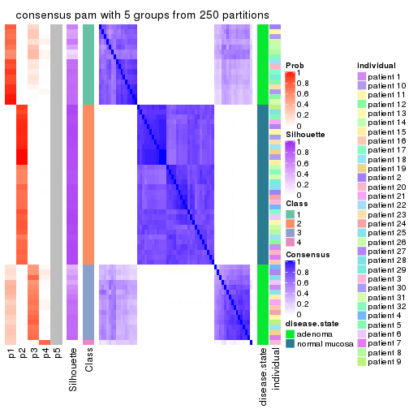</p>

</div>
<div id='tab-CV-pam-consensus-heatmap-5'>
<pre><code class="r">consensus_heatmap(res, k = 6)
</code></pre>

<p></p>

</div>
</div>

Heatmaps for the membership of samples in all partitions to see how consistent they are:


<script>
$( function() {
	$( '#tabs-CV-pam-membership-heatmap' ).tabs();
} );
</script>
<div id='tabs-CV-pam-membership-heatmap'>
<ul>
<li><a href='#tab-CV-pam-membership-heatmap-1'>k = 2</a></li>
<li><a href='#tab-CV-pam-membership-heatmap-2'>k = 3</a></li>
<li><a href='#tab-CV-pam-membership-heatmap-3'>k = 4</a></li>
<li><a href='#tab-CV-pam-membership-heatmap-4'>k = 5</a></li>
<li><a href='#tab-CV-pam-membership-heatmap-5'>k = 6</a></li>
</ul>
<div id='tab-CV-pam-membership-heatmap-1'>
<pre><code class="r">membership_heatmap(res, k = 2)
</code></pre>

<p></p>

</div>
<div id='tab-CV-pam-membership-heatmap-2'>
<pre><code class="r">membership_heatmap(res, k = 3)
</code></pre>

<p></p>

</div>
<div id='tab-CV-pam-membership-heatmap-3'>
<pre><code class="r">membership_heatmap(res, k = 4)
</code></pre>

<p></p>

</div>
<div id='tab-CV-pam-membership-heatmap-4'>
<pre><code class="r">membership_heatmap(res, k = 5)
</code></pre>

<p></p>

</div>
<div id='tab-CV-pam-membership-heatmap-5'>
<pre><code class="r">membership_heatmap(res, k = 6)
</code></pre>

<p></p>

</div>
</div>

As soon as we have had the classes for columns, we can look for signatures
which are significantly different between classes which can be candidate marks
for certain classes. Following are the heatmaps for signatures.


Signature heatmaps where rows are scaled:


<script>
$( function() {
	$( '#tabs-CV-pam-get-signatures' ).tabs();
} );
</script>
<div id='tabs-CV-pam-get-signatures'>
<ul>
<li><a href='#tab-CV-pam-get-signatures-1'>k = 2</a></li>
<li><a href='#tab-CV-pam-get-signatures-2'>k = 3</a></li>
<li><a href='#tab-CV-pam-get-signatures-3'>k = 4</a></li>
<li><a href='#tab-CV-pam-get-signatures-4'>k = 5</a></li>
<li><a href='#tab-CV-pam-get-signatures-5'>k = 6</a></li>
</ul>
<div id='tab-CV-pam-get-signatures-1'>
<pre><code class="r">get_signatures(res, k = 2)
</code></pre>

<p></p>

</div>
<div id='tab-CV-pam-get-signatures-2'>
<pre><code class="r">get_signatures(res, k = 3)
</code></pre>

<p>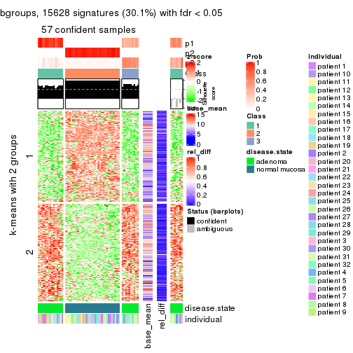</p>

</div>
<div id='tab-CV-pam-get-signatures-3'>
<pre><code class="r">get_signatures(res, k = 4)
</code></pre>

<p></p>

</div>
<div id='tab-CV-pam-get-signatures-4'>
<pre><code class="r">get_signatures(res, k = 5)
</code></pre>

<p></p>

</div>
<div id='tab-CV-pam-get-signatures-5'>
<pre><code class="r">get_signatures(res, k = 6)
</code></pre>

<p></p>

</div>
</div>


Signature heatmaps where rows are not scaled:


<script>
$( function() {
	$( '#tabs-CV-pam-get-signatures-no-scale' ).tabs();
} );
</script>
<div id='tabs-CV-pam-get-signatures-no-scale'>
<ul>
<li><a href='#tab-CV-pam-get-signatures-no-scale-1'>k = 2</a></li>
<li><a href='#tab-CV-pam-get-signatures-no-scale-2'>k = 3</a></li>
<li><a href='#tab-CV-pam-get-signatures-no-scale-3'>k = 4</a></li>
<li><a href='#tab-CV-pam-get-signatures-no-scale-4'>k = 5</a></li>
<li><a href='#tab-CV-pam-get-signatures-no-scale-5'>k = 6</a></li>
</ul>
<div id='tab-CV-pam-get-signatures-no-scale-1'>
<pre><code class="r">get_signatures(res, k = 2, scale_rows = FALSE)
</code></pre>

<p></p>

</div>
<div id='tab-CV-pam-get-signatures-no-scale-2'>
<pre><code class="r">get_signatures(res, k = 3, scale_rows = FALSE)
</code></pre>

<p></p>

</div>
<div id='tab-CV-pam-get-signatures-no-scale-3'>
<pre><code class="r">get_signatures(res, k = 4, scale_rows = FALSE)
</code></pre>

<p></p>

</div>
<div id='tab-CV-pam-get-signatures-no-scale-4'>
<pre><code class="r">get_signatures(res, k = 5, scale_rows = FALSE)
</code></pre>

<p>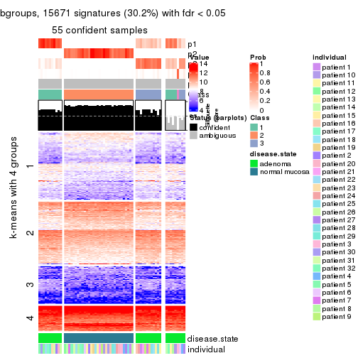</p>

</div>
<div id='tab-CV-pam-get-signatures-no-scale-5'>
<pre><code class="r">get_signatures(res, k = 6, scale_rows = FALSE)
</code></pre>

<p></p>

</div>
</div>


Compare the overlap of signatures from different k:

```r
compare_signatures(res)
```


`get_signature()` returns a data frame invisibly. TO get the list of signatures, the function
call should be assigned to a variable explicitly. In following code, if `plot` argument is set
to `FALSE`, no heatmap is plotted while only the differential analysis is performed.

```r
# code only for demonstration
tb = get_signature(res, k = ..., plot = FALSE)
```

An example of the output of `tb` is:

```
#>   which_row         fdr    mean_1    mean_2 scaled_mean_1 scaled_mean_2 km
#> 1        38 0.042760348  8.373488  9.131774    -0.5533452     0.5164555  1
#> 2        40 0.018707592  7.106213  8.469186    -0.6173731     0.5762149  1
#> 3        55 0.019134737 10.221463 11.207825    -0.6159697     0.5749050  1
#> 4        59 0.006059896  5.921854  7.869574    -0.6899429     0.6439467  1
#> 5        60 0.018055526  8.928898 10.211722    -0.6204761     0.5791110  1
#> 6        98 0.009384629 15.714769 14.887706     0.6635654    -0.6193277  2
...
```

The columns in `tb` are:

1. `which_row`: row indices corresponding to the input matrix.
2. `fdr`: FDR for the differential test. 
3. `mean_x`: The mean value in group x.
4. `scaled_mean_x`: The mean value in group x after rows are scaled.
5. `km`: Row groups if k-means clustering is applied to rows.


UMAP plot which shows how samples are separated.


<script>
$( function() {
	$( '#tabs-CV-pam-dimension-reduction' ).tabs();
} );
</script>
<div id='tabs-CV-pam-dimension-reduction'>
<ul>
<li><a href='#tab-CV-pam-dimension-reduction-1'>k = 2</a></li>
<li><a href='#tab-CV-pam-dimension-reduction-2'>k = 3</a></li>
<li><a href='#tab-CV-pam-dimension-reduction-3'>k = 4</a></li>
<li><a href='#tab-CV-pam-dimension-reduction-4'>k = 5</a></li>
<li><a href='#tab-CV-pam-dimension-reduction-5'>k = 6</a></li>
</ul>
<div id='tab-CV-pam-dimension-reduction-1'>
<pre><code class="r">dimension_reduction(res, k = 2, method = &quot;UMAP&quot;)
</code></pre>

<p></p>

</div>
<div id='tab-CV-pam-dimension-reduction-2'>
<pre><code class="r">dimension_reduction(res, k = 3, method = &quot;UMAP&quot;)
</code></pre>

<p></p>

</div>
<div id='tab-CV-pam-dimension-reduction-3'>
<pre><code class="r">dimension_reduction(res, k = 4, method = &quot;UMAP&quot;)
</code></pre>

<p></p>

</div>
<div id='tab-CV-pam-dimension-reduction-4'>
<pre><code class="r">dimension_reduction(res, k = 5, method = &quot;UMAP&quot;)
</code></pre>

<p></p>

</div>
<div id='tab-CV-pam-dimension-reduction-5'>
<pre><code class="r">dimension_reduction(res, k = 6, method = &quot;UMAP&quot;)
</code></pre>

<p></p>

</div>
</div>


Following heatmap shows how subgroups are split when increasing `k`:

```r
collect_classes(res)
```


Test correlation between subgroups and known annotations. If the known
annotation is numeric, one-way ANOVA test is applied, and if the known
annotation is discrete, chi-squared contingency table test is applied.

```r
test_to_known_factors(res)
```

```
#>         n disease.state(p) individual(p) k
#> CV:pam 64         9.19e-15         1.000 2
#> CV:pam 57         4.19e-13         0.998 3
#> CV:pam 58         2.54e-13         0.998 4
#> CV:pam 55         1.14e-12         0.998 5
#> CV:pam 54         1.88e-12         0.997 6
```


If matrix rows can be associated to genes, consider to use `functional_enrichment(res,
...)` to perform function enrichment for the signature genes. See [this vignette](http://bioconductor.org/packages/devel/bioc/vignettes/cola/inst/doc/functional_enrichment.html) for more detailed explanations.


 

---------------------------------------------------


### CV:mclust**


The object with results only for a single top-value method and a single partition method 
can be extracted as:

```r
res = res_list["CV", "mclust"]
# you can also extract it by
# res = res_list["CV:mclust"]
```

A summary of `res` and all the functions that can be applied to it:

```r
res
```

```
#> A 'ConsensusPartition' object with k = 2, 3, 4, 5, 6.
#>   On a matrix with 51941 rows and 64 columns.
#>   Top rows (1000, 2000, 3000, 4000, 5000) are extracted by 'CV' method.
#>   Subgroups are detected by 'mclust' method.
#>   Performed in total 1250 partitions by row resampling.
#>   Best k for subgroups seems to be 2.
#> 
#> Following methods can be applied to this 'ConsensusPartition' object:
#>  [1] "cola_report"             "collect_classes"         "collect_plots"          
#>  [4] "collect_stats"           "colnames"                "compare_signatures"     
#>  [7] "consensus_heatmap"       "dimension_reduction"     "functional_enrichment"  
#> [10] "get_anno_col"            "get_anno"                "get_classes"            
#> [13] "get_consensus"           "get_matrix"              "get_membership"         
#> [16] "get_param"               "get_signatures"          "get_stats"              
#> [19] "is_best_k"               "is_stable_k"             "membership_heatmap"     
#> [22] "ncol"                    "nrow"                    "plot_ecdf"              
#> [25] "rownames"                "select_partition_number" "show"                   
#> [28] "suggest_best_k"          "test_to_known_factors"
```

`collect_plots()` function collects all the plots made from `res` for all `k` (number of partitions)
into one single page to provide an easy and fast comparison between different `k`.

```r
collect_plots(res)
```


The plots are:

- The first row: a plot of the ECDF (empirical cumulative distribution
  function) curves of the consensus matrix for each `k` and the heatmap of
  predicted classes for each `k`.
- The second row: heatmaps of the consensus matrix for each `k`.
- The third row: heatmaps of the membership matrix for each `k`.
- The fouth row: heatmaps of the signatures for each `k`.

All the plots in panels can be made by individual functions and they are
plotted later in this section.

`select_partition_number()` produces several plots showing different
statistics for choosing "optimized" `k`. There are following statistics:

- ECDF curves of the consensus matrix for each `k`;
- 1-PAC. [The PAC
  score](https://en.wikipedia.org/wiki/Consensus_clustering#Over-interpretation_potential_of_consensus_clustering)
  measures the proportion of the ambiguous subgrouping.
- Mean silhouette score.
- Concordance. The mean probability of fiting the consensus class ids in all
  partitions.
- Area increased. Denote $A_k$ as the area under the ECDF curve for current
  `k`, the area increased is defined as $A_k - A_{k-1}$.
- Rand index. The percent of pairs of samples that are both in a same cluster
  or both are not in a same cluster in the partition of k and k-1.
- Jaccard index. The ratio of pairs of samples are both in a same cluster in
  the partition of k and k-1 and the pairs of samples are both in a same
  cluster in the partition k or k-1.

The detailed explanations of these statistics can be found in [the _cola_
vignette](http://bioconductor.org/packages/devel/bioc/vignettes/cola/inst/doc/cola.html#toc_13).

Generally speaking, lower PAC score, higher mean silhouette score or higher
concordance corresponds to better partition. Rand index and Jaccard index
measure how similar the current partition is compared to partition with `k-1`.
If they are too similar, we won't accept `k` is better than `k-1`.

```r
select_partition_number(res)
```


The numeric values for all these statistics can be obtained by `get_stats()`.

```r
get_stats(res)
```

```
#>   k 1-PAC mean_silhouette concordance area_increased  Rand Jaccard
#> 2 2 1.000           1.000       1.000         0.5084 0.492   0.492
#> 3 3 0.892           0.871       0.929         0.1747 0.905   0.806
#> 4 4 0.688           0.719       0.828         0.1436 0.907   0.769
#> 5 5 0.638           0.560       0.757         0.0979 0.871   0.624
#> 6 6 0.714           0.758       0.848         0.0482 0.950   0.802
```

`suggest_best_k()` suggests the best $k$ based on these statistics. The rules are as follows:

- All $k$ with Jaccard index larger than 0.95 are removed because increasing
  $k$ does not provide enough extra information. If all $k$ are removed, it is
  marked as no subgroup is detected.
- For all $k$ with 1-PAC score larger than 0.9, the maximal $k$ is taken as
  the best $k$, and other $k$ are marked as optional $k$.
- If it does not fit the second rule. The $k$ with the maximal vote of the
  highest 1-PAC score, highest mean silhouette, and highest concordance is
  taken as the best $k$.

```r
suggest_best_k(res)
```

```
#> [1] 2
```


Following shows the table of the partitions (You need to click the **show/hide
code output** link to see it). The membership matrix (columns with name `p*`)
is inferred by
[`clue::cl_consensus()`](https://www.rdocumentation.org/link/cl_consensus?package=clue)
function with the `SE` method. Basically the value in the membership matrix
represents the probability to belong to a certain group. The finall class
label for an item is determined with the group with highest probability it
belongs to.

In `get_classes()` function, the entropy is calculated from the membership
matrix and the silhouette score is calculated from the consensus matrix.


<script>
$( function() {
	$( '#tabs-CV-mclust-get-classes' ).tabs();
} );
</script>
<div id='tabs-CV-mclust-get-classes'>
<ul>
<li><a href='#tab-CV-mclust-get-classes-1'>k = 2</a></li>
<li><a href='#tab-CV-mclust-get-classes-2'>k = 3</a></li>
<li><a href='#tab-CV-mclust-get-classes-3'>k = 4</a></li>
<li><a href='#tab-CV-mclust-get-classes-4'>k = 5</a></li>
<li><a href='#tab-CV-mclust-get-classes-5'>k = 6</a></li>
</ul>

<div id='tab-CV-mclust-get-classes-1'>
<p><a id='tab-CV-mclust-get-classes-1-a' style='color:#0366d6' href='#'>show/hide code output</a></p>
<pre><code class="r">cbind(get_classes(res, k = 2), get_membership(res, k = 2))
</code></pre>

<pre><code>#&gt;           class entropy silhouette p1 p2
#&gt; GSM215051     2       0          1  0  1
#&gt; GSM215052     2       0          1  0  1
#&gt; GSM215053     2       0          1  0  1
#&gt; GSM215054     2       0          1  0  1
#&gt; GSM215055     2       0          1  0  1
#&gt; GSM215056     2       0          1  0  1
#&gt; GSM215057     2       0          1  0  1
#&gt; GSM215058     2       0          1  0  1
#&gt; GSM215059     2       0          1  0  1
#&gt; GSM215060     2       0          1  0  1
#&gt; GSM215061     2       0          1  0  1
#&gt; GSM215062     2       0          1  0  1
#&gt; GSM215063     2       0          1  0  1
#&gt; GSM215064     2       0          1  0  1
#&gt; GSM215065     2       0          1  0  1
#&gt; GSM215066     2       0          1  0  1
#&gt; GSM215067     2       0          1  0  1
#&gt; GSM215068     2       0          1  0  1
#&gt; GSM215069     2       0          1  0  1
#&gt; GSM215070     2       0          1  0  1
#&gt; GSM215071     2       0          1  0  1
#&gt; GSM215072     2       0          1  0  1
#&gt; GSM215073     2       0          1  0  1
#&gt; GSM215074     2       0          1  0  1
#&gt; GSM215075     2       0          1  0  1
#&gt; GSM215076     2       0          1  0  1
#&gt; GSM215077     2       0          1  0  1
#&gt; GSM215078     2       0          1  0  1
#&gt; GSM215079     2       0          1  0  1
#&gt; GSM215080     2       0          1  0  1
#&gt; GSM215081     2       0          1  0  1
#&gt; GSM215082     2       0          1  0  1
#&gt; GSM215083     1       0          1  1  0
#&gt; GSM215084     1       0          1  1  0
#&gt; GSM215085     1       0          1  1  0
#&gt; GSM215086     1       0          1  1  0
#&gt; GSM215087     1       0          1  1  0
#&gt; GSM215088     1       0          1  1  0
#&gt; GSM215089     1       0          1  1  0
#&gt; GSM215090     1       0          1  1  0
#&gt; GSM215091     1       0          1  1  0
#&gt; GSM215092     1       0          1  1  0
#&gt; GSM215093     1       0          1  1  0
#&gt; GSM215094     1       0          1  1  0
#&gt; GSM215095     1       0          1  1  0
#&gt; GSM215096     1       0          1  1  0
#&gt; GSM215097     1       0          1  1  0
#&gt; GSM215098     1       0          1  1  0
#&gt; GSM215099     1       0          1  1  0
#&gt; GSM215100     1       0          1  1  0
#&gt; GSM215101     1       0          1  1  0
#&gt; GSM215102     1       0          1  1  0
#&gt; GSM215103     1       0          1  1  0
#&gt; GSM215104     1       0          1  1  0
#&gt; GSM215105     1       0          1  1  0
#&gt; GSM215106     1       0          1  1  0
#&gt; GSM215107     1       0          1  1  0
#&gt; GSM215108     1       0          1  1  0
#&gt; GSM215109     1       0          1  1  0
#&gt; GSM215110     1       0          1  1  0
#&gt; GSM215111     1       0          1  1  0
#&gt; GSM215112     1       0          1  1  0
#&gt; GSM215113     1       0          1  1  0
#&gt; GSM215114     1       0          1  1  0
</code></pre>

<script>
$('#tab-CV-mclust-get-classes-1-a').parent().next().next().hide();
$('#tab-CV-mclust-get-classes-1-a').click(function(){
  $('#tab-CV-mclust-get-classes-1-a').parent().next().next().toggle();
  return(false);
});
</script>
</div>

<div id='tab-CV-mclust-get-classes-2'>
<p><a id='tab-CV-mclust-get-classes-2-a' style='color:#0366d6' href='#'>show/hide code output</a></p>
<pre><code class="r">cbind(get_classes(res, k = 3), get_membership(res, k = 3))
</code></pre>

<pre><code>#&gt;           class entropy silhouette    p1    p2    p3
#&gt; GSM215051     2  0.0237     0.9838 0.000 0.996 0.004
#&gt; GSM215052     2  0.1964     0.9623 0.000 0.944 0.056
#&gt; GSM215053     2  0.0237     0.9838 0.000 0.996 0.004
#&gt; GSM215054     2  0.0237     0.9838 0.000 0.996 0.004
#&gt; GSM215055     2  0.0000     0.9844 0.000 1.000 0.000
#&gt; GSM215056     2  0.0237     0.9838 0.000 0.996 0.004
#&gt; GSM215057     2  0.0237     0.9842 0.000 0.996 0.004
#&gt; GSM215058     2  0.0424     0.9828 0.000 0.992 0.008
#&gt; GSM215059     2  0.0237     0.9842 0.000 0.996 0.004
#&gt; GSM215060     2  0.0000     0.9844 0.000 1.000 0.000
#&gt; GSM215061     2  0.0000     0.9844 0.000 1.000 0.000
#&gt; GSM215062     2  0.2066     0.9617 0.000 0.940 0.060
#&gt; GSM215063     2  0.0237     0.9838 0.000 0.996 0.004
#&gt; GSM215064     2  0.1860     0.9664 0.000 0.948 0.052
#&gt; GSM215065     2  0.0237     0.9842 0.000 0.996 0.004
#&gt; GSM215066     2  0.0237     0.9842 0.000 0.996 0.004
#&gt; GSM215067     2  0.0237     0.9838 0.000 0.996 0.004
#&gt; GSM215068     2  0.0237     0.9842 0.000 0.996 0.004
#&gt; GSM215069     2  0.0237     0.9842 0.000 0.996 0.004
#&gt; GSM215070     2  0.1964     0.9623 0.000 0.944 0.056
#&gt; GSM215071     2  0.1753     0.9662 0.000 0.952 0.048
#&gt; GSM215072     2  0.1964     0.9623 0.000 0.944 0.056
#&gt; GSM215073     2  0.0000     0.9844 0.000 1.000 0.000
#&gt; GSM215074     2  0.0237     0.9842 0.000 0.996 0.004
#&gt; GSM215075     2  0.0000     0.9844 0.000 1.000 0.000
#&gt; GSM215076     2  0.1964     0.9623 0.000 0.944 0.056
#&gt; GSM215077     2  0.1753     0.9662 0.000 0.952 0.048
#&gt; GSM215078     2  0.0000     0.9844 0.000 1.000 0.000
#&gt; GSM215079     2  0.0237     0.9842 0.000 0.996 0.004
#&gt; GSM215080     2  0.0000     0.9844 0.000 1.000 0.000
#&gt; GSM215081     2  0.0424     0.9838 0.000 0.992 0.008
#&gt; GSM215082     2  0.1860     0.9643 0.000 0.948 0.052
#&gt; GSM215083     1  0.3816     0.7530 0.852 0.000 0.148
#&gt; GSM215084     1  0.4291     0.7274 0.820 0.000 0.180
#&gt; GSM215085     3  0.6235     0.5656 0.436 0.000 0.564
#&gt; GSM215086     3  0.4346     0.7280 0.184 0.000 0.816
#&gt; GSM215087     1  0.0000     0.9046 1.000 0.000 0.000
#&gt; GSM215088     3  0.4887     0.7265 0.228 0.000 0.772
#&gt; GSM215089     1  0.0237     0.9057 0.996 0.000 0.004
#&gt; GSM215090     1  0.1753     0.8785 0.952 0.000 0.048
#&gt; GSM215091     1  0.0000     0.9046 1.000 0.000 0.000
#&gt; GSM215092     1  0.0592     0.9048 0.988 0.000 0.012
#&gt; GSM215093     3  0.4291     0.7266 0.180 0.000 0.820
#&gt; GSM215094     1  0.2066     0.8697 0.940 0.000 0.060
#&gt; GSM215095     1  0.0424     0.9052 0.992 0.000 0.008
#&gt; GSM215096     1  0.0592     0.9052 0.988 0.000 0.012
#&gt; GSM215097     1  0.0237     0.9056 0.996 0.000 0.004
#&gt; GSM215098     1  0.0000     0.9046 1.000 0.000 0.000
#&gt; GSM215099     1  0.1411     0.8880 0.964 0.000 0.036
#&gt; GSM215100     1  0.1529     0.8855 0.960 0.000 0.040
#&gt; GSM215101     1  0.1860     0.8705 0.948 0.000 0.052
#&gt; GSM215102     1  0.6225    -0.0615 0.568 0.000 0.432
#&gt; GSM215103     3  0.6140     0.4178 0.404 0.000 0.596
#&gt; GSM215104     1  0.4842     0.6573 0.776 0.000 0.224
#&gt; GSM215105     1  0.0000     0.9046 1.000 0.000 0.000
#&gt; GSM215106     1  0.0424     0.9051 0.992 0.000 0.008
#&gt; GSM215107     1  0.0237     0.9053 0.996 0.000 0.004
#&gt; GSM215108     3  0.6267     0.4022 0.452 0.000 0.548
#&gt; GSM215109     3  0.2261     0.6690 0.068 0.000 0.932
#&gt; GSM215110     3  0.6252     0.5457 0.444 0.000 0.556
#&gt; GSM215111     1  0.0000     0.9046 1.000 0.000 0.000
#&gt; GSM215112     1  0.0424     0.9052 0.992 0.000 0.008
#&gt; GSM215113     1  0.0237     0.9055 0.996 0.000 0.004
#&gt; GSM215114     1  0.5465     0.5250 0.712 0.000 0.288
</code></pre>

<script>
$('#tab-CV-mclust-get-classes-2-a').parent().next().next().hide();
$('#tab-CV-mclust-get-classes-2-a').click(function(){
  $('#tab-CV-mclust-get-classes-2-a').parent().next().next().toggle();
  return(false);
});
</script>
</div>

<div id='tab-CV-mclust-get-classes-3'>
<p><a id='tab-CV-mclust-get-classes-3-a' style='color:#0366d6' href='#'>show/hide code output</a></p>
<pre><code class="r">cbind(get_classes(res, k = 4), get_membership(res, k = 4))
</code></pre>

<pre><code>#&gt;           class entropy silhouette    p1    p2    p3    p4
#&gt; GSM215051     4  0.4331    0.91669 0.000 0.288 0.000 0.712
#&gt; GSM215052     2  0.1388    0.54096 0.000 0.960 0.012 0.028
#&gt; GSM215053     4  0.4008    0.95395 0.000 0.244 0.000 0.756
#&gt; GSM215054     4  0.3975    0.94828 0.000 0.240 0.000 0.760
#&gt; GSM215055     2  0.4866    0.44766 0.000 0.596 0.000 0.404
#&gt; GSM215056     4  0.4193    0.95242 0.000 0.268 0.000 0.732
#&gt; GSM215057     2  0.4277    0.73112 0.000 0.720 0.000 0.280
#&gt; GSM215058     2  0.4941   -0.00422 0.000 0.564 0.000 0.436
#&gt; GSM215059     2  0.4356    0.73351 0.000 0.708 0.000 0.292
#&gt; GSM215060     2  0.4277    0.73112 0.000 0.720 0.000 0.280
#&gt; GSM215061     2  0.4277    0.73112 0.000 0.720 0.000 0.280
#&gt; GSM215062     2  0.2412    0.60908 0.000 0.908 0.008 0.084
#&gt; GSM215063     4  0.4040    0.95160 0.000 0.248 0.000 0.752
#&gt; GSM215064     2  0.2530    0.63036 0.000 0.888 0.000 0.112
#&gt; GSM215065     2  0.4356    0.73351 0.000 0.708 0.000 0.292
#&gt; GSM215066     2  0.4356    0.73351 0.000 0.708 0.000 0.292
#&gt; GSM215067     4  0.4222    0.94812 0.000 0.272 0.000 0.728
#&gt; GSM215068     2  0.4356    0.73351 0.000 0.708 0.000 0.292
#&gt; GSM215069     2  0.4356    0.73351 0.000 0.708 0.000 0.292
#&gt; GSM215070     2  0.0937    0.55734 0.000 0.976 0.012 0.012
#&gt; GSM215071     2  0.1722    0.59621 0.000 0.944 0.008 0.048
#&gt; GSM215072     2  0.1059    0.55296 0.000 0.972 0.012 0.016
#&gt; GSM215073     2  0.4331    0.73292 0.000 0.712 0.000 0.288
#&gt; GSM215074     2  0.4277    0.73112 0.000 0.720 0.000 0.280
#&gt; GSM215075     2  0.4277    0.72837 0.000 0.720 0.000 0.280
#&gt; GSM215076     2  0.4635   -0.04650 0.000 0.720 0.012 0.268
#&gt; GSM215077     2  0.1722    0.59675 0.000 0.944 0.008 0.048
#&gt; GSM215078     2  0.4304    0.72910 0.000 0.716 0.000 0.284
#&gt; GSM215079     2  0.4356    0.73351 0.000 0.708 0.000 0.292
#&gt; GSM215080     2  0.4304    0.73445 0.000 0.716 0.000 0.284
#&gt; GSM215081     2  0.4277    0.73256 0.000 0.720 0.000 0.280
#&gt; GSM215082     2  0.0937    0.56081 0.000 0.976 0.012 0.012
#&gt; GSM215083     1  0.4422    0.52919 0.736 0.000 0.256 0.008
#&gt; GSM215084     1  0.5134    0.49405 0.680 0.016 0.300 0.004
#&gt; GSM215085     3  0.7068    0.67863 0.296 0.000 0.548 0.156
#&gt; GSM215086     3  0.6756    0.73804 0.188 0.000 0.612 0.200
#&gt; GSM215087     1  0.0000    0.89475 1.000 0.000 0.000 0.000
#&gt; GSM215088     3  0.6964    0.72781 0.228 0.000 0.584 0.188
#&gt; GSM215089     1  0.0000    0.89475 1.000 0.000 0.000 0.000
#&gt; GSM215090     1  0.2011    0.83111 0.920 0.000 0.080 0.000
#&gt; GSM215091     1  0.0000    0.89475 1.000 0.000 0.000 0.000
#&gt; GSM215092     1  0.0188    0.89401 0.996 0.000 0.004 0.000
#&gt; GSM215093     3  0.6194    0.74348 0.132 0.000 0.668 0.200
#&gt; GSM215094     1  0.2466    0.81688 0.900 0.000 0.096 0.004
#&gt; GSM215095     1  0.0469    0.89185 0.988 0.000 0.012 0.000
#&gt; GSM215096     1  0.0592    0.88989 0.984 0.000 0.016 0.000
#&gt; GSM215097     1  0.0000    0.89475 1.000 0.000 0.000 0.000
#&gt; GSM215098     1  0.0000    0.89475 1.000 0.000 0.000 0.000
#&gt; GSM215099     1  0.0817    0.88290 0.976 0.000 0.024 0.000
#&gt; GSM215100     1  0.1557    0.85741 0.944 0.000 0.056 0.000
#&gt; GSM215101     1  0.1211    0.87413 0.960 0.000 0.040 0.000
#&gt; GSM215102     3  0.4700    0.64773 0.196 0.016 0.772 0.016
#&gt; GSM215103     3  0.4569    0.60372 0.220 0.012 0.760 0.008
#&gt; GSM215104     1  0.5805   -0.01022 0.500 0.016 0.476 0.008
#&gt; GSM215105     1  0.0188    0.89395 0.996 0.000 0.004 0.000
#&gt; GSM215106     1  0.0000    0.89475 1.000 0.000 0.000 0.000
#&gt; GSM215107     1  0.0000    0.89475 1.000 0.000 0.000 0.000
#&gt; GSM215108     3  0.4008    0.69522 0.136 0.012 0.832 0.020
#&gt; GSM215109     3  0.1674    0.68616 0.004 0.012 0.952 0.032
#&gt; GSM215110     3  0.6627    0.68027 0.300 0.000 0.588 0.112
#&gt; GSM215111     1  0.0000    0.89475 1.000 0.000 0.000 0.000
#&gt; GSM215112     1  0.0188    0.89410 0.996 0.000 0.004 0.000
#&gt; GSM215113     1  0.0000    0.89475 1.000 0.000 0.000 0.000
#&gt; GSM215114     1  0.5500    0.33199 0.600 0.016 0.380 0.004
</code></pre>

<script>
$('#tab-CV-mclust-get-classes-3-a').parent().next().next().hide();
$('#tab-CV-mclust-get-classes-3-a').click(function(){
  $('#tab-CV-mclust-get-classes-3-a').parent().next().next().toggle();
  return(false);
});
</script>
</div>

<div id='tab-CV-mclust-get-classes-4'>
<p><a id='tab-CV-mclust-get-classes-4-a' style='color:#0366d6' href='#'>show/hide code output</a></p>
<pre><code class="r">cbind(get_classes(res, k = 5), get_membership(res, k = 5))
</code></pre>

<pre><code>#&gt;           class entropy silhouette    p1    p2    p3    p4    p5
#&gt; GSM215051     2  0.6816    -0.0509 0.000 0.360 0.000 0.316 0.324
#&gt; GSM215052     4  0.3551     0.7832 0.000 0.220 0.000 0.772 0.008
#&gt; GSM215053     5  0.6722     0.0145 0.000 0.316 0.000 0.268 0.416
#&gt; GSM215054     5  0.6710     0.0382 0.000 0.304 0.000 0.272 0.424
#&gt; GSM215055     2  0.5766     0.4639 0.000 0.616 0.000 0.164 0.220
#&gt; GSM215056     2  0.6764    -0.1058 0.000 0.368 0.000 0.268 0.364
#&gt; GSM215057     2  0.2570     0.6814 0.000 0.888 0.000 0.084 0.028
#&gt; GSM215058     4  0.5815    -0.0331 0.000 0.396 0.000 0.508 0.096
#&gt; GSM215059     2  0.0290     0.6821 0.000 0.992 0.000 0.000 0.008
#&gt; GSM215060     2  0.2520     0.6785 0.000 0.896 0.000 0.048 0.056
#&gt; GSM215061     2  0.1997     0.6881 0.000 0.924 0.000 0.036 0.040
#&gt; GSM215062     4  0.4640     0.6225 0.000 0.400 0.000 0.584 0.016
#&gt; GSM215063     5  0.6678     0.0299 0.000 0.312 0.000 0.256 0.432
#&gt; GSM215064     2  0.4718    -0.3766 0.000 0.540 0.000 0.444 0.016
#&gt; GSM215065     2  0.0912     0.6725 0.000 0.972 0.000 0.012 0.016
#&gt; GSM215066     2  0.2006     0.6639 0.000 0.916 0.000 0.072 0.012
#&gt; GSM215067     2  0.6738    -0.0914 0.000 0.376 0.000 0.256 0.368
#&gt; GSM215068     2  0.1774     0.6694 0.000 0.932 0.000 0.052 0.016
#&gt; GSM215069     2  0.0912     0.6839 0.000 0.972 0.000 0.012 0.016
#&gt; GSM215070     4  0.3395     0.7869 0.000 0.236 0.000 0.764 0.000
#&gt; GSM215071     4  0.3661     0.7674 0.000 0.276 0.000 0.724 0.000
#&gt; GSM215072     4  0.3210     0.7832 0.000 0.212 0.000 0.788 0.000
#&gt; GSM215073     2  0.1741     0.6890 0.000 0.936 0.000 0.024 0.040
#&gt; GSM215074     2  0.2740     0.6787 0.000 0.876 0.000 0.096 0.028
#&gt; GSM215075     2  0.3863     0.6395 0.000 0.796 0.000 0.152 0.052
#&gt; GSM215076     4  0.3297     0.6225 0.000 0.084 0.000 0.848 0.068
#&gt; GSM215077     4  0.3774     0.7476 0.000 0.296 0.000 0.704 0.000
#&gt; GSM215078     2  0.4495     0.5320 0.000 0.712 0.000 0.244 0.044
#&gt; GSM215079     2  0.2727     0.6253 0.000 0.868 0.000 0.116 0.016
#&gt; GSM215080     2  0.2864     0.6422 0.000 0.864 0.000 0.112 0.024
#&gt; GSM215081     2  0.3586     0.4934 0.000 0.792 0.000 0.188 0.020
#&gt; GSM215082     4  0.3969     0.7506 0.000 0.304 0.000 0.692 0.004
#&gt; GSM215083     1  0.4088     0.4960 0.688 0.000 0.304 0.000 0.008
#&gt; GSM215084     1  0.6539     0.2594 0.544 0.000 0.228 0.012 0.216
#&gt; GSM215085     3  0.3789     0.6883 0.212 0.000 0.768 0.000 0.020
#&gt; GSM215086     3  0.2536     0.7244 0.128 0.000 0.868 0.000 0.004
#&gt; GSM215087     1  0.0579     0.8910 0.984 0.000 0.008 0.000 0.008
#&gt; GSM215088     3  0.2833     0.7255 0.140 0.000 0.852 0.004 0.004
#&gt; GSM215089     1  0.0451     0.8913 0.988 0.000 0.004 0.000 0.008
#&gt; GSM215090     1  0.2462     0.8105 0.880 0.000 0.112 0.000 0.008
#&gt; GSM215091     1  0.0798     0.8902 0.976 0.000 0.016 0.000 0.008
#&gt; GSM215092     1  0.0912     0.8896 0.972 0.000 0.016 0.000 0.012
#&gt; GSM215093     3  0.2678     0.7092 0.100 0.000 0.880 0.004 0.016
#&gt; GSM215094     1  0.3471     0.7623 0.836 0.000 0.072 0.000 0.092
#&gt; GSM215095     1  0.0992     0.8899 0.968 0.000 0.008 0.000 0.024
#&gt; GSM215096     1  0.1117     0.8881 0.964 0.000 0.016 0.000 0.020
#&gt; GSM215097     1  0.0324     0.8909 0.992 0.000 0.004 0.000 0.004
#&gt; GSM215098     1  0.0566     0.8913 0.984 0.000 0.004 0.000 0.012
#&gt; GSM215099     1  0.1331     0.8745 0.952 0.000 0.040 0.000 0.008
#&gt; GSM215100     1  0.2358     0.8216 0.888 0.000 0.104 0.000 0.008
#&gt; GSM215101     1  0.1484     0.8753 0.944 0.000 0.048 0.000 0.008
#&gt; GSM215102     5  0.5710    -0.4526 0.060 0.000 0.464 0.008 0.468
#&gt; GSM215103     3  0.6164     0.2807 0.104 0.000 0.480 0.008 0.408
#&gt; GSM215104     5  0.7128    -0.3284 0.344 0.000 0.292 0.012 0.352
#&gt; GSM215105     1  0.0451     0.8921 0.988 0.000 0.004 0.000 0.008
#&gt; GSM215106     1  0.0693     0.8916 0.980 0.000 0.012 0.000 0.008
#&gt; GSM215107     1  0.0451     0.8910 0.988 0.000 0.008 0.000 0.004
#&gt; GSM215108     5  0.5121    -0.4495 0.028 0.000 0.468 0.004 0.500
#&gt; GSM215109     3  0.4415     0.3651 0.000 0.000 0.604 0.008 0.388
#&gt; GSM215110     3  0.5024     0.6694 0.212 0.000 0.692 0.000 0.096
#&gt; GSM215111     1  0.0162     0.8910 0.996 0.000 0.004 0.000 0.000
#&gt; GSM215112     1  0.0703     0.8905 0.976 0.000 0.000 0.000 0.024
#&gt; GSM215113     1  0.0404     0.8912 0.988 0.000 0.000 0.000 0.012
#&gt; GSM215114     1  0.6792     0.0671 0.480 0.000 0.300 0.012 0.208
</code></pre>

<script>
$('#tab-CV-mclust-get-classes-4-a').parent().next().next().hide();
$('#tab-CV-mclust-get-classes-4-a').click(function(){
  $('#tab-CV-mclust-get-classes-4-a').parent().next().next().toggle();
  return(false);
});
</script>
</div>

<div id='tab-CV-mclust-get-classes-5'>
<p><a id='tab-CV-mclust-get-classes-5-a' style='color:#0366d6' href='#'>show/hide code output</a></p>
<pre><code class="r">cbind(get_classes(res, k = 6), get_membership(res, k = 6))
</code></pre>

<pre><code>#&gt;           class entropy silhouette    p1    p2    p3    p4    p5    p6
#&gt; GSM215051     4  0.2685      0.868 0.000 0.072 0.000 0.868 0.060 0.000
#&gt; GSM215052     5  0.2383      0.815 0.000 0.096 0.000 0.024 0.880 0.000
#&gt; GSM215053     4  0.1398      0.878 0.000 0.052 0.000 0.940 0.008 0.000
#&gt; GSM215054     4  0.1398      0.877 0.000 0.052 0.000 0.940 0.008 0.000
#&gt; GSM215055     4  0.4361      0.558 0.000 0.308 0.000 0.648 0.044 0.000
#&gt; GSM215056     4  0.2302      0.879 0.000 0.120 0.000 0.872 0.008 0.000
#&gt; GSM215057     2  0.1575      0.852 0.000 0.936 0.000 0.032 0.032 0.000
#&gt; GSM215058     5  0.5958      0.120 0.000 0.248 0.000 0.304 0.448 0.000
#&gt; GSM215059     2  0.0653      0.846 0.000 0.980 0.004 0.004 0.012 0.000
#&gt; GSM215060     2  0.2851      0.807 0.000 0.844 0.004 0.132 0.020 0.000
#&gt; GSM215061     2  0.2622      0.827 0.000 0.868 0.004 0.104 0.024 0.000
#&gt; GSM215062     5  0.4064      0.604 0.000 0.336 0.000 0.020 0.644 0.000
#&gt; GSM215063     4  0.2307      0.874 0.000 0.064 0.000 0.900 0.024 0.012
#&gt; GSM215064     2  0.4246      0.102 0.000 0.580 0.000 0.020 0.400 0.000
#&gt; GSM215065     2  0.0767      0.846 0.000 0.976 0.004 0.008 0.012 0.000
#&gt; GSM215066     2  0.1340      0.848 0.000 0.948 0.004 0.008 0.040 0.000
#&gt; GSM215067     4  0.3375      0.849 0.000 0.156 0.000 0.808 0.024 0.012
#&gt; GSM215068     2  0.0458      0.849 0.000 0.984 0.000 0.000 0.016 0.000
#&gt; GSM215069     2  0.0767      0.848 0.000 0.976 0.004 0.012 0.008 0.000
#&gt; GSM215070     5  0.2320      0.828 0.000 0.132 0.000 0.004 0.864 0.000
#&gt; GSM215071     5  0.3104      0.795 0.000 0.204 0.000 0.004 0.788 0.004
#&gt; GSM215072     5  0.2243      0.827 0.000 0.112 0.000 0.004 0.880 0.004
#&gt; GSM215073     2  0.2488      0.822 0.000 0.864 0.004 0.124 0.008 0.000
#&gt; GSM215074     2  0.2190      0.844 0.000 0.900 0.000 0.060 0.040 0.000
#&gt; GSM215075     2  0.4199      0.730 0.000 0.748 0.000 0.100 0.148 0.004
#&gt; GSM215076     5  0.1918      0.708 0.000 0.008 0.000 0.088 0.904 0.000
#&gt; GSM215077     5  0.2913      0.809 0.000 0.180 0.000 0.004 0.812 0.004
#&gt; GSM215078     2  0.5479      0.409 0.000 0.556 0.000 0.136 0.304 0.004
#&gt; GSM215079     2  0.1349      0.840 0.000 0.940 0.000 0.004 0.056 0.000
#&gt; GSM215080     2  0.2030      0.841 0.000 0.908 0.000 0.028 0.064 0.000
#&gt; GSM215081     2  0.2404      0.785 0.000 0.872 0.000 0.016 0.112 0.000
#&gt; GSM215082     5  0.2805      0.812 0.000 0.184 0.000 0.004 0.812 0.000
#&gt; GSM215083     1  0.3933      0.680 0.740 0.000 0.220 0.000 0.008 0.032
#&gt; GSM215084     1  0.5313      0.179 0.536 0.000 0.048 0.008 0.016 0.392
#&gt; GSM215085     3  0.2680      0.804 0.108 0.000 0.860 0.000 0.000 0.032
#&gt; GSM215086     3  0.0972      0.847 0.028 0.000 0.964 0.000 0.000 0.008
#&gt; GSM215087     1  0.1138      0.883 0.960 0.000 0.012 0.000 0.004 0.024
#&gt; GSM215088     3  0.1082      0.851 0.040 0.000 0.956 0.000 0.000 0.004
#&gt; GSM215089     1  0.0622      0.884 0.980 0.000 0.012 0.000 0.000 0.008
#&gt; GSM215090     1  0.3142      0.836 0.856 0.000 0.032 0.004 0.024 0.084
#&gt; GSM215091     1  0.1381      0.880 0.952 0.000 0.020 0.004 0.004 0.020
#&gt; GSM215092     1  0.2017      0.874 0.920 0.000 0.004 0.008 0.020 0.048
#&gt; GSM215093     3  0.1749      0.824 0.024 0.000 0.932 0.008 0.000 0.036
#&gt; GSM215094     1  0.3116      0.782 0.836 0.000 0.016 0.012 0.004 0.132
#&gt; GSM215095     1  0.1729      0.875 0.936 0.000 0.012 0.012 0.004 0.036
#&gt; GSM215096     1  0.1750      0.873 0.932 0.000 0.016 0.012 0.000 0.040
#&gt; GSM215097     1  0.1262      0.885 0.956 0.000 0.020 0.000 0.008 0.016
#&gt; GSM215098     1  0.1026      0.884 0.968 0.000 0.008 0.008 0.004 0.012
#&gt; GSM215099     1  0.2538      0.861 0.892 0.000 0.012 0.008 0.020 0.068
#&gt; GSM215100     1  0.3067      0.842 0.860 0.000 0.028 0.004 0.024 0.084
#&gt; GSM215101     1  0.1760      0.877 0.936 0.000 0.028 0.012 0.004 0.020
#&gt; GSM215102     6  0.2848      0.689 0.036 0.000 0.104 0.000 0.004 0.856
#&gt; GSM215103     6  0.4582      0.636 0.160 0.000 0.116 0.000 0.008 0.716
#&gt; GSM215104     6  0.4972      0.337 0.372 0.000 0.056 0.000 0.008 0.564
#&gt; GSM215105     1  0.1321      0.882 0.952 0.000 0.024 0.000 0.004 0.020
#&gt; GSM215106     1  0.1296      0.884 0.952 0.000 0.032 0.004 0.000 0.012
#&gt; GSM215107     1  0.2050      0.874 0.920 0.000 0.032 0.004 0.008 0.036
#&gt; GSM215108     6  0.2404      0.675 0.016 0.000 0.112 0.000 0.000 0.872
#&gt; GSM215109     6  0.3221      0.569 0.000 0.000 0.220 0.004 0.004 0.772
#&gt; GSM215110     3  0.5025      0.562 0.136 0.000 0.632 0.000 0.000 0.232
#&gt; GSM215111     1  0.1401      0.881 0.948 0.000 0.028 0.000 0.004 0.020
#&gt; GSM215112     1  0.1843      0.873 0.932 0.000 0.016 0.016 0.004 0.032
#&gt; GSM215113     1  0.1590      0.881 0.944 0.000 0.008 0.008 0.012 0.028
#&gt; GSM215114     1  0.4648      0.142 0.548 0.000 0.044 0.000 0.000 0.408
</code></pre>

<script>
$('#tab-CV-mclust-get-classes-5-a').parent().next().next().hide();
$('#tab-CV-mclust-get-classes-5-a').click(function(){
  $('#tab-CV-mclust-get-classes-5-a').parent().next().next().toggle();
  return(false);
});
</script>
</div>
</div>

Heatmaps for the consensus matrix. It visualizes the probability of two
samples to be in a same group.


<script>
$( function() {
	$( '#tabs-CV-mclust-consensus-heatmap' ).tabs();
} );
</script>
<div id='tabs-CV-mclust-consensus-heatmap'>
<ul>
<li><a href='#tab-CV-mclust-consensus-heatmap-1'>k = 2</a></li>
<li><a href='#tab-CV-mclust-consensus-heatmap-2'>k = 3</a></li>
<li><a href='#tab-CV-mclust-consensus-heatmap-3'>k = 4</a></li>
<li><a href='#tab-CV-mclust-consensus-heatmap-4'>k = 5</a></li>
<li><a href='#tab-CV-mclust-consensus-heatmap-5'>k = 6</a></li>
</ul>
<div id='tab-CV-mclust-consensus-heatmap-1'>
<pre><code class="r">consensus_heatmap(res, k = 2)
</code></pre>

<p></p>

</div>
<div id='tab-CV-mclust-consensus-heatmap-2'>
<pre><code class="r">consensus_heatmap(res, k = 3)
</code></pre>

<p></p>

</div>
<div id='tab-CV-mclust-consensus-heatmap-3'>
<pre><code class="r">consensus_heatmap(res, k = 4)
</code></pre>

<p></p>

</div>
<div id='tab-CV-mclust-consensus-heatmap-4'>
<pre><code class="r">consensus_heatmap(res, k = 5)
</code></pre>

<p></p>

</div>
<div id='tab-CV-mclust-consensus-heatmap-5'>
<pre><code class="r">consensus_heatmap(res, k = 6)
</code></pre>

<p></p>

</div>
</div>

Heatmaps for the membership of samples in all partitions to see how consistent they are:


<script>
$( function() {
	$( '#tabs-CV-mclust-membership-heatmap' ).tabs();
} );
</script>
<div id='tabs-CV-mclust-membership-heatmap'>
<ul>
<li><a href='#tab-CV-mclust-membership-heatmap-1'>k = 2</a></li>
<li><a href='#tab-CV-mclust-membership-heatmap-2'>k = 3</a></li>
<li><a href='#tab-CV-mclust-membership-heatmap-3'>k = 4</a></li>
<li><a href='#tab-CV-mclust-membership-heatmap-4'>k = 5</a></li>
<li><a href='#tab-CV-mclust-membership-heatmap-5'>k = 6</a></li>
</ul>
<div id='tab-CV-mclust-membership-heatmap-1'>
<pre><code class="r">membership_heatmap(res, k = 2)
</code></pre>

<p></p>

</div>
<div id='tab-CV-mclust-membership-heatmap-2'>
<pre><code class="r">membership_heatmap(res, k = 3)
</code></pre>

<p></p>

</div>
<div id='tab-CV-mclust-membership-heatmap-3'>
<pre><code class="r">membership_heatmap(res, k = 4)
</code></pre>

<p></p>

</div>
<div id='tab-CV-mclust-membership-heatmap-4'>
<pre><code class="r">membership_heatmap(res, k = 5)
</code></pre>

<p></p>

</div>
<div id='tab-CV-mclust-membership-heatmap-5'>
<pre><code class="r">membership_heatmap(res, k = 6)
</code></pre>

<p></p>

</div>
</div>

As soon as we have had the classes for columns, we can look for signatures
which are significantly different between classes which can be candidate marks
for certain classes. Following are the heatmaps for signatures.


Signature heatmaps where rows are scaled:


<script>
$( function() {
	$( '#tabs-CV-mclust-get-signatures' ).tabs();
} );
</script>
<div id='tabs-CV-mclust-get-signatures'>
<ul>
<li><a href='#tab-CV-mclust-get-signatures-1'>k = 2</a></li>
<li><a href='#tab-CV-mclust-get-signatures-2'>k = 3</a></li>
<li><a href='#tab-CV-mclust-get-signatures-3'>k = 4</a></li>
<li><a href='#tab-CV-mclust-get-signatures-4'>k = 5</a></li>
<li><a href='#tab-CV-mclust-get-signatures-5'>k = 6</a></li>
</ul>
<div id='tab-CV-mclust-get-signatures-1'>
<pre><code class="r">get_signatures(res, k = 2)
</code></pre>

<p></p>

</div>
<div id='tab-CV-mclust-get-signatures-2'>
<pre><code class="r">get_signatures(res, k = 3)
</code></pre>

<p></p>

</div>
<div id='tab-CV-mclust-get-signatures-3'>
<pre><code class="r">get_signatures(res, k = 4)
</code></pre>

<p></p>

</div>
<div id='tab-CV-mclust-get-signatures-4'>
<pre><code class="r">get_signatures(res, k = 5)
</code></pre>

<p></p>

</div>
<div id='tab-CV-mclust-get-signatures-5'>
<pre><code class="r">get_signatures(res, k = 6)
</code></pre>

<p></p>

</div>
</div>


Signature heatmaps where rows are not scaled:


<script>
$( function() {
	$( '#tabs-CV-mclust-get-signatures-no-scale' ).tabs();
} );
</script>
<div id='tabs-CV-mclust-get-signatures-no-scale'>
<ul>
<li><a href='#tab-CV-mclust-get-signatures-no-scale-1'>k = 2</a></li>
<li><a href='#tab-CV-mclust-get-signatures-no-scale-2'>k = 3</a></li>
<li><a href='#tab-CV-mclust-get-signatures-no-scale-3'>k = 4</a></li>
<li><a href='#tab-CV-mclust-get-signatures-no-scale-4'>k = 5</a></li>
<li><a href='#tab-CV-mclust-get-signatures-no-scale-5'>k = 6</a></li>
</ul>
<div id='tab-CV-mclust-get-signatures-no-scale-1'>
<pre><code class="r">get_signatures(res, k = 2, scale_rows = FALSE)
</code></pre>

<p></p>

</div>
<div id='tab-CV-mclust-get-signatures-no-scale-2'>
<pre><code class="r">get_signatures(res, k = 3, scale_rows = FALSE)
</code></pre>

<p>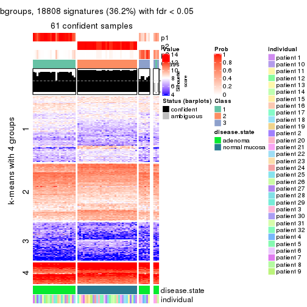</p>

</div>
<div id='tab-CV-mclust-get-signatures-no-scale-3'>
<pre><code class="r">get_signatures(res, k = 4, scale_rows = FALSE)
</code></pre>

<p></p>

</div>
<div id='tab-CV-mclust-get-signatures-no-scale-4'>
<pre><code class="r">get_signatures(res, k = 5, scale_rows = FALSE)
</code></pre>

<p></p>

</div>
<div id='tab-CV-mclust-get-signatures-no-scale-5'>
<pre><code class="r">get_signatures(res, k = 6, scale_rows = FALSE)
</code></pre>

<p></p>

</div>
</div>


Compare the overlap of signatures from different k:

```r
compare_signatures(res)
```


`get_signature()` returns a data frame invisibly. TO get the list of signatures, the function
call should be assigned to a variable explicitly. In following code, if `plot` argument is set
to `FALSE`, no heatmap is plotted while only the differential analysis is performed.

```r
# code only for demonstration
tb = get_signature(res, k = ..., plot = FALSE)
```

An example of the output of `tb` is:

```
#>   which_row         fdr    mean_1    mean_2 scaled_mean_1 scaled_mean_2 km
#> 1        38 0.042760348  8.373488  9.131774    -0.5533452     0.5164555  1
#> 2        40 0.018707592  7.106213  8.469186    -0.6173731     0.5762149  1
#> 3        55 0.019134737 10.221463 11.207825    -0.6159697     0.5749050  1
#> 4        59 0.006059896  5.921854  7.869574    -0.6899429     0.6439467  1
#> 5        60 0.018055526  8.928898 10.211722    -0.6204761     0.5791110  1
#> 6        98 0.009384629 15.714769 14.887706     0.6635654    -0.6193277  2
...
```

The columns in `tb` are:

1. `which_row`: row indices corresponding to the input matrix.
2. `fdr`: FDR for the differential test. 
3. `mean_x`: The mean value in group x.
4. `scaled_mean_x`: The mean value in group x after rows are scaled.
5. `km`: Row groups if k-means clustering is applied to rows.


UMAP plot which shows how samples are separated.


<script>
$( function() {
	$( '#tabs-CV-mclust-dimension-reduction' ).tabs();
} );
</script>
<div id='tabs-CV-mclust-dimension-reduction'>
<ul>
<li><a href='#tab-CV-mclust-dimension-reduction-1'>k = 2</a></li>
<li><a href='#tab-CV-mclust-dimension-reduction-2'>k = 3</a></li>
<li><a href='#tab-CV-mclust-dimension-reduction-3'>k = 4</a></li>
<li><a href='#tab-CV-mclust-dimension-reduction-4'>k = 5</a></li>
<li><a href='#tab-CV-mclust-dimension-reduction-5'>k = 6</a></li>
</ul>
<div id='tab-CV-mclust-dimension-reduction-1'>
<pre><code class="r">dimension_reduction(res, k = 2, method = &quot;UMAP&quot;)
</code></pre>

<p></p>

</div>
<div id='tab-CV-mclust-dimension-reduction-2'>
<pre><code class="r">dimension_reduction(res, k = 3, method = &quot;UMAP&quot;)
</code></pre>

<p></p>

</div>
<div id='tab-CV-mclust-dimension-reduction-3'>
<pre><code class="r">dimension_reduction(res, k = 4, method = &quot;UMAP&quot;)
</code></pre>

<p></p>

</div>
<div id='tab-CV-mclust-dimension-reduction-4'>
<pre><code class="r">dimension_reduction(res, k = 5, method = &quot;UMAP&quot;)
</code></pre>

<p></p>

</div>
<div id='tab-CV-mclust-dimension-reduction-5'>
<pre><code class="r">dimension_reduction(res, k = 6, method = &quot;UMAP&quot;)
</code></pre>

<p>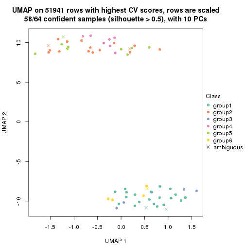</p>

</div>
</div>


Following heatmap shows how subgroups are split when increasing `k`:

```r
collect_classes(res)
```


Test correlation between subgroups and known annotations. If the known
annotation is numeric, one-way ANOVA test is applied, and if the known
annotation is discrete, chi-squared contingency table test is applied.

```r
test_to_known_factors(res)
```

```
#>            n disease.state(p) individual(p) k
#> CV:mclust 64         9.19e-15         1.000 2
#> CV:mclust 61         5.68e-14         0.999 3
#> CV:mclust 58         1.57e-12         0.977 4
#> CV:mclust 46         5.67e-10         0.564 5
#> CV:mclust 58         3.15e-11         0.868 6
```


If matrix rows can be associated to genes, consider to use `functional_enrichment(res,
...)` to perform function enrichment for the signature genes. See [this vignette](http://bioconductor.org/packages/devel/bioc/vignettes/cola/inst/doc/functional_enrichment.html) for more detailed explanations.


 

---------------------------------------------------


### CV:NMF**


The object with results only for a single top-value method and a single partition method 
can be extracted as:

```r
res = res_list["CV", "NMF"]
# you can also extract it by
# res = res_list["CV:NMF"]
```

A summary of `res` and all the functions that can be applied to it:

```r
res
```

```
#> A 'ConsensusPartition' object with k = 2, 3, 4, 5, 6.
#>   On a matrix with 51941 rows and 64 columns.
#>   Top rows (1000, 2000, 3000, 4000, 5000) are extracted by 'CV' method.
#>   Subgroups are detected by 'NMF' method.
#>   Performed in total 1250 partitions by row resampling.
#>   Best k for subgroups seems to be 2.
#> 
#> Following methods can be applied to this 'ConsensusPartition' object:
#>  [1] "cola_report"             "collect_classes"         "collect_plots"          
#>  [4] "collect_stats"           "colnames"                "compare_signatures"     
#>  [7] "consensus_heatmap"       "dimension_reduction"     "functional_enrichment"  
#> [10] "get_anno_col"            "get_anno"                "get_classes"            
#> [13] "get_consensus"           "get_matrix"              "get_membership"         
#> [16] "get_param"               "get_signatures"          "get_stats"              
#> [19] "is_best_k"               "is_stable_k"             "membership_heatmap"     
#> [22] "ncol"                    "nrow"                    "plot_ecdf"              
#> [25] "rownames"                "select_partition_number" "show"                   
#> [28] "suggest_best_k"          "test_to_known_factors"
```

`collect_plots()` function collects all the plots made from `res` for all `k` (number of partitions)
into one single page to provide an easy and fast comparison between different `k`.

```r
collect_plots(res)
```


The plots are:

- The first row: a plot of the ECDF (empirical cumulative distribution
  function) curves of the consensus matrix for each `k` and the heatmap of
  predicted classes for each `k`.
- The second row: heatmaps of the consensus matrix for each `k`.
- The third row: heatmaps of the membership matrix for each `k`.
- The fouth row: heatmaps of the signatures for each `k`.

All the plots in panels can be made by individual functions and they are
plotted later in this section.

`select_partition_number()` produces several plots showing different
statistics for choosing "optimized" `k`. There are following statistics:

- ECDF curves of the consensus matrix for each `k`;
- 1-PAC. [The PAC
  score](https://en.wikipedia.org/wiki/Consensus_clustering#Over-interpretation_potential_of_consensus_clustering)
  measures the proportion of the ambiguous subgrouping.
- Mean silhouette score.
- Concordance. The mean probability of fiting the consensus class ids in all
  partitions.
- Area increased. Denote $A_k$ as the area under the ECDF curve for current
  `k`, the area increased is defined as $A_k - A_{k-1}$.
- Rand index. The percent of pairs of samples that are both in a same cluster
  or both are not in a same cluster in the partition of k and k-1.
- Jaccard index. The ratio of pairs of samples are both in a same cluster in
  the partition of k and k-1 and the pairs of samples are both in a same
  cluster in the partition k or k-1.

The detailed explanations of these statistics can be found in [the _cola_
vignette](http://bioconductor.org/packages/devel/bioc/vignettes/cola/inst/doc/cola.html#toc_13).

Generally speaking, lower PAC score, higher mean silhouette score or higher
concordance corresponds to better partition. Rand index and Jaccard index
measure how similar the current partition is compared to partition with `k-1`.
If they are too similar, we won't accept `k` is better than `k-1`.

```r
select_partition_number(res)
```


The numeric values for all these statistics can be obtained by `get_stats()`.

```r
get_stats(res)
```

```
#>   k 1-PAC mean_silhouette concordance area_increased  Rand Jaccard
#> 2 2 1.000           1.000       1.000         0.5084 0.492   0.492
#> 3 3 0.725           0.791       0.886         0.2041 0.927   0.852
#> 4 4 0.562           0.633       0.791         0.1189 0.932   0.840
#> 5 5 0.520           0.575       0.723         0.0853 0.954   0.876
#> 6 6 0.552           0.426       0.670         0.0482 0.970   0.909
```

`suggest_best_k()` suggests the best $k$ based on these statistics. The rules are as follows:

- All $k$ with Jaccard index larger than 0.95 are removed because increasing
  $k$ does not provide enough extra information. If all $k$ are removed, it is
  marked as no subgroup is detected.
- For all $k$ with 1-PAC score larger than 0.9, the maximal $k$ is taken as
  the best $k$, and other $k$ are marked as optional $k$.
- If it does not fit the second rule. The $k$ with the maximal vote of the
  highest 1-PAC score, highest mean silhouette, and highest concordance is
  taken as the best $k$.

```r
suggest_best_k(res)
```

```
#> [1] 2
```


Following shows the table of the partitions (You need to click the **show/hide
code output** link to see it). The membership matrix (columns with name `p*`)
is inferred by
[`clue::cl_consensus()`](https://www.rdocumentation.org/link/cl_consensus?package=clue)
function with the `SE` method. Basically the value in the membership matrix
represents the probability to belong to a certain group. The finall class
label for an item is determined with the group with highest probability it
belongs to.

In `get_classes()` function, the entropy is calculated from the membership
matrix and the silhouette score is calculated from the consensus matrix.


<script>
$( function() {
	$( '#tabs-CV-NMF-get-classes' ).tabs();
} );
</script>
<div id='tabs-CV-NMF-get-classes'>
<ul>
<li><a href='#tab-CV-NMF-get-classes-1'>k = 2</a></li>
<li><a href='#tab-CV-NMF-get-classes-2'>k = 3</a></li>
<li><a href='#tab-CV-NMF-get-classes-3'>k = 4</a></li>
<li><a href='#tab-CV-NMF-get-classes-4'>k = 5</a></li>
<li><a href='#tab-CV-NMF-get-classes-5'>k = 6</a></li>
</ul>

<div id='tab-CV-NMF-get-classes-1'>
<p><a id='tab-CV-NMF-get-classes-1-a' style='color:#0366d6' href='#'>show/hide code output</a></p>
<pre><code class="r">cbind(get_classes(res, k = 2), get_membership(res, k = 2))
</code></pre>

<pre><code>#&gt;           class entropy silhouette p1 p2
#&gt; GSM215051     2       0          1  0  1
#&gt; GSM215052     2       0          1  0  1
#&gt; GSM215053     2       0          1  0  1
#&gt; GSM215054     2       0          1  0  1
#&gt; GSM215055     2       0          1  0  1
#&gt; GSM215056     2       0          1  0  1
#&gt; GSM215057     2       0          1  0  1
#&gt; GSM215058     2       0          1  0  1
#&gt; GSM215059     2       0          1  0  1
#&gt; GSM215060     2       0          1  0  1
#&gt; GSM215061     2       0          1  0  1
#&gt; GSM215062     2       0          1  0  1
#&gt; GSM215063     2       0          1  0  1
#&gt; GSM215064     2       0          1  0  1
#&gt; GSM215065     2       0          1  0  1
#&gt; GSM215066     2       0          1  0  1
#&gt; GSM215067     2       0          1  0  1
#&gt; GSM215068     2       0          1  0  1
#&gt; GSM215069     2       0          1  0  1
#&gt; GSM215070     2       0          1  0  1
#&gt; GSM215071     2       0          1  0  1
#&gt; GSM215072     2       0          1  0  1
#&gt; GSM215073     2       0          1  0  1
#&gt; GSM215074     2       0          1  0  1
#&gt; GSM215075     2       0          1  0  1
#&gt; GSM215076     2       0          1  0  1
#&gt; GSM215077     2       0          1  0  1
#&gt; GSM215078     2       0          1  0  1
#&gt; GSM215079     2       0          1  0  1
#&gt; GSM215080     2       0          1  0  1
#&gt; GSM215081     2       0          1  0  1
#&gt; GSM215082     2       0          1  0  1
#&gt; GSM215083     1       0          1  1  0
#&gt; GSM215084     1       0          1  1  0
#&gt; GSM215085     1       0          1  1  0
#&gt; GSM215086     1       0          1  1  0
#&gt; GSM215087     1       0          1  1  0
#&gt; GSM215088     1       0          1  1  0
#&gt; GSM215089     1       0          1  1  0
#&gt; GSM215090     1       0          1  1  0
#&gt; GSM215091     1       0          1  1  0
#&gt; GSM215092     1       0          1  1  0
#&gt; GSM215093     1       0          1  1  0
#&gt; GSM215094     1       0          1  1  0
#&gt; GSM215095     1       0          1  1  0
#&gt; GSM215096     1       0          1  1  0
#&gt; GSM215097     1       0          1  1  0
#&gt; GSM215098     1       0          1  1  0
#&gt; GSM215099     1       0          1  1  0
#&gt; GSM215100     1       0          1  1  0
#&gt; GSM215101     1       0          1  1  0
#&gt; GSM215102     1       0          1  1  0
#&gt; GSM215103     1       0          1  1  0
#&gt; GSM215104     1       0          1  1  0
#&gt; GSM215105     1       0          1  1  0
#&gt; GSM215106     1       0          1  1  0
#&gt; GSM215107     1       0          1  1  0
#&gt; GSM215108     1       0          1  1  0
#&gt; GSM215109     1       0          1  1  0
#&gt; GSM215110     1       0          1  1  0
#&gt; GSM215111     1       0          1  1  0
#&gt; GSM215112     1       0          1  1  0
#&gt; GSM215113     1       0          1  1  0
#&gt; GSM215114     1       0          1  1  0
</code></pre>

<script>
$('#tab-CV-NMF-get-classes-1-a').parent().next().next().hide();
$('#tab-CV-NMF-get-classes-1-a').click(function(){
  $('#tab-CV-NMF-get-classes-1-a').parent().next().next().toggle();
  return(false);
});
</script>
</div>

<div id='tab-CV-NMF-get-classes-2'>
<p><a id='tab-CV-NMF-get-classes-2-a' style='color:#0366d6' href='#'>show/hide code output</a></p>
<pre><code class="r">cbind(get_classes(res, k = 3), get_membership(res, k = 3))
</code></pre>

<pre><code>#&gt;           class entropy silhouette    p1    p2    p3
#&gt; GSM215051     2  0.6095      0.461 0.000 0.608 0.392
#&gt; GSM215052     2  0.3619      0.849 0.000 0.864 0.136
#&gt; GSM215053     2  0.4750      0.760 0.000 0.784 0.216
#&gt; GSM215054     2  0.6154      0.445 0.000 0.592 0.408
#&gt; GSM215055     2  0.1860      0.899 0.000 0.948 0.052
#&gt; GSM215056     2  0.4062      0.816 0.000 0.836 0.164
#&gt; GSM215057     2  0.0747      0.911 0.000 0.984 0.016
#&gt; GSM215058     2  0.2711      0.878 0.000 0.912 0.088
#&gt; GSM215059     2  0.0424      0.911 0.000 0.992 0.008
#&gt; GSM215060     2  0.0892      0.909 0.000 0.980 0.020
#&gt; GSM215061     2  0.0424      0.911 0.000 0.992 0.008
#&gt; GSM215062     2  0.1860      0.902 0.000 0.948 0.052
#&gt; GSM215063     3  0.6309     -0.290 0.000 0.496 0.504
#&gt; GSM215064     2  0.2356      0.891 0.000 0.928 0.072
#&gt; GSM215065     2  0.1964      0.897 0.000 0.944 0.056
#&gt; GSM215066     2  0.1411      0.905 0.000 0.964 0.036
#&gt; GSM215067     2  0.5138      0.710 0.000 0.748 0.252
#&gt; GSM215068     2  0.0747      0.910 0.000 0.984 0.016
#&gt; GSM215069     2  0.1411      0.905 0.000 0.964 0.036
#&gt; GSM215070     2  0.3038      0.872 0.000 0.896 0.104
#&gt; GSM215071     2  0.0592      0.911 0.000 0.988 0.012
#&gt; GSM215072     2  0.1964      0.897 0.000 0.944 0.056
#&gt; GSM215073     2  0.0747      0.910 0.000 0.984 0.016
#&gt; GSM215074     2  0.0747      0.909 0.000 0.984 0.016
#&gt; GSM215075     2  0.0424      0.911 0.000 0.992 0.008
#&gt; GSM215076     2  0.5560      0.669 0.000 0.700 0.300
#&gt; GSM215077     2  0.0424      0.911 0.000 0.992 0.008
#&gt; GSM215078     2  0.1031      0.910 0.000 0.976 0.024
#&gt; GSM215079     2  0.1289      0.907 0.000 0.968 0.032
#&gt; GSM215080     2  0.1031      0.908 0.000 0.976 0.024
#&gt; GSM215081     2  0.1964      0.897 0.000 0.944 0.056
#&gt; GSM215082     2  0.0592      0.911 0.000 0.988 0.012
#&gt; GSM215083     1  0.4702      0.745 0.788 0.000 0.212
#&gt; GSM215084     1  0.1289      0.876 0.968 0.000 0.032
#&gt; GSM215085     1  0.5859      0.483 0.656 0.000 0.344
#&gt; GSM215086     3  0.5810      0.530 0.336 0.000 0.664
#&gt; GSM215087     1  0.2261      0.856 0.932 0.000 0.068
#&gt; GSM215088     3  0.5706      0.572 0.320 0.000 0.680
#&gt; GSM215089     1  0.0892      0.877 0.980 0.000 0.020
#&gt; GSM215090     1  0.2066      0.869 0.940 0.000 0.060
#&gt; GSM215091     1  0.1411      0.875 0.964 0.000 0.036
#&gt; GSM215092     1  0.2537      0.856 0.920 0.000 0.080
#&gt; GSM215093     3  0.4351      0.651 0.168 0.004 0.828
#&gt; GSM215094     1  0.1964      0.862 0.944 0.000 0.056
#&gt; GSM215095     1  0.2711      0.828 0.912 0.000 0.088
#&gt; GSM215096     1  0.1643      0.867 0.956 0.000 0.044
#&gt; GSM215097     1  0.2625      0.856 0.916 0.000 0.084
#&gt; GSM215098     1  0.1031      0.874 0.976 0.000 0.024
#&gt; GSM215099     1  0.1643      0.871 0.956 0.000 0.044
#&gt; GSM215100     1  0.1753      0.870 0.952 0.000 0.048
#&gt; GSM215101     1  0.1411      0.876 0.964 0.000 0.036
#&gt; GSM215102     1  0.6008      0.439 0.628 0.000 0.372
#&gt; GSM215103     1  0.5835      0.535 0.660 0.000 0.340
#&gt; GSM215104     1  0.2796      0.855 0.908 0.000 0.092
#&gt; GSM215105     1  0.1411      0.878 0.964 0.000 0.036
#&gt; GSM215106     1  0.1411      0.877 0.964 0.000 0.036
#&gt; GSM215107     1  0.0747      0.873 0.984 0.000 0.016
#&gt; GSM215108     1  0.4750      0.737 0.784 0.000 0.216
#&gt; GSM215109     3  0.4842      0.646 0.224 0.000 0.776
#&gt; GSM215110     1  0.6225      0.180 0.568 0.000 0.432
#&gt; GSM215111     1  0.1753      0.874 0.952 0.000 0.048
#&gt; GSM215112     1  0.2796      0.824 0.908 0.000 0.092
#&gt; GSM215113     1  0.0747      0.874 0.984 0.000 0.016
#&gt; GSM215114     1  0.2448      0.858 0.924 0.000 0.076
</code></pre>

<script>
$('#tab-CV-NMF-get-classes-2-a').parent().next().next().hide();
$('#tab-CV-NMF-get-classes-2-a').click(function(){
  $('#tab-CV-NMF-get-classes-2-a').parent().next().next().toggle();
  return(false);
});
</script>
</div>

<div id='tab-CV-NMF-get-classes-3'>
<p><a id='tab-CV-NMF-get-classes-3-a' style='color:#0366d6' href='#'>show/hide code output</a></p>
<pre><code class="r">cbind(get_classes(res, k = 4), get_membership(res, k = 4))
</code></pre>

<pre><code>#&gt;           class entropy silhouette    p1    p2    p3    p4
#&gt; GSM215051     3   0.585    -0.1162 0.000 0.452 0.516 0.032
#&gt; GSM215052     2   0.644     0.5769 0.000 0.648 0.168 0.184
#&gt; GSM215053     2   0.524     0.4336 0.000 0.628 0.356 0.016
#&gt; GSM215054     2   0.601     0.0458 0.000 0.488 0.472 0.040
#&gt; GSM215055     2   0.215     0.8169 0.000 0.912 0.088 0.000
#&gt; GSM215056     2   0.419     0.6824 0.000 0.752 0.244 0.004
#&gt; GSM215057     2   0.102     0.8332 0.000 0.968 0.032 0.000
#&gt; GSM215058     2   0.450     0.7446 0.000 0.764 0.212 0.024
#&gt; GSM215059     2   0.140     0.8350 0.000 0.956 0.040 0.004
#&gt; GSM215060     2   0.234     0.8199 0.000 0.900 0.100 0.000
#&gt; GSM215061     2   0.149     0.8325 0.000 0.952 0.044 0.004
#&gt; GSM215062     2   0.384     0.7957 0.000 0.836 0.128 0.036
#&gt; GSM215063     3   0.597     0.3353 0.000 0.316 0.624 0.060
#&gt; GSM215064     2   0.388     0.7968 0.000 0.840 0.112 0.048
#&gt; GSM215065     2   0.256     0.8267 0.000 0.908 0.072 0.020
#&gt; GSM215066     2   0.155     0.8347 0.000 0.952 0.040 0.008
#&gt; GSM215067     2   0.540     0.4624 0.000 0.628 0.348 0.024
#&gt; GSM215068     2   0.136     0.8354 0.000 0.960 0.032 0.008
#&gt; GSM215069     2   0.149     0.8345 0.000 0.956 0.032 0.012
#&gt; GSM215070     2   0.612     0.6241 0.000 0.680 0.156 0.164
#&gt; GSM215071     2   0.252     0.8246 0.000 0.912 0.064 0.024
#&gt; GSM215072     2   0.566     0.6824 0.000 0.720 0.156 0.124
#&gt; GSM215073     2   0.181     0.8324 0.000 0.940 0.052 0.008
#&gt; GSM215074     2   0.130     0.8329 0.000 0.956 0.044 0.000
#&gt; GSM215075     2   0.131     0.8364 0.000 0.960 0.036 0.004
#&gt; GSM215076     2   0.750     0.2777 0.000 0.500 0.252 0.248
#&gt; GSM215077     2   0.297     0.8222 0.000 0.892 0.072 0.036
#&gt; GSM215078     2   0.198     0.8331 0.000 0.936 0.048 0.016
#&gt; GSM215079     2   0.194     0.8350 0.000 0.936 0.052 0.012
#&gt; GSM215080     2   0.185     0.8342 0.000 0.940 0.048 0.012
#&gt; GSM215081     2   0.233     0.8242 0.000 0.916 0.072 0.012
#&gt; GSM215082     2   0.281     0.8184 0.000 0.896 0.080 0.024
#&gt; GSM215083     1   0.667     0.2940 0.620 0.000 0.212 0.168
#&gt; GSM215084     1   0.385     0.6574 0.800 0.000 0.008 0.192
#&gt; GSM215085     1   0.784    -0.3542 0.396 0.000 0.336 0.268
#&gt; GSM215086     3   0.696    -0.0230 0.148 0.000 0.564 0.288
#&gt; GSM215087     1   0.234     0.7743 0.912 0.000 0.008 0.080
#&gt; GSM215088     3   0.712    -0.0787 0.140 0.000 0.508 0.352
#&gt; GSM215089     1   0.304     0.7878 0.880 0.000 0.020 0.100
#&gt; GSM215090     1   0.456     0.7272 0.792 0.000 0.056 0.152
#&gt; GSM215091     1   0.306     0.7907 0.888 0.000 0.040 0.072
#&gt; GSM215092     1   0.458     0.7018 0.788 0.000 0.052 0.160
#&gt; GSM215093     3   0.601     0.1128 0.052 0.000 0.588 0.360
#&gt; GSM215094     1   0.233     0.7641 0.908 0.000 0.004 0.088
#&gt; GSM215095     1   0.247     0.7604 0.908 0.000 0.012 0.080
#&gt; GSM215096     1   0.189     0.7769 0.936 0.000 0.008 0.056
#&gt; GSM215097     1   0.461     0.7094 0.788 0.000 0.056 0.156
#&gt; GSM215098     1   0.234     0.7880 0.912 0.000 0.008 0.080
#&gt; GSM215099     1   0.340     0.7746 0.868 0.000 0.040 0.092
#&gt; GSM215100     1   0.441     0.7395 0.808 0.000 0.064 0.128
#&gt; GSM215101     1   0.415     0.7514 0.824 0.000 0.056 0.120
#&gt; GSM215102     4   0.570     0.6168 0.292 0.000 0.052 0.656
#&gt; GSM215103     4   0.681     0.6068 0.344 0.000 0.112 0.544
#&gt; GSM215104     1   0.472     0.3441 0.672 0.000 0.004 0.324
#&gt; GSM215105     1   0.284     0.7890 0.896 0.000 0.028 0.076
#&gt; GSM215106     1   0.297     0.7877 0.892 0.000 0.036 0.072
#&gt; GSM215107     1   0.168     0.7894 0.948 0.000 0.012 0.040
#&gt; GSM215108     4   0.582     0.4259 0.432 0.000 0.032 0.536
#&gt; GSM215109     4   0.582     0.2032 0.084 0.000 0.232 0.684
#&gt; GSM215110     4   0.748     0.4677 0.332 0.000 0.192 0.476
#&gt; GSM215111     1   0.301     0.7847 0.888 0.000 0.032 0.080
#&gt; GSM215112     1   0.280     0.7494 0.892 0.000 0.016 0.092
#&gt; GSM215113     1   0.198     0.7931 0.928 0.000 0.004 0.068
#&gt; GSM215114     1   0.414     0.6219 0.780 0.000 0.012 0.208
</code></pre>

<script>
$('#tab-CV-NMF-get-classes-3-a').parent().next().next().hide();
$('#tab-CV-NMF-get-classes-3-a').click(function(){
  $('#tab-CV-NMF-get-classes-3-a').parent().next().next().toggle();
  return(false);
});
</script>
</div>

<div id='tab-CV-NMF-get-classes-4'>
<p><a id='tab-CV-NMF-get-classes-4-a' style='color:#0366d6' href='#'>show/hide code output</a></p>
<pre><code class="r">cbind(get_classes(res, k = 5), get_membership(res, k = 5))
</code></pre>

<pre><code>#&gt;           class entropy silhouette    p1    p2    p3    p4    p5
#&gt; GSM215051     4   0.621     0.4817 0.000 0.272 0.076 0.604 0.048
#&gt; GSM215052     2   0.728     0.4741 0.000 0.548 0.156 0.192 0.104
#&gt; GSM215053     2   0.673    -0.1452 0.000 0.484 0.032 0.364 0.120
#&gt; GSM215054     4   0.658     0.4315 0.000 0.288 0.028 0.548 0.136
#&gt; GSM215055     2   0.381     0.6833 0.000 0.792 0.000 0.168 0.040
#&gt; GSM215056     2   0.478     0.2727 0.000 0.584 0.004 0.396 0.016
#&gt; GSM215057     2   0.236     0.7497 0.000 0.900 0.000 0.076 0.024
#&gt; GSM215058     2   0.591     0.5492 0.000 0.600 0.028 0.304 0.068
#&gt; GSM215059     2   0.301     0.7411 0.000 0.864 0.004 0.104 0.028
#&gt; GSM215060     2   0.392     0.6565 0.000 0.784 0.004 0.180 0.032
#&gt; GSM215061     2   0.185     0.7504 0.000 0.936 0.008 0.036 0.020
#&gt; GSM215062     2   0.567     0.6509 0.000 0.688 0.032 0.168 0.112
#&gt; GSM215063     4   0.448     0.4413 0.000 0.176 0.032 0.764 0.028
#&gt; GSM215064     2   0.515     0.6822 0.000 0.728 0.020 0.144 0.108
#&gt; GSM215065     2   0.195     0.7508 0.004 0.932 0.004 0.044 0.016
#&gt; GSM215066     2   0.260     0.7488 0.000 0.896 0.004 0.060 0.040
#&gt; GSM215067     4   0.528     0.3225 0.000 0.372 0.020 0.584 0.024
#&gt; GSM215068     2   0.152     0.7560 0.000 0.944 0.000 0.044 0.012
#&gt; GSM215069     2   0.171     0.7512 0.000 0.940 0.004 0.040 0.016
#&gt; GSM215070     2   0.701     0.4944 0.000 0.576 0.188 0.148 0.088
#&gt; GSM215071     2   0.424     0.7324 0.000 0.812 0.052 0.088 0.048
#&gt; GSM215072     2   0.715     0.5047 0.000 0.572 0.160 0.144 0.124
#&gt; GSM215073     2   0.220     0.7422 0.000 0.916 0.004 0.056 0.024
#&gt; GSM215074     2   0.271     0.7296 0.000 0.860 0.000 0.132 0.008
#&gt; GSM215075     2   0.301     0.7492 0.000 0.868 0.004 0.092 0.036
#&gt; GSM215076     2   0.831    -0.0296 0.000 0.328 0.296 0.244 0.132
#&gt; GSM215077     2   0.439     0.7255 0.000 0.804 0.048 0.080 0.068
#&gt; GSM215078     2   0.323     0.7512 0.000 0.868 0.020 0.072 0.040
#&gt; GSM215079     2   0.204     0.7589 0.000 0.920 0.000 0.056 0.024
#&gt; GSM215080     2   0.296     0.7546 0.000 0.876 0.008 0.080 0.036
#&gt; GSM215081     2   0.357     0.7299 0.000 0.836 0.004 0.092 0.068
#&gt; GSM215082     2   0.500     0.6877 0.000 0.748 0.032 0.140 0.080
#&gt; GSM215083     1   0.694     0.2763 0.560 0.000 0.064 0.140 0.236
#&gt; GSM215084     1   0.525     0.4749 0.632 0.000 0.292 0.000 0.076
#&gt; GSM215085     5   0.835     0.3511 0.268 0.000 0.136 0.272 0.324
#&gt; GSM215086     5   0.700     0.3829 0.044 0.004 0.120 0.332 0.500
#&gt; GSM215087     1   0.288     0.7594 0.868 0.000 0.032 0.000 0.100
#&gt; GSM215088     4   0.757    -0.3486 0.056 0.000 0.240 0.436 0.268
#&gt; GSM215089     1   0.501     0.7108 0.724 0.000 0.088 0.012 0.176
#&gt; GSM215090     1   0.588     0.6024 0.644 0.000 0.140 0.016 0.200
#&gt; GSM215091     1   0.311     0.7569 0.856 0.004 0.012 0.008 0.120
#&gt; GSM215092     1   0.571     0.6368 0.676 0.000 0.176 0.024 0.124
#&gt; GSM215093     4   0.598    -0.1137 0.012 0.000 0.180 0.628 0.180
#&gt; GSM215094     1   0.371     0.7299 0.824 0.000 0.108 0.004 0.064
#&gt; GSM215095     1   0.231     0.7581 0.912 0.000 0.016 0.012 0.060
#&gt; GSM215096     1   0.268     0.7521 0.884 0.000 0.036 0.000 0.080
#&gt; GSM215097     1   0.555     0.6408 0.648 0.000 0.076 0.016 0.260
#&gt; GSM215098     1   0.226     0.7601 0.908 0.000 0.028 0.000 0.064
#&gt; GSM215099     1   0.411     0.7514 0.776 0.000 0.060 0.000 0.164
#&gt; GSM215100     1   0.490     0.7018 0.696 0.000 0.052 0.008 0.244
#&gt; GSM215101     1   0.547     0.6968 0.696 0.004 0.096 0.016 0.188
#&gt; GSM215102     3   0.492     0.5570 0.164 0.000 0.744 0.028 0.064
#&gt; GSM215103     3   0.657     0.4716 0.220 0.000 0.608 0.092 0.080
#&gt; GSM215104     1   0.586     0.1773 0.500 0.000 0.400 0.000 0.100
#&gt; GSM215105     1   0.454     0.7165 0.740 0.000 0.048 0.008 0.204
#&gt; GSM215106     1   0.407     0.7380 0.792 0.000 0.048 0.008 0.152
#&gt; GSM215107     1   0.277     0.7653 0.876 0.000 0.032 0.000 0.092
#&gt; GSM215108     3   0.599     0.4511 0.172 0.000 0.656 0.032 0.140
#&gt; GSM215109     3   0.407     0.3931 0.004 0.000 0.800 0.100 0.096
#&gt; GSM215110     3   0.742     0.3050 0.192 0.000 0.500 0.072 0.236
#&gt; GSM215111     1   0.385     0.7453 0.796 0.000 0.036 0.004 0.164
#&gt; GSM215112     1   0.248     0.7499 0.904 0.000 0.028 0.008 0.060
#&gt; GSM215113     1   0.291     0.7651 0.860 0.000 0.024 0.000 0.116
#&gt; GSM215114     1   0.501     0.5938 0.684 0.000 0.232 0.000 0.084
</code></pre>

<script>
$('#tab-CV-NMF-get-classes-4-a').parent().next().next().hide();
$('#tab-CV-NMF-get-classes-4-a').click(function(){
  $('#tab-CV-NMF-get-classes-4-a').parent().next().next().toggle();
  return(false);
});
</script>
</div>

<div id='tab-CV-NMF-get-classes-5'>
<p><a id='tab-CV-NMF-get-classes-5-a' style='color:#0366d6' href='#'>show/hide code output</a></p>
<pre><code class="r">cbind(get_classes(res, k = 6), get_membership(res, k = 6))
</code></pre>

<pre><code>#&gt;           class entropy silhouette    p1    p2    p3    p4    p5    p6
#&gt; GSM215051     3   0.649     0.2631 0.000 0.168 0.552 0.028 0.028 0.224
#&gt; GSM215052     2   0.632    -0.2320 0.000 0.468 0.044 0.004 0.116 0.368
#&gt; GSM215053     2   0.710    -0.1482 0.000 0.392 0.320 0.072 0.004 0.212
#&gt; GSM215054     3   0.682     0.2271 0.000 0.176 0.520 0.044 0.028 0.232
#&gt; GSM215055     2   0.517     0.4981 0.000 0.680 0.160 0.020 0.004 0.136
#&gt; GSM215056     2   0.572     0.1962 0.000 0.516 0.352 0.004 0.008 0.120
#&gt; GSM215057     2   0.346     0.6458 0.000 0.808 0.084 0.000 0.000 0.108
#&gt; GSM215058     2   0.564     0.2285 0.000 0.560 0.160 0.000 0.008 0.272
#&gt; GSM215059     2   0.292     0.6558 0.000 0.848 0.052 0.000 0.000 0.100
#&gt; GSM215060     2   0.437     0.5717 0.000 0.740 0.136 0.008 0.000 0.116
#&gt; GSM215061     2   0.114     0.6702 0.000 0.948 0.000 0.000 0.000 0.052
#&gt; GSM215062     2   0.514     0.2558 0.004 0.584 0.016 0.004 0.040 0.352
#&gt; GSM215063     3   0.372     0.3112 0.000 0.080 0.812 0.004 0.012 0.092
#&gt; GSM215064     2   0.433     0.4563 0.008 0.676 0.012 0.004 0.008 0.292
#&gt; GSM215065     2   0.167     0.6715 0.000 0.928 0.008 0.004 0.000 0.060
#&gt; GSM215066     2   0.195     0.6679 0.000 0.908 0.000 0.016 0.000 0.076
#&gt; GSM215067     3   0.568     0.1369 0.000 0.268 0.560 0.004 0.004 0.164
#&gt; GSM215068     2   0.184     0.6716 0.000 0.912 0.004 0.004 0.000 0.080
#&gt; GSM215069     2   0.105     0.6731 0.000 0.964 0.012 0.004 0.000 0.020
#&gt; GSM215070     2   0.612     0.0874 0.000 0.552 0.036 0.000 0.184 0.228
#&gt; GSM215071     2   0.368     0.6004 0.000 0.800 0.008 0.000 0.068 0.124
#&gt; GSM215072     2   0.578    -0.0616 0.000 0.512 0.012 0.004 0.116 0.356
#&gt; GSM215073     2   0.239     0.6595 0.000 0.892 0.020 0.012 0.000 0.076
#&gt; GSM215074     2   0.388     0.6105 0.000 0.780 0.120 0.000 0.004 0.096
#&gt; GSM215075     2   0.405     0.6075 0.000 0.776 0.036 0.020 0.008 0.160
#&gt; GSM215076     6   0.737     0.0000 0.000 0.256 0.072 0.020 0.232 0.420
#&gt; GSM215077     2   0.333     0.6216 0.000 0.820 0.008 0.000 0.040 0.132
#&gt; GSM215078     2   0.280     0.6577 0.000 0.868 0.012 0.004 0.020 0.096
#&gt; GSM215079     2   0.283     0.6688 0.000 0.856 0.024 0.008 0.000 0.112
#&gt; GSM215080     2   0.226     0.6576 0.000 0.884 0.004 0.008 0.000 0.104
#&gt; GSM215081     2   0.307     0.6031 0.000 0.788 0.008 0.000 0.000 0.204
#&gt; GSM215082     2   0.394     0.5325 0.000 0.724 0.008 0.000 0.024 0.244
#&gt; GSM215083     1   0.703     0.1310 0.444 0.000 0.276 0.220 0.028 0.032
#&gt; GSM215084     1   0.613     0.3220 0.516 0.000 0.004 0.124 0.324 0.032
#&gt; GSM215085     3   0.810    -0.4443 0.236 0.000 0.316 0.296 0.056 0.096
#&gt; GSM215086     4   0.757     0.0000 0.040 0.000 0.336 0.388 0.084 0.152
#&gt; GSM215087     1   0.333     0.6787 0.832 0.004 0.000 0.120 0.016 0.028
#&gt; GSM215088     3   0.670    -0.2710 0.032 0.000 0.552 0.200 0.172 0.044
#&gt; GSM215089     1   0.573     0.5541 0.540 0.000 0.008 0.336 0.104 0.012
#&gt; GSM215090     1   0.671     0.4200 0.516 0.000 0.032 0.264 0.156 0.032
#&gt; GSM215091     1   0.408     0.6816 0.772 0.000 0.028 0.168 0.020 0.012
#&gt; GSM215092     1   0.704     0.3948 0.492 0.000 0.032 0.240 0.188 0.048
#&gt; GSM215093     3   0.442     0.0659 0.008 0.000 0.780 0.076 0.080 0.056
#&gt; GSM215094     1   0.449     0.6103 0.752 0.000 0.004 0.116 0.108 0.020
#&gt; GSM215095     1   0.230     0.6704 0.904 0.000 0.000 0.052 0.020 0.024
#&gt; GSM215096     1   0.271     0.6672 0.880 0.000 0.004 0.068 0.040 0.008
#&gt; GSM215097     1   0.568     0.5557 0.528 0.000 0.036 0.376 0.052 0.008
#&gt; GSM215098     1   0.309     0.6788 0.844 0.000 0.004 0.116 0.008 0.028
#&gt; GSM215099     1   0.512     0.6461 0.656 0.000 0.008 0.248 0.072 0.016
#&gt; GSM215100     1   0.565     0.6009 0.568 0.000 0.012 0.328 0.068 0.024
#&gt; GSM215101     1   0.673     0.4988 0.512 0.000 0.020 0.292 0.104 0.072
#&gt; GSM215102     5   0.425     0.4503 0.088 0.000 0.020 0.096 0.784 0.012
#&gt; GSM215103     5   0.727     0.3421 0.200 0.000 0.100 0.092 0.532 0.076
#&gt; GSM215104     5   0.651     0.1075 0.376 0.000 0.008 0.120 0.448 0.048
#&gt; GSM215105     1   0.509     0.6318 0.660 0.000 0.008 0.252 0.056 0.024
#&gt; GSM215106     1   0.440     0.6747 0.756 0.000 0.024 0.168 0.032 0.020
#&gt; GSM215107     1   0.489     0.6502 0.720 0.000 0.012 0.176 0.056 0.036
#&gt; GSM215108     5   0.645     0.3398 0.116 0.000 0.020 0.136 0.608 0.120
#&gt; GSM215109     5   0.536     0.2588 0.000 0.000 0.080 0.092 0.684 0.144
#&gt; GSM215110     5   0.744     0.1732 0.064 0.000 0.104 0.316 0.440 0.076
#&gt; GSM215111     1   0.430     0.6754 0.732 0.000 0.020 0.216 0.016 0.016
#&gt; GSM215112     1   0.295     0.6621 0.868 0.000 0.004 0.076 0.032 0.020
#&gt; GSM215113     1   0.424     0.6778 0.748 0.000 0.004 0.188 0.040 0.020
#&gt; GSM215114     1   0.536     0.4817 0.640 0.000 0.008 0.072 0.252 0.028
</code></pre>

<script>
$('#tab-CV-NMF-get-classes-5-a').parent().next().next().hide();
$('#tab-CV-NMF-get-classes-5-a').click(function(){
  $('#tab-CV-NMF-get-classes-5-a').parent().next().next().toggle();
  return(false);
});
</script>
</div>
</div>

Heatmaps for the consensus matrix. It visualizes the probability of two
samples to be in a same group.


<script>
$( function() {
	$( '#tabs-CV-NMF-consensus-heatmap' ).tabs();
} );
</script>
<div id='tabs-CV-NMF-consensus-heatmap'>
<ul>
<li><a href='#tab-CV-NMF-consensus-heatmap-1'>k = 2</a></li>
<li><a href='#tab-CV-NMF-consensus-heatmap-2'>k = 3</a></li>
<li><a href='#tab-CV-NMF-consensus-heatmap-3'>k = 4</a></li>
<li><a href='#tab-CV-NMF-consensus-heatmap-4'>k = 5</a></li>
<li><a href='#tab-CV-NMF-consensus-heatmap-5'>k = 6</a></li>
</ul>
<div id='tab-CV-NMF-consensus-heatmap-1'>
<pre><code class="r">consensus_heatmap(res, k = 2)
</code></pre>

<p></p>

</div>
<div id='tab-CV-NMF-consensus-heatmap-2'>
<pre><code class="r">consensus_heatmap(res, k = 3)
</code></pre>

<p></p>

</div>
<div id='tab-CV-NMF-consensus-heatmap-3'>
<pre><code class="r">consensus_heatmap(res, k = 4)
</code></pre>

<p></p>

</div>
<div id='tab-CV-NMF-consensus-heatmap-4'>
<pre><code class="r">consensus_heatmap(res, k = 5)
</code></pre>

<p></p>

</div>
<div id='tab-CV-NMF-consensus-heatmap-5'>
<pre><code class="r">consensus_heatmap(res, k = 6)
</code></pre>

<p></p>

</div>
</div>

Heatmaps for the membership of samples in all partitions to see how consistent they are:


<script>
$( function() {
	$( '#tabs-CV-NMF-membership-heatmap' ).tabs();
} );
</script>
<div id='tabs-CV-NMF-membership-heatmap'>
<ul>
<li><a href='#tab-CV-NMF-membership-heatmap-1'>k = 2</a></li>
<li><a href='#tab-CV-NMF-membership-heatmap-2'>k = 3</a></li>
<li><a href='#tab-CV-NMF-membership-heatmap-3'>k = 4</a></li>
<li><a href='#tab-CV-NMF-membership-heatmap-4'>k = 5</a></li>
<li><a href='#tab-CV-NMF-membership-heatmap-5'>k = 6</a></li>
</ul>
<div id='tab-CV-NMF-membership-heatmap-1'>
<pre><code class="r">membership_heatmap(res, k = 2)
</code></pre>

<p></p>

</div>
<div id='tab-CV-NMF-membership-heatmap-2'>
<pre><code class="r">membership_heatmap(res, k = 3)
</code></pre>

<p></p>

</div>
<div id='tab-CV-NMF-membership-heatmap-3'>
<pre><code class="r">membership_heatmap(res, k = 4)
</code></pre>

<p></p>

</div>
<div id='tab-CV-NMF-membership-heatmap-4'>
<pre><code class="r">membership_heatmap(res, k = 5)
</code></pre>

<p></p>

</div>
<div id='tab-CV-NMF-membership-heatmap-5'>
<pre><code class="r">membership_heatmap(res, k = 6)
</code></pre>

<p></p>

</div>
</div>

As soon as we have had the classes for columns, we can look for signatures
which are significantly different between classes which can be candidate marks
for certain classes. Following are the heatmaps for signatures.


Signature heatmaps where rows are scaled:


<script>
$( function() {
	$( '#tabs-CV-NMF-get-signatures' ).tabs();
} );
</script>
<div id='tabs-CV-NMF-get-signatures'>
<ul>
<li><a href='#tab-CV-NMF-get-signatures-1'>k = 2</a></li>
<li><a href='#tab-CV-NMF-get-signatures-2'>k = 3</a></li>
<li><a href='#tab-CV-NMF-get-signatures-3'>k = 4</a></li>
<li><a href='#tab-CV-NMF-get-signatures-4'>k = 5</a></li>
<li><a href='#tab-CV-NMF-get-signatures-5'>k = 6</a></li>
</ul>
<div id='tab-CV-NMF-get-signatures-1'>
<pre><code class="r">get_signatures(res, k = 2)
</code></pre>

<p></p>

</div>
<div id='tab-CV-NMF-get-signatures-2'>
<pre><code class="r">get_signatures(res, k = 3)
</code></pre>

<p></p>

</div>
<div id='tab-CV-NMF-get-signatures-3'>
<pre><code class="r">get_signatures(res, k = 4)
</code></pre>

<p></p>

</div>
<div id='tab-CV-NMF-get-signatures-4'>
<pre><code class="r">get_signatures(res, k = 5)
</code></pre>

<p></p>

</div>
<div id='tab-CV-NMF-get-signatures-5'>
<pre><code class="r">get_signatures(res, k = 6)
</code></pre>

<p></p>

</div>
</div>


Signature heatmaps where rows are not scaled:


<script>
$( function() {
	$( '#tabs-CV-NMF-get-signatures-no-scale' ).tabs();
} );
</script>
<div id='tabs-CV-NMF-get-signatures-no-scale'>
<ul>
<li><a href='#tab-CV-NMF-get-signatures-no-scale-1'>k = 2</a></li>
<li><a href='#tab-CV-NMF-get-signatures-no-scale-2'>k = 3</a></li>
<li><a href='#tab-CV-NMF-get-signatures-no-scale-3'>k = 4</a></li>
<li><a href='#tab-CV-NMF-get-signatures-no-scale-4'>k = 5</a></li>
<li><a href='#tab-CV-NMF-get-signatures-no-scale-5'>k = 6</a></li>
</ul>
<div id='tab-CV-NMF-get-signatures-no-scale-1'>
<pre><code class="r">get_signatures(res, k = 2, scale_rows = FALSE)
</code></pre>

<p></p>

</div>
<div id='tab-CV-NMF-get-signatures-no-scale-2'>
<pre><code class="r">get_signatures(res, k = 3, scale_rows = FALSE)
</code></pre>

<p></p>

</div>
<div id='tab-CV-NMF-get-signatures-no-scale-3'>
<pre><code class="r">get_signatures(res, k = 4, scale_rows = FALSE)
</code></pre>

<p></p>

</div>
<div id='tab-CV-NMF-get-signatures-no-scale-4'>
<pre><code class="r">get_signatures(res, k = 5, scale_rows = FALSE)
</code></pre>

<p></p>

</div>
<div id='tab-CV-NMF-get-signatures-no-scale-5'>
<pre><code class="r">get_signatures(res, k = 6, scale_rows = FALSE)
</code></pre>

<p></p>

</div>
</div>


Compare the overlap of signatures from different k:

```r
compare_signatures(res)
```


`get_signature()` returns a data frame invisibly. TO get the list of signatures, the function
call should be assigned to a variable explicitly. In following code, if `plot` argument is set
to `FALSE`, no heatmap is plotted while only the differential analysis is performed.

```r
# code only for demonstration
tb = get_signature(res, k = ..., plot = FALSE)
```

An example of the output of `tb` is:

```
#>   which_row         fdr    mean_1    mean_2 scaled_mean_1 scaled_mean_2 km
#> 1        38 0.042760348  8.373488  9.131774    -0.5533452     0.5164555  1
#> 2        40 0.018707592  7.106213  8.469186    -0.6173731     0.5762149  1
#> 3        55 0.019134737 10.221463 11.207825    -0.6159697     0.5749050  1
#> 4        59 0.006059896  5.921854  7.869574    -0.6899429     0.6439467  1
#> 5        60 0.018055526  8.928898 10.211722    -0.6204761     0.5791110  1
#> 6        98 0.009384629 15.714769 14.887706     0.6635654    -0.6193277  2
...
```

The columns in `tb` are:

1. `which_row`: row indices corresponding to the input matrix.
2. `fdr`: FDR for the differential test. 
3. `mean_x`: The mean value in group x.
4. `scaled_mean_x`: The mean value in group x after rows are scaled.
5. `km`: Row groups if k-means clustering is applied to rows.


UMAP plot which shows how samples are separated.


<script>
$( function() {
	$( '#tabs-CV-NMF-dimension-reduction' ).tabs();
} );
</script>
<div id='tabs-CV-NMF-dimension-reduction'>
<ul>
<li><a href='#tab-CV-NMF-dimension-reduction-1'>k = 2</a></li>
<li><a href='#tab-CV-NMF-dimension-reduction-2'>k = 3</a></li>
<li><a href='#tab-CV-NMF-dimension-reduction-3'>k = 4</a></li>
<li><a href='#tab-CV-NMF-dimension-reduction-4'>k = 5</a></li>
<li><a href='#tab-CV-NMF-dimension-reduction-5'>k = 6</a></li>
</ul>
<div id='tab-CV-NMF-dimension-reduction-1'>
<pre><code class="r">dimension_reduction(res, k = 2, method = &quot;UMAP&quot;)
</code></pre>

<p></p>

</div>
<div id='tab-CV-NMF-dimension-reduction-2'>
<pre><code class="r">dimension_reduction(res, k = 3, method = &quot;UMAP&quot;)
</code></pre>

<p></p>

</div>
<div id='tab-CV-NMF-dimension-reduction-3'>
<pre><code class="r">dimension_reduction(res, k = 4, method = &quot;UMAP&quot;)
</code></pre>

<p></p>

</div>
<div id='tab-CV-NMF-dimension-reduction-4'>
<pre><code class="r">dimension_reduction(res, k = 5, method = &quot;UMAP&quot;)
</code></pre>

<p></p>

</div>
<div id='tab-CV-NMF-dimension-reduction-5'>
<pre><code class="r">dimension_reduction(res, k = 6, method = &quot;UMAP&quot;)
</code></pre>

<p></p>

</div>
</div>


Following heatmap shows how subgroups are split when increasing `k`:

```r
collect_classes(res)
```


Test correlation between subgroups and known annotations. If the known
annotation is numeric, one-way ANOVA test is applied, and if the known
annotation is discrete, chi-squared contingency table test is applied.

```r
test_to_known_factors(res)
```

```
#>         n disease.state(p) individual(p) k
#> CV:NMF 64         9.19e-15         1.000 2
#> CV:NMF 58         2.54e-13         0.979 3
#> CV:NMF 49         2.29e-11         0.994 4
#> CV:NMF 44         2.79e-10         0.435 5
#> CV:NMF 34         4.09e-08         0.959 6
```


If matrix rows can be associated to genes, consider to use `functional_enrichment(res,
...)` to perform function enrichment for the signature genes. See [this vignette](http://bioconductor.org/packages/devel/bioc/vignettes/cola/inst/doc/functional_enrichment.html) for more detailed explanations.


 

---------------------------------------------------


### MAD:hclust**


The object with results only for a single top-value method and a single partition method 
can be extracted as:

```r
res = res_list["MAD", "hclust"]
# you can also extract it by
# res = res_list["MAD:hclust"]
```

A summary of `res` and all the functions that can be applied to it:

```r
res
```

```
#> A 'ConsensusPartition' object with k = 2, 3, 4, 5, 6.
#>   On a matrix with 51941 rows and 64 columns.
#>   Top rows (1000, 2000, 3000, 4000, 5000) are extracted by 'MAD' method.
#>   Subgroups are detected by 'hclust' method.
#>   Performed in total 1250 partitions by row resampling.
#>   Best k for subgroups seems to be 2.
#> 
#> Following methods can be applied to this 'ConsensusPartition' object:
#>  [1] "cola_report"             "collect_classes"         "collect_plots"          
#>  [4] "collect_stats"           "colnames"                "compare_signatures"     
#>  [7] "consensus_heatmap"       "dimension_reduction"     "functional_enrichment"  
#> [10] "get_anno_col"            "get_anno"                "get_classes"            
#> [13] "get_consensus"           "get_matrix"              "get_membership"         
#> [16] "get_param"               "get_signatures"          "get_stats"              
#> [19] "is_best_k"               "is_stable_k"             "membership_heatmap"     
#> [22] "ncol"                    "nrow"                    "plot_ecdf"              
#> [25] "rownames"                "select_partition_number" "show"                   
#> [28] "suggest_best_k"          "test_to_known_factors"
```

`collect_plots()` function collects all the plots made from `res` for all `k` (number of partitions)
into one single page to provide an easy and fast comparison between different `k`.

```r
collect_plots(res)
```


The plots are:

- The first row: a plot of the ECDF (empirical cumulative distribution
  function) curves of the consensus matrix for each `k` and the heatmap of
  predicted classes for each `k`.
- The second row: heatmaps of the consensus matrix for each `k`.
- The third row: heatmaps of the membership matrix for each `k`.
- The fouth row: heatmaps of the signatures for each `k`.

All the plots in panels can be made by individual functions and they are
plotted later in this section.

`select_partition_number()` produces several plots showing different
statistics for choosing "optimized" `k`. There are following statistics:

- ECDF curves of the consensus matrix for each `k`;
- 1-PAC. [The PAC
  score](https://en.wikipedia.org/wiki/Consensus_clustering#Over-interpretation_potential_of_consensus_clustering)
  measures the proportion of the ambiguous subgrouping.
- Mean silhouette score.
- Concordance. The mean probability of fiting the consensus class ids in all
  partitions.
- Area increased. Denote $A_k$ as the area under the ECDF curve for current
  `k`, the area increased is defined as $A_k - A_{k-1}$.
- Rand index. The percent of pairs of samples that are both in a same cluster
  or both are not in a same cluster in the partition of k and k-1.
- Jaccard index. The ratio of pairs of samples are both in a same cluster in
  the partition of k and k-1 and the pairs of samples are both in a same
  cluster in the partition k or k-1.

The detailed explanations of these statistics can be found in [the _cola_
vignette](http://bioconductor.org/packages/devel/bioc/vignettes/cola/inst/doc/cola.html#toc_13).

Generally speaking, lower PAC score, higher mean silhouette score or higher
concordance corresponds to better partition. Rand index and Jaccard index
measure how similar the current partition is compared to partition with `k-1`.
If they are too similar, we won't accept `k` is better than `k-1`.

```r
select_partition_number(res)
```


The numeric values for all these statistics can be obtained by `get_stats()`.

```r
get_stats(res)
```

```
#>   k 1-PAC mean_silhouette concordance area_increased  Rand Jaccard
#> 2 2 1.000           0.998       0.999         0.5084 0.492   0.492
#> 3 3 0.899           0.928       0.949         0.1401 0.933   0.864
#> 4 4 0.918           0.917       0.927         0.0314 1.000   1.000
#> 5 5 0.867           0.836       0.918         0.0331 0.984   0.963
#> 6 6 0.809           0.820       0.897         0.0298 1.000   0.999
```

`suggest_best_k()` suggests the best $k$ based on these statistics. The rules are as follows:

- All $k$ with Jaccard index larger than 0.95 are removed because increasing
  $k$ does not provide enough extra information. If all $k$ are removed, it is
  marked as no subgroup is detected.
- For all $k$ with 1-PAC score larger than 0.9, the maximal $k$ is taken as
  the best $k$, and other $k$ are marked as optional $k$.
- If it does not fit the second rule. The $k$ with the maximal vote of the
  highest 1-PAC score, highest mean silhouette, and highest concordance is
  taken as the best $k$.

```r
suggest_best_k(res)
```

```
#> [1] 2
```


Following shows the table of the partitions (You need to click the **show/hide
code output** link to see it). The membership matrix (columns with name `p*`)
is inferred by
[`clue::cl_consensus()`](https://www.rdocumentation.org/link/cl_consensus?package=clue)
function with the `SE` method. Basically the value in the membership matrix
represents the probability to belong to a certain group. The finall class
label for an item is determined with the group with highest probability it
belongs to.

In `get_classes()` function, the entropy is calculated from the membership
matrix and the silhouette score is calculated from the consensus matrix.


<script>
$( function() {
	$( '#tabs-MAD-hclust-get-classes' ).tabs();
} );
</script>
<div id='tabs-MAD-hclust-get-classes'>
<ul>
<li><a href='#tab-MAD-hclust-get-classes-1'>k = 2</a></li>
<li><a href='#tab-MAD-hclust-get-classes-2'>k = 3</a></li>
<li><a href='#tab-MAD-hclust-get-classes-3'>k = 4</a></li>
<li><a href='#tab-MAD-hclust-get-classes-4'>k = 5</a></li>
<li><a href='#tab-MAD-hclust-get-classes-5'>k = 6</a></li>
</ul>

<div id='tab-MAD-hclust-get-classes-1'>
<p><a id='tab-MAD-hclust-get-classes-1-a' style='color:#0366d6' href='#'>show/hide code output</a></p>
<pre><code class="r">cbind(get_classes(res, k = 2), get_membership(res, k = 2))
</code></pre>

<pre><code>#&gt;           class entropy silhouette    p1    p2
#&gt; GSM215051     2   0.000      1.000 0.000 1.000
#&gt; GSM215052     2   0.000      1.000 0.000 1.000
#&gt; GSM215053     2   0.000      1.000 0.000 1.000
#&gt; GSM215054     2   0.000      1.000 0.000 1.000
#&gt; GSM215055     2   0.000      1.000 0.000 1.000
#&gt; GSM215056     2   0.000      1.000 0.000 1.000
#&gt; GSM215057     2   0.000      1.000 0.000 1.000
#&gt; GSM215058     2   0.000      1.000 0.000 1.000
#&gt; GSM215059     2   0.000      1.000 0.000 1.000
#&gt; GSM215060     2   0.000      1.000 0.000 1.000
#&gt; GSM215061     2   0.000      1.000 0.000 1.000
#&gt; GSM215062     2   0.000      1.000 0.000 1.000
#&gt; GSM215063     2   0.000      1.000 0.000 1.000
#&gt; GSM215064     2   0.000      1.000 0.000 1.000
#&gt; GSM215065     2   0.000      1.000 0.000 1.000
#&gt; GSM215066     2   0.000      1.000 0.000 1.000
#&gt; GSM215067     2   0.000      1.000 0.000 1.000
#&gt; GSM215068     2   0.000      1.000 0.000 1.000
#&gt; GSM215069     2   0.000      1.000 0.000 1.000
#&gt; GSM215070     2   0.000      1.000 0.000 1.000
#&gt; GSM215071     2   0.000      1.000 0.000 1.000
#&gt; GSM215072     2   0.000      1.000 0.000 1.000
#&gt; GSM215073     2   0.000      1.000 0.000 1.000
#&gt; GSM215074     2   0.000      1.000 0.000 1.000
#&gt; GSM215075     2   0.000      1.000 0.000 1.000
#&gt; GSM215076     2   0.000      1.000 0.000 1.000
#&gt; GSM215077     2   0.000      1.000 0.000 1.000
#&gt; GSM215078     2   0.000      1.000 0.000 1.000
#&gt; GSM215079     2   0.000      1.000 0.000 1.000
#&gt; GSM215080     2   0.000      1.000 0.000 1.000
#&gt; GSM215081     2   0.000      1.000 0.000 1.000
#&gt; GSM215082     2   0.000      1.000 0.000 1.000
#&gt; GSM215083     1   0.000      0.998 1.000 0.000
#&gt; GSM215084     1   0.000      0.998 1.000 0.000
#&gt; GSM215085     1   0.000      0.998 1.000 0.000
#&gt; GSM215086     1   0.000      0.998 1.000 0.000
#&gt; GSM215087     1   0.000      0.998 1.000 0.000
#&gt; GSM215088     1   0.000      0.998 1.000 0.000
#&gt; GSM215089     1   0.000      0.998 1.000 0.000
#&gt; GSM215090     1   0.000      0.998 1.000 0.000
#&gt; GSM215091     1   0.000      0.998 1.000 0.000
#&gt; GSM215092     1   0.000      0.998 1.000 0.000
#&gt; GSM215093     1   0.295      0.945 0.948 0.052
#&gt; GSM215094     1   0.000      0.998 1.000 0.000
#&gt; GSM215095     1   0.000      0.998 1.000 0.000
#&gt; GSM215096     1   0.000      0.998 1.000 0.000
#&gt; GSM215097     1   0.000      0.998 1.000 0.000
#&gt; GSM215098     1   0.000      0.998 1.000 0.000
#&gt; GSM215099     1   0.000      0.998 1.000 0.000
#&gt; GSM215100     1   0.000      0.998 1.000 0.000
#&gt; GSM215101     1   0.000      0.998 1.000 0.000
#&gt; GSM215102     1   0.000      0.998 1.000 0.000
#&gt; GSM215103     1   0.000      0.998 1.000 0.000
#&gt; GSM215104     1   0.000      0.998 1.000 0.000
#&gt; GSM215105     1   0.000      0.998 1.000 0.000
#&gt; GSM215106     1   0.000      0.998 1.000 0.000
#&gt; GSM215107     1   0.000      0.998 1.000 0.000
#&gt; GSM215108     1   0.000      0.998 1.000 0.000
#&gt; GSM215109     1   0.000      0.998 1.000 0.000
#&gt; GSM215110     1   0.000      0.998 1.000 0.000
#&gt; GSM215111     1   0.000      0.998 1.000 0.000
#&gt; GSM215112     1   0.000      0.998 1.000 0.000
#&gt; GSM215113     1   0.000      0.998 1.000 0.000
#&gt; GSM215114     1   0.000      0.998 1.000 0.000
</code></pre>

<script>
$('#tab-MAD-hclust-get-classes-1-a').parent().next().next().hide();
$('#tab-MAD-hclust-get-classes-1-a').click(function(){
  $('#tab-MAD-hclust-get-classes-1-a').parent().next().next().toggle();
  return(false);
});
</script>
</div>

<div id='tab-MAD-hclust-get-classes-2'>
<p><a id='tab-MAD-hclust-get-classes-2-a' style='color:#0366d6' href='#'>show/hide code output</a></p>
<pre><code class="r">cbind(get_classes(res, k = 3), get_membership(res, k = 3))
</code></pre>

<pre><code>#&gt;           class entropy silhouette    p1    p2    p3
#&gt; GSM215051     2  0.0000      0.997 0.000 1.000 0.000
#&gt; GSM215052     2  0.0000      0.997 0.000 1.000 0.000
#&gt; GSM215053     2  0.0000      0.997 0.000 1.000 0.000
#&gt; GSM215054     2  0.0000      0.997 0.000 1.000 0.000
#&gt; GSM215055     2  0.0000      0.997 0.000 1.000 0.000
#&gt; GSM215056     2  0.0000      0.997 0.000 1.000 0.000
#&gt; GSM215057     2  0.0000      0.997 0.000 1.000 0.000
#&gt; GSM215058     2  0.0000      0.997 0.000 1.000 0.000
#&gt; GSM215059     2  0.0000      0.997 0.000 1.000 0.000
#&gt; GSM215060     2  0.0000      0.997 0.000 1.000 0.000
#&gt; GSM215061     2  0.0000      0.997 0.000 1.000 0.000
#&gt; GSM215062     2  0.0000      0.997 0.000 1.000 0.000
#&gt; GSM215063     2  0.1860      0.951 0.000 0.948 0.052
#&gt; GSM215064     2  0.0000      0.997 0.000 1.000 0.000
#&gt; GSM215065     2  0.0000      0.997 0.000 1.000 0.000
#&gt; GSM215066     2  0.0000      0.997 0.000 1.000 0.000
#&gt; GSM215067     2  0.1860      0.951 0.000 0.948 0.052
#&gt; GSM215068     2  0.0000      0.997 0.000 1.000 0.000
#&gt; GSM215069     2  0.0000      0.997 0.000 1.000 0.000
#&gt; GSM215070     2  0.0000      0.997 0.000 1.000 0.000
#&gt; GSM215071     2  0.0000      0.997 0.000 1.000 0.000
#&gt; GSM215072     2  0.0000      0.997 0.000 1.000 0.000
#&gt; GSM215073     2  0.0000      0.997 0.000 1.000 0.000
#&gt; GSM215074     2  0.0000      0.997 0.000 1.000 0.000
#&gt; GSM215075     2  0.0000      0.997 0.000 1.000 0.000
#&gt; GSM215076     2  0.0000      0.997 0.000 1.000 0.000
#&gt; GSM215077     2  0.0000      0.997 0.000 1.000 0.000
#&gt; GSM215078     2  0.0000      0.997 0.000 1.000 0.000
#&gt; GSM215079     2  0.0000      0.997 0.000 1.000 0.000
#&gt; GSM215080     2  0.0000      0.997 0.000 1.000 0.000
#&gt; GSM215081     2  0.0000      0.997 0.000 1.000 0.000
#&gt; GSM215082     2  0.0000      0.997 0.000 1.000 0.000
#&gt; GSM215083     1  0.3816      0.832 0.852 0.000 0.148
#&gt; GSM215084     1  0.1289      0.906 0.968 0.000 0.032
#&gt; GSM215085     3  0.5465      0.810 0.288 0.000 0.712
#&gt; GSM215086     3  0.3619      0.829 0.136 0.000 0.864
#&gt; GSM215087     1  0.0747      0.915 0.984 0.000 0.016
#&gt; GSM215088     3  0.4931      0.872 0.232 0.000 0.768
#&gt; GSM215089     1  0.1860      0.915 0.948 0.000 0.052
#&gt; GSM215090     1  0.2448      0.879 0.924 0.000 0.076
#&gt; GSM215091     1  0.2165      0.907 0.936 0.000 0.064
#&gt; GSM215092     1  0.2066      0.908 0.940 0.000 0.060
#&gt; GSM215093     3  0.4654      0.864 0.208 0.000 0.792
#&gt; GSM215094     1  0.1031      0.914 0.976 0.000 0.024
#&gt; GSM215095     1  0.0592      0.914 0.988 0.000 0.012
#&gt; GSM215096     1  0.1529      0.914 0.960 0.000 0.040
#&gt; GSM215097     1  0.1964      0.911 0.944 0.000 0.056
#&gt; GSM215098     1  0.0592      0.914 0.988 0.000 0.012
#&gt; GSM215099     1  0.1163      0.916 0.972 0.000 0.028
#&gt; GSM215100     1  0.1753      0.903 0.952 0.000 0.048
#&gt; GSM215101     1  0.1529      0.901 0.960 0.000 0.040
#&gt; GSM215102     1  0.4291      0.777 0.820 0.000 0.180
#&gt; GSM215103     1  0.4178      0.808 0.828 0.000 0.172
#&gt; GSM215104     1  0.3340      0.868 0.880 0.000 0.120
#&gt; GSM215105     1  0.2066      0.910 0.940 0.000 0.060
#&gt; GSM215106     1  0.2165      0.906 0.936 0.000 0.064
#&gt; GSM215107     1  0.1411      0.914 0.964 0.000 0.036
#&gt; GSM215108     1  0.6008      0.236 0.628 0.000 0.372
#&gt; GSM215109     3  0.5327      0.849 0.272 0.000 0.728
#&gt; GSM215110     1  0.4121      0.772 0.832 0.000 0.168
#&gt; GSM215111     1  0.2066      0.910 0.940 0.000 0.060
#&gt; GSM215112     1  0.0892      0.915 0.980 0.000 0.020
#&gt; GSM215113     1  0.1753      0.915 0.952 0.000 0.048
#&gt; GSM215114     1  0.1163      0.915 0.972 0.000 0.028
</code></pre>

<script>
$('#tab-MAD-hclust-get-classes-2-a').parent().next().next().hide();
$('#tab-MAD-hclust-get-classes-2-a').click(function(){
  $('#tab-MAD-hclust-get-classes-2-a').parent().next().next().toggle();
  return(false);
});
</script>
</div>

<div id='tab-MAD-hclust-get-classes-3'>
<p><a id='tab-MAD-hclust-get-classes-3-a' style='color:#0366d6' href='#'>show/hide code output</a></p>
<pre><code class="r">cbind(get_classes(res, k = 4), get_membership(res, k = 4))
</code></pre>

<pre><code>#&gt;           class entropy silhouette    p1    p2    p3 p4
#&gt; GSM215051     2  0.0000      0.997 0.000 1.000 0.000 NA
#&gt; GSM215052     2  0.0000      0.997 0.000 1.000 0.000 NA
#&gt; GSM215053     2  0.0000      0.997 0.000 1.000 0.000 NA
#&gt; GSM215054     2  0.0000      0.997 0.000 1.000 0.000 NA
#&gt; GSM215055     2  0.0000      0.997 0.000 1.000 0.000 NA
#&gt; GSM215056     2  0.0000      0.997 0.000 1.000 0.000 NA
#&gt; GSM215057     2  0.0000      0.997 0.000 1.000 0.000 NA
#&gt; GSM215058     2  0.0000      0.997 0.000 1.000 0.000 NA
#&gt; GSM215059     2  0.0000      0.997 0.000 1.000 0.000 NA
#&gt; GSM215060     2  0.0000      0.997 0.000 1.000 0.000 NA
#&gt; GSM215061     2  0.0000      0.997 0.000 1.000 0.000 NA
#&gt; GSM215062     2  0.0000      0.997 0.000 1.000 0.000 NA
#&gt; GSM215063     2  0.1706      0.949 0.000 0.948 0.016 NA
#&gt; GSM215064     2  0.0000      0.997 0.000 1.000 0.000 NA
#&gt; GSM215065     2  0.0000      0.997 0.000 1.000 0.000 NA
#&gt; GSM215066     2  0.0000      0.997 0.000 1.000 0.000 NA
#&gt; GSM215067     2  0.1706      0.949 0.000 0.948 0.016 NA
#&gt; GSM215068     2  0.0000      0.997 0.000 1.000 0.000 NA
#&gt; GSM215069     2  0.0000      0.997 0.000 1.000 0.000 NA
#&gt; GSM215070     2  0.0000      0.997 0.000 1.000 0.000 NA
#&gt; GSM215071     2  0.0000      0.997 0.000 1.000 0.000 NA
#&gt; GSM215072     2  0.0000      0.997 0.000 1.000 0.000 NA
#&gt; GSM215073     2  0.0000      0.997 0.000 1.000 0.000 NA
#&gt; GSM215074     2  0.0000      0.997 0.000 1.000 0.000 NA
#&gt; GSM215075     2  0.0000      0.997 0.000 1.000 0.000 NA
#&gt; GSM215076     2  0.0000      0.997 0.000 1.000 0.000 NA
#&gt; GSM215077     2  0.0000      0.997 0.000 1.000 0.000 NA
#&gt; GSM215078     2  0.0000      0.997 0.000 1.000 0.000 NA
#&gt; GSM215079     2  0.0000      0.997 0.000 1.000 0.000 NA
#&gt; GSM215080     2  0.0000      0.997 0.000 1.000 0.000 NA
#&gt; GSM215081     2  0.0000      0.997 0.000 1.000 0.000 NA
#&gt; GSM215082     2  0.0000      0.997 0.000 1.000 0.000 NA
#&gt; GSM215083     1  0.4015      0.840 0.832 0.000 0.116 NA
#&gt; GSM215084     1  0.1118      0.904 0.964 0.000 0.000 NA
#&gt; GSM215085     3  0.7242      0.673 0.148 0.000 0.476 NA
#&gt; GSM215086     3  0.5713      0.795 0.040 0.000 0.620 NA
#&gt; GSM215087     1  0.0927      0.910 0.976 0.000 0.016 NA
#&gt; GSM215088     3  0.5926      0.805 0.060 0.000 0.632 NA
#&gt; GSM215089     1  0.1837      0.911 0.944 0.000 0.028 NA
#&gt; GSM215090     1  0.2611      0.870 0.896 0.000 0.008 NA
#&gt; GSM215091     1  0.2060      0.905 0.932 0.000 0.052 NA
#&gt; GSM215092     1  0.2048      0.902 0.928 0.000 0.008 NA
#&gt; GSM215093     3  0.5864      0.806 0.072 0.000 0.664 NA
#&gt; GSM215094     1  0.1004      0.909 0.972 0.000 0.004 NA
#&gt; GSM215095     1  0.0672      0.910 0.984 0.000 0.008 NA
#&gt; GSM215096     1  0.1388      0.910 0.960 0.000 0.028 NA
#&gt; GSM215097     1  0.1975      0.908 0.936 0.000 0.048 NA
#&gt; GSM215098     1  0.0672      0.909 0.984 0.000 0.008 NA
#&gt; GSM215099     1  0.1182      0.912 0.968 0.000 0.016 NA
#&gt; GSM215100     1  0.1824      0.897 0.936 0.000 0.004 NA
#&gt; GSM215101     1  0.2345      0.873 0.900 0.000 0.000 NA
#&gt; GSM215102     1  0.4638      0.775 0.788 0.000 0.152 NA
#&gt; GSM215103     1  0.4364      0.823 0.808 0.000 0.136 NA
#&gt; GSM215104     1  0.3453      0.872 0.868 0.000 0.080 NA
#&gt; GSM215105     1  0.1913      0.908 0.940 0.000 0.040 NA
#&gt; GSM215106     1  0.2021      0.904 0.932 0.000 0.056 NA
#&gt; GSM215107     1  0.1398      0.910 0.956 0.000 0.004 NA
#&gt; GSM215108     1  0.6120      0.153 0.520 0.000 0.432 NA
#&gt; GSM215109     3  0.2466      0.802 0.096 0.000 0.900 NA
#&gt; GSM215110     1  0.5851      0.555 0.660 0.000 0.068 NA
#&gt; GSM215111     1  0.1888      0.908 0.940 0.000 0.044 NA
#&gt; GSM215112     1  0.0927      0.911 0.976 0.000 0.016 NA
#&gt; GSM215113     1  0.1520      0.911 0.956 0.000 0.020 NA
#&gt; GSM215114     1  0.1256      0.911 0.964 0.000 0.028 NA
</code></pre>

<script>
$('#tab-MAD-hclust-get-classes-3-a').parent().next().next().hide();
$('#tab-MAD-hclust-get-classes-3-a').click(function(){
  $('#tab-MAD-hclust-get-classes-3-a').parent().next().next().toggle();
  return(false);
});
</script>
</div>

<div id='tab-MAD-hclust-get-classes-4'>
<p><a id='tab-MAD-hclust-get-classes-4-a' style='color:#0366d6' href='#'>show/hide code output</a></p>
<pre><code class="r">cbind(get_classes(res, k = 5), get_membership(res, k = 5))
</code></pre>

<pre><code>#&gt;           class entropy silhouette    p1    p2    p3    p4    p5
#&gt; GSM215051     2  0.0000      0.994 0.000 1.000 0.000 0.000 0.000
#&gt; GSM215052     2  0.0000      0.994 0.000 1.000 0.000 0.000 0.000
#&gt; GSM215053     2  0.0000      0.994 0.000 1.000 0.000 0.000 0.000
#&gt; GSM215054     2  0.0000      0.994 0.000 1.000 0.000 0.000 0.000
#&gt; GSM215055     2  0.0000      0.994 0.000 1.000 0.000 0.000 0.000
#&gt; GSM215056     2  0.0000      0.994 0.000 1.000 0.000 0.000 0.000
#&gt; GSM215057     2  0.0000      0.994 0.000 1.000 0.000 0.000 0.000
#&gt; GSM215058     2  0.0290      0.989 0.000 0.992 0.000 0.000 0.008
#&gt; GSM215059     2  0.0000      0.994 0.000 1.000 0.000 0.000 0.000
#&gt; GSM215060     2  0.0000      0.994 0.000 1.000 0.000 0.000 0.000
#&gt; GSM215061     2  0.0000      0.994 0.000 1.000 0.000 0.000 0.000
#&gt; GSM215062     2  0.0693      0.982 0.000 0.980 0.000 0.008 0.012
#&gt; GSM215063     2  0.1525      0.949 0.000 0.948 0.004 0.036 0.012
#&gt; GSM215064     2  0.0693      0.982 0.000 0.980 0.000 0.008 0.012
#&gt; GSM215065     2  0.0000      0.994 0.000 1.000 0.000 0.000 0.000
#&gt; GSM215066     2  0.0000      0.994 0.000 1.000 0.000 0.000 0.000
#&gt; GSM215067     2  0.1525      0.949 0.000 0.948 0.004 0.036 0.012
#&gt; GSM215068     2  0.0000      0.994 0.000 1.000 0.000 0.000 0.000
#&gt; GSM215069     2  0.0000      0.994 0.000 1.000 0.000 0.000 0.000
#&gt; GSM215070     2  0.0290      0.989 0.000 0.992 0.000 0.000 0.008
#&gt; GSM215071     2  0.0000      0.994 0.000 1.000 0.000 0.000 0.000
#&gt; GSM215072     2  0.0162      0.992 0.000 0.996 0.000 0.000 0.004
#&gt; GSM215073     2  0.0000      0.994 0.000 1.000 0.000 0.000 0.000
#&gt; GSM215074     2  0.0000      0.994 0.000 1.000 0.000 0.000 0.000
#&gt; GSM215075     2  0.0000      0.994 0.000 1.000 0.000 0.000 0.000
#&gt; GSM215076     2  0.0693      0.982 0.000 0.980 0.000 0.008 0.012
#&gt; GSM215077     2  0.0000      0.994 0.000 1.000 0.000 0.000 0.000
#&gt; GSM215078     2  0.0000      0.994 0.000 1.000 0.000 0.000 0.000
#&gt; GSM215079     2  0.0000      0.994 0.000 1.000 0.000 0.000 0.000
#&gt; GSM215080     2  0.0000      0.994 0.000 1.000 0.000 0.000 0.000
#&gt; GSM215081     2  0.0579      0.984 0.000 0.984 0.000 0.008 0.008
#&gt; GSM215082     2  0.0000      0.994 0.000 1.000 0.000 0.000 0.000
#&gt; GSM215083     1  0.4900      0.728 0.764 0.000 0.068 0.048 0.120
#&gt; GSM215084     1  0.1608      0.843 0.928 0.000 0.000 0.072 0.000
#&gt; GSM215085     5  0.2719      0.247 0.048 0.000 0.068 0.000 0.884
#&gt; GSM215086     5  0.6745      0.045 0.004 0.000 0.336 0.224 0.436
#&gt; GSM215087     1  0.1471      0.859 0.952 0.000 0.004 0.024 0.020
#&gt; GSM215088     3  0.1012      0.555 0.012 0.000 0.968 0.020 0.000
#&gt; GSM215089     1  0.2072      0.859 0.928 0.000 0.020 0.036 0.016
#&gt; GSM215090     1  0.3728      0.703 0.804 0.000 0.008 0.164 0.024
#&gt; GSM215091     1  0.2363      0.855 0.912 0.000 0.024 0.012 0.052
#&gt; GSM215092     1  0.2947      0.824 0.876 0.000 0.016 0.088 0.020
#&gt; GSM215093     3  0.3511      0.587 0.012 0.000 0.848 0.068 0.072
#&gt; GSM215094     1  0.1547      0.858 0.948 0.000 0.004 0.032 0.016
#&gt; GSM215095     1  0.1012      0.860 0.968 0.000 0.000 0.020 0.012
#&gt; GSM215096     1  0.1538      0.862 0.948 0.000 0.008 0.008 0.036
#&gt; GSM215097     1  0.2060      0.861 0.928 0.000 0.024 0.012 0.036
#&gt; GSM215098     1  0.1106      0.859 0.964 0.000 0.000 0.024 0.012
#&gt; GSM215099     1  0.1483      0.862 0.952 0.000 0.008 0.028 0.012
#&gt; GSM215100     1  0.2505      0.821 0.888 0.000 0.000 0.092 0.020
#&gt; GSM215101     1  0.2929      0.773 0.840 0.000 0.000 0.152 0.008
#&gt; GSM215102     1  0.5639      0.606 0.712 0.000 0.120 0.104 0.064
#&gt; GSM215103     1  0.5245      0.709 0.740 0.000 0.072 0.060 0.128
#&gt; GSM215104     1  0.4113      0.795 0.820 0.000 0.044 0.052 0.084
#&gt; GSM215105     1  0.2228      0.858 0.920 0.000 0.016 0.020 0.044
#&gt; GSM215106     1  0.2537      0.850 0.904 0.000 0.024 0.016 0.056
#&gt; GSM215107     1  0.2012      0.857 0.920 0.000 0.000 0.060 0.020
#&gt; GSM215108     1  0.7977     -0.247 0.420 0.000 0.180 0.120 0.280
#&gt; GSM215109     3  0.6673      0.149 0.028 0.000 0.516 0.132 0.324
#&gt; GSM215110     4  0.4169      0.000 0.256 0.000 0.004 0.724 0.016
#&gt; GSM215111     1  0.2395      0.857 0.912 0.000 0.016 0.024 0.048
#&gt; GSM215112     1  0.1403      0.859 0.952 0.000 0.000 0.024 0.024
#&gt; GSM215113     1  0.1948      0.860 0.932 0.000 0.008 0.036 0.024
#&gt; GSM215114     1  0.2417      0.857 0.912 0.000 0.016 0.040 0.032
</code></pre>

<script>
$('#tab-MAD-hclust-get-classes-4-a').parent().next().next().hide();
$('#tab-MAD-hclust-get-classes-4-a').click(function(){
  $('#tab-MAD-hclust-get-classes-4-a').parent().next().next().toggle();
  return(false);
});
</script>
</div>

<div id='tab-MAD-hclust-get-classes-5'>
<p><a id='tab-MAD-hclust-get-classes-5-a' style='color:#0366d6' href='#'>show/hide code output</a></p>
<pre><code class="r">cbind(get_classes(res, k = 6), get_membership(res, k = 6))
</code></pre>

<pre><code>#&gt;           class entropy silhouette    p1    p2    p3    p4    p5    p6
#&gt; GSM215051     2  0.1542     0.9548 0.000 0.936 0.000 0.004 0.008 0.052
#&gt; GSM215052     2  0.0551     0.9693 0.000 0.984 0.000 0.004 0.004 0.008
#&gt; GSM215053     2  0.1340     0.9602 0.000 0.948 0.000 0.004 0.008 0.040
#&gt; GSM215054     2  0.1578     0.9480 0.000 0.936 0.000 0.004 0.012 0.048
#&gt; GSM215055     2  0.1225     0.9567 0.000 0.952 0.000 0.000 0.012 0.036
#&gt; GSM215056     2  0.1578     0.9480 0.000 0.936 0.000 0.004 0.012 0.048
#&gt; GSM215057     2  0.1194     0.9630 0.000 0.956 0.000 0.004 0.008 0.032
#&gt; GSM215058     2  0.1590     0.9573 0.000 0.936 0.000 0.008 0.008 0.048
#&gt; GSM215059     2  0.0146     0.9702 0.000 0.996 0.000 0.000 0.000 0.004
#&gt; GSM215060     2  0.0436     0.9695 0.000 0.988 0.000 0.004 0.004 0.004
#&gt; GSM215061     2  0.0000     0.9703 0.000 1.000 0.000 0.000 0.000 0.000
#&gt; GSM215062     2  0.1719     0.9365 0.000 0.928 0.000 0.008 0.008 0.056
#&gt; GSM215063     2  0.2699     0.9057 0.000 0.884 0.052 0.004 0.012 0.048
#&gt; GSM215064     2  0.1719     0.9365 0.000 0.928 0.000 0.008 0.008 0.056
#&gt; GSM215065     2  0.0000     0.9703 0.000 1.000 0.000 0.000 0.000 0.000
#&gt; GSM215066     2  0.0000     0.9703 0.000 1.000 0.000 0.000 0.000 0.000
#&gt; GSM215067     2  0.2699     0.9057 0.000 0.884 0.052 0.004 0.012 0.048
#&gt; GSM215068     2  0.0000     0.9703 0.000 1.000 0.000 0.000 0.000 0.000
#&gt; GSM215069     2  0.0000     0.9703 0.000 1.000 0.000 0.000 0.000 0.000
#&gt; GSM215070     2  0.0777     0.9669 0.000 0.972 0.000 0.004 0.000 0.024
#&gt; GSM215071     2  0.0146     0.9702 0.000 0.996 0.000 0.000 0.000 0.004
#&gt; GSM215072     2  0.0790     0.9619 0.000 0.968 0.000 0.000 0.000 0.032
#&gt; GSM215073     2  0.0146     0.9702 0.000 0.996 0.000 0.000 0.000 0.004
#&gt; GSM215074     2  0.0436     0.9695 0.000 0.988 0.000 0.004 0.004 0.004
#&gt; GSM215075     2  0.0603     0.9673 0.000 0.980 0.000 0.000 0.004 0.016
#&gt; GSM215076     2  0.2169     0.9162 0.000 0.900 0.000 0.008 0.012 0.080
#&gt; GSM215077     2  0.0000     0.9703 0.000 1.000 0.000 0.000 0.000 0.000
#&gt; GSM215078     2  0.0291     0.9698 0.000 0.992 0.000 0.004 0.000 0.004
#&gt; GSM215079     2  0.0000     0.9703 0.000 1.000 0.000 0.000 0.000 0.000
#&gt; GSM215080     2  0.0000     0.9703 0.000 1.000 0.000 0.000 0.000 0.000
#&gt; GSM215081     2  0.1268     0.9511 0.000 0.952 0.000 0.008 0.004 0.036
#&gt; GSM215082     2  0.0405     0.9700 0.000 0.988 0.000 0.000 0.004 0.008
#&gt; GSM215083     1  0.4869     0.7572 0.744 0.000 0.064 0.024 0.036 0.132
#&gt; GSM215084     1  0.2239     0.8579 0.900 0.000 0.000 0.008 0.072 0.020
#&gt; GSM215085     6  0.3802     0.0000 0.012 0.000 0.036 0.180 0.000 0.772
#&gt; GSM215086     4  0.2032     0.0000 0.004 0.000 0.068 0.912 0.012 0.004
#&gt; GSM215087     1  0.1706     0.8675 0.936 0.000 0.004 0.004 0.032 0.024
#&gt; GSM215088     3  0.2925     0.4556 0.000 0.000 0.856 0.104 0.016 0.024
#&gt; GSM215089     1  0.2280     0.8702 0.912 0.000 0.008 0.016 0.036 0.028
#&gt; GSM215090     1  0.3993     0.7258 0.764 0.000 0.004 0.016 0.184 0.032
#&gt; GSM215091     1  0.2208     0.8660 0.912 0.000 0.016 0.012 0.008 0.052
#&gt; GSM215092     1  0.3327     0.8398 0.844 0.000 0.016 0.008 0.092 0.040
#&gt; GSM215093     3  0.2255     0.5223 0.004 0.000 0.912 0.036 0.020 0.028
#&gt; GSM215094     1  0.1644     0.8686 0.932 0.000 0.000 0.000 0.040 0.028
#&gt; GSM215095     1  0.0972     0.8702 0.964 0.000 0.000 0.000 0.028 0.008
#&gt; GSM215096     1  0.1413     0.8719 0.948 0.000 0.004 0.004 0.008 0.036
#&gt; GSM215097     1  0.2037     0.8709 0.924 0.000 0.012 0.016 0.012 0.036
#&gt; GSM215098     1  0.1478     0.8676 0.944 0.000 0.000 0.004 0.032 0.020
#&gt; GSM215099     1  0.1693     0.8708 0.936 0.000 0.000 0.012 0.032 0.020
#&gt; GSM215100     1  0.2878     0.8345 0.860 0.000 0.000 0.016 0.100 0.024
#&gt; GSM215101     1  0.3627     0.7916 0.796 0.000 0.000 0.020 0.156 0.028
#&gt; GSM215102     1  0.5630     0.6656 0.680 0.000 0.076 0.012 0.100 0.132
#&gt; GSM215103     1  0.5250     0.7429 0.724 0.000 0.060 0.044 0.044 0.128
#&gt; GSM215104     1  0.4127     0.8097 0.804 0.000 0.032 0.028 0.040 0.096
#&gt; GSM215105     1  0.2158     0.8678 0.912 0.000 0.004 0.012 0.016 0.056
#&gt; GSM215106     1  0.2572     0.8615 0.896 0.000 0.012 0.024 0.016 0.052
#&gt; GSM215107     1  0.2434     0.8681 0.892 0.000 0.000 0.008 0.064 0.036
#&gt; GSM215108     1  0.8208    -0.1220 0.388 0.000 0.128 0.152 0.084 0.248
#&gt; GSM215109     3  0.7017     0.0309 0.028 0.000 0.396 0.368 0.036 0.172
#&gt; GSM215110     5  0.2808     0.0000 0.092 0.000 0.004 0.028 0.868 0.008
#&gt; GSM215111     1  0.2276     0.8682 0.908 0.000 0.004 0.016 0.020 0.052
#&gt; GSM215112     1  0.1642     0.8679 0.936 0.000 0.000 0.004 0.032 0.028
#&gt; GSM215113     1  0.2051     0.8705 0.916 0.000 0.000 0.008 0.036 0.040
#&gt; GSM215114     1  0.2594     0.8658 0.892 0.000 0.016 0.004 0.048 0.040
</code></pre>

<script>
$('#tab-MAD-hclust-get-classes-5-a').parent().next().next().hide();
$('#tab-MAD-hclust-get-classes-5-a').click(function(){
  $('#tab-MAD-hclust-get-classes-5-a').parent().next().next().toggle();
  return(false);
});
</script>
</div>
</div>

Heatmaps for the consensus matrix. It visualizes the probability of two
samples to be in a same group.


<script>
$( function() {
	$( '#tabs-MAD-hclust-consensus-heatmap' ).tabs();
} );
</script>
<div id='tabs-MAD-hclust-consensus-heatmap'>
<ul>
<li><a href='#tab-MAD-hclust-consensus-heatmap-1'>k = 2</a></li>
<li><a href='#tab-MAD-hclust-consensus-heatmap-2'>k = 3</a></li>
<li><a href='#tab-MAD-hclust-consensus-heatmap-3'>k = 4</a></li>
<li><a href='#tab-MAD-hclust-consensus-heatmap-4'>k = 5</a></li>
<li><a href='#tab-MAD-hclust-consensus-heatmap-5'>k = 6</a></li>
</ul>
<div id='tab-MAD-hclust-consensus-heatmap-1'>
<pre><code class="r">consensus_heatmap(res, k = 2)
</code></pre>

<p></p>

</div>
<div id='tab-MAD-hclust-consensus-heatmap-2'>
<pre><code class="r">consensus_heatmap(res, k = 3)
</code></pre>

<p></p>

</div>
<div id='tab-MAD-hclust-consensus-heatmap-3'>
<pre><code class="r">consensus_heatmap(res, k = 4)
</code></pre>

<p></p>

</div>
<div id='tab-MAD-hclust-consensus-heatmap-4'>
<pre><code class="r">consensus_heatmap(res, k = 5)
</code></pre>

<p></p>

</div>
<div id='tab-MAD-hclust-consensus-heatmap-5'>
<pre><code class="r">consensus_heatmap(res, k = 6)
</code></pre>

<p></p>

</div>
</div>

Heatmaps for the membership of samples in all partitions to see how consistent they are:


<script>
$( function() {
	$( '#tabs-MAD-hclust-membership-heatmap' ).tabs();
} );
</script>
<div id='tabs-MAD-hclust-membership-heatmap'>
<ul>
<li><a href='#tab-MAD-hclust-membership-heatmap-1'>k = 2</a></li>
<li><a href='#tab-MAD-hclust-membership-heatmap-2'>k = 3</a></li>
<li><a href='#tab-MAD-hclust-membership-heatmap-3'>k = 4</a></li>
<li><a href='#tab-MAD-hclust-membership-heatmap-4'>k = 5</a></li>
<li><a href='#tab-MAD-hclust-membership-heatmap-5'>k = 6</a></li>
</ul>
<div id='tab-MAD-hclust-membership-heatmap-1'>
<pre><code class="r">membership_heatmap(res, k = 2)
</code></pre>

<p></p>

</div>
<div id='tab-MAD-hclust-membership-heatmap-2'>
<pre><code class="r">membership_heatmap(res, k = 3)
</code></pre>

<p></p>

</div>
<div id='tab-MAD-hclust-membership-heatmap-3'>
<pre><code class="r">membership_heatmap(res, k = 4)
</code></pre>

<p></p>

</div>
<div id='tab-MAD-hclust-membership-heatmap-4'>
<pre><code class="r">membership_heatmap(res, k = 5)
</code></pre>

<p></p>

</div>
<div id='tab-MAD-hclust-membership-heatmap-5'>
<pre><code class="r">membership_heatmap(res, k = 6)
</code></pre>

<p></p>

</div>
</div>

As soon as we have had the classes for columns, we can look for signatures
which are significantly different between classes which can be candidate marks
for certain classes. Following are the heatmaps for signatures.


Signature heatmaps where rows are scaled:


<script>
$( function() {
	$( '#tabs-MAD-hclust-get-signatures' ).tabs();
} );
</script>
<div id='tabs-MAD-hclust-get-signatures'>
<ul>
<li><a href='#tab-MAD-hclust-get-signatures-1'>k = 2</a></li>
<li><a href='#tab-MAD-hclust-get-signatures-2'>k = 3</a></li>
<li><a href='#tab-MAD-hclust-get-signatures-3'>k = 4</a></li>
<li><a href='#tab-MAD-hclust-get-signatures-4'>k = 5</a></li>
<li><a href='#tab-MAD-hclust-get-signatures-5'>k = 6</a></li>
</ul>
<div id='tab-MAD-hclust-get-signatures-1'>
<pre><code class="r">get_signatures(res, k = 2)
</code></pre>

<p></p>

</div>
<div id='tab-MAD-hclust-get-signatures-2'>
<pre><code class="r">get_signatures(res, k = 3)
</code></pre>

<p></p>

</div>
<div id='tab-MAD-hclust-get-signatures-3'>
<pre><code class="r">get_signatures(res, k = 4)
</code></pre>

<p></p>

</div>
<div id='tab-MAD-hclust-get-signatures-4'>
<pre><code class="r">get_signatures(res, k = 5)
</code></pre>

<p></p>

</div>
<div id='tab-MAD-hclust-get-signatures-5'>
<pre><code class="r">get_signatures(res, k = 6)
</code></pre>

<p></p>

</div>
</div>


Signature heatmaps where rows are not scaled:


<script>
$( function() {
	$( '#tabs-MAD-hclust-get-signatures-no-scale' ).tabs();
} );
</script>
<div id='tabs-MAD-hclust-get-signatures-no-scale'>
<ul>
<li><a href='#tab-MAD-hclust-get-signatures-no-scale-1'>k = 2</a></li>
<li><a href='#tab-MAD-hclust-get-signatures-no-scale-2'>k = 3</a></li>
<li><a href='#tab-MAD-hclust-get-signatures-no-scale-3'>k = 4</a></li>
<li><a href='#tab-MAD-hclust-get-signatures-no-scale-4'>k = 5</a></li>
<li><a href='#tab-MAD-hclust-get-signatures-no-scale-5'>k = 6</a></li>
</ul>
<div id='tab-MAD-hclust-get-signatures-no-scale-1'>
<pre><code class="r">get_signatures(res, k = 2, scale_rows = FALSE)
</code></pre>

<p></p>

</div>
<div id='tab-MAD-hclust-get-signatures-no-scale-2'>
<pre><code class="r">get_signatures(res, k = 3, scale_rows = FALSE)
</code></pre>

<p></p>

</div>
<div id='tab-MAD-hclust-get-signatures-no-scale-3'>
<pre><code class="r">get_signatures(res, k = 4, scale_rows = FALSE)
</code></pre>

<p></p>

</div>
<div id='tab-MAD-hclust-get-signatures-no-scale-4'>
<pre><code class="r">get_signatures(res, k = 5, scale_rows = FALSE)
</code></pre>

<p></p>

</div>
<div id='tab-MAD-hclust-get-signatures-no-scale-5'>
<pre><code class="r">get_signatures(res, k = 6, scale_rows = FALSE)
</code></pre>

<p></p>

</div>
</div>


Compare the overlap of signatures from different k:

```r
compare_signatures(res)
```


`get_signature()` returns a data frame invisibly. TO get the list of signatures, the function
call should be assigned to a variable explicitly. In following code, if `plot` argument is set
to `FALSE`, no heatmap is plotted while only the differential analysis is performed.

```r
# code only for demonstration
tb = get_signature(res, k = ..., plot = FALSE)
```

An example of the output of `tb` is:

```
#>   which_row         fdr    mean_1    mean_2 scaled_mean_1 scaled_mean_2 km
#> 1        38 0.042760348  8.373488  9.131774    -0.5533452     0.5164555  1
#> 2        40 0.018707592  7.106213  8.469186    -0.6173731     0.5762149  1
#> 3        55 0.019134737 10.221463 11.207825    -0.6159697     0.5749050  1
#> 4        59 0.006059896  5.921854  7.869574    -0.6899429     0.6439467  1
#> 5        60 0.018055526  8.928898 10.211722    -0.6204761     0.5791110  1
#> 6        98 0.009384629 15.714769 14.887706     0.6635654    -0.6193277  2
...
```

The columns in `tb` are:

1. `which_row`: row indices corresponding to the input matrix.
2. `fdr`: FDR for the differential test. 
3. `mean_x`: The mean value in group x.
4. `scaled_mean_x`: The mean value in group x after rows are scaled.
5. `km`: Row groups if k-means clustering is applied to rows.


UMAP plot which shows how samples are separated.


<script>
$( function() {
	$( '#tabs-MAD-hclust-dimension-reduction' ).tabs();
} );
</script>
<div id='tabs-MAD-hclust-dimension-reduction'>
<ul>
<li><a href='#tab-MAD-hclust-dimension-reduction-1'>k = 2</a></li>
<li><a href='#tab-MAD-hclust-dimension-reduction-2'>k = 3</a></li>
<li><a href='#tab-MAD-hclust-dimension-reduction-3'>k = 4</a></li>
<li><a href='#tab-MAD-hclust-dimension-reduction-4'>k = 5</a></li>
<li><a href='#tab-MAD-hclust-dimension-reduction-5'>k = 6</a></li>
</ul>
<div id='tab-MAD-hclust-dimension-reduction-1'>
<pre><code class="r">dimension_reduction(res, k = 2, method = &quot;UMAP&quot;)
</code></pre>

<p></p>

</div>
<div id='tab-MAD-hclust-dimension-reduction-2'>
<pre><code class="r">dimension_reduction(res, k = 3, method = &quot;UMAP&quot;)
</code></pre>

<p></p>

</div>
<div id='tab-MAD-hclust-dimension-reduction-3'>
<pre><code class="r">dimension_reduction(res, k = 4, method = &quot;UMAP&quot;)
</code></pre>

<p></p>

</div>
<div id='tab-MAD-hclust-dimension-reduction-4'>
<pre><code class="r">dimension_reduction(res, k = 5, method = &quot;UMAP&quot;)
</code></pre>

<p></p>

</div>
<div id='tab-MAD-hclust-dimension-reduction-5'>
<pre><code class="r">dimension_reduction(res, k = 6, method = &quot;UMAP&quot;)
</code></pre>

<p></p>

</div>
</div>


Following heatmap shows how subgroups are split when increasing `k`:

```r
collect_classes(res)
```


Test correlation between subgroups and known annotations. If the known
annotation is numeric, one-way ANOVA test is applied, and if the known
annotation is discrete, chi-squared contingency table test is applied.

```r
test_to_known_factors(res)
```

```
#>             n disease.state(p) individual(p) k
#> MAD:hclust 64         9.19e-15         1.000 2
#> MAD:hclust 63         2.09e-14         0.999 3
#> MAD:hclust 63         2.09e-14         0.999 4
#> MAD:hclust 59         1.54e-13         0.998 5
#> MAD:hclust 58         2.54e-13         0.998 6
```


If matrix rows can be associated to genes, consider to use `functional_enrichment(res,
...)` to perform function enrichment for the signature genes. See [this vignette](http://bioconductor.org/packages/devel/bioc/vignettes/cola/inst/doc/functional_enrichment.html) for more detailed explanations.


 

---------------------------------------------------


### MAD:kmeans**


The object with results only for a single top-value method and a single partition method 
can be extracted as:

```r
res = res_list["MAD", "kmeans"]
# you can also extract it by
# res = res_list["MAD:kmeans"]
```

A summary of `res` and all the functions that can be applied to it:

```r
res
```

```
#> A 'ConsensusPartition' object with k = 2, 3, 4, 5, 6.
#>   On a matrix with 51941 rows and 64 columns.
#>   Top rows (1000, 2000, 3000, 4000, 5000) are extracted by 'MAD' method.
#>   Subgroups are detected by 'kmeans' method.
#>   Performed in total 1250 partitions by row resampling.
#>   Best k for subgroups seems to be 2.
#> 
#> Following methods can be applied to this 'ConsensusPartition' object:
#>  [1] "cola_report"             "collect_classes"         "collect_plots"          
#>  [4] "collect_stats"           "colnames"                "compare_signatures"     
#>  [7] "consensus_heatmap"       "dimension_reduction"     "functional_enrichment"  
#> [10] "get_anno_col"            "get_anno"                "get_classes"            
#> [13] "get_consensus"           "get_matrix"              "get_membership"         
#> [16] "get_param"               "get_signatures"          "get_stats"              
#> [19] "is_best_k"               "is_stable_k"             "membership_heatmap"     
#> [22] "ncol"                    "nrow"                    "plot_ecdf"              
#> [25] "rownames"                "select_partition_number" "show"                   
#> [28] "suggest_best_k"          "test_to_known_factors"
```

`collect_plots()` function collects all the plots made from `res` for all `k` (number of partitions)
into one single page to provide an easy and fast comparison between different `k`.

```r
collect_plots(res)
```


The plots are:

- The first row: a plot of the ECDF (empirical cumulative distribution
  function) curves of the consensus matrix for each `k` and the heatmap of
  predicted classes for each `k`.
- The second row: heatmaps of the consensus matrix for each `k`.
- The third row: heatmaps of the membership matrix for each `k`.
- The fouth row: heatmaps of the signatures for each `k`.

All the plots in panels can be made by individual functions and they are
plotted later in this section.

`select_partition_number()` produces several plots showing different
statistics for choosing "optimized" `k`. There are following statistics:

- ECDF curves of the consensus matrix for each `k`;
- 1-PAC. [The PAC
  score](https://en.wikipedia.org/wiki/Consensus_clustering#Over-interpretation_potential_of_consensus_clustering)
  measures the proportion of the ambiguous subgrouping.
- Mean silhouette score.
- Concordance. The mean probability of fiting the consensus class ids in all
  partitions.
- Area increased. Denote $A_k$ as the area under the ECDF curve for current
  `k`, the area increased is defined as $A_k - A_{k-1}$.
- Rand index. The percent of pairs of samples that are both in a same cluster
  or both are not in a same cluster in the partition of k and k-1.
- Jaccard index. The ratio of pairs of samples are both in a same cluster in
  the partition of k and k-1 and the pairs of samples are both in a same
  cluster in the partition k or k-1.

The detailed explanations of these statistics can be found in [the _cola_
vignette](http://bioconductor.org/packages/devel/bioc/vignettes/cola/inst/doc/cola.html#toc_13).

Generally speaking, lower PAC score, higher mean silhouette score or higher
concordance corresponds to better partition. Rand index and Jaccard index
measure how similar the current partition is compared to partition with `k-1`.
If they are too similar, we won't accept `k` is better than `k-1`.

```r
select_partition_number(res)
```


The numeric values for all these statistics can be obtained by `get_stats()`.

```r
get_stats(res)
```

```
#>   k 1-PAC mean_silhouette concordance area_increased  Rand Jaccard
#> 2 2 1.000           1.000       1.000         0.5084 0.492   0.492
#> 3 3 0.714           0.713       0.792         0.1991 0.875   0.746
#> 4 4 0.594           0.604       0.803         0.1016 0.879   0.713
#> 5 5 0.542           0.701       0.748         0.0708 0.923   0.787
#> 6 6 0.577           0.493       0.707         0.0513 0.934   0.793
```

`suggest_best_k()` suggests the best $k$ based on these statistics. The rules are as follows:

- All $k$ with Jaccard index larger than 0.95 are removed because increasing
  $k$ does not provide enough extra information. If all $k$ are removed, it is
  marked as no subgroup is detected.
- For all $k$ with 1-PAC score larger than 0.9, the maximal $k$ is taken as
  the best $k$, and other $k$ are marked as optional $k$.
- If it does not fit the second rule. The $k$ with the maximal vote of the
  highest 1-PAC score, highest mean silhouette, and highest concordance is
  taken as the best $k$.

```r
suggest_best_k(res)
```

```
#> [1] 2
```


Following shows the table of the partitions (You need to click the **show/hide
code output** link to see it). The membership matrix (columns with name `p*`)
is inferred by
[`clue::cl_consensus()`](https://www.rdocumentation.org/link/cl_consensus?package=clue)
function with the `SE` method. Basically the value in the membership matrix
represents the probability to belong to a certain group. The finall class
label for an item is determined with the group with highest probability it
belongs to.

In `get_classes()` function, the entropy is calculated from the membership
matrix and the silhouette score is calculated from the consensus matrix.


<script>
$( function() {
	$( '#tabs-MAD-kmeans-get-classes' ).tabs();
} );
</script>
<div id='tabs-MAD-kmeans-get-classes'>
<ul>
<li><a href='#tab-MAD-kmeans-get-classes-1'>k = 2</a></li>
<li><a href='#tab-MAD-kmeans-get-classes-2'>k = 3</a></li>
<li><a href='#tab-MAD-kmeans-get-classes-3'>k = 4</a></li>
<li><a href='#tab-MAD-kmeans-get-classes-4'>k = 5</a></li>
<li><a href='#tab-MAD-kmeans-get-classes-5'>k = 6</a></li>
</ul>

<div id='tab-MAD-kmeans-get-classes-1'>
<p><a id='tab-MAD-kmeans-get-classes-1-a' style='color:#0366d6' href='#'>show/hide code output</a></p>
<pre><code class="r">cbind(get_classes(res, k = 2), get_membership(res, k = 2))
</code></pre>

<pre><code>#&gt;           class entropy silhouette p1 p2
#&gt; GSM215051     2       0          1  0  1
#&gt; GSM215052     2       0          1  0  1
#&gt; GSM215053     2       0          1  0  1
#&gt; GSM215054     2       0          1  0  1
#&gt; GSM215055     2       0          1  0  1
#&gt; GSM215056     2       0          1  0  1
#&gt; GSM215057     2       0          1  0  1
#&gt; GSM215058     2       0          1  0  1
#&gt; GSM215059     2       0          1  0  1
#&gt; GSM215060     2       0          1  0  1
#&gt; GSM215061     2       0          1  0  1
#&gt; GSM215062     2       0          1  0  1
#&gt; GSM215063     2       0          1  0  1
#&gt; GSM215064     2       0          1  0  1
#&gt; GSM215065     2       0          1  0  1
#&gt; GSM215066     2       0          1  0  1
#&gt; GSM215067     2       0          1  0  1
#&gt; GSM215068     2       0          1  0  1
#&gt; GSM215069     2       0          1  0  1
#&gt; GSM215070     2       0          1  0  1
#&gt; GSM215071     2       0          1  0  1
#&gt; GSM215072     2       0          1  0  1
#&gt; GSM215073     2       0          1  0  1
#&gt; GSM215074     2       0          1  0  1
#&gt; GSM215075     2       0          1  0  1
#&gt; GSM215076     2       0          1  0  1
#&gt; GSM215077     2       0          1  0  1
#&gt; GSM215078     2       0          1  0  1
#&gt; GSM215079     2       0          1  0  1
#&gt; GSM215080     2       0          1  0  1
#&gt; GSM215081     2       0          1  0  1
#&gt; GSM215082     2       0          1  0  1
#&gt; GSM215083     1       0          1  1  0
#&gt; GSM215084     1       0          1  1  0
#&gt; GSM215085     1       0          1  1  0
#&gt; GSM215086     1       0          1  1  0
#&gt; GSM215087     1       0          1  1  0
#&gt; GSM215088     1       0          1  1  0
#&gt; GSM215089     1       0          1  1  0
#&gt; GSM215090     1       0          1  1  0
#&gt; GSM215091     1       0          1  1  0
#&gt; GSM215092     1       0          1  1  0
#&gt; GSM215093     1       0          1  1  0
#&gt; GSM215094     1       0          1  1  0
#&gt; GSM215095     1       0          1  1  0
#&gt; GSM215096     1       0          1  1  0
#&gt; GSM215097     1       0          1  1  0
#&gt; GSM215098     1       0          1  1  0
#&gt; GSM215099     1       0          1  1  0
#&gt; GSM215100     1       0          1  1  0
#&gt; GSM215101     1       0          1  1  0
#&gt; GSM215102     1       0          1  1  0
#&gt; GSM215103     1       0          1  1  0
#&gt; GSM215104     1       0          1  1  0
#&gt; GSM215105     1       0          1  1  0
#&gt; GSM215106     1       0          1  1  0
#&gt; GSM215107     1       0          1  1  0
#&gt; GSM215108     1       0          1  1  0
#&gt; GSM215109     1       0          1  1  0
#&gt; GSM215110     1       0          1  1  0
#&gt; GSM215111     1       0          1  1  0
#&gt; GSM215112     1       0          1  1  0
#&gt; GSM215113     1       0          1  1  0
#&gt; GSM215114     1       0          1  1  0
</code></pre>

<script>
$('#tab-MAD-kmeans-get-classes-1-a').parent().next().next().hide();
$('#tab-MAD-kmeans-get-classes-1-a').click(function(){
  $('#tab-MAD-kmeans-get-classes-1-a').parent().next().next().toggle();
  return(false);
});
</script>
</div>

<div id='tab-MAD-kmeans-get-classes-2'>
<p><a id='tab-MAD-kmeans-get-classes-2-a' style='color:#0366d6' href='#'>show/hide code output</a></p>
<pre><code class="r">cbind(get_classes(res, k = 3), get_membership(res, k = 3))
</code></pre>

<pre><code>#&gt;           class entropy silhouette    p1    p2    p3
#&gt; GSM215051     2  0.5650      0.809 0.312 0.688 0.000
#&gt; GSM215052     2  0.1964      0.909 0.056 0.944 0.000
#&gt; GSM215053     2  0.5591      0.818 0.304 0.696 0.000
#&gt; GSM215054     2  0.5882      0.800 0.348 0.652 0.000
#&gt; GSM215055     2  0.5591      0.821 0.304 0.696 0.000
#&gt; GSM215056     2  0.5650      0.816 0.312 0.688 0.000
#&gt; GSM215057     2  0.5178      0.850 0.256 0.744 0.000
#&gt; GSM215058     2  0.5431      0.834 0.284 0.716 0.000
#&gt; GSM215059     2  0.1753      0.910 0.048 0.952 0.000
#&gt; GSM215060     2  0.4235      0.878 0.176 0.824 0.000
#&gt; GSM215061     2  0.1411      0.910 0.036 0.964 0.000
#&gt; GSM215062     2  0.2165      0.897 0.064 0.936 0.000
#&gt; GSM215063     2  0.5785      0.806 0.332 0.668 0.000
#&gt; GSM215064     2  0.2165      0.897 0.064 0.936 0.000
#&gt; GSM215065     2  0.1529      0.909 0.040 0.960 0.000
#&gt; GSM215066     2  0.0237      0.909 0.004 0.996 0.000
#&gt; GSM215067     2  0.5733      0.810 0.324 0.676 0.000
#&gt; GSM215068     2  0.0000      0.909 0.000 1.000 0.000
#&gt; GSM215069     2  0.1529      0.910 0.040 0.960 0.000
#&gt; GSM215070     2  0.1411      0.910 0.036 0.964 0.000
#&gt; GSM215071     2  0.1643      0.910 0.044 0.956 0.000
#&gt; GSM215072     2  0.2356      0.897 0.072 0.928 0.000
#&gt; GSM215073     2  0.1860      0.908 0.052 0.948 0.000
#&gt; GSM215074     2  0.2959      0.903 0.100 0.900 0.000
#&gt; GSM215075     2  0.1643      0.906 0.044 0.956 0.000
#&gt; GSM215076     2  0.2959      0.892 0.100 0.900 0.000
#&gt; GSM215077     2  0.0892      0.910 0.020 0.980 0.000
#&gt; GSM215078     2  0.1753      0.912 0.048 0.952 0.000
#&gt; GSM215079     2  0.0000      0.909 0.000 1.000 0.000
#&gt; GSM215080     2  0.0424      0.909 0.008 0.992 0.000
#&gt; GSM215081     2  0.2066      0.897 0.060 0.940 0.000
#&gt; GSM215082     2  0.2165      0.904 0.064 0.936 0.000
#&gt; GSM215083     3  0.5291      0.134 0.268 0.000 0.732
#&gt; GSM215084     1  0.6215      0.923 0.572 0.000 0.428
#&gt; GSM215085     3  0.1031      0.573 0.024 0.000 0.976
#&gt; GSM215086     3  0.0237      0.576 0.004 0.000 0.996
#&gt; GSM215087     1  0.6291      0.891 0.532 0.000 0.468
#&gt; GSM215088     3  0.0000      0.575 0.000 0.000 1.000
#&gt; GSM215089     1  0.6244      0.919 0.560 0.000 0.440
#&gt; GSM215090     1  0.6225      0.929 0.568 0.000 0.432
#&gt; GSM215091     3  0.6309     -0.833 0.500 0.000 0.500
#&gt; GSM215092     1  0.6235      0.912 0.564 0.000 0.436
#&gt; GSM215093     3  0.0592      0.567 0.012 0.000 0.988
#&gt; GSM215094     1  0.6215      0.937 0.572 0.000 0.428
#&gt; GSM215095     1  0.6215      0.937 0.572 0.000 0.428
#&gt; GSM215096     1  0.6305      0.858 0.516 0.000 0.484
#&gt; GSM215097     3  0.6295     -0.775 0.472 0.000 0.528
#&gt; GSM215098     1  0.6308      0.835 0.508 0.000 0.492
#&gt; GSM215099     1  0.6235      0.935 0.564 0.000 0.436
#&gt; GSM215100     1  0.6225      0.938 0.568 0.000 0.432
#&gt; GSM215101     1  0.6225      0.938 0.568 0.000 0.432
#&gt; GSM215102     3  0.4002      0.478 0.160 0.000 0.840
#&gt; GSM215103     3  0.5926     -0.303 0.356 0.000 0.644
#&gt; GSM215104     3  0.6305     -0.781 0.484 0.000 0.516
#&gt; GSM215105     1  0.6280      0.907 0.540 0.000 0.460
#&gt; GSM215106     3  0.6308     -0.810 0.492 0.000 0.508
#&gt; GSM215107     1  0.6235      0.935 0.564 0.000 0.436
#&gt; GSM215108     3  0.1964      0.562 0.056 0.000 0.944
#&gt; GSM215109     3  0.0000      0.575 0.000 0.000 1.000
#&gt; GSM215110     3  0.2878      0.524 0.096 0.000 0.904
#&gt; GSM215111     1  0.6260      0.922 0.552 0.000 0.448
#&gt; GSM215112     1  0.6225      0.937 0.568 0.000 0.432
#&gt; GSM215113     1  0.6225      0.938 0.568 0.000 0.432
#&gt; GSM215114     1  0.6308      0.835 0.508 0.000 0.492
</code></pre>

<script>
$('#tab-MAD-kmeans-get-classes-2-a').parent().next().next().hide();
$('#tab-MAD-kmeans-get-classes-2-a').click(function(){
  $('#tab-MAD-kmeans-get-classes-2-a').parent().next().next().toggle();
  return(false);
});
</script>
</div>

<div id='tab-MAD-kmeans-get-classes-3'>
<p><a id='tab-MAD-kmeans-get-classes-3-a' style='color:#0366d6' href='#'>show/hide code output</a></p>
<pre><code class="r">cbind(get_classes(res, k = 4), get_membership(res, k = 4))
</code></pre>

<pre><code>#&gt;           class entropy silhouette    p1    p2    p3    p4
#&gt; GSM215051     2  0.6688     -0.710 0.000 0.492 0.088 0.420
#&gt; GSM215052     2  0.3182      0.623 0.000 0.876 0.028 0.096
#&gt; GSM215053     2  0.6188     -0.712 0.000 0.548 0.056 0.396
#&gt; GSM215054     4  0.6451      0.811 0.000 0.456 0.068 0.476
#&gt; GSM215055     2  0.5203     -0.680 0.000 0.576 0.008 0.416
#&gt; GSM215056     2  0.5158     -0.820 0.000 0.524 0.004 0.472
#&gt; GSM215057     2  0.5823     -0.339 0.000 0.608 0.044 0.348
#&gt; GSM215058     2  0.7001     -0.199 0.000 0.544 0.140 0.316
#&gt; GSM215059     2  0.1637      0.644 0.000 0.940 0.000 0.060
#&gt; GSM215060     2  0.3710      0.399 0.000 0.804 0.004 0.192
#&gt; GSM215061     2  0.1661      0.656 0.000 0.944 0.004 0.052
#&gt; GSM215062     2  0.4344      0.563 0.000 0.816 0.108 0.076
#&gt; GSM215063     4  0.5600      0.900 0.000 0.468 0.020 0.512
#&gt; GSM215064     2  0.4344      0.563 0.000 0.816 0.108 0.076
#&gt; GSM215065     2  0.1557      0.645 0.000 0.944 0.000 0.056
#&gt; GSM215066     2  0.0779      0.666 0.000 0.980 0.004 0.016
#&gt; GSM215067     4  0.5506      0.898 0.000 0.472 0.016 0.512
#&gt; GSM215068     2  0.0376      0.668 0.000 0.992 0.004 0.004
#&gt; GSM215069     2  0.1302      0.654 0.000 0.956 0.000 0.044
#&gt; GSM215070     2  0.2002      0.660 0.000 0.936 0.020 0.044
#&gt; GSM215071     2  0.1389      0.651 0.000 0.952 0.000 0.048
#&gt; GSM215072     2  0.4535      0.558 0.000 0.804 0.112 0.084
#&gt; GSM215073     2  0.1978      0.634 0.000 0.928 0.004 0.068
#&gt; GSM215074     2  0.3377      0.546 0.000 0.848 0.012 0.140
#&gt; GSM215075     2  0.3239      0.603 0.000 0.880 0.068 0.052
#&gt; GSM215076     2  0.5902      0.401 0.000 0.696 0.184 0.120
#&gt; GSM215077     2  0.1174      0.667 0.000 0.968 0.012 0.020
#&gt; GSM215078     2  0.2563      0.639 0.000 0.908 0.020 0.072
#&gt; GSM215079     2  0.1284      0.669 0.000 0.964 0.012 0.024
#&gt; GSM215080     2  0.0524      0.667 0.000 0.988 0.008 0.004
#&gt; GSM215081     2  0.3948      0.585 0.000 0.840 0.096 0.064
#&gt; GSM215082     2  0.3383      0.625 0.000 0.872 0.076 0.052
#&gt; GSM215083     1  0.6027      0.296 0.664 0.000 0.244 0.092
#&gt; GSM215084     1  0.3836      0.800 0.816 0.000 0.016 0.168
#&gt; GSM215085     3  0.6652      0.792 0.316 0.000 0.576 0.108
#&gt; GSM215086     3  0.5156      0.844 0.236 0.000 0.720 0.044
#&gt; GSM215087     1  0.1975      0.849 0.936 0.000 0.016 0.048
#&gt; GSM215088     3  0.4900      0.847 0.236 0.000 0.732 0.032
#&gt; GSM215089     1  0.3907      0.809 0.828 0.000 0.032 0.140
#&gt; GSM215090     1  0.3969      0.796 0.804 0.000 0.016 0.180
#&gt; GSM215091     1  0.2408      0.837 0.920 0.000 0.036 0.044
#&gt; GSM215092     1  0.4501      0.756 0.764 0.000 0.024 0.212
#&gt; GSM215093     3  0.5022      0.835 0.220 0.000 0.736 0.044
#&gt; GSM215094     1  0.2048      0.854 0.928 0.000 0.008 0.064
#&gt; GSM215095     1  0.1970      0.854 0.932 0.000 0.008 0.060
#&gt; GSM215096     1  0.1042      0.854 0.972 0.000 0.008 0.020
#&gt; GSM215097     1  0.3716      0.828 0.852 0.000 0.052 0.096
#&gt; GSM215098     1  0.1820      0.850 0.944 0.000 0.020 0.036
#&gt; GSM215099     1  0.3479      0.824 0.840 0.000 0.012 0.148
#&gt; GSM215100     1  0.3428      0.829 0.844 0.000 0.012 0.144
#&gt; GSM215101     1  0.3271      0.837 0.856 0.000 0.012 0.132
#&gt; GSM215102     3  0.7469      0.601 0.368 0.000 0.452 0.180
#&gt; GSM215103     1  0.4920      0.617 0.768 0.000 0.164 0.068
#&gt; GSM215104     1  0.3286      0.818 0.876 0.000 0.044 0.080
#&gt; GSM215105     1  0.1890      0.855 0.936 0.000 0.008 0.056
#&gt; GSM215106     1  0.2036      0.840 0.936 0.000 0.032 0.032
#&gt; GSM215107     1  0.1807      0.859 0.940 0.000 0.008 0.052
#&gt; GSM215108     3  0.6156      0.785 0.344 0.000 0.592 0.064
#&gt; GSM215109     3  0.4262      0.847 0.236 0.000 0.756 0.008
#&gt; GSM215110     3  0.7503      0.692 0.300 0.000 0.488 0.212
#&gt; GSM215111     1  0.1256      0.852 0.964 0.000 0.008 0.028
#&gt; GSM215112     1  0.1302      0.856 0.956 0.000 0.000 0.044
#&gt; GSM215113     1  0.3161      0.835 0.864 0.000 0.012 0.124
#&gt; GSM215114     1  0.2174      0.844 0.928 0.000 0.020 0.052
</code></pre>

<script>
$('#tab-MAD-kmeans-get-classes-3-a').parent().next().next().hide();
$('#tab-MAD-kmeans-get-classes-3-a').click(function(){
  $('#tab-MAD-kmeans-get-classes-3-a').parent().next().next().toggle();
  return(false);
});
</script>
</div>

<div id='tab-MAD-kmeans-get-classes-4'>
<p><a id='tab-MAD-kmeans-get-classes-4-a' style='color:#0366d6' href='#'>show/hide code output</a></p>
<pre><code class="r">cbind(get_classes(res, k = 5), get_membership(res, k = 5))
</code></pre>

<pre><code>#&gt;           class entropy silhouette    p1    p2    p3    p4 p5
#&gt; GSM215051     4  0.7777      0.613 0.000 0.296 0.088 0.428 NA
#&gt; GSM215052     2  0.4927      0.640 0.000 0.752 0.032 0.072 NA
#&gt; GSM215053     4  0.7014      0.646 0.000 0.356 0.072 0.480 NA
#&gt; GSM215054     4  0.7368      0.672 0.000 0.248 0.092 0.516 NA
#&gt; GSM215055     4  0.4852      0.666 0.000 0.380 0.008 0.596 NA
#&gt; GSM215056     4  0.4686      0.703 0.000 0.332 0.016 0.644 NA
#&gt; GSM215057     4  0.5972      0.514 0.000 0.420 0.008 0.488 NA
#&gt; GSM215058     4  0.7144      0.400 0.000 0.328 0.012 0.344 NA
#&gt; GSM215059     2  0.2588      0.718 0.000 0.884 0.008 0.100 NA
#&gt; GSM215060     2  0.4065      0.494 0.000 0.752 0.008 0.224 NA
#&gt; GSM215061     2  0.2708      0.726 0.000 0.892 0.016 0.072 NA
#&gt; GSM215062     2  0.4268      0.571 0.000 0.708 0.000 0.024 NA
#&gt; GSM215063     4  0.5765      0.711 0.000 0.276 0.040 0.632 NA
#&gt; GSM215064     2  0.4268      0.571 0.000 0.708 0.000 0.024 NA
#&gt; GSM215065     2  0.2177      0.725 0.000 0.908 0.004 0.080 NA
#&gt; GSM215066     2  0.1617      0.742 0.000 0.948 0.012 0.020 NA
#&gt; GSM215067     4  0.5702      0.710 0.000 0.276 0.040 0.636 NA
#&gt; GSM215068     2  0.0451      0.750 0.000 0.988 0.000 0.004 NA
#&gt; GSM215069     2  0.1830      0.730 0.000 0.924 0.000 0.068 NA
#&gt; GSM215070     2  0.3831      0.700 0.000 0.824 0.016 0.048 NA
#&gt; GSM215071     2  0.2179      0.730 0.000 0.912 0.008 0.072 NA
#&gt; GSM215072     2  0.4465      0.544 0.000 0.672 0.000 0.024 NA
#&gt; GSM215073     2  0.2856      0.700 0.000 0.872 0.008 0.104 NA
#&gt; GSM215074     2  0.4234      0.625 0.000 0.776 0.012 0.172 NA
#&gt; GSM215075     2  0.4367      0.614 0.000 0.796 0.028 0.064 NA
#&gt; GSM215076     2  0.5827      0.274 0.000 0.532 0.016 0.060 NA
#&gt; GSM215077     2  0.2387      0.741 0.000 0.908 0.004 0.048 NA
#&gt; GSM215078     2  0.3412      0.713 0.000 0.852 0.012 0.088 NA
#&gt; GSM215079     2  0.1498      0.747 0.000 0.952 0.008 0.024 NA
#&gt; GSM215080     2  0.0740      0.748 0.000 0.980 0.004 0.008 NA
#&gt; GSM215081     2  0.3878      0.612 0.000 0.748 0.000 0.016 NA
#&gt; GSM215082     2  0.4256      0.657 0.000 0.764 0.004 0.048 NA
#&gt; GSM215083     1  0.6479      0.326 0.612 0.000 0.220 0.060 NA
#&gt; GSM215084     1  0.4037      0.758 0.752 0.000 0.004 0.020 NA
#&gt; GSM215085     3  0.6732      0.721 0.280 0.000 0.560 0.092 NA
#&gt; GSM215086     3  0.4037      0.803 0.176 0.000 0.784 0.028 NA
#&gt; GSM215087     1  0.2095      0.816 0.928 0.000 0.020 0.024 NA
#&gt; GSM215088     3  0.5356      0.800 0.180 0.000 0.712 0.040 NA
#&gt; GSM215089     1  0.3972      0.772 0.764 0.000 0.016 0.008 NA
#&gt; GSM215090     1  0.4065      0.753 0.752 0.000 0.008 0.016 NA
#&gt; GSM215091     1  0.2878      0.793 0.888 0.000 0.048 0.016 NA
#&gt; GSM215092     1  0.5086      0.661 0.660 0.000 0.016 0.036 NA
#&gt; GSM215093     3  0.5446      0.778 0.148 0.000 0.720 0.056 NA
#&gt; GSM215094     1  0.2017      0.820 0.912 0.000 0.000 0.008 NA
#&gt; GSM215095     1  0.2068      0.819 0.904 0.000 0.000 0.004 NA
#&gt; GSM215096     1  0.1278      0.822 0.960 0.000 0.020 0.004 NA
#&gt; GSM215097     1  0.4564      0.778 0.764 0.000 0.072 0.012 NA
#&gt; GSM215098     1  0.2640      0.810 0.900 0.000 0.032 0.016 NA
#&gt; GSM215099     1  0.3774      0.780 0.780 0.000 0.012 0.008 NA
#&gt; GSM215100     1  0.4012      0.779 0.760 0.000 0.012 0.012 NA
#&gt; GSM215101     1  0.3693      0.796 0.808 0.000 0.004 0.032 NA
#&gt; GSM215102     3  0.7494      0.501 0.328 0.000 0.368 0.036 NA
#&gt; GSM215103     1  0.5150      0.656 0.740 0.000 0.140 0.040 NA
#&gt; GSM215104     1  0.4298      0.775 0.804 0.000 0.064 0.032 NA
#&gt; GSM215105     1  0.3135      0.818 0.868 0.000 0.020 0.024 NA
#&gt; GSM215106     1  0.3223      0.787 0.868 0.000 0.052 0.016 NA
#&gt; GSM215107     1  0.2597      0.821 0.896 0.000 0.004 0.040 NA
#&gt; GSM215108     3  0.6143      0.733 0.288 0.000 0.596 0.036 NA
#&gt; GSM215109     3  0.3660      0.804 0.176 0.000 0.800 0.016 NA
#&gt; GSM215110     3  0.7366      0.660 0.224 0.000 0.440 0.040 NA
#&gt; GSM215111     1  0.2204      0.819 0.920 0.000 0.016 0.016 NA
#&gt; GSM215112     1  0.1310      0.820 0.956 0.000 0.000 0.024 NA
#&gt; GSM215113     1  0.3731      0.796 0.800 0.000 0.016 0.012 NA
#&gt; GSM215114     1  0.2687      0.806 0.900 0.000 0.028 0.028 NA
</code></pre>

<script>
$('#tab-MAD-kmeans-get-classes-4-a').parent().next().next().hide();
$('#tab-MAD-kmeans-get-classes-4-a').click(function(){
  $('#tab-MAD-kmeans-get-classes-4-a').parent().next().next().toggle();
  return(false);
});
</script>
</div>

<div id='tab-MAD-kmeans-get-classes-5'>
<p><a id='tab-MAD-kmeans-get-classes-5-a' style='color:#0366d6' href='#'>show/hide code output</a></p>
<pre><code class="r">cbind(get_classes(res, k = 6), get_membership(res, k = 6))
</code></pre>

<pre><code>#&gt;           class entropy silhouette    p1    p2    p3    p4    p5    p6
#&gt; GSM215051     4   0.561    0.63374 0.000 0.220 0.000 0.580 0.008 0.192
#&gt; GSM215052     2   0.510    0.50609 0.000 0.696 0.008 0.100 0.024 0.172
#&gt; GSM215053     4   0.713    0.52838 0.000 0.308 0.008 0.428 0.088 0.168
#&gt; GSM215054     4   0.520    0.67981 0.000 0.204 0.000 0.640 0.008 0.148
#&gt; GSM215055     2   0.740   -0.49654 0.000 0.396 0.004 0.240 0.116 0.244
#&gt; GSM215056     2   0.774   -0.55252 0.000 0.300 0.004 0.232 0.176 0.288
#&gt; GSM215057     6   0.668    0.08998 0.000 0.392 0.000 0.088 0.116 0.404
#&gt; GSM215058     6   0.566    0.06256 0.000 0.200 0.000 0.128 0.044 0.628
#&gt; GSM215059     2   0.196    0.64079 0.000 0.920 0.000 0.024 0.008 0.048
#&gt; GSM215060     2   0.351    0.54656 0.000 0.824 0.004 0.036 0.020 0.116
#&gt; GSM215061     2   0.259    0.64111 0.000 0.892 0.004 0.056 0.020 0.028
#&gt; GSM215062     2   0.433    0.25495 0.000 0.564 0.004 0.000 0.016 0.416
#&gt; GSM215063     6   0.811   -0.01868 0.000 0.232 0.028 0.196 0.212 0.332
#&gt; GSM215064     2   0.433    0.25495 0.000 0.564 0.004 0.000 0.016 0.416
#&gt; GSM215065     2   0.143    0.64523 0.000 0.940 0.000 0.004 0.004 0.052
#&gt; GSM215066     2   0.189    0.65020 0.000 0.924 0.000 0.048 0.012 0.016
#&gt; GSM215067     6   0.805   -0.00906 0.000 0.236 0.024 0.192 0.212 0.336
#&gt; GSM215068     2   0.117    0.65880 0.000 0.960 0.000 0.020 0.008 0.012
#&gt; GSM215069     2   0.122    0.64893 0.000 0.948 0.000 0.000 0.004 0.048
#&gt; GSM215070     2   0.429    0.55081 0.000 0.744 0.004 0.048 0.016 0.188
#&gt; GSM215071     2   0.184    0.64542 0.000 0.928 0.004 0.012 0.008 0.048
#&gt; GSM215072     2   0.418    0.25034 0.000 0.556 0.004 0.000 0.008 0.432
#&gt; GSM215073     2   0.251    0.63149 0.000 0.896 0.004 0.024 0.020 0.056
#&gt; GSM215074     2   0.410    0.56144 0.000 0.788 0.000 0.068 0.040 0.104
#&gt; GSM215075     2   0.434    0.48690 0.000 0.728 0.004 0.212 0.016 0.040
#&gt; GSM215076     6   0.663   -0.02015 0.000 0.376 0.028 0.080 0.056 0.460
#&gt; GSM215077     2   0.180    0.65370 0.000 0.928 0.008 0.008 0.004 0.052
#&gt; GSM215078     2   0.272    0.64484 0.000 0.884 0.008 0.032 0.012 0.064
#&gt; GSM215079     2   0.228    0.65230 0.000 0.900 0.000 0.052 0.004 0.044
#&gt; GSM215080     2   0.170    0.65863 0.000 0.936 0.004 0.012 0.008 0.040
#&gt; GSM215081     2   0.389    0.31031 0.000 0.596 0.000 0.000 0.004 0.400
#&gt; GSM215082     2   0.467    0.40445 0.000 0.656 0.004 0.028 0.020 0.292
#&gt; GSM215083     1   0.646    0.25376 0.592 0.000 0.204 0.096 0.084 0.024
#&gt; GSM215084     1   0.373    0.45261 0.652 0.000 0.000 0.004 0.344 0.000
#&gt; GSM215085     3   0.695    0.56134 0.144 0.000 0.584 0.100 0.092 0.080
#&gt; GSM215086     3   0.387    0.73578 0.064 0.000 0.824 0.048 0.016 0.048
#&gt; GSM215087     1   0.271    0.72254 0.872 0.000 0.004 0.068 0.056 0.000
#&gt; GSM215088     3   0.396    0.73295 0.064 0.000 0.816 0.072 0.024 0.024
#&gt; GSM215089     1   0.400    0.60057 0.708 0.000 0.004 0.028 0.260 0.000
#&gt; GSM215090     1   0.469    0.45222 0.628 0.000 0.000 0.048 0.316 0.008
#&gt; GSM215091     1   0.332    0.71589 0.840 0.000 0.028 0.092 0.040 0.000
#&gt; GSM215092     5   0.425   -0.23388 0.476 0.000 0.004 0.004 0.512 0.004
#&gt; GSM215093     3   0.414    0.70575 0.044 0.000 0.812 0.056 0.052 0.036
#&gt; GSM215094     1   0.246    0.72559 0.876 0.000 0.000 0.028 0.096 0.000
#&gt; GSM215095     1   0.257    0.72228 0.864 0.000 0.000 0.024 0.112 0.000
#&gt; GSM215096     1   0.130    0.73998 0.952 0.000 0.004 0.032 0.012 0.000
#&gt; GSM215097     1   0.469    0.65519 0.732 0.000 0.036 0.088 0.144 0.000
#&gt; GSM215098     1   0.399    0.71917 0.800 0.000 0.020 0.100 0.072 0.008
#&gt; GSM215099     1   0.435    0.61233 0.716 0.000 0.004 0.040 0.228 0.012
#&gt; GSM215100     1   0.452    0.60515 0.696 0.000 0.004 0.044 0.244 0.012
#&gt; GSM215101     1   0.464    0.63232 0.684 0.000 0.000 0.088 0.224 0.004
#&gt; GSM215102     5   0.643    0.23978 0.200 0.000 0.324 0.012 0.452 0.012
#&gt; GSM215103     1   0.542    0.55499 0.704 0.000 0.120 0.080 0.080 0.016
#&gt; GSM215104     1   0.444    0.67201 0.784 0.000 0.060 0.044 0.092 0.020
#&gt; GSM215105     1   0.273    0.72570 0.876 0.000 0.004 0.032 0.080 0.008
#&gt; GSM215106     1   0.308    0.71113 0.864 0.000 0.028 0.068 0.036 0.004
#&gt; GSM215107     1   0.325    0.72431 0.820 0.000 0.000 0.056 0.124 0.000
#&gt; GSM215108     3   0.675    0.41029 0.180 0.000 0.568 0.076 0.148 0.028
#&gt; GSM215109     3   0.239    0.74477 0.064 0.000 0.900 0.012 0.008 0.016
#&gt; GSM215110     5   0.658   -0.00506 0.120 0.000 0.360 0.024 0.464 0.032
#&gt; GSM215111     1   0.215    0.73176 0.912 0.000 0.004 0.044 0.036 0.004
#&gt; GSM215112     1   0.274    0.72195 0.864 0.000 0.000 0.060 0.076 0.000
#&gt; GSM215113     1   0.377    0.66465 0.772 0.000 0.004 0.028 0.188 0.008
#&gt; GSM215114     1   0.321    0.71693 0.844 0.000 0.012 0.076 0.068 0.000
</code></pre>

<script>
$('#tab-MAD-kmeans-get-classes-5-a').parent().next().next().hide();
$('#tab-MAD-kmeans-get-classes-5-a').click(function(){
  $('#tab-MAD-kmeans-get-classes-5-a').parent().next().next().toggle();
  return(false);
});
</script>
</div>
</div>

Heatmaps for the consensus matrix. It visualizes the probability of two
samples to be in a same group.


<script>
$( function() {
	$( '#tabs-MAD-kmeans-consensus-heatmap' ).tabs();
} );
</script>
<div id='tabs-MAD-kmeans-consensus-heatmap'>
<ul>
<li><a href='#tab-MAD-kmeans-consensus-heatmap-1'>k = 2</a></li>
<li><a href='#tab-MAD-kmeans-consensus-heatmap-2'>k = 3</a></li>
<li><a href='#tab-MAD-kmeans-consensus-heatmap-3'>k = 4</a></li>
<li><a href='#tab-MAD-kmeans-consensus-heatmap-4'>k = 5</a></li>
<li><a href='#tab-MAD-kmeans-consensus-heatmap-5'>k = 6</a></li>
</ul>
<div id='tab-MAD-kmeans-consensus-heatmap-1'>
<pre><code class="r">consensus_heatmap(res, k = 2)
</code></pre>

<p></p>

</div>
<div id='tab-MAD-kmeans-consensus-heatmap-2'>
<pre><code class="r">consensus_heatmap(res, k = 3)
</code></pre>

<p></p>

</div>
<div id='tab-MAD-kmeans-consensus-heatmap-3'>
<pre><code class="r">consensus_heatmap(res, k = 4)
</code></pre>

<p></p>

</div>
<div id='tab-MAD-kmeans-consensus-heatmap-4'>
<pre><code class="r">consensus_heatmap(res, k = 5)
</code></pre>

<p></p>

</div>
<div id='tab-MAD-kmeans-consensus-heatmap-5'>
<pre><code class="r">consensus_heatmap(res, k = 6)
</code></pre>

<p></p>

</div>
</div>

Heatmaps for the membership of samples in all partitions to see how consistent they are:


<script>
$( function() {
	$( '#tabs-MAD-kmeans-membership-heatmap' ).tabs();
} );
</script>
<div id='tabs-MAD-kmeans-membership-heatmap'>
<ul>
<li><a href='#tab-MAD-kmeans-membership-heatmap-1'>k = 2</a></li>
<li><a href='#tab-MAD-kmeans-membership-heatmap-2'>k = 3</a></li>
<li><a href='#tab-MAD-kmeans-membership-heatmap-3'>k = 4</a></li>
<li><a href='#tab-MAD-kmeans-membership-heatmap-4'>k = 5</a></li>
<li><a href='#tab-MAD-kmeans-membership-heatmap-5'>k = 6</a></li>
</ul>
<div id='tab-MAD-kmeans-membership-heatmap-1'>
<pre><code class="r">membership_heatmap(res, k = 2)
</code></pre>

<p></p>

</div>
<div id='tab-MAD-kmeans-membership-heatmap-2'>
<pre><code class="r">membership_heatmap(res, k = 3)
</code></pre>

<p></p>

</div>
<div id='tab-MAD-kmeans-membership-heatmap-3'>
<pre><code class="r">membership_heatmap(res, k = 4)
</code></pre>

<p></p>

</div>
<div id='tab-MAD-kmeans-membership-heatmap-4'>
<pre><code class="r">membership_heatmap(res, k = 5)
</code></pre>

<p></p>

</div>
<div id='tab-MAD-kmeans-membership-heatmap-5'>
<pre><code class="r">membership_heatmap(res, k = 6)
</code></pre>

<p></p>

</div>
</div>

As soon as we have had the classes for columns, we can look for signatures
which are significantly different between classes which can be candidate marks
for certain classes. Following are the heatmaps for signatures.


Signature heatmaps where rows are scaled:


<script>
$( function() {
	$( '#tabs-MAD-kmeans-get-signatures' ).tabs();
} );
</script>
<div id='tabs-MAD-kmeans-get-signatures'>
<ul>
<li><a href='#tab-MAD-kmeans-get-signatures-1'>k = 2</a></li>
<li><a href='#tab-MAD-kmeans-get-signatures-2'>k = 3</a></li>
<li><a href='#tab-MAD-kmeans-get-signatures-3'>k = 4</a></li>
<li><a href='#tab-MAD-kmeans-get-signatures-4'>k = 5</a></li>
<li><a href='#tab-MAD-kmeans-get-signatures-5'>k = 6</a></li>
</ul>
<div id='tab-MAD-kmeans-get-signatures-1'>
<pre><code class="r">get_signatures(res, k = 2)
</code></pre>

<p></p>

</div>
<div id='tab-MAD-kmeans-get-signatures-2'>
<pre><code class="r">get_signatures(res, k = 3)
</code></pre>

<p></p>

</div>
<div id='tab-MAD-kmeans-get-signatures-3'>
<pre><code class="r">get_signatures(res, k = 4)
</code></pre>

<p></p>

</div>
<div id='tab-MAD-kmeans-get-signatures-4'>
<pre><code class="r">get_signatures(res, k = 5)
</code></pre>

<p></p>

</div>
<div id='tab-MAD-kmeans-get-signatures-5'>
<pre><code class="r">get_signatures(res, k = 6)
</code></pre>

<p></p>

</div>
</div>


Signature heatmaps where rows are not scaled:


<script>
$( function() {
	$( '#tabs-MAD-kmeans-get-signatures-no-scale' ).tabs();
} );
</script>
<div id='tabs-MAD-kmeans-get-signatures-no-scale'>
<ul>
<li><a href='#tab-MAD-kmeans-get-signatures-no-scale-1'>k = 2</a></li>
<li><a href='#tab-MAD-kmeans-get-signatures-no-scale-2'>k = 3</a></li>
<li><a href='#tab-MAD-kmeans-get-signatures-no-scale-3'>k = 4</a></li>
<li><a href='#tab-MAD-kmeans-get-signatures-no-scale-4'>k = 5</a></li>
<li><a href='#tab-MAD-kmeans-get-signatures-no-scale-5'>k = 6</a></li>
</ul>
<div id='tab-MAD-kmeans-get-signatures-no-scale-1'>
<pre><code class="r">get_signatures(res, k = 2, scale_rows = FALSE)
</code></pre>

<p></p>

</div>
<div id='tab-MAD-kmeans-get-signatures-no-scale-2'>
<pre><code class="r">get_signatures(res, k = 3, scale_rows = FALSE)
</code></pre>

<p></p>

</div>
<div id='tab-MAD-kmeans-get-signatures-no-scale-3'>
<pre><code class="r">get_signatures(res, k = 4, scale_rows = FALSE)
</code></pre>

<p></p>

</div>
<div id='tab-MAD-kmeans-get-signatures-no-scale-4'>
<pre><code class="r">get_signatures(res, k = 5, scale_rows = FALSE)
</code></pre>

<p></p>

</div>
<div id='tab-MAD-kmeans-get-signatures-no-scale-5'>
<pre><code class="r">get_signatures(res, k = 6, scale_rows = FALSE)
</code></pre>

<p></p>

</div>
</div>


Compare the overlap of signatures from different k:

```r
compare_signatures(res)
```


`get_signature()` returns a data frame invisibly. TO get the list of signatures, the function
call should be assigned to a variable explicitly. In following code, if `plot` argument is set
to `FALSE`, no heatmap is plotted while only the differential analysis is performed.

```r
# code only for demonstration
tb = get_signature(res, k = ..., plot = FALSE)
```

An example of the output of `tb` is:

```
#>   which_row         fdr    mean_1    mean_2 scaled_mean_1 scaled_mean_2 km
#> 1        38 0.042760348  8.373488  9.131774    -0.5533452     0.5164555  1
#> 2        40 0.018707592  7.106213  8.469186    -0.6173731     0.5762149  1
#> 3        55 0.019134737 10.221463 11.207825    -0.6159697     0.5749050  1
#> 4        59 0.006059896  5.921854  7.869574    -0.6899429     0.6439467  1
#> 5        60 0.018055526  8.928898 10.211722    -0.6204761     0.5791110  1
#> 6        98 0.009384629 15.714769 14.887706     0.6635654    -0.6193277  2
...
```

The columns in `tb` are:

1. `which_row`: row indices corresponding to the input matrix.
2. `fdr`: FDR for the differential test. 
3. `mean_x`: The mean value in group x.
4. `scaled_mean_x`: The mean value in group x after rows are scaled.
5. `km`: Row groups if k-means clustering is applied to rows.


UMAP plot which shows how samples are separated.


<script>
$( function() {
	$( '#tabs-MAD-kmeans-dimension-reduction' ).tabs();
} );
</script>
<div id='tabs-MAD-kmeans-dimension-reduction'>
<ul>
<li><a href='#tab-MAD-kmeans-dimension-reduction-1'>k = 2</a></li>
<li><a href='#tab-MAD-kmeans-dimension-reduction-2'>k = 3</a></li>
<li><a href='#tab-MAD-kmeans-dimension-reduction-3'>k = 4</a></li>
<li><a href='#tab-MAD-kmeans-dimension-reduction-4'>k = 5</a></li>
<li><a href='#tab-MAD-kmeans-dimension-reduction-5'>k = 6</a></li>
</ul>
<div id='tab-MAD-kmeans-dimension-reduction-1'>
<pre><code class="r">dimension_reduction(res, k = 2, method = &quot;UMAP&quot;)
</code></pre>

<p></p>

</div>
<div id='tab-MAD-kmeans-dimension-reduction-2'>
<pre><code class="r">dimension_reduction(res, k = 3, method = &quot;UMAP&quot;)
</code></pre>

<p></p>

</div>
<div id='tab-MAD-kmeans-dimension-reduction-3'>
<pre><code class="r">dimension_reduction(res, k = 4, method = &quot;UMAP&quot;)
</code></pre>

<p></p>

</div>
<div id='tab-MAD-kmeans-dimension-reduction-4'>
<pre><code class="r">dimension_reduction(res, k = 5, method = &quot;UMAP&quot;)
</code></pre>

<p></p>

</div>
<div id='tab-MAD-kmeans-dimension-reduction-5'>
<pre><code class="r">dimension_reduction(res, k = 6, method = &quot;UMAP&quot;)
</code></pre>

<p></p>

</div>
</div>


Following heatmap shows how subgroups are split when increasing `k`:

```r
collect_classes(res)
```


Test correlation between subgroups and known annotations. If the known
annotation is numeric, one-way ANOVA test is applied, and if the known
annotation is discrete, chi-squared contingency table test is applied.

```r
test_to_known_factors(res)
```

```
#>             n disease.state(p) individual(p) k
#> MAD:kmeans 64         9.19e-15         1.000 2
#> MAD:kmeans 57         4.19e-13         0.998 3
#> MAD:kmeans 55         6.87e-12         0.941 4
#> MAD:kmeans 60         5.88e-13         0.963 5
#> MAD:kmeans 44         1.51e-09         0.873 6
```


If matrix rows can be associated to genes, consider to use `functional_enrichment(res,
...)` to perform function enrichment for the signature genes. See [this vignette](http://bioconductor.org/packages/devel/bioc/vignettes/cola/inst/doc/functional_enrichment.html) for more detailed explanations.


 

---------------------------------------------------


### MAD:skmeans**


The object with results only for a single top-value method and a single partition method 
can be extracted as:

```r
res = res_list["MAD", "skmeans"]
# you can also extract it by
# res = res_list["MAD:skmeans"]
```

A summary of `res` and all the functions that can be applied to it:

```r
res
```

```
#> A 'ConsensusPartition' object with k = 2, 3, 4, 5, 6.
#>   On a matrix with 51941 rows and 64 columns.
#>   Top rows (1000, 2000, 3000, 4000, 5000) are extracted by 'MAD' method.
#>   Subgroups are detected by 'skmeans' method.
#>   Performed in total 1250 partitions by row resampling.
#>   Best k for subgroups seems to be 2.
#> 
#> Following methods can be applied to this 'ConsensusPartition' object:
#>  [1] "cola_report"             "collect_classes"         "collect_plots"          
#>  [4] "collect_stats"           "colnames"                "compare_signatures"     
#>  [7] "consensus_heatmap"       "dimension_reduction"     "functional_enrichment"  
#> [10] "get_anno_col"            "get_anno"                "get_classes"            
#> [13] "get_consensus"           "get_matrix"              "get_membership"         
#> [16] "get_param"               "get_signatures"          "get_stats"              
#> [19] "is_best_k"               "is_stable_k"             "membership_heatmap"     
#> [22] "ncol"                    "nrow"                    "plot_ecdf"              
#> [25] "rownames"                "select_partition_number" "show"                   
#> [28] "suggest_best_k"          "test_to_known_factors"
```

`collect_plots()` function collects all the plots made from `res` for all `k` (number of partitions)
into one single page to provide an easy and fast comparison between different `k`.

```r
collect_plots(res)
```


The plots are:

- The first row: a plot of the ECDF (empirical cumulative distribution
  function) curves of the consensus matrix for each `k` and the heatmap of
  predicted classes for each `k`.
- The second row: heatmaps of the consensus matrix for each `k`.
- The third row: heatmaps of the membership matrix for each `k`.
- The fouth row: heatmaps of the signatures for each `k`.

All the plots in panels can be made by individual functions and they are
plotted later in this section.

`select_partition_number()` produces several plots showing different
statistics for choosing "optimized" `k`. There are following statistics:

- ECDF curves of the consensus matrix for each `k`;
- 1-PAC. [The PAC
  score](https://en.wikipedia.org/wiki/Consensus_clustering#Over-interpretation_potential_of_consensus_clustering)
  measures the proportion of the ambiguous subgrouping.
- Mean silhouette score.
- Concordance. The mean probability of fiting the consensus class ids in all
  partitions.
- Area increased. Denote $A_k$ as the area under the ECDF curve for current
  `k`, the area increased is defined as $A_k - A_{k-1}$.
- Rand index. The percent of pairs of samples that are both in a same cluster
  or both are not in a same cluster in the partition of k and k-1.
- Jaccard index. The ratio of pairs of samples are both in a same cluster in
  the partition of k and k-1 and the pairs of samples are both in a same
  cluster in the partition k or k-1.

The detailed explanations of these statistics can be found in [the _cola_
vignette](http://bioconductor.org/packages/devel/bioc/vignettes/cola/inst/doc/cola.html#toc_13).

Generally speaking, lower PAC score, higher mean silhouette score or higher
concordance corresponds to better partition. Rand index and Jaccard index
measure how similar the current partition is compared to partition with `k-1`.
If they are too similar, we won't accept `k` is better than `k-1`.

```r
select_partition_number(res)
```


The numeric values for all these statistics can be obtained by `get_stats()`.

```r
get_stats(res)
```

```
#>   k 1-PAC mean_silhouette concordance area_increased  Rand Jaccard
#> 2 2 1.000           1.000       1.000         0.5084 0.492   0.492
#> 3 3 0.603           0.735       0.843         0.2167 0.933   0.864
#> 4 4 0.509           0.484       0.704         0.1707 0.849   0.653
#> 5 5 0.509           0.413       0.616         0.0684 0.955   0.856
#> 6 6 0.516           0.298       0.594         0.0456 0.928   0.759
```

`suggest_best_k()` suggests the best $k$ based on these statistics. The rules are as follows:

- All $k$ with Jaccard index larger than 0.95 are removed because increasing
  $k$ does not provide enough extra information. If all $k$ are removed, it is
  marked as no subgroup is detected.
- For all $k$ with 1-PAC score larger than 0.9, the maximal $k$ is taken as
  the best $k$, and other $k$ are marked as optional $k$.
- If it does not fit the second rule. The $k$ with the maximal vote of the
  highest 1-PAC score, highest mean silhouette, and highest concordance is
  taken as the best $k$.

```r
suggest_best_k(res)
```

```
#> [1] 2
```


Following shows the table of the partitions (You need to click the **show/hide
code output** link to see it). The membership matrix (columns with name `p*`)
is inferred by
[`clue::cl_consensus()`](https://www.rdocumentation.org/link/cl_consensus?package=clue)
function with the `SE` method. Basically the value in the membership matrix
represents the probability to belong to a certain group. The finall class
label for an item is determined with the group with highest probability it
belongs to.

In `get_classes()` function, the entropy is calculated from the membership
matrix and the silhouette score is calculated from the consensus matrix.


<script>
$( function() {
	$( '#tabs-MAD-skmeans-get-classes' ).tabs();
} );
</script>
<div id='tabs-MAD-skmeans-get-classes'>
<ul>
<li><a href='#tab-MAD-skmeans-get-classes-1'>k = 2</a></li>
<li><a href='#tab-MAD-skmeans-get-classes-2'>k = 3</a></li>
<li><a href='#tab-MAD-skmeans-get-classes-3'>k = 4</a></li>
<li><a href='#tab-MAD-skmeans-get-classes-4'>k = 5</a></li>
<li><a href='#tab-MAD-skmeans-get-classes-5'>k = 6</a></li>
</ul>

<div id='tab-MAD-skmeans-get-classes-1'>
<p><a id='tab-MAD-skmeans-get-classes-1-a' style='color:#0366d6' href='#'>show/hide code output</a></p>
<pre><code class="r">cbind(get_classes(res, k = 2), get_membership(res, k = 2))
</code></pre>

<pre><code>#&gt;           class entropy silhouette p1 p2
#&gt; GSM215051     2       0          1  0  1
#&gt; GSM215052     2       0          1  0  1
#&gt; GSM215053     2       0          1  0  1
#&gt; GSM215054     2       0          1  0  1
#&gt; GSM215055     2       0          1  0  1
#&gt; GSM215056     2       0          1  0  1
#&gt; GSM215057     2       0          1  0  1
#&gt; GSM215058     2       0          1  0  1
#&gt; GSM215059     2       0          1  0  1
#&gt; GSM215060     2       0          1  0  1
#&gt; GSM215061     2       0          1  0  1
#&gt; GSM215062     2       0          1  0  1
#&gt; GSM215063     2       0          1  0  1
#&gt; GSM215064     2       0          1  0  1
#&gt; GSM215065     2       0          1  0  1
#&gt; GSM215066     2       0          1  0  1
#&gt; GSM215067     2       0          1  0  1
#&gt; GSM215068     2       0          1  0  1
#&gt; GSM215069     2       0          1  0  1
#&gt; GSM215070     2       0          1  0  1
#&gt; GSM215071     2       0          1  0  1
#&gt; GSM215072     2       0          1  0  1
#&gt; GSM215073     2       0          1  0  1
#&gt; GSM215074     2       0          1  0  1
#&gt; GSM215075     2       0          1  0  1
#&gt; GSM215076     2       0          1  0  1
#&gt; GSM215077     2       0          1  0  1
#&gt; GSM215078     2       0          1  0  1
#&gt; GSM215079     2       0          1  0  1
#&gt; GSM215080     2       0          1  0  1
#&gt; GSM215081     2       0          1  0  1
#&gt; GSM215082     2       0          1  0  1
#&gt; GSM215083     1       0          1  1  0
#&gt; GSM215084     1       0          1  1  0
#&gt; GSM215085     1       0          1  1  0
#&gt; GSM215086     1       0          1  1  0
#&gt; GSM215087     1       0          1  1  0
#&gt; GSM215088     1       0          1  1  0
#&gt; GSM215089     1       0          1  1  0
#&gt; GSM215090     1       0          1  1  0
#&gt; GSM215091     1       0          1  1  0
#&gt; GSM215092     1       0          1  1  0
#&gt; GSM215093     1       0          1  1  0
#&gt; GSM215094     1       0          1  1  0
#&gt; GSM215095     1       0          1  1  0
#&gt; GSM215096     1       0          1  1  0
#&gt; GSM215097     1       0          1  1  0
#&gt; GSM215098     1       0          1  1  0
#&gt; GSM215099     1       0          1  1  0
#&gt; GSM215100     1       0          1  1  0
#&gt; GSM215101     1       0          1  1  0
#&gt; GSM215102     1       0          1  1  0
#&gt; GSM215103     1       0          1  1  0
#&gt; GSM215104     1       0          1  1  0
#&gt; GSM215105     1       0          1  1  0
#&gt; GSM215106     1       0          1  1  0
#&gt; GSM215107     1       0          1  1  0
#&gt; GSM215108     1       0          1  1  0
#&gt; GSM215109     1       0          1  1  0
#&gt; GSM215110     1       0          1  1  0
#&gt; GSM215111     1       0          1  1  0
#&gt; GSM215112     1       0          1  1  0
#&gt; GSM215113     1       0          1  1  0
#&gt; GSM215114     1       0          1  1  0
</code></pre>

<script>
$('#tab-MAD-skmeans-get-classes-1-a').parent().next().next().hide();
$('#tab-MAD-skmeans-get-classes-1-a').click(function(){
  $('#tab-MAD-skmeans-get-classes-1-a').parent().next().next().toggle();
  return(false);
});
</script>
</div>

<div id='tab-MAD-skmeans-get-classes-2'>
<p><a id='tab-MAD-skmeans-get-classes-2-a' style='color:#0366d6' href='#'>show/hide code output</a></p>
<pre><code class="r">cbind(get_classes(res, k = 3), get_membership(res, k = 3))
</code></pre>

<pre><code>#&gt;           class entropy silhouette    p1    p2    p3
#&gt; GSM215051     2  0.3941     0.9251 0.000 0.844 0.156
#&gt; GSM215052     2  0.3482     0.9252 0.000 0.872 0.128
#&gt; GSM215053     2  0.3551     0.9224 0.000 0.868 0.132
#&gt; GSM215054     2  0.3879     0.9146 0.000 0.848 0.152
#&gt; GSM215055     2  0.3619     0.9220 0.000 0.864 0.136
#&gt; GSM215056     2  0.3879     0.9175 0.000 0.848 0.152
#&gt; GSM215057     2  0.3879     0.9241 0.000 0.848 0.152
#&gt; GSM215058     2  0.5178     0.8729 0.000 0.744 0.256
#&gt; GSM215059     2  0.1860     0.9320 0.000 0.948 0.052
#&gt; GSM215060     2  0.2796     0.9253 0.000 0.908 0.092
#&gt; GSM215061     2  0.1753     0.9360 0.000 0.952 0.048
#&gt; GSM215062     2  0.4452     0.8740 0.000 0.808 0.192
#&gt; GSM215063     2  0.4121     0.9114 0.000 0.832 0.168
#&gt; GSM215064     2  0.4452     0.8740 0.000 0.808 0.192
#&gt; GSM215065     2  0.1753     0.9327 0.000 0.952 0.048
#&gt; GSM215066     2  0.1411     0.9304 0.000 0.964 0.036
#&gt; GSM215067     2  0.3816     0.9156 0.000 0.852 0.148
#&gt; GSM215068     2  0.1529     0.9296 0.000 0.960 0.040
#&gt; GSM215069     2  0.1289     0.9317 0.000 0.968 0.032
#&gt; GSM215070     2  0.3412     0.9283 0.000 0.876 0.124
#&gt; GSM215071     2  0.1289     0.9341 0.000 0.968 0.032
#&gt; GSM215072     2  0.4235     0.8937 0.000 0.824 0.176
#&gt; GSM215073     2  0.1411     0.9311 0.000 0.964 0.036
#&gt; GSM215074     2  0.2711     0.9290 0.000 0.912 0.088
#&gt; GSM215075     2  0.1964     0.9361 0.000 0.944 0.056
#&gt; GSM215076     2  0.4931     0.8769 0.000 0.768 0.232
#&gt; GSM215077     2  0.1411     0.9333 0.000 0.964 0.036
#&gt; GSM215078     2  0.1753     0.9361 0.000 0.952 0.048
#&gt; GSM215079     2  0.2066     0.9351 0.000 0.940 0.060
#&gt; GSM215080     2  0.2165     0.9308 0.000 0.936 0.064
#&gt; GSM215081     2  0.4346     0.8776 0.000 0.816 0.184
#&gt; GSM215082     2  0.3192     0.9261 0.000 0.888 0.112
#&gt; GSM215083     1  0.6095    -0.1515 0.608 0.000 0.392
#&gt; GSM215084     1  0.2448     0.7397 0.924 0.000 0.076
#&gt; GSM215085     1  0.6309    -0.6261 0.504 0.000 0.496
#&gt; GSM215086     3  0.5905     0.8901 0.352 0.000 0.648
#&gt; GSM215087     1  0.1289     0.7320 0.968 0.000 0.032
#&gt; GSM215088     3  0.6140     0.8514 0.404 0.000 0.596
#&gt; GSM215089     1  0.3038     0.7328 0.896 0.000 0.104
#&gt; GSM215090     1  0.2959     0.7326 0.900 0.000 0.100
#&gt; GSM215091     1  0.3116     0.7110 0.892 0.000 0.108
#&gt; GSM215092     1  0.4702     0.6033 0.788 0.000 0.212
#&gt; GSM215093     3  0.5905     0.8912 0.352 0.000 0.648
#&gt; GSM215094     1  0.1163     0.7326 0.972 0.000 0.028
#&gt; GSM215095     1  0.0237     0.7222 0.996 0.000 0.004
#&gt; GSM215096     1  0.1411     0.7346 0.964 0.000 0.036
#&gt; GSM215097     1  0.5650     0.3271 0.688 0.000 0.312
#&gt; GSM215098     1  0.3412     0.7204 0.876 0.000 0.124
#&gt; GSM215099     1  0.3116     0.7325 0.892 0.000 0.108
#&gt; GSM215100     1  0.3816     0.7047 0.852 0.000 0.148
#&gt; GSM215101     1  0.3941     0.6980 0.844 0.000 0.156
#&gt; GSM215102     1  0.6274    -0.4727 0.544 0.000 0.456
#&gt; GSM215103     1  0.6008    -0.0514 0.628 0.000 0.372
#&gt; GSM215104     1  0.5016     0.5187 0.760 0.000 0.240
#&gt; GSM215105     1  0.2448     0.7394 0.924 0.000 0.076
#&gt; GSM215106     1  0.3192     0.7239 0.888 0.000 0.112
#&gt; GSM215107     1  0.2796     0.7371 0.908 0.000 0.092
#&gt; GSM215108     1  0.6291    -0.5131 0.532 0.000 0.468
#&gt; GSM215109     3  0.5948     0.8907 0.360 0.000 0.640
#&gt; GSM215110     3  0.6286     0.6985 0.464 0.000 0.536
#&gt; GSM215111     1  0.2878     0.7325 0.904 0.000 0.096
#&gt; GSM215112     1  0.0592     0.7255 0.988 0.000 0.012
#&gt; GSM215113     1  0.2959     0.7357 0.900 0.000 0.100
#&gt; GSM215114     1  0.1753     0.7365 0.952 0.000 0.048
</code></pre>

<script>
$('#tab-MAD-skmeans-get-classes-2-a').parent().next().next().hide();
$('#tab-MAD-skmeans-get-classes-2-a').click(function(){
  $('#tab-MAD-skmeans-get-classes-2-a').parent().next().next().toggle();
  return(false);
});
</script>
</div>

<div id='tab-MAD-skmeans-get-classes-3'>
<p><a id='tab-MAD-skmeans-get-classes-3-a' style='color:#0366d6' href='#'>show/hide code output</a></p>
<pre><code class="r">cbind(get_classes(res, k = 4), get_membership(res, k = 4))
</code></pre>

<pre><code>#&gt;           class entropy silhouette    p1    p2    p3    p4
#&gt; GSM215051     2   0.544     0.2230 0.000 0.596 0.020 0.384
#&gt; GSM215052     2   0.549     0.0423 0.000 0.532 0.016 0.452
#&gt; GSM215053     2   0.416     0.4748 0.000 0.768 0.008 0.224
#&gt; GSM215054     2   0.419     0.4469 0.000 0.764 0.008 0.228
#&gt; GSM215055     2   0.335     0.5014 0.000 0.836 0.004 0.160
#&gt; GSM215056     2   0.402     0.4459 0.000 0.792 0.012 0.196
#&gt; GSM215057     2   0.479     0.3452 0.000 0.680 0.008 0.312
#&gt; GSM215058     4   0.514     0.3548 0.000 0.360 0.012 0.628
#&gt; GSM215059     2   0.401     0.4885 0.000 0.756 0.000 0.244
#&gt; GSM215060     2   0.276     0.5375 0.000 0.872 0.000 0.128
#&gt; GSM215061     2   0.477     0.4640 0.000 0.684 0.008 0.308
#&gt; GSM215062     4   0.485     0.5896 0.000 0.268 0.020 0.712
#&gt; GSM215063     2   0.417     0.4065 0.000 0.776 0.012 0.212
#&gt; GSM215064     4   0.471     0.6059 0.000 0.248 0.020 0.732
#&gt; GSM215065     2   0.422     0.4866 0.000 0.748 0.004 0.248
#&gt; GSM215066     2   0.511     0.2812 0.000 0.608 0.008 0.384
#&gt; GSM215067     2   0.405     0.4110 0.000 0.768 0.004 0.228
#&gt; GSM215068     2   0.527     0.0806 0.000 0.536 0.008 0.456
#&gt; GSM215069     2   0.474     0.4151 0.000 0.668 0.004 0.328
#&gt; GSM215070     2   0.525    -0.0174 0.000 0.552 0.008 0.440
#&gt; GSM215071     2   0.488     0.4321 0.000 0.664 0.008 0.328
#&gt; GSM215072     4   0.525     0.5725 0.000 0.336 0.020 0.644
#&gt; GSM215073     2   0.412     0.5099 0.000 0.772 0.008 0.220
#&gt; GSM215074     2   0.371     0.5166 0.000 0.804 0.004 0.192
#&gt; GSM215075     2   0.543     0.3196 0.000 0.568 0.016 0.416
#&gt; GSM215076     4   0.511     0.5131 0.000 0.308 0.020 0.672
#&gt; GSM215077     2   0.504     0.3484 0.000 0.628 0.008 0.364
#&gt; GSM215078     2   0.465     0.4477 0.000 0.704 0.008 0.288
#&gt; GSM215079     2   0.534     0.1171 0.000 0.564 0.012 0.424
#&gt; GSM215080     4   0.530    -0.0356 0.000 0.496 0.008 0.496
#&gt; GSM215081     4   0.503     0.5700 0.000 0.312 0.016 0.672
#&gt; GSM215082     4   0.525     0.2786 0.000 0.440 0.008 0.552
#&gt; GSM215083     3   0.607     0.2571 0.456 0.000 0.500 0.044
#&gt; GSM215084     1   0.366     0.7035 0.836 0.000 0.144 0.020
#&gt; GSM215085     3   0.551     0.5748 0.332 0.000 0.636 0.032
#&gt; GSM215086     3   0.344     0.6671 0.136 0.000 0.848 0.016
#&gt; GSM215087     1   0.382     0.7005 0.840 0.000 0.120 0.040
#&gt; GSM215088     3   0.410     0.6574 0.192 0.000 0.792 0.016
#&gt; GSM215089     1   0.442     0.6856 0.784 0.000 0.184 0.032
#&gt; GSM215090     1   0.422     0.6868 0.792 0.000 0.184 0.024
#&gt; GSM215091     1   0.484     0.6597 0.756 0.000 0.200 0.044
#&gt; GSM215092     1   0.496     0.4964 0.696 0.000 0.284 0.020
#&gt; GSM215093     3   0.350     0.6653 0.132 0.000 0.848 0.020
#&gt; GSM215094     1   0.205     0.7208 0.928 0.000 0.064 0.008
#&gt; GSM215095     1   0.136     0.7156 0.960 0.000 0.032 0.008
#&gt; GSM215096     1   0.361     0.7121 0.840 0.000 0.140 0.020
#&gt; GSM215097     1   0.577    -0.0149 0.512 0.000 0.460 0.028
#&gt; GSM215098     1   0.531     0.5834 0.692 0.000 0.268 0.040
#&gt; GSM215099     1   0.410     0.6843 0.792 0.000 0.192 0.016
#&gt; GSM215100     1   0.490     0.6388 0.724 0.000 0.248 0.028
#&gt; GSM215101     1   0.397     0.6906 0.804 0.000 0.180 0.016
#&gt; GSM215102     3   0.576     0.3445 0.452 0.000 0.520 0.028
#&gt; GSM215103     1   0.627    -0.0117 0.484 0.000 0.460 0.056
#&gt; GSM215104     1   0.534     0.5058 0.668 0.000 0.300 0.032
#&gt; GSM215105     1   0.415     0.7073 0.804 0.000 0.168 0.028
#&gt; GSM215106     1   0.493     0.6341 0.728 0.000 0.240 0.032
#&gt; GSM215107     1   0.320     0.7228 0.856 0.000 0.136 0.008
#&gt; GSM215108     3   0.533     0.4770 0.420 0.000 0.568 0.012
#&gt; GSM215109     3   0.361     0.6679 0.140 0.000 0.840 0.020
#&gt; GSM215110     3   0.530     0.4813 0.408 0.000 0.580 0.012
#&gt; GSM215111     1   0.365     0.7072 0.832 0.000 0.152 0.016
#&gt; GSM215112     1   0.252     0.7153 0.908 0.000 0.076 0.016
#&gt; GSM215113     1   0.366     0.7236 0.840 0.000 0.136 0.024
#&gt; GSM215114     1   0.455     0.6714 0.784 0.000 0.172 0.044
</code></pre>

<script>
$('#tab-MAD-skmeans-get-classes-3-a').parent().next().next().hide();
$('#tab-MAD-skmeans-get-classes-3-a').click(function(){
  $('#tab-MAD-skmeans-get-classes-3-a').parent().next().next().toggle();
  return(false);
});
</script>
</div>

<div id='tab-MAD-skmeans-get-classes-4'>
<p><a id='tab-MAD-skmeans-get-classes-4-a' style='color:#0366d6' href='#'>show/hide code output</a></p>
<pre><code class="r">cbind(get_classes(res, k = 5), get_membership(res, k = 5))
</code></pre>

<pre><code>#&gt;           class entropy silhouette    p1    p2    p3    p4 p5
#&gt; GSM215051     4   0.653    -0.1055 0.000 0.304 0.004 0.496 NA
#&gt; GSM215052     2   0.649     0.0549 0.000 0.436 0.008 0.412 NA
#&gt; GSM215053     2   0.626     0.3566 0.000 0.516 0.000 0.312 NA
#&gt; GSM215054     2   0.662     0.2838 0.000 0.420 0.000 0.360 NA
#&gt; GSM215055     2   0.592     0.4161 0.000 0.596 0.000 0.220 NA
#&gt; GSM215056     2   0.668     0.3468 0.000 0.476 0.004 0.244 NA
#&gt; GSM215057     2   0.661     0.2136 0.000 0.460 0.004 0.344 NA
#&gt; GSM215058     4   0.509     0.3578 0.000 0.196 0.000 0.692 NA
#&gt; GSM215059     2   0.459     0.4510 0.000 0.748 0.000 0.132 NA
#&gt; GSM215060     2   0.520     0.4734 0.000 0.688 0.000 0.152 NA
#&gt; GSM215061     2   0.465     0.4389 0.000 0.736 0.000 0.172 NA
#&gt; GSM215062     4   0.557     0.4766 0.000 0.364 0.004 0.564 NA
#&gt; GSM215063     2   0.689     0.2580 0.000 0.392 0.004 0.332 NA
#&gt; GSM215064     4   0.551     0.5002 0.000 0.344 0.004 0.584 NA
#&gt; GSM215065     2   0.306     0.4566 0.000 0.860 0.000 0.096 NA
#&gt; GSM215066     2   0.517     0.3132 0.000 0.668 0.000 0.240 NA
#&gt; GSM215067     2   0.668     0.2686 0.000 0.408 0.000 0.352 NA
#&gt; GSM215068     2   0.462     0.2872 0.000 0.720 0.000 0.216 NA
#&gt; GSM215069     2   0.214     0.4464 0.000 0.912 0.000 0.068 NA
#&gt; GSM215070     2   0.637     0.0153 0.000 0.464 0.004 0.388 NA
#&gt; GSM215071     2   0.370     0.4579 0.000 0.820 0.000 0.084 NA
#&gt; GSM215072     4   0.559     0.4124 0.000 0.372 0.000 0.548 NA
#&gt; GSM215073     2   0.365     0.4782 0.000 0.824 0.000 0.088 NA
#&gt; GSM215074     2   0.606     0.4031 0.000 0.588 0.004 0.244 NA
#&gt; GSM215075     2   0.582     0.3018 0.000 0.592 0.004 0.292 NA
#&gt; GSM215076     4   0.544     0.4593 0.000 0.244 0.004 0.652 NA
#&gt; GSM215077     2   0.564     0.2632 0.000 0.632 0.004 0.248 NA
#&gt; GSM215078     2   0.586     0.3321 0.000 0.600 0.008 0.284 NA
#&gt; GSM215079     2   0.552     0.2691 0.000 0.652 0.004 0.228 NA
#&gt; GSM215080     2   0.497     0.2280 0.000 0.676 0.004 0.264 NA
#&gt; GSM215081     4   0.555     0.4714 0.000 0.380 0.004 0.552 NA
#&gt; GSM215082     4   0.607     0.2037 0.000 0.424 0.000 0.456 NA
#&gt; GSM215083     3   0.655     0.2973 0.352 0.000 0.464 0.004 NA
#&gt; GSM215084     1   0.433     0.6108 0.768 0.000 0.164 0.004 NA
#&gt; GSM215085     3   0.571     0.4817 0.292 0.000 0.592 0.000 NA
#&gt; GSM215086     3   0.370     0.5772 0.100 0.000 0.820 0.000 NA
#&gt; GSM215087     1   0.443     0.5958 0.756 0.000 0.084 0.000 NA
#&gt; GSM215088     3   0.483     0.5494 0.176 0.000 0.720 0.000 NA
#&gt; GSM215089     1   0.498     0.5637 0.700 0.000 0.200 0.000 NA
#&gt; GSM215090     1   0.475     0.6178 0.736 0.000 0.172 0.004 NA
#&gt; GSM215091     1   0.576     0.4936 0.620 0.000 0.188 0.000 NA
#&gt; GSM215092     1   0.549     0.4913 0.636 0.000 0.248 0.000 NA
#&gt; GSM215093     3   0.356     0.5754 0.108 0.000 0.828 0.000 NA
#&gt; GSM215094     1   0.330     0.6455 0.848 0.000 0.068 0.000 NA
#&gt; GSM215095     1   0.217     0.6378 0.912 0.000 0.024 0.000 NA
#&gt; GSM215096     1   0.459     0.6090 0.748 0.000 0.120 0.000 NA
#&gt; GSM215097     1   0.649    -0.0667 0.420 0.000 0.416 0.004 NA
#&gt; GSM215098     1   0.583     0.4593 0.616 0.000 0.240 0.004 NA
#&gt; GSM215099     1   0.515     0.5631 0.684 0.000 0.204 0.000 NA
#&gt; GSM215100     1   0.549     0.5516 0.648 0.000 0.216 0.000 NA
#&gt; GSM215101     1   0.548     0.5359 0.656 0.000 0.176 0.000 NA
#&gt; GSM215102     3   0.600     0.2499 0.368 0.000 0.512 0.000 NA
#&gt; GSM215103     3   0.663     0.0115 0.388 0.000 0.392 0.000 NA
#&gt; GSM215104     1   0.578     0.3746 0.584 0.000 0.312 0.004 NA
#&gt; GSM215105     1   0.501     0.5957 0.708 0.000 0.156 0.000 NA
#&gt; GSM215106     1   0.595     0.4912 0.592 0.000 0.192 0.000 NA
#&gt; GSM215107     1   0.494     0.5885 0.712 0.000 0.172 0.000 NA
#&gt; GSM215108     3   0.596     0.3852 0.340 0.000 0.536 0.000 NA
#&gt; GSM215109     3   0.336     0.5796 0.080 0.000 0.844 0.000 NA
#&gt; GSM215110     3   0.580     0.3944 0.312 0.000 0.572 0.000 NA
#&gt; GSM215111     1   0.493     0.6005 0.716 0.000 0.144 0.000 NA
#&gt; GSM215112     1   0.367     0.6256 0.820 0.000 0.068 0.000 NA
#&gt; GSM215113     1   0.480     0.6037 0.720 0.000 0.184 0.000 NA
#&gt; GSM215114     1   0.534     0.5459 0.660 0.000 0.116 0.000 NA
</code></pre>

<script>
$('#tab-MAD-skmeans-get-classes-4-a').parent().next().next().hide();
$('#tab-MAD-skmeans-get-classes-4-a').click(function(){
  $('#tab-MAD-skmeans-get-classes-4-a').parent().next().next().toggle();
  return(false);
});
</script>
</div>

<div id='tab-MAD-skmeans-get-classes-5'>
<p><a id='tab-MAD-skmeans-get-classes-5-a' style='color:#0366d6' href='#'>show/hide code output</a></p>
<pre><code class="r">cbind(get_classes(res, k = 6), get_membership(res, k = 6))
</code></pre>

<pre><code>#&gt;           class entropy silhouette    p1    p2    p3    p4    p5    p6
#&gt; GSM215051     4   0.704     0.1537 0.000 0.256 0.000 0.444 0.200 0.100
#&gt; GSM215052     2   0.708     0.0442 0.000 0.384 0.000 0.288 0.252 0.076
#&gt; GSM215053     2   0.649    -0.0796 0.000 0.472 0.008 0.356 0.108 0.056
#&gt; GSM215054     4   0.621     0.3204 0.000 0.332 0.004 0.516 0.088 0.060
#&gt; GSM215055     2   0.591    -0.1612 0.000 0.508 0.004 0.372 0.076 0.040
#&gt; GSM215056     4   0.531     0.3617 0.000 0.368 0.000 0.552 0.048 0.032
#&gt; GSM215057     4   0.623     0.2276 0.000 0.412 0.000 0.428 0.116 0.044
#&gt; GSM215058     5   0.676     0.2621 0.000 0.172 0.004 0.352 0.420 0.052
#&gt; GSM215059     2   0.505     0.2072 0.000 0.652 0.000 0.252 0.072 0.024
#&gt; GSM215060     2   0.438     0.1142 0.000 0.664 0.000 0.296 0.028 0.012
#&gt; GSM215061     2   0.528     0.3858 0.000 0.684 0.004 0.168 0.104 0.040
#&gt; GSM215062     5   0.415     0.5930 0.000 0.176 0.000 0.076 0.744 0.004
#&gt; GSM215063     4   0.502     0.4758 0.000 0.272 0.000 0.644 0.056 0.028
#&gt; GSM215064     5   0.363     0.5961 0.000 0.176 0.000 0.040 0.780 0.004
#&gt; GSM215065     2   0.395     0.3832 0.000 0.772 0.000 0.136 0.088 0.004
#&gt; GSM215066     2   0.518     0.3898 0.000 0.664 0.000 0.068 0.224 0.044
#&gt; GSM215067     4   0.564     0.4542 0.000 0.336 0.000 0.548 0.088 0.028
#&gt; GSM215068     2   0.548     0.3981 0.000 0.624 0.000 0.128 0.224 0.024
#&gt; GSM215069     2   0.468     0.4264 0.000 0.724 0.000 0.128 0.128 0.020
#&gt; GSM215070     2   0.683    -0.0282 0.000 0.436 0.004 0.228 0.284 0.048
#&gt; GSM215071     2   0.468     0.3695 0.000 0.724 0.000 0.136 0.120 0.020
#&gt; GSM215072     5   0.561     0.5056 0.000 0.272 0.000 0.124 0.584 0.020
#&gt; GSM215073     2   0.392     0.3522 0.000 0.772 0.000 0.164 0.052 0.012
#&gt; GSM215074     2   0.520     0.1714 0.000 0.636 0.000 0.268 0.056 0.040
#&gt; GSM215075     2   0.634     0.2974 0.000 0.552 0.000 0.208 0.176 0.064
#&gt; GSM215076     5   0.631     0.4483 0.000 0.248 0.004 0.160 0.544 0.044
#&gt; GSM215077     2   0.501     0.4074 0.000 0.708 0.000 0.148 0.096 0.048
#&gt; GSM215078     2   0.535     0.3637 0.000 0.664 0.000 0.164 0.136 0.036
#&gt; GSM215079     2   0.616     0.3058 0.000 0.556 0.000 0.156 0.240 0.048
#&gt; GSM215080     2   0.510     0.3920 0.000 0.664 0.000 0.068 0.232 0.036
#&gt; GSM215081     5   0.440     0.5514 0.000 0.272 0.000 0.036 0.680 0.012
#&gt; GSM215082     5   0.674     0.1189 0.000 0.364 0.000 0.224 0.368 0.044
#&gt; GSM215083     1   0.710    -0.2932 0.364 0.000 0.328 0.028 0.024 0.256
#&gt; GSM215084     1   0.457     0.4770 0.748 0.000 0.120 0.004 0.024 0.104
#&gt; GSM215085     3   0.675     0.0387 0.280 0.000 0.496 0.024 0.036 0.164
#&gt; GSM215086     3   0.474     0.3439 0.072 0.000 0.756 0.036 0.020 0.116
#&gt; GSM215087     1   0.557     0.3337 0.608 0.000 0.068 0.024 0.016 0.284
#&gt; GSM215088     3   0.585     0.2593 0.116 0.000 0.592 0.028 0.008 0.256
#&gt; GSM215089     1   0.610     0.3561 0.576 0.000 0.160 0.020 0.016 0.228
#&gt; GSM215090     1   0.479     0.4643 0.692 0.000 0.112 0.004 0.004 0.188
#&gt; GSM215091     1   0.638     0.1108 0.444 0.000 0.116 0.028 0.016 0.396
#&gt; GSM215092     1   0.617     0.3075 0.564 0.000 0.228 0.024 0.012 0.172
#&gt; GSM215093     3   0.491     0.3362 0.072 0.000 0.740 0.032 0.024 0.132
#&gt; GSM215094     1   0.427     0.4960 0.776 0.000 0.044 0.016 0.024 0.140
#&gt; GSM215095     1   0.357     0.4950 0.828 0.000 0.028 0.012 0.024 0.108
#&gt; GSM215096     1   0.536     0.3631 0.624 0.000 0.068 0.024 0.008 0.276
#&gt; GSM215097     1   0.712    -0.0444 0.388 0.000 0.292 0.036 0.020 0.264
#&gt; GSM215098     1   0.642     0.2871 0.560 0.000 0.152 0.028 0.028 0.232
#&gt; GSM215099     1   0.505     0.4764 0.688 0.000 0.116 0.008 0.012 0.176
#&gt; GSM215100     1   0.581     0.4008 0.592 0.000 0.152 0.012 0.012 0.232
#&gt; GSM215101     1   0.620     0.3735 0.572 0.000 0.132 0.020 0.028 0.248
#&gt; GSM215102     3   0.628     0.0684 0.372 0.000 0.448 0.004 0.024 0.152
#&gt; GSM215103     6   0.717     0.0000 0.272 0.000 0.308 0.032 0.024 0.364
#&gt; GSM215104     1   0.627     0.2537 0.584 0.000 0.176 0.028 0.024 0.188
#&gt; GSM215105     1   0.491     0.4179 0.696 0.000 0.096 0.004 0.016 0.188
#&gt; GSM215106     1   0.575     0.2154 0.540 0.000 0.100 0.004 0.020 0.336
#&gt; GSM215107     1   0.507     0.4510 0.700 0.000 0.100 0.008 0.024 0.168
#&gt; GSM215108     3   0.642     0.1148 0.324 0.000 0.496 0.016 0.028 0.136
#&gt; GSM215109     3   0.288     0.3639 0.076 0.000 0.872 0.004 0.020 0.028
#&gt; GSM215110     3   0.592     0.2419 0.308 0.000 0.536 0.000 0.028 0.128
#&gt; GSM215111     1   0.541     0.3704 0.660 0.000 0.084 0.016 0.024 0.216
#&gt; GSM215112     1   0.426     0.4548 0.736 0.000 0.020 0.012 0.020 0.212
#&gt; GSM215113     1   0.499     0.4655 0.732 0.000 0.096 0.016 0.036 0.120
#&gt; GSM215114     1   0.572     0.2637 0.556 0.000 0.060 0.012 0.032 0.340
</code></pre>

<script>
$('#tab-MAD-skmeans-get-classes-5-a').parent().next().next().hide();
$('#tab-MAD-skmeans-get-classes-5-a').click(function(){
  $('#tab-MAD-skmeans-get-classes-5-a').parent().next().next().toggle();
  return(false);
});
</script>
</div>
</div>

Heatmaps for the consensus matrix. It visualizes the probability of two
samples to be in a same group.


<script>
$( function() {
	$( '#tabs-MAD-skmeans-consensus-heatmap' ).tabs();
} );
</script>
<div id='tabs-MAD-skmeans-consensus-heatmap'>
<ul>
<li><a href='#tab-MAD-skmeans-consensus-heatmap-1'>k = 2</a></li>
<li><a href='#tab-MAD-skmeans-consensus-heatmap-2'>k = 3</a></li>
<li><a href='#tab-MAD-skmeans-consensus-heatmap-3'>k = 4</a></li>
<li><a href='#tab-MAD-skmeans-consensus-heatmap-4'>k = 5</a></li>
<li><a href='#tab-MAD-skmeans-consensus-heatmap-5'>k = 6</a></li>
</ul>
<div id='tab-MAD-skmeans-consensus-heatmap-1'>
<pre><code class="r">consensus_heatmap(res, k = 2)
</code></pre>

<p></p>

</div>
<div id='tab-MAD-skmeans-consensus-heatmap-2'>
<pre><code class="r">consensus_heatmap(res, k = 3)
</code></pre>

<p></p>

</div>
<div id='tab-MAD-skmeans-consensus-heatmap-3'>
<pre><code class="r">consensus_heatmap(res, k = 4)
</code></pre>

<p></p>

</div>
<div id='tab-MAD-skmeans-consensus-heatmap-4'>
<pre><code class="r">consensus_heatmap(res, k = 5)
</code></pre>

<p></p>

</div>
<div id='tab-MAD-skmeans-consensus-heatmap-5'>
<pre><code class="r">consensus_heatmap(res, k = 6)
</code></pre>

<p></p>

</div>
</div>

Heatmaps for the membership of samples in all partitions to see how consistent they are:


<script>
$( function() {
	$( '#tabs-MAD-skmeans-membership-heatmap' ).tabs();
} );
</script>
<div id='tabs-MAD-skmeans-membership-heatmap'>
<ul>
<li><a href='#tab-MAD-skmeans-membership-heatmap-1'>k = 2</a></li>
<li><a href='#tab-MAD-skmeans-membership-heatmap-2'>k = 3</a></li>
<li><a href='#tab-MAD-skmeans-membership-heatmap-3'>k = 4</a></li>
<li><a href='#tab-MAD-skmeans-membership-heatmap-4'>k = 5</a></li>
<li><a href='#tab-MAD-skmeans-membership-heatmap-5'>k = 6</a></li>
</ul>
<div id='tab-MAD-skmeans-membership-heatmap-1'>
<pre><code class="r">membership_heatmap(res, k = 2)
</code></pre>

<p></p>

</div>
<div id='tab-MAD-skmeans-membership-heatmap-2'>
<pre><code class="r">membership_heatmap(res, k = 3)
</code></pre>

<p></p>

</div>
<div id='tab-MAD-skmeans-membership-heatmap-3'>
<pre><code class="r">membership_heatmap(res, k = 4)
</code></pre>

<p></p>

</div>
<div id='tab-MAD-skmeans-membership-heatmap-4'>
<pre><code class="r">membership_heatmap(res, k = 5)
</code></pre>

<p></p>

</div>
<div id='tab-MAD-skmeans-membership-heatmap-5'>
<pre><code class="r">membership_heatmap(res, k = 6)
</code></pre>

<p></p>

</div>
</div>

As soon as we have had the classes for columns, we can look for signatures
which are significantly different between classes which can be candidate marks
for certain classes. Following are the heatmaps for signatures.


Signature heatmaps where rows are scaled:


<script>
$( function() {
	$( '#tabs-MAD-skmeans-get-signatures' ).tabs();
} );
</script>
<div id='tabs-MAD-skmeans-get-signatures'>
<ul>
<li><a href='#tab-MAD-skmeans-get-signatures-1'>k = 2</a></li>
<li><a href='#tab-MAD-skmeans-get-signatures-2'>k = 3</a></li>
<li><a href='#tab-MAD-skmeans-get-signatures-3'>k = 4</a></li>
<li><a href='#tab-MAD-skmeans-get-signatures-4'>k = 5</a></li>
<li><a href='#tab-MAD-skmeans-get-signatures-5'>k = 6</a></li>
</ul>
<div id='tab-MAD-skmeans-get-signatures-1'>
<pre><code class="r">get_signatures(res, k = 2)
</code></pre>

<p></p>

</div>
<div id='tab-MAD-skmeans-get-signatures-2'>
<pre><code class="r">get_signatures(res, k = 3)
</code></pre>

<p></p>

</div>
<div id='tab-MAD-skmeans-get-signatures-3'>
<pre><code class="r">get_signatures(res, k = 4)
</code></pre>

<p></p>

</div>
<div id='tab-MAD-skmeans-get-signatures-4'>
<pre><code class="r">get_signatures(res, k = 5)
</code></pre>

<p></p>

</div>
<div id='tab-MAD-skmeans-get-signatures-5'>
<pre><code class="r">get_signatures(res, k = 6)
</code></pre>

<p></p>

</div>
</div>


Signature heatmaps where rows are not scaled:


<script>
$( function() {
	$( '#tabs-MAD-skmeans-get-signatures-no-scale' ).tabs();
} );
</script>
<div id='tabs-MAD-skmeans-get-signatures-no-scale'>
<ul>
<li><a href='#tab-MAD-skmeans-get-signatures-no-scale-1'>k = 2</a></li>
<li><a href='#tab-MAD-skmeans-get-signatures-no-scale-2'>k = 3</a></li>
<li><a href='#tab-MAD-skmeans-get-signatures-no-scale-3'>k = 4</a></li>
<li><a href='#tab-MAD-skmeans-get-signatures-no-scale-4'>k = 5</a></li>
<li><a href='#tab-MAD-skmeans-get-signatures-no-scale-5'>k = 6</a></li>
</ul>
<div id='tab-MAD-skmeans-get-signatures-no-scale-1'>
<pre><code class="r">get_signatures(res, k = 2, scale_rows = FALSE)
</code></pre>

<p></p>

</div>
<div id='tab-MAD-skmeans-get-signatures-no-scale-2'>
<pre><code class="r">get_signatures(res, k = 3, scale_rows = FALSE)
</code></pre>

<p></p>

</div>
<div id='tab-MAD-skmeans-get-signatures-no-scale-3'>
<pre><code class="r">get_signatures(res, k = 4, scale_rows = FALSE)
</code></pre>

<p></p>

</div>
<div id='tab-MAD-skmeans-get-signatures-no-scale-4'>
<pre><code class="r">get_signatures(res, k = 5, scale_rows = FALSE)
</code></pre>

<p>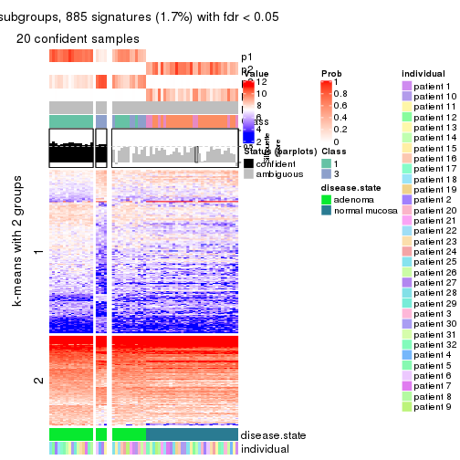</p>

</div>
<div id='tab-MAD-skmeans-get-signatures-no-scale-5'>
<pre><code class="r">get_signatures(res, k = 6, scale_rows = FALSE)
</code></pre>

<p></p>

</div>
</div>


Compare the overlap of signatures from different k:

```r
compare_signatures(res)
```


`get_signature()` returns a data frame invisibly. TO get the list of signatures, the function
call should be assigned to a variable explicitly. In following code, if `plot` argument is set
to `FALSE`, no heatmap is plotted while only the differential analysis is performed.

```r
# code only for demonstration
tb = get_signature(res, k = ..., plot = FALSE)
```

An example of the output of `tb` is:

```
#>   which_row         fdr    mean_1    mean_2 scaled_mean_1 scaled_mean_2 km
#> 1        38 0.042760348  8.373488  9.131774    -0.5533452     0.5164555  1
#> 2        40 0.018707592  7.106213  8.469186    -0.6173731     0.5762149  1
#> 3        55 0.019134737 10.221463 11.207825    -0.6159697     0.5749050  1
#> 4        59 0.006059896  5.921854  7.869574    -0.6899429     0.6439467  1
#> 5        60 0.018055526  8.928898 10.211722    -0.6204761     0.5791110  1
#> 6        98 0.009384629 15.714769 14.887706     0.6635654    -0.6193277  2
...
```

The columns in `tb` are:

1. `which_row`: row indices corresponding to the input matrix.
2. `fdr`: FDR for the differential test. 
3. `mean_x`: The mean value in group x.
4. `scaled_mean_x`: The mean value in group x after rows are scaled.
5. `km`: Row groups if k-means clustering is applied to rows.


UMAP plot which shows how samples are separated.


<script>
$( function() {
	$( '#tabs-MAD-skmeans-dimension-reduction' ).tabs();
} );
</script>
<div id='tabs-MAD-skmeans-dimension-reduction'>
<ul>
<li><a href='#tab-MAD-skmeans-dimension-reduction-1'>k = 2</a></li>
<li><a href='#tab-MAD-skmeans-dimension-reduction-2'>k = 3</a></li>
<li><a href='#tab-MAD-skmeans-dimension-reduction-3'>k = 4</a></li>
<li><a href='#tab-MAD-skmeans-dimension-reduction-4'>k = 5</a></li>
<li><a href='#tab-MAD-skmeans-dimension-reduction-5'>k = 6</a></li>
</ul>
<div id='tab-MAD-skmeans-dimension-reduction-1'>
<pre><code class="r">dimension_reduction(res, k = 2, method = &quot;UMAP&quot;)
</code></pre>

<p></p>

</div>
<div id='tab-MAD-skmeans-dimension-reduction-2'>
<pre><code class="r">dimension_reduction(res, k = 3, method = &quot;UMAP&quot;)
</code></pre>

<p></p>

</div>
<div id='tab-MAD-skmeans-dimension-reduction-3'>
<pre><code class="r">dimension_reduction(res, k = 4, method = &quot;UMAP&quot;)
</code></pre>

<p></p>

</div>
<div id='tab-MAD-skmeans-dimension-reduction-4'>
<pre><code class="r">dimension_reduction(res, k = 5, method = &quot;UMAP&quot;)
</code></pre>

<p></p>

</div>
<div id='tab-MAD-skmeans-dimension-reduction-5'>
<pre><code class="r">dimension_reduction(res, k = 6, method = &quot;UMAP&quot;)
</code></pre>

<p></p>

</div>
</div>


Following heatmap shows how subgroups are split when increasing `k`:

```r
collect_classes(res)
```


Test correlation between subgroups and known annotations. If the known
annotation is numeric, one-way ANOVA test is applied, and if the known
annotation is discrete, chi-squared contingency table test is applied.

```r
test_to_known_factors(res)
```

```
#>              n disease.state(p) individual(p) k
#> MAD:skmeans 64         9.19e-15         1.000 2
#> MAD:skmeans 58         2.54e-13         0.998 3
#> MAD:skmeans 34         1.98e-07         0.738 4
#> MAD:skmeans 21         2.75e-05         0.788 5
#> MAD:skmeans  4               NA            NA 6
```


If matrix rows can be associated to genes, consider to use `functional_enrichment(res,
...)` to perform function enrichment for the signature genes. See [this vignette](http://bioconductor.org/packages/devel/bioc/vignettes/cola/inst/doc/functional_enrichment.html) for more detailed explanations.


 

---------------------------------------------------


### MAD:pam**


The object with results only for a single top-value method and a single partition method 
can be extracted as:

```r
res = res_list["MAD", "pam"]
# you can also extract it by
# res = res_list["MAD:pam"]
```

A summary of `res` and all the functions that can be applied to it:

```r
res
```

```
#> A 'ConsensusPartition' object with k = 2, 3, 4, 5, 6.
#>   On a matrix with 51941 rows and 64 columns.
#>   Top rows (1000, 2000, 3000, 4000, 5000) are extracted by 'MAD' method.
#>   Subgroups are detected by 'pam' method.
#>   Performed in total 1250 partitions by row resampling.
#>   Best k for subgroups seems to be 2.
#> 
#> Following methods can be applied to this 'ConsensusPartition' object:
#>  [1] "cola_report"             "collect_classes"         "collect_plots"          
#>  [4] "collect_stats"           "colnames"                "compare_signatures"     
#>  [7] "consensus_heatmap"       "dimension_reduction"     "functional_enrichment"  
#> [10] "get_anno_col"            "get_anno"                "get_classes"            
#> [13] "get_consensus"           "get_matrix"              "get_membership"         
#> [16] "get_param"               "get_signatures"          "get_stats"              
#> [19] "is_best_k"               "is_stable_k"             "membership_heatmap"     
#> [22] "ncol"                    "nrow"                    "plot_ecdf"              
#> [25] "rownames"                "select_partition_number" "show"                   
#> [28] "suggest_best_k"          "test_to_known_factors"
```

`collect_plots()` function collects all the plots made from `res` for all `k` (number of partitions)
into one single page to provide an easy and fast comparison between different `k`.

```r
collect_plots(res)
```

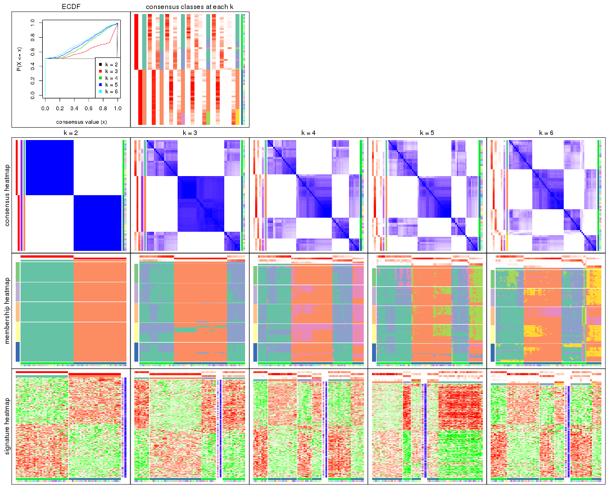

The plots are:

- The first row: a plot of the ECDF (empirical cumulative distribution
  function) curves of the consensus matrix for each `k` and the heatmap of
  predicted classes for each `k`.
- The second row: heatmaps of the consensus matrix for each `k`.
- The third row: heatmaps of the membership matrix for each `k`.
- The fouth row: heatmaps of the signatures for each `k`.

All the plots in panels can be made by individual functions and they are
plotted later in this section.

`select_partition_number()` produces several plots showing different
statistics for choosing "optimized" `k`. There are following statistics:

- ECDF curves of the consensus matrix for each `k`;
- 1-PAC. [The PAC
  score](https://en.wikipedia.org/wiki/Consensus_clustering#Over-interpretation_potential_of_consensus_clustering)
  measures the proportion of the ambiguous subgrouping.
- Mean silhouette score.
- Concordance. The mean probability of fiting the consensus class ids in all
  partitions.
- Area increased. Denote $A_k$ as the area under the ECDF curve for current
  `k`, the area increased is defined as $A_k - A_{k-1}$.
- Rand index. The percent of pairs of samples that are both in a same cluster
  or both are not in a same cluster in the partition of k and k-1.
- Jaccard index. The ratio of pairs of samples are both in a same cluster in
  the partition of k and k-1 and the pairs of samples are both in a same
  cluster in the partition k or k-1.

The detailed explanations of these statistics can be found in [the _cola_
vignette](http://bioconductor.org/packages/devel/bioc/vignettes/cola/inst/doc/cola.html#toc_13).

Generally speaking, lower PAC score, higher mean silhouette score or higher
concordance corresponds to better partition. Rand index and Jaccard index
measure how similar the current partition is compared to partition with `k-1`.
If they are too similar, we won't accept `k` is better than `k-1`.

```r
select_partition_number(res)
```


The numeric values for all these statistics can be obtained by `get_stats()`.

```r
get_stats(res)
```

```
#>   k 1-PAC mean_silhouette concordance area_increased  Rand Jaccard
#> 2 2 1.000           1.000       1.000         0.5084 0.492   0.492
#> 3 3 0.779           0.694       0.802         0.2193 0.885   0.767
#> 4 4 0.571           0.497       0.705         0.1231 0.898   0.733
#> 5 5 0.559           0.400       0.713         0.0327 0.862   0.607
#> 6 6 0.550           0.540       0.682         0.0242 0.893   0.660
```

`suggest_best_k()` suggests the best $k$ based on these statistics. The rules are as follows:

- All $k$ with Jaccard index larger than 0.95 are removed because increasing
  $k$ does not provide enough extra information. If all $k$ are removed, it is
  marked as no subgroup is detected.
- For all $k$ with 1-PAC score larger than 0.9, the maximal $k$ is taken as
  the best $k$, and other $k$ are marked as optional $k$.
- If it does not fit the second rule. The $k$ with the maximal vote of the
  highest 1-PAC score, highest mean silhouette, and highest concordance is
  taken as the best $k$.

```r
suggest_best_k(res)
```

```
#> [1] 2
```


Following shows the table of the partitions (You need to click the **show/hide
code output** link to see it). The membership matrix (columns with name `p*`)
is inferred by
[`clue::cl_consensus()`](https://www.rdocumentation.org/link/cl_consensus?package=clue)
function with the `SE` method. Basically the value in the membership matrix
represents the probability to belong to a certain group. The finall class
label for an item is determined with the group with highest probability it
belongs to.

In `get_classes()` function, the entropy is calculated from the membership
matrix and the silhouette score is calculated from the consensus matrix.


<script>
$( function() {
	$( '#tabs-MAD-pam-get-classes' ).tabs();
} );
</script>
<div id='tabs-MAD-pam-get-classes'>
<ul>
<li><a href='#tab-MAD-pam-get-classes-1'>k = 2</a></li>
<li><a href='#tab-MAD-pam-get-classes-2'>k = 3</a></li>
<li><a href='#tab-MAD-pam-get-classes-3'>k = 4</a></li>
<li><a href='#tab-MAD-pam-get-classes-4'>k = 5</a></li>
<li><a href='#tab-MAD-pam-get-classes-5'>k = 6</a></li>
</ul>

<div id='tab-MAD-pam-get-classes-1'>
<p><a id='tab-MAD-pam-get-classes-1-a' style='color:#0366d6' href='#'>show/hide code output</a></p>
<pre><code class="r">cbind(get_classes(res, k = 2), get_membership(res, k = 2))
</code></pre>

<pre><code>#&gt;           class entropy silhouette p1 p2
#&gt; GSM215051     2       0          1  0  1
#&gt; GSM215052     2       0          1  0  1
#&gt; GSM215053     2       0          1  0  1
#&gt; GSM215054     2       0          1  0  1
#&gt; GSM215055     2       0          1  0  1
#&gt; GSM215056     2       0          1  0  1
#&gt; GSM215057     2       0          1  0  1
#&gt; GSM215058     2       0          1  0  1
#&gt; GSM215059     2       0          1  0  1
#&gt; GSM215060     2       0          1  0  1
#&gt; GSM215061     2       0          1  0  1
#&gt; GSM215062     2       0          1  0  1
#&gt; GSM215063     2       0          1  0  1
#&gt; GSM215064     2       0          1  0  1
#&gt; GSM215065     2       0          1  0  1
#&gt; GSM215066     2       0          1  0  1
#&gt; GSM215067     2       0          1  0  1
#&gt; GSM215068     2       0          1  0  1
#&gt; GSM215069     2       0          1  0  1
#&gt; GSM215070     2       0          1  0  1
#&gt; GSM215071     2       0          1  0  1
#&gt; GSM215072     2       0          1  0  1
#&gt; GSM215073     2       0          1  0  1
#&gt; GSM215074     2       0          1  0  1
#&gt; GSM215075     2       0          1  0  1
#&gt; GSM215076     2       0          1  0  1
#&gt; GSM215077     2       0          1  0  1
#&gt; GSM215078     2       0          1  0  1
#&gt; GSM215079     2       0          1  0  1
#&gt; GSM215080     2       0          1  0  1
#&gt; GSM215081     2       0          1  0  1
#&gt; GSM215082     2       0          1  0  1
#&gt; GSM215083     1       0          1  1  0
#&gt; GSM215084     1       0          1  1  0
#&gt; GSM215085     1       0          1  1  0
#&gt; GSM215086     1       0          1  1  0
#&gt; GSM215087     1       0          1  1  0
#&gt; GSM215088     1       0          1  1  0
#&gt; GSM215089     1       0          1  1  0
#&gt; GSM215090     1       0          1  1  0
#&gt; GSM215091     1       0          1  1  0
#&gt; GSM215092     1       0          1  1  0
#&gt; GSM215093     1       0          1  1  0
#&gt; GSM215094     1       0          1  1  0
#&gt; GSM215095     1       0          1  1  0
#&gt; GSM215096     1       0          1  1  0
#&gt; GSM215097     1       0          1  1  0
#&gt; GSM215098     1       0          1  1  0
#&gt; GSM215099     1       0          1  1  0
#&gt; GSM215100     1       0          1  1  0
#&gt; GSM215101     1       0          1  1  0
#&gt; GSM215102     1       0          1  1  0
#&gt; GSM215103     1       0          1  1  0
#&gt; GSM215104     1       0          1  1  0
#&gt; GSM215105     1       0          1  1  0
#&gt; GSM215106     1       0          1  1  0
#&gt; GSM215107     1       0          1  1  0
#&gt; GSM215108     1       0          1  1  0
#&gt; GSM215109     1       0          1  1  0
#&gt; GSM215110     1       0          1  1  0
#&gt; GSM215111     1       0          1  1  0
#&gt; GSM215112     1       0          1  1  0
#&gt; GSM215113     1       0          1  1  0
#&gt; GSM215114     1       0          1  1  0
</code></pre>

<script>
$('#tab-MAD-pam-get-classes-1-a').parent().next().next().hide();
$('#tab-MAD-pam-get-classes-1-a').click(function(){
  $('#tab-MAD-pam-get-classes-1-a').parent().next().next().toggle();
  return(false);
});
</script>
</div>

<div id='tab-MAD-pam-get-classes-2'>
<p><a id='tab-MAD-pam-get-classes-2-a' style='color:#0366d6' href='#'>show/hide code output</a></p>
<pre><code class="r">cbind(get_classes(res, k = 3), get_membership(res, k = 3))
</code></pre>

<pre><code>#&gt;           class entropy silhouette    p1    p2    p3
#&gt; GSM215051     2  0.1411     0.9631 0.000 0.964 0.036
#&gt; GSM215052     2  0.0892     0.9693 0.000 0.980 0.020
#&gt; GSM215053     2  0.1163     0.9643 0.000 0.972 0.028
#&gt; GSM215054     2  0.1163     0.9643 0.000 0.972 0.028
#&gt; GSM215055     2  0.2066     0.9627 0.000 0.940 0.060
#&gt; GSM215056     2  0.1289     0.9690 0.000 0.968 0.032
#&gt; GSM215057     2  0.1643     0.9655 0.000 0.956 0.044
#&gt; GSM215058     2  0.1753     0.9592 0.000 0.952 0.048
#&gt; GSM215059     2  0.2066     0.9627 0.000 0.940 0.060
#&gt; GSM215060     2  0.2066     0.9627 0.000 0.940 0.060
#&gt; GSM215061     2  0.2066     0.9627 0.000 0.940 0.060
#&gt; GSM215062     2  0.2537     0.9607 0.000 0.920 0.080
#&gt; GSM215063     2  0.2066     0.9627 0.000 0.940 0.060
#&gt; GSM215064     2  0.2261     0.9663 0.000 0.932 0.068
#&gt; GSM215065     2  0.2066     0.9627 0.000 0.940 0.060
#&gt; GSM215066     2  0.1643     0.9666 0.000 0.956 0.044
#&gt; GSM215067     2  0.1529     0.9664 0.000 0.960 0.040
#&gt; GSM215068     2  0.1753     0.9650 0.000 0.952 0.048
#&gt; GSM215069     2  0.2066     0.9627 0.000 0.940 0.060
#&gt; GSM215070     2  0.1411     0.9667 0.000 0.964 0.036
#&gt; GSM215071     2  0.2066     0.9627 0.000 0.940 0.060
#&gt; GSM215072     2  0.1753     0.9643 0.000 0.952 0.048
#&gt; GSM215073     2  0.2066     0.9627 0.000 0.940 0.060
#&gt; GSM215074     2  0.1031     0.9673 0.000 0.976 0.024
#&gt; GSM215075     2  0.1964     0.9634 0.000 0.944 0.056
#&gt; GSM215076     2  0.1643     0.9610 0.000 0.956 0.044
#&gt; GSM215077     2  0.1163     0.9680 0.000 0.972 0.028
#&gt; GSM215078     2  0.1031     0.9672 0.000 0.976 0.024
#&gt; GSM215079     2  0.1643     0.9608 0.000 0.956 0.044
#&gt; GSM215080     2  0.0747     0.9692 0.000 0.984 0.016
#&gt; GSM215081     2  0.1643     0.9610 0.000 0.956 0.044
#&gt; GSM215082     2  0.1753     0.9592 0.000 0.952 0.048
#&gt; GSM215083     3  0.5988     0.5471 0.368 0.000 0.632
#&gt; GSM215084     1  0.0424     0.5872 0.992 0.000 0.008
#&gt; GSM215085     3  0.6309     0.3686 0.500 0.000 0.500
#&gt; GSM215086     3  0.4974     0.7812 0.236 0.000 0.764
#&gt; GSM215087     1  0.2448     0.5883 0.924 0.000 0.076
#&gt; GSM215088     3  0.4974     0.7806 0.236 0.000 0.764
#&gt; GSM215089     1  0.6180     0.1973 0.584 0.000 0.416
#&gt; GSM215090     1  0.3116     0.5779 0.892 0.000 0.108
#&gt; GSM215091     3  0.4842     0.7690 0.224 0.000 0.776
#&gt; GSM215092     1  0.3619     0.5528 0.864 0.000 0.136
#&gt; GSM215093     3  0.5216     0.7773 0.260 0.000 0.740
#&gt; GSM215094     1  0.4002     0.4716 0.840 0.000 0.160
#&gt; GSM215095     1  0.1529     0.5924 0.960 0.000 0.040
#&gt; GSM215096     3  0.6308     0.3899 0.492 0.000 0.508
#&gt; GSM215097     3  0.4796     0.7694 0.220 0.000 0.780
#&gt; GSM215098     1  0.6295    -0.3373 0.528 0.000 0.472
#&gt; GSM215099     1  0.2066     0.5759 0.940 0.000 0.060
#&gt; GSM215100     1  0.5216     0.4397 0.740 0.000 0.260
#&gt; GSM215101     1  0.6140     0.2177 0.596 0.000 0.404
#&gt; GSM215102     1  0.6204    -0.2248 0.576 0.000 0.424
#&gt; GSM215103     3  0.5678     0.6677 0.316 0.000 0.684
#&gt; GSM215104     1  0.5905     0.0114 0.648 0.000 0.352
#&gt; GSM215105     1  0.1643     0.5867 0.956 0.000 0.044
#&gt; GSM215106     3  0.5497     0.7562 0.292 0.000 0.708
#&gt; GSM215107     1  0.6140     0.2155 0.596 0.000 0.404
#&gt; GSM215108     1  0.6215    -0.2229 0.572 0.000 0.428
#&gt; GSM215109     3  0.5905     0.6786 0.352 0.000 0.648
#&gt; GSM215110     1  0.6008     0.3697 0.628 0.000 0.372
#&gt; GSM215111     1  0.6215    -0.2306 0.572 0.000 0.428
#&gt; GSM215112     1  0.1031     0.5912 0.976 0.000 0.024
#&gt; GSM215113     1  0.1031     0.5891 0.976 0.000 0.024
#&gt; GSM215114     1  0.6244     0.1238 0.560 0.000 0.440
</code></pre>

<script>
$('#tab-MAD-pam-get-classes-2-a').parent().next().next().hide();
$('#tab-MAD-pam-get-classes-2-a').click(function(){
  $('#tab-MAD-pam-get-classes-2-a').parent().next().next().toggle();
  return(false);
});
</script>
</div>

<div id='tab-MAD-pam-get-classes-3'>
<p><a id='tab-MAD-pam-get-classes-3-a' style='color:#0366d6' href='#'>show/hide code output</a></p>
<pre><code class="r">cbind(get_classes(res, k = 4), get_membership(res, k = 4))
</code></pre>

<pre><code>#&gt;           class entropy silhouette    p1    p2    p3    p4
#&gt; GSM215051     2  0.4661      0.339 0.000 0.652 0.000 0.348
#&gt; GSM215052     2  0.3688      0.617 0.000 0.792 0.000 0.208
#&gt; GSM215053     2  0.4431      0.460 0.000 0.696 0.000 0.304
#&gt; GSM215054     2  0.4522      0.423 0.000 0.680 0.000 0.320
#&gt; GSM215055     2  0.0817      0.718 0.000 0.976 0.000 0.024
#&gt; GSM215056     2  0.3074      0.670 0.000 0.848 0.000 0.152
#&gt; GSM215057     2  0.4331      0.472 0.000 0.712 0.000 0.288
#&gt; GSM215058     4  0.4661      0.764 0.000 0.348 0.000 0.652
#&gt; GSM215059     2  0.0000      0.714 0.000 1.000 0.000 0.000
#&gt; GSM215060     2  0.0000      0.714 0.000 1.000 0.000 0.000
#&gt; GSM215061     2  0.0336      0.717 0.000 0.992 0.000 0.008
#&gt; GSM215062     2  0.4855     -0.332 0.000 0.600 0.000 0.400
#&gt; GSM215063     2  0.0000      0.714 0.000 1.000 0.000 0.000
#&gt; GSM215064     4  0.4925      0.638 0.000 0.428 0.000 0.572
#&gt; GSM215065     2  0.0000      0.714 0.000 1.000 0.000 0.000
#&gt; GSM215066     2  0.4994     -0.513 0.000 0.520 0.000 0.480
#&gt; GSM215067     2  0.1940      0.709 0.000 0.924 0.000 0.076
#&gt; GSM215068     2  0.0921      0.718 0.000 0.972 0.000 0.028
#&gt; GSM215069     2  0.0000      0.714 0.000 1.000 0.000 0.000
#&gt; GSM215070     2  0.4697      0.267 0.000 0.644 0.000 0.356
#&gt; GSM215071     2  0.0336      0.711 0.000 0.992 0.000 0.008
#&gt; GSM215072     4  0.4585      0.773 0.000 0.332 0.000 0.668
#&gt; GSM215073     2  0.0000      0.714 0.000 1.000 0.000 0.000
#&gt; GSM215074     2  0.3907      0.586 0.000 0.768 0.000 0.232
#&gt; GSM215075     2  0.1940      0.708 0.000 0.924 0.000 0.076
#&gt; GSM215076     4  0.4898      0.653 0.000 0.416 0.000 0.584
#&gt; GSM215077     2  0.3726      0.612 0.000 0.788 0.000 0.212
#&gt; GSM215078     2  0.4008      0.568 0.000 0.756 0.000 0.244
#&gt; GSM215079     4  0.5000      0.363 0.000 0.496 0.000 0.504
#&gt; GSM215080     2  0.3172      0.664 0.000 0.840 0.000 0.160
#&gt; GSM215081     4  0.4356      0.785 0.000 0.292 0.000 0.708
#&gt; GSM215082     4  0.4277      0.779 0.000 0.280 0.000 0.720
#&gt; GSM215083     3  0.4543      0.569 0.324 0.000 0.676 0.000
#&gt; GSM215084     1  0.0657      0.585 0.984 0.000 0.012 0.004
#&gt; GSM215085     3  0.6529      0.344 0.388 0.000 0.532 0.080
#&gt; GSM215086     3  0.4507      0.739 0.168 0.000 0.788 0.044
#&gt; GSM215087     1  0.2402      0.583 0.912 0.000 0.076 0.012
#&gt; GSM215088     3  0.3539      0.754 0.176 0.000 0.820 0.004
#&gt; GSM215089     1  0.5088      0.227 0.572 0.000 0.424 0.004
#&gt; GSM215090     1  0.3047      0.573 0.872 0.000 0.116 0.012
#&gt; GSM215091     3  0.3219      0.745 0.164 0.000 0.836 0.000
#&gt; GSM215092     1  0.3196      0.555 0.856 0.000 0.136 0.008
#&gt; GSM215093     3  0.3649      0.755 0.204 0.000 0.796 0.000
#&gt; GSM215094     1  0.3852      0.421 0.800 0.000 0.192 0.008
#&gt; GSM215095     1  0.1545      0.590 0.952 0.000 0.040 0.008
#&gt; GSM215096     3  0.5360      0.423 0.436 0.000 0.552 0.012
#&gt; GSM215097     3  0.3172      0.745 0.160 0.000 0.840 0.000
#&gt; GSM215098     3  0.5292      0.339 0.480 0.000 0.512 0.008
#&gt; GSM215099     1  0.2542      0.561 0.904 0.000 0.084 0.012
#&gt; GSM215100     1  0.4283      0.452 0.740 0.000 0.256 0.004
#&gt; GSM215101     1  0.4907      0.227 0.580 0.000 0.420 0.000
#&gt; GSM215102     1  0.5285     -0.296 0.524 0.000 0.468 0.008
#&gt; GSM215103     3  0.4222      0.663 0.272 0.000 0.728 0.000
#&gt; GSM215104     1  0.5290     -0.126 0.584 0.000 0.404 0.012
#&gt; GSM215105     1  0.1938      0.579 0.936 0.000 0.052 0.012
#&gt; GSM215106     3  0.4122      0.738 0.236 0.000 0.760 0.004
#&gt; GSM215107     1  0.4888      0.240 0.588 0.000 0.412 0.000
#&gt; GSM215108     1  0.5292     -0.318 0.512 0.000 0.480 0.008
#&gt; GSM215109     3  0.4697      0.669 0.296 0.000 0.696 0.008
#&gt; GSM215110     1  0.7149      0.315 0.528 0.000 0.316 0.156
#&gt; GSM215111     1  0.5404     -0.314 0.512 0.000 0.476 0.012
#&gt; GSM215112     1  0.1305      0.588 0.960 0.000 0.036 0.004
#&gt; GSM215113     1  0.1356      0.587 0.960 0.000 0.032 0.008
#&gt; GSM215114     1  0.4977      0.130 0.540 0.000 0.460 0.000
</code></pre>

<script>
$('#tab-MAD-pam-get-classes-3-a').parent().next().next().hide();
$('#tab-MAD-pam-get-classes-3-a').click(function(){
  $('#tab-MAD-pam-get-classes-3-a').parent().next().next().toggle();
  return(false);
});
</script>
</div>

<div id='tab-MAD-pam-get-classes-4'>
<p><a id='tab-MAD-pam-get-classes-4-a' style='color:#0366d6' href='#'>show/hide code output</a></p>
<pre><code class="r">cbind(get_classes(res, k = 5), get_membership(res, k = 5))
</code></pre>

<pre><code>#&gt;           class entropy silhouette    p1    p2    p3    p4    p5
#&gt; GSM215051     2  0.4101     0.3766 0.000 0.628 0.000 0.000 0.372
#&gt; GSM215052     2  0.3210     0.6544 0.000 0.788 0.000 0.000 0.212
#&gt; GSM215053     2  0.3876     0.5064 0.000 0.684 0.000 0.000 0.316
#&gt; GSM215054     2  0.3983     0.4606 0.000 0.660 0.000 0.000 0.340
#&gt; GSM215055     2  0.0703     0.7444 0.000 0.976 0.000 0.000 0.024
#&gt; GSM215056     2  0.2732     0.6975 0.000 0.840 0.000 0.000 0.160
#&gt; GSM215057     2  0.3876     0.4762 0.000 0.684 0.000 0.000 0.316
#&gt; GSM215058     5  0.3612     0.7468 0.000 0.268 0.000 0.000 0.732
#&gt; GSM215059     2  0.0000     0.7407 0.000 1.000 0.000 0.000 0.000
#&gt; GSM215060     2  0.0000     0.7407 0.000 1.000 0.000 0.000 0.000
#&gt; GSM215061     2  0.0290     0.7432 0.000 0.992 0.000 0.000 0.008
#&gt; GSM215062     2  0.4297    -0.4200 0.000 0.528 0.000 0.000 0.472
#&gt; GSM215063     2  0.0000     0.7407 0.000 1.000 0.000 0.000 0.000
#&gt; GSM215064     5  0.4030     0.6534 0.000 0.352 0.000 0.000 0.648
#&gt; GSM215065     2  0.0000     0.7407 0.000 1.000 0.000 0.000 0.000
#&gt; GSM215066     5  0.4304     0.4568 0.000 0.484 0.000 0.000 0.516
#&gt; GSM215067     2  0.1732     0.7350 0.000 0.920 0.000 0.000 0.080
#&gt; GSM215068     2  0.0794     0.7443 0.000 0.972 0.000 0.000 0.028
#&gt; GSM215069     2  0.0000     0.7407 0.000 1.000 0.000 0.000 0.000
#&gt; GSM215070     2  0.4101     0.3261 0.000 0.628 0.000 0.000 0.372
#&gt; GSM215071     2  0.0290     0.7376 0.000 0.992 0.000 0.000 0.008
#&gt; GSM215072     5  0.3534     0.7512 0.000 0.256 0.000 0.000 0.744
#&gt; GSM215073     2  0.0162     0.7412 0.000 0.996 0.000 0.000 0.004
#&gt; GSM215074     2  0.3508     0.6084 0.000 0.748 0.000 0.000 0.252
#&gt; GSM215075     2  0.1671     0.7361 0.000 0.924 0.000 0.000 0.076
#&gt; GSM215076     5  0.4030     0.6455 0.000 0.352 0.000 0.000 0.648
#&gt; GSM215077     2  0.3274     0.6454 0.000 0.780 0.000 0.000 0.220
#&gt; GSM215078     2  0.3561     0.5967 0.000 0.740 0.000 0.000 0.260
#&gt; GSM215079     5  0.4273     0.3734 0.000 0.448 0.000 0.000 0.552
#&gt; GSM215080     2  0.2773     0.6947 0.000 0.836 0.000 0.000 0.164
#&gt; GSM215081     5  0.3177     0.7583 0.000 0.208 0.000 0.000 0.792
#&gt; GSM215082     5  0.3039     0.7507 0.000 0.192 0.000 0.000 0.808
#&gt; GSM215083     1  0.3983    -0.1568 0.660 0.000 0.340 0.000 0.000
#&gt; GSM215084     1  0.5795     0.1771 0.596 0.000 0.268 0.136 0.000
#&gt; GSM215085     3  0.6658     0.1811 0.112 0.000 0.596 0.224 0.068
#&gt; GSM215086     1  0.7795    -0.1711 0.424 0.000 0.316 0.152 0.108
#&gt; GSM215087     1  0.4709     0.3064 0.612 0.000 0.364 0.024 0.000
#&gt; GSM215088     1  0.4443    -0.3325 0.524 0.000 0.472 0.000 0.004
#&gt; GSM215089     1  0.3239     0.3408 0.852 0.000 0.080 0.068 0.000
#&gt; GSM215090     1  0.5144     0.2981 0.632 0.000 0.304 0.064 0.000
#&gt; GSM215091     1  0.4278    -0.3058 0.548 0.000 0.452 0.000 0.000
#&gt; GSM215092     1  0.5413     0.1579 0.664 0.000 0.164 0.172 0.000
#&gt; GSM215093     3  0.4307     0.2821 0.500 0.000 0.500 0.000 0.000
#&gt; GSM215094     3  0.4658    -0.0662 0.408 0.000 0.576 0.016 0.000
#&gt; GSM215095     1  0.5899     0.1870 0.592 0.000 0.248 0.160 0.000
#&gt; GSM215096     3  0.3242     0.5818 0.216 0.000 0.784 0.000 0.000
#&gt; GSM215097     1  0.4425    -0.3087 0.544 0.000 0.452 0.004 0.000
#&gt; GSM215098     1  0.4451    -0.3030 0.504 0.000 0.492 0.004 0.000
#&gt; GSM215099     1  0.6080     0.2604 0.520 0.000 0.344 0.136 0.000
#&gt; GSM215100     1  0.5006     0.2682 0.708 0.000 0.156 0.136 0.000
#&gt; GSM215101     1  0.1124     0.3449 0.960 0.000 0.036 0.004 0.000
#&gt; GSM215102     3  0.4558     0.5515 0.208 0.000 0.728 0.064 0.000
#&gt; GSM215103     1  0.4171    -0.2318 0.604 0.000 0.396 0.000 0.000
#&gt; GSM215104     3  0.3596     0.5311 0.200 0.000 0.784 0.016 0.000
#&gt; GSM215105     1  0.4610     0.2801 0.556 0.000 0.432 0.012 0.000
#&gt; GSM215106     3  0.4278     0.3644 0.452 0.000 0.548 0.000 0.000
#&gt; GSM215107     1  0.0404     0.3390 0.988 0.000 0.012 0.000 0.000
#&gt; GSM215108     3  0.3988     0.5759 0.196 0.000 0.768 0.036 0.000
#&gt; GSM215109     3  0.4879     0.4684 0.360 0.000 0.612 0.020 0.008
#&gt; GSM215110     4  0.5188     0.0000 0.328 0.000 0.060 0.612 0.000
#&gt; GSM215111     3  0.3210     0.5731 0.212 0.000 0.788 0.000 0.000
#&gt; GSM215112     1  0.4969     0.2691 0.588 0.000 0.376 0.036 0.000
#&gt; GSM215113     1  0.6024     0.2160 0.560 0.000 0.288 0.152 0.000
#&gt; GSM215114     1  0.2074     0.2986 0.896 0.000 0.104 0.000 0.000
</code></pre>

<script>
$('#tab-MAD-pam-get-classes-4-a').parent().next().next().hide();
$('#tab-MAD-pam-get-classes-4-a').click(function(){
  $('#tab-MAD-pam-get-classes-4-a').parent().next().next().toggle();
  return(false);
});
</script>
</div>

<div id='tab-MAD-pam-get-classes-5'>
<p><a id='tab-MAD-pam-get-classes-5-a' style='color:#0366d6' href='#'>show/hide code output</a></p>
<pre><code class="r">cbind(get_classes(res, k = 6), get_membership(res, k = 6))
</code></pre>

<pre><code>#&gt;           class entropy silhouette    p1    p2    p3    p4    p5    p6
#&gt; GSM215051     2  0.4284     0.4045 0.000 0.596 0.000 0.008 0.012 0.384
#&gt; GSM215052     2  0.3507     0.6772 0.000 0.764 0.000 0.008 0.012 0.216
#&gt; GSM215053     2  0.4179     0.5353 0.000 0.652 0.000 0.016 0.008 0.324
#&gt; GSM215054     2  0.4088     0.4960 0.000 0.636 0.000 0.008 0.008 0.348
#&gt; GSM215055     2  0.1138     0.7652 0.000 0.960 0.000 0.012 0.004 0.024
#&gt; GSM215056     2  0.3523     0.7203 0.000 0.796 0.000 0.028 0.012 0.164
#&gt; GSM215057     2  0.4275     0.5025 0.000 0.644 0.000 0.020 0.008 0.328
#&gt; GSM215058     6  0.2969     0.7135 0.000 0.224 0.000 0.000 0.000 0.776
#&gt; GSM215059     2  0.0713     0.7517 0.000 0.972 0.000 0.028 0.000 0.000
#&gt; GSM215060     2  0.0146     0.7589 0.000 0.996 0.000 0.004 0.000 0.000
#&gt; GSM215061     2  0.0260     0.7627 0.000 0.992 0.000 0.000 0.000 0.008
#&gt; GSM215062     6  0.3866     0.4333 0.000 0.484 0.000 0.000 0.000 0.516
#&gt; GSM215063     2  0.0632     0.7535 0.000 0.976 0.000 0.024 0.000 0.000
#&gt; GSM215064     6  0.3428     0.6715 0.000 0.304 0.000 0.000 0.000 0.696
#&gt; GSM215065     2  0.0260     0.7583 0.000 0.992 0.000 0.008 0.000 0.000
#&gt; GSM215066     6  0.3979     0.4220 0.000 0.456 0.000 0.004 0.000 0.540
#&gt; GSM215067     2  0.2527     0.7534 0.000 0.880 0.000 0.032 0.004 0.084
#&gt; GSM215068     2  0.0790     0.7642 0.000 0.968 0.000 0.000 0.000 0.032
#&gt; GSM215069     2  0.0260     0.7583 0.000 0.992 0.000 0.008 0.000 0.000
#&gt; GSM215070     2  0.3993     0.3229 0.000 0.592 0.000 0.000 0.008 0.400
#&gt; GSM215071     2  0.1230     0.7500 0.000 0.956 0.000 0.028 0.008 0.008
#&gt; GSM215072     6  0.2854     0.7327 0.000 0.208 0.000 0.000 0.000 0.792
#&gt; GSM215073     2  0.0146     0.7600 0.000 0.996 0.000 0.000 0.000 0.004
#&gt; GSM215074     2  0.4178     0.6314 0.000 0.700 0.000 0.032 0.008 0.260
#&gt; GSM215075     2  0.1556     0.7591 0.000 0.920 0.000 0.000 0.000 0.080
#&gt; GSM215076     6  0.3390     0.6375 0.000 0.296 0.000 0.000 0.000 0.704
#&gt; GSM215077     2  0.3357     0.6817 0.000 0.764 0.000 0.008 0.004 0.224
#&gt; GSM215078     2  0.3360     0.6372 0.000 0.732 0.000 0.000 0.004 0.264
#&gt; GSM215079     6  0.4344     0.3010 0.000 0.412 0.000 0.012 0.008 0.568
#&gt; GSM215080     2  0.2773     0.7229 0.000 0.828 0.000 0.004 0.004 0.164
#&gt; GSM215081     6  0.2416     0.7315 0.000 0.156 0.000 0.000 0.000 0.844
#&gt; GSM215082     6  0.2402     0.7236 0.000 0.140 0.000 0.000 0.004 0.856
#&gt; GSM215083     3  0.3528     0.5016 0.296 0.000 0.700 0.004 0.000 0.000
#&gt; GSM215084     1  0.2262     0.5845 0.896 0.000 0.008 0.016 0.080 0.000
#&gt; GSM215085     5  0.8702    -0.0788 0.192 0.000 0.188 0.188 0.316 0.116
#&gt; GSM215086     4  0.4039     0.0000 0.016 0.000 0.352 0.632 0.000 0.000
#&gt; GSM215087     1  0.2317     0.6151 0.900 0.000 0.064 0.016 0.020 0.000
#&gt; GSM215088     3  0.2876     0.6448 0.148 0.000 0.836 0.008 0.004 0.004
#&gt; GSM215089     1  0.4768     0.3507 0.532 0.000 0.416 0.000 0.052 0.000
#&gt; GSM215090     1  0.2656     0.6148 0.860 0.000 0.120 0.012 0.008 0.000
#&gt; GSM215091     3  0.2219     0.6436 0.136 0.000 0.864 0.000 0.000 0.000
#&gt; GSM215092     1  0.3994     0.5721 0.776 0.000 0.100 0.008 0.116 0.000
#&gt; GSM215093     3  0.3608     0.6378 0.148 0.000 0.788 0.064 0.000 0.000
#&gt; GSM215094     1  0.3819     0.3573 0.756 0.000 0.200 0.040 0.004 0.000
#&gt; GSM215095     1  0.2982     0.5960 0.856 0.000 0.032 0.016 0.096 0.000
#&gt; GSM215096     3  0.4936     0.5335 0.408 0.000 0.536 0.048 0.008 0.000
#&gt; GSM215097     3  0.2362     0.6436 0.136 0.000 0.860 0.000 0.004 0.000
#&gt; GSM215098     1  0.4874    -0.3055 0.484 0.000 0.472 0.020 0.024 0.000
#&gt; GSM215099     1  0.3831     0.5978 0.804 0.000 0.092 0.024 0.080 0.000
#&gt; GSM215100     1  0.4870     0.5777 0.696 0.000 0.168 0.016 0.120 0.000
#&gt; GSM215101     1  0.4018     0.3549 0.580 0.000 0.412 0.000 0.008 0.000
#&gt; GSM215102     3  0.5869     0.4304 0.428 0.000 0.456 0.056 0.060 0.000
#&gt; GSM215103     3  0.3126     0.5848 0.248 0.000 0.752 0.000 0.000 0.000
#&gt; GSM215104     1  0.5318    -0.4035 0.504 0.000 0.420 0.052 0.024 0.000
#&gt; GSM215105     1  0.2619     0.5874 0.884 0.000 0.056 0.048 0.012 0.000
#&gt; GSM215106     3  0.3398     0.6813 0.216 0.000 0.768 0.012 0.004 0.000
#&gt; GSM215107     1  0.3915     0.3578 0.584 0.000 0.412 0.000 0.004 0.000
#&gt; GSM215108     3  0.5459     0.4616 0.436 0.000 0.480 0.052 0.032 0.000
#&gt; GSM215109     3  0.5072     0.6222 0.228 0.000 0.680 0.052 0.024 0.016
#&gt; GSM215110     5  0.3804     0.1188 0.336 0.000 0.008 0.000 0.656 0.000
#&gt; GSM215111     3  0.5018     0.4413 0.464 0.000 0.480 0.044 0.012 0.000
#&gt; GSM215112     1  0.1515     0.6043 0.944 0.000 0.028 0.008 0.020 0.000
#&gt; GSM215113     1  0.3243     0.6035 0.844 0.000 0.048 0.020 0.088 0.000
#&gt; GSM215114     1  0.3851     0.2598 0.540 0.000 0.460 0.000 0.000 0.000
</code></pre>

<script>
$('#tab-MAD-pam-get-classes-5-a').parent().next().next().hide();
$('#tab-MAD-pam-get-classes-5-a').click(function(){
  $('#tab-MAD-pam-get-classes-5-a').parent().next().next().toggle();
  return(false);
});
</script>
</div>
</div>

Heatmaps for the consensus matrix. It visualizes the probability of two
samples to be in a same group.


<script>
$( function() {
	$( '#tabs-MAD-pam-consensus-heatmap' ).tabs();
} );
</script>
<div id='tabs-MAD-pam-consensus-heatmap'>
<ul>
<li><a href='#tab-MAD-pam-consensus-heatmap-1'>k = 2</a></li>
<li><a href='#tab-MAD-pam-consensus-heatmap-2'>k = 3</a></li>
<li><a href='#tab-MAD-pam-consensus-heatmap-3'>k = 4</a></li>
<li><a href='#tab-MAD-pam-consensus-heatmap-4'>k = 5</a></li>
<li><a href='#tab-MAD-pam-consensus-heatmap-5'>k = 6</a></li>
</ul>
<div id='tab-MAD-pam-consensus-heatmap-1'>
<pre><code class="r">consensus_heatmap(res, k = 2)
</code></pre>

<p></p>

</div>
<div id='tab-MAD-pam-consensus-heatmap-2'>
<pre><code class="r">consensus_heatmap(res, k = 3)
</code></pre>

<p></p>

</div>
<div id='tab-MAD-pam-consensus-heatmap-3'>
<pre><code class="r">consensus_heatmap(res, k = 4)
</code></pre>

<p></p>

</div>
<div id='tab-MAD-pam-consensus-heatmap-4'>
<pre><code class="r">consensus_heatmap(res, k = 5)
</code></pre>

<p>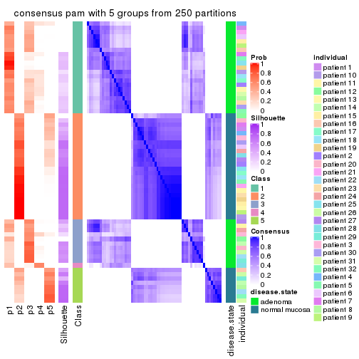</p>

</div>
<div id='tab-MAD-pam-consensus-heatmap-5'>
<pre><code class="r">consensus_heatmap(res, k = 6)
</code></pre>

<p></p>

</div>
</div>

Heatmaps for the membership of samples in all partitions to see how consistent they are:


<script>
$( function() {
	$( '#tabs-MAD-pam-membership-heatmap' ).tabs();
} );
</script>
<div id='tabs-MAD-pam-membership-heatmap'>
<ul>
<li><a href='#tab-MAD-pam-membership-heatmap-1'>k = 2</a></li>
<li><a href='#tab-MAD-pam-membership-heatmap-2'>k = 3</a></li>
<li><a href='#tab-MAD-pam-membership-heatmap-3'>k = 4</a></li>
<li><a href='#tab-MAD-pam-membership-heatmap-4'>k = 5</a></li>
<li><a href='#tab-MAD-pam-membership-heatmap-5'>k = 6</a></li>
</ul>
<div id='tab-MAD-pam-membership-heatmap-1'>
<pre><code class="r">membership_heatmap(res, k = 2)
</code></pre>

<p></p>

</div>
<div id='tab-MAD-pam-membership-heatmap-2'>
<pre><code class="r">membership_heatmap(res, k = 3)
</code></pre>

<p></p>

</div>
<div id='tab-MAD-pam-membership-heatmap-3'>
<pre><code class="r">membership_heatmap(res, k = 4)
</code></pre>

<p></p>

</div>
<div id='tab-MAD-pam-membership-heatmap-4'>
<pre><code class="r">membership_heatmap(res, k = 5)
</code></pre>

<p></p>

</div>
<div id='tab-MAD-pam-membership-heatmap-5'>
<pre><code class="r">membership_heatmap(res, k = 6)
</code></pre>

<p></p>

</div>
</div>

As soon as we have had the classes for columns, we can look for signatures
which are significantly different between classes which can be candidate marks
for certain classes. Following are the heatmaps for signatures.


Signature heatmaps where rows are scaled:


<script>
$( function() {
	$( '#tabs-MAD-pam-get-signatures' ).tabs();
} );
</script>
<div id='tabs-MAD-pam-get-signatures'>
<ul>
<li><a href='#tab-MAD-pam-get-signatures-1'>k = 2</a></li>
<li><a href='#tab-MAD-pam-get-signatures-2'>k = 3</a></li>
<li><a href='#tab-MAD-pam-get-signatures-3'>k = 4</a></li>
<li><a href='#tab-MAD-pam-get-signatures-4'>k = 5</a></li>
<li><a href='#tab-MAD-pam-get-signatures-5'>k = 6</a></li>
</ul>
<div id='tab-MAD-pam-get-signatures-1'>
<pre><code class="r">get_signatures(res, k = 2)
</code></pre>

<p></p>

</div>
<div id='tab-MAD-pam-get-signatures-2'>
<pre><code class="r">get_signatures(res, k = 3)
</code></pre>

<p></p>

</div>
<div id='tab-MAD-pam-get-signatures-3'>
<pre><code class="r">get_signatures(res, k = 4)
</code></pre>

<p></p>

</div>
<div id='tab-MAD-pam-get-signatures-4'>
<pre><code class="r">get_signatures(res, k = 5)
</code></pre>

<p></p>

</div>
<div id='tab-MAD-pam-get-signatures-5'>
<pre><code class="r">get_signatures(res, k = 6)
</code></pre>

<p></p>

</div>
</div>


Signature heatmaps where rows are not scaled:


<script>
$( function() {
	$( '#tabs-MAD-pam-get-signatures-no-scale' ).tabs();
} );
</script>
<div id='tabs-MAD-pam-get-signatures-no-scale'>
<ul>
<li><a href='#tab-MAD-pam-get-signatures-no-scale-1'>k = 2</a></li>
<li><a href='#tab-MAD-pam-get-signatures-no-scale-2'>k = 3</a></li>
<li><a href='#tab-MAD-pam-get-signatures-no-scale-3'>k = 4</a></li>
<li><a href='#tab-MAD-pam-get-signatures-no-scale-4'>k = 5</a></li>
<li><a href='#tab-MAD-pam-get-signatures-no-scale-5'>k = 6</a></li>
</ul>
<div id='tab-MAD-pam-get-signatures-no-scale-1'>
<pre><code class="r">get_signatures(res, k = 2, scale_rows = FALSE)
</code></pre>

<p></p>

</div>
<div id='tab-MAD-pam-get-signatures-no-scale-2'>
<pre><code class="r">get_signatures(res, k = 3, scale_rows = FALSE)
</code></pre>

<p></p>

</div>
<div id='tab-MAD-pam-get-signatures-no-scale-3'>
<pre><code class="r">get_signatures(res, k = 4, scale_rows = FALSE)
</code></pre>

<p></p>

</div>
<div id='tab-MAD-pam-get-signatures-no-scale-4'>
<pre><code class="r">get_signatures(res, k = 5, scale_rows = FALSE)
</code></pre>

<p></p>

</div>
<div id='tab-MAD-pam-get-signatures-no-scale-5'>
<pre><code class="r">get_signatures(res, k = 6, scale_rows = FALSE)
</code></pre>

<p></p>

</div>
</div>


Compare the overlap of signatures from different k:

```r
compare_signatures(res)
```


`get_signature()` returns a data frame invisibly. TO get the list of signatures, the function
call should be assigned to a variable explicitly. In following code, if `plot` argument is set
to `FALSE`, no heatmap is plotted while only the differential analysis is performed.

```r
# code only for demonstration
tb = get_signature(res, k = ..., plot = FALSE)
```

An example of the output of `tb` is:

```
#>   which_row         fdr    mean_1    mean_2 scaled_mean_1 scaled_mean_2 km
#> 1        38 0.042760348  8.373488  9.131774    -0.5533452     0.5164555  1
#> 2        40 0.018707592  7.106213  8.469186    -0.6173731     0.5762149  1
#> 3        55 0.019134737 10.221463 11.207825    -0.6159697     0.5749050  1
#> 4        59 0.006059896  5.921854  7.869574    -0.6899429     0.6439467  1
#> 5        60 0.018055526  8.928898 10.211722    -0.6204761     0.5791110  1
#> 6        98 0.009384629 15.714769 14.887706     0.6635654    -0.6193277  2
...
```

The columns in `tb` are:

1. `which_row`: row indices corresponding to the input matrix.
2. `fdr`: FDR for the differential test. 
3. `mean_x`: The mean value in group x.
4. `scaled_mean_x`: The mean value in group x after rows are scaled.
5. `km`: Row groups if k-means clustering is applied to rows.


UMAP plot which shows how samples are separated.


<script>
$( function() {
	$( '#tabs-MAD-pam-dimension-reduction' ).tabs();
} );
</script>
<div id='tabs-MAD-pam-dimension-reduction'>
<ul>
<li><a href='#tab-MAD-pam-dimension-reduction-1'>k = 2</a></li>
<li><a href='#tab-MAD-pam-dimension-reduction-2'>k = 3</a></li>
<li><a href='#tab-MAD-pam-dimension-reduction-3'>k = 4</a></li>
<li><a href='#tab-MAD-pam-dimension-reduction-4'>k = 5</a></li>
<li><a href='#tab-MAD-pam-dimension-reduction-5'>k = 6</a></li>
</ul>
<div id='tab-MAD-pam-dimension-reduction-1'>
<pre><code class="r">dimension_reduction(res, k = 2, method = &quot;UMAP&quot;)
</code></pre>

<p></p>

</div>
<div id='tab-MAD-pam-dimension-reduction-2'>
<pre><code class="r">dimension_reduction(res, k = 3, method = &quot;UMAP&quot;)
</code></pre>

<p></p>

</div>
<div id='tab-MAD-pam-dimension-reduction-3'>
<pre><code class="r">dimension_reduction(res, k = 4, method = &quot;UMAP&quot;)
</code></pre>

<p></p>

</div>
<div id='tab-MAD-pam-dimension-reduction-4'>
<pre><code class="r">dimension_reduction(res, k = 5, method = &quot;UMAP&quot;)
</code></pre>

<p>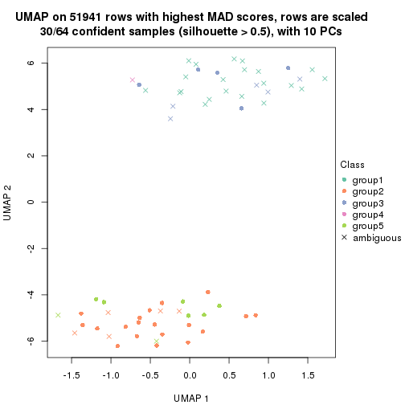</p>

</div>
<div id='tab-MAD-pam-dimension-reduction-5'>
<pre><code class="r">dimension_reduction(res, k = 6, method = &quot;UMAP&quot;)
</code></pre>

<p></p>

</div>
</div>


Following heatmap shows how subgroups are split when increasing `k`:

```r
collect_classes(res)
```


Test correlation between subgroups and known annotations. If the known
annotation is numeric, one-way ANOVA test is applied, and if the known
annotation is discrete, chi-squared contingency table test is applied.

```r
test_to_known_factors(res)
```

```
#>          n disease.state(p) individual(p) k
#> MAD:pam 64         9.19e-15         1.000 2
#> MAD:pam 50         1.39e-11         0.997 3
#> MAD:pam 42         4.01e-09         0.780 4
#> MAD:pam 30         3.06e-07         0.793 5
#> MAD:pam 45         9.25e-10         0.866 6
```


If matrix rows can be associated to genes, consider to use `functional_enrichment(res,
...)` to perform function enrichment for the signature genes. See [this vignette](http://bioconductor.org/packages/devel/bioc/vignettes/cola/inst/doc/functional_enrichment.html) for more detailed explanations.


 

---------------------------------------------------


### MAD:mclust*


The object with results only for a single top-value method and a single partition method 
can be extracted as:

```r
res = res_list["MAD", "mclust"]
# you can also extract it by
# res = res_list["MAD:mclust"]
```

A summary of `res` and all the functions that can be applied to it:

```r
res
```

```
#> A 'ConsensusPartition' object with k = 2, 3, 4, 5, 6.
#>   On a matrix with 51941 rows and 64 columns.
#>   Top rows (1000, 2000, 3000, 4000, 5000) are extracted by 'MAD' method.
#>   Subgroups are detected by 'mclust' method.
#>   Performed in total 1250 partitions by row resampling.
#>   Best k for subgroups seems to be 3.
#> 
#> Following methods can be applied to this 'ConsensusPartition' object:
#>  [1] "cola_report"             "collect_classes"         "collect_plots"          
#>  [4] "collect_stats"           "colnames"                "compare_signatures"     
#>  [7] "consensus_heatmap"       "dimension_reduction"     "functional_enrichment"  
#> [10] "get_anno_col"            "get_anno"                "get_classes"            
#> [13] "get_consensus"           "get_matrix"              "get_membership"         
#> [16] "get_param"               "get_signatures"          "get_stats"              
#> [19] "is_best_k"               "is_stable_k"             "membership_heatmap"     
#> [22] "ncol"                    "nrow"                    "plot_ecdf"              
#> [25] "rownames"                "select_partition_number" "show"                   
#> [28] "suggest_best_k"          "test_to_known_factors"
```

`collect_plots()` function collects all the plots made from `res` for all `k` (number of partitions)
into one single page to provide an easy and fast comparison between different `k`.

```r
collect_plots(res)
```


The plots are:

- The first row: a plot of the ECDF (empirical cumulative distribution
  function) curves of the consensus matrix for each `k` and the heatmap of
  predicted classes for each `k`.
- The second row: heatmaps of the consensus matrix for each `k`.
- The third row: heatmaps of the membership matrix for each `k`.
- The fouth row: heatmaps of the signatures for each `k`.

All the plots in panels can be made by individual functions and they are
plotted later in this section.

`select_partition_number()` produces several plots showing different
statistics for choosing "optimized" `k`. There are following statistics:

- ECDF curves of the consensus matrix for each `k`;
- 1-PAC. [The PAC
  score](https://en.wikipedia.org/wiki/Consensus_clustering#Over-interpretation_potential_of_consensus_clustering)
  measures the proportion of the ambiguous subgrouping.
- Mean silhouette score.
- Concordance. The mean probability of fiting the consensus class ids in all
  partitions.
- Area increased. Denote $A_k$ as the area under the ECDF curve for current
  `k`, the area increased is defined as $A_k - A_{k-1}$.
- Rand index. The percent of pairs of samples that are both in a same cluster
  or both are not in a same cluster in the partition of k and k-1.
- Jaccard index. The ratio of pairs of samples are both in a same cluster in
  the partition of k and k-1 and the pairs of samples are both in a same
  cluster in the partition k or k-1.

The detailed explanations of these statistics can be found in [the _cola_
vignette](http://bioconductor.org/packages/devel/bioc/vignettes/cola/inst/doc/cola.html#toc_13).

Generally speaking, lower PAC score, higher mean silhouette score or higher
concordance corresponds to better partition. Rand index and Jaccard index
measure how similar the current partition is compared to partition with `k-1`.
If they are too similar, we won't accept `k` is better than `k-1`.

```r
select_partition_number(res)
```


The numeric values for all these statistics can be obtained by `get_stats()`.

```r
get_stats(res)
```

```
#>   k 1-PAC mean_silhouette concordance area_increased  Rand Jaccard
#> 2 2 1.000           1.000       1.000         0.5084 0.492   0.492
#> 3 3 0.912           0.862       0.936         0.1098 0.957   0.912
#> 4 4 0.770           0.807       0.892         0.1516 0.915   0.812
#> 5 5 0.682           0.679       0.841         0.0824 0.972   0.926
#> 6 6 0.616           0.668       0.773         0.0630 0.960   0.885
```

`suggest_best_k()` suggests the best $k$ based on these statistics. The rules are as follows:

- All $k$ with Jaccard index larger than 0.95 are removed because increasing
  $k$ does not provide enough extra information. If all $k$ are removed, it is
  marked as no subgroup is detected.
- For all $k$ with 1-PAC score larger than 0.9, the maximal $k$ is taken as
  the best $k$, and other $k$ are marked as optional $k$.
- If it does not fit the second rule. The $k$ with the maximal vote of the
  highest 1-PAC score, highest mean silhouette, and highest concordance is
  taken as the best $k$.

```r
suggest_best_k(res)
```

```
#> [1] 3
#> attr(,"optional")
#> [1] 2
```

There is also optional best $k$ = 2 that is worth to check.

Following shows the table of the partitions (You need to click the **show/hide
code output** link to see it). The membership matrix (columns with name `p*`)
is inferred by
[`clue::cl_consensus()`](https://www.rdocumentation.org/link/cl_consensus?package=clue)
function with the `SE` method. Basically the value in the membership matrix
represents the probability to belong to a certain group. The finall class
label for an item is determined with the group with highest probability it
belongs to.

In `get_classes()` function, the entropy is calculated from the membership
matrix and the silhouette score is calculated from the consensus matrix.


<script>
$( function() {
	$( '#tabs-MAD-mclust-get-classes' ).tabs();
} );
</script>
<div id='tabs-MAD-mclust-get-classes'>
<ul>
<li><a href='#tab-MAD-mclust-get-classes-1'>k = 2</a></li>
<li><a href='#tab-MAD-mclust-get-classes-2'>k = 3</a></li>
<li><a href='#tab-MAD-mclust-get-classes-3'>k = 4</a></li>
<li><a href='#tab-MAD-mclust-get-classes-4'>k = 5</a></li>
<li><a href='#tab-MAD-mclust-get-classes-5'>k = 6</a></li>
</ul>

<div id='tab-MAD-mclust-get-classes-1'>
<p><a id='tab-MAD-mclust-get-classes-1-a' style='color:#0366d6' href='#'>show/hide code output</a></p>
<pre><code class="r">cbind(get_classes(res, k = 2), get_membership(res, k = 2))
</code></pre>

<pre><code>#&gt;           class entropy silhouette p1 p2
#&gt; GSM215051     2       0          1  0  1
#&gt; GSM215052     2       0          1  0  1
#&gt; GSM215053     2       0          1  0  1
#&gt; GSM215054     2       0          1  0  1
#&gt; GSM215055     2       0          1  0  1
#&gt; GSM215056     2       0          1  0  1
#&gt; GSM215057     2       0          1  0  1
#&gt; GSM215058     2       0          1  0  1
#&gt; GSM215059     2       0          1  0  1
#&gt; GSM215060     2       0          1  0  1
#&gt; GSM215061     2       0          1  0  1
#&gt; GSM215062     2       0          1  0  1
#&gt; GSM215063     2       0          1  0  1
#&gt; GSM215064     2       0          1  0  1
#&gt; GSM215065     2       0          1  0  1
#&gt; GSM215066     2       0          1  0  1
#&gt; GSM215067     2       0          1  0  1
#&gt; GSM215068     2       0          1  0  1
#&gt; GSM215069     2       0          1  0  1
#&gt; GSM215070     2       0          1  0  1
#&gt; GSM215071     2       0          1  0  1
#&gt; GSM215072     2       0          1  0  1
#&gt; GSM215073     2       0          1  0  1
#&gt; GSM215074     2       0          1  0  1
#&gt; GSM215075     2       0          1  0  1
#&gt; GSM215076     2       0          1  0  1
#&gt; GSM215077     2       0          1  0  1
#&gt; GSM215078     2       0          1  0  1
#&gt; GSM215079     2       0          1  0  1
#&gt; GSM215080     2       0          1  0  1
#&gt; GSM215081     2       0          1  0  1
#&gt; GSM215082     2       0          1  0  1
#&gt; GSM215083     1       0          1  1  0
#&gt; GSM215084     1       0          1  1  0
#&gt; GSM215085     1       0          1  1  0
#&gt; GSM215086     1       0          1  1  0
#&gt; GSM215087     1       0          1  1  0
#&gt; GSM215088     1       0          1  1  0
#&gt; GSM215089     1       0          1  1  0
#&gt; GSM215090     1       0          1  1  0
#&gt; GSM215091     1       0          1  1  0
#&gt; GSM215092     1       0          1  1  0
#&gt; GSM215093     1       0          1  1  0
#&gt; GSM215094     1       0          1  1  0
#&gt; GSM215095     1       0          1  1  0
#&gt; GSM215096     1       0          1  1  0
#&gt; GSM215097     1       0          1  1  0
#&gt; GSM215098     1       0          1  1  0
#&gt; GSM215099     1       0          1  1  0
#&gt; GSM215100     1       0          1  1  0
#&gt; GSM215101     1       0          1  1  0
#&gt; GSM215102     1       0          1  1  0
#&gt; GSM215103     1       0          1  1  0
#&gt; GSM215104     1       0          1  1  0
#&gt; GSM215105     1       0          1  1  0
#&gt; GSM215106     1       0          1  1  0
#&gt; GSM215107     1       0          1  1  0
#&gt; GSM215108     1       0          1  1  0
#&gt; GSM215109     1       0          1  1  0
#&gt; GSM215110     1       0          1  1  0
#&gt; GSM215111     1       0          1  1  0
#&gt; GSM215112     1       0          1  1  0
#&gt; GSM215113     1       0          1  1  0
#&gt; GSM215114     1       0          1  1  0
</code></pre>

<script>
$('#tab-MAD-mclust-get-classes-1-a').parent().next().next().hide();
$('#tab-MAD-mclust-get-classes-1-a').click(function(){
  $('#tab-MAD-mclust-get-classes-1-a').parent().next().next().toggle();
  return(false);
});
</script>
</div>

<div id='tab-MAD-mclust-get-classes-2'>
<p><a id='tab-MAD-mclust-get-classes-2-a' style='color:#0366d6' href='#'>show/hide code output</a></p>
<pre><code class="r">cbind(get_classes(res, k = 3), get_membership(res, k = 3))
</code></pre>

<pre><code>#&gt;           class entropy silhouette    p1    p2    p3
#&gt; GSM215051     2  0.0424      0.964 0.000 0.992 0.008
#&gt; GSM215052     2  0.0892      0.961 0.000 0.980 0.020
#&gt; GSM215053     2  0.0237      0.964 0.000 0.996 0.004
#&gt; GSM215054     2  0.0592      0.963 0.000 0.988 0.012
#&gt; GSM215055     2  0.0747      0.962 0.000 0.984 0.016
#&gt; GSM215056     2  0.0592      0.963 0.000 0.988 0.012
#&gt; GSM215057     2  0.0747      0.963 0.000 0.984 0.016
#&gt; GSM215058     2  0.1529      0.952 0.000 0.960 0.040
#&gt; GSM215059     2  0.0592      0.963 0.000 0.988 0.012
#&gt; GSM215060     2  0.0592      0.963 0.000 0.988 0.012
#&gt; GSM215061     2  0.0000      0.964 0.000 1.000 0.000
#&gt; GSM215062     2  0.2165      0.937 0.000 0.936 0.064
#&gt; GSM215063     2  0.6126      0.567 0.000 0.600 0.400
#&gt; GSM215064     2  0.2165      0.937 0.000 0.936 0.064
#&gt; GSM215065     2  0.0592      0.963 0.000 0.988 0.012
#&gt; GSM215066     2  0.0237      0.964 0.000 0.996 0.004
#&gt; GSM215067     2  0.6111      0.573 0.000 0.604 0.396
#&gt; GSM215068     2  0.0237      0.964 0.000 0.996 0.004
#&gt; GSM215069     2  0.0000      0.964 0.000 1.000 0.000
#&gt; GSM215070     2  0.0892      0.961 0.000 0.980 0.020
#&gt; GSM215071     2  0.0424      0.964 0.000 0.992 0.008
#&gt; GSM215072     2  0.1163      0.958 0.000 0.972 0.028
#&gt; GSM215073     2  0.0747      0.962 0.000 0.984 0.016
#&gt; GSM215074     2  0.0892      0.962 0.000 0.980 0.020
#&gt; GSM215075     2  0.0237      0.964 0.000 0.996 0.004
#&gt; GSM215076     2  0.2066      0.939 0.000 0.940 0.060
#&gt; GSM215077     2  0.0237      0.964 0.000 0.996 0.004
#&gt; GSM215078     2  0.0000      0.964 0.000 1.000 0.000
#&gt; GSM215079     2  0.0237      0.964 0.000 0.996 0.004
#&gt; GSM215080     2  0.0237      0.964 0.000 0.996 0.004
#&gt; GSM215081     2  0.2066      0.939 0.000 0.940 0.060
#&gt; GSM215082     2  0.0592      0.963 0.000 0.988 0.012
#&gt; GSM215083     1  0.1031      0.879 0.976 0.000 0.024
#&gt; GSM215084     1  0.0000      0.907 1.000 0.000 0.000
#&gt; GSM215085     1  0.5650     -0.210 0.688 0.000 0.312
#&gt; GSM215086     3  0.6291      0.996 0.468 0.000 0.532
#&gt; GSM215087     1  0.0237      0.905 0.996 0.000 0.004
#&gt; GSM215088     1  0.6252     -0.772 0.556 0.000 0.444
#&gt; GSM215089     1  0.0000      0.907 1.000 0.000 0.000
#&gt; GSM215090     1  0.0000      0.907 1.000 0.000 0.000
#&gt; GSM215091     1  0.0592      0.898 0.988 0.000 0.012
#&gt; GSM215092     1  0.0000      0.907 1.000 0.000 0.000
#&gt; GSM215093     3  0.6286      0.991 0.464 0.000 0.536
#&gt; GSM215094     1  0.0237      0.905 0.996 0.000 0.004
#&gt; GSM215095     1  0.0000      0.907 1.000 0.000 0.000
#&gt; GSM215096     1  0.0237      0.905 0.996 0.000 0.004
#&gt; GSM215097     1  0.0000      0.907 1.000 0.000 0.000
#&gt; GSM215098     1  0.0237      0.905 0.996 0.000 0.004
#&gt; GSM215099     1  0.0000      0.907 1.000 0.000 0.000
#&gt; GSM215100     1  0.0000      0.907 1.000 0.000 0.000
#&gt; GSM215101     1  0.0892      0.888 0.980 0.000 0.020
#&gt; GSM215102     1  0.0237      0.904 0.996 0.000 0.004
#&gt; GSM215103     1  0.3116      0.727 0.892 0.000 0.108
#&gt; GSM215104     1  0.0000      0.907 1.000 0.000 0.000
#&gt; GSM215105     1  0.0000      0.907 1.000 0.000 0.000
#&gt; GSM215106     1  0.0000      0.907 1.000 0.000 0.000
#&gt; GSM215107     1  0.0000      0.907 1.000 0.000 0.000
#&gt; GSM215108     1  0.4452      0.455 0.808 0.000 0.192
#&gt; GSM215109     3  0.6291      0.996 0.468 0.000 0.532
#&gt; GSM215110     1  0.4605      0.397 0.796 0.000 0.204
#&gt; GSM215111     1  0.0000      0.907 1.000 0.000 0.000
#&gt; GSM215112     1  0.0237      0.905 0.996 0.000 0.004
#&gt; GSM215113     1  0.0000      0.907 1.000 0.000 0.000
#&gt; GSM215114     1  0.0592      0.898 0.988 0.000 0.012
</code></pre>

<script>
$('#tab-MAD-mclust-get-classes-2-a').parent().next().next().hide();
$('#tab-MAD-mclust-get-classes-2-a').click(function(){
  $('#tab-MAD-mclust-get-classes-2-a').parent().next().next().toggle();
  return(false);
});
</script>
</div>

<div id='tab-MAD-mclust-get-classes-3'>
<p><a id='tab-MAD-mclust-get-classes-3-a' style='color:#0366d6' href='#'>show/hide code output</a></p>
<pre><code class="r">cbind(get_classes(res, k = 4), get_membership(res, k = 4))
</code></pre>

<pre><code>#&gt;           class entropy silhouette    p1    p2    p3    p4
#&gt; GSM215051     2  0.5673      0.156 0.000 0.596 0.032 0.372
#&gt; GSM215052     2  0.1151      0.826 0.000 0.968 0.008 0.024
#&gt; GSM215053     2  0.5659      0.242 0.000 0.600 0.032 0.368
#&gt; GSM215054     2  0.5861     -0.124 0.000 0.492 0.032 0.476
#&gt; GSM215055     2  0.3447      0.789 0.000 0.852 0.020 0.128
#&gt; GSM215056     2  0.4910      0.599 0.000 0.704 0.020 0.276
#&gt; GSM215057     2  0.3219      0.804 0.000 0.868 0.020 0.112
#&gt; GSM215058     2  0.3597      0.724 0.000 0.836 0.016 0.148
#&gt; GSM215059     2  0.3219      0.799 0.000 0.868 0.020 0.112
#&gt; GSM215060     2  0.3392      0.792 0.000 0.856 0.020 0.124
#&gt; GSM215061     2  0.1389      0.828 0.000 0.952 0.000 0.048
#&gt; GSM215062     2  0.4194      0.673 0.000 0.800 0.028 0.172
#&gt; GSM215063     4  0.3444      1.000 0.000 0.184 0.000 0.816
#&gt; GSM215064     2  0.4194      0.673 0.000 0.800 0.028 0.172
#&gt; GSM215065     2  0.2714      0.807 0.000 0.884 0.004 0.112
#&gt; GSM215066     2  0.0188      0.827 0.000 0.996 0.000 0.004
#&gt; GSM215067     4  0.3444      1.000 0.000 0.184 0.000 0.816
#&gt; GSM215068     2  0.0000      0.827 0.000 1.000 0.000 0.000
#&gt; GSM215069     2  0.2053      0.822 0.000 0.924 0.004 0.072
#&gt; GSM215070     2  0.1767      0.830 0.000 0.944 0.012 0.044
#&gt; GSM215071     2  0.1970      0.825 0.000 0.932 0.008 0.060
#&gt; GSM215072     2  0.1356      0.816 0.000 0.960 0.008 0.032
#&gt; GSM215073     2  0.2918      0.805 0.000 0.876 0.008 0.116
#&gt; GSM215074     2  0.3280      0.800 0.000 0.860 0.016 0.124
#&gt; GSM215075     2  0.0376      0.827 0.000 0.992 0.004 0.004
#&gt; GSM215076     2  0.5955      0.377 0.000 0.616 0.056 0.328
#&gt; GSM215077     2  0.0524      0.828 0.000 0.988 0.004 0.008
#&gt; GSM215078     2  0.1576      0.830 0.000 0.948 0.004 0.048
#&gt; GSM215079     2  0.0188      0.827 0.000 0.996 0.000 0.004
#&gt; GSM215080     2  0.0000      0.827 0.000 1.000 0.000 0.000
#&gt; GSM215081     2  0.4149      0.678 0.000 0.804 0.028 0.168
#&gt; GSM215082     2  0.0657      0.829 0.000 0.984 0.004 0.012
#&gt; GSM215083     1  0.3257      0.769 0.844 0.000 0.152 0.004
#&gt; GSM215084     1  0.0524      0.970 0.988 0.000 0.004 0.008
#&gt; GSM215085     3  0.4401      0.731 0.272 0.000 0.724 0.004
#&gt; GSM215086     3  0.2216      0.734 0.092 0.000 0.908 0.000
#&gt; GSM215087     1  0.0376      0.970 0.992 0.000 0.004 0.004
#&gt; GSM215088     3  0.3074      0.754 0.152 0.000 0.848 0.000
#&gt; GSM215089     1  0.0000      0.972 1.000 0.000 0.000 0.000
#&gt; GSM215090     1  0.0672      0.969 0.984 0.000 0.008 0.008
#&gt; GSM215091     1  0.0376      0.970 0.992 0.000 0.004 0.004
#&gt; GSM215092     1  0.0376      0.971 0.992 0.000 0.004 0.004
#&gt; GSM215093     3  0.2480      0.728 0.088 0.000 0.904 0.008
#&gt; GSM215094     1  0.0188      0.971 0.996 0.000 0.004 0.000
#&gt; GSM215095     1  0.0188      0.971 0.996 0.000 0.000 0.004
#&gt; GSM215096     1  0.0188      0.971 0.996 0.000 0.000 0.004
#&gt; GSM215097     1  0.0376      0.971 0.992 0.000 0.004 0.004
#&gt; GSM215098     1  0.0376      0.970 0.992 0.000 0.004 0.004
#&gt; GSM215099     1  0.0524      0.970 0.988 0.000 0.004 0.008
#&gt; GSM215100     1  0.0524      0.970 0.988 0.000 0.004 0.008
#&gt; GSM215101     1  0.0657      0.966 0.984 0.000 0.012 0.004
#&gt; GSM215102     1  0.1389      0.930 0.952 0.000 0.048 0.000
#&gt; GSM215103     1  0.3710      0.693 0.804 0.000 0.192 0.004
#&gt; GSM215104     1  0.0376      0.971 0.992 0.000 0.004 0.004
#&gt; GSM215105     1  0.0000      0.972 1.000 0.000 0.000 0.000
#&gt; GSM215106     1  0.0376      0.971 0.992 0.000 0.004 0.004
#&gt; GSM215107     1  0.0376      0.971 0.992 0.000 0.004 0.004
#&gt; GSM215108     3  0.5132      0.506 0.448 0.000 0.548 0.004
#&gt; GSM215109     3  0.2216      0.734 0.092 0.000 0.908 0.000
#&gt; GSM215110     3  0.4933      0.558 0.432 0.000 0.568 0.000
#&gt; GSM215111     1  0.0000      0.972 1.000 0.000 0.000 0.000
#&gt; GSM215112     1  0.0376      0.971 0.992 0.000 0.004 0.004
#&gt; GSM215113     1  0.0376      0.971 0.992 0.000 0.004 0.004
#&gt; GSM215114     1  0.0657      0.966 0.984 0.000 0.012 0.004
</code></pre>

<script>
$('#tab-MAD-mclust-get-classes-3-a').parent().next().next().hide();
$('#tab-MAD-mclust-get-classes-3-a').click(function(){
  $('#tab-MAD-mclust-get-classes-3-a').parent().next().next().toggle();
  return(false);
});
</script>
</div>

<div id='tab-MAD-mclust-get-classes-4'>
<p><a id='tab-MAD-mclust-get-classes-4-a' style='color:#0366d6' href='#'>show/hide code output</a></p>
<pre><code class="r">cbind(get_classes(res, k = 5), get_membership(res, k = 5))
</code></pre>

<pre><code>#&gt;           class entropy silhouette    p1    p2    p3    p4    p5
#&gt; GSM215051     2  0.6300    -0.6335 0.000 0.428 0.000 0.152 0.420
#&gt; GSM215052     2  0.3841     0.4707 0.000 0.780 0.000 0.032 0.188
#&gt; GSM215053     2  0.6439    -0.6390 0.000 0.416 0.000 0.176 0.408
#&gt; GSM215054     5  0.6742     0.4266 0.000 0.276 0.000 0.316 0.408
#&gt; GSM215055     2  0.4593     0.6278 0.000 0.736 0.000 0.184 0.080
#&gt; GSM215056     2  0.6572    -0.0946 0.000 0.460 0.000 0.312 0.228
#&gt; GSM215057     2  0.4133     0.6478 0.000 0.768 0.000 0.180 0.052
#&gt; GSM215058     2  0.5546    -0.2782 0.000 0.576 0.000 0.084 0.340
#&gt; GSM215059     2  0.3883     0.6451 0.000 0.780 0.000 0.184 0.036
#&gt; GSM215060     2  0.3810     0.6661 0.000 0.792 0.000 0.168 0.040
#&gt; GSM215061     2  0.1741     0.7111 0.000 0.936 0.000 0.040 0.024
#&gt; GSM215062     2  0.3838     0.4658 0.000 0.716 0.000 0.004 0.280
#&gt; GSM215063     4  0.1341     0.9898 0.000 0.056 0.000 0.944 0.000
#&gt; GSM215064     2  0.3838     0.4658 0.000 0.716 0.000 0.004 0.280
#&gt; GSM215065     2  0.3513     0.6605 0.000 0.800 0.000 0.180 0.020
#&gt; GSM215066     2  0.0451     0.7120 0.000 0.988 0.000 0.008 0.004
#&gt; GSM215067     4  0.1410     0.9897 0.000 0.060 0.000 0.940 0.000
#&gt; GSM215068     2  0.0162     0.7113 0.000 0.996 0.000 0.004 0.000
#&gt; GSM215069     2  0.2079     0.7091 0.000 0.916 0.000 0.064 0.020
#&gt; GSM215070     2  0.2221     0.7019 0.000 0.912 0.000 0.036 0.052
#&gt; GSM215071     2  0.1965     0.7120 0.000 0.924 0.000 0.052 0.024
#&gt; GSM215072     2  0.2573     0.6564 0.000 0.880 0.000 0.016 0.104
#&gt; GSM215073     2  0.3577     0.6693 0.000 0.808 0.000 0.160 0.032
#&gt; GSM215074     2  0.3958     0.6622 0.000 0.780 0.000 0.176 0.044
#&gt; GSM215075     2  0.1300     0.7077 0.000 0.956 0.000 0.016 0.028
#&gt; GSM215076     5  0.5200     0.5242 0.000 0.304 0.000 0.068 0.628
#&gt; GSM215077     2  0.1195     0.7076 0.000 0.960 0.000 0.012 0.028
#&gt; GSM215078     2  0.3555     0.6189 0.000 0.824 0.000 0.052 0.124
#&gt; GSM215079     2  0.0566     0.7103 0.000 0.984 0.000 0.004 0.012
#&gt; GSM215080     2  0.0290     0.7089 0.000 0.992 0.000 0.000 0.008
#&gt; GSM215081     2  0.3741     0.4933 0.000 0.732 0.000 0.004 0.264
#&gt; GSM215082     2  0.0693     0.7093 0.000 0.980 0.000 0.008 0.012
#&gt; GSM215083     1  0.5153     0.6470 0.704 0.000 0.208 0.016 0.072
#&gt; GSM215084     1  0.1942     0.8892 0.920 0.000 0.000 0.012 0.068
#&gt; GSM215085     3  0.4350     0.7129 0.152 0.000 0.780 0.016 0.052
#&gt; GSM215086     3  0.0324     0.7075 0.004 0.000 0.992 0.004 0.000
#&gt; GSM215087     1  0.2674     0.8829 0.888 0.000 0.008 0.020 0.084
#&gt; GSM215088     3  0.2972     0.7368 0.084 0.000 0.872 0.004 0.040
#&gt; GSM215089     1  0.0727     0.9112 0.980 0.000 0.004 0.004 0.012
#&gt; GSM215090     1  0.2403     0.8843 0.904 0.000 0.012 0.012 0.072
#&gt; GSM215091     1  0.2900     0.8756 0.876 0.000 0.012 0.020 0.092
#&gt; GSM215092     1  0.0955     0.9092 0.968 0.000 0.000 0.004 0.028
#&gt; GSM215093     3  0.1644     0.7012 0.008 0.000 0.940 0.004 0.048
#&gt; GSM215094     1  0.0968     0.9115 0.972 0.000 0.004 0.012 0.012
#&gt; GSM215095     1  0.1195     0.9117 0.960 0.000 0.000 0.012 0.028
#&gt; GSM215096     1  0.2331     0.8920 0.908 0.000 0.008 0.016 0.068
#&gt; GSM215097     1  0.2604     0.8928 0.896 0.000 0.012 0.020 0.072
#&gt; GSM215098     1  0.1913     0.9033 0.932 0.000 0.008 0.016 0.044
#&gt; GSM215099     1  0.2006     0.8869 0.916 0.000 0.000 0.012 0.072
#&gt; GSM215100     1  0.2166     0.8855 0.912 0.000 0.004 0.012 0.072
#&gt; GSM215101     1  0.3047     0.8714 0.868 0.000 0.012 0.024 0.096
#&gt; GSM215102     1  0.2916     0.8682 0.880 0.000 0.072 0.008 0.040
#&gt; GSM215103     1  0.5324     0.6198 0.684 0.000 0.224 0.016 0.076
#&gt; GSM215104     1  0.1041     0.9089 0.964 0.000 0.004 0.000 0.032
#&gt; GSM215105     1  0.1444     0.9076 0.948 0.000 0.000 0.012 0.040
#&gt; GSM215106     1  0.1408     0.9083 0.948 0.000 0.000 0.008 0.044
#&gt; GSM215107     1  0.0912     0.9086 0.972 0.000 0.000 0.012 0.016
#&gt; GSM215108     3  0.5132     0.6241 0.276 0.000 0.664 0.012 0.048
#&gt; GSM215109     3  0.0324     0.7075 0.004 0.000 0.992 0.004 0.000
#&gt; GSM215110     3  0.5388     0.5332 0.360 0.000 0.580 0.004 0.056
#&gt; GSM215111     1  0.1444     0.9076 0.948 0.000 0.000 0.012 0.040
#&gt; GSM215112     1  0.0960     0.9124 0.972 0.000 0.004 0.008 0.016
#&gt; GSM215113     1  0.1195     0.9058 0.960 0.000 0.000 0.012 0.028
#&gt; GSM215114     1  0.3150     0.8698 0.864 0.000 0.016 0.024 0.096
</code></pre>

<script>
$('#tab-MAD-mclust-get-classes-4-a').parent().next().next().hide();
$('#tab-MAD-mclust-get-classes-4-a').click(function(){
  $('#tab-MAD-mclust-get-classes-4-a').parent().next().next().toggle();
  return(false);
});
</script>
</div>

<div id='tab-MAD-mclust-get-classes-5'>
<p><a id='tab-MAD-mclust-get-classes-5-a' style='color:#0366d6' href='#'>show/hide code output</a></p>
<pre><code class="r">cbind(get_classes(res, k = 6), get_membership(res, k = 6))
</code></pre>

<pre><code>#&gt;           class entropy silhouette    p1    p2    p3    p4    p5    p6
#&gt; GSM215051     4  0.5461     0.7140 0.000 0.336 0.000 0.556 0.092 0.016
#&gt; GSM215052     2  0.4985     0.2289 0.000 0.660 0.000 0.252 0.032 0.056
#&gt; GSM215053     4  0.5472     0.7088 0.000 0.328 0.000 0.556 0.104 0.012
#&gt; GSM215054     4  0.5852     0.5048 0.000 0.192 0.000 0.544 0.252 0.012
#&gt; GSM215055     2  0.5843     0.5747 0.000 0.636 0.000 0.088 0.152 0.124
#&gt; GSM215056     2  0.7298    -0.0745 0.000 0.396 0.000 0.232 0.252 0.120
#&gt; GSM215057     2  0.5470     0.6060 0.000 0.672 0.000 0.068 0.136 0.124
#&gt; GSM215058     4  0.5313     0.4543 0.000 0.464 0.000 0.464 0.036 0.036
#&gt; GSM215059     2  0.4488     0.6581 0.000 0.752 0.000 0.060 0.140 0.048
#&gt; GSM215060     2  0.5005     0.6397 0.000 0.712 0.000 0.068 0.148 0.072
#&gt; GSM215061     2  0.2365     0.6911 0.000 0.896 0.000 0.068 0.024 0.012
#&gt; GSM215062     2  0.4659     0.3977 0.000 0.612 0.004 0.336 0.000 0.048
#&gt; GSM215063     5  0.0891     1.0000 0.000 0.024 0.000 0.008 0.968 0.000
#&gt; GSM215064     2  0.4672     0.3940 0.000 0.608 0.004 0.340 0.000 0.048
#&gt; GSM215065     2  0.4029     0.6738 0.000 0.784 0.000 0.052 0.132 0.032
#&gt; GSM215066     2  0.1498     0.6943 0.000 0.940 0.000 0.032 0.000 0.028
#&gt; GSM215067     5  0.0891     1.0000 0.000 0.024 0.000 0.008 0.968 0.000
#&gt; GSM215068     2  0.1565     0.6981 0.000 0.940 0.000 0.028 0.004 0.028
#&gt; GSM215069     2  0.2972     0.7023 0.000 0.868 0.000 0.052 0.048 0.032
#&gt; GSM215070     2  0.3332     0.6610 0.000 0.840 0.000 0.072 0.020 0.068
#&gt; GSM215071     2  0.2171     0.7086 0.000 0.912 0.000 0.040 0.032 0.016
#&gt; GSM215072     2  0.3958     0.5907 0.000 0.784 0.000 0.136 0.020 0.060
#&gt; GSM215073     2  0.3760     0.6780 0.000 0.800 0.000 0.052 0.128 0.020
#&gt; GSM215074     2  0.5241     0.6364 0.000 0.692 0.000 0.076 0.152 0.080
#&gt; GSM215075     2  0.2349     0.6732 0.000 0.892 0.000 0.080 0.008 0.020
#&gt; GSM215076     4  0.3407     0.5042 0.000 0.168 0.000 0.800 0.016 0.016
#&gt; GSM215077     2  0.2527     0.6685 0.000 0.880 0.000 0.084 0.004 0.032
#&gt; GSM215078     2  0.4738     0.4817 0.000 0.712 0.000 0.192 0.056 0.040
#&gt; GSM215079     2  0.1480     0.6909 0.000 0.940 0.000 0.040 0.000 0.020
#&gt; GSM215080     2  0.1408     0.6917 0.000 0.944 0.000 0.036 0.000 0.020
#&gt; GSM215081     2  0.4522     0.4531 0.000 0.648 0.004 0.300 0.000 0.048
#&gt; GSM215082     2  0.1832     0.7042 0.000 0.928 0.000 0.032 0.008 0.032
#&gt; GSM215083     1  0.5664     0.4206 0.548 0.000 0.264 0.000 0.004 0.184
#&gt; GSM215084     1  0.2664     0.7267 0.816 0.000 0.000 0.000 0.000 0.184
#&gt; GSM215085     3  0.3973     0.7154 0.084 0.000 0.768 0.000 0.004 0.144
#&gt; GSM215086     3  0.0291     0.7096 0.004 0.000 0.992 0.000 0.004 0.000
#&gt; GSM215087     1  0.3330     0.7402 0.716 0.000 0.000 0.000 0.000 0.284
#&gt; GSM215088     3  0.3510     0.7339 0.032 0.000 0.812 0.020 0.000 0.136
#&gt; GSM215089     1  0.1753     0.8202 0.912 0.000 0.004 0.000 0.000 0.084
#&gt; GSM215090     1  0.2902     0.7170 0.800 0.000 0.004 0.000 0.000 0.196
#&gt; GSM215091     1  0.3830     0.6788 0.620 0.000 0.004 0.000 0.000 0.376
#&gt; GSM215092     1  0.1910     0.8150 0.892 0.000 0.000 0.000 0.000 0.108
#&gt; GSM215093     3  0.4315     0.6279 0.012 0.000 0.776 0.032 0.048 0.132
#&gt; GSM215094     1  0.1444     0.8166 0.928 0.000 0.000 0.000 0.000 0.072
#&gt; GSM215095     1  0.1501     0.8136 0.924 0.000 0.000 0.000 0.000 0.076
#&gt; GSM215096     1  0.3383     0.7568 0.728 0.000 0.004 0.000 0.000 0.268
#&gt; GSM215097     1  0.3424     0.7800 0.780 0.000 0.020 0.000 0.004 0.196
#&gt; GSM215098     1  0.2462     0.8072 0.860 0.000 0.004 0.000 0.004 0.132
#&gt; GSM215099     1  0.2762     0.7191 0.804 0.000 0.000 0.000 0.000 0.196
#&gt; GSM215100     1  0.2871     0.7138 0.804 0.000 0.004 0.000 0.000 0.192
#&gt; GSM215101     1  0.3684     0.6746 0.628 0.000 0.000 0.000 0.000 0.372
#&gt; GSM215102     1  0.4151     0.7406 0.744 0.000 0.076 0.000 0.004 0.176
#&gt; GSM215103     1  0.5536     0.5244 0.536 0.000 0.164 0.000 0.000 0.300
#&gt; GSM215104     1  0.1949     0.8127 0.904 0.000 0.004 0.000 0.004 0.088
#&gt; GSM215105     1  0.1204     0.8118 0.944 0.000 0.000 0.000 0.000 0.056
#&gt; GSM215106     1  0.2053     0.8098 0.888 0.000 0.004 0.000 0.000 0.108
#&gt; GSM215107     1  0.0790     0.8142 0.968 0.000 0.000 0.000 0.000 0.032
#&gt; GSM215108     3  0.5207     0.6158 0.212 0.000 0.628 0.000 0.004 0.156
#&gt; GSM215109     3  0.0436     0.7091 0.004 0.000 0.988 0.000 0.004 0.004
#&gt; GSM215110     3  0.5572     0.5766 0.260 0.000 0.588 0.008 0.004 0.140
#&gt; GSM215111     1  0.0632     0.8126 0.976 0.000 0.000 0.000 0.000 0.024
#&gt; GSM215112     1  0.1327     0.8156 0.936 0.000 0.000 0.000 0.000 0.064
#&gt; GSM215113     1  0.0790     0.8081 0.968 0.000 0.000 0.000 0.000 0.032
#&gt; GSM215114     1  0.3659     0.6777 0.636 0.000 0.000 0.000 0.000 0.364
</code></pre>

<script>
$('#tab-MAD-mclust-get-classes-5-a').parent().next().next().hide();
$('#tab-MAD-mclust-get-classes-5-a').click(function(){
  $('#tab-MAD-mclust-get-classes-5-a').parent().next().next().toggle();
  return(false);
});
</script>
</div>
</div>

Heatmaps for the consensus matrix. It visualizes the probability of two
samples to be in a same group.


<script>
$( function() {
	$( '#tabs-MAD-mclust-consensus-heatmap' ).tabs();
} );
</script>
<div id='tabs-MAD-mclust-consensus-heatmap'>
<ul>
<li><a href='#tab-MAD-mclust-consensus-heatmap-1'>k = 2</a></li>
<li><a href='#tab-MAD-mclust-consensus-heatmap-2'>k = 3</a></li>
<li><a href='#tab-MAD-mclust-consensus-heatmap-3'>k = 4</a></li>
<li><a href='#tab-MAD-mclust-consensus-heatmap-4'>k = 5</a></li>
<li><a href='#tab-MAD-mclust-consensus-heatmap-5'>k = 6</a></li>
</ul>
<div id='tab-MAD-mclust-consensus-heatmap-1'>
<pre><code class="r">consensus_heatmap(res, k = 2)
</code></pre>

<p></p>

</div>
<div id='tab-MAD-mclust-consensus-heatmap-2'>
<pre><code class="r">consensus_heatmap(res, k = 3)
</code></pre>

<p></p>

</div>
<div id='tab-MAD-mclust-consensus-heatmap-3'>
<pre><code class="r">consensus_heatmap(res, k = 4)
</code></pre>

<p></p>

</div>
<div id='tab-MAD-mclust-consensus-heatmap-4'>
<pre><code class="r">consensus_heatmap(res, k = 5)
</code></pre>

<p></p>

</div>
<div id='tab-MAD-mclust-consensus-heatmap-5'>
<pre><code class="r">consensus_heatmap(res, k = 6)
</code></pre>

<p></p>

</div>
</div>

Heatmaps for the membership of samples in all partitions to see how consistent they are:


<script>
$( function() {
	$( '#tabs-MAD-mclust-membership-heatmap' ).tabs();
} );
</script>
<div id='tabs-MAD-mclust-membership-heatmap'>
<ul>
<li><a href='#tab-MAD-mclust-membership-heatmap-1'>k = 2</a></li>
<li><a href='#tab-MAD-mclust-membership-heatmap-2'>k = 3</a></li>
<li><a href='#tab-MAD-mclust-membership-heatmap-3'>k = 4</a></li>
<li><a href='#tab-MAD-mclust-membership-heatmap-4'>k = 5</a></li>
<li><a href='#tab-MAD-mclust-membership-heatmap-5'>k = 6</a></li>
</ul>
<div id='tab-MAD-mclust-membership-heatmap-1'>
<pre><code class="r">membership_heatmap(res, k = 2)
</code></pre>

<p></p>

</div>
<div id='tab-MAD-mclust-membership-heatmap-2'>
<pre><code class="r">membership_heatmap(res, k = 3)
</code></pre>

<p></p>

</div>
<div id='tab-MAD-mclust-membership-heatmap-3'>
<pre><code class="r">membership_heatmap(res, k = 4)
</code></pre>

<p></p>

</div>
<div id='tab-MAD-mclust-membership-heatmap-4'>
<pre><code class="r">membership_heatmap(res, k = 5)
</code></pre>

<p></p>

</div>
<div id='tab-MAD-mclust-membership-heatmap-5'>
<pre><code class="r">membership_heatmap(res, k = 6)
</code></pre>

<p></p>

</div>
</div>

As soon as we have had the classes for columns, we can look for signatures
which are significantly different between classes which can be candidate marks
for certain classes. Following are the heatmaps for signatures.


Signature heatmaps where rows are scaled:


<script>
$( function() {
	$( '#tabs-MAD-mclust-get-signatures' ).tabs();
} );
</script>
<div id='tabs-MAD-mclust-get-signatures'>
<ul>
<li><a href='#tab-MAD-mclust-get-signatures-1'>k = 2</a></li>
<li><a href='#tab-MAD-mclust-get-signatures-2'>k = 3</a></li>
<li><a href='#tab-MAD-mclust-get-signatures-3'>k = 4</a></li>
<li><a href='#tab-MAD-mclust-get-signatures-4'>k = 5</a></li>
<li><a href='#tab-MAD-mclust-get-signatures-5'>k = 6</a></li>
</ul>
<div id='tab-MAD-mclust-get-signatures-1'>
<pre><code class="r">get_signatures(res, k = 2)
</code></pre>

<p></p>

</div>
<div id='tab-MAD-mclust-get-signatures-2'>
<pre><code class="r">get_signatures(res, k = 3)
</code></pre>

<p></p>

</div>
<div id='tab-MAD-mclust-get-signatures-3'>
<pre><code class="r">get_signatures(res, k = 4)
</code></pre>

<p></p>

</div>
<div id='tab-MAD-mclust-get-signatures-4'>
<pre><code class="r">get_signatures(res, k = 5)
</code></pre>

<p></p>

</div>
<div id='tab-MAD-mclust-get-signatures-5'>
<pre><code class="r">get_signatures(res, k = 6)
</code></pre>

<p></p>

</div>
</div>


Signature heatmaps where rows are not scaled:


<script>
$( function() {
	$( '#tabs-MAD-mclust-get-signatures-no-scale' ).tabs();
} );
</script>
<div id='tabs-MAD-mclust-get-signatures-no-scale'>
<ul>
<li><a href='#tab-MAD-mclust-get-signatures-no-scale-1'>k = 2</a></li>
<li><a href='#tab-MAD-mclust-get-signatures-no-scale-2'>k = 3</a></li>
<li><a href='#tab-MAD-mclust-get-signatures-no-scale-3'>k = 4</a></li>
<li><a href='#tab-MAD-mclust-get-signatures-no-scale-4'>k = 5</a></li>
<li><a href='#tab-MAD-mclust-get-signatures-no-scale-5'>k = 6</a></li>
</ul>
<div id='tab-MAD-mclust-get-signatures-no-scale-1'>
<pre><code class="r">get_signatures(res, k = 2, scale_rows = FALSE)
</code></pre>

<p></p>

</div>
<div id='tab-MAD-mclust-get-signatures-no-scale-2'>
<pre><code class="r">get_signatures(res, k = 3, scale_rows = FALSE)
</code></pre>

<p></p>

</div>
<div id='tab-MAD-mclust-get-signatures-no-scale-3'>
<pre><code class="r">get_signatures(res, k = 4, scale_rows = FALSE)
</code></pre>

<p></p>

</div>
<div id='tab-MAD-mclust-get-signatures-no-scale-4'>
<pre><code class="r">get_signatures(res, k = 5, scale_rows = FALSE)
</code></pre>

<p></p>

</div>
<div id='tab-MAD-mclust-get-signatures-no-scale-5'>
<pre><code class="r">get_signatures(res, k = 6, scale_rows = FALSE)
</code></pre>

<p></p>

</div>
</div>


Compare the overlap of signatures from different k:

```r
compare_signatures(res)
```


`get_signature()` returns a data frame invisibly. TO get the list of signatures, the function
call should be assigned to a variable explicitly. In following code, if `plot` argument is set
to `FALSE`, no heatmap is plotted while only the differential analysis is performed.

```r
# code only for demonstration
tb = get_signature(res, k = ..., plot = FALSE)
```

An example of the output of `tb` is:

```
#>   which_row         fdr    mean_1    mean_2 scaled_mean_1 scaled_mean_2 km
#> 1        38 0.042760348  8.373488  9.131774    -0.5533452     0.5164555  1
#> 2        40 0.018707592  7.106213  8.469186    -0.6173731     0.5762149  1
#> 3        55 0.019134737 10.221463 11.207825    -0.6159697     0.5749050  1
#> 4        59 0.006059896  5.921854  7.869574    -0.6899429     0.6439467  1
#> 5        60 0.018055526  8.928898 10.211722    -0.6204761     0.5791110  1
#> 6        98 0.009384629 15.714769 14.887706     0.6635654    -0.6193277  2
...
```

The columns in `tb` are:

1. `which_row`: row indices corresponding to the input matrix.
2. `fdr`: FDR for the differential test. 
3. `mean_x`: The mean value in group x.
4. `scaled_mean_x`: The mean value in group x after rows are scaled.
5. `km`: Row groups if k-means clustering is applied to rows.


UMAP plot which shows how samples are separated.


<script>
$( function() {
	$( '#tabs-MAD-mclust-dimension-reduction' ).tabs();
} );
</script>
<div id='tabs-MAD-mclust-dimension-reduction'>
<ul>
<li><a href='#tab-MAD-mclust-dimension-reduction-1'>k = 2</a></li>
<li><a href='#tab-MAD-mclust-dimension-reduction-2'>k = 3</a></li>
<li><a href='#tab-MAD-mclust-dimension-reduction-3'>k = 4</a></li>
<li><a href='#tab-MAD-mclust-dimension-reduction-4'>k = 5</a></li>
<li><a href='#tab-MAD-mclust-dimension-reduction-5'>k = 6</a></li>
</ul>
<div id='tab-MAD-mclust-dimension-reduction-1'>
<pre><code class="r">dimension_reduction(res, k = 2, method = &quot;UMAP&quot;)
</code></pre>

<p></p>

</div>
<div id='tab-MAD-mclust-dimension-reduction-2'>
<pre><code class="r">dimension_reduction(res, k = 3, method = &quot;UMAP&quot;)
</code></pre>

<p></p>

</div>
<div id='tab-MAD-mclust-dimension-reduction-3'>
<pre><code class="r">dimension_reduction(res, k = 4, method = &quot;UMAP&quot;)
</code></pre>

<p></p>

</div>
<div id='tab-MAD-mclust-dimension-reduction-4'>
<pre><code class="r">dimension_reduction(res, k = 5, method = &quot;UMAP&quot;)
</code></pre>

<p></p>

</div>
<div id='tab-MAD-mclust-dimension-reduction-5'>
<pre><code class="r">dimension_reduction(res, k = 6, method = &quot;UMAP&quot;)
</code></pre>

<p></p>

</div>
</div>


Following heatmap shows how subgroups are split when increasing `k`:

```r
collect_classes(res)
```


Test correlation between subgroups and known annotations. If the known
annotation is numeric, one-way ANOVA test is applied, and if the known
annotation is discrete, chi-squared contingency table test is applied.

```r
test_to_known_factors(res)
```

```
#>             n disease.state(p) individual(p) k
#> MAD:mclust 64         9.19e-15         1.000 2
#> MAD:mclust 60         9.36e-14         0.999 3
#> MAD:mclust 60         5.88e-13         0.926 4
#> MAD:mclust 55         3.25e-11         0.937 5
#> MAD:mclust 56         2.01e-11         0.893 6
```


If matrix rows can be associated to genes, consider to use `functional_enrichment(res,
...)` to perform function enrichment for the signature genes. See [this vignette](http://bioconductor.org/packages/devel/bioc/vignettes/cola/inst/doc/functional_enrichment.html) for more detailed explanations.


 

---------------------------------------------------


### MAD:NMF**


The object with results only for a single top-value method and a single partition method 
can be extracted as:

```r
res = res_list["MAD", "NMF"]
# you can also extract it by
# res = res_list["MAD:NMF"]
```

A summary of `res` and all the functions that can be applied to it:

```r
res
```

```
#> A 'ConsensusPartition' object with k = 2, 3, 4, 5, 6.
#>   On a matrix with 51941 rows and 64 columns.
#>   Top rows (1000, 2000, 3000, 4000, 5000) are extracted by 'MAD' method.
#>   Subgroups are detected by 'NMF' method.
#>   Performed in total 1250 partitions by row resampling.
#>   Best k for subgroups seems to be 2.
#> 
#> Following methods can be applied to this 'ConsensusPartition' object:
#>  [1] "cola_report"             "collect_classes"         "collect_plots"          
#>  [4] "collect_stats"           "colnames"                "compare_signatures"     
#>  [7] "consensus_heatmap"       "dimension_reduction"     "functional_enrichment"  
#> [10] "get_anno_col"            "get_anno"                "get_classes"            
#> [13] "get_consensus"           "get_matrix"              "get_membership"         
#> [16] "get_param"               "get_signatures"          "get_stats"              
#> [19] "is_best_k"               "is_stable_k"             "membership_heatmap"     
#> [22] "ncol"                    "nrow"                    "plot_ecdf"              
#> [25] "rownames"                "select_partition_number" "show"                   
#> [28] "suggest_best_k"          "test_to_known_factors"
```

`collect_plots()` function collects all the plots made from `res` for all `k` (number of partitions)
into one single page to provide an easy and fast comparison between different `k`.

```r
collect_plots(res)
```


The plots are:

- The first row: a plot of the ECDF (empirical cumulative distribution
  function) curves of the consensus matrix for each `k` and the heatmap of
  predicted classes for each `k`.
- The second row: heatmaps of the consensus matrix for each `k`.
- The third row: heatmaps of the membership matrix for each `k`.
- The fouth row: heatmaps of the signatures for each `k`.

All the plots in panels can be made by individual functions and they are
plotted later in this section.

`select_partition_number()` produces several plots showing different
statistics for choosing "optimized" `k`. There are following statistics:

- ECDF curves of the consensus matrix for each `k`;
- 1-PAC. [The PAC
  score](https://en.wikipedia.org/wiki/Consensus_clustering#Over-interpretation_potential_of_consensus_clustering)
  measures the proportion of the ambiguous subgrouping.
- Mean silhouette score.
- Concordance. The mean probability of fiting the consensus class ids in all
  partitions.
- Area increased. Denote $A_k$ as the area under the ECDF curve for current
  `k`, the area increased is defined as $A_k - A_{k-1}$.
- Rand index. The percent of pairs of samples that are both in a same cluster
  or both are not in a same cluster in the partition of k and k-1.
- Jaccard index. The ratio of pairs of samples are both in a same cluster in
  the partition of k and k-1 and the pairs of samples are both in a same
  cluster in the partition k or k-1.

The detailed explanations of these statistics can be found in [the _cola_
vignette](http://bioconductor.org/packages/devel/bioc/vignettes/cola/inst/doc/cola.html#toc_13).

Generally speaking, lower PAC score, higher mean silhouette score or higher
concordance corresponds to better partition. Rand index and Jaccard index
measure how similar the current partition is compared to partition with `k-1`.
If they are too similar, we won't accept `k` is better than `k-1`.

```r
select_partition_number(res)
```


The numeric values for all these statistics can be obtained by `get_stats()`.

```r
get_stats(res)
```

```
#>   k 1-PAC mean_silhouette concordance area_increased  Rand Jaccard
#> 2 2 1.000           1.000       1.000         0.5084 0.492   0.492
#> 3 3 0.764           0.809       0.897         0.1883 0.944   0.887
#> 4 4 0.559           0.765       0.815         0.1152 0.957   0.902
#> 5 5 0.538           0.551       0.720         0.0888 0.941   0.856
#> 6 6 0.536           0.395       0.652         0.0603 0.969   0.912
```

`suggest_best_k()` suggests the best $k$ based on these statistics. The rules are as follows:

- All $k$ with Jaccard index larger than 0.95 are removed because increasing
  $k$ does not provide enough extra information. If all $k$ are removed, it is
  marked as no subgroup is detected.
- For all $k$ with 1-PAC score larger than 0.9, the maximal $k$ is taken as
  the best $k$, and other $k$ are marked as optional $k$.
- If it does not fit the second rule. The $k$ with the maximal vote of the
  highest 1-PAC score, highest mean silhouette, and highest concordance is
  taken as the best $k$.

```r
suggest_best_k(res)
```

```
#> [1] 2
```


Following shows the table of the partitions (You need to click the **show/hide
code output** link to see it). The membership matrix (columns with name `p*`)
is inferred by
[`clue::cl_consensus()`](https://www.rdocumentation.org/link/cl_consensus?package=clue)
function with the `SE` method. Basically the value in the membership matrix
represents the probability to belong to a certain group. The finall class
label for an item is determined with the group with highest probability it
belongs to.

In `get_classes()` function, the entropy is calculated from the membership
matrix and the silhouette score is calculated from the consensus matrix.


<script>
$( function() {
	$( '#tabs-MAD-NMF-get-classes' ).tabs();
} );
</script>
<div id='tabs-MAD-NMF-get-classes'>
<ul>
<li><a href='#tab-MAD-NMF-get-classes-1'>k = 2</a></li>
<li><a href='#tab-MAD-NMF-get-classes-2'>k = 3</a></li>
<li><a href='#tab-MAD-NMF-get-classes-3'>k = 4</a></li>
<li><a href='#tab-MAD-NMF-get-classes-4'>k = 5</a></li>
<li><a href='#tab-MAD-NMF-get-classes-5'>k = 6</a></li>
</ul>

<div id='tab-MAD-NMF-get-classes-1'>
<p><a id='tab-MAD-NMF-get-classes-1-a' style='color:#0366d6' href='#'>show/hide code output</a></p>
<pre><code class="r">cbind(get_classes(res, k = 2), get_membership(res, k = 2))
</code></pre>

<pre><code>#&gt;           class entropy silhouette p1 p2
#&gt; GSM215051     2       0          1  0  1
#&gt; GSM215052     2       0          1  0  1
#&gt; GSM215053     2       0          1  0  1
#&gt; GSM215054     2       0          1  0  1
#&gt; GSM215055     2       0          1  0  1
#&gt; GSM215056     2       0          1  0  1
#&gt; GSM215057     2       0          1  0  1
#&gt; GSM215058     2       0          1  0  1
#&gt; GSM215059     2       0          1  0  1
#&gt; GSM215060     2       0          1  0  1
#&gt; GSM215061     2       0          1  0  1
#&gt; GSM215062     2       0          1  0  1
#&gt; GSM215063     2       0          1  0  1
#&gt; GSM215064     2       0          1  0  1
#&gt; GSM215065     2       0          1  0  1
#&gt; GSM215066     2       0          1  0  1
#&gt; GSM215067     2       0          1  0  1
#&gt; GSM215068     2       0          1  0  1
#&gt; GSM215069     2       0          1  0  1
#&gt; GSM215070     2       0          1  0  1
#&gt; GSM215071     2       0          1  0  1
#&gt; GSM215072     2       0          1  0  1
#&gt; GSM215073     2       0          1  0  1
#&gt; GSM215074     2       0          1  0  1
#&gt; GSM215075     2       0          1  0  1
#&gt; GSM215076     2       0          1  0  1
#&gt; GSM215077     2       0          1  0  1
#&gt; GSM215078     2       0          1  0  1
#&gt; GSM215079     2       0          1  0  1
#&gt; GSM215080     2       0          1  0  1
#&gt; GSM215081     2       0          1  0  1
#&gt; GSM215082     2       0          1  0  1
#&gt; GSM215083     1       0          1  1  0
#&gt; GSM215084     1       0          1  1  0
#&gt; GSM215085     1       0          1  1  0
#&gt; GSM215086     1       0          1  1  0
#&gt; GSM215087     1       0          1  1  0
#&gt; GSM215088     1       0          1  1  0
#&gt; GSM215089     1       0          1  1  0
#&gt; GSM215090     1       0          1  1  0
#&gt; GSM215091     1       0          1  1  0
#&gt; GSM215092     1       0          1  1  0
#&gt; GSM215093     1       0          1  1  0
#&gt; GSM215094     1       0          1  1  0
#&gt; GSM215095     1       0          1  1  0
#&gt; GSM215096     1       0          1  1  0
#&gt; GSM215097     1       0          1  1  0
#&gt; GSM215098     1       0          1  1  0
#&gt; GSM215099     1       0          1  1  0
#&gt; GSM215100     1       0          1  1  0
#&gt; GSM215101     1       0          1  1  0
#&gt; GSM215102     1       0          1  1  0
#&gt; GSM215103     1       0          1  1  0
#&gt; GSM215104     1       0          1  1  0
#&gt; GSM215105     1       0          1  1  0
#&gt; GSM215106     1       0          1  1  0
#&gt; GSM215107     1       0          1  1  0
#&gt; GSM215108     1       0          1  1  0
#&gt; GSM215109     1       0          1  1  0
#&gt; GSM215110     1       0          1  1  0
#&gt; GSM215111     1       0          1  1  0
#&gt; GSM215112     1       0          1  1  0
#&gt; GSM215113     1       0          1  1  0
#&gt; GSM215114     1       0          1  1  0
</code></pre>

<script>
$('#tab-MAD-NMF-get-classes-1-a').parent().next().next().hide();
$('#tab-MAD-NMF-get-classes-1-a').click(function(){
  $('#tab-MAD-NMF-get-classes-1-a').parent().next().next().toggle();
  return(false);
});
</script>
</div>

<div id='tab-MAD-NMF-get-classes-2'>
<p><a id='tab-MAD-NMF-get-classes-2-a' style='color:#0366d6' href='#'>show/hide code output</a></p>
<pre><code class="r">cbind(get_classes(res, k = 3), get_membership(res, k = 3))
</code></pre>

<pre><code>#&gt;           class entropy silhouette    p1    p2    p3
#&gt; GSM215051     2  0.6168      0.509 0.000 0.588 0.412
#&gt; GSM215052     2  0.1031      0.924 0.000 0.976 0.024
#&gt; GSM215053     2  0.4654      0.805 0.000 0.792 0.208
#&gt; GSM215054     2  0.5138      0.757 0.000 0.748 0.252
#&gt; GSM215055     2  0.0592      0.926 0.000 0.988 0.012
#&gt; GSM215056     2  0.3038      0.891 0.000 0.896 0.104
#&gt; GSM215057     2  0.0424      0.926 0.000 0.992 0.008
#&gt; GSM215058     2  0.3340      0.876 0.000 0.880 0.120
#&gt; GSM215059     2  0.1289      0.924 0.000 0.968 0.032
#&gt; GSM215060     2  0.0592      0.927 0.000 0.988 0.012
#&gt; GSM215061     2  0.0592      0.927 0.000 0.988 0.012
#&gt; GSM215062     2  0.2796      0.897 0.000 0.908 0.092
#&gt; GSM215063     2  0.6126      0.523 0.000 0.600 0.400
#&gt; GSM215064     2  0.2625      0.902 0.000 0.916 0.084
#&gt; GSM215065     2  0.1860      0.918 0.000 0.948 0.052
#&gt; GSM215066     2  0.1289      0.924 0.000 0.968 0.032
#&gt; GSM215067     2  0.4452      0.819 0.000 0.808 0.192
#&gt; GSM215068     2  0.1289      0.924 0.000 0.968 0.032
#&gt; GSM215069     2  0.1753      0.919 0.000 0.952 0.048
#&gt; GSM215070     2  0.0892      0.925 0.000 0.980 0.020
#&gt; GSM215071     2  0.1031      0.925 0.000 0.976 0.024
#&gt; GSM215072     2  0.0892      0.927 0.000 0.980 0.020
#&gt; GSM215073     2  0.1289      0.924 0.000 0.968 0.032
#&gt; GSM215074     2  0.0892      0.925 0.000 0.980 0.020
#&gt; GSM215075     2  0.1031      0.927 0.000 0.976 0.024
#&gt; GSM215076     2  0.2796      0.897 0.000 0.908 0.092
#&gt; GSM215077     2  0.0592      0.926 0.000 0.988 0.012
#&gt; GSM215078     2  0.2066      0.912 0.000 0.940 0.060
#&gt; GSM215079     2  0.0892      0.927 0.000 0.980 0.020
#&gt; GSM215080     2  0.1411      0.924 0.000 0.964 0.036
#&gt; GSM215081     2  0.2625      0.902 0.000 0.916 0.084
#&gt; GSM215082     2  0.0424      0.927 0.000 0.992 0.008
#&gt; GSM215083     1  0.4504      0.688 0.804 0.000 0.196
#&gt; GSM215084     1  0.1031      0.857 0.976 0.000 0.024
#&gt; GSM215085     1  0.6302     -0.306 0.520 0.000 0.480
#&gt; GSM215086     3  0.5363      0.853 0.276 0.000 0.724
#&gt; GSM215087     1  0.2537      0.815 0.920 0.000 0.080
#&gt; GSM215088     3  0.5968      0.712 0.364 0.000 0.636
#&gt; GSM215089     1  0.0747      0.857 0.984 0.000 0.016
#&gt; GSM215090     1  0.1753      0.851 0.952 0.000 0.048
#&gt; GSM215091     1  0.1031      0.857 0.976 0.000 0.024
#&gt; GSM215092     1  0.2066      0.841 0.940 0.000 0.060
#&gt; GSM215093     3  0.4915      0.833 0.184 0.012 0.804
#&gt; GSM215094     1  0.2066      0.832 0.940 0.000 0.060
#&gt; GSM215095     1  0.2711      0.808 0.912 0.000 0.088
#&gt; GSM215096     1  0.2165      0.829 0.936 0.000 0.064
#&gt; GSM215097     1  0.4452      0.698 0.808 0.000 0.192
#&gt; GSM215098     1  0.1411      0.852 0.964 0.000 0.036
#&gt; GSM215099     1  0.1643      0.849 0.956 0.000 0.044
#&gt; GSM215100     1  0.1753      0.847 0.952 0.000 0.048
#&gt; GSM215101     1  0.1411      0.853 0.964 0.000 0.036
#&gt; GSM215102     1  0.5178      0.573 0.744 0.000 0.256
#&gt; GSM215103     1  0.2261      0.836 0.932 0.000 0.068
#&gt; GSM215104     1  0.2796      0.816 0.908 0.000 0.092
#&gt; GSM215105     1  0.1411      0.849 0.964 0.000 0.036
#&gt; GSM215106     1  0.0747      0.857 0.984 0.000 0.016
#&gt; GSM215107     1  0.0592      0.857 0.988 0.000 0.012
#&gt; GSM215108     1  0.5706      0.406 0.680 0.000 0.320
#&gt; GSM215109     3  0.4796      0.866 0.220 0.000 0.780
#&gt; GSM215110     1  0.6280     -0.216 0.540 0.000 0.460
#&gt; GSM215111     1  0.0592      0.857 0.988 0.000 0.012
#&gt; GSM215112     1  0.2796      0.804 0.908 0.000 0.092
#&gt; GSM215113     1  0.1289      0.858 0.968 0.000 0.032
#&gt; GSM215114     1  0.2066      0.831 0.940 0.000 0.060
</code></pre>

<script>
$('#tab-MAD-NMF-get-classes-2-a').parent().next().next().hide();
$('#tab-MAD-NMF-get-classes-2-a').click(function(){
  $('#tab-MAD-NMF-get-classes-2-a').parent().next().next().toggle();
  return(false);
});
</script>
</div>

<div id='tab-MAD-NMF-get-classes-3'>
<p><a id='tab-MAD-NMF-get-classes-3-a' style='color:#0366d6' href='#'>show/hide code output</a></p>
<pre><code class="r">cbind(get_classes(res, k = 4), get_membership(res, k = 4))
</code></pre>

<pre><code>#&gt;           class entropy silhouette    p1    p2    p3 p4
#&gt; GSM215051     2   0.772     0.3507 0.000 0.448 0.280 NA
#&gt; GSM215052     2   0.240     0.8616 0.000 0.904 0.004 NA
#&gt; GSM215053     2   0.677     0.6258 0.000 0.600 0.152 NA
#&gt; GSM215054     2   0.670     0.6442 0.000 0.608 0.148 NA
#&gt; GSM215055     2   0.281     0.8413 0.000 0.868 0.000 NA
#&gt; GSM215056     2   0.433     0.8035 0.000 0.792 0.032 NA
#&gt; GSM215057     2   0.265     0.8499 0.000 0.888 0.004 NA
#&gt; GSM215058     2   0.529     0.7921 0.000 0.728 0.064 NA
#&gt; GSM215059     2   0.227     0.8540 0.000 0.912 0.004 NA
#&gt; GSM215060     2   0.241     0.8494 0.000 0.896 0.000 NA
#&gt; GSM215061     2   0.174     0.8601 0.000 0.940 0.004 NA
#&gt; GSM215062     2   0.363     0.8132 0.000 0.812 0.004 NA
#&gt; GSM215063     2   0.753     0.3860 0.000 0.476 0.208 NA
#&gt; GSM215064     2   0.371     0.8101 0.000 0.804 0.004 NA
#&gt; GSM215065     2   0.198     0.8598 0.000 0.928 0.004 NA
#&gt; GSM215066     2   0.215     0.8579 0.000 0.912 0.000 NA
#&gt; GSM215067     2   0.644     0.6249 0.000 0.608 0.100 NA
#&gt; GSM215068     2   0.164     0.8560 0.000 0.940 0.000 NA
#&gt; GSM215069     2   0.158     0.8595 0.000 0.948 0.004 NA
#&gt; GSM215070     2   0.261     0.8606 0.000 0.896 0.008 NA
#&gt; GSM215071     2   0.156     0.8602 0.000 0.944 0.000 NA
#&gt; GSM215072     2   0.294     0.8475 0.000 0.868 0.004 NA
#&gt; GSM215073     2   0.147     0.8585 0.000 0.948 0.000 NA
#&gt; GSM215074     2   0.247     0.8474 0.000 0.892 0.000 NA
#&gt; GSM215075     2   0.322     0.8486 0.000 0.860 0.012 NA
#&gt; GSM215076     2   0.678     0.6481 0.000 0.596 0.148 NA
#&gt; GSM215077     2   0.314     0.8420 0.000 0.860 0.008 NA
#&gt; GSM215078     2   0.386     0.8249 0.000 0.824 0.024 NA
#&gt; GSM215079     2   0.187     0.8577 0.000 0.928 0.000 NA
#&gt; GSM215080     2   0.276     0.8467 0.000 0.872 0.000 NA
#&gt; GSM215081     2   0.297     0.8337 0.000 0.856 0.000 NA
#&gt; GSM215082     2   0.247     0.8569 0.000 0.900 0.004 NA
#&gt; GSM215083     1   0.557     0.4657 0.624 0.000 0.344 NA
#&gt; GSM215084     1   0.318     0.8171 0.876 0.000 0.028 NA
#&gt; GSM215085     3   0.523     0.6772 0.236 0.000 0.716 NA
#&gt; GSM215086     3   0.397     0.7377 0.072 0.000 0.840 NA
#&gt; GSM215087     1   0.244     0.8131 0.916 0.000 0.024 NA
#&gt; GSM215088     3   0.582     0.7276 0.192 0.000 0.700 NA
#&gt; GSM215089     1   0.309     0.8348 0.888 0.000 0.060 NA
#&gt; GSM215090     1   0.346     0.8281 0.864 0.000 0.096 NA
#&gt; GSM215091     1   0.217     0.8441 0.928 0.000 0.052 NA
#&gt; GSM215092     1   0.491     0.7679 0.776 0.000 0.140 NA
#&gt; GSM215093     3   0.617     0.6997 0.100 0.000 0.652 NA
#&gt; GSM215094     1   0.252     0.8278 0.912 0.000 0.024 NA
#&gt; GSM215095     1   0.230     0.8166 0.920 0.000 0.016 NA
#&gt; GSM215096     1   0.264     0.8116 0.904 0.000 0.020 NA
#&gt; GSM215097     1   0.541     0.5796 0.668 0.000 0.296 NA
#&gt; GSM215098     1   0.316     0.8321 0.872 0.000 0.108 NA
#&gt; GSM215099     1   0.396     0.8198 0.836 0.000 0.112 NA
#&gt; GSM215100     1   0.364     0.8192 0.848 0.000 0.120 NA
#&gt; GSM215101     1   0.236     0.8416 0.920 0.000 0.056 NA
#&gt; GSM215102     1   0.724     0.0713 0.500 0.000 0.344 NA
#&gt; GSM215103     1   0.496     0.7449 0.756 0.000 0.188 NA
#&gt; GSM215104     1   0.450     0.7367 0.764 0.000 0.212 NA
#&gt; GSM215105     1   0.360     0.8035 0.860 0.000 0.056 NA
#&gt; GSM215106     1   0.323     0.8303 0.880 0.000 0.072 NA
#&gt; GSM215107     1   0.139     0.8412 0.960 0.000 0.028 NA
#&gt; GSM215108     3   0.702     0.4609 0.344 0.000 0.524 NA
#&gt; GSM215109     3   0.396     0.7271 0.044 0.000 0.832 NA
#&gt; GSM215110     3   0.712     0.6150 0.248 0.000 0.560 NA
#&gt; GSM215111     1   0.259     0.8388 0.912 0.000 0.048 NA
#&gt; GSM215112     1   0.211     0.8197 0.932 0.000 0.024 NA
#&gt; GSM215113     1   0.347     0.8296 0.868 0.000 0.064 NA
#&gt; GSM215114     1   0.200     0.8271 0.936 0.000 0.020 NA
</code></pre>

<script>
$('#tab-MAD-NMF-get-classes-3-a').parent().next().next().hide();
$('#tab-MAD-NMF-get-classes-3-a').click(function(){
  $('#tab-MAD-NMF-get-classes-3-a').parent().next().next().toggle();
  return(false);
});
</script>
</div>

<div id='tab-MAD-NMF-get-classes-4'>
<p><a id='tab-MAD-NMF-get-classes-4-a' style='color:#0366d6' href='#'>show/hide code output</a></p>
<pre><code class="r">cbind(get_classes(res, k = 5), get_membership(res, k = 5))
</code></pre>

<pre><code>#&gt;           class entropy silhouette    p1    p2    p3    p4    p5
#&gt; GSM215051     5   0.810     0.4612 0.000 0.304 0.288 0.092 0.316
#&gt; GSM215052     2   0.387     0.6587 0.000 0.776 0.008 0.016 0.200
#&gt; GSM215053     2   0.694    -0.1206 0.000 0.528 0.188 0.036 0.248
#&gt; GSM215054     2   0.710    -0.1658 0.000 0.500 0.136 0.056 0.308
#&gt; GSM215055     2   0.372     0.5069 0.000 0.736 0.000 0.004 0.260
#&gt; GSM215056     2   0.527     0.1463 0.000 0.588 0.024 0.020 0.368
#&gt; GSM215057     2   0.352     0.6232 0.000 0.776 0.000 0.008 0.216
#&gt; GSM215058     2   0.606     0.3613 0.000 0.552 0.016 0.088 0.344
#&gt; GSM215059     2   0.324     0.5833 0.000 0.784 0.000 0.000 0.216
#&gt; GSM215060     2   0.356     0.5668 0.000 0.780 0.000 0.012 0.208
#&gt; GSM215061     2   0.248     0.6839 0.000 0.904 0.016 0.016 0.064
#&gt; GSM215062     2   0.491     0.5619 0.000 0.692 0.004 0.060 0.244
#&gt; GSM215063     5   0.729     0.6463 0.000 0.276 0.080 0.136 0.508
#&gt; GSM215064     2   0.522     0.5358 0.000 0.668 0.004 0.080 0.248
#&gt; GSM215065     2   0.246     0.6549 0.000 0.880 0.000 0.008 0.112
#&gt; GSM215066     2   0.270     0.6819 0.000 0.880 0.008 0.012 0.100
#&gt; GSM215067     5   0.660     0.5788 0.000 0.380 0.036 0.096 0.488
#&gt; GSM215068     2   0.192     0.6892 0.000 0.924 0.004 0.008 0.064
#&gt; GSM215069     2   0.183     0.6782 0.000 0.920 0.000 0.004 0.076
#&gt; GSM215070     2   0.421     0.6450 0.000 0.760 0.016 0.020 0.204
#&gt; GSM215071     2   0.224     0.6881 0.000 0.904 0.004 0.008 0.084
#&gt; GSM215072     2   0.430     0.6070 0.000 0.740 0.000 0.044 0.216
#&gt; GSM215073     2   0.207     0.6650 0.000 0.904 0.000 0.004 0.092
#&gt; GSM215074     2   0.363     0.5885 0.000 0.772 0.000 0.012 0.216
#&gt; GSM215075     2   0.416     0.6391 0.000 0.784 0.028 0.020 0.168
#&gt; GSM215076     2   0.771     0.0963 0.000 0.460 0.124 0.132 0.284
#&gt; GSM215077     2   0.359     0.6632 0.000 0.824 0.024 0.012 0.140
#&gt; GSM215078     2   0.384     0.6322 0.000 0.808 0.032 0.012 0.148
#&gt; GSM215079     2   0.270     0.6881 0.000 0.880 0.012 0.008 0.100
#&gt; GSM215080     2   0.278     0.6807 0.000 0.868 0.004 0.012 0.116
#&gt; GSM215081     2   0.464     0.5943 0.000 0.720 0.004 0.052 0.224
#&gt; GSM215082     2   0.482     0.5861 0.000 0.696 0.000 0.068 0.236
#&gt; GSM215083     1   0.583     0.1819 0.528 0.000 0.396 0.060 0.016
#&gt; GSM215084     1   0.385     0.6443 0.752 0.000 0.016 0.232 0.000
#&gt; GSM215085     3   0.591     0.2753 0.156 0.000 0.680 0.112 0.052
#&gt; GSM215086     3   0.263     0.4264 0.012 0.000 0.896 0.068 0.024
#&gt; GSM215087     1   0.291     0.7365 0.876 0.000 0.028 0.088 0.008
#&gt; GSM215088     3   0.732     0.2839 0.084 0.000 0.528 0.220 0.168
#&gt; GSM215089     1   0.379     0.6891 0.776 0.000 0.016 0.204 0.004
#&gt; GSM215090     1   0.358     0.7193 0.828 0.000 0.028 0.132 0.012
#&gt; GSM215091     1   0.321     0.7444 0.860 0.000 0.064 0.072 0.004
#&gt; GSM215092     1   0.520     0.5672 0.672 0.000 0.052 0.260 0.016
#&gt; GSM215093     3   0.748     0.2332 0.028 0.004 0.396 0.264 0.308
#&gt; GSM215094     1   0.317     0.7340 0.856 0.000 0.020 0.112 0.012
#&gt; GSM215095     1   0.199     0.7438 0.916 0.000 0.004 0.076 0.004
#&gt; GSM215096     1   0.332     0.7371 0.844 0.000 0.056 0.100 0.000
#&gt; GSM215097     1   0.638     0.2433 0.528 0.000 0.324 0.136 0.012
#&gt; GSM215098     1   0.357     0.7214 0.824 0.000 0.120 0.056 0.000
#&gt; GSM215099     1   0.487     0.6641 0.720 0.000 0.120 0.160 0.000
#&gt; GSM215100     1   0.436     0.7068 0.768 0.000 0.112 0.120 0.000
#&gt; GSM215101     1   0.277     0.7386 0.876 0.000 0.020 0.100 0.004
#&gt; GSM215102     4   0.727     0.5292 0.304 0.000 0.212 0.448 0.036
#&gt; GSM215103     1   0.598     0.4855 0.636 0.000 0.184 0.164 0.016
#&gt; GSM215104     1   0.593     0.4769 0.632 0.000 0.204 0.152 0.012
#&gt; GSM215105     1   0.545     0.6466 0.696 0.000 0.108 0.176 0.020
#&gt; GSM215106     1   0.397     0.7276 0.808 0.000 0.096 0.092 0.004
#&gt; GSM215107     1   0.246     0.7446 0.880 0.000 0.008 0.112 0.000
#&gt; GSM215108     3   0.632     0.0509 0.208 0.000 0.624 0.124 0.044
#&gt; GSM215109     3   0.488     0.3808 0.000 0.000 0.692 0.236 0.072
#&gt; GSM215110     4   0.690     0.4214 0.160 0.000 0.328 0.484 0.028
#&gt; GSM215111     1   0.396     0.7299 0.808 0.000 0.084 0.104 0.004
#&gt; GSM215112     1   0.182     0.7441 0.932 0.000 0.024 0.044 0.000
#&gt; GSM215113     1   0.456     0.6713 0.740 0.000 0.060 0.196 0.004
#&gt; GSM215114     1   0.306     0.7362 0.868 0.000 0.020 0.096 0.016
</code></pre>

<script>
$('#tab-MAD-NMF-get-classes-4-a').parent().next().next().hide();
$('#tab-MAD-NMF-get-classes-4-a').click(function(){
  $('#tab-MAD-NMF-get-classes-4-a').parent().next().next().toggle();
  return(false);
});
</script>
</div>

<div id='tab-MAD-NMF-get-classes-5'>
<p><a id='tab-MAD-NMF-get-classes-5-a' style='color:#0366d6' href='#'>show/hide code output</a></p>
<pre><code class="r">cbind(get_classes(res, k = 6), get_membership(res, k = 6))
</code></pre>

<pre><code>#&gt;           class entropy silhouette    p1    p2    p3    p4    p5    p6
#&gt; GSM215051     4   0.801     0.0579 0.000 0.240 0.208 0.332 0.020 0.200
#&gt; GSM215052     2   0.546     0.2686 0.000 0.596 0.008 0.152 0.000 0.244
#&gt; GSM215053     2   0.710     0.0471 0.000 0.496 0.228 0.128 0.012 0.136
#&gt; GSM215054     2   0.724    -0.1181 0.000 0.440 0.184 0.252 0.004 0.120
#&gt; GSM215055     2   0.423     0.4704 0.000 0.728 0.004 0.212 0.004 0.052
#&gt; GSM215056     2   0.438     0.2541 0.000 0.600 0.000 0.368 0.000 0.032
#&gt; GSM215057     2   0.490     0.4052 0.000 0.648 0.000 0.228 0.000 0.124
#&gt; GSM215058     6   0.646     0.4409 0.000 0.324 0.008 0.208 0.016 0.444
#&gt; GSM215059     2   0.355     0.5049 0.000 0.784 0.000 0.168 0.000 0.048
#&gt; GSM215060     2   0.299     0.5277 0.000 0.824 0.000 0.152 0.000 0.024
#&gt; GSM215061     2   0.305     0.5564 0.000 0.856 0.016 0.020 0.008 0.100
#&gt; GSM215062     2   0.473    -0.1981 0.000 0.500 0.012 0.012 0.008 0.468
#&gt; GSM215063     4   0.395     0.4691 0.000 0.236 0.004 0.732 0.008 0.020
#&gt; GSM215064     2   0.444    -0.2360 0.000 0.492 0.012 0.004 0.004 0.488
#&gt; GSM215065     2   0.157     0.5712 0.004 0.940 0.000 0.028 0.000 0.028
#&gt; GSM215066     2   0.315     0.5419 0.000 0.828 0.012 0.012 0.004 0.144
#&gt; GSM215067     4   0.457     0.3778 0.000 0.328 0.000 0.624 0.004 0.044
#&gt; GSM215068     2   0.250     0.5491 0.000 0.872 0.008 0.004 0.004 0.112
#&gt; GSM215069     2   0.167     0.5725 0.000 0.932 0.000 0.016 0.004 0.048
#&gt; GSM215070     2   0.553     0.2554 0.000 0.580 0.004 0.196 0.000 0.220
#&gt; GSM215071     2   0.166     0.5724 0.000 0.928 0.000 0.016 0.000 0.056
#&gt; GSM215072     2   0.451    -0.0854 0.000 0.532 0.000 0.032 0.000 0.436
#&gt; GSM215073     2   0.179     0.5716 0.000 0.924 0.000 0.040 0.000 0.036
#&gt; GSM215074     2   0.368     0.5097 0.000 0.772 0.000 0.176 0.000 0.052
#&gt; GSM215075     2   0.487     0.4052 0.000 0.692 0.024 0.044 0.012 0.228
#&gt; GSM215076     6   0.706     0.5344 0.000 0.252 0.156 0.056 0.036 0.500
#&gt; GSM215077     2   0.433     0.4514 0.000 0.732 0.024 0.032 0.004 0.208
#&gt; GSM215078     2   0.504     0.4623 0.000 0.712 0.040 0.064 0.012 0.172
#&gt; GSM215079     2   0.326     0.5464 0.000 0.820 0.004 0.020 0.008 0.148
#&gt; GSM215080     2   0.384     0.4210 0.000 0.716 0.004 0.012 0.004 0.264
#&gt; GSM215081     2   0.438    -0.0637 0.000 0.540 0.000 0.012 0.008 0.440
#&gt; GSM215082     2   0.539     0.0775 0.000 0.556 0.000 0.092 0.012 0.340
#&gt; GSM215083     1   0.686     0.0540 0.456 0.000 0.340 0.044 0.132 0.028
#&gt; GSM215084     1   0.470     0.3139 0.524 0.000 0.000 0.012 0.440 0.024
#&gt; GSM215085     3   0.719     0.4035 0.184 0.000 0.544 0.120 0.084 0.068
#&gt; GSM215086     3   0.251     0.4682 0.004 0.000 0.896 0.032 0.052 0.016
#&gt; GSM215087     1   0.326     0.6351 0.840 0.000 0.028 0.008 0.112 0.012
#&gt; GSM215088     3   0.796     0.2167 0.128 0.000 0.388 0.260 0.180 0.044
#&gt; GSM215089     1   0.467     0.4733 0.540 0.000 0.016 0.012 0.428 0.004
#&gt; GSM215090     1   0.451     0.5809 0.688 0.000 0.028 0.020 0.260 0.004
#&gt; GSM215091     1   0.404     0.6239 0.764 0.000 0.060 0.012 0.164 0.000
#&gt; GSM215092     1   0.529     0.3048 0.496 0.000 0.032 0.008 0.440 0.024
#&gt; GSM215093     4   0.640    -0.1966 0.048 0.004 0.176 0.612 0.128 0.032
#&gt; GSM215094     1   0.434     0.6094 0.748 0.000 0.004 0.012 0.164 0.072
#&gt; GSM215095     1   0.330     0.6340 0.804 0.000 0.004 0.008 0.172 0.012
#&gt; GSM215096     1   0.351     0.6454 0.836 0.000 0.044 0.008 0.088 0.024
#&gt; GSM215097     1   0.642     0.2089 0.424 0.000 0.296 0.012 0.264 0.004
#&gt; GSM215098     1   0.481     0.5957 0.724 0.000 0.120 0.012 0.132 0.012
#&gt; GSM215099     1   0.484     0.5378 0.632 0.000 0.076 0.000 0.288 0.004
#&gt; GSM215100     1   0.457     0.5875 0.668 0.000 0.064 0.004 0.264 0.000
#&gt; GSM215101     1   0.430     0.5936 0.700 0.000 0.020 0.012 0.260 0.008
#&gt; GSM215102     5   0.753     0.4588 0.188 0.000 0.104 0.124 0.508 0.076
#&gt; GSM215103     1   0.715     0.1867 0.452 0.000 0.176 0.040 0.292 0.040
#&gt; GSM215104     1   0.648     0.2897 0.504 0.000 0.152 0.024 0.300 0.020
#&gt; GSM215105     1   0.554     0.5557 0.676 0.000 0.072 0.024 0.184 0.044
#&gt; GSM215106     1   0.491     0.6008 0.724 0.000 0.092 0.016 0.148 0.020
#&gt; GSM215107     1   0.339     0.6404 0.812 0.000 0.016 0.000 0.148 0.024
#&gt; GSM215108     3   0.665     0.3809 0.148 0.000 0.600 0.044 0.128 0.080
#&gt; GSM215109     3   0.641     0.3206 0.000 0.000 0.552 0.128 0.228 0.092
#&gt; GSM215110     5   0.666     0.4196 0.052 0.000 0.196 0.112 0.584 0.056
#&gt; GSM215111     1   0.357     0.6414 0.828 0.000 0.024 0.008 0.104 0.036
#&gt; GSM215112     1   0.209     0.6481 0.912 0.000 0.004 0.004 0.060 0.020
#&gt; GSM215113     1   0.497     0.4642 0.560 0.000 0.032 0.004 0.388 0.016
#&gt; GSM215114     1   0.336     0.6362 0.832 0.000 0.020 0.020 0.120 0.008
</code></pre>

<script>
$('#tab-MAD-NMF-get-classes-5-a').parent().next().next().hide();
$('#tab-MAD-NMF-get-classes-5-a').click(function(){
  $('#tab-MAD-NMF-get-classes-5-a').parent().next().next().toggle();
  return(false);
});
</script>
</div>
</div>

Heatmaps for the consensus matrix. It visualizes the probability of two
samples to be in a same group.


<script>
$( function() {
	$( '#tabs-MAD-NMF-consensus-heatmap' ).tabs();
} );
</script>
<div id='tabs-MAD-NMF-consensus-heatmap'>
<ul>
<li><a href='#tab-MAD-NMF-consensus-heatmap-1'>k = 2</a></li>
<li><a href='#tab-MAD-NMF-consensus-heatmap-2'>k = 3</a></li>
<li><a href='#tab-MAD-NMF-consensus-heatmap-3'>k = 4</a></li>
<li><a href='#tab-MAD-NMF-consensus-heatmap-4'>k = 5</a></li>
<li><a href='#tab-MAD-NMF-consensus-heatmap-5'>k = 6</a></li>
</ul>
<div id='tab-MAD-NMF-consensus-heatmap-1'>
<pre><code class="r">consensus_heatmap(res, k = 2)
</code></pre>

<p></p>

</div>
<div id='tab-MAD-NMF-consensus-heatmap-2'>
<pre><code class="r">consensus_heatmap(res, k = 3)
</code></pre>

<p></p>

</div>
<div id='tab-MAD-NMF-consensus-heatmap-3'>
<pre><code class="r">consensus_heatmap(res, k = 4)
</code></pre>

<p></p>

</div>
<div id='tab-MAD-NMF-consensus-heatmap-4'>
<pre><code class="r">consensus_heatmap(res, k = 5)
</code></pre>

<p></p>

</div>
<div id='tab-MAD-NMF-consensus-heatmap-5'>
<pre><code class="r">consensus_heatmap(res, k = 6)
</code></pre>

<p></p>

</div>
</div>

Heatmaps for the membership of samples in all partitions to see how consistent they are:


<script>
$( function() {
	$( '#tabs-MAD-NMF-membership-heatmap' ).tabs();
} );
</script>
<div id='tabs-MAD-NMF-membership-heatmap'>
<ul>
<li><a href='#tab-MAD-NMF-membership-heatmap-1'>k = 2</a></li>
<li><a href='#tab-MAD-NMF-membership-heatmap-2'>k = 3</a></li>
<li><a href='#tab-MAD-NMF-membership-heatmap-3'>k = 4</a></li>
<li><a href='#tab-MAD-NMF-membership-heatmap-4'>k = 5</a></li>
<li><a href='#tab-MAD-NMF-membership-heatmap-5'>k = 6</a></li>
</ul>
<div id='tab-MAD-NMF-membership-heatmap-1'>
<pre><code class="r">membership_heatmap(res, k = 2)
</code></pre>

<p></p>

</div>
<div id='tab-MAD-NMF-membership-heatmap-2'>
<pre><code class="r">membership_heatmap(res, k = 3)
</code></pre>

<p></p>

</div>
<div id='tab-MAD-NMF-membership-heatmap-3'>
<pre><code class="r">membership_heatmap(res, k = 4)
</code></pre>

<p></p>

</div>
<div id='tab-MAD-NMF-membership-heatmap-4'>
<pre><code class="r">membership_heatmap(res, k = 5)
</code></pre>

<p></p>

</div>
<div id='tab-MAD-NMF-membership-heatmap-5'>
<pre><code class="r">membership_heatmap(res, k = 6)
</code></pre>

<p></p>

</div>
</div>

As soon as we have had the classes for columns, we can look for signatures
which are significantly different between classes which can be candidate marks
for certain classes. Following are the heatmaps for signatures.


Signature heatmaps where rows are scaled:


<script>
$( function() {
	$( '#tabs-MAD-NMF-get-signatures' ).tabs();
} );
</script>
<div id='tabs-MAD-NMF-get-signatures'>
<ul>
<li><a href='#tab-MAD-NMF-get-signatures-1'>k = 2</a></li>
<li><a href='#tab-MAD-NMF-get-signatures-2'>k = 3</a></li>
<li><a href='#tab-MAD-NMF-get-signatures-3'>k = 4</a></li>
<li><a href='#tab-MAD-NMF-get-signatures-4'>k = 5</a></li>
<li><a href='#tab-MAD-NMF-get-signatures-5'>k = 6</a></li>
</ul>
<div id='tab-MAD-NMF-get-signatures-1'>
<pre><code class="r">get_signatures(res, k = 2)
</code></pre>

<p></p>

</div>
<div id='tab-MAD-NMF-get-signatures-2'>
<pre><code class="r">get_signatures(res, k = 3)
</code></pre>

<p></p>

</div>
<div id='tab-MAD-NMF-get-signatures-3'>
<pre><code class="r">get_signatures(res, k = 4)
</code></pre>

<p></p>

</div>
<div id='tab-MAD-NMF-get-signatures-4'>
<pre><code class="r">get_signatures(res, k = 5)
</code></pre>

<p></p>

</div>
<div id='tab-MAD-NMF-get-signatures-5'>
<pre><code class="r">get_signatures(res, k = 6)
</code></pre>

<p></p>

</div>
</div>


Signature heatmaps where rows are not scaled:


<script>
$( function() {
	$( '#tabs-MAD-NMF-get-signatures-no-scale' ).tabs();
} );
</script>
<div id='tabs-MAD-NMF-get-signatures-no-scale'>
<ul>
<li><a href='#tab-MAD-NMF-get-signatures-no-scale-1'>k = 2</a></li>
<li><a href='#tab-MAD-NMF-get-signatures-no-scale-2'>k = 3</a></li>
<li><a href='#tab-MAD-NMF-get-signatures-no-scale-3'>k = 4</a></li>
<li><a href='#tab-MAD-NMF-get-signatures-no-scale-4'>k = 5</a></li>
<li><a href='#tab-MAD-NMF-get-signatures-no-scale-5'>k = 6</a></li>
</ul>
<div id='tab-MAD-NMF-get-signatures-no-scale-1'>
<pre><code class="r">get_signatures(res, k = 2, scale_rows = FALSE)
</code></pre>

<p></p>

</div>
<div id='tab-MAD-NMF-get-signatures-no-scale-2'>
<pre><code class="r">get_signatures(res, k = 3, scale_rows = FALSE)
</code></pre>

<p></p>

</div>
<div id='tab-MAD-NMF-get-signatures-no-scale-3'>
<pre><code class="r">get_signatures(res, k = 4, scale_rows = FALSE)
</code></pre>

<p></p>

</div>
<div id='tab-MAD-NMF-get-signatures-no-scale-4'>
<pre><code class="r">get_signatures(res, k = 5, scale_rows = FALSE)
</code></pre>

<p></p>

</div>
<div id='tab-MAD-NMF-get-signatures-no-scale-5'>
<pre><code class="r">get_signatures(res, k = 6, scale_rows = FALSE)
</code></pre>

<p></p>

</div>
</div>


Compare the overlap of signatures from different k:

```r
compare_signatures(res)
```


`get_signature()` returns a data frame invisibly. TO get the list of signatures, the function
call should be assigned to a variable explicitly. In following code, if `plot` argument is set
to `FALSE`, no heatmap is plotted while only the differential analysis is performed.

```r
# code only for demonstration
tb = get_signature(res, k = ..., plot = FALSE)
```

An example of the output of `tb` is:

```
#>   which_row         fdr    mean_1    mean_2 scaled_mean_1 scaled_mean_2 km
#> 1        38 0.042760348  8.373488  9.131774    -0.5533452     0.5164555  1
#> 2        40 0.018707592  7.106213  8.469186    -0.6173731     0.5762149  1
#> 3        55 0.019134737 10.221463 11.207825    -0.6159697     0.5749050  1
#> 4        59 0.006059896  5.921854  7.869574    -0.6899429     0.6439467  1
#> 5        60 0.018055526  8.928898 10.211722    -0.6204761     0.5791110  1
#> 6        98 0.009384629 15.714769 14.887706     0.6635654    -0.6193277  2
...
```

The columns in `tb` are:

1. `which_row`: row indices corresponding to the input matrix.
2. `fdr`: FDR for the differential test. 
3. `mean_x`: The mean value in group x.
4. `scaled_mean_x`: The mean value in group x after rows are scaled.
5. `km`: Row groups if k-means clustering is applied to rows.


UMAP plot which shows how samples are separated.


<script>
$( function() {
	$( '#tabs-MAD-NMF-dimension-reduction' ).tabs();
} );
</script>
<div id='tabs-MAD-NMF-dimension-reduction'>
<ul>
<li><a href='#tab-MAD-NMF-dimension-reduction-1'>k = 2</a></li>
<li><a href='#tab-MAD-NMF-dimension-reduction-2'>k = 3</a></li>
<li><a href='#tab-MAD-NMF-dimension-reduction-3'>k = 4</a></li>
<li><a href='#tab-MAD-NMF-dimension-reduction-4'>k = 5</a></li>
<li><a href='#tab-MAD-NMF-dimension-reduction-5'>k = 6</a></li>
</ul>
<div id='tab-MAD-NMF-dimension-reduction-1'>
<pre><code class="r">dimension_reduction(res, k = 2, method = &quot;UMAP&quot;)
</code></pre>

<p></p>

</div>
<div id='tab-MAD-NMF-dimension-reduction-2'>
<pre><code class="r">dimension_reduction(res, k = 3, method = &quot;UMAP&quot;)
</code></pre>

<p></p>

</div>
<div id='tab-MAD-NMF-dimension-reduction-3'>
<pre><code class="r">dimension_reduction(res, k = 4, method = &quot;UMAP&quot;)
</code></pre>

<p></p>

</div>
<div id='tab-MAD-NMF-dimension-reduction-4'>
<pre><code class="r">dimension_reduction(res, k = 5, method = &quot;UMAP&quot;)
</code></pre>

<p></p>

</div>
<div id='tab-MAD-NMF-dimension-reduction-5'>
<pre><code class="r">dimension_reduction(res, k = 6, method = &quot;UMAP&quot;)
</code></pre>

<p></p>

</div>
</div>


Following heatmap shows how subgroups are split when increasing `k`:

```r
collect_classes(res)
```


Test correlation between subgroups and known annotations. If the known
annotation is numeric, one-way ANOVA test is applied, and if the known
annotation is discrete, chi-squared contingency table test is applied.

```r
test_to_known_factors(res)
```

```
#>          n disease.state(p) individual(p) k
#> MAD:NMF 64         9.19e-15         1.000 2
#> MAD:NMF 61         5.68e-14         0.999 3
#> MAD:NMF 59         1.54e-13         0.998 4
#> MAD:NMF 47         3.48e-10         0.982 5
#> MAD:NMF 28         8.32e-07         0.428 6
```


If matrix rows can be associated to genes, consider to use `functional_enrichment(res,
...)` to perform function enrichment for the signature genes. See [this vignette](http://bioconductor.org/packages/devel/bioc/vignettes/cola/inst/doc/functional_enrichment.html) for more detailed explanations.


 

---------------------------------------------------


### ATC:hclust**


The object with results only for a single top-value method and a single partition method 
can be extracted as:

```r
res = res_list["ATC", "hclust"]
# you can also extract it by
# res = res_list["ATC:hclust"]
```

A summary of `res` and all the functions that can be applied to it:

```r
res
```

```
#> A 'ConsensusPartition' object with k = 2, 3, 4, 5, 6.
#>   On a matrix with 51941 rows and 64 columns.
#>   Top rows (1000, 2000, 3000, 4000, 5000) are extracted by 'ATC' method.
#>   Subgroups are detected by 'hclust' method.
#>   Performed in total 1250 partitions by row resampling.
#>   Best k for subgroups seems to be 3.
#> 
#> Following methods can be applied to this 'ConsensusPartition' object:
#>  [1] "cola_report"             "collect_classes"         "collect_plots"          
#>  [4] "collect_stats"           "colnames"                "compare_signatures"     
#>  [7] "consensus_heatmap"       "dimension_reduction"     "functional_enrichment"  
#> [10] "get_anno_col"            "get_anno"                "get_classes"            
#> [13] "get_consensus"           "get_matrix"              "get_membership"         
#> [16] "get_param"               "get_signatures"          "get_stats"              
#> [19] "is_best_k"               "is_stable_k"             "membership_heatmap"     
#> [22] "ncol"                    "nrow"                    "plot_ecdf"              
#> [25] "rownames"                "select_partition_number" "show"                   
#> [28] "suggest_best_k"          "test_to_known_factors"
```

`collect_plots()` function collects all the plots made from `res` for all `k` (number of partitions)
into one single page to provide an easy and fast comparison between different `k`.

```r
collect_plots(res)
```


The plots are:

- The first row: a plot of the ECDF (empirical cumulative distribution
  function) curves of the consensus matrix for each `k` and the heatmap of
  predicted classes for each `k`.
- The second row: heatmaps of the consensus matrix for each `k`.
- The third row: heatmaps of the membership matrix for each `k`.
- The fouth row: heatmaps of the signatures for each `k`.

All the plots in panels can be made by individual functions and they are
plotted later in this section.

`select_partition_number()` produces several plots showing different
statistics for choosing "optimized" `k`. There are following statistics:

- ECDF curves of the consensus matrix for each `k`;
- 1-PAC. [The PAC
  score](https://en.wikipedia.org/wiki/Consensus_clustering#Over-interpretation_potential_of_consensus_clustering)
  measures the proportion of the ambiguous subgrouping.
- Mean silhouette score.
- Concordance. The mean probability of fiting the consensus class ids in all
  partitions.
- Area increased. Denote $A_k$ as the area under the ECDF curve for current
  `k`, the area increased is defined as $A_k - A_{k-1}$.
- Rand index. The percent of pairs of samples that are both in a same cluster
  or both are not in a same cluster in the partition of k and k-1.
- Jaccard index. The ratio of pairs of samples are both in a same cluster in
  the partition of k and k-1 and the pairs of samples are both in a same
  cluster in the partition k or k-1.

The detailed explanations of these statistics can be found in [the _cola_
vignette](http://bioconductor.org/packages/devel/bioc/vignettes/cola/inst/doc/cola.html#toc_13).

Generally speaking, lower PAC score, higher mean silhouette score or higher
concordance corresponds to better partition. Rand index and Jaccard index
measure how similar the current partition is compared to partition with `k-1`.
If they are too similar, we won't accept `k` is better than `k-1`.

```r
select_partition_number(res)
```


The numeric values for all these statistics can be obtained by `get_stats()`.

```r
get_stats(res)
```

```
#>   k 1-PAC mean_silhouette concordance area_increased  Rand Jaccard
#> 2 2 1.000           1.000       1.000         0.5084 0.492   0.492
#> 3 3 1.000           0.973       0.987         0.0779 0.970   0.940
#> 4 4 0.841           0.826       0.896         0.1188 0.960   0.913
#> 5 5 0.810           0.732       0.844         0.0521 0.972   0.935
#> 6 6 0.686           0.630       0.743         0.0777 0.914   0.794
```

`suggest_best_k()` suggests the best $k$ based on these statistics. The rules are as follows:

- All $k$ with Jaccard index larger than 0.95 are removed because increasing
  $k$ does not provide enough extra information. If all $k$ are removed, it is
  marked as no subgroup is detected.
- For all $k$ with 1-PAC score larger than 0.9, the maximal $k$ is taken as
  the best $k$, and other $k$ are marked as optional $k$.
- If it does not fit the second rule. The $k$ with the maximal vote of the
  highest 1-PAC score, highest mean silhouette, and highest concordance is
  taken as the best $k$.

```r
suggest_best_k(res)
```

```
#> [1] 3
#> attr(,"optional")
#> [1] 2
```

There is also optional best $k$ = 2 that is worth to check.

Following shows the table of the partitions (You need to click the **show/hide
code output** link to see it). The membership matrix (columns with name `p*`)
is inferred by
[`clue::cl_consensus()`](https://www.rdocumentation.org/link/cl_consensus?package=clue)
function with the `SE` method. Basically the value in the membership matrix
represents the probability to belong to a certain group. The finall class
label for an item is determined with the group with highest probability it
belongs to.

In `get_classes()` function, the entropy is calculated from the membership
matrix and the silhouette score is calculated from the consensus matrix.


<script>
$( function() {
	$( '#tabs-ATC-hclust-get-classes' ).tabs();
} );
</script>
<div id='tabs-ATC-hclust-get-classes'>
<ul>
<li><a href='#tab-ATC-hclust-get-classes-1'>k = 2</a></li>
<li><a href='#tab-ATC-hclust-get-classes-2'>k = 3</a></li>
<li><a href='#tab-ATC-hclust-get-classes-3'>k = 4</a></li>
<li><a href='#tab-ATC-hclust-get-classes-4'>k = 5</a></li>
<li><a href='#tab-ATC-hclust-get-classes-5'>k = 6</a></li>
</ul>

<div id='tab-ATC-hclust-get-classes-1'>
<p><a id='tab-ATC-hclust-get-classes-1-a' style='color:#0366d6' href='#'>show/hide code output</a></p>
<pre><code class="r">cbind(get_classes(res, k = 2), get_membership(res, k = 2))
</code></pre>

<pre><code>#&gt;           class entropy silhouette p1 p2
#&gt; GSM215051     2       0          1  0  1
#&gt; GSM215052     2       0          1  0  1
#&gt; GSM215053     2       0          1  0  1
#&gt; GSM215054     2       0          1  0  1
#&gt; GSM215055     2       0          1  0  1
#&gt; GSM215056     2       0          1  0  1
#&gt; GSM215057     2       0          1  0  1
#&gt; GSM215058     2       0          1  0  1
#&gt; GSM215059     2       0          1  0  1
#&gt; GSM215060     2       0          1  0  1
#&gt; GSM215061     2       0          1  0  1
#&gt; GSM215062     2       0          1  0  1
#&gt; GSM215063     2       0          1  0  1
#&gt; GSM215064     2       0          1  0  1
#&gt; GSM215065     2       0          1  0  1
#&gt; GSM215066     2       0          1  0  1
#&gt; GSM215067     2       0          1  0  1
#&gt; GSM215068     2       0          1  0  1
#&gt; GSM215069     2       0          1  0  1
#&gt; GSM215070     2       0          1  0  1
#&gt; GSM215071     2       0          1  0  1
#&gt; GSM215072     2       0          1  0  1
#&gt; GSM215073     2       0          1  0  1
#&gt; GSM215074     2       0          1  0  1
#&gt; GSM215075     2       0          1  0  1
#&gt; GSM215076     2       0          1  0  1
#&gt; GSM215077     2       0          1  0  1
#&gt; GSM215078     2       0          1  0  1
#&gt; GSM215079     2       0          1  0  1
#&gt; GSM215080     2       0          1  0  1
#&gt; GSM215081     2       0          1  0  1
#&gt; GSM215082     2       0          1  0  1
#&gt; GSM215083     1       0          1  1  0
#&gt; GSM215084     1       0          1  1  0
#&gt; GSM215085     1       0          1  1  0
#&gt; GSM215086     1       0          1  1  0
#&gt; GSM215087     1       0          1  1  0
#&gt; GSM215088     1       0          1  1  0
#&gt; GSM215089     1       0          1  1  0
#&gt; GSM215090     1       0          1  1  0
#&gt; GSM215091     1       0          1  1  0
#&gt; GSM215092     1       0          1  1  0
#&gt; GSM215093     1       0          1  1  0
#&gt; GSM215094     1       0          1  1  0
#&gt; GSM215095     1       0          1  1  0
#&gt; GSM215096     1       0          1  1  0
#&gt; GSM215097     1       0          1  1  0
#&gt; GSM215098     1       0          1  1  0
#&gt; GSM215099     1       0          1  1  0
#&gt; GSM215100     1       0          1  1  0
#&gt; GSM215101     1       0          1  1  0
#&gt; GSM215102     1       0          1  1  0
#&gt; GSM215103     1       0          1  1  0
#&gt; GSM215104     1       0          1  1  0
#&gt; GSM215105     1       0          1  1  0
#&gt; GSM215106     1       0          1  1  0
#&gt; GSM215107     1       0          1  1  0
#&gt; GSM215108     1       0          1  1  0
#&gt; GSM215109     1       0          1  1  0
#&gt; GSM215110     1       0          1  1  0
#&gt; GSM215111     1       0          1  1  0
#&gt; GSM215112     1       0          1  1  0
#&gt; GSM215113     1       0          1  1  0
#&gt; GSM215114     1       0          1  1  0
</code></pre>

<script>
$('#tab-ATC-hclust-get-classes-1-a').parent().next().next().hide();
$('#tab-ATC-hclust-get-classes-1-a').click(function(){
  $('#tab-ATC-hclust-get-classes-1-a').parent().next().next().toggle();
  return(false);
});
</script>
</div>

<div id='tab-ATC-hclust-get-classes-2'>
<p><a id='tab-ATC-hclust-get-classes-2-a' style='color:#0366d6' href='#'>show/hide code output</a></p>
<pre><code class="r">cbind(get_classes(res, k = 3), get_membership(res, k = 3))
</code></pre>

<pre><code>#&gt;           class entropy silhouette    p1 p2    p3
#&gt; GSM215051     2  0.0000      1.000 0.000  1 0.000
#&gt; GSM215052     2  0.0000      1.000 0.000  1 0.000
#&gt; GSM215053     2  0.0000      1.000 0.000  1 0.000
#&gt; GSM215054     2  0.0000      1.000 0.000  1 0.000
#&gt; GSM215055     2  0.0000      1.000 0.000  1 0.000
#&gt; GSM215056     2  0.0000      1.000 0.000  1 0.000
#&gt; GSM215057     2  0.0000      1.000 0.000  1 0.000
#&gt; GSM215058     2  0.0000      1.000 0.000  1 0.000
#&gt; GSM215059     2  0.0000      1.000 0.000  1 0.000
#&gt; GSM215060     2  0.0000      1.000 0.000  1 0.000
#&gt; GSM215061     2  0.0000      1.000 0.000  1 0.000
#&gt; GSM215062     2  0.0000      1.000 0.000  1 0.000
#&gt; GSM215063     2  0.0000      1.000 0.000  1 0.000
#&gt; GSM215064     2  0.0000      1.000 0.000  1 0.000
#&gt; GSM215065     2  0.0000      1.000 0.000  1 0.000
#&gt; GSM215066     2  0.0000      1.000 0.000  1 0.000
#&gt; GSM215067     2  0.0000      1.000 0.000  1 0.000
#&gt; GSM215068     2  0.0000      1.000 0.000  1 0.000
#&gt; GSM215069     2  0.0000      1.000 0.000  1 0.000
#&gt; GSM215070     2  0.0000      1.000 0.000  1 0.000
#&gt; GSM215071     2  0.0000      1.000 0.000  1 0.000
#&gt; GSM215072     2  0.0000      1.000 0.000  1 0.000
#&gt; GSM215073     2  0.0000      1.000 0.000  1 0.000
#&gt; GSM215074     2  0.0000      1.000 0.000  1 0.000
#&gt; GSM215075     2  0.0000      1.000 0.000  1 0.000
#&gt; GSM215076     2  0.0000      1.000 0.000  1 0.000
#&gt; GSM215077     2  0.0000      1.000 0.000  1 0.000
#&gt; GSM215078     2  0.0000      1.000 0.000  1 0.000
#&gt; GSM215079     2  0.0000      1.000 0.000  1 0.000
#&gt; GSM215080     2  0.0000      1.000 0.000  1 0.000
#&gt; GSM215081     2  0.0000      1.000 0.000  1 0.000
#&gt; GSM215082     2  0.0000      1.000 0.000  1 0.000
#&gt; GSM215083     1  0.0000      0.972 1.000  0 0.000
#&gt; GSM215084     1  0.0000      0.972 1.000  0 0.000
#&gt; GSM215085     1  0.0000      0.972 1.000  0 0.000
#&gt; GSM215086     1  0.0000      0.972 1.000  0 0.000
#&gt; GSM215087     1  0.0237      0.970 0.996  0 0.004
#&gt; GSM215088     1  0.2165      0.924 0.936  0 0.064
#&gt; GSM215089     1  0.0424      0.968 0.992  0 0.008
#&gt; GSM215090     1  0.0000      0.972 1.000  0 0.000
#&gt; GSM215091     1  0.0237      0.970 0.996  0 0.004
#&gt; GSM215092     1  0.0000      0.972 1.000  0 0.000
#&gt; GSM215093     3  0.0000      1.000 0.000  0 1.000
#&gt; GSM215094     1  0.0000      0.972 1.000  0 0.000
#&gt; GSM215095     1  0.0000      0.972 1.000  0 0.000
#&gt; GSM215096     1  0.0237      0.970 0.996  0 0.004
#&gt; GSM215097     1  0.0000      0.972 1.000  0 0.000
#&gt; GSM215098     1  0.0000      0.972 1.000  0 0.000
#&gt; GSM215099     1  0.0000      0.972 1.000  0 0.000
#&gt; GSM215100     1  0.0000      0.972 1.000  0 0.000
#&gt; GSM215101     1  0.0424      0.968 0.992  0 0.008
#&gt; GSM215102     1  0.5621      0.586 0.692  0 0.308
#&gt; GSM215103     1  0.1529      0.944 0.960  0 0.040
#&gt; GSM215104     1  0.0000      0.972 1.000  0 0.000
#&gt; GSM215105     1  0.0000      0.972 1.000  0 0.000
#&gt; GSM215106     1  0.0000      0.972 1.000  0 0.000
#&gt; GSM215107     1  0.0000      0.972 1.000  0 0.000
#&gt; GSM215108     1  0.5733      0.556 0.676  0 0.324
#&gt; GSM215109     3  0.0000      1.000 0.000  0 1.000
#&gt; GSM215110     1  0.0000      0.972 1.000  0 0.000
#&gt; GSM215111     1  0.0000      0.972 1.000  0 0.000
#&gt; GSM215112     1  0.0000      0.972 1.000  0 0.000
#&gt; GSM215113     1  0.0000      0.972 1.000  0 0.000
#&gt; GSM215114     1  0.1529      0.944 0.960  0 0.040
</code></pre>

<script>
$('#tab-ATC-hclust-get-classes-2-a').parent().next().next().hide();
$('#tab-ATC-hclust-get-classes-2-a').click(function(){
  $('#tab-ATC-hclust-get-classes-2-a').parent().next().next().toggle();
  return(false);
});
</script>
</div>

<div id='tab-ATC-hclust-get-classes-3'>
<p><a id='tab-ATC-hclust-get-classes-3-a' style='color:#0366d6' href='#'>show/hide code output</a></p>
<pre><code class="r">cbind(get_classes(res, k = 4), get_membership(res, k = 4))
</code></pre>

<pre><code>#&gt;           class entropy silhouette    p1 p2    p3    p4
#&gt; GSM215051     2  0.0000     1.0000 0.000  1 0.000 0.000
#&gt; GSM215052     2  0.0000     1.0000 0.000  1 0.000 0.000
#&gt; GSM215053     2  0.0000     1.0000 0.000  1 0.000 0.000
#&gt; GSM215054     2  0.0000     1.0000 0.000  1 0.000 0.000
#&gt; GSM215055     2  0.0000     1.0000 0.000  1 0.000 0.000
#&gt; GSM215056     2  0.0000     1.0000 0.000  1 0.000 0.000
#&gt; GSM215057     2  0.0000     1.0000 0.000  1 0.000 0.000
#&gt; GSM215058     2  0.0000     1.0000 0.000  1 0.000 0.000
#&gt; GSM215059     2  0.0000     1.0000 0.000  1 0.000 0.000
#&gt; GSM215060     2  0.0000     1.0000 0.000  1 0.000 0.000
#&gt; GSM215061     2  0.0000     1.0000 0.000  1 0.000 0.000
#&gt; GSM215062     2  0.0000     1.0000 0.000  1 0.000 0.000
#&gt; GSM215063     2  0.0000     1.0000 0.000  1 0.000 0.000
#&gt; GSM215064     2  0.0000     1.0000 0.000  1 0.000 0.000
#&gt; GSM215065     2  0.0000     1.0000 0.000  1 0.000 0.000
#&gt; GSM215066     2  0.0000     1.0000 0.000  1 0.000 0.000
#&gt; GSM215067     2  0.0000     1.0000 0.000  1 0.000 0.000
#&gt; GSM215068     2  0.0000     1.0000 0.000  1 0.000 0.000
#&gt; GSM215069     2  0.0000     1.0000 0.000  1 0.000 0.000
#&gt; GSM215070     2  0.0000     1.0000 0.000  1 0.000 0.000
#&gt; GSM215071     2  0.0000     1.0000 0.000  1 0.000 0.000
#&gt; GSM215072     2  0.0000     1.0000 0.000  1 0.000 0.000
#&gt; GSM215073     2  0.0000     1.0000 0.000  1 0.000 0.000
#&gt; GSM215074     2  0.0000     1.0000 0.000  1 0.000 0.000
#&gt; GSM215075     2  0.0000     1.0000 0.000  1 0.000 0.000
#&gt; GSM215076     2  0.0000     1.0000 0.000  1 0.000 0.000
#&gt; GSM215077     2  0.0000     1.0000 0.000  1 0.000 0.000
#&gt; GSM215078     2  0.0000     1.0000 0.000  1 0.000 0.000
#&gt; GSM215079     2  0.0000     1.0000 0.000  1 0.000 0.000
#&gt; GSM215080     2  0.0000     1.0000 0.000  1 0.000 0.000
#&gt; GSM215081     2  0.0000     1.0000 0.000  1 0.000 0.000
#&gt; GSM215082     2  0.0000     1.0000 0.000  1 0.000 0.000
#&gt; GSM215083     1  0.1211     0.7528 0.960  0 0.000 0.040
#&gt; GSM215084     1  0.4304     0.6592 0.716  0 0.000 0.284
#&gt; GSM215085     1  0.0592     0.7539 0.984  0 0.000 0.016
#&gt; GSM215086     1  0.3649     0.7401 0.796  0 0.000 0.204
#&gt; GSM215087     1  0.2760     0.7303 0.872  0 0.000 0.128
#&gt; GSM215088     1  0.4387     0.6007 0.776  0 0.024 0.200
#&gt; GSM215089     1  0.5119     0.0452 0.556  0 0.004 0.440
#&gt; GSM215090     1  0.4304     0.6592 0.716  0 0.000 0.284
#&gt; GSM215091     1  0.2589     0.7289 0.884  0 0.000 0.116
#&gt; GSM215092     1  0.4304     0.6592 0.716  0 0.000 0.284
#&gt; GSM215093     3  0.0707     0.9589 0.000  0 0.980 0.020
#&gt; GSM215094     1  0.2868     0.7373 0.864  0 0.000 0.136
#&gt; GSM215095     1  0.1302     0.7470 0.956  0 0.000 0.044
#&gt; GSM215096     1  0.2589     0.7289 0.884  0 0.000 0.116
#&gt; GSM215097     1  0.3649     0.7401 0.796  0 0.000 0.204
#&gt; GSM215098     1  0.2868     0.7373 0.864  0 0.000 0.136
#&gt; GSM215099     1  0.4304     0.6592 0.716  0 0.000 0.284
#&gt; GSM215100     1  0.4304     0.6592 0.716  0 0.000 0.284
#&gt; GSM215101     1  0.5105     0.0644 0.564  0 0.004 0.432
#&gt; GSM215102     4  0.7271     0.5239 0.216  0 0.244 0.540
#&gt; GSM215103     1  0.3649     0.6240 0.796  0 0.000 0.204
#&gt; GSM215104     1  0.1389     0.7552 0.952  0 0.000 0.048
#&gt; GSM215105     1  0.3400     0.6293 0.820  0 0.000 0.180
#&gt; GSM215106     1  0.1389     0.7552 0.952  0 0.000 0.048
#&gt; GSM215107     1  0.4304     0.6592 0.716  0 0.000 0.284
#&gt; GSM215108     4  0.6848     0.4592 0.160  0 0.248 0.592
#&gt; GSM215109     3  0.1118     0.9590 0.000  0 0.964 0.036
#&gt; GSM215110     4  0.3975     0.3315 0.240  0 0.000 0.760
#&gt; GSM215111     1  0.2868     0.7384 0.864  0 0.000 0.136
#&gt; GSM215112     1  0.1557     0.7541 0.944  0 0.000 0.056
#&gt; GSM215113     1  0.4304     0.6585 0.716  0 0.000 0.284
#&gt; GSM215114     1  0.3764     0.6368 0.784  0 0.000 0.216
</code></pre>

<script>
$('#tab-ATC-hclust-get-classes-3-a').parent().next().next().hide();
$('#tab-ATC-hclust-get-classes-3-a').click(function(){
  $('#tab-ATC-hclust-get-classes-3-a').parent().next().next().toggle();
  return(false);
});
</script>
</div>

<div id='tab-ATC-hclust-get-classes-4'>
<p><a id='tab-ATC-hclust-get-classes-4-a' style='color:#0366d6' href='#'>show/hide code output</a></p>
<pre><code class="r">cbind(get_classes(res, k = 5), get_membership(res, k = 5))
</code></pre>

<pre><code>#&gt;           class entropy silhouette    p1    p2    p3    p4    p5
#&gt; GSM215051     2  0.0898      0.971 0.000 0.972 0.008 0.020 0.000
#&gt; GSM215052     2  0.0865      0.967 0.000 0.972 0.000 0.024 0.004
#&gt; GSM215053     2  0.0898      0.971 0.000 0.972 0.008 0.020 0.000
#&gt; GSM215054     2  0.0898      0.971 0.000 0.972 0.008 0.020 0.000
#&gt; GSM215055     2  0.0510      0.971 0.000 0.984 0.000 0.016 0.000
#&gt; GSM215056     2  0.0510      0.971 0.000 0.984 0.000 0.016 0.000
#&gt; GSM215057     2  0.0510      0.971 0.000 0.984 0.000 0.016 0.000
#&gt; GSM215058     2  0.0000      0.973 0.000 1.000 0.000 0.000 0.000
#&gt; GSM215059     2  0.0510      0.971 0.000 0.984 0.000 0.016 0.000
#&gt; GSM215060     2  0.0404      0.974 0.000 0.988 0.000 0.012 0.000
#&gt; GSM215061     2  0.0865      0.967 0.000 0.972 0.000 0.024 0.004
#&gt; GSM215062     2  0.1970      0.938 0.000 0.924 0.012 0.060 0.004
#&gt; GSM215063     2  0.0865      0.967 0.000 0.972 0.000 0.024 0.004
#&gt; GSM215064     2  0.1970      0.938 0.000 0.924 0.012 0.060 0.004
#&gt; GSM215065     2  0.1970      0.938 0.000 0.924 0.012 0.060 0.004
#&gt; GSM215066     2  0.0693      0.972 0.000 0.980 0.008 0.012 0.000
#&gt; GSM215067     2  0.1970      0.938 0.000 0.924 0.012 0.060 0.004
#&gt; GSM215068     2  0.0693      0.972 0.000 0.980 0.008 0.012 0.000
#&gt; GSM215069     2  0.0693      0.972 0.000 0.980 0.008 0.012 0.000
#&gt; GSM215070     2  0.0898      0.971 0.000 0.972 0.008 0.020 0.000
#&gt; GSM215071     2  0.0693      0.972 0.000 0.980 0.008 0.012 0.000
#&gt; GSM215072     2  0.0290      0.973 0.000 0.992 0.008 0.000 0.000
#&gt; GSM215073     2  0.0510      0.971 0.000 0.984 0.000 0.016 0.000
#&gt; GSM215074     2  0.0451      0.973 0.000 0.988 0.008 0.004 0.000
#&gt; GSM215075     2  0.0798      0.973 0.000 0.976 0.008 0.016 0.000
#&gt; GSM215076     2  0.0898      0.971 0.000 0.972 0.008 0.020 0.000
#&gt; GSM215077     2  0.0898      0.971 0.000 0.972 0.008 0.020 0.000
#&gt; GSM215078     2  0.0898      0.971 0.000 0.972 0.008 0.020 0.000
#&gt; GSM215079     2  0.0898      0.971 0.000 0.972 0.008 0.020 0.000
#&gt; GSM215080     2  0.0898      0.971 0.000 0.972 0.008 0.020 0.000
#&gt; GSM215081     2  0.0290      0.973 0.000 0.992 0.008 0.000 0.000
#&gt; GSM215082     2  0.1970      0.938 0.000 0.924 0.012 0.060 0.004
#&gt; GSM215083     1  0.1124      0.647 0.960 0.000 0.000 0.004 0.036
#&gt; GSM215084     1  0.4161      0.512 0.608 0.000 0.000 0.392 0.000
#&gt; GSM215085     1  0.0451      0.654 0.988 0.000 0.000 0.004 0.008
#&gt; GSM215086     1  0.4765      0.641 0.704 0.000 0.000 0.228 0.068
#&gt; GSM215087     1  0.3269      0.603 0.848 0.000 0.000 0.056 0.096
#&gt; GSM215088     1  0.5551      0.338 0.664 0.000 0.012 0.104 0.220
#&gt; GSM215089     5  0.5495      0.306 0.436 0.000 0.000 0.064 0.500
#&gt; GSM215090     1  0.4161      0.512 0.608 0.000 0.000 0.392 0.000
#&gt; GSM215091     1  0.4216      0.613 0.780 0.000 0.000 0.100 0.120
#&gt; GSM215092     1  0.4161      0.512 0.608 0.000 0.000 0.392 0.000
#&gt; GSM215093     3  0.4840      0.634 0.000 0.000 0.688 0.248 0.064
#&gt; GSM215094     1  0.2329      0.662 0.876 0.000 0.000 0.124 0.000
#&gt; GSM215095     1  0.3267      0.553 0.844 0.000 0.000 0.112 0.044
#&gt; GSM215096     1  0.4117      0.618 0.788 0.000 0.000 0.096 0.116
#&gt; GSM215097     1  0.4765      0.641 0.704 0.000 0.000 0.228 0.068
#&gt; GSM215098     1  0.2329      0.662 0.876 0.000 0.000 0.124 0.000
#&gt; GSM215099     1  0.4161      0.512 0.608 0.000 0.000 0.392 0.000
#&gt; GSM215100     1  0.4161      0.512 0.608 0.000 0.000 0.392 0.000
#&gt; GSM215101     5  0.5548      0.293 0.440 0.000 0.000 0.068 0.492
#&gt; GSM215102     5  0.1808      0.173 0.044 0.000 0.012 0.008 0.936
#&gt; GSM215103     1  0.5164      0.357 0.672 0.000 0.000 0.096 0.232
#&gt; GSM215104     1  0.3130      0.655 0.856 0.000 0.000 0.096 0.048
#&gt; GSM215105     1  0.5348      0.305 0.656 0.000 0.000 0.112 0.232
#&gt; GSM215106     1  0.3130      0.655 0.856 0.000 0.000 0.096 0.048
#&gt; GSM215107     1  0.4161      0.512 0.608 0.000 0.000 0.392 0.000
#&gt; GSM215108     5  0.1507      0.118 0.012 0.000 0.012 0.024 0.952
#&gt; GSM215109     3  0.3612      0.628 0.000 0.000 0.732 0.000 0.268
#&gt; GSM215110     4  0.6569      0.000 0.124 0.000 0.020 0.480 0.376
#&gt; GSM215111     1  0.4588      0.572 0.748 0.000 0.000 0.136 0.116
#&gt; GSM215112     1  0.1872      0.643 0.928 0.000 0.000 0.052 0.020
#&gt; GSM215113     1  0.4299      0.507 0.608 0.000 0.000 0.388 0.004
#&gt; GSM215114     1  0.5195      0.393 0.676 0.000 0.000 0.108 0.216
</code></pre>

<script>
$('#tab-ATC-hclust-get-classes-4-a').parent().next().next().hide();
$('#tab-ATC-hclust-get-classes-4-a').click(function(){
  $('#tab-ATC-hclust-get-classes-4-a').parent().next().next().toggle();
  return(false);
});
</script>
</div>

<div id='tab-ATC-hclust-get-classes-5'>
<p><a id='tab-ATC-hclust-get-classes-5-a' style='color:#0366d6' href='#'>show/hide code output</a></p>
<pre><code class="r">cbind(get_classes(res, k = 6), get_membership(res, k = 6))
</code></pre>

<pre><code>#&gt;           class entropy silhouette    p1    p2    p3    p4    p5    p6
#&gt; GSM215051     2  0.2520     0.8760 0.000 0.872 0.108 0.012 0.008 0.000
#&gt; GSM215052     2  0.2212     0.8592 0.000 0.880 0.000 0.000 0.008 0.112
#&gt; GSM215053     2  0.2520     0.8760 0.000 0.872 0.108 0.012 0.008 0.000
#&gt; GSM215054     2  0.2520     0.8760 0.000 0.872 0.108 0.012 0.008 0.000
#&gt; GSM215055     2  0.1285     0.8891 0.000 0.944 0.000 0.000 0.004 0.052
#&gt; GSM215056     2  0.1285     0.8891 0.000 0.944 0.000 0.000 0.004 0.052
#&gt; GSM215057     2  0.1007     0.8919 0.000 0.956 0.000 0.000 0.000 0.044
#&gt; GSM215058     2  0.0000     0.8978 0.000 1.000 0.000 0.000 0.000 0.000
#&gt; GSM215059     2  0.0790     0.8943 0.000 0.968 0.000 0.000 0.000 0.032
#&gt; GSM215060     2  0.0622     0.8984 0.000 0.980 0.008 0.000 0.000 0.012
#&gt; GSM215061     2  0.2212     0.8592 0.000 0.880 0.000 0.000 0.008 0.112
#&gt; GSM215062     2  0.3290     0.7845 0.000 0.776 0.000 0.000 0.016 0.208
#&gt; GSM215063     2  0.2212     0.8592 0.000 0.880 0.000 0.000 0.008 0.112
#&gt; GSM215064     2  0.3290     0.7845 0.000 0.776 0.000 0.000 0.016 0.208
#&gt; GSM215065     2  0.3290     0.7845 0.000 0.776 0.000 0.000 0.016 0.208
#&gt; GSM215066     2  0.1501     0.8939 0.000 0.924 0.076 0.000 0.000 0.000
#&gt; GSM215067     2  0.3290     0.7845 0.000 0.776 0.000 0.000 0.016 0.208
#&gt; GSM215068     2  0.1444     0.8946 0.000 0.928 0.072 0.000 0.000 0.000
#&gt; GSM215069     2  0.1387     0.8954 0.000 0.932 0.068 0.000 0.000 0.000
#&gt; GSM215070     2  0.2006     0.8844 0.000 0.892 0.104 0.000 0.004 0.000
#&gt; GSM215071     2  0.1327     0.8960 0.000 0.936 0.064 0.000 0.000 0.000
#&gt; GSM215072     2  0.0972     0.8948 0.000 0.964 0.000 0.000 0.008 0.028
#&gt; GSM215073     2  0.0713     0.8950 0.000 0.972 0.000 0.000 0.000 0.028
#&gt; GSM215074     2  0.1501     0.8950 0.000 0.924 0.076 0.000 0.000 0.000
#&gt; GSM215075     2  0.2070     0.8996 0.000 0.908 0.048 0.000 0.000 0.044
#&gt; GSM215076     2  0.2520     0.8760 0.000 0.872 0.108 0.012 0.008 0.000
#&gt; GSM215077     2  0.2520     0.8760 0.000 0.872 0.108 0.012 0.008 0.000
#&gt; GSM215078     2  0.2520     0.8760 0.000 0.872 0.108 0.012 0.008 0.000
#&gt; GSM215079     2  0.1863     0.8858 0.000 0.896 0.104 0.000 0.000 0.000
#&gt; GSM215080     2  0.1863     0.8858 0.000 0.896 0.104 0.000 0.000 0.000
#&gt; GSM215081     2  0.0972     0.8948 0.000 0.964 0.000 0.000 0.008 0.028
#&gt; GSM215082     2  0.3290     0.7845 0.000 0.776 0.000 0.000 0.016 0.208
#&gt; GSM215083     1  0.1010     0.4660 0.960 0.000 0.000 0.004 0.036 0.000
#&gt; GSM215084     5  0.3737     0.8457 0.392 0.000 0.000 0.000 0.608 0.000
#&gt; GSM215085     1  0.1204     0.4472 0.944 0.000 0.000 0.000 0.056 0.000
#&gt; GSM215086     1  0.4181    -0.1308 0.644 0.000 0.000 0.028 0.328 0.000
#&gt; GSM215087     1  0.3907     0.5037 0.764 0.000 0.000 0.152 0.084 0.000
#&gt; GSM215088     1  0.4381     0.2809 0.536 0.000 0.024 0.440 0.000 0.000
#&gt; GSM215089     1  0.6948    -0.1208 0.368 0.000 0.000 0.208 0.068 0.356
#&gt; GSM215090     5  0.3727     0.8469 0.388 0.000 0.000 0.000 0.612 0.000
#&gt; GSM215091     1  0.4680     0.3756 0.684 0.000 0.000 0.132 0.184 0.000
#&gt; GSM215092     5  0.3737     0.8457 0.392 0.000 0.000 0.000 0.608 0.000
#&gt; GSM215093     3  0.2542     0.0000 0.000 0.000 0.884 0.080 0.016 0.020
#&gt; GSM215094     1  0.2664     0.2582 0.816 0.000 0.000 0.000 0.184 0.000
#&gt; GSM215095     1  0.4166     0.4418 0.648 0.000 0.000 0.324 0.028 0.000
#&gt; GSM215096     1  0.4024     0.3147 0.744 0.000 0.000 0.072 0.184 0.000
#&gt; GSM215097     1  0.4181    -0.1308 0.644 0.000 0.000 0.028 0.328 0.000
#&gt; GSM215098     1  0.2664     0.2582 0.816 0.000 0.000 0.000 0.184 0.000
#&gt; GSM215099     5  0.3737     0.8457 0.392 0.000 0.000 0.000 0.608 0.000
#&gt; GSM215100     5  0.3727     0.8469 0.388 0.000 0.000 0.000 0.612 0.000
#&gt; GSM215101     1  0.6806    -0.0577 0.408 0.000 0.000 0.164 0.072 0.356
#&gt; GSM215102     6  0.5055     0.8805 0.064 0.000 0.004 0.296 0.012 0.624
#&gt; GSM215103     1  0.3851     0.2926 0.540 0.000 0.000 0.460 0.000 0.000
#&gt; GSM215104     1  0.3315     0.2641 0.780 0.000 0.000 0.020 0.200 0.000
#&gt; GSM215105     1  0.5656     0.2398 0.508 0.000 0.000 0.372 0.016 0.104
#&gt; GSM215106     1  0.3315     0.2641 0.780 0.000 0.000 0.020 0.200 0.000
#&gt; GSM215107     5  0.3727     0.8469 0.388 0.000 0.000 0.000 0.612 0.000
#&gt; GSM215108     6  0.4349     0.8757 0.048 0.000 0.004 0.264 0.000 0.684
#&gt; GSM215109     4  0.7430     0.0000 0.000 0.000 0.128 0.320 0.232 0.320
#&gt; GSM215110     5  0.6257    -0.3482 0.060 0.000 0.000 0.096 0.440 0.404
#&gt; GSM215111     1  0.5504     0.4512 0.604 0.000 0.000 0.244 0.136 0.016
#&gt; GSM215112     1  0.3352     0.4574 0.816 0.000 0.000 0.072 0.112 0.000
#&gt; GSM215113     5  0.3872     0.8398 0.392 0.000 0.000 0.000 0.604 0.004
#&gt; GSM215114     1  0.4685     0.3159 0.520 0.000 0.000 0.436 0.044 0.000
</code></pre>

<script>
$('#tab-ATC-hclust-get-classes-5-a').parent().next().next().hide();
$('#tab-ATC-hclust-get-classes-5-a').click(function(){
  $('#tab-ATC-hclust-get-classes-5-a').parent().next().next().toggle();
  return(false);
});
</script>
</div>
</div>

Heatmaps for the consensus matrix. It visualizes the probability of two
samples to be in a same group.


<script>
$( function() {
	$( '#tabs-ATC-hclust-consensus-heatmap' ).tabs();
} );
</script>
<div id='tabs-ATC-hclust-consensus-heatmap'>
<ul>
<li><a href='#tab-ATC-hclust-consensus-heatmap-1'>k = 2</a></li>
<li><a href='#tab-ATC-hclust-consensus-heatmap-2'>k = 3</a></li>
<li><a href='#tab-ATC-hclust-consensus-heatmap-3'>k = 4</a></li>
<li><a href='#tab-ATC-hclust-consensus-heatmap-4'>k = 5</a></li>
<li><a href='#tab-ATC-hclust-consensus-heatmap-5'>k = 6</a></li>
</ul>
<div id='tab-ATC-hclust-consensus-heatmap-1'>
<pre><code class="r">consensus_heatmap(res, k = 2)
</code></pre>

<p></p>

</div>
<div id='tab-ATC-hclust-consensus-heatmap-2'>
<pre><code class="r">consensus_heatmap(res, k = 3)
</code></pre>

<p></p>

</div>
<div id='tab-ATC-hclust-consensus-heatmap-3'>
<pre><code class="r">consensus_heatmap(res, k = 4)
</code></pre>

<p></p>

</div>
<div id='tab-ATC-hclust-consensus-heatmap-4'>
<pre><code class="r">consensus_heatmap(res, k = 5)
</code></pre>

<p></p>

</div>
<div id='tab-ATC-hclust-consensus-heatmap-5'>
<pre><code class="r">consensus_heatmap(res, k = 6)
</code></pre>

<p>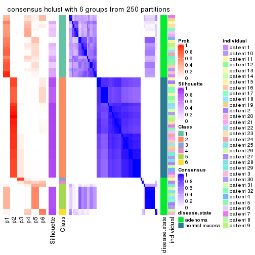</p>

</div>
</div>

Heatmaps for the membership of samples in all partitions to see how consistent they are:


<script>
$( function() {
	$( '#tabs-ATC-hclust-membership-heatmap' ).tabs();
} );
</script>
<div id='tabs-ATC-hclust-membership-heatmap'>
<ul>
<li><a href='#tab-ATC-hclust-membership-heatmap-1'>k = 2</a></li>
<li><a href='#tab-ATC-hclust-membership-heatmap-2'>k = 3</a></li>
<li><a href='#tab-ATC-hclust-membership-heatmap-3'>k = 4</a></li>
<li><a href='#tab-ATC-hclust-membership-heatmap-4'>k = 5</a></li>
<li><a href='#tab-ATC-hclust-membership-heatmap-5'>k = 6</a></li>
</ul>
<div id='tab-ATC-hclust-membership-heatmap-1'>
<pre><code class="r">membership_heatmap(res, k = 2)
</code></pre>

<p></p>

</div>
<div id='tab-ATC-hclust-membership-heatmap-2'>
<pre><code class="r">membership_heatmap(res, k = 3)
</code></pre>

<p></p>

</div>
<div id='tab-ATC-hclust-membership-heatmap-3'>
<pre><code class="r">membership_heatmap(res, k = 4)
</code></pre>

<p></p>

</div>
<div id='tab-ATC-hclust-membership-heatmap-4'>
<pre><code class="r">membership_heatmap(res, k = 5)
</code></pre>

<p></p>

</div>
<div id='tab-ATC-hclust-membership-heatmap-5'>
<pre><code class="r">membership_heatmap(res, k = 6)
</code></pre>

<p></p>

</div>
</div>

As soon as we have had the classes for columns, we can look for signatures
which are significantly different between classes which can be candidate marks
for certain classes. Following are the heatmaps for signatures.


Signature heatmaps where rows are scaled:


<script>
$( function() {
	$( '#tabs-ATC-hclust-get-signatures' ).tabs();
} );
</script>
<div id='tabs-ATC-hclust-get-signatures'>
<ul>
<li><a href='#tab-ATC-hclust-get-signatures-1'>k = 2</a></li>
<li><a href='#tab-ATC-hclust-get-signatures-2'>k = 3</a></li>
<li><a href='#tab-ATC-hclust-get-signatures-3'>k = 4</a></li>
<li><a href='#tab-ATC-hclust-get-signatures-4'>k = 5</a></li>
<li><a href='#tab-ATC-hclust-get-signatures-5'>k = 6</a></li>
</ul>
<div id='tab-ATC-hclust-get-signatures-1'>
<pre><code class="r">get_signatures(res, k = 2)
</code></pre>

<p></p>

</div>
<div id='tab-ATC-hclust-get-signatures-2'>
<pre><code class="r">get_signatures(res, k = 3)
</code></pre>

<p></p>

</div>
<div id='tab-ATC-hclust-get-signatures-3'>
<pre><code class="r">get_signatures(res, k = 4)
</code></pre>

<p></p>

</div>
<div id='tab-ATC-hclust-get-signatures-4'>
<pre><code class="r">get_signatures(res, k = 5)
</code></pre>

<p></p>

</div>
<div id='tab-ATC-hclust-get-signatures-5'>
<pre><code class="r">get_signatures(res, k = 6)
</code></pre>

<p></p>

</div>
</div>


Signature heatmaps where rows are not scaled:


<script>
$( function() {
	$( '#tabs-ATC-hclust-get-signatures-no-scale' ).tabs();
} );
</script>
<div id='tabs-ATC-hclust-get-signatures-no-scale'>
<ul>
<li><a href='#tab-ATC-hclust-get-signatures-no-scale-1'>k = 2</a></li>
<li><a href='#tab-ATC-hclust-get-signatures-no-scale-2'>k = 3</a></li>
<li><a href='#tab-ATC-hclust-get-signatures-no-scale-3'>k = 4</a></li>
<li><a href='#tab-ATC-hclust-get-signatures-no-scale-4'>k = 5</a></li>
<li><a href='#tab-ATC-hclust-get-signatures-no-scale-5'>k = 6</a></li>
</ul>
<div id='tab-ATC-hclust-get-signatures-no-scale-1'>
<pre><code class="r">get_signatures(res, k = 2, scale_rows = FALSE)
</code></pre>

<p></p>

</div>
<div id='tab-ATC-hclust-get-signatures-no-scale-2'>
<pre><code class="r">get_signatures(res, k = 3, scale_rows = FALSE)
</code></pre>

<p></p>

</div>
<div id='tab-ATC-hclust-get-signatures-no-scale-3'>
<pre><code class="r">get_signatures(res, k = 4, scale_rows = FALSE)
</code></pre>

<p></p>

</div>
<div id='tab-ATC-hclust-get-signatures-no-scale-4'>
<pre><code class="r">get_signatures(res, k = 5, scale_rows = FALSE)
</code></pre>

<p>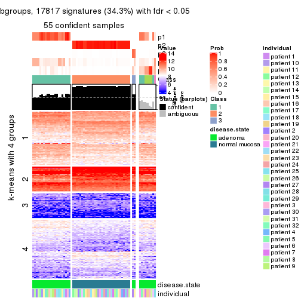</p>

</div>
<div id='tab-ATC-hclust-get-signatures-no-scale-5'>
<pre><code class="r">get_signatures(res, k = 6, scale_rows = FALSE)
</code></pre>

<p></p>

</div>
</div>


Compare the overlap of signatures from different k:

```r
compare_signatures(res)
```


`get_signature()` returns a data frame invisibly. TO get the list of signatures, the function
call should be assigned to a variable explicitly. In following code, if `plot` argument is set
to `FALSE`, no heatmap is plotted while only the differential analysis is performed.

```r
# code only for demonstration
tb = get_signature(res, k = ..., plot = FALSE)
```

An example of the output of `tb` is:

```
#>   which_row         fdr    mean_1    mean_2 scaled_mean_1 scaled_mean_2 km
#> 1        38 0.042760348  8.373488  9.131774    -0.5533452     0.5164555  1
#> 2        40 0.018707592  7.106213  8.469186    -0.6173731     0.5762149  1
#> 3        55 0.019134737 10.221463 11.207825    -0.6159697     0.5749050  1
#> 4        59 0.006059896  5.921854  7.869574    -0.6899429     0.6439467  1
#> 5        60 0.018055526  8.928898 10.211722    -0.6204761     0.5791110  1
#> 6        98 0.009384629 15.714769 14.887706     0.6635654    -0.6193277  2
...
```

The columns in `tb` are:

1. `which_row`: row indices corresponding to the input matrix.
2. `fdr`: FDR for the differential test. 
3. `mean_x`: The mean value in group x.
4. `scaled_mean_x`: The mean value in group x after rows are scaled.
5. `km`: Row groups if k-means clustering is applied to rows.


UMAP plot which shows how samples are separated.


<script>
$( function() {
	$( '#tabs-ATC-hclust-dimension-reduction' ).tabs();
} );
</script>
<div id='tabs-ATC-hclust-dimension-reduction'>
<ul>
<li><a href='#tab-ATC-hclust-dimension-reduction-1'>k = 2</a></li>
<li><a href='#tab-ATC-hclust-dimension-reduction-2'>k = 3</a></li>
<li><a href='#tab-ATC-hclust-dimension-reduction-3'>k = 4</a></li>
<li><a href='#tab-ATC-hclust-dimension-reduction-4'>k = 5</a></li>
<li><a href='#tab-ATC-hclust-dimension-reduction-5'>k = 6</a></li>
</ul>
<div id='tab-ATC-hclust-dimension-reduction-1'>
<pre><code class="r">dimension_reduction(res, k = 2, method = &quot;UMAP&quot;)
</code></pre>

<p></p>

</div>
<div id='tab-ATC-hclust-dimension-reduction-2'>
<pre><code class="r">dimension_reduction(res, k = 3, method = &quot;UMAP&quot;)
</code></pre>

<p></p>

</div>
<div id='tab-ATC-hclust-dimension-reduction-3'>
<pre><code class="r">dimension_reduction(res, k = 4, method = &quot;UMAP&quot;)
</code></pre>

<p></p>

</div>
<div id='tab-ATC-hclust-dimension-reduction-4'>
<pre><code class="r">dimension_reduction(res, k = 5, method = &quot;UMAP&quot;)
</code></pre>

<p></p>

</div>
<div id='tab-ATC-hclust-dimension-reduction-5'>
<pre><code class="r">dimension_reduction(res, k = 6, method = &quot;UMAP&quot;)
</code></pre>

<p></p>

</div>
</div>


Following heatmap shows how subgroups are split when increasing `k`:

```r
collect_classes(res)
```


Test correlation between subgroups and known annotations. If the known
annotation is numeric, one-way ANOVA test is applied, and if the known
annotation is discrete, chi-squared contingency table test is applied.

```r
test_to_known_factors(res)
```

```
#>             n disease.state(p) individual(p) k
#> ATC:hclust 64         9.19e-15         1.000 2
#> ATC:hclust 64         1.27e-14         0.999 3
#> ATC:hclust 60         5.88e-13         0.991 4
#> ATC:hclust 55         1.14e-12         0.998 5
#> ATC:hclust 42         4.01e-09         0.999 6
```


If matrix rows can be associated to genes, consider to use `functional_enrichment(res,
...)` to perform function enrichment for the signature genes. See [this vignette](http://bioconductor.org/packages/devel/bioc/vignettes/cola/inst/doc/functional_enrichment.html) for more detailed explanations.


 

---------------------------------------------------


### ATC:kmeans**


The object with results only for a single top-value method and a single partition method 
can be extracted as:

```r
res = res_list["ATC", "kmeans"]
# you can also extract it by
# res = res_list["ATC:kmeans"]
```

A summary of `res` and all the functions that can be applied to it:

```r
res
```

```
#> A 'ConsensusPartition' object with k = 2, 3, 4, 5, 6.
#>   On a matrix with 51941 rows and 64 columns.
#>   Top rows (1000, 2000, 3000, 4000, 5000) are extracted by 'ATC' method.
#>   Subgroups are detected by 'kmeans' method.
#>   Performed in total 1250 partitions by row resampling.
#>   Best k for subgroups seems to be 2.
#> 
#> Following methods can be applied to this 'ConsensusPartition' object:
#>  [1] "cola_report"             "collect_classes"         "collect_plots"          
#>  [4] "collect_stats"           "colnames"                "compare_signatures"     
#>  [7] "consensus_heatmap"       "dimension_reduction"     "functional_enrichment"  
#> [10] "get_anno_col"            "get_anno"                "get_classes"            
#> [13] "get_consensus"           "get_matrix"              "get_membership"         
#> [16] "get_param"               "get_signatures"          "get_stats"              
#> [19] "is_best_k"               "is_stable_k"             "membership_heatmap"     
#> [22] "ncol"                    "nrow"                    "plot_ecdf"              
#> [25] "rownames"                "select_partition_number" "show"                   
#> [28] "suggest_best_k"          "test_to_known_factors"
```

`collect_plots()` function collects all the plots made from `res` for all `k` (number of partitions)
into one single page to provide an easy and fast comparison between different `k`.

```r
collect_plots(res)
```


The plots are:

- The first row: a plot of the ECDF (empirical cumulative distribution
  function) curves of the consensus matrix for each `k` and the heatmap of
  predicted classes for each `k`.
- The second row: heatmaps of the consensus matrix for each `k`.
- The third row: heatmaps of the membership matrix for each `k`.
- The fouth row: heatmaps of the signatures for each `k`.

All the plots in panels can be made by individual functions and they are
plotted later in this section.

`select_partition_number()` produces several plots showing different
statistics for choosing "optimized" `k`. There are following statistics:

- ECDF curves of the consensus matrix for each `k`;
- 1-PAC. [The PAC
  score](https://en.wikipedia.org/wiki/Consensus_clustering#Over-interpretation_potential_of_consensus_clustering)
  measures the proportion of the ambiguous subgrouping.
- Mean silhouette score.
- Concordance. The mean probability of fiting the consensus class ids in all
  partitions.
- Area increased. Denote $A_k$ as the area under the ECDF curve for current
  `k`, the area increased is defined as $A_k - A_{k-1}$.
- Rand index. The percent of pairs of samples that are both in a same cluster
  or both are not in a same cluster in the partition of k and k-1.
- Jaccard index. The ratio of pairs of samples are both in a same cluster in
  the partition of k and k-1 and the pairs of samples are both in a same
  cluster in the partition k or k-1.

The detailed explanations of these statistics can be found in [the _cola_
vignette](http://bioconductor.org/packages/devel/bioc/vignettes/cola/inst/doc/cola.html#toc_13).

Generally speaking, lower PAC score, higher mean silhouette score or higher
concordance corresponds to better partition. Rand index and Jaccard index
measure how similar the current partition is compared to partition with `k-1`.
If they are too similar, we won't accept `k` is better than `k-1`.

```r
select_partition_number(res)
```


The numeric values for all these statistics can be obtained by `get_stats()`.

```r
get_stats(res)
```

```
#>   k 1-PAC mean_silhouette concordance area_increased  Rand Jaccard
#> 2 2 1.000           1.000       1.000         0.5084 0.492   0.492
#> 3 3 0.754           0.921       0.865         0.2090 0.891   0.778
#> 4 4 0.620           0.660       0.786         0.1064 0.918   0.788
#> 5 5 0.572           0.652       0.764         0.0785 0.955   0.861
#> 6 6 0.621           0.618       0.717         0.0527 0.948   0.824
```

`suggest_best_k()` suggests the best $k$ based on these statistics. The rules are as follows:

- All $k$ with Jaccard index larger than 0.95 are removed because increasing
  $k$ does not provide enough extra information. If all $k$ are removed, it is
  marked as no subgroup is detected.
- For all $k$ with 1-PAC score larger than 0.9, the maximal $k$ is taken as
  the best $k$, and other $k$ are marked as optional $k$.
- If it does not fit the second rule. The $k$ with the maximal vote of the
  highest 1-PAC score, highest mean silhouette, and highest concordance is
  taken as the best $k$.

```r
suggest_best_k(res)
```

```
#> [1] 2
```


Following shows the table of the partitions (You need to click the **show/hide
code output** link to see it). The membership matrix (columns with name `p*`)
is inferred by
[`clue::cl_consensus()`](https://www.rdocumentation.org/link/cl_consensus?package=clue)
function with the `SE` method. Basically the value in the membership matrix
represents the probability to belong to a certain group. The finall class
label for an item is determined with the group with highest probability it
belongs to.

In `get_classes()` function, the entropy is calculated from the membership
matrix and the silhouette score is calculated from the consensus matrix.


<script>
$( function() {
	$( '#tabs-ATC-kmeans-get-classes' ).tabs();
} );
</script>
<div id='tabs-ATC-kmeans-get-classes'>
<ul>
<li><a href='#tab-ATC-kmeans-get-classes-1'>k = 2</a></li>
<li><a href='#tab-ATC-kmeans-get-classes-2'>k = 3</a></li>
<li><a href='#tab-ATC-kmeans-get-classes-3'>k = 4</a></li>
<li><a href='#tab-ATC-kmeans-get-classes-4'>k = 5</a></li>
<li><a href='#tab-ATC-kmeans-get-classes-5'>k = 6</a></li>
</ul>

<div id='tab-ATC-kmeans-get-classes-1'>
<p><a id='tab-ATC-kmeans-get-classes-1-a' style='color:#0366d6' href='#'>show/hide code output</a></p>
<pre><code class="r">cbind(get_classes(res, k = 2), get_membership(res, k = 2))
</code></pre>

<pre><code>#&gt;           class entropy silhouette p1 p2
#&gt; GSM215051     2       0          1  0  1
#&gt; GSM215052     2       0          1  0  1
#&gt; GSM215053     2       0          1  0  1
#&gt; GSM215054     2       0          1  0  1
#&gt; GSM215055     2       0          1  0  1
#&gt; GSM215056     2       0          1  0  1
#&gt; GSM215057     2       0          1  0  1
#&gt; GSM215058     2       0          1  0  1
#&gt; GSM215059     2       0          1  0  1
#&gt; GSM215060     2       0          1  0  1
#&gt; GSM215061     2       0          1  0  1
#&gt; GSM215062     2       0          1  0  1
#&gt; GSM215063     2       0          1  0  1
#&gt; GSM215064     2       0          1  0  1
#&gt; GSM215065     2       0          1  0  1
#&gt; GSM215066     2       0          1  0  1
#&gt; GSM215067     2       0          1  0  1
#&gt; GSM215068     2       0          1  0  1
#&gt; GSM215069     2       0          1  0  1
#&gt; GSM215070     2       0          1  0  1
#&gt; GSM215071     2       0          1  0  1
#&gt; GSM215072     2       0          1  0  1
#&gt; GSM215073     2       0          1  0  1
#&gt; GSM215074     2       0          1  0  1
#&gt; GSM215075     2       0          1  0  1
#&gt; GSM215076     2       0          1  0  1
#&gt; GSM215077     2       0          1  0  1
#&gt; GSM215078     2       0          1  0  1
#&gt; GSM215079     2       0          1  0  1
#&gt; GSM215080     2       0          1  0  1
#&gt; GSM215081     2       0          1  0  1
#&gt; GSM215082     2       0          1  0  1
#&gt; GSM215083     1       0          1  1  0
#&gt; GSM215084     1       0          1  1  0
#&gt; GSM215085     1       0          1  1  0
#&gt; GSM215086     1       0          1  1  0
#&gt; GSM215087     1       0          1  1  0
#&gt; GSM215088     1       0          1  1  0
#&gt; GSM215089     1       0          1  1  0
#&gt; GSM215090     1       0          1  1  0
#&gt; GSM215091     1       0          1  1  0
#&gt; GSM215092     1       0          1  1  0
#&gt; GSM215093     1       0          1  1  0
#&gt; GSM215094     1       0          1  1  0
#&gt; GSM215095     1       0          1  1  0
#&gt; GSM215096     1       0          1  1  0
#&gt; GSM215097     1       0          1  1  0
#&gt; GSM215098     1       0          1  1  0
#&gt; GSM215099     1       0          1  1  0
#&gt; GSM215100     1       0          1  1  0
#&gt; GSM215101     1       0          1  1  0
#&gt; GSM215102     1       0          1  1  0
#&gt; GSM215103     1       0          1  1  0
#&gt; GSM215104     1       0          1  1  0
#&gt; GSM215105     1       0          1  1  0
#&gt; GSM215106     1       0          1  1  0
#&gt; GSM215107     1       0          1  1  0
#&gt; GSM215108     1       0          1  1  0
#&gt; GSM215109     1       0          1  1  0
#&gt; GSM215110     1       0          1  1  0
#&gt; GSM215111     1       0          1  1  0
#&gt; GSM215112     1       0          1  1  0
#&gt; GSM215113     1       0          1  1  0
#&gt; GSM215114     1       0          1  1  0
</code></pre>

<script>
$('#tab-ATC-kmeans-get-classes-1-a').parent().next().next().hide();
$('#tab-ATC-kmeans-get-classes-1-a').click(function(){
  $('#tab-ATC-kmeans-get-classes-1-a').parent().next().next().toggle();
  return(false);
});
</script>
</div>

<div id='tab-ATC-kmeans-get-classes-2'>
<p><a id='tab-ATC-kmeans-get-classes-2-a' style='color:#0366d6' href='#'>show/hide code output</a></p>
<pre><code class="r">cbind(get_classes(res, k = 3), get_membership(res, k = 3))
</code></pre>

<pre><code>#&gt;           class entropy silhouette    p1    p2    p3
#&gt; GSM215051     2  0.1411      0.895 0.000 0.964 0.036
#&gt; GSM215052     2  0.4750      0.848 0.000 0.784 0.216
#&gt; GSM215053     2  0.1163      0.897 0.000 0.972 0.028
#&gt; GSM215054     2  0.1163      0.897 0.000 0.972 0.028
#&gt; GSM215055     2  0.2356      0.896 0.000 0.928 0.072
#&gt; GSM215056     2  0.5650      0.801 0.000 0.688 0.312
#&gt; GSM215057     2  0.5760      0.797 0.000 0.672 0.328
#&gt; GSM215058     2  0.1643      0.899 0.000 0.956 0.044
#&gt; GSM215059     2  0.1163      0.901 0.000 0.972 0.028
#&gt; GSM215060     2  0.0592      0.900 0.000 0.988 0.012
#&gt; GSM215061     2  0.3551      0.876 0.000 0.868 0.132
#&gt; GSM215062     2  0.6079      0.758 0.000 0.612 0.388
#&gt; GSM215063     2  0.5178      0.825 0.000 0.744 0.256
#&gt; GSM215064     2  0.6079      0.758 0.000 0.612 0.388
#&gt; GSM215065     2  0.5859      0.780 0.000 0.656 0.344
#&gt; GSM215066     2  0.0424      0.900 0.000 0.992 0.008
#&gt; GSM215067     2  0.5882      0.779 0.000 0.652 0.348
#&gt; GSM215068     2  0.1411      0.900 0.000 0.964 0.036
#&gt; GSM215069     2  0.0592      0.900 0.000 0.988 0.012
#&gt; GSM215070     2  0.1289      0.896 0.000 0.968 0.032
#&gt; GSM215071     2  0.1031      0.898 0.000 0.976 0.024
#&gt; GSM215072     2  0.4291      0.865 0.000 0.820 0.180
#&gt; GSM215073     2  0.1289      0.899 0.000 0.968 0.032
#&gt; GSM215074     2  0.1163      0.897 0.000 0.972 0.028
#&gt; GSM215075     2  0.0892      0.901 0.000 0.980 0.020
#&gt; GSM215076     2  0.2959      0.882 0.000 0.900 0.100
#&gt; GSM215077     2  0.2356      0.891 0.000 0.928 0.072
#&gt; GSM215078     2  0.2356      0.891 0.000 0.928 0.072
#&gt; GSM215079     2  0.1289      0.896 0.000 0.968 0.032
#&gt; GSM215080     2  0.0000      0.900 0.000 1.000 0.000
#&gt; GSM215081     2  0.3879      0.874 0.000 0.848 0.152
#&gt; GSM215082     2  0.5760      0.797 0.000 0.672 0.328
#&gt; GSM215083     1  0.0000      0.986 1.000 0.000 0.000
#&gt; GSM215084     1  0.0000      0.986 1.000 0.000 0.000
#&gt; GSM215085     1  0.0000      0.986 1.000 0.000 0.000
#&gt; GSM215086     1  0.0000      0.986 1.000 0.000 0.000
#&gt; GSM215087     1  0.0000      0.986 1.000 0.000 0.000
#&gt; GSM215088     3  0.6244      0.999 0.440 0.000 0.560
#&gt; GSM215089     3  0.6244      0.999 0.440 0.000 0.560
#&gt; GSM215090     1  0.0000      0.986 1.000 0.000 0.000
#&gt; GSM215091     3  0.6244      0.999 0.440 0.000 0.560
#&gt; GSM215092     1  0.0000      0.986 1.000 0.000 0.000
#&gt; GSM215093     3  0.6244      0.999 0.440 0.000 0.560
#&gt; GSM215094     1  0.0000      0.986 1.000 0.000 0.000
#&gt; GSM215095     1  0.0000      0.986 1.000 0.000 0.000
#&gt; GSM215096     1  0.0000      0.986 1.000 0.000 0.000
#&gt; GSM215097     1  0.0000      0.986 1.000 0.000 0.000
#&gt; GSM215098     1  0.0000      0.986 1.000 0.000 0.000
#&gt; GSM215099     1  0.0000      0.986 1.000 0.000 0.000
#&gt; GSM215100     1  0.0000      0.986 1.000 0.000 0.000
#&gt; GSM215101     3  0.6252      0.993 0.444 0.000 0.556
#&gt; GSM215102     3  0.6244      0.999 0.440 0.000 0.560
#&gt; GSM215103     3  0.6244      0.999 0.440 0.000 0.560
#&gt; GSM215104     1  0.0000      0.986 1.000 0.000 0.000
#&gt; GSM215105     1  0.4121      0.572 0.832 0.000 0.168
#&gt; GSM215106     1  0.0000      0.986 1.000 0.000 0.000
#&gt; GSM215107     1  0.0000      0.986 1.000 0.000 0.000
#&gt; GSM215108     3  0.6244      0.999 0.440 0.000 0.560
#&gt; GSM215109     3  0.6244      0.999 0.440 0.000 0.560
#&gt; GSM215110     1  0.0000      0.986 1.000 0.000 0.000
#&gt; GSM215111     1  0.0000      0.986 1.000 0.000 0.000
#&gt; GSM215112     1  0.0000      0.986 1.000 0.000 0.000
#&gt; GSM215113     1  0.0000      0.986 1.000 0.000 0.000
#&gt; GSM215114     3  0.6244      0.999 0.440 0.000 0.560
</code></pre>

<script>
$('#tab-ATC-kmeans-get-classes-2-a').parent().next().next().hide();
$('#tab-ATC-kmeans-get-classes-2-a').click(function(){
  $('#tab-ATC-kmeans-get-classes-2-a').parent().next().next().toggle();
  return(false);
});
</script>
</div>

<div id='tab-ATC-kmeans-get-classes-3'>
<p><a id='tab-ATC-kmeans-get-classes-3-a' style='color:#0366d6' href='#'>show/hide code output</a></p>
<pre><code class="r">cbind(get_classes(res, k = 4), get_membership(res, k = 4))
</code></pre>

<pre><code>#&gt;           class entropy silhouette    p1    p2    p3    p4
#&gt; GSM215051     2  0.3107     0.6871 0.080 0.884 0.000 0.036
#&gt; GSM215052     2  0.6934    -0.0232 0.152 0.572 0.000 0.276
#&gt; GSM215053     2  0.1938     0.7068 0.052 0.936 0.000 0.012
#&gt; GSM215054     2  0.1938     0.7068 0.052 0.936 0.000 0.012
#&gt; GSM215055     2  0.4123     0.6347 0.044 0.820 0.000 0.136
#&gt; GSM215056     2  0.5935    -0.5636 0.036 0.496 0.000 0.468
#&gt; GSM215057     2  0.6275    -0.5573 0.056 0.484 0.000 0.460
#&gt; GSM215058     2  0.4163     0.6526 0.096 0.828 0.000 0.076
#&gt; GSM215059     2  0.3372     0.6797 0.036 0.868 0.000 0.096
#&gt; GSM215060     2  0.2335     0.7070 0.020 0.920 0.000 0.060
#&gt; GSM215061     2  0.5318     0.4782 0.072 0.732 0.000 0.196
#&gt; GSM215062     4  0.6634     0.7900 0.108 0.312 0.000 0.580
#&gt; GSM215063     2  0.6407    -0.3076 0.072 0.544 0.000 0.384
#&gt; GSM215064     4  0.6634     0.7900 0.108 0.312 0.000 0.580
#&gt; GSM215065     4  0.5220     0.8068 0.016 0.352 0.000 0.632
#&gt; GSM215066     2  0.2586     0.7057 0.040 0.912 0.000 0.048
#&gt; GSM215067     4  0.5220     0.8068 0.016 0.352 0.000 0.632
#&gt; GSM215068     2  0.3542     0.6823 0.060 0.864 0.000 0.076
#&gt; GSM215069     2  0.2179     0.7064 0.012 0.924 0.000 0.064
#&gt; GSM215070     2  0.1256     0.7118 0.028 0.964 0.000 0.008
#&gt; GSM215071     2  0.0779     0.7165 0.016 0.980 0.000 0.004
#&gt; GSM215072     2  0.6623     0.2186 0.148 0.620 0.000 0.232
#&gt; GSM215073     2  0.2032     0.7080 0.028 0.936 0.000 0.036
#&gt; GSM215074     2  0.0927     0.7176 0.016 0.976 0.000 0.008
#&gt; GSM215075     2  0.3164     0.6955 0.064 0.884 0.000 0.052
#&gt; GSM215076     2  0.6084     0.4064 0.244 0.660 0.000 0.096
#&gt; GSM215077     2  0.4499     0.6135 0.124 0.804 0.000 0.072
#&gt; GSM215078     2  0.4499     0.6135 0.124 0.804 0.000 0.072
#&gt; GSM215079     2  0.1722     0.7098 0.048 0.944 0.000 0.008
#&gt; GSM215080     2  0.1929     0.7131 0.036 0.940 0.000 0.024
#&gt; GSM215081     2  0.6320     0.3160 0.140 0.656 0.000 0.204
#&gt; GSM215082     4  0.5917     0.6329 0.036 0.444 0.000 0.520
#&gt; GSM215083     1  0.4730     0.8616 0.636 0.000 0.364 0.000
#&gt; GSM215084     1  0.7475     0.7773 0.476 0.000 0.332 0.192
#&gt; GSM215085     1  0.4730     0.8616 0.636 0.000 0.364 0.000
#&gt; GSM215086     1  0.4730     0.8616 0.636 0.000 0.364 0.000
#&gt; GSM215087     1  0.5587     0.8581 0.600 0.000 0.372 0.028
#&gt; GSM215088     3  0.0188     0.8675 0.000 0.000 0.996 0.004
#&gt; GSM215089     3  0.1488     0.8517 0.012 0.000 0.956 0.032
#&gt; GSM215090     1  0.7438     0.7827 0.484 0.000 0.328 0.188
#&gt; GSM215091     3  0.2973     0.6969 0.144 0.000 0.856 0.000
#&gt; GSM215092     1  0.7321     0.7893 0.500 0.000 0.328 0.172
#&gt; GSM215093     3  0.1792     0.8501 0.000 0.000 0.932 0.068
#&gt; GSM215094     1  0.4897     0.8655 0.660 0.000 0.332 0.008
#&gt; GSM215095     1  0.5835     0.8506 0.588 0.000 0.372 0.040
#&gt; GSM215096     1  0.4817     0.8419 0.612 0.000 0.388 0.000
#&gt; GSM215097     1  0.5110     0.8641 0.656 0.000 0.328 0.016
#&gt; GSM215098     1  0.4661     0.8659 0.652 0.000 0.348 0.000
#&gt; GSM215099     1  0.5311     0.8635 0.648 0.000 0.328 0.024
#&gt; GSM215100     1  0.7410     0.7847 0.488 0.000 0.328 0.184
#&gt; GSM215101     3  0.1936     0.8394 0.032 0.000 0.940 0.028
#&gt; GSM215102     3  0.0921     0.8673 0.000 0.000 0.972 0.028
#&gt; GSM215103     3  0.0707     0.8684 0.000 0.000 0.980 0.020
#&gt; GSM215104     1  0.4713     0.8634 0.640 0.000 0.360 0.000
#&gt; GSM215105     3  0.5833    -0.5445 0.440 0.000 0.528 0.032
#&gt; GSM215106     1  0.4713     0.8634 0.640 0.000 0.360 0.000
#&gt; GSM215107     1  0.7321     0.7893 0.500 0.000 0.328 0.172
#&gt; GSM215108     3  0.0921     0.8673 0.000 0.000 0.972 0.028
#&gt; GSM215109     3  0.1792     0.8501 0.000 0.000 0.932 0.068
#&gt; GSM215110     1  0.7501     0.7737 0.472 0.000 0.332 0.196
#&gt; GSM215111     1  0.5699     0.8454 0.588 0.000 0.380 0.032
#&gt; GSM215112     1  0.5558     0.8628 0.608 0.000 0.364 0.028
#&gt; GSM215113     1  0.7449     0.7800 0.480 0.000 0.332 0.188
#&gt; GSM215114     3  0.0672     0.8641 0.008 0.000 0.984 0.008
</code></pre>

<script>
$('#tab-ATC-kmeans-get-classes-3-a').parent().next().next().hide();
$('#tab-ATC-kmeans-get-classes-3-a').click(function(){
  $('#tab-ATC-kmeans-get-classes-3-a').parent().next().next().toggle();
  return(false);
});
</script>
</div>

<div id='tab-ATC-kmeans-get-classes-4'>
<p><a id='tab-ATC-kmeans-get-classes-4-a' style='color:#0366d6' href='#'>show/hide code output</a></p>
<pre><code class="r">cbind(get_classes(res, k = 5), get_membership(res, k = 5))
</code></pre>

<pre><code>#&gt;           class entropy silhouette    p1    p2    p3    p4 p5
#&gt; GSM215051     2  0.3068    0.67033 0.000 0.876 0.032 0.020 NA
#&gt; GSM215052     2  0.6786    0.00282 0.000 0.564 0.056 0.256 NA
#&gt; GSM215053     2  0.1095    0.69737 0.000 0.968 0.012 0.008 NA
#&gt; GSM215054     2  0.1095    0.69737 0.000 0.968 0.012 0.008 NA
#&gt; GSM215055     2  0.5608    0.47061 0.000 0.672 0.012 0.148 NA
#&gt; GSM215056     4  0.6736    0.59289 0.000 0.372 0.012 0.444 NA
#&gt; GSM215057     4  0.6668    0.61357 0.000 0.344 0.004 0.448 NA
#&gt; GSM215058     2  0.5362    0.52118 0.000 0.672 0.012 0.080 NA
#&gt; GSM215059     2  0.4761    0.55616 0.000 0.728 0.000 0.104 NA
#&gt; GSM215060     2  0.3073    0.67922 0.000 0.868 0.004 0.052 NA
#&gt; GSM215061     2  0.4849    0.38587 0.000 0.712 0.032 0.232 NA
#&gt; GSM215062     4  0.6012    0.73155 0.000 0.248 0.032 0.628 NA
#&gt; GSM215063     2  0.5631   -0.23905 0.000 0.540 0.040 0.400 NA
#&gt; GSM215064     4  0.6012    0.73155 0.000 0.248 0.032 0.628 NA
#&gt; GSM215065     4  0.4598    0.74657 0.000 0.264 0.028 0.700 NA
#&gt; GSM215066     2  0.1267    0.69598 0.000 0.960 0.012 0.024 NA
#&gt; GSM215067     4  0.4598    0.74657 0.000 0.264 0.028 0.700 NA
#&gt; GSM215068     2  0.2644    0.66143 0.000 0.896 0.008 0.060 NA
#&gt; GSM215069     2  0.2654    0.68645 0.000 0.888 0.000 0.048 NA
#&gt; GSM215070     2  0.2037    0.69896 0.000 0.920 0.004 0.012 NA
#&gt; GSM215071     2  0.1569    0.70170 0.000 0.944 0.004 0.008 NA
#&gt; GSM215072     2  0.7178   -0.02219 0.000 0.484 0.036 0.228 NA
#&gt; GSM215073     2  0.2654    0.68375 0.000 0.884 0.000 0.032 NA
#&gt; GSM215074     2  0.1412    0.70564 0.000 0.952 0.004 0.008 NA
#&gt; GSM215075     2  0.2673    0.67392 0.000 0.900 0.020 0.044 NA
#&gt; GSM215076     2  0.6447    0.30885 0.000 0.520 0.064 0.052 NA
#&gt; GSM215077     2  0.5663    0.47497 0.000 0.620 0.028 0.052 NA
#&gt; GSM215078     2  0.5663    0.47497 0.000 0.620 0.028 0.052 NA
#&gt; GSM215079     2  0.1314    0.69804 0.000 0.960 0.012 0.012 NA
#&gt; GSM215080     2  0.0727    0.69973 0.000 0.980 0.004 0.012 NA
#&gt; GSM215081     2  0.7171    0.06429 0.000 0.512 0.048 0.208 NA
#&gt; GSM215082     4  0.6785    0.68199 0.000 0.304 0.024 0.508 NA
#&gt; GSM215083     1  0.0609    0.78027 0.980 0.000 0.020 0.000 NA
#&gt; GSM215084     1  0.4201    0.66693 0.592 0.000 0.000 0.000 NA
#&gt; GSM215085     1  0.0566    0.78105 0.984 0.000 0.012 0.000 NA
#&gt; GSM215086     1  0.0609    0.78027 0.980 0.000 0.020 0.000 NA
#&gt; GSM215087     1  0.4031    0.70648 0.796 0.000 0.148 0.008 NA
#&gt; GSM215088     3  0.2891    0.88032 0.176 0.000 0.824 0.000 NA
#&gt; GSM215089     3  0.4031    0.86929 0.160 0.000 0.788 0.004 NA
#&gt; GSM215090     1  0.4171    0.67306 0.604 0.000 0.000 0.000 NA
#&gt; GSM215091     3  0.4356    0.69008 0.340 0.000 0.648 0.000 NA
#&gt; GSM215092     1  0.4150    0.67592 0.612 0.000 0.000 0.000 NA
#&gt; GSM215093     3  0.6562    0.81226 0.144 0.000 0.628 0.148 NA
#&gt; GSM215094     1  0.1041    0.78703 0.964 0.000 0.000 0.004 NA
#&gt; GSM215095     1  0.4195    0.75478 0.816 0.000 0.064 0.044 NA
#&gt; GSM215096     1  0.1638    0.75353 0.932 0.000 0.064 0.000 NA
#&gt; GSM215097     1  0.1638    0.78809 0.932 0.000 0.004 0.000 NA
#&gt; GSM215098     1  0.0955    0.78627 0.968 0.000 0.000 0.004 NA
#&gt; GSM215099     1  0.2020    0.78425 0.900 0.000 0.000 0.000 NA
#&gt; GSM215100     1  0.4171    0.67306 0.604 0.000 0.000 0.000 NA
#&gt; GSM215101     3  0.4281    0.86184 0.172 0.000 0.768 0.004 NA
#&gt; GSM215102     3  0.5176    0.86906 0.148 0.000 0.736 0.076 NA
#&gt; GSM215103     3  0.3592    0.88322 0.168 0.000 0.808 0.012 NA
#&gt; GSM215104     1  0.0510    0.78151 0.984 0.000 0.016 0.000 NA
#&gt; GSM215105     1  0.5784    0.35091 0.636 0.000 0.268 0.040 NA
#&gt; GSM215106     1  0.0510    0.78151 0.984 0.000 0.016 0.000 NA
#&gt; GSM215107     1  0.4138    0.67800 0.616 0.000 0.000 0.000 NA
#&gt; GSM215108     3  0.5176    0.86906 0.148 0.000 0.736 0.076 NA
#&gt; GSM215109     3  0.6709    0.80919 0.144 0.000 0.616 0.148 NA
#&gt; GSM215110     1  0.4666    0.64759 0.572 0.000 0.000 0.016 NA
#&gt; GSM215111     1  0.3241    0.76278 0.872 0.000 0.052 0.040 NA
#&gt; GSM215112     1  0.3593    0.74964 0.840 0.000 0.096 0.012 NA
#&gt; GSM215113     1  0.4171    0.66821 0.604 0.000 0.000 0.000 NA
#&gt; GSM215114     3  0.3167    0.87871 0.172 0.000 0.820 0.004 NA
</code></pre>

<script>
$('#tab-ATC-kmeans-get-classes-4-a').parent().next().next().hide();
$('#tab-ATC-kmeans-get-classes-4-a').click(function(){
  $('#tab-ATC-kmeans-get-classes-4-a').parent().next().next().toggle();
  return(false);
});
</script>
</div>

<div id='tab-ATC-kmeans-get-classes-5'>
<p><a id='tab-ATC-kmeans-get-classes-5-a' style='color:#0366d6' href='#'>show/hide code output</a></p>
<pre><code class="r">cbind(get_classes(res, k = 6), get_membership(res, k = 6))
</code></pre>

<pre><code>#&gt;           class entropy silhouette    p1    p2    p3 p4    p5    p6
#&gt; GSM215051     2  0.3862     0.6162 0.000 0.808 0.016 NA 0.044 0.016
#&gt; GSM215052     2  0.6931    -0.0412 0.000 0.444 0.012 NA 0.056 0.316
#&gt; GSM215053     2  0.1845     0.6559 0.000 0.916 0.008 NA 0.004 0.000
#&gt; GSM215054     2  0.1845     0.6560 0.000 0.916 0.008 NA 0.004 0.000
#&gt; GSM215055     2  0.6344     0.3963 0.000 0.612 0.016 NA 0.140 0.140
#&gt; GSM215056     6  0.7522     0.4555 0.000 0.344 0.016 NA 0.140 0.364
#&gt; GSM215057     6  0.7522     0.4984 0.000 0.304 0.004 NA 0.160 0.360
#&gt; GSM215058     2  0.5619     0.4842 0.000 0.660 0.000 NA 0.128 0.132
#&gt; GSM215059     2  0.5482     0.4976 0.000 0.676 0.004 NA 0.152 0.060
#&gt; GSM215060     2  0.3836     0.6130 0.000 0.804 0.000 NA 0.108 0.032
#&gt; GSM215061     2  0.5439     0.3302 0.000 0.608 0.008 NA 0.000 0.200
#&gt; GSM215062     6  0.2454     0.6555 0.000 0.160 0.000 NA 0.000 0.840
#&gt; GSM215063     2  0.6205    -0.3231 0.000 0.392 0.000 NA 0.004 0.288
#&gt; GSM215064     6  0.2454     0.6555 0.000 0.160 0.000 NA 0.000 0.840
#&gt; GSM215065     6  0.6146     0.6712 0.000 0.176 0.008 NA 0.020 0.544
#&gt; GSM215066     2  0.2265     0.6558 0.000 0.896 0.004 NA 0.000 0.024
#&gt; GSM215067     6  0.6146     0.6712 0.000 0.176 0.008 NA 0.020 0.544
#&gt; GSM215068     2  0.3645     0.6276 0.000 0.828 0.004 NA 0.032 0.060
#&gt; GSM215069     2  0.2985     0.6438 0.000 0.872 0.004 NA 0.044 0.032
#&gt; GSM215070     2  0.1401     0.6667 0.000 0.948 0.004 NA 0.028 0.000
#&gt; GSM215071     2  0.1881     0.6610 0.000 0.928 0.004 NA 0.040 0.008
#&gt; GSM215072     2  0.6218     0.0410 0.000 0.492 0.004 NA 0.056 0.360
#&gt; GSM215073     2  0.3584     0.6205 0.000 0.820 0.004 NA 0.104 0.012
#&gt; GSM215074     2  0.1401     0.6670 0.000 0.948 0.004 NA 0.028 0.000
#&gt; GSM215075     2  0.3622     0.6332 0.000 0.820 0.000 NA 0.032 0.048
#&gt; GSM215076     2  0.7845     0.1289 0.000 0.420 0.032 NA 0.188 0.172
#&gt; GSM215077     2  0.6295     0.4041 0.000 0.576 0.036 NA 0.228 0.020
#&gt; GSM215078     2  0.6295     0.4041 0.000 0.576 0.036 NA 0.228 0.020
#&gt; GSM215079     2  0.1152     0.6630 0.000 0.952 0.004 NA 0.000 0.000
#&gt; GSM215080     2  0.1490     0.6647 0.000 0.948 0.004 NA 0.008 0.016
#&gt; GSM215081     2  0.6050     0.1474 0.000 0.532 0.008 NA 0.052 0.336
#&gt; GSM215082     6  0.7594     0.6057 0.000 0.276 0.024 NA 0.096 0.400
#&gt; GSM215083     1  0.0603     0.7662 0.980 0.000 0.016 NA 0.000 0.004
#&gt; GSM215084     5  0.4315     0.9184 0.384 0.000 0.004 NA 0.596 0.012
#&gt; GSM215085     1  0.0146     0.7682 0.996 0.000 0.004 NA 0.000 0.000
#&gt; GSM215086     1  0.0260     0.7678 0.992 0.000 0.008 NA 0.000 0.000
#&gt; GSM215087     1  0.5550     0.4375 0.620 0.000 0.264 NA 0.080 0.020
#&gt; GSM215088     3  0.2313     0.8191 0.100 0.000 0.884 NA 0.000 0.004
#&gt; GSM215089     3  0.3658     0.7964 0.096 0.000 0.816 NA 0.072 0.004
#&gt; GSM215090     5  0.3756     0.9313 0.400 0.000 0.000 NA 0.600 0.000
#&gt; GSM215091     3  0.3482     0.5673 0.316 0.000 0.684 NA 0.000 0.000
#&gt; GSM215092     5  0.3975     0.8875 0.452 0.000 0.000 NA 0.544 0.004
#&gt; GSM215093     3  0.5335     0.7040 0.076 0.000 0.556 NA 0.016 0.000
#&gt; GSM215094     1  0.1410     0.7428 0.944 0.000 0.000 NA 0.044 0.008
#&gt; GSM215095     1  0.5869     0.5381 0.680 0.000 0.076 NA 0.112 0.092
#&gt; GSM215096     1  0.1714     0.7238 0.908 0.000 0.092 NA 0.000 0.000
#&gt; GSM215097     1  0.1663     0.6963 0.912 0.000 0.000 NA 0.088 0.000
#&gt; GSM215098     1  0.1268     0.7497 0.952 0.000 0.000 NA 0.036 0.008
#&gt; GSM215099     1  0.2092     0.6404 0.876 0.000 0.000 NA 0.124 0.000
#&gt; GSM215100     5  0.3765     0.9313 0.404 0.000 0.000 NA 0.596 0.000
#&gt; GSM215101     3  0.4356     0.7800 0.116 0.000 0.776 NA 0.072 0.020
#&gt; GSM215102     3  0.4931     0.7911 0.080 0.000 0.716 NA 0.012 0.024
#&gt; GSM215103     3  0.3058     0.8191 0.096 0.000 0.856 NA 0.004 0.020
#&gt; GSM215104     1  0.0405     0.7668 0.988 0.000 0.008 NA 0.004 0.000
#&gt; GSM215105     1  0.6666     0.3727 0.572 0.000 0.224 NA 0.068 0.092
#&gt; GSM215106     1  0.0405     0.7668 0.988 0.000 0.008 NA 0.004 0.000
#&gt; GSM215107     5  0.3843     0.8873 0.452 0.000 0.000 NA 0.548 0.000
#&gt; GSM215108     3  0.4931     0.7911 0.080 0.000 0.716 NA 0.012 0.024
#&gt; GSM215109     3  0.5496     0.6978 0.076 0.000 0.540 NA 0.016 0.004
#&gt; GSM215110     5  0.4725     0.8942 0.372 0.000 0.004 NA 0.588 0.020
#&gt; GSM215111     1  0.4682     0.6208 0.772 0.000 0.052 NA 0.072 0.076
#&gt; GSM215112     1  0.5470     0.5181 0.688 0.000 0.160 NA 0.088 0.044
#&gt; GSM215113     5  0.4174     0.9169 0.408 0.000 0.004 NA 0.580 0.004
#&gt; GSM215114     3  0.3501     0.8054 0.104 0.000 0.832 NA 0.036 0.016
</code></pre>

<script>
$('#tab-ATC-kmeans-get-classes-5-a').parent().next().next().hide();
$('#tab-ATC-kmeans-get-classes-5-a').click(function(){
  $('#tab-ATC-kmeans-get-classes-5-a').parent().next().next().toggle();
  return(false);
});
</script>
</div>
</div>

Heatmaps for the consensus matrix. It visualizes the probability of two
samples to be in a same group.


<script>
$( function() {
	$( '#tabs-ATC-kmeans-consensus-heatmap' ).tabs();
} );
</script>
<div id='tabs-ATC-kmeans-consensus-heatmap'>
<ul>
<li><a href='#tab-ATC-kmeans-consensus-heatmap-1'>k = 2</a></li>
<li><a href='#tab-ATC-kmeans-consensus-heatmap-2'>k = 3</a></li>
<li><a href='#tab-ATC-kmeans-consensus-heatmap-3'>k = 4</a></li>
<li><a href='#tab-ATC-kmeans-consensus-heatmap-4'>k = 5</a></li>
<li><a href='#tab-ATC-kmeans-consensus-heatmap-5'>k = 6</a></li>
</ul>
<div id='tab-ATC-kmeans-consensus-heatmap-1'>
<pre><code class="r">consensus_heatmap(res, k = 2)
</code></pre>

<p></p>

</div>
<div id='tab-ATC-kmeans-consensus-heatmap-2'>
<pre><code class="r">consensus_heatmap(res, k = 3)
</code></pre>

<p></p>

</div>
<div id='tab-ATC-kmeans-consensus-heatmap-3'>
<pre><code class="r">consensus_heatmap(res, k = 4)
</code></pre>

<p></p>

</div>
<div id='tab-ATC-kmeans-consensus-heatmap-4'>
<pre><code class="r">consensus_heatmap(res, k = 5)
</code></pre>

<p></p>

</div>
<div id='tab-ATC-kmeans-consensus-heatmap-5'>
<pre><code class="r">consensus_heatmap(res, k = 6)
</code></pre>

<p></p>

</div>
</div>

Heatmaps for the membership of samples in all partitions to see how consistent they are:


<script>
$( function() {
	$( '#tabs-ATC-kmeans-membership-heatmap' ).tabs();
} );
</script>
<div id='tabs-ATC-kmeans-membership-heatmap'>
<ul>
<li><a href='#tab-ATC-kmeans-membership-heatmap-1'>k = 2</a></li>
<li><a href='#tab-ATC-kmeans-membership-heatmap-2'>k = 3</a></li>
<li><a href='#tab-ATC-kmeans-membership-heatmap-3'>k = 4</a></li>
<li><a href='#tab-ATC-kmeans-membership-heatmap-4'>k = 5</a></li>
<li><a href='#tab-ATC-kmeans-membership-heatmap-5'>k = 6</a></li>
</ul>
<div id='tab-ATC-kmeans-membership-heatmap-1'>
<pre><code class="r">membership_heatmap(res, k = 2)
</code></pre>

<p></p>

</div>
<div id='tab-ATC-kmeans-membership-heatmap-2'>
<pre><code class="r">membership_heatmap(res, k = 3)
</code></pre>

<p></p>

</div>
<div id='tab-ATC-kmeans-membership-heatmap-3'>
<pre><code class="r">membership_heatmap(res, k = 4)
</code></pre>

<p></p>

</div>
<div id='tab-ATC-kmeans-membership-heatmap-4'>
<pre><code class="r">membership_heatmap(res, k = 5)
</code></pre>

<p></p>

</div>
<div id='tab-ATC-kmeans-membership-heatmap-5'>
<pre><code class="r">membership_heatmap(res, k = 6)
</code></pre>

<p></p>

</div>
</div>

As soon as we have had the classes for columns, we can look for signatures
which are significantly different between classes which can be candidate marks
for certain classes. Following are the heatmaps for signatures.


Signature heatmaps where rows are scaled:


<script>
$( function() {
	$( '#tabs-ATC-kmeans-get-signatures' ).tabs();
} );
</script>
<div id='tabs-ATC-kmeans-get-signatures'>
<ul>
<li><a href='#tab-ATC-kmeans-get-signatures-1'>k = 2</a></li>
<li><a href='#tab-ATC-kmeans-get-signatures-2'>k = 3</a></li>
<li><a href='#tab-ATC-kmeans-get-signatures-3'>k = 4</a></li>
<li><a href='#tab-ATC-kmeans-get-signatures-4'>k = 5</a></li>
<li><a href='#tab-ATC-kmeans-get-signatures-5'>k = 6</a></li>
</ul>
<div id='tab-ATC-kmeans-get-signatures-1'>
<pre><code class="r">get_signatures(res, k = 2)
</code></pre>

<p></p>

</div>
<div id='tab-ATC-kmeans-get-signatures-2'>
<pre><code class="r">get_signatures(res, k = 3)
</code></pre>

<p></p>

</div>
<div id='tab-ATC-kmeans-get-signatures-3'>
<pre><code class="r">get_signatures(res, k = 4)
</code></pre>

<p></p>

</div>
<div id='tab-ATC-kmeans-get-signatures-4'>
<pre><code class="r">get_signatures(res, k = 5)
</code></pre>

<p></p>

</div>
<div id='tab-ATC-kmeans-get-signatures-5'>
<pre><code class="r">get_signatures(res, k = 6)
</code></pre>

<p></p>

</div>
</div>


Signature heatmaps where rows are not scaled:


<script>
$( function() {
	$( '#tabs-ATC-kmeans-get-signatures-no-scale' ).tabs();
} );
</script>
<div id='tabs-ATC-kmeans-get-signatures-no-scale'>
<ul>
<li><a href='#tab-ATC-kmeans-get-signatures-no-scale-1'>k = 2</a></li>
<li><a href='#tab-ATC-kmeans-get-signatures-no-scale-2'>k = 3</a></li>
<li><a href='#tab-ATC-kmeans-get-signatures-no-scale-3'>k = 4</a></li>
<li><a href='#tab-ATC-kmeans-get-signatures-no-scale-4'>k = 5</a></li>
<li><a href='#tab-ATC-kmeans-get-signatures-no-scale-5'>k = 6</a></li>
</ul>
<div id='tab-ATC-kmeans-get-signatures-no-scale-1'>
<pre><code class="r">get_signatures(res, k = 2, scale_rows = FALSE)
</code></pre>

<p></p>

</div>
<div id='tab-ATC-kmeans-get-signatures-no-scale-2'>
<pre><code class="r">get_signatures(res, k = 3, scale_rows = FALSE)
</code></pre>

<p></p>

</div>
<div id='tab-ATC-kmeans-get-signatures-no-scale-3'>
<pre><code class="r">get_signatures(res, k = 4, scale_rows = FALSE)
</code></pre>

<p></p>

</div>
<div id='tab-ATC-kmeans-get-signatures-no-scale-4'>
<pre><code class="r">get_signatures(res, k = 5, scale_rows = FALSE)
</code></pre>

<p></p>

</div>
<div id='tab-ATC-kmeans-get-signatures-no-scale-5'>
<pre><code class="r">get_signatures(res, k = 6, scale_rows = FALSE)
</code></pre>

<p></p>

</div>
</div>


Compare the overlap of signatures from different k:

```r
compare_signatures(res)
```


`get_signature()` returns a data frame invisibly. TO get the list of signatures, the function
call should be assigned to a variable explicitly. In following code, if `plot` argument is set
to `FALSE`, no heatmap is plotted while only the differential analysis is performed.

```r
# code only for demonstration
tb = get_signature(res, k = ..., plot = FALSE)
```

An example of the output of `tb` is:

```
#>   which_row         fdr    mean_1    mean_2 scaled_mean_1 scaled_mean_2 km
#> 1        38 0.042760348  8.373488  9.131774    -0.5533452     0.5164555  1
#> 2        40 0.018707592  7.106213  8.469186    -0.6173731     0.5762149  1
#> 3        55 0.019134737 10.221463 11.207825    -0.6159697     0.5749050  1
#> 4        59 0.006059896  5.921854  7.869574    -0.6899429     0.6439467  1
#> 5        60 0.018055526  8.928898 10.211722    -0.6204761     0.5791110  1
#> 6        98 0.009384629 15.714769 14.887706     0.6635654    -0.6193277  2
...
```

The columns in `tb` are:

1. `which_row`: row indices corresponding to the input matrix.
2. `fdr`: FDR for the differential test. 
3. `mean_x`: The mean value in group x.
4. `scaled_mean_x`: The mean value in group x after rows are scaled.
5. `km`: Row groups if k-means clustering is applied to rows.


UMAP plot which shows how samples are separated.


<script>
$( function() {
	$( '#tabs-ATC-kmeans-dimension-reduction' ).tabs();
} );
</script>
<div id='tabs-ATC-kmeans-dimension-reduction'>
<ul>
<li><a href='#tab-ATC-kmeans-dimension-reduction-1'>k = 2</a></li>
<li><a href='#tab-ATC-kmeans-dimension-reduction-2'>k = 3</a></li>
<li><a href='#tab-ATC-kmeans-dimension-reduction-3'>k = 4</a></li>
<li><a href='#tab-ATC-kmeans-dimension-reduction-4'>k = 5</a></li>
<li><a href='#tab-ATC-kmeans-dimension-reduction-5'>k = 6</a></li>
</ul>
<div id='tab-ATC-kmeans-dimension-reduction-1'>
<pre><code class="r">dimension_reduction(res, k = 2, method = &quot;UMAP&quot;)
</code></pre>

<p></p>

</div>
<div id='tab-ATC-kmeans-dimension-reduction-2'>
<pre><code class="r">dimension_reduction(res, k = 3, method = &quot;UMAP&quot;)
</code></pre>

<p></p>

</div>
<div id='tab-ATC-kmeans-dimension-reduction-3'>
<pre><code class="r">dimension_reduction(res, k = 4, method = &quot;UMAP&quot;)
</code></pre>

<p></p>

</div>
<div id='tab-ATC-kmeans-dimension-reduction-4'>
<pre><code class="r">dimension_reduction(res, k = 5, method = &quot;UMAP&quot;)
</code></pre>

<p></p>

</div>
<div id='tab-ATC-kmeans-dimension-reduction-5'>
<pre><code class="r">dimension_reduction(res, k = 6, method = &quot;UMAP&quot;)
</code></pre>

<p></p>

</div>
</div>


Following heatmap shows how subgroups are split when increasing `k`:

```r
collect_classes(res)
```


Test correlation between subgroups and known annotations. If the known
annotation is numeric, one-way ANOVA test is applied, and if the known
annotation is discrete, chi-squared contingency table test is applied.

```r
test_to_known_factors(res)
```

```
#>             n disease.state(p) individual(p) k
#> ATC:kmeans 64         9.19e-15         1.000 2
#> ATC:kmeans 64         1.27e-14         0.999 3
#> ATC:kmeans 55         6.87e-12         0.941 4
#> ATC:kmeans 54         1.12e-11         0.952 5
#> ATC:kmeans 49         5.84e-10         0.782 6
```


If matrix rows can be associated to genes, consider to use `functional_enrichment(res,
...)` to perform function enrichment for the signature genes. See [this vignette](http://bioconductor.org/packages/devel/bioc/vignettes/cola/inst/doc/functional_enrichment.html) for more detailed explanations.


 

---------------------------------------------------


### ATC:skmeans**


The object with results only for a single top-value method and a single partition method 
can be extracted as:

```r
res = res_list["ATC", "skmeans"]
# you can also extract it by
# res = res_list["ATC:skmeans"]
```

A summary of `res` and all the functions that can be applied to it:

```r
res
```

```
#> A 'ConsensusPartition' object with k = 2, 3, 4, 5, 6.
#>   On a matrix with 51941 rows and 64 columns.
#>   Top rows (1000, 2000, 3000, 4000, 5000) are extracted by 'ATC' method.
#>   Subgroups are detected by 'skmeans' method.
#>   Performed in total 1250 partitions by row resampling.
#>   Best k for subgroups seems to be 3.
#> 
#> Following methods can be applied to this 'ConsensusPartition' object:
#>  [1] "cola_report"             "collect_classes"         "collect_plots"          
#>  [4] "collect_stats"           "colnames"                "compare_signatures"     
#>  [7] "consensus_heatmap"       "dimension_reduction"     "functional_enrichment"  
#> [10] "get_anno_col"            "get_anno"                "get_classes"            
#> [13] "get_consensus"           "get_matrix"              "get_membership"         
#> [16] "get_param"               "get_signatures"          "get_stats"              
#> [19] "is_best_k"               "is_stable_k"             "membership_heatmap"     
#> [22] "ncol"                    "nrow"                    "plot_ecdf"              
#> [25] "rownames"                "select_partition_number" "show"                   
#> [28] "suggest_best_k"          "test_to_known_factors"
```

`collect_plots()` function collects all the plots made from `res` for all `k` (number of partitions)
into one single page to provide an easy and fast comparison between different `k`.

```r
collect_plots(res)
```


The plots are:

- The first row: a plot of the ECDF (empirical cumulative distribution
  function) curves of the consensus matrix for each `k` and the heatmap of
  predicted classes for each `k`.
- The second row: heatmaps of the consensus matrix for each `k`.
- The third row: heatmaps of the membership matrix for each `k`.
- The fouth row: heatmaps of the signatures for each `k`.

All the plots in panels can be made by individual functions and they are
plotted later in this section.

`select_partition_number()` produces several plots showing different
statistics for choosing "optimized" `k`. There are following statistics:

- ECDF curves of the consensus matrix for each `k`;
- 1-PAC. [The PAC
  score](https://en.wikipedia.org/wiki/Consensus_clustering#Over-interpretation_potential_of_consensus_clustering)
  measures the proportion of the ambiguous subgrouping.
- Mean silhouette score.
- Concordance. The mean probability of fiting the consensus class ids in all
  partitions.
- Area increased. Denote $A_k$ as the area under the ECDF curve for current
  `k`, the area increased is defined as $A_k - A_{k-1}$.
- Rand index. The percent of pairs of samples that are both in a same cluster
  or both are not in a same cluster in the partition of k and k-1.
- Jaccard index. The ratio of pairs of samples are both in a same cluster in
  the partition of k and k-1 and the pairs of samples are both in a same
  cluster in the partition k or k-1.

The detailed explanations of these statistics can be found in [the _cola_
vignette](http://bioconductor.org/packages/devel/bioc/vignettes/cola/inst/doc/cola.html#toc_13).

Generally speaking, lower PAC score, higher mean silhouette score or higher
concordance corresponds to better partition. Rand index and Jaccard index
measure how similar the current partition is compared to partition with `k-1`.
If they are too similar, we won't accept `k` is better than `k-1`.

```r
select_partition_number(res)
```


The numeric values for all these statistics can be obtained by `get_stats()`.

```r
get_stats(res)
```

```
#>   k 1-PAC mean_silhouette concordance area_increased  Rand Jaccard
#> 2 2 1.000           1.000       1.000         0.5084 0.492   0.492
#> 3 3 1.000           0.989       0.995         0.0614 0.970   0.940
#> 4 4 0.791           0.883       0.924         0.0809 1.000   0.999
#> 5 5 0.703           0.717       0.865         0.0776 0.941   0.874
#> 6 6 0.632           0.597       0.821         0.0844 0.985   0.962
```

`suggest_best_k()` suggests the best $k$ based on these statistics. The rules are as follows:

- All $k$ with Jaccard index larger than 0.95 are removed because increasing
  $k$ does not provide enough extra information. If all $k$ are removed, it is
  marked as no subgroup is detected.
- For all $k$ with 1-PAC score larger than 0.9, the maximal $k$ is taken as
  the best $k$, and other $k$ are marked as optional $k$.
- If it does not fit the second rule. The $k$ with the maximal vote of the
  highest 1-PAC score, highest mean silhouette, and highest concordance is
  taken as the best $k$.

```r
suggest_best_k(res)
```

```
#> [1] 3
#> attr(,"optional")
#> [1] 2
```

There is also optional best $k$ = 2 that is worth to check.

Following shows the table of the partitions (You need to click the **show/hide
code output** link to see it). The membership matrix (columns with name `p*`)
is inferred by
[`clue::cl_consensus()`](https://www.rdocumentation.org/link/cl_consensus?package=clue)
function with the `SE` method. Basically the value in the membership matrix
represents the probability to belong to a certain group. The finall class
label for an item is determined with the group with highest probability it
belongs to.

In `get_classes()` function, the entropy is calculated from the membership
matrix and the silhouette score is calculated from the consensus matrix.


<script>
$( function() {
	$( '#tabs-ATC-skmeans-get-classes' ).tabs();
} );
</script>
<div id='tabs-ATC-skmeans-get-classes'>
<ul>
<li><a href='#tab-ATC-skmeans-get-classes-1'>k = 2</a></li>
<li><a href='#tab-ATC-skmeans-get-classes-2'>k = 3</a></li>
<li><a href='#tab-ATC-skmeans-get-classes-3'>k = 4</a></li>
<li><a href='#tab-ATC-skmeans-get-classes-4'>k = 5</a></li>
<li><a href='#tab-ATC-skmeans-get-classes-5'>k = 6</a></li>
</ul>

<div id='tab-ATC-skmeans-get-classes-1'>
<p><a id='tab-ATC-skmeans-get-classes-1-a' style='color:#0366d6' href='#'>show/hide code output</a></p>
<pre><code class="r">cbind(get_classes(res, k = 2), get_membership(res, k = 2))
</code></pre>

<pre><code>#&gt;           class entropy silhouette p1 p2
#&gt; GSM215051     2       0          1  0  1
#&gt; GSM215052     2       0          1  0  1
#&gt; GSM215053     2       0          1  0  1
#&gt; GSM215054     2       0          1  0  1
#&gt; GSM215055     2       0          1  0  1
#&gt; GSM215056     2       0          1  0  1
#&gt; GSM215057     2       0          1  0  1
#&gt; GSM215058     2       0          1  0  1
#&gt; GSM215059     2       0          1  0  1
#&gt; GSM215060     2       0          1  0  1
#&gt; GSM215061     2       0          1  0  1
#&gt; GSM215062     2       0          1  0  1
#&gt; GSM215063     2       0          1  0  1
#&gt; GSM215064     2       0          1  0  1
#&gt; GSM215065     2       0          1  0  1
#&gt; GSM215066     2       0          1  0  1
#&gt; GSM215067     2       0          1  0  1
#&gt; GSM215068     2       0          1  0  1
#&gt; GSM215069     2       0          1  0  1
#&gt; GSM215070     2       0          1  0  1
#&gt; GSM215071     2       0          1  0  1
#&gt; GSM215072     2       0          1  0  1
#&gt; GSM215073     2       0          1  0  1
#&gt; GSM215074     2       0          1  0  1
#&gt; GSM215075     2       0          1  0  1
#&gt; GSM215076     2       0          1  0  1
#&gt; GSM215077     2       0          1  0  1
#&gt; GSM215078     2       0          1  0  1
#&gt; GSM215079     2       0          1  0  1
#&gt; GSM215080     2       0          1  0  1
#&gt; GSM215081     2       0          1  0  1
#&gt; GSM215082     2       0          1  0  1
#&gt; GSM215083     1       0          1  1  0
#&gt; GSM215084     1       0          1  1  0
#&gt; GSM215085     1       0          1  1  0
#&gt; GSM215086     1       0          1  1  0
#&gt; GSM215087     1       0          1  1  0
#&gt; GSM215088     1       0          1  1  0
#&gt; GSM215089     1       0          1  1  0
#&gt; GSM215090     1       0          1  1  0
#&gt; GSM215091     1       0          1  1  0
#&gt; GSM215092     1       0          1  1  0
#&gt; GSM215093     1       0          1  1  0
#&gt; GSM215094     1       0          1  1  0
#&gt; GSM215095     1       0          1  1  0
#&gt; GSM215096     1       0          1  1  0
#&gt; GSM215097     1       0          1  1  0
#&gt; GSM215098     1       0          1  1  0
#&gt; GSM215099     1       0          1  1  0
#&gt; GSM215100     1       0          1  1  0
#&gt; GSM215101     1       0          1  1  0
#&gt; GSM215102     1       0          1  1  0
#&gt; GSM215103     1       0          1  1  0
#&gt; GSM215104     1       0          1  1  0
#&gt; GSM215105     1       0          1  1  0
#&gt; GSM215106     1       0          1  1  0
#&gt; GSM215107     1       0          1  1  0
#&gt; GSM215108     1       0          1  1  0
#&gt; GSM215109     1       0          1  1  0
#&gt; GSM215110     1       0          1  1  0
#&gt; GSM215111     1       0          1  1  0
#&gt; GSM215112     1       0          1  1  0
#&gt; GSM215113     1       0          1  1  0
#&gt; GSM215114     1       0          1  1  0
</code></pre>

<script>
$('#tab-ATC-skmeans-get-classes-1-a').parent().next().next().hide();
$('#tab-ATC-skmeans-get-classes-1-a').click(function(){
  $('#tab-ATC-skmeans-get-classes-1-a').parent().next().next().toggle();
  return(false);
});
</script>
</div>

<div id='tab-ATC-skmeans-get-classes-2'>
<p><a id='tab-ATC-skmeans-get-classes-2-a' style='color:#0366d6' href='#'>show/hide code output</a></p>
<pre><code class="r">cbind(get_classes(res, k = 3), get_membership(res, k = 3))
</code></pre>

<pre><code>#&gt;           class entropy silhouette    p1 p2    p3
#&gt; GSM215051     2  0.0000      1.000 0.000  1 0.000
#&gt; GSM215052     2  0.0000      1.000 0.000  1 0.000
#&gt; GSM215053     2  0.0000      1.000 0.000  1 0.000
#&gt; GSM215054     2  0.0000      1.000 0.000  1 0.000
#&gt; GSM215055     2  0.0000      1.000 0.000  1 0.000
#&gt; GSM215056     2  0.0000      1.000 0.000  1 0.000
#&gt; GSM215057     2  0.0000      1.000 0.000  1 0.000
#&gt; GSM215058     2  0.0000      1.000 0.000  1 0.000
#&gt; GSM215059     2  0.0000      1.000 0.000  1 0.000
#&gt; GSM215060     2  0.0000      1.000 0.000  1 0.000
#&gt; GSM215061     2  0.0000      1.000 0.000  1 0.000
#&gt; GSM215062     2  0.0000      1.000 0.000  1 0.000
#&gt; GSM215063     2  0.0000      1.000 0.000  1 0.000
#&gt; GSM215064     2  0.0000      1.000 0.000  1 0.000
#&gt; GSM215065     2  0.0000      1.000 0.000  1 0.000
#&gt; GSM215066     2  0.0000      1.000 0.000  1 0.000
#&gt; GSM215067     2  0.0000      1.000 0.000  1 0.000
#&gt; GSM215068     2  0.0000      1.000 0.000  1 0.000
#&gt; GSM215069     2  0.0000      1.000 0.000  1 0.000
#&gt; GSM215070     2  0.0000      1.000 0.000  1 0.000
#&gt; GSM215071     2  0.0000      1.000 0.000  1 0.000
#&gt; GSM215072     2  0.0000      1.000 0.000  1 0.000
#&gt; GSM215073     2  0.0000      1.000 0.000  1 0.000
#&gt; GSM215074     2  0.0000      1.000 0.000  1 0.000
#&gt; GSM215075     2  0.0000      1.000 0.000  1 0.000
#&gt; GSM215076     2  0.0000      1.000 0.000  1 0.000
#&gt; GSM215077     2  0.0000      1.000 0.000  1 0.000
#&gt; GSM215078     2  0.0000      1.000 0.000  1 0.000
#&gt; GSM215079     2  0.0000      1.000 0.000  1 0.000
#&gt; GSM215080     2  0.0000      1.000 0.000  1 0.000
#&gt; GSM215081     2  0.0000      1.000 0.000  1 0.000
#&gt; GSM215082     2  0.0000      1.000 0.000  1 0.000
#&gt; GSM215083     1  0.0000      0.992 1.000  0 0.000
#&gt; GSM215084     1  0.0000      0.992 1.000  0 0.000
#&gt; GSM215085     1  0.0000      0.992 1.000  0 0.000
#&gt; GSM215086     1  0.0000      0.992 1.000  0 0.000
#&gt; GSM215087     1  0.0000      0.992 1.000  0 0.000
#&gt; GSM215088     1  0.0000      0.992 1.000  0 0.000
#&gt; GSM215089     1  0.0000      0.992 1.000  0 0.000
#&gt; GSM215090     1  0.0000      0.992 1.000  0 0.000
#&gt; GSM215091     1  0.0000      0.992 1.000  0 0.000
#&gt; GSM215092     1  0.0000      0.992 1.000  0 0.000
#&gt; GSM215093     3  0.2959      0.890 0.100  0 0.900
#&gt; GSM215094     1  0.0000      0.992 1.000  0 0.000
#&gt; GSM215095     1  0.0000      0.992 1.000  0 0.000
#&gt; GSM215096     1  0.0000      0.992 1.000  0 0.000
#&gt; GSM215097     1  0.0000      0.992 1.000  0 0.000
#&gt; GSM215098     1  0.0000      0.992 1.000  0 0.000
#&gt; GSM215099     1  0.0000      0.992 1.000  0 0.000
#&gt; GSM215100     1  0.0000      0.992 1.000  0 0.000
#&gt; GSM215101     1  0.0000      0.992 1.000  0 0.000
#&gt; GSM215102     1  0.2959      0.888 0.900  0 0.100
#&gt; GSM215103     1  0.0424      0.985 0.992  0 0.008
#&gt; GSM215104     1  0.0000      0.992 1.000  0 0.000
#&gt; GSM215105     1  0.0424      0.985 0.992  0 0.008
#&gt; GSM215106     1  0.0000      0.992 1.000  0 0.000
#&gt; GSM215107     1  0.0000      0.992 1.000  0 0.000
#&gt; GSM215108     1  0.3192      0.874 0.888  0 0.112
#&gt; GSM215109     3  0.0000      0.900 0.000  0 1.000
#&gt; GSM215110     1  0.0000      0.992 1.000  0 0.000
#&gt; GSM215111     1  0.0000      0.992 1.000  0 0.000
#&gt; GSM215112     1  0.0000      0.992 1.000  0 0.000
#&gt; GSM215113     1  0.0000      0.992 1.000  0 0.000
#&gt; GSM215114     1  0.0000      0.992 1.000  0 0.000
</code></pre>

<script>
$('#tab-ATC-skmeans-get-classes-2-a').parent().next().next().hide();
$('#tab-ATC-skmeans-get-classes-2-a').click(function(){
  $('#tab-ATC-skmeans-get-classes-2-a').parent().next().next().toggle();
  return(false);
});
</script>
</div>

<div id='tab-ATC-skmeans-get-classes-3'>
<p><a id='tab-ATC-skmeans-get-classes-3-a' style='color:#0366d6' href='#'>show/hide code output</a></p>
<pre><code class="r">cbind(get_classes(res, k = 4), get_membership(res, k = 4))
</code></pre>

<pre><code>#&gt;           class entropy silhouette    p1    p2    p3    p4
#&gt; GSM215051     2  0.0336      0.957 0.000 0.992 0.000 0.008
#&gt; GSM215052     2  0.1118      0.947 0.000 0.964 0.000 0.036
#&gt; GSM215053     2  0.0188      0.957 0.000 0.996 0.000 0.004
#&gt; GSM215054     2  0.0188      0.957 0.000 0.996 0.000 0.004
#&gt; GSM215055     2  0.0817      0.955 0.000 0.976 0.000 0.024
#&gt; GSM215056     2  0.1211      0.951 0.000 0.960 0.000 0.040
#&gt; GSM215057     2  0.1389      0.947 0.000 0.952 0.000 0.048
#&gt; GSM215058     2  0.1022      0.953 0.000 0.968 0.000 0.032
#&gt; GSM215059     2  0.0921      0.953 0.000 0.972 0.000 0.028
#&gt; GSM215060     2  0.0336      0.957 0.000 0.992 0.000 0.008
#&gt; GSM215061     2  0.0707      0.953 0.000 0.980 0.000 0.020
#&gt; GSM215062     2  0.4431      0.699 0.000 0.696 0.000 0.304
#&gt; GSM215063     2  0.0817      0.953 0.000 0.976 0.000 0.024
#&gt; GSM215064     2  0.4431      0.699 0.000 0.696 0.000 0.304
#&gt; GSM215065     2  0.2589      0.891 0.000 0.884 0.000 0.116
#&gt; GSM215066     2  0.0188      0.957 0.000 0.996 0.000 0.004
#&gt; GSM215067     2  0.2760      0.886 0.000 0.872 0.000 0.128
#&gt; GSM215068     2  0.0469      0.957 0.000 0.988 0.000 0.012
#&gt; GSM215069     2  0.0000      0.957 0.000 1.000 0.000 0.000
#&gt; GSM215070     2  0.0188      0.957 0.000 0.996 0.000 0.004
#&gt; GSM215071     2  0.0000      0.957 0.000 1.000 0.000 0.000
#&gt; GSM215072     2  0.2345      0.915 0.000 0.900 0.000 0.100
#&gt; GSM215073     2  0.0188      0.957 0.000 0.996 0.000 0.004
#&gt; GSM215074     2  0.0000      0.957 0.000 1.000 0.000 0.000
#&gt; GSM215075     2  0.0336      0.957 0.000 0.992 0.000 0.008
#&gt; GSM215076     2  0.2216      0.915 0.000 0.908 0.000 0.092
#&gt; GSM215077     2  0.0336      0.957 0.000 0.992 0.000 0.008
#&gt; GSM215078     2  0.0336      0.957 0.000 0.992 0.000 0.008
#&gt; GSM215079     2  0.0188      0.957 0.000 0.996 0.000 0.004
#&gt; GSM215080     2  0.0188      0.957 0.000 0.996 0.000 0.004
#&gt; GSM215081     2  0.2469      0.907 0.000 0.892 0.000 0.108
#&gt; GSM215082     2  0.1302      0.949 0.000 0.956 0.000 0.044
#&gt; GSM215083     1  0.0592      0.921 0.984 0.000 0.016 0.000
#&gt; GSM215084     1  0.2814      0.895 0.868 0.000 0.132 0.000
#&gt; GSM215085     1  0.0469      0.918 0.988 0.000 0.012 0.000
#&gt; GSM215086     1  0.0817      0.920 0.976 0.000 0.024 0.000
#&gt; GSM215087     1  0.1118      0.920 0.964 0.000 0.036 0.000
#&gt; GSM215088     1  0.2868      0.890 0.864 0.000 0.136 0.000
#&gt; GSM215089     1  0.4040      0.816 0.752 0.000 0.248 0.000
#&gt; GSM215090     1  0.2408      0.907 0.896 0.000 0.104 0.000
#&gt; GSM215091     1  0.0817      0.920 0.976 0.000 0.024 0.000
#&gt; GSM215092     1  0.0188      0.920 0.996 0.000 0.004 0.000
#&gt; GSM215093     3  0.4348      0.000 0.024 0.000 0.780 0.196
#&gt; GSM215094     1  0.0336      0.918 0.992 0.000 0.008 0.000
#&gt; GSM215095     1  0.1867      0.914 0.928 0.000 0.072 0.000
#&gt; GSM215096     1  0.0469      0.918 0.988 0.000 0.012 0.000
#&gt; GSM215097     1  0.0817      0.920 0.976 0.000 0.024 0.000
#&gt; GSM215098     1  0.0336      0.918 0.992 0.000 0.008 0.000
#&gt; GSM215099     1  0.0336      0.920 0.992 0.000 0.008 0.000
#&gt; GSM215100     1  0.2011      0.914 0.920 0.000 0.080 0.000
#&gt; GSM215101     1  0.3400      0.867 0.820 0.000 0.180 0.000
#&gt; GSM215102     1  0.5038      0.739 0.684 0.000 0.296 0.020
#&gt; GSM215103     1  0.3108      0.883 0.872 0.000 0.112 0.016
#&gt; GSM215104     1  0.0469      0.918 0.988 0.000 0.012 0.000
#&gt; GSM215105     1  0.3681      0.869 0.816 0.000 0.176 0.008
#&gt; GSM215106     1  0.0469      0.918 0.988 0.000 0.012 0.000
#&gt; GSM215107     1  0.0188      0.919 0.996 0.000 0.004 0.000
#&gt; GSM215108     1  0.6028      0.674 0.644 0.000 0.280 0.076
#&gt; GSM215109     4  0.4454      0.000 0.000 0.000 0.308 0.692
#&gt; GSM215110     1  0.3444      0.865 0.816 0.000 0.184 0.000
#&gt; GSM215111     1  0.2281      0.910 0.904 0.000 0.096 0.000
#&gt; GSM215112     1  0.1211      0.919 0.960 0.000 0.040 0.000
#&gt; GSM215113     1  0.2973      0.890 0.856 0.000 0.144 0.000
#&gt; GSM215114     1  0.2589      0.904 0.884 0.000 0.116 0.000
</code></pre>

<script>
$('#tab-ATC-skmeans-get-classes-3-a').parent().next().next().hide();
$('#tab-ATC-skmeans-get-classes-3-a').click(function(){
  $('#tab-ATC-skmeans-get-classes-3-a').parent().next().next().toggle();
  return(false);
});
</script>
</div>

<div id='tab-ATC-skmeans-get-classes-4'>
<p><a id='tab-ATC-skmeans-get-classes-4-a' style='color:#0366d6' href='#'>show/hide code output</a></p>
<pre><code class="r">cbind(get_classes(res, k = 5), get_membership(res, k = 5))
</code></pre>

<pre><code>#&gt;           class entropy silhouette    p1    p2    p3    p4    p5
#&gt; GSM215051     2  0.0794     0.9041 0.000 0.972 0.000 0.028 0.000
#&gt; GSM215052     2  0.2020     0.8488 0.000 0.900 0.000 0.100 0.000
#&gt; GSM215053     2  0.0404     0.9045 0.000 0.988 0.000 0.012 0.000
#&gt; GSM215054     2  0.0290     0.9044 0.000 0.992 0.000 0.008 0.000
#&gt; GSM215055     2  0.1043     0.8969 0.000 0.960 0.000 0.040 0.000
#&gt; GSM215056     2  0.1892     0.8678 0.000 0.916 0.004 0.080 0.000
#&gt; GSM215057     2  0.2054     0.8666 0.000 0.916 0.008 0.072 0.004
#&gt; GSM215058     2  0.1831     0.8682 0.000 0.920 0.004 0.076 0.000
#&gt; GSM215059     2  0.1041     0.8971 0.000 0.964 0.004 0.032 0.000
#&gt; GSM215060     2  0.0566     0.9054 0.000 0.984 0.004 0.012 0.000
#&gt; GSM215061     2  0.1043     0.8914 0.000 0.960 0.000 0.040 0.000
#&gt; GSM215062     4  0.3895     0.9916 0.000 0.320 0.000 0.680 0.000
#&gt; GSM215063     2  0.1195     0.8907 0.000 0.960 0.012 0.028 0.000
#&gt; GSM215064     4  0.3876     0.9916 0.000 0.316 0.000 0.684 0.000
#&gt; GSM215065     2  0.3990     0.4722 0.000 0.740 0.012 0.244 0.004
#&gt; GSM215066     2  0.0510     0.9046 0.000 0.984 0.000 0.016 0.000
#&gt; GSM215067     2  0.4146     0.4079 0.000 0.716 0.012 0.268 0.004
#&gt; GSM215068     2  0.0703     0.9054 0.000 0.976 0.000 0.024 0.000
#&gt; GSM215069     2  0.0290     0.9057 0.000 0.992 0.000 0.008 0.000
#&gt; GSM215070     2  0.0162     0.9050 0.000 0.996 0.000 0.004 0.000
#&gt; GSM215071     2  0.0162     0.9050 0.000 0.996 0.000 0.004 0.000
#&gt; GSM215072     2  0.3160     0.7172 0.000 0.808 0.004 0.188 0.000
#&gt; GSM215073     2  0.0324     0.9051 0.000 0.992 0.004 0.004 0.000
#&gt; GSM215074     2  0.0000     0.9053 0.000 1.000 0.000 0.000 0.000
#&gt; GSM215075     2  0.0609     0.9044 0.000 0.980 0.000 0.020 0.000
#&gt; GSM215076     2  0.3048     0.7264 0.000 0.820 0.004 0.176 0.000
#&gt; GSM215077     2  0.0771     0.9044 0.000 0.976 0.004 0.020 0.000
#&gt; GSM215078     2  0.0865     0.9037 0.000 0.972 0.004 0.024 0.000
#&gt; GSM215079     2  0.0290     0.9044 0.000 0.992 0.000 0.008 0.000
#&gt; GSM215080     2  0.0290     0.9044 0.000 0.992 0.000 0.008 0.000
#&gt; GSM215081     2  0.3430     0.6419 0.000 0.776 0.004 0.220 0.000
#&gt; GSM215082     2  0.2674     0.8017 0.000 0.856 0.004 0.140 0.000
#&gt; GSM215083     1  0.1205     0.7842 0.956 0.000 0.040 0.000 0.004
#&gt; GSM215084     1  0.3837     0.6013 0.692 0.000 0.308 0.000 0.000
#&gt; GSM215085     1  0.0566     0.7731 0.984 0.000 0.012 0.004 0.000
#&gt; GSM215086     1  0.0798     0.7763 0.976 0.000 0.016 0.008 0.000
#&gt; GSM215087     1  0.2068     0.7767 0.904 0.000 0.092 0.004 0.000
#&gt; GSM215088     1  0.4643     0.6370 0.732 0.000 0.208 0.008 0.052
#&gt; GSM215089     1  0.4375     0.3255 0.576 0.000 0.420 0.000 0.004
#&gt; GSM215090     1  0.3586     0.6649 0.736 0.000 0.264 0.000 0.000
#&gt; GSM215091     1  0.1331     0.7707 0.952 0.000 0.040 0.008 0.000
#&gt; GSM215092     1  0.1341     0.7835 0.944 0.000 0.056 0.000 0.000
#&gt; GSM215093     5  0.1831     0.0000 0.004 0.000 0.076 0.000 0.920
#&gt; GSM215094     1  0.0451     0.7752 0.988 0.000 0.008 0.004 0.000
#&gt; GSM215095     1  0.3177     0.7205 0.792 0.000 0.208 0.000 0.000
#&gt; GSM215096     1  0.0693     0.7719 0.980 0.000 0.012 0.008 0.000
#&gt; GSM215097     1  0.0955     0.7794 0.968 0.000 0.028 0.004 0.000
#&gt; GSM215098     1  0.0566     0.7731 0.984 0.000 0.012 0.004 0.000
#&gt; GSM215099     1  0.0609     0.7823 0.980 0.000 0.020 0.000 0.000
#&gt; GSM215100     1  0.3210     0.7169 0.788 0.000 0.212 0.000 0.000
#&gt; GSM215101     1  0.3661     0.6451 0.724 0.000 0.276 0.000 0.000
#&gt; GSM215102     3  0.4972    -0.1895 0.476 0.000 0.500 0.004 0.020
#&gt; GSM215103     1  0.4030     0.6135 0.736 0.000 0.248 0.008 0.008
#&gt; GSM215104     1  0.0566     0.7765 0.984 0.000 0.012 0.004 0.000
#&gt; GSM215105     1  0.4066     0.5373 0.672 0.000 0.324 0.000 0.004
#&gt; GSM215106     1  0.0693     0.7719 0.980 0.000 0.012 0.008 0.000
#&gt; GSM215107     1  0.0510     0.7830 0.984 0.000 0.016 0.000 0.000
#&gt; GSM215108     3  0.5029    -0.0598 0.444 0.000 0.528 0.004 0.024
#&gt; GSM215109     3  0.6504    -0.6567 0.000 0.000 0.484 0.288 0.228
#&gt; GSM215110     1  0.4015     0.5241 0.652 0.000 0.348 0.000 0.000
#&gt; GSM215111     1  0.3242     0.7132 0.784 0.000 0.216 0.000 0.000
#&gt; GSM215112     1  0.2179     0.7702 0.888 0.000 0.112 0.000 0.000
#&gt; GSM215113     1  0.3774     0.6144 0.704 0.000 0.296 0.000 0.000
#&gt; GSM215114     1  0.4173     0.6089 0.688 0.000 0.300 0.000 0.012
</code></pre>

<script>
$('#tab-ATC-skmeans-get-classes-4-a').parent().next().next().hide();
$('#tab-ATC-skmeans-get-classes-4-a').click(function(){
  $('#tab-ATC-skmeans-get-classes-4-a').parent().next().next().toggle();
  return(false);
});
</script>
</div>

<div id='tab-ATC-skmeans-get-classes-5'>
<p><a id='tab-ATC-skmeans-get-classes-5-a' style='color:#0366d6' href='#'>show/hide code output</a></p>
<pre><code class="r">cbind(get_classes(res, k = 6), get_membership(res, k = 6))
</code></pre>

<pre><code>#&gt;           class entropy silhouette    p1    p2    p3    p4    p5    p6
#&gt; GSM215051     2  0.1844     0.8416 0.000 0.928 0.016 0.016 0.000 0.040
#&gt; GSM215052     2  0.3689     0.7205 0.000 0.772 0.016 0.020 0.000 0.192
#&gt; GSM215053     2  0.1350     0.8414 0.000 0.952 0.020 0.008 0.000 0.020
#&gt; GSM215054     2  0.1251     0.8423 0.000 0.956 0.024 0.008 0.000 0.012
#&gt; GSM215055     2  0.1555     0.8467 0.000 0.932 0.004 0.004 0.000 0.060
#&gt; GSM215056     2  0.2798     0.8257 0.000 0.856 0.012 0.004 0.008 0.120
#&gt; GSM215057     2  0.3726     0.7938 0.000 0.800 0.020 0.024 0.008 0.148
#&gt; GSM215058     2  0.2883     0.8024 0.000 0.832 0.008 0.008 0.000 0.152
#&gt; GSM215059     2  0.2901     0.8287 0.000 0.868 0.016 0.020 0.008 0.088
#&gt; GSM215060     2  0.1870     0.8441 0.000 0.928 0.012 0.012 0.004 0.044
#&gt; GSM215061     2  0.3724     0.7825 0.000 0.820 0.036 0.020 0.016 0.108
#&gt; GSM215062     6  0.2420     0.9868 0.000 0.108 0.008 0.008 0.000 0.876
#&gt; GSM215063     2  0.3992     0.7645 0.000 0.800 0.032 0.024 0.020 0.124
#&gt; GSM215064     6  0.2420     0.9867 0.000 0.108 0.008 0.008 0.000 0.876
#&gt; GSM215065     2  0.6493     0.0841 0.000 0.488 0.100 0.044 0.020 0.348
#&gt; GSM215066     2  0.1843     0.8375 0.000 0.932 0.016 0.016 0.004 0.032
#&gt; GSM215067     2  0.6110     0.3906 0.000 0.568 0.076 0.040 0.024 0.292
#&gt; GSM215068     2  0.1606     0.8476 0.000 0.932 0.004 0.008 0.000 0.056
#&gt; GSM215069     2  0.1552     0.8461 0.000 0.940 0.020 0.004 0.000 0.036
#&gt; GSM215070     2  0.1053     0.8469 0.000 0.964 0.012 0.004 0.000 0.020
#&gt; GSM215071     2  0.0622     0.8471 0.000 0.980 0.008 0.000 0.000 0.012
#&gt; GSM215072     2  0.4115     0.5103 0.000 0.624 0.012 0.004 0.000 0.360
#&gt; GSM215073     2  0.1862     0.8436 0.000 0.928 0.016 0.008 0.004 0.044
#&gt; GSM215074     2  0.0767     0.8483 0.000 0.976 0.008 0.004 0.000 0.012
#&gt; GSM215075     2  0.1692     0.8389 0.000 0.932 0.008 0.012 0.000 0.048
#&gt; GSM215076     2  0.4437     0.5618 0.000 0.656 0.020 0.020 0.000 0.304
#&gt; GSM215077     2  0.2713     0.8364 0.000 0.884 0.024 0.024 0.004 0.064
#&gt; GSM215078     2  0.2653     0.8370 0.000 0.888 0.024 0.024 0.004 0.060
#&gt; GSM215079     2  0.1086     0.8439 0.000 0.964 0.012 0.012 0.000 0.012
#&gt; GSM215080     2  0.0692     0.8478 0.000 0.976 0.004 0.000 0.000 0.020
#&gt; GSM215081     2  0.4102     0.4978 0.000 0.628 0.012 0.004 0.000 0.356
#&gt; GSM215082     2  0.3733     0.7692 0.000 0.784 0.028 0.012 0.004 0.172
#&gt; GSM215083     1  0.1531     0.6644 0.928 0.000 0.068 0.000 0.000 0.004
#&gt; GSM215084     1  0.3782     0.2512 0.636 0.000 0.360 0.000 0.004 0.000
#&gt; GSM215085     1  0.0858     0.6674 0.968 0.000 0.028 0.000 0.000 0.004
#&gt; GSM215086     1  0.1082     0.6674 0.956 0.000 0.040 0.000 0.000 0.004
#&gt; GSM215087     1  0.3309     0.5736 0.788 0.000 0.192 0.004 0.000 0.016
#&gt; GSM215088     1  0.5352     0.1611 0.588 0.000 0.312 0.004 0.084 0.012
#&gt; GSM215089     3  0.4189     0.3080 0.436 0.000 0.552 0.000 0.008 0.004
#&gt; GSM215090     1  0.3684     0.3405 0.664 0.000 0.332 0.000 0.000 0.004
#&gt; GSM215091     1  0.1956     0.6525 0.908 0.000 0.080 0.004 0.000 0.008
#&gt; GSM215092     1  0.1007     0.6728 0.956 0.000 0.044 0.000 0.000 0.000
#&gt; GSM215093     5  0.0632     0.0000 0.000 0.000 0.024 0.000 0.976 0.000
#&gt; GSM215094     1  0.0713     0.6724 0.972 0.000 0.028 0.000 0.000 0.000
#&gt; GSM215095     1  0.3606     0.4474 0.708 0.000 0.284 0.004 0.000 0.004
#&gt; GSM215096     1  0.1155     0.6630 0.956 0.000 0.036 0.000 0.004 0.004
#&gt; GSM215097     1  0.1364     0.6748 0.944 0.000 0.048 0.004 0.000 0.004
#&gt; GSM215098     1  0.0713     0.6707 0.972 0.000 0.028 0.000 0.000 0.000
#&gt; GSM215099     1  0.0692     0.6759 0.976 0.000 0.020 0.000 0.000 0.004
#&gt; GSM215100     1  0.3288     0.4597 0.724 0.000 0.276 0.000 0.000 0.000
#&gt; GSM215101     1  0.4218     0.1044 0.584 0.000 0.400 0.000 0.004 0.012
#&gt; GSM215102     3  0.4344     0.6754 0.308 0.000 0.660 0.016 0.012 0.004
#&gt; GSM215103     1  0.5443    -0.0708 0.548 0.000 0.376 0.032 0.020 0.024
#&gt; GSM215104     1  0.0692     0.6690 0.976 0.000 0.020 0.000 0.000 0.004
#&gt; GSM215105     1  0.4536    -0.3922 0.496 0.000 0.476 0.024 0.000 0.004
#&gt; GSM215106     1  0.0777     0.6677 0.972 0.000 0.024 0.000 0.000 0.004
#&gt; GSM215107     1  0.0713     0.6759 0.972 0.000 0.028 0.000 0.000 0.000
#&gt; GSM215108     3  0.4628     0.6300 0.240 0.000 0.688 0.060 0.008 0.004
#&gt; GSM215109     4  0.2365     0.0000 0.000 0.000 0.040 0.888 0.072 0.000
#&gt; GSM215110     1  0.3944    -0.0473 0.568 0.000 0.428 0.000 0.004 0.000
#&gt; GSM215111     1  0.3608     0.4247 0.716 0.000 0.272 0.012 0.000 0.000
#&gt; GSM215112     1  0.3003     0.6019 0.812 0.000 0.172 0.000 0.000 0.016
#&gt; GSM215113     1  0.3804     0.2681 0.656 0.000 0.336 0.008 0.000 0.000
#&gt; GSM215114     1  0.4938     0.1120 0.572 0.000 0.380 0.016 0.012 0.020
</code></pre>

<script>
$('#tab-ATC-skmeans-get-classes-5-a').parent().next().next().hide();
$('#tab-ATC-skmeans-get-classes-5-a').click(function(){
  $('#tab-ATC-skmeans-get-classes-5-a').parent().next().next().toggle();
  return(false);
});
</script>
</div>
</div>

Heatmaps for the consensus matrix. It visualizes the probability of two
samples to be in a same group.


<script>
$( function() {
	$( '#tabs-ATC-skmeans-consensus-heatmap' ).tabs();
} );
</script>
<div id='tabs-ATC-skmeans-consensus-heatmap'>
<ul>
<li><a href='#tab-ATC-skmeans-consensus-heatmap-1'>k = 2</a></li>
<li><a href='#tab-ATC-skmeans-consensus-heatmap-2'>k = 3</a></li>
<li><a href='#tab-ATC-skmeans-consensus-heatmap-3'>k = 4</a></li>
<li><a href='#tab-ATC-skmeans-consensus-heatmap-4'>k = 5</a></li>
<li><a href='#tab-ATC-skmeans-consensus-heatmap-5'>k = 6</a></li>
</ul>
<div id='tab-ATC-skmeans-consensus-heatmap-1'>
<pre><code class="r">consensus_heatmap(res, k = 2)
</code></pre>

<p></p>

</div>
<div id='tab-ATC-skmeans-consensus-heatmap-2'>
<pre><code class="r">consensus_heatmap(res, k = 3)
</code></pre>

<p></p>

</div>
<div id='tab-ATC-skmeans-consensus-heatmap-3'>
<pre><code class="r">consensus_heatmap(res, k = 4)
</code></pre>

<p></p>

</div>
<div id='tab-ATC-skmeans-consensus-heatmap-4'>
<pre><code class="r">consensus_heatmap(res, k = 5)
</code></pre>

<p></p>

</div>
<div id='tab-ATC-skmeans-consensus-heatmap-5'>
<pre><code class="r">consensus_heatmap(res, k = 6)
</code></pre>

<p></p>

</div>
</div>

Heatmaps for the membership of samples in all partitions to see how consistent they are:


<script>
$( function() {
	$( '#tabs-ATC-skmeans-membership-heatmap' ).tabs();
} );
</script>
<div id='tabs-ATC-skmeans-membership-heatmap'>
<ul>
<li><a href='#tab-ATC-skmeans-membership-heatmap-1'>k = 2</a></li>
<li><a href='#tab-ATC-skmeans-membership-heatmap-2'>k = 3</a></li>
<li><a href='#tab-ATC-skmeans-membership-heatmap-3'>k = 4</a></li>
<li><a href='#tab-ATC-skmeans-membership-heatmap-4'>k = 5</a></li>
<li><a href='#tab-ATC-skmeans-membership-heatmap-5'>k = 6</a></li>
</ul>
<div id='tab-ATC-skmeans-membership-heatmap-1'>
<pre><code class="r">membership_heatmap(res, k = 2)
</code></pre>

<p></p>

</div>
<div id='tab-ATC-skmeans-membership-heatmap-2'>
<pre><code class="r">membership_heatmap(res, k = 3)
</code></pre>

<p></p>

</div>
<div id='tab-ATC-skmeans-membership-heatmap-3'>
<pre><code class="r">membership_heatmap(res, k = 4)
</code></pre>

<p></p>

</div>
<div id='tab-ATC-skmeans-membership-heatmap-4'>
<pre><code class="r">membership_heatmap(res, k = 5)
</code></pre>

<p></p>

</div>
<div id='tab-ATC-skmeans-membership-heatmap-5'>
<pre><code class="r">membership_heatmap(res, k = 6)
</code></pre>

<p></p>

</div>
</div>

As soon as we have had the classes for columns, we can look for signatures
which are significantly different between classes which can be candidate marks
for certain classes. Following are the heatmaps for signatures.


Signature heatmaps where rows are scaled:


<script>
$( function() {
	$( '#tabs-ATC-skmeans-get-signatures' ).tabs();
} );
</script>
<div id='tabs-ATC-skmeans-get-signatures'>
<ul>
<li><a href='#tab-ATC-skmeans-get-signatures-1'>k = 2</a></li>
<li><a href='#tab-ATC-skmeans-get-signatures-2'>k = 3</a></li>
<li><a href='#tab-ATC-skmeans-get-signatures-3'>k = 4</a></li>
<li><a href='#tab-ATC-skmeans-get-signatures-4'>k = 5</a></li>
<li><a href='#tab-ATC-skmeans-get-signatures-5'>k = 6</a></li>
</ul>
<div id='tab-ATC-skmeans-get-signatures-1'>
<pre><code class="r">get_signatures(res, k = 2)
</code></pre>

<p></p>

</div>
<div id='tab-ATC-skmeans-get-signatures-2'>
<pre><code class="r">get_signatures(res, k = 3)
</code></pre>

<p></p>

</div>
<div id='tab-ATC-skmeans-get-signatures-3'>
<pre><code class="r">get_signatures(res, k = 4)
</code></pre>

<p></p>

</div>
<div id='tab-ATC-skmeans-get-signatures-4'>
<pre><code class="r">get_signatures(res, k = 5)
</code></pre>

<p></p>

</div>
<div id='tab-ATC-skmeans-get-signatures-5'>
<pre><code class="r">get_signatures(res, k = 6)
</code></pre>

<p></p>

</div>
</div>


Signature heatmaps where rows are not scaled:


<script>
$( function() {
	$( '#tabs-ATC-skmeans-get-signatures-no-scale' ).tabs();
} );
</script>
<div id='tabs-ATC-skmeans-get-signatures-no-scale'>
<ul>
<li><a href='#tab-ATC-skmeans-get-signatures-no-scale-1'>k = 2</a></li>
<li><a href='#tab-ATC-skmeans-get-signatures-no-scale-2'>k = 3</a></li>
<li><a href='#tab-ATC-skmeans-get-signatures-no-scale-3'>k = 4</a></li>
<li><a href='#tab-ATC-skmeans-get-signatures-no-scale-4'>k = 5</a></li>
<li><a href='#tab-ATC-skmeans-get-signatures-no-scale-5'>k = 6</a></li>
</ul>
<div id='tab-ATC-skmeans-get-signatures-no-scale-1'>
<pre><code class="r">get_signatures(res, k = 2, scale_rows = FALSE)
</code></pre>

<p></p>

</div>
<div id='tab-ATC-skmeans-get-signatures-no-scale-2'>
<pre><code class="r">get_signatures(res, k = 3, scale_rows = FALSE)
</code></pre>

<p></p>

</div>
<div id='tab-ATC-skmeans-get-signatures-no-scale-3'>
<pre><code class="r">get_signatures(res, k = 4, scale_rows = FALSE)
</code></pre>

<p></p>

</div>
<div id='tab-ATC-skmeans-get-signatures-no-scale-4'>
<pre><code class="r">get_signatures(res, k = 5, scale_rows = FALSE)
</code></pre>

<p></p>

</div>
<div id='tab-ATC-skmeans-get-signatures-no-scale-5'>
<pre><code class="r">get_signatures(res, k = 6, scale_rows = FALSE)
</code></pre>

<p></p>

</div>
</div>


Compare the overlap of signatures from different k:

```r
compare_signatures(res)
```


`get_signature()` returns a data frame invisibly. TO get the list of signatures, the function
call should be assigned to a variable explicitly. In following code, if `plot` argument is set
to `FALSE`, no heatmap is plotted while only the differential analysis is performed.

```r
# code only for demonstration
tb = get_signature(res, k = ..., plot = FALSE)
```

An example of the output of `tb` is:

```
#>   which_row         fdr    mean_1    mean_2 scaled_mean_1 scaled_mean_2 km
#> 1        38 0.042760348  8.373488  9.131774    -0.5533452     0.5164555  1
#> 2        40 0.018707592  7.106213  8.469186    -0.6173731     0.5762149  1
#> 3        55 0.019134737 10.221463 11.207825    -0.6159697     0.5749050  1
#> 4        59 0.006059896  5.921854  7.869574    -0.6899429     0.6439467  1
#> 5        60 0.018055526  8.928898 10.211722    -0.6204761     0.5791110  1
#> 6        98 0.009384629 15.714769 14.887706     0.6635654    -0.6193277  2
...
```

The columns in `tb` are:

1. `which_row`: row indices corresponding to the input matrix.
2. `fdr`: FDR for the differential test. 
3. `mean_x`: The mean value in group x.
4. `scaled_mean_x`: The mean value in group x after rows are scaled.
5. `km`: Row groups if k-means clustering is applied to rows.


UMAP plot which shows how samples are separated.


<script>
$( function() {
	$( '#tabs-ATC-skmeans-dimension-reduction' ).tabs();
} );
</script>
<div id='tabs-ATC-skmeans-dimension-reduction'>
<ul>
<li><a href='#tab-ATC-skmeans-dimension-reduction-1'>k = 2</a></li>
<li><a href='#tab-ATC-skmeans-dimension-reduction-2'>k = 3</a></li>
<li><a href='#tab-ATC-skmeans-dimension-reduction-3'>k = 4</a></li>
<li><a href='#tab-ATC-skmeans-dimension-reduction-4'>k = 5</a></li>
<li><a href='#tab-ATC-skmeans-dimension-reduction-5'>k = 6</a></li>
</ul>
<div id='tab-ATC-skmeans-dimension-reduction-1'>
<pre><code class="r">dimension_reduction(res, k = 2, method = &quot;UMAP&quot;)
</code></pre>

<p></p>

</div>
<div id='tab-ATC-skmeans-dimension-reduction-2'>
<pre><code class="r">dimension_reduction(res, k = 3, method = &quot;UMAP&quot;)
</code></pre>

<p></p>

</div>
<div id='tab-ATC-skmeans-dimension-reduction-3'>
<pre><code class="r">dimension_reduction(res, k = 4, method = &quot;UMAP&quot;)
</code></pre>

<p></p>

</div>
<div id='tab-ATC-skmeans-dimension-reduction-4'>
<pre><code class="r">dimension_reduction(res, k = 5, method = &quot;UMAP&quot;)
</code></pre>

<p></p>

</div>
<div id='tab-ATC-skmeans-dimension-reduction-5'>
<pre><code class="r">dimension_reduction(res, k = 6, method = &quot;UMAP&quot;)
</code></pre>

<p></p>

</div>
</div>


Following heatmap shows how subgroups are split when increasing `k`:

```r
collect_classes(res)
```


Test correlation between subgroups and known annotations. If the known
annotation is numeric, one-way ANOVA test is applied, and if the known
annotation is discrete, chi-squared contingency table test is applied.

```r
test_to_known_factors(res)
```

```
#>              n disease.state(p) individual(p) k
#> ATC:skmeans 64         9.19e-15         1.000 2
#> ATC:skmeans 64         1.27e-14         0.999 3
#> ATC:skmeans 62         2.54e-14         1.000 4
#> ATC:skmeans 57         4.19e-13         0.997 5
#> ATC:skmeans 46         5.67e-10         0.992 6
```


If matrix rows can be associated to genes, consider to use `functional_enrichment(res,
...)` to perform function enrichment for the signature genes. See [this vignette](http://bioconductor.org/packages/devel/bioc/vignettes/cola/inst/doc/functional_enrichment.html) for more detailed explanations.


 

---------------------------------------------------


### ATC:pam**


The object with results only for a single top-value method and a single partition method 
can be extracted as:

```r
res = res_list["ATC", "pam"]
# you can also extract it by
# res = res_list["ATC:pam"]
```

A summary of `res` and all the functions that can be applied to it:

```r
res
```

```
#> A 'ConsensusPartition' object with k = 2, 3, 4, 5, 6.
#>   On a matrix with 51941 rows and 64 columns.
#>   Top rows (1000, 2000, 3000, 4000, 5000) are extracted by 'ATC' method.
#>   Subgroups are detected by 'pam' method.
#>   Performed in total 1250 partitions by row resampling.
#>   Best k for subgroups seems to be 2.
#> 
#> Following methods can be applied to this 'ConsensusPartition' object:
#>  [1] "cola_report"             "collect_classes"         "collect_plots"          
#>  [4] "collect_stats"           "colnames"                "compare_signatures"     
#>  [7] "consensus_heatmap"       "dimension_reduction"     "functional_enrichment"  
#> [10] "get_anno_col"            "get_anno"                "get_classes"            
#> [13] "get_consensus"           "get_matrix"              "get_membership"         
#> [16] "get_param"               "get_signatures"          "get_stats"              
#> [19] "is_best_k"               "is_stable_k"             "membership_heatmap"     
#> [22] "ncol"                    "nrow"                    "plot_ecdf"              
#> [25] "rownames"                "select_partition_number" "show"                   
#> [28] "suggest_best_k"          "test_to_known_factors"
```

`collect_plots()` function collects all the plots made from `res` for all `k` (number of partitions)
into one single page to provide an easy and fast comparison between different `k`.

```r
collect_plots(res)
```


The plots are:

- The first row: a plot of the ECDF (empirical cumulative distribution
  function) curves of the consensus matrix for each `k` and the heatmap of
  predicted classes for each `k`.
- The second row: heatmaps of the consensus matrix for each `k`.
- The third row: heatmaps of the membership matrix for each `k`.
- The fouth row: heatmaps of the signatures for each `k`.

All the plots in panels can be made by individual functions and they are
plotted later in this section.

`select_partition_number()` produces several plots showing different
statistics for choosing "optimized" `k`. There are following statistics:

- ECDF curves of the consensus matrix for each `k`;
- 1-PAC. [The PAC
  score](https://en.wikipedia.org/wiki/Consensus_clustering#Over-interpretation_potential_of_consensus_clustering)
  measures the proportion of the ambiguous subgrouping.
- Mean silhouette score.
- Concordance. The mean probability of fiting the consensus class ids in all
  partitions.
- Area increased. Denote $A_k$ as the area under the ECDF curve for current
  `k`, the area increased is defined as $A_k - A_{k-1}$.
- Rand index. The percent of pairs of samples that are both in a same cluster
  or both are not in a same cluster in the partition of k and k-1.
- Jaccard index. The ratio of pairs of samples are both in a same cluster in
  the partition of k and k-1 and the pairs of samples are both in a same
  cluster in the partition k or k-1.

The detailed explanations of these statistics can be found in [the _cola_
vignette](http://bioconductor.org/packages/devel/bioc/vignettes/cola/inst/doc/cola.html#toc_13).

Generally speaking, lower PAC score, higher mean silhouette score or higher
concordance corresponds to better partition. Rand index and Jaccard index
measure how similar the current partition is compared to partition with `k-1`.
If they are too similar, we won't accept `k` is better than `k-1`.

```r
select_partition_number(res)
```


The numeric values for all these statistics can be obtained by `get_stats()`.

```r
get_stats(res)
```

```
#>   k 1-PAC mean_silhouette concordance area_increased  Rand Jaccard
#> 2 2 1.000           1.000       1.000         0.5084 0.492   0.492
#> 3 3 0.886           0.933       0.945         0.2021 0.881   0.758
#> 4 4 0.861           0.796       0.870         0.0571 0.963   0.900
#> 5 5 0.886           0.791       0.876         0.0211 0.969   0.910
#> 6 6 0.854           0.698       0.847         0.0439 0.921   0.768
```

`suggest_best_k()` suggests the best $k$ based on these statistics. The rules are as follows:

- All $k$ with Jaccard index larger than 0.95 are removed because increasing
  $k$ does not provide enough extra information. If all $k$ are removed, it is
  marked as no subgroup is detected.
- For all $k$ with 1-PAC score larger than 0.9, the maximal $k$ is taken as
  the best $k$, and other $k$ are marked as optional $k$.
- If it does not fit the second rule. The $k$ with the maximal vote of the
  highest 1-PAC score, highest mean silhouette, and highest concordance is
  taken as the best $k$.

```r
suggest_best_k(res)
```

```
#> [1] 2
```


Following shows the table of the partitions (You need to click the **show/hide
code output** link to see it). The membership matrix (columns with name `p*`)
is inferred by
[`clue::cl_consensus()`](https://www.rdocumentation.org/link/cl_consensus?package=clue)
function with the `SE` method. Basically the value in the membership matrix
represents the probability to belong to a certain group. The finall class
label for an item is determined with the group with highest probability it
belongs to.

In `get_classes()` function, the entropy is calculated from the membership
matrix and the silhouette score is calculated from the consensus matrix.


<script>
$( function() {
	$( '#tabs-ATC-pam-get-classes' ).tabs();
} );
</script>
<div id='tabs-ATC-pam-get-classes'>
<ul>
<li><a href='#tab-ATC-pam-get-classes-1'>k = 2</a></li>
<li><a href='#tab-ATC-pam-get-classes-2'>k = 3</a></li>
<li><a href='#tab-ATC-pam-get-classes-3'>k = 4</a></li>
<li><a href='#tab-ATC-pam-get-classes-4'>k = 5</a></li>
<li><a href='#tab-ATC-pam-get-classes-5'>k = 6</a></li>
</ul>

<div id='tab-ATC-pam-get-classes-1'>
<p><a id='tab-ATC-pam-get-classes-1-a' style='color:#0366d6' href='#'>show/hide code output</a></p>
<pre><code class="r">cbind(get_classes(res, k = 2), get_membership(res, k = 2))
</code></pre>

<pre><code>#&gt;           class entropy silhouette p1 p2
#&gt; GSM215051     2       0          1  0  1
#&gt; GSM215052     2       0          1  0  1
#&gt; GSM215053     2       0          1  0  1
#&gt; GSM215054     2       0          1  0  1
#&gt; GSM215055     2       0          1  0  1
#&gt; GSM215056     2       0          1  0  1
#&gt; GSM215057     2       0          1  0  1
#&gt; GSM215058     2       0          1  0  1
#&gt; GSM215059     2       0          1  0  1
#&gt; GSM215060     2       0          1  0  1
#&gt; GSM215061     2       0          1  0  1
#&gt; GSM215062     2       0          1  0  1
#&gt; GSM215063     2       0          1  0  1
#&gt; GSM215064     2       0          1  0  1
#&gt; GSM215065     2       0          1  0  1
#&gt; GSM215066     2       0          1  0  1
#&gt; GSM215067     2       0          1  0  1
#&gt; GSM215068     2       0          1  0  1
#&gt; GSM215069     2       0          1  0  1
#&gt; GSM215070     2       0          1  0  1
#&gt; GSM215071     2       0          1  0  1
#&gt; GSM215072     2       0          1  0  1
#&gt; GSM215073     2       0          1  0  1
#&gt; GSM215074     2       0          1  0  1
#&gt; GSM215075     2       0          1  0  1
#&gt; GSM215076     2       0          1  0  1
#&gt; GSM215077     2       0          1  0  1
#&gt; GSM215078     2       0          1  0  1
#&gt; GSM215079     2       0          1  0  1
#&gt; GSM215080     2       0          1  0  1
#&gt; GSM215081     2       0          1  0  1
#&gt; GSM215082     2       0          1  0  1
#&gt; GSM215083     1       0          1  1  0
#&gt; GSM215084     1       0          1  1  0
#&gt; GSM215085     1       0          1  1  0
#&gt; GSM215086     1       0          1  1  0
#&gt; GSM215087     1       0          1  1  0
#&gt; GSM215088     1       0          1  1  0
#&gt; GSM215089     1       0          1  1  0
#&gt; GSM215090     1       0          1  1  0
#&gt; GSM215091     1       0          1  1  0
#&gt; GSM215092     1       0          1  1  0
#&gt; GSM215093     1       0          1  1  0
#&gt; GSM215094     1       0          1  1  0
#&gt; GSM215095     1       0          1  1  0
#&gt; GSM215096     1       0          1  1  0
#&gt; GSM215097     1       0          1  1  0
#&gt; GSM215098     1       0          1  1  0
#&gt; GSM215099     1       0          1  1  0
#&gt; GSM215100     1       0          1  1  0
#&gt; GSM215101     1       0          1  1  0
#&gt; GSM215102     1       0          1  1  0
#&gt; GSM215103     1       0          1  1  0
#&gt; GSM215104     1       0          1  1  0
#&gt; GSM215105     1       0          1  1  0
#&gt; GSM215106     1       0          1  1  0
#&gt; GSM215107     1       0          1  1  0
#&gt; GSM215108     1       0          1  1  0
#&gt; GSM215109     1       0          1  1  0
#&gt; GSM215110     1       0          1  1  0
#&gt; GSM215111     1       0          1  1  0
#&gt; GSM215112     1       0          1  1  0
#&gt; GSM215113     1       0          1  1  0
#&gt; GSM215114     1       0          1  1  0
</code></pre>

<script>
$('#tab-ATC-pam-get-classes-1-a').parent().next().next().hide();
$('#tab-ATC-pam-get-classes-1-a').click(function(){
  $('#tab-ATC-pam-get-classes-1-a').parent().next().next().toggle();
  return(false);
});
</script>
</div>

<div id='tab-ATC-pam-get-classes-2'>
<p><a id='tab-ATC-pam-get-classes-2-a' style='color:#0366d6' href='#'>show/hide code output</a></p>
<pre><code class="r">cbind(get_classes(res, k = 3), get_membership(res, k = 3))
</code></pre>

<pre><code>#&gt;           class entropy silhouette    p1 p2    p3
#&gt; GSM215051     2   0.000      1.000 0.000  1 0.000
#&gt; GSM215052     2   0.000      1.000 0.000  1 0.000
#&gt; GSM215053     2   0.000      1.000 0.000  1 0.000
#&gt; GSM215054     2   0.000      1.000 0.000  1 0.000
#&gt; GSM215055     2   0.000      1.000 0.000  1 0.000
#&gt; GSM215056     2   0.000      1.000 0.000  1 0.000
#&gt; GSM215057     2   0.000      1.000 0.000  1 0.000
#&gt; GSM215058     2   0.000      1.000 0.000  1 0.000
#&gt; GSM215059     2   0.000      1.000 0.000  1 0.000
#&gt; GSM215060     2   0.000      1.000 0.000  1 0.000
#&gt; GSM215061     2   0.000      1.000 0.000  1 0.000
#&gt; GSM215062     2   0.000      1.000 0.000  1 0.000
#&gt; GSM215063     2   0.000      1.000 0.000  1 0.000
#&gt; GSM215064     2   0.000      1.000 0.000  1 0.000
#&gt; GSM215065     2   0.000      1.000 0.000  1 0.000
#&gt; GSM215066     2   0.000      1.000 0.000  1 0.000
#&gt; GSM215067     2   0.000      1.000 0.000  1 0.000
#&gt; GSM215068     2   0.000      1.000 0.000  1 0.000
#&gt; GSM215069     2   0.000      1.000 0.000  1 0.000
#&gt; GSM215070     2   0.000      1.000 0.000  1 0.000
#&gt; GSM215071     2   0.000      1.000 0.000  1 0.000
#&gt; GSM215072     2   0.000      1.000 0.000  1 0.000
#&gt; GSM215073     2   0.000      1.000 0.000  1 0.000
#&gt; GSM215074     2   0.000      1.000 0.000  1 0.000
#&gt; GSM215075     2   0.000      1.000 0.000  1 0.000
#&gt; GSM215076     2   0.000      1.000 0.000  1 0.000
#&gt; GSM215077     2   0.000      1.000 0.000  1 0.000
#&gt; GSM215078     2   0.000      1.000 0.000  1 0.000
#&gt; GSM215079     2   0.000      1.000 0.000  1 0.000
#&gt; GSM215080     2   0.000      1.000 0.000  1 0.000
#&gt; GSM215081     2   0.000      1.000 0.000  1 0.000
#&gt; GSM215082     2   0.000      1.000 0.000  1 0.000
#&gt; GSM215083     1   0.254      0.919 0.920  0 0.080
#&gt; GSM215084     1   0.000      0.913 1.000  0 0.000
#&gt; GSM215085     1   0.254      0.919 0.920  0 0.080
#&gt; GSM215086     1   0.254      0.919 0.920  0 0.080
#&gt; GSM215087     3   0.429      0.880 0.180  0 0.820
#&gt; GSM215088     3   0.319      0.890 0.112  0 0.888
#&gt; GSM215089     3   0.382      0.896 0.148  0 0.852
#&gt; GSM215090     1   0.000      0.913 1.000  0 0.000
#&gt; GSM215091     3   0.470      0.886 0.212  0 0.788
#&gt; GSM215092     1   0.000      0.913 1.000  0 0.000
#&gt; GSM215093     3   0.406      0.898 0.164  0 0.836
#&gt; GSM215094     1   0.103      0.918 0.976  0 0.024
#&gt; GSM215095     1   0.608      0.268 0.612  0 0.388
#&gt; GSM215096     3   0.475      0.883 0.216  0 0.784
#&gt; GSM215097     1   0.254      0.919 0.920  0 0.080
#&gt; GSM215098     1   0.263      0.917 0.916  0 0.084
#&gt; GSM215099     1   0.103      0.918 0.976  0 0.024
#&gt; GSM215100     1   0.000      0.913 1.000  0 0.000
#&gt; GSM215101     3   0.375      0.897 0.144  0 0.856
#&gt; GSM215102     3   0.627      0.401 0.452  0 0.548
#&gt; GSM215103     3   0.424      0.900 0.176  0 0.824
#&gt; GSM215104     1   0.254      0.919 0.920  0 0.080
#&gt; GSM215105     1   0.362      0.870 0.864  0 0.136
#&gt; GSM215106     1   0.254      0.919 0.920  0 0.080
#&gt; GSM215107     1   0.000      0.913 1.000  0 0.000
#&gt; GSM215108     3   0.429      0.899 0.180  0 0.820
#&gt; GSM215109     3   0.216      0.819 0.064  0 0.936
#&gt; GSM215110     1   0.000      0.913 1.000  0 0.000
#&gt; GSM215111     1   0.254      0.919 0.920  0 0.080
#&gt; GSM215112     1   0.375      0.867 0.856  0 0.144
#&gt; GSM215113     1   0.000      0.913 1.000  0 0.000
#&gt; GSM215114     3   0.319      0.890 0.112  0 0.888
</code></pre>

<script>
$('#tab-ATC-pam-get-classes-2-a').parent().next().next().hide();
$('#tab-ATC-pam-get-classes-2-a').click(function(){
  $('#tab-ATC-pam-get-classes-2-a').parent().next().next().toggle();
  return(false);
});
</script>
</div>

<div id='tab-ATC-pam-get-classes-3'>
<p><a id='tab-ATC-pam-get-classes-3-a' style='color:#0366d6' href='#'>show/hide code output</a></p>
<pre><code class="r">cbind(get_classes(res, k = 4), get_membership(res, k = 4))
</code></pre>

<pre><code>#&gt;           class entropy silhouette    p1 p2    p3    p4
#&gt; GSM215051     2  0.0000    1.00000 0.000  1 0.000 0.000
#&gt; GSM215052     2  0.0000    1.00000 0.000  1 0.000 0.000
#&gt; GSM215053     2  0.0000    1.00000 0.000  1 0.000 0.000
#&gt; GSM215054     2  0.0000    1.00000 0.000  1 0.000 0.000
#&gt; GSM215055     2  0.0000    1.00000 0.000  1 0.000 0.000
#&gt; GSM215056     2  0.0000    1.00000 0.000  1 0.000 0.000
#&gt; GSM215057     2  0.0000    1.00000 0.000  1 0.000 0.000
#&gt; GSM215058     2  0.0000    1.00000 0.000  1 0.000 0.000
#&gt; GSM215059     2  0.0000    1.00000 0.000  1 0.000 0.000
#&gt; GSM215060     2  0.0000    1.00000 0.000  1 0.000 0.000
#&gt; GSM215061     2  0.0000    1.00000 0.000  1 0.000 0.000
#&gt; GSM215062     2  0.0000    1.00000 0.000  1 0.000 0.000
#&gt; GSM215063     2  0.0000    1.00000 0.000  1 0.000 0.000
#&gt; GSM215064     2  0.0000    1.00000 0.000  1 0.000 0.000
#&gt; GSM215065     2  0.0000    1.00000 0.000  1 0.000 0.000
#&gt; GSM215066     2  0.0000    1.00000 0.000  1 0.000 0.000
#&gt; GSM215067     2  0.0000    1.00000 0.000  1 0.000 0.000
#&gt; GSM215068     2  0.0000    1.00000 0.000  1 0.000 0.000
#&gt; GSM215069     2  0.0000    1.00000 0.000  1 0.000 0.000
#&gt; GSM215070     2  0.0000    1.00000 0.000  1 0.000 0.000
#&gt; GSM215071     2  0.0000    1.00000 0.000  1 0.000 0.000
#&gt; GSM215072     2  0.0000    1.00000 0.000  1 0.000 0.000
#&gt; GSM215073     2  0.0000    1.00000 0.000  1 0.000 0.000
#&gt; GSM215074     2  0.0000    1.00000 0.000  1 0.000 0.000
#&gt; GSM215075     2  0.0000    1.00000 0.000  1 0.000 0.000
#&gt; GSM215076     2  0.0000    1.00000 0.000  1 0.000 0.000
#&gt; GSM215077     2  0.0000    1.00000 0.000  1 0.000 0.000
#&gt; GSM215078     2  0.0000    1.00000 0.000  1 0.000 0.000
#&gt; GSM215079     2  0.0000    1.00000 0.000  1 0.000 0.000
#&gt; GSM215080     2  0.0000    1.00000 0.000  1 0.000 0.000
#&gt; GSM215081     2  0.0000    1.00000 0.000  1 0.000 0.000
#&gt; GSM215082     2  0.0000    1.00000 0.000  1 0.000 0.000
#&gt; GSM215083     1  0.0000    0.72951 1.000  0 0.000 0.000
#&gt; GSM215084     4  0.4992    1.00000 0.476  0 0.000 0.524
#&gt; GSM215085     1  0.0000    0.72951 1.000  0 0.000 0.000
#&gt; GSM215086     1  0.0000    0.72951 1.000  0 0.000 0.000
#&gt; GSM215087     3  0.3356    0.67384 0.176  0 0.824 0.000
#&gt; GSM215088     3  0.0188    0.70084 0.004  0 0.996 0.000
#&gt; GSM215089     3  0.2814    0.66664 0.000  0 0.868 0.132
#&gt; GSM215090     4  0.4992    1.00000 0.476  0 0.000 0.524
#&gt; GSM215091     3  0.4776    0.61950 0.376  0 0.624 0.000
#&gt; GSM215092     4  0.4992    1.00000 0.476  0 0.000 0.524
#&gt; GSM215093     3  0.4319    0.68906 0.228  0 0.760 0.012
#&gt; GSM215094     1  0.0000    0.72951 1.000  0 0.000 0.000
#&gt; GSM215095     1  0.7546   -0.00857 0.408  0 0.404 0.188
#&gt; GSM215096     3  0.4804    0.61114 0.384  0 0.616 0.000
#&gt; GSM215097     1  0.0000    0.72951 1.000  0 0.000 0.000
#&gt; GSM215098     1  0.0469    0.71635 0.988  0 0.012 0.000
#&gt; GSM215099     1  0.0000    0.72951 1.000  0 0.000 0.000
#&gt; GSM215100     4  0.4992    1.00000 0.476  0 0.000 0.524
#&gt; GSM215101     3  0.2814    0.69615 0.132  0 0.868 0.000
#&gt; GSM215102     3  0.5000    0.36829 0.496  0 0.504 0.000
#&gt; GSM215103     3  0.4008    0.68493 0.244  0 0.756 0.000
#&gt; GSM215104     1  0.0000    0.72951 1.000  0 0.000 0.000
#&gt; GSM215105     1  0.2921    0.53337 0.860  0 0.140 0.000
#&gt; GSM215106     1  0.0000    0.72951 1.000  0 0.000 0.000
#&gt; GSM215107     1  0.5000   -0.94155 0.500  0 0.000 0.500
#&gt; GSM215108     3  0.4103    0.68361 0.256  0 0.744 0.000
#&gt; GSM215109     3  0.4992    0.50292 0.000  0 0.524 0.476
#&gt; GSM215110     4  0.4992    1.00000 0.476  0 0.000 0.524
#&gt; GSM215111     1  0.0000    0.72951 1.000  0 0.000 0.000
#&gt; GSM215112     1  0.4072    0.39210 0.748  0 0.252 0.000
#&gt; GSM215113     1  0.4994   -0.89046 0.520  0 0.000 0.480
#&gt; GSM215114     3  0.0188    0.70084 0.004  0 0.996 0.000
</code></pre>

<script>
$('#tab-ATC-pam-get-classes-3-a').parent().next().next().hide();
$('#tab-ATC-pam-get-classes-3-a').click(function(){
  $('#tab-ATC-pam-get-classes-3-a').parent().next().next().toggle();
  return(false);
});
</script>
</div>

<div id='tab-ATC-pam-get-classes-4'>
<p><a id='tab-ATC-pam-get-classes-4-a' style='color:#0366d6' href='#'>show/hide code output</a></p>
<pre><code class="r">cbind(get_classes(res, k = 5), get_membership(res, k = 5))
</code></pre>

<pre><code>#&gt;           class entropy silhouette    p1    p2    p3    p4    p5
#&gt; GSM215051     2  0.0510    0.98585 0.000 0.984 0.000 0.016 0.000
#&gt; GSM215052     2  0.0963    0.97263 0.000 0.964 0.000 0.036 0.000
#&gt; GSM215053     2  0.0000    0.98830 0.000 1.000 0.000 0.000 0.000
#&gt; GSM215054     2  0.0000    0.98830 0.000 1.000 0.000 0.000 0.000
#&gt; GSM215055     2  0.0404    0.98682 0.000 0.988 0.000 0.012 0.000
#&gt; GSM215056     2  0.0404    0.98670 0.000 0.988 0.000 0.012 0.000
#&gt; GSM215057     2  0.0000    0.98830 0.000 1.000 0.000 0.000 0.000
#&gt; GSM215058     2  0.0000    0.98830 0.000 1.000 0.000 0.000 0.000
#&gt; GSM215059     2  0.0000    0.98830 0.000 1.000 0.000 0.000 0.000
#&gt; GSM215060     2  0.0000    0.98830 0.000 1.000 0.000 0.000 0.000
#&gt; GSM215061     2  0.0000    0.98830 0.000 1.000 0.000 0.000 0.000
#&gt; GSM215062     2  0.2130    0.92076 0.000 0.908 0.000 0.080 0.012
#&gt; GSM215063     2  0.0510    0.98585 0.000 0.984 0.000 0.016 0.000
#&gt; GSM215064     2  0.2130    0.92076 0.000 0.908 0.000 0.080 0.012
#&gt; GSM215065     2  0.0290    0.98699 0.000 0.992 0.000 0.008 0.000
#&gt; GSM215066     2  0.0000    0.98830 0.000 1.000 0.000 0.000 0.000
#&gt; GSM215067     2  0.0404    0.98671 0.000 0.988 0.000 0.012 0.000
#&gt; GSM215068     2  0.0510    0.98585 0.000 0.984 0.000 0.016 0.000
#&gt; GSM215069     2  0.0510    0.98585 0.000 0.984 0.000 0.016 0.000
#&gt; GSM215070     2  0.0000    0.98830 0.000 1.000 0.000 0.000 0.000
#&gt; GSM215071     2  0.0000    0.98830 0.000 1.000 0.000 0.000 0.000
#&gt; GSM215072     2  0.0510    0.98585 0.000 0.984 0.000 0.016 0.000
#&gt; GSM215073     2  0.0000    0.98830 0.000 1.000 0.000 0.000 0.000
#&gt; GSM215074     2  0.0000    0.98830 0.000 1.000 0.000 0.000 0.000
#&gt; GSM215075     2  0.0510    0.98585 0.000 0.984 0.000 0.016 0.000
#&gt; GSM215076     2  0.0510    0.98585 0.000 0.984 0.000 0.016 0.000
#&gt; GSM215077     2  0.0000    0.98830 0.000 1.000 0.000 0.000 0.000
#&gt; GSM215078     2  0.0000    0.98830 0.000 1.000 0.000 0.000 0.000
#&gt; GSM215079     2  0.0000    0.98830 0.000 1.000 0.000 0.000 0.000
#&gt; GSM215080     2  0.0000    0.98830 0.000 1.000 0.000 0.000 0.000
#&gt; GSM215081     2  0.0510    0.98585 0.000 0.984 0.000 0.016 0.000
#&gt; GSM215082     2  0.0510    0.98585 0.000 0.984 0.000 0.016 0.000
#&gt; GSM215083     1  0.4088    0.90684 0.632 0.000 0.368 0.000 0.000
#&gt; GSM215084     5  0.4538    0.82872 0.016 0.000 0.364 0.000 0.620
#&gt; GSM215085     1  0.4088    0.90684 0.632 0.000 0.368 0.000 0.000
#&gt; GSM215086     1  0.4088    0.90684 0.632 0.000 0.368 0.000 0.000
#&gt; GSM215087     3  0.5569    0.46266 0.080 0.000 0.556 0.000 0.364
#&gt; GSM215088     3  0.4074    0.45853 0.000 0.000 0.636 0.000 0.364
#&gt; GSM215089     3  0.4210    0.45069 0.000 0.000 0.588 0.000 0.412
#&gt; GSM215090     5  0.4538    0.82872 0.016 0.000 0.364 0.000 0.620
#&gt; GSM215091     3  0.2471    0.32653 0.136 0.000 0.864 0.000 0.000
#&gt; GSM215092     5  0.4538    0.82872 0.016 0.000 0.364 0.000 0.620
#&gt; GSM215093     3  0.4688    0.06660 0.008 0.000 0.532 0.456 0.004
#&gt; GSM215094     1  0.4088    0.90684 0.632 0.000 0.368 0.000 0.000
#&gt; GSM215095     5  0.6265   -0.34470 0.220 0.000 0.240 0.000 0.540
#&gt; GSM215096     3  0.2732    0.27742 0.160 0.000 0.840 0.000 0.000
#&gt; GSM215097     1  0.4088    0.90684 0.632 0.000 0.368 0.000 0.000
#&gt; GSM215098     1  0.4570    0.87997 0.632 0.000 0.348 0.000 0.020
#&gt; GSM215099     1  0.4088    0.90684 0.632 0.000 0.368 0.000 0.000
#&gt; GSM215100     5  0.4538    0.82872 0.016 0.000 0.364 0.000 0.620
#&gt; GSM215101     3  0.5068    0.47708 0.044 0.000 0.592 0.000 0.364
#&gt; GSM215102     3  0.4179    0.22543 0.152 0.000 0.776 0.072 0.000
#&gt; GSM215103     3  0.1830    0.40096 0.040 0.000 0.932 0.028 0.000
#&gt; GSM215104     1  0.4088    0.90684 0.632 0.000 0.368 0.000 0.000
#&gt; GSM215105     1  0.4489    0.83162 0.572 0.000 0.420 0.008 0.000
#&gt; GSM215106     1  0.4088    0.90684 0.632 0.000 0.368 0.000 0.000
#&gt; GSM215107     5  0.4787    0.81713 0.028 0.000 0.364 0.000 0.608
#&gt; GSM215108     3  0.2535    0.39206 0.032 0.000 0.892 0.076 0.000
#&gt; GSM215109     4  0.5579    0.00000 0.368 0.000 0.080 0.552 0.000
#&gt; GSM215110     5  0.4538    0.82872 0.016 0.000 0.364 0.000 0.620
#&gt; GSM215111     1  0.4088    0.90684 0.632 0.000 0.368 0.000 0.000
#&gt; GSM215112     1  0.5874    0.00175 0.528 0.000 0.108 0.000 0.364
#&gt; GSM215113     5  0.5672    0.71792 0.088 0.000 0.368 0.000 0.544
#&gt; GSM215114     3  0.4074    0.45853 0.000 0.000 0.636 0.000 0.364
</code></pre>

<script>
$('#tab-ATC-pam-get-classes-4-a').parent().next().next().hide();
$('#tab-ATC-pam-get-classes-4-a').click(function(){
  $('#tab-ATC-pam-get-classes-4-a').parent().next().next().toggle();
  return(false);
});
</script>
</div>

<div id='tab-ATC-pam-get-classes-5'>
<p><a id='tab-ATC-pam-get-classes-5-a' style='color:#0366d6' href='#'>show/hide code output</a></p>
<pre><code class="r">cbind(get_classes(res, k = 6), get_membership(res, k = 6))
</code></pre>

<pre><code>#&gt;           class entropy silhouette    p1    p2    p3    p4    p5    p6
#&gt; GSM215051     2  0.0865     0.9767 0.000 0.964 0.000 0.036 0.000 0.000
#&gt; GSM215052     2  0.2053     0.8982 0.000 0.888 0.000 0.108 0.000 0.004
#&gt; GSM215053     2  0.0146     0.9831 0.000 0.996 0.000 0.004 0.000 0.000
#&gt; GSM215054     2  0.0146     0.9831 0.000 0.996 0.000 0.004 0.000 0.000
#&gt; GSM215055     2  0.0547     0.9809 0.000 0.980 0.000 0.020 0.000 0.000
#&gt; GSM215056     2  0.0713     0.9784 0.000 0.972 0.000 0.028 0.000 0.000
#&gt; GSM215057     2  0.0000     0.9835 0.000 1.000 0.000 0.000 0.000 0.000
#&gt; GSM215058     2  0.0146     0.9831 0.000 0.996 0.000 0.004 0.000 0.000
#&gt; GSM215059     2  0.0000     0.9835 0.000 1.000 0.000 0.000 0.000 0.000
#&gt; GSM215060     2  0.0000     0.9835 0.000 1.000 0.000 0.000 0.000 0.000
#&gt; GSM215061     2  0.0000     0.9835 0.000 1.000 0.000 0.000 0.000 0.000
#&gt; GSM215062     4  0.6373    -0.1213 0.000 0.220 0.000 0.476 0.276 0.028
#&gt; GSM215063     2  0.0790     0.9765 0.000 0.968 0.000 0.032 0.000 0.000
#&gt; GSM215064     4  0.6373    -0.1213 0.000 0.220 0.000 0.476 0.276 0.028
#&gt; GSM215065     2  0.0260     0.9826 0.000 0.992 0.000 0.008 0.000 0.000
#&gt; GSM215066     2  0.0000     0.9835 0.000 1.000 0.000 0.000 0.000 0.000
#&gt; GSM215067     2  0.0547     0.9812 0.000 0.980 0.000 0.020 0.000 0.000
#&gt; GSM215068     2  0.0790     0.9765 0.000 0.968 0.000 0.032 0.000 0.000
#&gt; GSM215069     2  0.0632     0.9798 0.000 0.976 0.000 0.024 0.000 0.000
#&gt; GSM215070     2  0.0146     0.9831 0.000 0.996 0.000 0.004 0.000 0.000
#&gt; GSM215071     2  0.0000     0.9835 0.000 1.000 0.000 0.000 0.000 0.000
#&gt; GSM215072     2  0.0865     0.9767 0.000 0.964 0.000 0.036 0.000 0.000
#&gt; GSM215073     2  0.0000     0.9835 0.000 1.000 0.000 0.000 0.000 0.000
#&gt; GSM215074     2  0.0146     0.9831 0.000 0.996 0.000 0.004 0.000 0.000
#&gt; GSM215075     2  0.0790     0.9765 0.000 0.968 0.000 0.032 0.000 0.000
#&gt; GSM215076     2  0.0865     0.9767 0.000 0.964 0.000 0.036 0.000 0.000
#&gt; GSM215077     2  0.0000     0.9835 0.000 1.000 0.000 0.000 0.000 0.000
#&gt; GSM215078     2  0.0146     0.9831 0.000 0.996 0.000 0.004 0.000 0.000
#&gt; GSM215079     2  0.0146     0.9831 0.000 0.996 0.000 0.004 0.000 0.000
#&gt; GSM215080     2  0.0260     0.9835 0.000 0.992 0.000 0.008 0.000 0.000
#&gt; GSM215081     2  0.0865     0.9767 0.000 0.964 0.000 0.036 0.000 0.000
#&gt; GSM215082     2  0.0713     0.9784 0.000 0.972 0.000 0.028 0.000 0.000
#&gt; GSM215083     1  0.0000     0.8285 1.000 0.000 0.000 0.000 0.000 0.000
#&gt; GSM215084     5  0.3288     0.9632 0.276 0.000 0.000 0.000 0.724 0.000
#&gt; GSM215085     1  0.0000     0.8285 1.000 0.000 0.000 0.000 0.000 0.000
#&gt; GSM215086     1  0.0000     0.8285 1.000 0.000 0.000 0.000 0.000 0.000
#&gt; GSM215087     4  0.4646    -0.4351 0.040 0.000 0.460 0.500 0.000 0.000
#&gt; GSM215088     3  0.3869     0.2680 0.000 0.000 0.500 0.500 0.000 0.000
#&gt; GSM215089     3  0.4264     0.2705 0.000 0.000 0.500 0.484 0.016 0.000
#&gt; GSM215090     5  0.3288     0.9632 0.276 0.000 0.000 0.000 0.724 0.000
#&gt; GSM215091     1  0.3862    -0.0821 0.524 0.000 0.476 0.000 0.000 0.000
#&gt; GSM215092     5  0.3288     0.9632 0.276 0.000 0.000 0.000 0.724 0.000
#&gt; GSM215093     3  0.0806     0.1328 0.000 0.000 0.972 0.020 0.000 0.008
#&gt; GSM215094     1  0.0000     0.8285 1.000 0.000 0.000 0.000 0.000 0.000
#&gt; GSM215095     4  0.6903    -0.0410 0.200 0.000 0.140 0.500 0.160 0.000
#&gt; GSM215096     1  0.3854    -0.0395 0.536 0.000 0.464 0.000 0.000 0.000
#&gt; GSM215097     1  0.0000     0.8285 1.000 0.000 0.000 0.000 0.000 0.000
#&gt; GSM215098     1  0.0547     0.8081 0.980 0.000 0.000 0.020 0.000 0.000
#&gt; GSM215099     1  0.0000     0.8285 1.000 0.000 0.000 0.000 0.000 0.000
#&gt; GSM215100     5  0.3288     0.9632 0.276 0.000 0.000 0.000 0.724 0.000
#&gt; GSM215101     4  0.3999    -0.4857 0.004 0.000 0.496 0.500 0.000 0.000
#&gt; GSM215102     1  0.3838     0.0336 0.552 0.000 0.448 0.000 0.000 0.000
#&gt; GSM215103     3  0.4399     0.0549 0.460 0.000 0.516 0.024 0.000 0.000
#&gt; GSM215104     1  0.0000     0.8285 1.000 0.000 0.000 0.000 0.000 0.000
#&gt; GSM215105     1  0.0790     0.8025 0.968 0.000 0.032 0.000 0.000 0.000
#&gt; GSM215106     1  0.0000     0.8285 1.000 0.000 0.000 0.000 0.000 0.000
#&gt; GSM215107     5  0.3446     0.9348 0.308 0.000 0.000 0.000 0.692 0.000
#&gt; GSM215108     3  0.3864    -0.0167 0.480 0.000 0.520 0.000 0.000 0.000
#&gt; GSM215109     6  0.0713     0.0000 0.000 0.000 0.028 0.000 0.000 0.972
#&gt; GSM215110     5  0.3288     0.9632 0.276 0.000 0.000 0.000 0.724 0.000
#&gt; GSM215111     1  0.0000     0.8285 1.000 0.000 0.000 0.000 0.000 0.000
#&gt; GSM215112     4  0.4337     0.0249 0.480 0.000 0.020 0.500 0.000 0.000
#&gt; GSM215113     5  0.3737     0.8066 0.392 0.000 0.000 0.000 0.608 0.000
#&gt; GSM215114     3  0.3869     0.2680 0.000 0.000 0.500 0.500 0.000 0.000
</code></pre>

<script>
$('#tab-ATC-pam-get-classes-5-a').parent().next().next().hide();
$('#tab-ATC-pam-get-classes-5-a').click(function(){
  $('#tab-ATC-pam-get-classes-5-a').parent().next().next().toggle();
  return(false);
});
</script>
</div>
</div>

Heatmaps for the consensus matrix. It visualizes the probability of two
samples to be in a same group.


<script>
$( function() {
	$( '#tabs-ATC-pam-consensus-heatmap' ).tabs();
} );
</script>
<div id='tabs-ATC-pam-consensus-heatmap'>
<ul>
<li><a href='#tab-ATC-pam-consensus-heatmap-1'>k = 2</a></li>
<li><a href='#tab-ATC-pam-consensus-heatmap-2'>k = 3</a></li>
<li><a href='#tab-ATC-pam-consensus-heatmap-3'>k = 4</a></li>
<li><a href='#tab-ATC-pam-consensus-heatmap-4'>k = 5</a></li>
<li><a href='#tab-ATC-pam-consensus-heatmap-5'>k = 6</a></li>
</ul>
<div id='tab-ATC-pam-consensus-heatmap-1'>
<pre><code class="r">consensus_heatmap(res, k = 2)
</code></pre>

<p></p>

</div>
<div id='tab-ATC-pam-consensus-heatmap-2'>
<pre><code class="r">consensus_heatmap(res, k = 3)
</code></pre>

<p></p>

</div>
<div id='tab-ATC-pam-consensus-heatmap-3'>
<pre><code class="r">consensus_heatmap(res, k = 4)
</code></pre>

<p></p>

</div>
<div id='tab-ATC-pam-consensus-heatmap-4'>
<pre><code class="r">consensus_heatmap(res, k = 5)
</code></pre>

<p></p>

</div>
<div id='tab-ATC-pam-consensus-heatmap-5'>
<pre><code class="r">consensus_heatmap(res, k = 6)
</code></pre>

<p></p>

</div>
</div>

Heatmaps for the membership of samples in all partitions to see how consistent they are:


<script>
$( function() {
	$( '#tabs-ATC-pam-membership-heatmap' ).tabs();
} );
</script>
<div id='tabs-ATC-pam-membership-heatmap'>
<ul>
<li><a href='#tab-ATC-pam-membership-heatmap-1'>k = 2</a></li>
<li><a href='#tab-ATC-pam-membership-heatmap-2'>k = 3</a></li>
<li><a href='#tab-ATC-pam-membership-heatmap-3'>k = 4</a></li>
<li><a href='#tab-ATC-pam-membership-heatmap-4'>k = 5</a></li>
<li><a href='#tab-ATC-pam-membership-heatmap-5'>k = 6</a></li>
</ul>
<div id='tab-ATC-pam-membership-heatmap-1'>
<pre><code class="r">membership_heatmap(res, k = 2)
</code></pre>

<p></p>

</div>
<div id='tab-ATC-pam-membership-heatmap-2'>
<pre><code class="r">membership_heatmap(res, k = 3)
</code></pre>

<p></p>

</div>
<div id='tab-ATC-pam-membership-heatmap-3'>
<pre><code class="r">membership_heatmap(res, k = 4)
</code></pre>

<p></p>

</div>
<div id='tab-ATC-pam-membership-heatmap-4'>
<pre><code class="r">membership_heatmap(res, k = 5)
</code></pre>

<p></p>

</div>
<div id='tab-ATC-pam-membership-heatmap-5'>
<pre><code class="r">membership_heatmap(res, k = 6)
</code></pre>

<p></p>

</div>
</div>

As soon as we have had the classes for columns, we can look for signatures
which are significantly different between classes which can be candidate marks
for certain classes. Following are the heatmaps for signatures.


Signature heatmaps where rows are scaled:


<script>
$( function() {
	$( '#tabs-ATC-pam-get-signatures' ).tabs();
} );
</script>
<div id='tabs-ATC-pam-get-signatures'>
<ul>
<li><a href='#tab-ATC-pam-get-signatures-1'>k = 2</a></li>
<li><a href='#tab-ATC-pam-get-signatures-2'>k = 3</a></li>
<li><a href='#tab-ATC-pam-get-signatures-3'>k = 4</a></li>
<li><a href='#tab-ATC-pam-get-signatures-4'>k = 5</a></li>
<li><a href='#tab-ATC-pam-get-signatures-5'>k = 6</a></li>
</ul>
<div id='tab-ATC-pam-get-signatures-1'>
<pre><code class="r">get_signatures(res, k = 2)
</code></pre>

<p></p>

</div>
<div id='tab-ATC-pam-get-signatures-2'>
<pre><code class="r">get_signatures(res, k = 3)
</code></pre>

<p></p>

</div>
<div id='tab-ATC-pam-get-signatures-3'>
<pre><code class="r">get_signatures(res, k = 4)
</code></pre>

<p></p>

</div>
<div id='tab-ATC-pam-get-signatures-4'>
<pre><code class="r">get_signatures(res, k = 5)
</code></pre>

<p></p>

</div>
<div id='tab-ATC-pam-get-signatures-5'>
<pre><code class="r">get_signatures(res, k = 6)
</code></pre>

<p></p>

</div>
</div>


Signature heatmaps where rows are not scaled:


<script>
$( function() {
	$( '#tabs-ATC-pam-get-signatures-no-scale' ).tabs();
} );
</script>
<div id='tabs-ATC-pam-get-signatures-no-scale'>
<ul>
<li><a href='#tab-ATC-pam-get-signatures-no-scale-1'>k = 2</a></li>
<li><a href='#tab-ATC-pam-get-signatures-no-scale-2'>k = 3</a></li>
<li><a href='#tab-ATC-pam-get-signatures-no-scale-3'>k = 4</a></li>
<li><a href='#tab-ATC-pam-get-signatures-no-scale-4'>k = 5</a></li>
<li><a href='#tab-ATC-pam-get-signatures-no-scale-5'>k = 6</a></li>
</ul>
<div id='tab-ATC-pam-get-signatures-no-scale-1'>
<pre><code class="r">get_signatures(res, k = 2, scale_rows = FALSE)
</code></pre>

<p></p>

</div>
<div id='tab-ATC-pam-get-signatures-no-scale-2'>
<pre><code class="r">get_signatures(res, k = 3, scale_rows = FALSE)
</code></pre>

<p>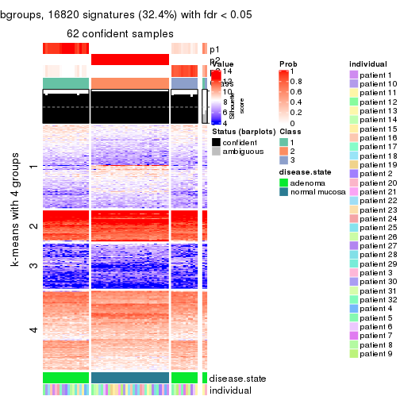</p>

</div>
<div id='tab-ATC-pam-get-signatures-no-scale-3'>
<pre><code class="r">get_signatures(res, k = 4, scale_rows = FALSE)
</code></pre>

<p></p>

</div>
<div id='tab-ATC-pam-get-signatures-no-scale-4'>
<pre><code class="r">get_signatures(res, k = 5, scale_rows = FALSE)
</code></pre>

<p></p>

</div>
<div id='tab-ATC-pam-get-signatures-no-scale-5'>
<pre><code class="r">get_signatures(res, k = 6, scale_rows = FALSE)
</code></pre>

<p></p>

</div>
</div>


Compare the overlap of signatures from different k:

```r
compare_signatures(res)
```


`get_signature()` returns a data frame invisibly. TO get the list of signatures, the function
call should be assigned to a variable explicitly. In following code, if `plot` argument is set
to `FALSE`, no heatmap is plotted while only the differential analysis is performed.

```r
# code only for demonstration
tb = get_signature(res, k = ..., plot = FALSE)
```

An example of the output of `tb` is:

```
#>   which_row         fdr    mean_1    mean_2 scaled_mean_1 scaled_mean_2 km
#> 1        38 0.042760348  8.373488  9.131774    -0.5533452     0.5164555  1
#> 2        40 0.018707592  7.106213  8.469186    -0.6173731     0.5762149  1
#> 3        55 0.019134737 10.221463 11.207825    -0.6159697     0.5749050  1
#> 4        59 0.006059896  5.921854  7.869574    -0.6899429     0.6439467  1
#> 5        60 0.018055526  8.928898 10.211722    -0.6204761     0.5791110  1
#> 6        98 0.009384629 15.714769 14.887706     0.6635654    -0.6193277  2
...
```

The columns in `tb` are:

1. `which_row`: row indices corresponding to the input matrix.
2. `fdr`: FDR for the differential test. 
3. `mean_x`: The mean value in group x.
4. `scaled_mean_x`: The mean value in group x after rows are scaled.
5. `km`: Row groups if k-means clustering is applied to rows.


UMAP plot which shows how samples are separated.


<script>
$( function() {
	$( '#tabs-ATC-pam-dimension-reduction' ).tabs();
} );
</script>
<div id='tabs-ATC-pam-dimension-reduction'>
<ul>
<li><a href='#tab-ATC-pam-dimension-reduction-1'>k = 2</a></li>
<li><a href='#tab-ATC-pam-dimension-reduction-2'>k = 3</a></li>
<li><a href='#tab-ATC-pam-dimension-reduction-3'>k = 4</a></li>
<li><a href='#tab-ATC-pam-dimension-reduction-4'>k = 5</a></li>
<li><a href='#tab-ATC-pam-dimension-reduction-5'>k = 6</a></li>
</ul>
<div id='tab-ATC-pam-dimension-reduction-1'>
<pre><code class="r">dimension_reduction(res, k = 2, method = &quot;UMAP&quot;)
</code></pre>

<p></p>

</div>
<div id='tab-ATC-pam-dimension-reduction-2'>
<pre><code class="r">dimension_reduction(res, k = 3, method = &quot;UMAP&quot;)
</code></pre>

<p></p>

</div>
<div id='tab-ATC-pam-dimension-reduction-3'>
<pre><code class="r">dimension_reduction(res, k = 4, method = &quot;UMAP&quot;)
</code></pre>

<p></p>

</div>
<div id='tab-ATC-pam-dimension-reduction-4'>
<pre><code class="r">dimension_reduction(res, k = 5, method = &quot;UMAP&quot;)
</code></pre>

<p></p>

</div>
<div id='tab-ATC-pam-dimension-reduction-5'>
<pre><code class="r">dimension_reduction(res, k = 6, method = &quot;UMAP&quot;)
</code></pre>

<p></p>

</div>
</div>


Following heatmap shows how subgroups are split when increasing `k`:

```r
collect_classes(res)
```


Test correlation between subgroups and known annotations. If the known
annotation is numeric, one-way ANOVA test is applied, and if the known
annotation is discrete, chi-squared contingency table test is applied.

```r
test_to_known_factors(res)
```

```
#>          n disease.state(p) individual(p) k
#> ATC:pam 64         9.19e-15         1.000 2
#> ATC:pam 62         3.44e-14         0.999 3
#> ATC:pam 59         9.61e-13         0.991 4
#> ATC:pam 50         1.39e-11         0.997 5
#> ATC:pam 48         3.78e-11         0.993 6
```


If matrix rows can be associated to genes, consider to use `functional_enrichment(res,
...)` to perform function enrichment for the signature genes. See [this vignette](http://bioconductor.org/packages/devel/bioc/vignettes/cola/inst/doc/functional_enrichment.html) for more detailed explanations.


 

---------------------------------------------------


### ATC:mclust**


The object with results only for a single top-value method and a single partition method 
can be extracted as:

```r
res = res_list["ATC", "mclust"]
# you can also extract it by
# res = res_list["ATC:mclust"]
```

A summary of `res` and all the functions that can be applied to it:

```r
res
```

```
#> A 'ConsensusPartition' object with k = 2, 3, 4, 5, 6.
#>   On a matrix with 51941 rows and 64 columns.
#>   Top rows (1000, 2000, 3000, 4000, 5000) are extracted by 'ATC' method.
#>   Subgroups are detected by 'mclust' method.
#>   Performed in total 1250 partitions by row resampling.
#>   Best k for subgroups seems to be 2.
#> 
#> Following methods can be applied to this 'ConsensusPartition' object:
#>  [1] "cola_report"             "collect_classes"         "collect_plots"          
#>  [4] "collect_stats"           "colnames"                "compare_signatures"     
#>  [7] "consensus_heatmap"       "dimension_reduction"     "functional_enrichment"  
#> [10] "get_anno_col"            "get_anno"                "get_classes"            
#> [13] "get_consensus"           "get_matrix"              "get_membership"         
#> [16] "get_param"               "get_signatures"          "get_stats"              
#> [19] "is_best_k"               "is_stable_k"             "membership_heatmap"     
#> [22] "ncol"                    "nrow"                    "plot_ecdf"              
#> [25] "rownames"                "select_partition_number" "show"                   
#> [28] "suggest_best_k"          "test_to_known_factors"
```

`collect_plots()` function collects all the plots made from `res` for all `k` (number of partitions)
into one single page to provide an easy and fast comparison between different `k`.

```r
collect_plots(res)
```


The plots are:

- The first row: a plot of the ECDF (empirical cumulative distribution
  function) curves of the consensus matrix for each `k` and the heatmap of
  predicted classes for each `k`.
- The second row: heatmaps of the consensus matrix for each `k`.
- The third row: heatmaps of the membership matrix for each `k`.
- The fouth row: heatmaps of the signatures for each `k`.

All the plots in panels can be made by individual functions and they are
plotted later in this section.

`select_partition_number()` produces several plots showing different
statistics for choosing "optimized" `k`. There are following statistics:

- ECDF curves of the consensus matrix for each `k`;
- 1-PAC. [The PAC
  score](https://en.wikipedia.org/wiki/Consensus_clustering#Over-interpretation_potential_of_consensus_clustering)
  measures the proportion of the ambiguous subgrouping.
- Mean silhouette score.
- Concordance. The mean probability of fiting the consensus class ids in all
  partitions.
- Area increased. Denote $A_k$ as the area under the ECDF curve for current
  `k`, the area increased is defined as $A_k - A_{k-1}$.
- Rand index. The percent of pairs of samples that are both in a same cluster
  or both are not in a same cluster in the partition of k and k-1.
- Jaccard index. The ratio of pairs of samples are both in a same cluster in
  the partition of k and k-1 and the pairs of samples are both in a same
  cluster in the partition k or k-1.

The detailed explanations of these statistics can be found in [the _cola_
vignette](http://bioconductor.org/packages/devel/bioc/vignettes/cola/inst/doc/cola.html#toc_13).

Generally speaking, lower PAC score, higher mean silhouette score or higher
concordance corresponds to better partition. Rand index and Jaccard index
measure how similar the current partition is compared to partition with `k-1`.
If they are too similar, we won't accept `k` is better than `k-1`.

```r
select_partition_number(res)
```


The numeric values for all these statistics can be obtained by `get_stats()`.

```r
get_stats(res)
```

```
#>   k 1-PAC mean_silhouette concordance area_increased  Rand Jaccard
#> 2 2 1.000           1.000       1.000         0.5084 0.492   0.492
#> 3 3 0.652           0.652       0.846         0.1860 0.985   0.969
#> 4 4 0.611           0.553       0.757         0.1242 0.889   0.768
#> 5 5 0.586           0.464       0.660         0.0824 0.835   0.611
#> 6 6 0.593           0.352       0.629         0.0558 0.779   0.440
```

`suggest_best_k()` suggests the best $k$ based on these statistics. The rules are as follows:

- All $k$ with Jaccard index larger than 0.95 are removed because increasing
  $k$ does not provide enough extra information. If all $k$ are removed, it is
  marked as no subgroup is detected.
- For all $k$ with 1-PAC score larger than 0.9, the maximal $k$ is taken as
  the best $k$, and other $k$ are marked as optional $k$.
- If it does not fit the second rule. The $k$ with the maximal vote of the
  highest 1-PAC score, highest mean silhouette, and highest concordance is
  taken as the best $k$.

```r
suggest_best_k(res)
```

```
#> [1] 2
```


Following shows the table of the partitions (You need to click the **show/hide
code output** link to see it). The membership matrix (columns with name `p*`)
is inferred by
[`clue::cl_consensus()`](https://www.rdocumentation.org/link/cl_consensus?package=clue)
function with the `SE` method. Basically the value in the membership matrix
represents the probability to belong to a certain group. The finall class
label for an item is determined with the group with highest probability it
belongs to.

In `get_classes()` function, the entropy is calculated from the membership
matrix and the silhouette score is calculated from the consensus matrix.


<script>
$( function() {
	$( '#tabs-ATC-mclust-get-classes' ).tabs();
} );
</script>
<div id='tabs-ATC-mclust-get-classes'>
<ul>
<li><a href='#tab-ATC-mclust-get-classes-1'>k = 2</a></li>
<li><a href='#tab-ATC-mclust-get-classes-2'>k = 3</a></li>
<li><a href='#tab-ATC-mclust-get-classes-3'>k = 4</a></li>
<li><a href='#tab-ATC-mclust-get-classes-4'>k = 5</a></li>
<li><a href='#tab-ATC-mclust-get-classes-5'>k = 6</a></li>
</ul>

<div id='tab-ATC-mclust-get-classes-1'>
<p><a id='tab-ATC-mclust-get-classes-1-a' style='color:#0366d6' href='#'>show/hide code output</a></p>
<pre><code class="r">cbind(get_classes(res, k = 2), get_membership(res, k = 2))
</code></pre>

<pre><code>#&gt;           class entropy silhouette p1 p2
#&gt; GSM215051     2       0          1  0  1
#&gt; GSM215052     2       0          1  0  1
#&gt; GSM215053     2       0          1  0  1
#&gt; GSM215054     2       0          1  0  1
#&gt; GSM215055     2       0          1  0  1
#&gt; GSM215056     2       0          1  0  1
#&gt; GSM215057     2       0          1  0  1
#&gt; GSM215058     2       0          1  0  1
#&gt; GSM215059     2       0          1  0  1
#&gt; GSM215060     2       0          1  0  1
#&gt; GSM215061     2       0          1  0  1
#&gt; GSM215062     2       0          1  0  1
#&gt; GSM215063     2       0          1  0  1
#&gt; GSM215064     2       0          1  0  1
#&gt; GSM215065     2       0          1  0  1
#&gt; GSM215066     2       0          1  0  1
#&gt; GSM215067     2       0          1  0  1
#&gt; GSM215068     2       0          1  0  1
#&gt; GSM215069     2       0          1  0  1
#&gt; GSM215070     2       0          1  0  1
#&gt; GSM215071     2       0          1  0  1
#&gt; GSM215072     2       0          1  0  1
#&gt; GSM215073     2       0          1  0  1
#&gt; GSM215074     2       0          1  0  1
#&gt; GSM215075     2       0          1  0  1
#&gt; GSM215076     2       0          1  0  1
#&gt; GSM215077     2       0          1  0  1
#&gt; GSM215078     2       0          1  0  1
#&gt; GSM215079     2       0          1  0  1
#&gt; GSM215080     2       0          1  0  1
#&gt; GSM215081     2       0          1  0  1
#&gt; GSM215082     2       0          1  0  1
#&gt; GSM215083     1       0          1  1  0
#&gt; GSM215084     1       0          1  1  0
#&gt; GSM215085     1       0          1  1  0
#&gt; GSM215086     1       0          1  1  0
#&gt; GSM215087     1       0          1  1  0
#&gt; GSM215088     1       0          1  1  0
#&gt; GSM215089     1       0          1  1  0
#&gt; GSM215090     1       0          1  1  0
#&gt; GSM215091     1       0          1  1  0
#&gt; GSM215092     1       0          1  1  0
#&gt; GSM215093     1       0          1  1  0
#&gt; GSM215094     1       0          1  1  0
#&gt; GSM215095     1       0          1  1  0
#&gt; GSM215096     1       0          1  1  0
#&gt; GSM215097     1       0          1  1  0
#&gt; GSM215098     1       0          1  1  0
#&gt; GSM215099     1       0          1  1  0
#&gt; GSM215100     1       0          1  1  0
#&gt; GSM215101     1       0          1  1  0
#&gt; GSM215102     1       0          1  1  0
#&gt; GSM215103     1       0          1  1  0
#&gt; GSM215104     1       0          1  1  0
#&gt; GSM215105     1       0          1  1  0
#&gt; GSM215106     1       0          1  1  0
#&gt; GSM215107     1       0          1  1  0
#&gt; GSM215108     1       0          1  1  0
#&gt; GSM215109     1       0          1  1  0
#&gt; GSM215110     1       0          1  1  0
#&gt; GSM215111     1       0          1  1  0
#&gt; GSM215112     1       0          1  1  0
#&gt; GSM215113     1       0          1  1  0
#&gt; GSM215114     1       0          1  1  0
</code></pre>

<script>
$('#tab-ATC-mclust-get-classes-1-a').parent().next().next().hide();
$('#tab-ATC-mclust-get-classes-1-a').click(function(){
  $('#tab-ATC-mclust-get-classes-1-a').parent().next().next().toggle();
  return(false);
});
</script>
</div>

<div id='tab-ATC-mclust-get-classes-2'>
<p><a id='tab-ATC-mclust-get-classes-2-a' style='color:#0366d6' href='#'>show/hide code output</a></p>
<pre><code class="r">cbind(get_classes(res, k = 3), get_membership(res, k = 3))
</code></pre>

<pre><code>#&gt;           class entropy silhouette    p1    p2    p3
#&gt; GSM215051     2  0.2959      0.889 0.000 0.900 0.100
#&gt; GSM215052     2  0.1289      0.906 0.000 0.968 0.032
#&gt; GSM215053     2  0.2537      0.895 0.000 0.920 0.080
#&gt; GSM215054     2  0.2537      0.895 0.000 0.920 0.080
#&gt; GSM215055     2  0.2959      0.900 0.000 0.900 0.100
#&gt; GSM215056     2  0.4842      0.840 0.000 0.776 0.224
#&gt; GSM215057     2  0.4931      0.835 0.000 0.768 0.232
#&gt; GSM215058     2  0.2448      0.898 0.000 0.924 0.076
#&gt; GSM215059     2  0.2711      0.900 0.000 0.912 0.088
#&gt; GSM215060     2  0.3116      0.893 0.000 0.892 0.108
#&gt; GSM215061     2  0.2959      0.890 0.000 0.900 0.100
#&gt; GSM215062     2  0.4974      0.825 0.000 0.764 0.236
#&gt; GSM215063     2  0.3686      0.875 0.000 0.860 0.140
#&gt; GSM215064     2  0.4974      0.825 0.000 0.764 0.236
#&gt; GSM215065     2  0.5254      0.813 0.000 0.736 0.264
#&gt; GSM215066     2  0.0424      0.904 0.000 0.992 0.008
#&gt; GSM215067     2  0.5138      0.821 0.000 0.748 0.252
#&gt; GSM215068     2  0.2796      0.893 0.000 0.908 0.092
#&gt; GSM215069     2  0.2796      0.895 0.000 0.908 0.092
#&gt; GSM215070     2  0.2537      0.895 0.000 0.920 0.080
#&gt; GSM215071     2  0.2878      0.899 0.000 0.904 0.096
#&gt; GSM215072     2  0.2796      0.894 0.000 0.908 0.092
#&gt; GSM215073     2  0.3116      0.893 0.000 0.892 0.108
#&gt; GSM215074     2  0.1860      0.904 0.000 0.948 0.052
#&gt; GSM215075     2  0.0424      0.905 0.000 0.992 0.008
#&gt; GSM215076     2  0.2959      0.891 0.000 0.900 0.100
#&gt; GSM215077     2  0.3482      0.886 0.000 0.872 0.128
#&gt; GSM215078     2  0.3482      0.886 0.000 0.872 0.128
#&gt; GSM215079     2  0.2711      0.893 0.000 0.912 0.088
#&gt; GSM215080     2  0.2711      0.893 0.000 0.912 0.088
#&gt; GSM215081     2  0.1163      0.905 0.000 0.972 0.028
#&gt; GSM215082     2  0.5216      0.817 0.000 0.740 0.260
#&gt; GSM215083     1  0.0747      0.667 0.984 0.000 0.016
#&gt; GSM215084     1  0.2878      0.580 0.904 0.000 0.096
#&gt; GSM215085     1  0.2165      0.650 0.936 0.000 0.064
#&gt; GSM215086     1  0.0747      0.667 0.984 0.000 0.016
#&gt; GSM215087     1  0.4452      0.484 0.808 0.000 0.192
#&gt; GSM215088     1  0.4796      0.396 0.780 0.000 0.220
#&gt; GSM215089     1  0.5397      0.279 0.720 0.000 0.280
#&gt; GSM215090     1  0.2878      0.580 0.904 0.000 0.096
#&gt; GSM215091     1  0.4452      0.485 0.808 0.000 0.192
#&gt; GSM215092     1  0.0747      0.664 0.984 0.000 0.016
#&gt; GSM215093     3  0.6307      0.000 0.488 0.000 0.512
#&gt; GSM215094     1  0.3482      0.600 0.872 0.000 0.128
#&gt; GSM215095     1  0.4399      0.507 0.812 0.000 0.188
#&gt; GSM215096     1  0.3551      0.596 0.868 0.000 0.132
#&gt; GSM215097     1  0.1163      0.666 0.972 0.000 0.028
#&gt; GSM215098     1  0.3686      0.586 0.860 0.000 0.140
#&gt; GSM215099     1  0.1163      0.664 0.972 0.000 0.028
#&gt; GSM215100     1  0.2878      0.580 0.904 0.000 0.096
#&gt; GSM215101     1  0.4399      0.483 0.812 0.000 0.188
#&gt; GSM215102     1  0.5859     -0.356 0.656 0.000 0.344
#&gt; GSM215103     1  0.5678     -0.138 0.684 0.000 0.316
#&gt; GSM215104     1  0.0747      0.667 0.984 0.000 0.016
#&gt; GSM215105     1  0.1031      0.659 0.976 0.000 0.024
#&gt; GSM215106     1  0.0747      0.667 0.984 0.000 0.016
#&gt; GSM215107     1  0.0747      0.664 0.984 0.000 0.016
#&gt; GSM215108     1  0.5785     -0.312 0.668 0.000 0.332
#&gt; GSM215109     1  0.6295     -0.865 0.528 0.000 0.472
#&gt; GSM215110     1  0.2796      0.586 0.908 0.000 0.092
#&gt; GSM215111     1  0.0747      0.664 0.984 0.000 0.016
#&gt; GSM215112     1  0.4504      0.491 0.804 0.000 0.196
#&gt; GSM215113     1  0.2878      0.580 0.904 0.000 0.096
#&gt; GSM215114     1  0.5591      0.130 0.696 0.000 0.304
</code></pre>

<script>
$('#tab-ATC-mclust-get-classes-2-a').parent().next().next().hide();
$('#tab-ATC-mclust-get-classes-2-a').click(function(){
  $('#tab-ATC-mclust-get-classes-2-a').parent().next().next().toggle();
  return(false);
});
</script>
</div>

<div id='tab-ATC-mclust-get-classes-3'>
<p><a id='tab-ATC-mclust-get-classes-3-a' style='color:#0366d6' href='#'>show/hide code output</a></p>
<pre><code class="r">cbind(get_classes(res, k = 4), get_membership(res, k = 4))
</code></pre>

<pre><code>#&gt;           class entropy silhouette    p1    p2    p3    p4
#&gt; GSM215051     2  0.4955     0.5489 0.000 0.556 0.000 0.444
#&gt; GSM215052     2  0.7080     0.1970 0.000 0.568 0.236 0.196
#&gt; GSM215053     2  0.4898     0.5622 0.000 0.584 0.000 0.416
#&gt; GSM215054     2  0.4916     0.5592 0.000 0.576 0.000 0.424
#&gt; GSM215055     2  0.5630     0.2931 0.000 0.724 0.140 0.136
#&gt; GSM215056     2  0.7628    -0.4816 0.000 0.472 0.260 0.268
#&gt; GSM215057     2  0.7651    -0.5138 0.000 0.464 0.248 0.288
#&gt; GSM215058     2  0.1256     0.5770 0.000 0.964 0.008 0.028
#&gt; GSM215059     2  0.0657     0.5695 0.000 0.984 0.004 0.012
#&gt; GSM215060     2  0.0524     0.5667 0.000 0.988 0.008 0.004
#&gt; GSM215061     2  0.7613    -0.3151 0.000 0.472 0.240 0.288
#&gt; GSM215062     4  0.7645     0.9484 0.000 0.264 0.268 0.468
#&gt; GSM215063     2  0.7627    -0.4902 0.000 0.472 0.256 0.272
#&gt; GSM215064     4  0.7645     0.9484 0.000 0.264 0.268 0.468
#&gt; GSM215065     4  0.7767     0.9451 0.000 0.300 0.268 0.432
#&gt; GSM215066     2  0.5257     0.4416 0.000 0.728 0.212 0.060
#&gt; GSM215067     4  0.7777     0.9423 0.000 0.304 0.268 0.428
#&gt; GSM215068     2  0.1411     0.5585 0.000 0.960 0.020 0.020
#&gt; GSM215069     2  0.0376     0.5688 0.000 0.992 0.004 0.004
#&gt; GSM215070     2  0.4830     0.5676 0.000 0.608 0.000 0.392
#&gt; GSM215071     2  0.3907     0.5917 0.000 0.768 0.000 0.232
#&gt; GSM215072     2  0.1059     0.5620 0.000 0.972 0.016 0.012
#&gt; GSM215073     2  0.0672     0.5684 0.000 0.984 0.008 0.008
#&gt; GSM215074     2  0.4795     0.5865 0.000 0.696 0.012 0.292
#&gt; GSM215075     2  0.5314     0.4942 0.000 0.748 0.144 0.108
#&gt; GSM215076     2  0.5366     0.5422 0.000 0.548 0.012 0.440
#&gt; GSM215077     2  0.4941     0.5521 0.000 0.564 0.000 0.436
#&gt; GSM215078     2  0.5112     0.5496 0.000 0.560 0.004 0.436
#&gt; GSM215079     2  0.5088     0.5581 0.000 0.572 0.004 0.424
#&gt; GSM215080     2  0.0336     0.5688 0.000 0.992 0.008 0.000
#&gt; GSM215081     2  0.5291     0.4200 0.000 0.740 0.180 0.080
#&gt; GSM215082     2  0.7836    -0.6400 0.000 0.400 0.272 0.328
#&gt; GSM215083     1  0.1174     0.8025 0.968 0.000 0.012 0.020
#&gt; GSM215084     1  0.1936     0.7884 0.940 0.000 0.028 0.032
#&gt; GSM215085     1  0.2565     0.7856 0.912 0.000 0.056 0.032
#&gt; GSM215086     1  0.1488     0.7953 0.956 0.000 0.012 0.032
#&gt; GSM215087     1  0.3266     0.7082 0.832 0.000 0.168 0.000
#&gt; GSM215088     1  0.5016    -0.0217 0.600 0.000 0.396 0.004
#&gt; GSM215089     1  0.4819     0.2229 0.652 0.000 0.344 0.004
#&gt; GSM215090     1  0.1936     0.7884 0.940 0.000 0.028 0.032
#&gt; GSM215091     1  0.3726     0.6373 0.788 0.000 0.212 0.000
#&gt; GSM215092     1  0.1610     0.7935 0.952 0.000 0.016 0.032
#&gt; GSM215093     3  0.4857     0.7730 0.324 0.000 0.668 0.008
#&gt; GSM215094     1  0.2706     0.7774 0.900 0.000 0.080 0.020
#&gt; GSM215095     1  0.3355     0.7168 0.836 0.000 0.160 0.004
#&gt; GSM215096     1  0.2662     0.7765 0.900 0.000 0.084 0.016
#&gt; GSM215097     1  0.1724     0.7977 0.948 0.000 0.020 0.032
#&gt; GSM215098     1  0.2775     0.7729 0.896 0.000 0.084 0.020
#&gt; GSM215099     1  0.1297     0.7980 0.964 0.000 0.020 0.016
#&gt; GSM215100     1  0.1936     0.7884 0.940 0.000 0.028 0.032
#&gt; GSM215101     1  0.4018     0.6121 0.772 0.000 0.224 0.004
#&gt; GSM215102     3  0.5894     0.7517 0.428 0.000 0.536 0.036
#&gt; GSM215103     3  0.4961     0.5753 0.448 0.000 0.552 0.000
#&gt; GSM215104     1  0.1488     0.7953 0.956 0.000 0.012 0.032
#&gt; GSM215105     1  0.2032     0.7879 0.936 0.000 0.036 0.028
#&gt; GSM215106     1  0.1488     0.7953 0.956 0.000 0.012 0.032
#&gt; GSM215107     1  0.1610     0.7935 0.952 0.000 0.016 0.032
#&gt; GSM215108     3  0.5971     0.7476 0.428 0.000 0.532 0.040
#&gt; GSM215109     3  0.5517     0.7883 0.316 0.000 0.648 0.036
#&gt; GSM215110     1  0.1936     0.7884 0.940 0.000 0.028 0.032
#&gt; GSM215111     1  0.1406     0.7984 0.960 0.000 0.016 0.024
#&gt; GSM215112     1  0.3402     0.7107 0.832 0.000 0.164 0.004
#&gt; GSM215113     1  0.1936     0.7884 0.940 0.000 0.028 0.032
#&gt; GSM215114     1  0.5105    -0.1919 0.564 0.000 0.432 0.004
</code></pre>

<script>
$('#tab-ATC-mclust-get-classes-3-a').parent().next().next().hide();
$('#tab-ATC-mclust-get-classes-3-a').click(function(){
  $('#tab-ATC-mclust-get-classes-3-a').parent().next().next().toggle();
  return(false);
});
</script>
</div>

<div id='tab-ATC-mclust-get-classes-4'>
<p><a id='tab-ATC-mclust-get-classes-4-a' style='color:#0366d6' href='#'>show/hide code output</a></p>
<pre><code class="r">cbind(get_classes(res, k = 5), get_membership(res, k = 5))
</code></pre>

<pre><code>#&gt;           class entropy silhouette    p1    p2    p3 p4    p5
#&gt; GSM215051     2  0.5598    0.36408 0.000 0.524 0.000 NA 0.076
#&gt; GSM215052     2  0.3641    0.44805 0.000 0.820 0.000 NA 0.120
#&gt; GSM215053     2  0.5131    0.36469 0.000 0.588 0.000 NA 0.048
#&gt; GSM215054     2  0.5351    0.37630 0.000 0.560 0.000 NA 0.060
#&gt; GSM215055     2  0.3730   -0.27485 0.000 0.712 0.000 NA 0.288
#&gt; GSM215056     2  0.1443    0.39250 0.000 0.948 0.004 NA 0.044
#&gt; GSM215057     2  0.1124    0.39398 0.000 0.960 0.000 NA 0.036
#&gt; GSM215058     2  0.5176   -0.81926 0.000 0.492 0.000 NA 0.468
#&gt; GSM215059     2  0.4452   -0.95747 0.000 0.500 0.000 NA 0.496
#&gt; GSM215060     5  0.4304    0.97669 0.000 0.484 0.000 NA 0.516
#&gt; GSM215061     2  0.2962    0.44290 0.000 0.868 0.000 NA 0.084
#&gt; GSM215062     2  0.4735    0.35279 0.000 0.680 0.000 NA 0.272
#&gt; GSM215063     2  0.1041    0.40213 0.000 0.964 0.000 NA 0.032
#&gt; GSM215064     2  0.4668    0.35275 0.000 0.684 0.000 NA 0.272
#&gt; GSM215065     2  0.4488    0.34953 0.000 0.736 0.004 NA 0.212
#&gt; GSM215066     2  0.2409    0.38214 0.000 0.900 0.000 NA 0.068
#&gt; GSM215067     2  0.4316    0.34608 0.000 0.748 0.004 NA 0.208
#&gt; GSM215068     5  0.4306    0.96398 0.000 0.492 0.000 NA 0.508
#&gt; GSM215069     5  0.4306    0.97356 0.000 0.492 0.000 NA 0.508
#&gt; GSM215070     2  0.4524    0.32783 0.000 0.644 0.000 NA 0.020
#&gt; GSM215071     2  0.5687   -0.01782 0.000 0.628 0.000 NA 0.208
#&gt; GSM215072     5  0.4306    0.96586 0.000 0.492 0.000 NA 0.508
#&gt; GSM215073     5  0.4304    0.97669 0.000 0.484 0.000 NA 0.516
#&gt; GSM215074     2  0.6166    0.06285 0.000 0.552 0.000 NA 0.188
#&gt; GSM215075     2  0.4563    0.30370 0.000 0.708 0.000 NA 0.244
#&gt; GSM215076     2  0.6074    0.37208 0.000 0.500 0.000 NA 0.128
#&gt; GSM215077     2  0.5467    0.34878 0.000 0.548 0.000 NA 0.068
#&gt; GSM215078     2  0.5423    0.35070 0.000 0.548 0.000 NA 0.064
#&gt; GSM215079     2  0.5535    0.36864 0.000 0.536 0.000 NA 0.072
#&gt; GSM215080     5  0.4305    0.97418 0.000 0.488 0.000 NA 0.512
#&gt; GSM215081     2  0.2873    0.32096 0.000 0.860 0.000 NA 0.120
#&gt; GSM215082     2  0.3213    0.37327 0.000 0.836 0.004 NA 0.144
#&gt; GSM215083     1  0.1082    0.71272 0.964 0.000 0.008 NA 0.000
#&gt; GSM215084     1  0.3752    0.64736 0.708 0.000 0.000 NA 0.000
#&gt; GSM215085     1  0.3815    0.63196 0.824 0.000 0.080 NA 0.008
#&gt; GSM215086     1  0.0960    0.70534 0.972 0.000 0.016 NA 0.004
#&gt; GSM215087     1  0.5554    0.40916 0.616 0.000 0.292 NA 0.004
#&gt; GSM215088     3  0.4305    0.49182 0.296 0.000 0.688 NA 0.012
#&gt; GSM215089     3  0.4538    0.38680 0.364 0.000 0.620 NA 0.000
#&gt; GSM215090     1  0.3774    0.64406 0.704 0.000 0.000 NA 0.000
#&gt; GSM215091     1  0.5753    0.21949 0.552 0.000 0.360 NA 0.004
#&gt; GSM215092     1  0.3636    0.65761 0.728 0.000 0.000 NA 0.000
#&gt; GSM215093     3  0.2291    0.59257 0.024 0.000 0.916 NA 0.012
#&gt; GSM215094     1  0.4089    0.62951 0.804 0.000 0.088 NA 0.008
#&gt; GSM215095     1  0.5389    0.45996 0.648 0.000 0.260 NA 0.004
#&gt; GSM215096     1  0.4037    0.62381 0.808 0.000 0.096 NA 0.008
#&gt; GSM215097     1  0.1059    0.70459 0.968 0.000 0.020 NA 0.004
#&gt; GSM215098     1  0.4075    0.61899 0.800 0.000 0.100 NA 0.004
#&gt; GSM215099     1  0.1764    0.71310 0.928 0.000 0.008 NA 0.000
#&gt; GSM215100     1  0.3752    0.64772 0.708 0.000 0.000 NA 0.000
#&gt; GSM215101     3  0.5192    0.00393 0.472 0.000 0.492 NA 0.004
#&gt; GSM215102     3  0.6630    0.39154 0.208 0.000 0.472 NA 0.004
#&gt; GSM215103     3  0.2890    0.59693 0.160 0.000 0.836 NA 0.004
#&gt; GSM215104     1  0.0833    0.70440 0.976 0.000 0.016 NA 0.004
#&gt; GSM215105     1  0.4803    0.61616 0.720 0.000 0.096 NA 0.000
#&gt; GSM215106     1  0.0833    0.70440 0.976 0.000 0.016 NA 0.004
#&gt; GSM215107     1  0.3661    0.65565 0.724 0.000 0.000 NA 0.000
#&gt; GSM215108     3  0.6640    0.38811 0.212 0.000 0.472 NA 0.004
#&gt; GSM215109     3  0.4389    0.57245 0.036 0.000 0.768 NA 0.020
#&gt; GSM215110     1  0.3752    0.64736 0.708 0.000 0.000 NA 0.000
#&gt; GSM215111     1  0.2411    0.70555 0.884 0.000 0.008 NA 0.000
#&gt; GSM215112     1  0.5482    0.44883 0.636 0.000 0.268 NA 0.004
#&gt; GSM215113     1  0.3774    0.64545 0.704 0.000 0.000 NA 0.000
#&gt; GSM215114     3  0.4025    0.56370 0.232 0.000 0.748 NA 0.012
</code></pre>

<script>
$('#tab-ATC-mclust-get-classes-4-a').parent().next().next().hide();
$('#tab-ATC-mclust-get-classes-4-a').click(function(){
  $('#tab-ATC-mclust-get-classes-4-a').parent().next().next().toggle();
  return(false);
});
</script>
</div>

<div id='tab-ATC-mclust-get-classes-5'>
<p><a id='tab-ATC-mclust-get-classes-5-a' style='color:#0366d6' href='#'>show/hide code output</a></p>
<pre><code class="r">cbind(get_classes(res, k = 6), get_membership(res, k = 6))
</code></pre>

<pre><code>#&gt;           class entropy silhouette    p1    p2    p3 p4    p5    p6
#&gt; GSM215051     6  0.3756     0.8358 0.000 0.400 0.000 NA 0.000 0.600
#&gt; GSM215052     2  0.4882    -0.2367 0.000 0.576 0.000 NA 0.000 0.352
#&gt; GSM215053     2  0.3874    -0.3161 0.000 0.636 0.000 NA 0.000 0.356
#&gt; GSM215054     2  0.3782    -0.4558 0.000 0.588 0.000 NA 0.000 0.412
#&gt; GSM215055     2  0.3924     0.4354 0.000 0.740 0.000 NA 0.000 0.052
#&gt; GSM215056     2  0.2822     0.4150 0.000 0.852 0.000 NA 0.000 0.040
#&gt; GSM215057     2  0.2618     0.4152 0.000 0.860 0.000 NA 0.000 0.024
#&gt; GSM215058     2  0.4892     0.3246 0.000 0.628 0.000 NA 0.000 0.100
#&gt; GSM215059     2  0.3652     0.4157 0.000 0.672 0.000 NA 0.000 0.004
#&gt; GSM215060     2  0.3699     0.3975 0.000 0.660 0.000 NA 0.000 0.004
#&gt; GSM215061     2  0.4494     0.0800 0.000 0.692 0.004 NA 0.000 0.232
#&gt; GSM215062     2  0.5753     0.2373 0.004 0.516 0.004 NA 0.000 0.144
#&gt; GSM215063     2  0.2506     0.3946 0.000 0.880 0.000 NA 0.000 0.052
#&gt; GSM215064     2  0.5694     0.2428 0.004 0.524 0.004 NA 0.000 0.136
#&gt; GSM215065     2  0.5381     0.2570 0.000 0.568 0.004 NA 0.000 0.124
#&gt; GSM215066     2  0.3013     0.2291 0.000 0.832 0.004 NA 0.000 0.140
#&gt; GSM215067     2  0.4735     0.3214 0.004 0.644 0.004 NA 0.000 0.056
#&gt; GSM215068     2  0.3938     0.4184 0.000 0.660 0.000 NA 0.000 0.016
#&gt; GSM215069     2  0.3636     0.4002 0.000 0.676 0.000 NA 0.000 0.004
#&gt; GSM215070     2  0.3081     0.0645 0.000 0.776 0.000 NA 0.000 0.220
#&gt; GSM215071     2  0.3602     0.2832 0.000 0.796 0.000 NA 0.000 0.116
#&gt; GSM215072     2  0.4002     0.4087 0.000 0.660 0.000 NA 0.000 0.020
#&gt; GSM215073     2  0.3774     0.3947 0.000 0.664 0.000 NA 0.000 0.008
#&gt; GSM215074     2  0.4691     0.1029 0.000 0.672 0.000 NA 0.000 0.220
#&gt; GSM215075     2  0.4704     0.0709 0.000 0.664 0.000 NA 0.000 0.236
#&gt; GSM215076     6  0.4619     0.7484 0.000 0.392 0.000 NA 0.000 0.564
#&gt; GSM215077     6  0.4141     0.8059 0.000 0.432 0.000 NA 0.000 0.556
#&gt; GSM215078     6  0.4083     0.8001 0.000 0.460 0.000 NA 0.000 0.532
#&gt; GSM215079     6  0.4018     0.8402 0.000 0.412 0.000 NA 0.000 0.580
#&gt; GSM215080     2  0.3952     0.3889 0.000 0.672 0.000 NA 0.000 0.020
#&gt; GSM215081     2  0.3183     0.3813 0.000 0.828 0.000 NA 0.000 0.112
#&gt; GSM215082     2  0.5365     0.1751 0.008 0.616 0.000 NA 0.000 0.160
#&gt; GSM215083     1  0.3961     0.3742 0.556 0.000 0.004 NA 0.440 0.000
#&gt; GSM215084     5  0.0790     0.6409 0.032 0.000 0.000 NA 0.968 0.000
#&gt; GSM215085     1  0.5886     0.5285 0.612 0.000 0.112 NA 0.220 0.004
#&gt; GSM215086     1  0.3717     0.4620 0.616 0.000 0.000 NA 0.384 0.000
#&gt; GSM215087     3  0.6932     0.0186 0.332 0.000 0.392 NA 0.220 0.004
#&gt; GSM215088     3  0.3603     0.5905 0.036 0.000 0.840 NA 0.064 0.016
#&gt; GSM215089     3  0.3961     0.5742 0.096 0.000 0.792 NA 0.096 0.012
#&gt; GSM215090     5  0.0000     0.6391 0.000 0.000 0.000 NA 1.000 0.000
#&gt; GSM215091     3  0.6626     0.1029 0.384 0.000 0.416 NA 0.144 0.004
#&gt; GSM215092     5  0.0790     0.6363 0.032 0.000 0.000 NA 0.968 0.000
#&gt; GSM215093     3  0.3857     0.5323 0.068 0.000 0.816 NA 0.004 0.044
#&gt; GSM215094     1  0.6117     0.4635 0.588 0.000 0.144 NA 0.212 0.004
#&gt; GSM215095     1  0.6848    -0.0210 0.412 0.000 0.336 NA 0.196 0.004
#&gt; GSM215096     1  0.5943     0.4834 0.616 0.000 0.144 NA 0.184 0.004
#&gt; GSM215097     1  0.3890     0.4566 0.596 0.000 0.004 NA 0.400 0.000
#&gt; GSM215098     1  0.6138     0.4446 0.588 0.000 0.156 NA 0.200 0.004
#&gt; GSM215099     5  0.3867    -0.3077 0.488 0.000 0.000 NA 0.512 0.000
#&gt; GSM215100     5  0.0000     0.6391 0.000 0.000 0.000 NA 1.000 0.000
#&gt; GSM215101     3  0.6123     0.3789 0.252 0.000 0.572 NA 0.120 0.004
#&gt; GSM215102     5  0.8186     0.2370 0.232 0.000 0.216 NA 0.360 0.140
#&gt; GSM215103     3  0.4415     0.5637 0.132 0.000 0.768 NA 0.052 0.008
#&gt; GSM215104     1  0.3737     0.4621 0.608 0.000 0.000 NA 0.392 0.000
#&gt; GSM215105     5  0.5863     0.0297 0.360 0.000 0.124 NA 0.500 0.008
#&gt; GSM215106     1  0.3684     0.4605 0.628 0.000 0.000 NA 0.372 0.000
#&gt; GSM215107     5  0.0937     0.6307 0.040 0.000 0.000 NA 0.960 0.000
#&gt; GSM215108     5  0.8228     0.2308 0.232 0.000 0.216 NA 0.356 0.140
#&gt; GSM215109     3  0.6961     0.3734 0.176 0.000 0.540 NA 0.024 0.168
#&gt; GSM215110     5  0.0692     0.6422 0.020 0.000 0.004 NA 0.976 0.000
#&gt; GSM215111     5  0.4086    -0.2146 0.464 0.000 0.008 NA 0.528 0.000
#&gt; GSM215112     3  0.6971    -0.0403 0.336 0.000 0.376 NA 0.232 0.004
#&gt; GSM215113     5  0.0632     0.6415 0.024 0.000 0.000 NA 0.976 0.000
#&gt; GSM215114     3  0.3780     0.5864 0.032 0.000 0.828 NA 0.064 0.016
</code></pre>

<script>
$('#tab-ATC-mclust-get-classes-5-a').parent().next().next().hide();
$('#tab-ATC-mclust-get-classes-5-a').click(function(){
  $('#tab-ATC-mclust-get-classes-5-a').parent().next().next().toggle();
  return(false);
});
</script>
</div>
</div>

Heatmaps for the consensus matrix. It visualizes the probability of two
samples to be in a same group.


<script>
$( function() {
	$( '#tabs-ATC-mclust-consensus-heatmap' ).tabs();
} );
</script>
<div id='tabs-ATC-mclust-consensus-heatmap'>
<ul>
<li><a href='#tab-ATC-mclust-consensus-heatmap-1'>k = 2</a></li>
<li><a href='#tab-ATC-mclust-consensus-heatmap-2'>k = 3</a></li>
<li><a href='#tab-ATC-mclust-consensus-heatmap-3'>k = 4</a></li>
<li><a href='#tab-ATC-mclust-consensus-heatmap-4'>k = 5</a></li>
<li><a href='#tab-ATC-mclust-consensus-heatmap-5'>k = 6</a></li>
</ul>
<div id='tab-ATC-mclust-consensus-heatmap-1'>
<pre><code class="r">consensus_heatmap(res, k = 2)
</code></pre>

<p></p>

</div>
<div id='tab-ATC-mclust-consensus-heatmap-2'>
<pre><code class="r">consensus_heatmap(res, k = 3)
</code></pre>

<p>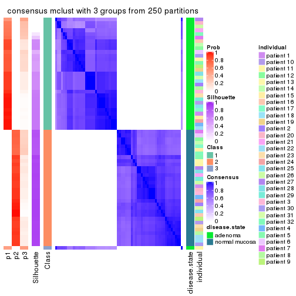</p>

</div>
<div id='tab-ATC-mclust-consensus-heatmap-3'>
<pre><code class="r">consensus_heatmap(res, k = 4)
</code></pre>

<p></p>

</div>
<div id='tab-ATC-mclust-consensus-heatmap-4'>
<pre><code class="r">consensus_heatmap(res, k = 5)
</code></pre>

<p></p>

</div>
<div id='tab-ATC-mclust-consensus-heatmap-5'>
<pre><code class="r">consensus_heatmap(res, k = 6)
</code></pre>

<p></p>

</div>
</div>

Heatmaps for the membership of samples in all partitions to see how consistent they are:


<script>
$( function() {
	$( '#tabs-ATC-mclust-membership-heatmap' ).tabs();
} );
</script>
<div id='tabs-ATC-mclust-membership-heatmap'>
<ul>
<li><a href='#tab-ATC-mclust-membership-heatmap-1'>k = 2</a></li>
<li><a href='#tab-ATC-mclust-membership-heatmap-2'>k = 3</a></li>
<li><a href='#tab-ATC-mclust-membership-heatmap-3'>k = 4</a></li>
<li><a href='#tab-ATC-mclust-membership-heatmap-4'>k = 5</a></li>
<li><a href='#tab-ATC-mclust-membership-heatmap-5'>k = 6</a></li>
</ul>
<div id='tab-ATC-mclust-membership-heatmap-1'>
<pre><code class="r">membership_heatmap(res, k = 2)
</code></pre>

<p></p>

</div>
<div id='tab-ATC-mclust-membership-heatmap-2'>
<pre><code class="r">membership_heatmap(res, k = 3)
</code></pre>

<p></p>

</div>
<div id='tab-ATC-mclust-membership-heatmap-3'>
<pre><code class="r">membership_heatmap(res, k = 4)
</code></pre>

<p></p>

</div>
<div id='tab-ATC-mclust-membership-heatmap-4'>
<pre><code class="r">membership_heatmap(res, k = 5)
</code></pre>

<p></p>

</div>
<div id='tab-ATC-mclust-membership-heatmap-5'>
<pre><code class="r">membership_heatmap(res, k = 6)
</code></pre>

<p></p>

</div>
</div>

As soon as we have had the classes for columns, we can look for signatures
which are significantly different between classes which can be candidate marks
for certain classes. Following are the heatmaps for signatures.


Signature heatmaps where rows are scaled:


<script>
$( function() {
	$( '#tabs-ATC-mclust-get-signatures' ).tabs();
} );
</script>
<div id='tabs-ATC-mclust-get-signatures'>
<ul>
<li><a href='#tab-ATC-mclust-get-signatures-1'>k = 2</a></li>
<li><a href='#tab-ATC-mclust-get-signatures-2'>k = 3</a></li>
<li><a href='#tab-ATC-mclust-get-signatures-3'>k = 4</a></li>
<li><a href='#tab-ATC-mclust-get-signatures-4'>k = 5</a></li>
<li><a href='#tab-ATC-mclust-get-signatures-5'>k = 6</a></li>
</ul>
<div id='tab-ATC-mclust-get-signatures-1'>
<pre><code class="r">get_signatures(res, k = 2)
</code></pre>

<p></p>

</div>
<div id='tab-ATC-mclust-get-signatures-2'>
<pre><code class="r">get_signatures(res, k = 3)
</code></pre>

<p></p>

</div>
<div id='tab-ATC-mclust-get-signatures-3'>
<pre><code class="r">get_signatures(res, k = 4)
</code></pre>

<p></p>

</div>
<div id='tab-ATC-mclust-get-signatures-4'>
<pre><code class="r">get_signatures(res, k = 5)
</code></pre>

<p></p>

</div>
<div id='tab-ATC-mclust-get-signatures-5'>
<pre><code class="r">get_signatures(res, k = 6)
</code></pre>

<p></p>

</div>
</div>


Signature heatmaps where rows are not scaled:


<script>
$( function() {
	$( '#tabs-ATC-mclust-get-signatures-no-scale' ).tabs();
} );
</script>
<div id='tabs-ATC-mclust-get-signatures-no-scale'>
<ul>
<li><a href='#tab-ATC-mclust-get-signatures-no-scale-1'>k = 2</a></li>
<li><a href='#tab-ATC-mclust-get-signatures-no-scale-2'>k = 3</a></li>
<li><a href='#tab-ATC-mclust-get-signatures-no-scale-3'>k = 4</a></li>
<li><a href='#tab-ATC-mclust-get-signatures-no-scale-4'>k = 5</a></li>
<li><a href='#tab-ATC-mclust-get-signatures-no-scale-5'>k = 6</a></li>
</ul>
<div id='tab-ATC-mclust-get-signatures-no-scale-1'>
<pre><code class="r">get_signatures(res, k = 2, scale_rows = FALSE)
</code></pre>

<p></p>

</div>
<div id='tab-ATC-mclust-get-signatures-no-scale-2'>
<pre><code class="r">get_signatures(res, k = 3, scale_rows = FALSE)
</code></pre>

<p></p>

</div>
<div id='tab-ATC-mclust-get-signatures-no-scale-3'>
<pre><code class="r">get_signatures(res, k = 4, scale_rows = FALSE)
</code></pre>

<p></p>

</div>
<div id='tab-ATC-mclust-get-signatures-no-scale-4'>
<pre><code class="r">get_signatures(res, k = 5, scale_rows = FALSE)
</code></pre>

<p></p>

</div>
<div id='tab-ATC-mclust-get-signatures-no-scale-5'>
<pre><code class="r">get_signatures(res, k = 6, scale_rows = FALSE)
</code></pre>

<p></p>

</div>
</div>


Compare the overlap of signatures from different k:

```r
compare_signatures(res)
```


`get_signature()` returns a data frame invisibly. TO get the list of signatures, the function
call should be assigned to a variable explicitly. In following code, if `plot` argument is set
to `FALSE`, no heatmap is plotted while only the differential analysis is performed.

```r
# code only for demonstration
tb = get_signature(res, k = ..., plot = FALSE)
```

An example of the output of `tb` is:

```
#>   which_row         fdr    mean_1    mean_2 scaled_mean_1 scaled_mean_2 km
#> 1        38 0.042760348  8.373488  9.131774    -0.5533452     0.5164555  1
#> 2        40 0.018707592  7.106213  8.469186    -0.6173731     0.5762149  1
#> 3        55 0.019134737 10.221463 11.207825    -0.6159697     0.5749050  1
#> 4        59 0.006059896  5.921854  7.869574    -0.6899429     0.6439467  1
#> 5        60 0.018055526  8.928898 10.211722    -0.6204761     0.5791110  1
#> 6        98 0.009384629 15.714769 14.887706     0.6635654    -0.6193277  2
...
```

The columns in `tb` are:

1. `which_row`: row indices corresponding to the input matrix.
2. `fdr`: FDR for the differential test. 
3. `mean_x`: The mean value in group x.
4. `scaled_mean_x`: The mean value in group x after rows are scaled.
5. `km`: Row groups if k-means clustering is applied to rows.


UMAP plot which shows how samples are separated.


<script>
$( function() {
	$( '#tabs-ATC-mclust-dimension-reduction' ).tabs();
} );
</script>
<div id='tabs-ATC-mclust-dimension-reduction'>
<ul>
<li><a href='#tab-ATC-mclust-dimension-reduction-1'>k = 2</a></li>
<li><a href='#tab-ATC-mclust-dimension-reduction-2'>k = 3</a></li>
<li><a href='#tab-ATC-mclust-dimension-reduction-3'>k = 4</a></li>
<li><a href='#tab-ATC-mclust-dimension-reduction-4'>k = 5</a></li>
<li><a href='#tab-ATC-mclust-dimension-reduction-5'>k = 6</a></li>
</ul>
<div id='tab-ATC-mclust-dimension-reduction-1'>
<pre><code class="r">dimension_reduction(res, k = 2, method = &quot;UMAP&quot;)
</code></pre>

<p></p>

</div>
<div id='tab-ATC-mclust-dimension-reduction-2'>
<pre><code class="r">dimension_reduction(res, k = 3, method = &quot;UMAP&quot;)
</code></pre>

<p></p>

</div>
<div id='tab-ATC-mclust-dimension-reduction-3'>
<pre><code class="r">dimension_reduction(res, k = 4, method = &quot;UMAP&quot;)
</code></pre>

<p></p>

</div>
<div id='tab-ATC-mclust-dimension-reduction-4'>
<pre><code class="r">dimension_reduction(res, k = 5, method = &quot;UMAP&quot;)
</code></pre>

<p></p>

</div>
<div id='tab-ATC-mclust-dimension-reduction-5'>
<pre><code class="r">dimension_reduction(res, k = 6, method = &quot;UMAP&quot;)
</code></pre>

<p></p>

</div>
</div>


Following heatmap shows how subgroups are split when increasing `k`:

```r
collect_classes(res)
```


Test correlation between subgroups and known annotations. If the known
annotation is numeric, one-way ANOVA test is applied, and if the known
annotation is discrete, chi-squared contingency table test is applied.

```r
test_to_known_factors(res)
```

```
#>             n disease.state(p) individual(p) k
#> ATC:mclust 64         9.19e-15         1.000 2
#> ATC:mclust 52         4.58e-12         1.000 3
#> ATC:mclust 51         4.89e-11         0.962 4
#> ATC:mclust 29         5.04e-07         0.585 5
#> ATC:mclust 18         4.40e-04         0.360 6
```


If matrix rows can be associated to genes, consider to use `functional_enrichment(res,
...)` to perform function enrichment for the signature genes. See [this vignette](http://bioconductor.org/packages/devel/bioc/vignettes/cola/inst/doc/functional_enrichment.html) for more detailed explanations.


 

---------------------------------------------------


### ATC:NMF**


The object with results only for a single top-value method and a single partition method 
can be extracted as:

```r
res = res_list["ATC", "NMF"]
# you can also extract it by
# res = res_list["ATC:NMF"]
```

A summary of `res` and all the functions that can be applied to it:

```r
res
```

```
#> A 'ConsensusPartition' object with k = 2, 3, 4, 5, 6.
#>   On a matrix with 51941 rows and 64 columns.
#>   Top rows (1000, 2000, 3000, 4000, 5000) are extracted by 'ATC' method.
#>   Subgroups are detected by 'NMF' method.
#>   Performed in total 1250 partitions by row resampling.
#>   Best k for subgroups seems to be 2.
#> 
#> Following methods can be applied to this 'ConsensusPartition' object:
#>  [1] "cola_report"             "collect_classes"         "collect_plots"          
#>  [4] "collect_stats"           "colnames"                "compare_signatures"     
#>  [7] "consensus_heatmap"       "dimension_reduction"     "functional_enrichment"  
#> [10] "get_anno_col"            "get_anno"                "get_classes"            
#> [13] "get_consensus"           "get_matrix"              "get_membership"         
#> [16] "get_param"               "get_signatures"          "get_stats"              
#> [19] "is_best_k"               "is_stable_k"             "membership_heatmap"     
#> [22] "ncol"                    "nrow"                    "plot_ecdf"              
#> [25] "rownames"                "select_partition_number" "show"                   
#> [28] "suggest_best_k"          "test_to_known_factors"
```

`collect_plots()` function collects all the plots made from `res` for all `k` (number of partitions)
into one single page to provide an easy and fast comparison between different `k`.

```r
collect_plots(res)
```


The plots are:

- The first row: a plot of the ECDF (empirical cumulative distribution
  function) curves of the consensus matrix for each `k` and the heatmap of
  predicted classes for each `k`.
- The second row: heatmaps of the consensus matrix for each `k`.
- The third row: heatmaps of the membership matrix for each `k`.
- The fouth row: heatmaps of the signatures for each `k`.

All the plots in panels can be made by individual functions and they are
plotted later in this section.

`select_partition_number()` produces several plots showing different
statistics for choosing "optimized" `k`. There are following statistics:

- ECDF curves of the consensus matrix for each `k`;
- 1-PAC. [The PAC
  score](https://en.wikipedia.org/wiki/Consensus_clustering#Over-interpretation_potential_of_consensus_clustering)
  measures the proportion of the ambiguous subgrouping.
- Mean silhouette score.
- Concordance. The mean probability of fiting the consensus class ids in all
  partitions.
- Area increased. Denote $A_k$ as the area under the ECDF curve for current
  `k`, the area increased is defined as $A_k - A_{k-1}$.
- Rand index. The percent of pairs of samples that are both in a same cluster
  or both are not in a same cluster in the partition of k and k-1.
- Jaccard index. The ratio of pairs of samples are both in a same cluster in
  the partition of k and k-1 and the pairs of samples are both in a same
  cluster in the partition k or k-1.

The detailed explanations of these statistics can be found in [the _cola_
vignette](http://bioconductor.org/packages/devel/bioc/vignettes/cola/inst/doc/cola.html#toc_13).

Generally speaking, lower PAC score, higher mean silhouette score or higher
concordance corresponds to better partition. Rand index and Jaccard index
measure how similar the current partition is compared to partition with `k-1`.
If they are too similar, we won't accept `k` is better than `k-1`.

```r
select_partition_number(res)
```


The numeric values for all these statistics can be obtained by `get_stats()`.

```r
get_stats(res)
```

```
#>   k 1-PAC mean_silhouette concordance area_increased  Rand Jaccard
#> 2 2 1.000           1.000       1.000         0.5084 0.492   0.492
#> 3 3 0.900           0.938       0.946         0.0899 1.000   1.000
#> 4 4 0.714           0.784       0.896         0.0665 0.985   0.969
#> 5 5 0.624           0.730       0.841         0.0686 0.985   0.968
#> 6 6 0.564           0.586       0.799         0.0587 0.970   0.935
```

`suggest_best_k()` suggests the best $k$ based on these statistics. The rules are as follows:

- All $k$ with Jaccard index larger than 0.95 are removed because increasing
  $k$ does not provide enough extra information. If all $k$ are removed, it is
  marked as no subgroup is detected.
- For all $k$ with 1-PAC score larger than 0.9, the maximal $k$ is taken as
  the best $k$, and other $k$ are marked as optional $k$.
- If it does not fit the second rule. The $k$ with the maximal vote of the
  highest 1-PAC score, highest mean silhouette, and highest concordance is
  taken as the best $k$.

```r
suggest_best_k(res)
```

```
#> [1] 2
```


Following shows the table of the partitions (You need to click the **show/hide
code output** link to see it). The membership matrix (columns with name `p*`)
is inferred by
[`clue::cl_consensus()`](https://www.rdocumentation.org/link/cl_consensus?package=clue)
function with the `SE` method. Basically the value in the membership matrix
represents the probability to belong to a certain group. The finall class
label for an item is determined with the group with highest probability it
belongs to.

In `get_classes()` function, the entropy is calculated from the membership
matrix and the silhouette score is calculated from the consensus matrix.


<script>
$( function() {
	$( '#tabs-ATC-NMF-get-classes' ).tabs();
} );
</script>
<div id='tabs-ATC-NMF-get-classes'>
<ul>
<li><a href='#tab-ATC-NMF-get-classes-1'>k = 2</a></li>
<li><a href='#tab-ATC-NMF-get-classes-2'>k = 3</a></li>
<li><a href='#tab-ATC-NMF-get-classes-3'>k = 4</a></li>
<li><a href='#tab-ATC-NMF-get-classes-4'>k = 5</a></li>
<li><a href='#tab-ATC-NMF-get-classes-5'>k = 6</a></li>
</ul>

<div id='tab-ATC-NMF-get-classes-1'>
<p><a id='tab-ATC-NMF-get-classes-1-a' style='color:#0366d6' href='#'>show/hide code output</a></p>
<pre><code class="r">cbind(get_classes(res, k = 2), get_membership(res, k = 2))
</code></pre>

<pre><code>#&gt;           class entropy silhouette p1 p2
#&gt; GSM215051     2       0          1  0  1
#&gt; GSM215052     2       0          1  0  1
#&gt; GSM215053     2       0          1  0  1
#&gt; GSM215054     2       0          1  0  1
#&gt; GSM215055     2       0          1  0  1
#&gt; GSM215056     2       0          1  0  1
#&gt; GSM215057     2       0          1  0  1
#&gt; GSM215058     2       0          1  0  1
#&gt; GSM215059     2       0          1  0  1
#&gt; GSM215060     2       0          1  0  1
#&gt; GSM215061     2       0          1  0  1
#&gt; GSM215062     2       0          1  0  1
#&gt; GSM215063     2       0          1  0  1
#&gt; GSM215064     2       0          1  0  1
#&gt; GSM215065     2       0          1  0  1
#&gt; GSM215066     2       0          1  0  1
#&gt; GSM215067     2       0          1  0  1
#&gt; GSM215068     2       0          1  0  1
#&gt; GSM215069     2       0          1  0  1
#&gt; GSM215070     2       0          1  0  1
#&gt; GSM215071     2       0          1  0  1
#&gt; GSM215072     2       0          1  0  1
#&gt; GSM215073     2       0          1  0  1
#&gt; GSM215074     2       0          1  0  1
#&gt; GSM215075     2       0          1  0  1
#&gt; GSM215076     2       0          1  0  1
#&gt; GSM215077     2       0          1  0  1
#&gt; GSM215078     2       0          1  0  1
#&gt; GSM215079     2       0          1  0  1
#&gt; GSM215080     2       0          1  0  1
#&gt; GSM215081     2       0          1  0  1
#&gt; GSM215082     2       0          1  0  1
#&gt; GSM215083     1       0          1  1  0
#&gt; GSM215084     1       0          1  1  0
#&gt; GSM215085     1       0          1  1  0
#&gt; GSM215086     1       0          1  1  0
#&gt; GSM215087     1       0          1  1  0
#&gt; GSM215088     1       0          1  1  0
#&gt; GSM215089     1       0          1  1  0
#&gt; GSM215090     1       0          1  1  0
#&gt; GSM215091     1       0          1  1  0
#&gt; GSM215092     1       0          1  1  0
#&gt; GSM215093     1       0          1  1  0
#&gt; GSM215094     1       0          1  1  0
#&gt; GSM215095     1       0          1  1  0
#&gt; GSM215096     1       0          1  1  0
#&gt; GSM215097     1       0          1  1  0
#&gt; GSM215098     1       0          1  1  0
#&gt; GSM215099     1       0          1  1  0
#&gt; GSM215100     1       0          1  1  0
#&gt; GSM215101     1       0          1  1  0
#&gt; GSM215102     1       0          1  1  0
#&gt; GSM215103     1       0          1  1  0
#&gt; GSM215104     1       0          1  1  0
#&gt; GSM215105     1       0          1  1  0
#&gt; GSM215106     1       0          1  1  0
#&gt; GSM215107     1       0          1  1  0
#&gt; GSM215108     1       0          1  1  0
#&gt; GSM215109     1       0          1  1  0
#&gt; GSM215110     1       0          1  1  0
#&gt; GSM215111     1       0          1  1  0
#&gt; GSM215112     1       0          1  1  0
#&gt; GSM215113     1       0          1  1  0
#&gt; GSM215114     1       0          1  1  0
</code></pre>

<script>
$('#tab-ATC-NMF-get-classes-1-a').parent().next().next().hide();
$('#tab-ATC-NMF-get-classes-1-a').click(function(){
  $('#tab-ATC-NMF-get-classes-1-a').parent().next().next().toggle();
  return(false);
});
</script>
</div>

<div id='tab-ATC-NMF-get-classes-2'>
<p><a id='tab-ATC-NMF-get-classes-2-a' style='color:#0366d6' href='#'>show/hide code output</a></p>
<pre><code class="r">cbind(get_classes(res, k = 3), get_membership(res, k = 3))
</code></pre>

<pre><code>#&gt;           class entropy silhouette    p1    p2    p3
#&gt; GSM215051     2  0.1163      0.972 0.000 0.972 0.028
#&gt; GSM215052     2  0.1163      0.971 0.000 0.972 0.028
#&gt; GSM215053     2  0.0592      0.976 0.000 0.988 0.012
#&gt; GSM215054     2  0.0747      0.976 0.000 0.984 0.016
#&gt; GSM215055     2  0.0237      0.976 0.000 0.996 0.004
#&gt; GSM215056     2  0.0237      0.976 0.000 0.996 0.004
#&gt; GSM215057     2  0.0237      0.977 0.000 0.996 0.004
#&gt; GSM215058     2  0.0424      0.976 0.000 0.992 0.008
#&gt; GSM215059     2  0.0000      0.976 0.000 1.000 0.000
#&gt; GSM215060     2  0.0237      0.977 0.000 0.996 0.004
#&gt; GSM215061     2  0.0424      0.976 0.000 0.992 0.008
#&gt; GSM215062     2  0.5926      0.701 0.000 0.644 0.356
#&gt; GSM215063     2  0.0424      0.976 0.000 0.992 0.008
#&gt; GSM215064     2  0.4291      0.862 0.000 0.820 0.180
#&gt; GSM215065     2  0.1964      0.953 0.000 0.944 0.056
#&gt; GSM215066     2  0.0592      0.976 0.000 0.988 0.012
#&gt; GSM215067     2  0.2959      0.924 0.000 0.900 0.100
#&gt; GSM215068     2  0.0000      0.976 0.000 1.000 0.000
#&gt; GSM215069     2  0.0000      0.976 0.000 1.000 0.000
#&gt; GSM215070     2  0.0592      0.976 0.000 0.988 0.012
#&gt; GSM215071     2  0.0592      0.976 0.000 0.988 0.012
#&gt; GSM215072     2  0.0000      0.976 0.000 1.000 0.000
#&gt; GSM215073     2  0.0000      0.976 0.000 1.000 0.000
#&gt; GSM215074     2  0.0237      0.976 0.000 0.996 0.004
#&gt; GSM215075     2  0.0892      0.973 0.000 0.980 0.020
#&gt; GSM215076     2  0.0892      0.974 0.000 0.980 0.020
#&gt; GSM215077     2  0.2066      0.955 0.000 0.940 0.060
#&gt; GSM215078     2  0.1529      0.966 0.000 0.960 0.040
#&gt; GSM215079     2  0.0747      0.975 0.000 0.984 0.016
#&gt; GSM215080     2  0.0237      0.976 0.000 0.996 0.004
#&gt; GSM215081     2  0.0237      0.977 0.000 0.996 0.004
#&gt; GSM215082     2  0.1031      0.973 0.000 0.976 0.024
#&gt; GSM215083     1  0.0747      0.945 0.984 0.000 0.016
#&gt; GSM215084     1  0.0424      0.946 0.992 0.000 0.008
#&gt; GSM215085     1  0.2625      0.926 0.916 0.000 0.084
#&gt; GSM215086     1  0.0747      0.945 0.984 0.000 0.016
#&gt; GSM215087     1  0.2356      0.930 0.928 0.000 0.072
#&gt; GSM215088     1  0.0592      0.946 0.988 0.000 0.012
#&gt; GSM215089     1  0.1163      0.943 0.972 0.000 0.028
#&gt; GSM215090     1  0.0000      0.946 1.000 0.000 0.000
#&gt; GSM215091     1  0.0892      0.945 0.980 0.000 0.020
#&gt; GSM215092     1  0.0000      0.946 1.000 0.000 0.000
#&gt; GSM215093     1  0.3192      0.908 0.888 0.000 0.112
#&gt; GSM215094     1  0.5431      0.806 0.716 0.000 0.284
#&gt; GSM215095     1  0.2537      0.927 0.920 0.000 0.080
#&gt; GSM215096     1  0.2711      0.925 0.912 0.000 0.088
#&gt; GSM215097     1  0.0237      0.946 0.996 0.000 0.004
#&gt; GSM215098     1  0.5431      0.805 0.716 0.000 0.284
#&gt; GSM215099     1  0.0747      0.945 0.984 0.000 0.016
#&gt; GSM215100     1  0.0000      0.946 1.000 0.000 0.000
#&gt; GSM215101     1  0.0000      0.946 1.000 0.000 0.000
#&gt; GSM215102     1  0.5497      0.792 0.708 0.000 0.292
#&gt; GSM215103     1  0.0892      0.945 0.980 0.000 0.020
#&gt; GSM215104     1  0.0237      0.946 0.996 0.000 0.004
#&gt; GSM215105     1  0.0892      0.945 0.980 0.000 0.020
#&gt; GSM215106     1  0.1031      0.944 0.976 0.000 0.024
#&gt; GSM215107     1  0.1163      0.943 0.972 0.000 0.028
#&gt; GSM215108     1  0.5465      0.794 0.712 0.000 0.288
#&gt; GSM215109     1  0.5678      0.773 0.684 0.000 0.316
#&gt; GSM215110     1  0.1529      0.940 0.960 0.000 0.040
#&gt; GSM215111     1  0.0237      0.946 0.996 0.000 0.004
#&gt; GSM215112     1  0.4605      0.861 0.796 0.000 0.204
#&gt; GSM215113     1  0.1411      0.941 0.964 0.000 0.036
#&gt; GSM215114     1  0.0592      0.947 0.988 0.000 0.012
</code></pre>

<script>
$('#tab-ATC-NMF-get-classes-2-a').parent().next().next().hide();
$('#tab-ATC-NMF-get-classes-2-a').click(function(){
  $('#tab-ATC-NMF-get-classes-2-a').parent().next().next().toggle();
  return(false);
});
</script>
</div>

<div id='tab-ATC-NMF-get-classes-3'>
<p><a id='tab-ATC-NMF-get-classes-3-a' style='color:#0366d6' href='#'>show/hide code output</a></p>
<pre><code class="r">cbind(get_classes(res, k = 4), get_membership(res, k = 4))
</code></pre>

<pre><code>#&gt;           class entropy silhouette    p1    p2    p3 p4
#&gt; GSM215051     2  0.1520     0.9292 0.000 0.956 0.024 NA
#&gt; GSM215052     2  0.2882     0.9107 0.000 0.892 0.024 NA
#&gt; GSM215053     2  0.0779     0.9291 0.000 0.980 0.004 NA
#&gt; GSM215054     2  0.1042     0.9295 0.000 0.972 0.008 NA
#&gt; GSM215055     2  0.0927     0.9304 0.000 0.976 0.008 NA
#&gt; GSM215056     2  0.3463     0.8919 0.000 0.864 0.040 NA
#&gt; GSM215057     2  0.2644     0.9159 0.000 0.908 0.060 NA
#&gt; GSM215058     2  0.2174     0.9223 0.000 0.928 0.052 NA
#&gt; GSM215059     2  0.1510     0.9270 0.000 0.956 0.028 NA
#&gt; GSM215060     2  0.0779     0.9293 0.000 0.980 0.016 NA
#&gt; GSM215061     2  0.1284     0.9288 0.000 0.964 0.024 NA
#&gt; GSM215062     2  0.5404     0.4749 0.000 0.512 0.012 NA
#&gt; GSM215063     2  0.1059     0.9305 0.000 0.972 0.016 NA
#&gt; GSM215064     2  0.5781     0.5911 0.000 0.584 0.036 NA
#&gt; GSM215065     2  0.3245     0.8867 0.000 0.872 0.100 NA
#&gt; GSM215066     2  0.0937     0.9297 0.000 0.976 0.012 NA
#&gt; GSM215067     2  0.3754     0.8804 0.000 0.852 0.084 NA
#&gt; GSM215068     2  0.0779     0.9297 0.000 0.980 0.004 NA
#&gt; GSM215069     2  0.0336     0.9286 0.000 0.992 0.008 NA
#&gt; GSM215070     2  0.0524     0.9295 0.000 0.988 0.004 NA
#&gt; GSM215071     2  0.0376     0.9291 0.000 0.992 0.004 NA
#&gt; GSM215072     2  0.2385     0.9208 0.000 0.920 0.052 NA
#&gt; GSM215073     2  0.0469     0.9287 0.000 0.988 0.012 NA
#&gt; GSM215074     2  0.0469     0.9301 0.000 0.988 0.000 NA
#&gt; GSM215075     2  0.1209     0.9294 0.000 0.964 0.004 NA
#&gt; GSM215076     2  0.3570     0.8940 0.000 0.860 0.092 NA
#&gt; GSM215077     2  0.4728     0.7856 0.000 0.752 0.216 NA
#&gt; GSM215078     2  0.3554     0.8756 0.000 0.844 0.136 NA
#&gt; GSM215079     2  0.0592     0.9289 0.000 0.984 0.000 NA
#&gt; GSM215080     2  0.0188     0.9287 0.000 0.996 0.000 NA
#&gt; GSM215081     2  0.2363     0.9209 0.000 0.920 0.024 NA
#&gt; GSM215082     2  0.4356     0.8432 0.000 0.804 0.148 NA
#&gt; GSM215083     1  0.1297     0.8155 0.964 0.000 0.020 NA
#&gt; GSM215084     1  0.1635     0.7966 0.948 0.000 0.044 NA
#&gt; GSM215085     1  0.4163     0.5845 0.792 0.000 0.020 NA
#&gt; GSM215086     1  0.3144     0.7621 0.884 0.000 0.072 NA
#&gt; GSM215087     1  0.1488     0.8160 0.956 0.000 0.012 NA
#&gt; GSM215088     1  0.1624     0.8111 0.952 0.000 0.028 NA
#&gt; GSM215089     1  0.2593     0.7542 0.904 0.000 0.080 NA
#&gt; GSM215090     1  0.1059     0.8110 0.972 0.000 0.016 NA
#&gt; GSM215091     1  0.1767     0.8058 0.944 0.000 0.012 NA
#&gt; GSM215092     1  0.0937     0.8162 0.976 0.000 0.012 NA
#&gt; GSM215093     1  0.5144     0.2009 0.732 0.000 0.216 NA
#&gt; GSM215094     1  0.4936     0.2171 0.672 0.000 0.012 NA
#&gt; GSM215095     1  0.1724     0.8137 0.948 0.000 0.020 NA
#&gt; GSM215096     1  0.4567     0.4494 0.740 0.000 0.016 NA
#&gt; GSM215097     1  0.1624     0.8127 0.952 0.000 0.020 NA
#&gt; GSM215098     1  0.4994     0.4558 0.744 0.000 0.048 NA
#&gt; GSM215099     1  0.1305     0.8116 0.960 0.000 0.004 NA
#&gt; GSM215100     1  0.0937     0.8128 0.976 0.000 0.012 NA
#&gt; GSM215101     1  0.1510     0.8081 0.956 0.000 0.028 NA
#&gt; GSM215102     1  0.3441     0.6719 0.856 0.000 0.120 NA
#&gt; GSM215103     1  0.2542     0.7788 0.904 0.000 0.084 NA
#&gt; GSM215104     1  0.1545     0.8134 0.952 0.000 0.008 NA
#&gt; GSM215105     1  0.2522     0.7909 0.908 0.000 0.076 NA
#&gt; GSM215106     1  0.3099     0.7448 0.876 0.000 0.020 NA
#&gt; GSM215107     1  0.0921     0.8133 0.972 0.000 0.000 NA
#&gt; GSM215108     1  0.4663     0.0898 0.716 0.000 0.272 NA
#&gt; GSM215109     3  0.4989     0.0000 0.472 0.000 0.528 NA
#&gt; GSM215110     1  0.2623     0.7671 0.908 0.000 0.064 NA
#&gt; GSM215111     1  0.1151     0.8150 0.968 0.000 0.008 NA
#&gt; GSM215112     1  0.2845     0.7691 0.896 0.000 0.028 NA
#&gt; GSM215113     1  0.2021     0.7987 0.936 0.000 0.040 NA
#&gt; GSM215114     1  0.2915     0.7552 0.892 0.000 0.080 NA
</code></pre>

<script>
$('#tab-ATC-NMF-get-classes-3-a').parent().next().next().hide();
$('#tab-ATC-NMF-get-classes-3-a').click(function(){
  $('#tab-ATC-NMF-get-classes-3-a').parent().next().next().toggle();
  return(false);
});
</script>
</div>

<div id='tab-ATC-NMF-get-classes-4'>
<p><a id='tab-ATC-NMF-get-classes-4-a' style='color:#0366d6' href='#'>show/hide code output</a></p>
<pre><code class="r">cbind(get_classes(res, k = 5), get_membership(res, k = 5))
</code></pre>

<pre><code>#&gt;           class entropy silhouette    p1    p2    p3 p4 p5
#&gt; GSM215051     2  0.2670      0.892 0.000 0.888 0.028 NA NA
#&gt; GSM215052     2  0.4061      0.850 0.000 0.808 0.040 NA NA
#&gt; GSM215053     2  0.1788      0.898 0.000 0.932 0.004 NA NA
#&gt; GSM215054     2  0.2352      0.888 0.000 0.896 0.004 NA NA
#&gt; GSM215055     2  0.0833      0.902 0.000 0.976 0.004 NA NA
#&gt; GSM215056     2  0.3388      0.866 0.000 0.860 0.028 NA NA
#&gt; GSM215057     2  0.2429      0.887 0.000 0.900 0.004 NA NA
#&gt; GSM215058     2  0.1197      0.898 0.000 0.952 0.000 NA NA
#&gt; GSM215059     2  0.1153      0.901 0.000 0.964 0.004 NA NA
#&gt; GSM215060     2  0.0613      0.901 0.000 0.984 0.004 NA NA
#&gt; GSM215061     2  0.2228      0.895 0.000 0.912 0.008 NA NA
#&gt; GSM215062     2  0.6509      0.423 0.000 0.492 0.008 NA NA
#&gt; GSM215063     2  0.0992      0.903 0.000 0.968 0.008 NA NA
#&gt; GSM215064     2  0.6127      0.536 0.000 0.552 0.000 NA NA
#&gt; GSM215065     2  0.2610      0.885 0.000 0.904 0.024 NA NA
#&gt; GSM215066     2  0.2289      0.892 0.000 0.904 0.004 NA NA
#&gt; GSM215067     2  0.1799      0.899 0.000 0.940 0.020 NA NA
#&gt; GSM215068     2  0.1041      0.902 0.000 0.964 0.004 NA NA
#&gt; GSM215069     2  0.0000      0.899 0.000 1.000 0.000 NA NA
#&gt; GSM215070     2  0.0880      0.900 0.000 0.968 0.000 NA NA
#&gt; GSM215071     2  0.0510      0.901 0.000 0.984 0.000 NA NA
#&gt; GSM215072     2  0.2011      0.887 0.000 0.908 0.000 NA NA
#&gt; GSM215073     2  0.0324      0.900 0.000 0.992 0.004 NA NA
#&gt; GSM215074     2  0.0794      0.902 0.000 0.972 0.000 NA NA
#&gt; GSM215075     2  0.1502      0.901 0.000 0.940 0.004 NA NA
#&gt; GSM215076     2  0.4937      0.799 0.000 0.740 0.060 NA NA
#&gt; GSM215077     2  0.5791      0.570 0.000 0.600 0.140 NA NA
#&gt; GSM215078     2  0.4177      0.797 0.000 0.772 0.064 NA NA
#&gt; GSM215079     2  0.1502      0.899 0.000 0.940 0.000 NA NA
#&gt; GSM215080     2  0.0671      0.901 0.000 0.980 0.004 NA NA
#&gt; GSM215081     2  0.3016      0.872 0.000 0.868 0.016 NA NA
#&gt; GSM215082     2  0.5179      0.713 0.000 0.712 0.196 NA NA
#&gt; GSM215083     1  0.2551      0.754 0.904 0.000 0.044 NA NA
#&gt; GSM215084     1  0.1571      0.737 0.936 0.000 0.060 NA NA
#&gt; GSM215085     1  0.4455      0.524 0.692 0.000 0.016 NA NA
#&gt; GSM215086     1  0.5411      0.563 0.724 0.000 0.044 NA NA
#&gt; GSM215087     1  0.1399      0.757 0.952 0.000 0.020 NA NA
#&gt; GSM215088     1  0.5028      0.470 0.728 0.000 0.188 NA NA
#&gt; GSM215089     1  0.3305      0.523 0.776 0.000 0.224 NA NA
#&gt; GSM215090     1  0.0865      0.748 0.972 0.000 0.024 NA NA
#&gt; GSM215091     1  0.2414      0.754 0.900 0.000 0.012 NA NA
#&gt; GSM215092     1  0.1547      0.760 0.948 0.000 0.032 NA NA
#&gt; GSM215093     3  0.6246      0.490 0.432 0.000 0.464 NA NA
#&gt; GSM215094     1  0.4462      0.471 0.672 0.000 0.004 NA NA
#&gt; GSM215095     1  0.2378      0.754 0.908 0.000 0.012 NA NA
#&gt; GSM215096     1  0.4608      0.424 0.644 0.000 0.012 NA NA
#&gt; GSM215097     1  0.2189      0.754 0.904 0.000 0.012 NA NA
#&gt; GSM215098     1  0.4500      0.458 0.664 0.000 0.016 NA NA
#&gt; GSM215099     1  0.2170      0.744 0.904 0.000 0.004 NA NA
#&gt; GSM215100     1  0.1282      0.746 0.952 0.000 0.044 NA NA
#&gt; GSM215101     1  0.1651      0.748 0.944 0.000 0.036 NA NA
#&gt; GSM215102     1  0.4025      0.360 0.700 0.000 0.292 NA NA
#&gt; GSM215103     1  0.5824      0.292 0.660 0.000 0.176 NA NA
#&gt; GSM215104     1  0.2032      0.756 0.924 0.000 0.020 NA NA
#&gt; GSM215105     1  0.3363      0.720 0.860 0.000 0.076 NA NA
#&gt; GSM215106     1  0.3360      0.686 0.816 0.000 0.012 NA NA
#&gt; GSM215107     1  0.1202      0.757 0.960 0.000 0.004 NA NA
#&gt; GSM215108     1  0.5639      0.023 0.612 0.000 0.296 NA NA
#&gt; GSM215109     3  0.6068      0.571 0.308 0.000 0.544 NA NA
#&gt; GSM215110     1  0.3079      0.703 0.868 0.000 0.092 NA NA
#&gt; GSM215111     1  0.1668      0.761 0.940 0.000 0.028 NA NA
#&gt; GSM215112     1  0.3063      0.725 0.864 0.000 0.020 NA NA
#&gt; GSM215113     1  0.1740      0.750 0.932 0.000 0.056 NA NA
#&gt; GSM215114     1  0.4918      0.364 0.704 0.000 0.236 NA NA
</code></pre>

<script>
$('#tab-ATC-NMF-get-classes-4-a').parent().next().next().hide();
$('#tab-ATC-NMF-get-classes-4-a').click(function(){
  $('#tab-ATC-NMF-get-classes-4-a').parent().next().next().toggle();
  return(false);
});
</script>
</div>

<div id='tab-ATC-NMF-get-classes-5'>
<p><a id='tab-ATC-NMF-get-classes-5-a' style='color:#0366d6' href='#'>show/hide code output</a></p>
<pre><code class="r">cbind(get_classes(res, k = 6), get_membership(res, k = 6))
</code></pre>

<pre><code>#&gt;           class entropy silhouette    p1    p2    p3    p4    p5 p6
#&gt; GSM215051     2  0.3298     0.6996 0.000 0.856 0.052 0.024 0.056 NA
#&gt; GSM215052     2  0.4670     0.4377 0.000 0.732 0.072 0.012 0.168 NA
#&gt; GSM215053     2  0.2401     0.7425 0.000 0.900 0.036 0.000 0.020 NA
#&gt; GSM215054     2  0.3123     0.7016 0.000 0.868 0.024 0.020 0.028 NA
#&gt; GSM215055     2  0.1180     0.7709 0.000 0.960 0.008 0.004 0.024 NA
#&gt; GSM215056     2  0.3889     0.6149 0.000 0.808 0.096 0.008 0.068 NA
#&gt; GSM215057     2  0.3973     0.6168 0.000 0.808 0.016 0.052 0.100 NA
#&gt; GSM215058     2  0.2400     0.7006 0.000 0.872 0.004 0.008 0.116 NA
#&gt; GSM215059     2  0.2334     0.7413 0.000 0.904 0.004 0.040 0.044 NA
#&gt; GSM215060     2  0.0964     0.7711 0.000 0.968 0.004 0.016 0.000 NA
#&gt; GSM215061     2  0.2742     0.7324 0.000 0.880 0.016 0.008 0.020 NA
#&gt; GSM215062     5  0.4402     0.8354 0.000 0.412 0.004 0.000 0.564 NA
#&gt; GSM215063     2  0.1774     0.7652 0.000 0.936 0.020 0.004 0.016 NA
#&gt; GSM215064     5  0.4694     0.8114 0.000 0.472 0.004 0.020 0.496 NA
#&gt; GSM215065     2  0.3120     0.6962 0.000 0.856 0.008 0.024 0.020 NA
#&gt; GSM215066     2  0.2878     0.7077 0.000 0.872 0.020 0.004 0.028 NA
#&gt; GSM215067     2  0.2818     0.7333 0.000 0.880 0.012 0.020 0.068 NA
#&gt; GSM215068     2  0.1405     0.7660 0.000 0.948 0.024 0.000 0.024 NA
#&gt; GSM215069     2  0.0405     0.7689 0.000 0.988 0.004 0.000 0.008 NA
#&gt; GSM215070     2  0.0260     0.7699 0.000 0.992 0.000 0.000 0.008 NA
#&gt; GSM215071     2  0.0291     0.7686 0.000 0.992 0.004 0.000 0.000 NA
#&gt; GSM215072     2  0.3352     0.5982 0.000 0.800 0.012 0.016 0.172 NA
#&gt; GSM215073     2  0.0696     0.7698 0.000 0.980 0.004 0.008 0.004 NA
#&gt; GSM215074     2  0.0291     0.7687 0.000 0.992 0.004 0.000 0.004 NA
#&gt; GSM215075     2  0.1749     0.7604 0.000 0.932 0.024 0.000 0.036 NA
#&gt; GSM215076     2  0.5582     0.0578 0.000 0.644 0.032 0.072 0.232 NA
#&gt; GSM215077     2  0.5115    -0.2128 0.000 0.560 0.000 0.356 0.080 NA
#&gt; GSM215078     2  0.4173     0.4928 0.000 0.752 0.004 0.168 0.072 NA
#&gt; GSM215079     2  0.1317     0.7691 0.000 0.956 0.004 0.008 0.016 NA
#&gt; GSM215080     2  0.0551     0.7708 0.000 0.984 0.008 0.000 0.004 NA
#&gt; GSM215081     2  0.3425     0.6005 0.000 0.800 0.028 0.008 0.164 NA
#&gt; GSM215082     2  0.6167    -0.2194 0.000 0.572 0.280 0.072 0.056 NA
#&gt; GSM215083     1  0.2206     0.7361 0.904 0.000 0.008 0.024 0.000 NA
#&gt; GSM215084     1  0.3278     0.6965 0.840 0.000 0.108 0.028 0.004 NA
#&gt; GSM215085     1  0.4353     0.5625 0.672 0.000 0.004 0.004 0.032 NA
#&gt; GSM215086     1  0.6210     0.3599 0.564 0.000 0.040 0.088 0.024 NA
#&gt; GSM215087     1  0.2452     0.7303 0.892 0.000 0.056 0.008 0.000 NA
#&gt; GSM215088     1  0.5658     0.0272 0.516 0.000 0.396 0.016 0.036 NA
#&gt; GSM215089     1  0.4757     0.4826 0.660 0.000 0.280 0.032 0.004 NA
#&gt; GSM215090     1  0.2560     0.7134 0.872 0.000 0.092 0.000 0.000 NA
#&gt; GSM215091     1  0.2849     0.7288 0.872 0.000 0.008 0.020 0.016 NA
#&gt; GSM215092     1  0.2144     0.7401 0.912 0.000 0.032 0.004 0.004 NA
#&gt; GSM215093     3  0.4122     0.0000 0.196 0.000 0.752 0.016 0.028 NA
#&gt; GSM215094     1  0.4172     0.6536 0.764 0.000 0.008 0.016 0.044 NA
#&gt; GSM215095     1  0.3191     0.7270 0.856 0.000 0.036 0.020 0.008 NA
#&gt; GSM215096     1  0.4755     0.5615 0.680 0.000 0.000 0.016 0.068 NA
#&gt; GSM215097     1  0.2847     0.7302 0.852 0.000 0.012 0.016 0.000 NA
#&gt; GSM215098     1  0.3728     0.6349 0.748 0.000 0.012 0.004 0.008 NA
#&gt; GSM215099     1  0.1555     0.7346 0.932 0.000 0.004 0.004 0.000 NA
#&gt; GSM215100     1  0.2011     0.7266 0.912 0.000 0.064 0.004 0.000 NA
#&gt; GSM215101     1  0.3306     0.7000 0.828 0.000 0.120 0.004 0.004 NA
#&gt; GSM215102     1  0.5483     0.3260 0.584 0.000 0.308 0.088 0.008 NA
#&gt; GSM215103     1  0.5382    -0.0567 0.496 0.000 0.032 0.436 0.016 NA
#&gt; GSM215104     1  0.1845     0.7316 0.916 0.000 0.000 0.008 0.004 NA
#&gt; GSM215105     1  0.3943     0.6480 0.760 0.000 0.020 0.196 0.004 NA
#&gt; GSM215106     1  0.3144     0.6884 0.808 0.000 0.000 0.016 0.004 NA
#&gt; GSM215107     1  0.1333     0.7348 0.944 0.000 0.000 0.008 0.000 NA
#&gt; GSM215108     1  0.6812    -0.0350 0.472 0.000 0.160 0.308 0.028 NA
#&gt; GSM215109     4  0.5732     0.0000 0.180 0.000 0.216 0.588 0.004 NA
#&gt; GSM215110     1  0.5323     0.6073 0.704 0.000 0.160 0.044 0.028 NA
#&gt; GSM215111     1  0.1628     0.7390 0.940 0.000 0.008 0.012 0.004 NA
#&gt; GSM215112     1  0.2817     0.7312 0.872 0.000 0.040 0.004 0.008 NA
#&gt; GSM215113     1  0.3277     0.7216 0.848 0.000 0.088 0.016 0.008 NA
#&gt; GSM215114     1  0.5796     0.1041 0.544 0.000 0.352 0.020 0.028 NA
</code></pre>

<script>
$('#tab-ATC-NMF-get-classes-5-a').parent().next().next().hide();
$('#tab-ATC-NMF-get-classes-5-a').click(function(){
  $('#tab-ATC-NMF-get-classes-5-a').parent().next().next().toggle();
  return(false);
});
</script>
</div>
</div>

Heatmaps for the consensus matrix. It visualizes the probability of two
samples to be in a same group.


<script>
$( function() {
	$( '#tabs-ATC-NMF-consensus-heatmap' ).tabs();
} );
</script>
<div id='tabs-ATC-NMF-consensus-heatmap'>
<ul>
<li><a href='#tab-ATC-NMF-consensus-heatmap-1'>k = 2</a></li>
<li><a href='#tab-ATC-NMF-consensus-heatmap-2'>k = 3</a></li>
<li><a href='#tab-ATC-NMF-consensus-heatmap-3'>k = 4</a></li>
<li><a href='#tab-ATC-NMF-consensus-heatmap-4'>k = 5</a></li>
<li><a href='#tab-ATC-NMF-consensus-heatmap-5'>k = 6</a></li>
</ul>
<div id='tab-ATC-NMF-consensus-heatmap-1'>
<pre><code class="r">consensus_heatmap(res, k = 2)
</code></pre>

<p></p>

</div>
<div id='tab-ATC-NMF-consensus-heatmap-2'>
<pre><code class="r">consensus_heatmap(res, k = 3)
</code></pre>

<p></p>

</div>
<div id='tab-ATC-NMF-consensus-heatmap-3'>
<pre><code class="r">consensus_heatmap(res, k = 4)
</code></pre>

<p></p>

</div>
<div id='tab-ATC-NMF-consensus-heatmap-4'>
<pre><code class="r">consensus_heatmap(res, k = 5)
</code></pre>

<p></p>

</div>
<div id='tab-ATC-NMF-consensus-heatmap-5'>
<pre><code class="r">consensus_heatmap(res, k = 6)
</code></pre>

<p></p>

</div>
</div>

Heatmaps for the membership of samples in all partitions to see how consistent they are:


<script>
$( function() {
	$( '#tabs-ATC-NMF-membership-heatmap' ).tabs();
} );
</script>
<div id='tabs-ATC-NMF-membership-heatmap'>
<ul>
<li><a href='#tab-ATC-NMF-membership-heatmap-1'>k = 2</a></li>
<li><a href='#tab-ATC-NMF-membership-heatmap-2'>k = 3</a></li>
<li><a href='#tab-ATC-NMF-membership-heatmap-3'>k = 4</a></li>
<li><a href='#tab-ATC-NMF-membership-heatmap-4'>k = 5</a></li>
<li><a href='#tab-ATC-NMF-membership-heatmap-5'>k = 6</a></li>
</ul>
<div id='tab-ATC-NMF-membership-heatmap-1'>
<pre><code class="r">membership_heatmap(res, k = 2)
</code></pre>

<p></p>

</div>
<div id='tab-ATC-NMF-membership-heatmap-2'>
<pre><code class="r">membership_heatmap(res, k = 3)
</code></pre>

<p></p>

</div>
<div id='tab-ATC-NMF-membership-heatmap-3'>
<pre><code class="r">membership_heatmap(res, k = 4)
</code></pre>

<p></p>

</div>
<div id='tab-ATC-NMF-membership-heatmap-4'>
<pre><code class="r">membership_heatmap(res, k = 5)
</code></pre>

<p></p>

</div>
<div id='tab-ATC-NMF-membership-heatmap-5'>
<pre><code class="r">membership_heatmap(res, k = 6)
</code></pre>

<p></p>

</div>
</div>

As soon as we have had the classes for columns, we can look for signatures
which are significantly different between classes which can be candidate marks
for certain classes. Following are the heatmaps for signatures.


Signature heatmaps where rows are scaled:


<script>
$( function() {
	$( '#tabs-ATC-NMF-get-signatures' ).tabs();
} );
</script>
<div id='tabs-ATC-NMF-get-signatures'>
<ul>
<li><a href='#tab-ATC-NMF-get-signatures-1'>k = 2</a></li>
<li><a href='#tab-ATC-NMF-get-signatures-2'>k = 3</a></li>
<li><a href='#tab-ATC-NMF-get-signatures-3'>k = 4</a></li>
<li><a href='#tab-ATC-NMF-get-signatures-4'>k = 5</a></li>
<li><a href='#tab-ATC-NMF-get-signatures-5'>k = 6</a></li>
</ul>
<div id='tab-ATC-NMF-get-signatures-1'>
<pre><code class="r">get_signatures(res, k = 2)
</code></pre>

<p></p>

</div>
<div id='tab-ATC-NMF-get-signatures-2'>
<pre><code class="r">get_signatures(res, k = 3)
</code></pre>

<p></p>

</div>
<div id='tab-ATC-NMF-get-signatures-3'>
<pre><code class="r">get_signatures(res, k = 4)
</code></pre>

<p></p>

</div>
<div id='tab-ATC-NMF-get-signatures-4'>
<pre><code class="r">get_signatures(res, k = 5)
</code></pre>

<p></p>

</div>
<div id='tab-ATC-NMF-get-signatures-5'>
<pre><code class="r">get_signatures(res, k = 6)
</code></pre>

<p></p>

</div>
</div>


Signature heatmaps where rows are not scaled:


<script>
$( function() {
	$( '#tabs-ATC-NMF-get-signatures-no-scale' ).tabs();
} );
</script>
<div id='tabs-ATC-NMF-get-signatures-no-scale'>
<ul>
<li><a href='#tab-ATC-NMF-get-signatures-no-scale-1'>k = 2</a></li>
<li><a href='#tab-ATC-NMF-get-signatures-no-scale-2'>k = 3</a></li>
<li><a href='#tab-ATC-NMF-get-signatures-no-scale-3'>k = 4</a></li>
<li><a href='#tab-ATC-NMF-get-signatures-no-scale-4'>k = 5</a></li>
<li><a href='#tab-ATC-NMF-get-signatures-no-scale-5'>k = 6</a></li>
</ul>
<div id='tab-ATC-NMF-get-signatures-no-scale-1'>
<pre><code class="r">get_signatures(res, k = 2, scale_rows = FALSE)
</code></pre>

<p></p>

</div>
<div id='tab-ATC-NMF-get-signatures-no-scale-2'>
<pre><code class="r">get_signatures(res, k = 3, scale_rows = FALSE)
</code></pre>

<p>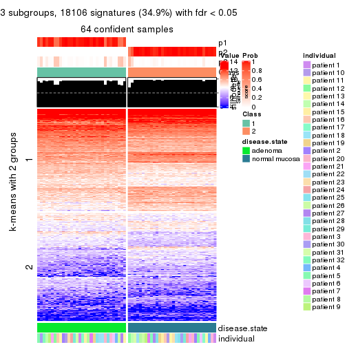</p>

</div>
<div id='tab-ATC-NMF-get-signatures-no-scale-3'>
<pre><code class="r">get_signatures(res, k = 4, scale_rows = FALSE)
</code></pre>

<p></p>

</div>
<div id='tab-ATC-NMF-get-signatures-no-scale-4'>
<pre><code class="r">get_signatures(res, k = 5, scale_rows = FALSE)
</code></pre>

<p></p>

</div>
<div id='tab-ATC-NMF-get-signatures-no-scale-5'>
<pre><code class="r">get_signatures(res, k = 6, scale_rows = FALSE)
</code></pre>

<p></p>

</div>
</div>


Compare the overlap of signatures from different k:

```r
compare_signatures(res)
```


`get_signature()` returns a data frame invisibly. TO get the list of signatures, the function
call should be assigned to a variable explicitly. In following code, if `plot` argument is set
to `FALSE`, no heatmap is plotted while only the differential analysis is performed.

```r
# code only for demonstration
tb = get_signature(res, k = ..., plot = FALSE)
```

An example of the output of `tb` is:

```
#>   which_row         fdr    mean_1    mean_2 scaled_mean_1 scaled_mean_2 km
#> 1        38 0.042760348  8.373488  9.131774    -0.5533452     0.5164555  1
#> 2        40 0.018707592  7.106213  8.469186    -0.6173731     0.5762149  1
#> 3        55 0.019134737 10.221463 11.207825    -0.6159697     0.5749050  1
#> 4        59 0.006059896  5.921854  7.869574    -0.6899429     0.6439467  1
#> 5        60 0.018055526  8.928898 10.211722    -0.6204761     0.5791110  1
#> 6        98 0.009384629 15.714769 14.887706     0.6635654    -0.6193277  2
...
```

The columns in `tb` are:

1. `which_row`: row indices corresponding to the input matrix.
2. `fdr`: FDR for the differential test. 
3. `mean_x`: The mean value in group x.
4. `scaled_mean_x`: The mean value in group x after rows are scaled.
5. `km`: Row groups if k-means clustering is applied to rows.


UMAP plot which shows how samples are separated.


<script>
$( function() {
	$( '#tabs-ATC-NMF-dimension-reduction' ).tabs();
} );
</script>
<div id='tabs-ATC-NMF-dimension-reduction'>
<ul>
<li><a href='#tab-ATC-NMF-dimension-reduction-1'>k = 2</a></li>
<li><a href='#tab-ATC-NMF-dimension-reduction-2'>k = 3</a></li>
<li><a href='#tab-ATC-NMF-dimension-reduction-3'>k = 4</a></li>
<li><a href='#tab-ATC-NMF-dimension-reduction-4'>k = 5</a></li>
<li><a href='#tab-ATC-NMF-dimension-reduction-5'>k = 6</a></li>
</ul>
<div id='tab-ATC-NMF-dimension-reduction-1'>
<pre><code class="r">dimension_reduction(res, k = 2, method = &quot;UMAP&quot;)
</code></pre>

<p></p>

</div>
<div id='tab-ATC-NMF-dimension-reduction-2'>
<pre><code class="r">dimension_reduction(res, k = 3, method = &quot;UMAP&quot;)
</code></pre>

<p></p>

</div>
<div id='tab-ATC-NMF-dimension-reduction-3'>
<pre><code class="r">dimension_reduction(res, k = 4, method = &quot;UMAP&quot;)
</code></pre>

<p></p>

</div>
<div id='tab-ATC-NMF-dimension-reduction-4'>
<pre><code class="r">dimension_reduction(res, k = 5, method = &quot;UMAP&quot;)
</code></pre>

<p></p>

</div>
<div id='tab-ATC-NMF-dimension-reduction-5'>
<pre><code class="r">dimension_reduction(res, k = 6, method = &quot;UMAP&quot;)
</code></pre>

<p></p>

</div>
</div>


Following heatmap shows how subgroups are split when increasing `k`:

```r
collect_classes(res)
```


Test correlation between subgroups and known annotations. If the known
annotation is numeric, one-way ANOVA test is applied, and if the known
annotation is discrete, chi-squared contingency table test is applied.

```r
test_to_known_factors(res)
```

```
#>          n disease.state(p) individual(p) k
#> ATC:NMF 64         9.19e-15         1.000 2
#> ATC:NMF 64         9.19e-15         1.000 3
#> ATC:NMF 57         3.27e-13         1.000 4
#> ATC:NMF 54         1.88e-12         0.997 5
#> ATC:NMF 50         1.39e-11         0.993 6
```


If matrix rows can be associated to genes, consider to use `functional_enrichment(res,
...)` to perform function enrichment for the signature genes. See [this vignette](http://bioconductor.org/packages/devel/bioc/vignettes/cola/inst/doc/functional_enrichment.html) for more detailed explanations.


 

## Session info


```r
sessionInfo()
```

```
#> R version 3.6.0 (2019-04-26)
#> Platform: x86_64-pc-linux-gnu (64-bit)
#> Running under: CentOS Linux 7 (Core)
#> 
#> Matrix products: default
#> BLAS:   /usr/lib64/libblas.so.3.4.2
#> LAPACK: /usr/lib64/liblapack.so.3.4.2
#> 
#> locale:
#>  [1] LC_CTYPE=en_GB.UTF-8       LC_NUMERIC=C               LC_TIME=en_GB.UTF-8       
#>  [4] LC_COLLATE=en_GB.UTF-8     LC_MONETARY=en_GB.UTF-8    LC_MESSAGES=en_GB.UTF-8   
#>  [7] LC_PAPER=en_GB.UTF-8       LC_NAME=C                  LC_ADDRESS=C              
#> [10] LC_TELEPHONE=C             LC_MEASUREMENT=en_GB.UTF-8 LC_IDENTIFICATION=C       
#> 
#> attached base packages:
#> [1] grid      stats     graphics  grDevices utils     datasets  methods   base     
#> 
#> other attached packages:
#> [1] genefilter_1.66.0    ComplexHeatmap_2.3.1 markdown_1.1         knitr_1.26          
#> [5] GetoptLong_0.1.7     cola_1.3.2          
#> 
#> loaded via a namespace (and not attached):
#>  [1] circlize_0.4.8       shape_1.4.4          xfun_0.11            slam_0.1-46         
#>  [5] lattice_0.20-38      splines_3.6.0        colorspace_1.4-1     vctrs_0.2.0         
#>  [9] stats4_3.6.0         blob_1.2.0           XML_3.98-1.20        survival_2.44-1.1   
#> [13] rlang_0.4.2          pillar_1.4.2         DBI_1.0.0            BiocGenerics_0.30.0 
#> [17] bit64_0.9-7          RColorBrewer_1.1-2   matrixStats_0.55.0   stringr_1.4.0       
#> [21] GlobalOptions_0.1.1  evaluate_0.14        memoise_1.1.0        Biobase_2.44.0      
#> [25] IRanges_2.18.3       parallel_3.6.0       AnnotationDbi_1.46.1 highr_0.8           
#> [29] Rcpp_1.0.3           xtable_1.8-4         backports_1.1.5      S4Vectors_0.22.1    
#> [33] annotate_1.62.0      skmeans_0.2-11       bit_1.1-14           microbenchmark_1.4-7
#> [37] brew_1.0-6           impute_1.58.0        rjson_0.2.20         png_0.1-7           
#> [41] digest_0.6.23        stringi_1.4.3        polyclip_1.10-0      clue_0.3-57         
#> [45] tools_3.6.0          bitops_1.0-6         magrittr_1.5         eulerr_6.0.0        
#> [49] RCurl_1.95-4.12      RSQLite_2.1.4        tibble_2.1.3         cluster_2.1.0       
#> [53] crayon_1.3.4         pkgconfig_2.0.3      zeallot_0.1.0        Matrix_1.2-17       
#> [57] xml2_1.2.2           httr_1.4.1           R6_2.4.1             mclust_5.4.5        
#> [61] compiler_3.6.0
```


